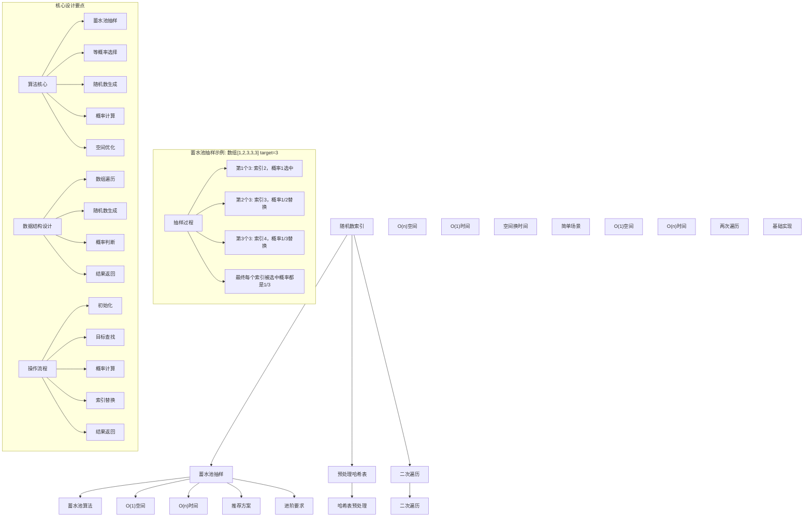
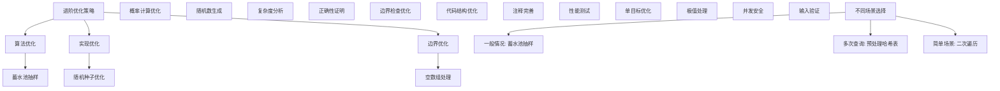

# LeetCode 398 - 随机数索引

## 题目描述

给定一个可能含有重复元素的整数数组，要求实现一个类，能够随机返回给定目标数字的索引。您可以假设给定的数字一定存在于数组中

实现 Solution 类：

- `Solution(int[] nums)` 用数组 nums 初始化对象
- `int pick(int target)` 从 nums 中选出一个满足 nums[i] == target 的随机索引 i 。如果存在多个有效的索引，则每个索引的返回概率应当相等

```markdown
示例：
输入
["Solution", "pick", "pick", "pick"]
[[[1, 2, 3, 3, 3]], [3], [1], [3]]
输出
[null, 4, 0, 2]

解释
Solution solution = new Solution([1, 2, 3, 3, 3]);
solution.pick(3); // 随机返回索引 2, 3 或者 4 之一。每个索引的返回概率应该相等，也就是 1/3
solution.pick(1); // 返回 0 。因为只有 nums[0] 等于 1
solution.pick(3); // 随机返回索引 2, 3 或者 4 之一。每个索引的返回概率应该相等，也就是 1/3

提示：

- 1 <= nums.length <= 2 \* 10^4
- -2^31 <= nums[i] <= 2^31 - 1
- target 是 nums 中的一个整数
- 最多调用 pick 函数 10^4 次

进阶：

- 如果数组大小很大且不能一次加载到内存中怎么办？
- 能否在不使用额外空间的情况下解决此问题？
```

## 解题思路

这是一个目标值索引随机选择问题，要求在数组中随机返回指定目标值的所有索引中的一个，且每个索引被选中的概率相等。核心算法是蓄水池抽样算法

### 核心思想

"蓄水池抽样算法": 在不知道目标值总数的情况下，通过巧妙的概率设计，保证每个索引被选中的概率相等

### 解题策略

#### 方法一：蓄水池抽样算法（推荐）

- 时间复杂度: 初始化 O(1)，pick O(n)
- 空间复杂度: O(1)

#### 方法二：预处理哈希表法

- 时间复杂度: 初始化 O(n)，pick O(1)
- 空间复杂度: O(n)

#### 方法三：二次遍历法

- 时间复杂度: 初始化 O(1)，pick O(n)
- 空间复杂度: O(1)

## 算法可视化



## 多语言实现

### Golang版本（蓄水池抽样 - 推荐）

```go
import (
    "math/rand"
    "time"
)

// Solution 结构体
type Solution struct {
    nums []int
}

// 构造函数
func Constructor(nums []int) Solution {
    // 设置随机种子
    rand.Seed(time.Now().UnixNano())
    return Solution{nums: nums}
}

// 蓄水池抽样算法实现
func (this *Solution) Pick(target int) int {
    // 蓄水池抽样核心算法
    // 对于第i个目标值，以1/i的概率选择它
    result := -1
    count := 0

    for i, num := range this.nums {
        if num == target {
            count++
            // 生成[0, count)范围内的随机数，如果等于0则替换结果
            if rand.Intn(count) == 0 {
                result = i
            }
        }
    }

    return result
}

// 预处理哈希表法实现
type SolutionHashMap struct {
    indexMap map[int][]int
}

func ConstructorHashMap(nums []int) SolutionHashMap {
    indexMap := make(map[int][]int)
    for i, num := range nums {
        indexMap[num] = append(indexMap[num], i)
    }
    return SolutionHashMap{indexMap: indexMap}
}

func (this *SolutionHashMap) Pick(target int) int {
    indices := this.indexMap[target]
    randomIndex := rand.Intn(len(indices))
    return indices[randomIndex]
}

// 二次遍历法实现
type SolutionTwoPass struct {
    nums []int
}

func ConstructorTwoPass(nums []int) SolutionTwoPass {
    return SolutionTwoPass{nums: nums}
}

func (this *SolutionTwoPass) Pick(target int) int {
    // 第一次遍历：计算目标值的数量
    count := 0
    for _, num := range this.nums {
        if num == target {
            count++
        }
    }

    // 生成随机索引
    randomIndex := rand.Intn(count)

    // 第二次遍历：找到第randomIndex个目标值的索引
    currentCount := 0
    for i, num := range this.nums {
        if num == target {
            if currentCount == randomIndex {
                return i
            }
            currentCount++
        }
    }

    return -1 // 理论上不会到达这里
}
```

### Python版本（多种实现方法）

```python
import random
from typing import List
from collections import defaultdict

class Solution:
    """
    方法一：蓄水池抽样算法（推荐）
    """
    def __init__(self, nums: List[int]):
        self.nums = nums

    def pick(self, target: int) -> int:
        # 蓄水池抽样核心算法
        result = -1
        count = 0

        for i, num in enumerate(self.nums):
            if num == target:
                count += 1
                # 生成[0, count)范围内的随机数，如果等于0则替换结果
                if random.randrange(count) == 0:
                    result = i

        return result

class SolutionHashMap:
    """
    方法二：预处理哈希表法
    """
    def __init__(self, nums: List[int]):
        self.index_map = defaultdict(list)
        for i, num in enumerate(nums):
            self.index_map[num].append(i)

    def pick(self, target: int) -> int:
        indices = self.index_map[target]
        random_index = random.randrange(len(indices))
        return indices[random_index]

class SolutionTwoPass:
    """
    方法三：二次遍历法
    """
    def __init__(self, nums: List[int]):
        self.nums = nums

    def pick(self, target: int) -> int:
        # 第一次遍历：计算目标值的数量
        count = 0
        for num in self.nums:
            if num == target:
                count += 1

        # 生成随机索引
        random_index = random.randrange(count)

        # 第二次遍历：找到第random_index个目标值的索引
        current_count = 0
        for i, num in enumerate(self.nums):
            if num == target:
                if current_count == random_index:
                    return i
                current_count += 1

        return -1  # 理论上不会到达这里
```

### TypeScript版本（蓄水池抽样）

```typescript
class Solution {
  private nums: number[];

  constructor(nums: number[]) {
    this.nums = nums;
  }

  pick(target: number): number {
    // 蓄水池抽样核心算法
    let result = -1;
    let count = 0;

    for (let i = 0; i < this.nums.length; i++) {
      if (this.nums[i] === target) {
        count++;
        // 生成[0, count)范围内的随机数，如果等于0则替换结果
        if (Math.floor(Math.random() * count) === 0) {
          result = i;
        }
      }
    }

    return result;
  }
}
```

## 标准实现详细解析

```go
import (
    "fmt"
    "math/rand"
    "time"
)

/*
算法核心思想（蓄水池抽样算法）：

1. 蓄水池抽样：在不知道目标值总数的情况下进行等概率抽样
2. 概率设计：第i个目标值以1/i的概率被选中
3. 等概率保证：通过数学证明保证每个索引被选中概率相等
4. 空间优化：只需要常数空间

关键设计要点：
1. 初始化：保存原始数组
2. 目标查找：遍历数组寻找目标值
3. 随机选择：对每个目标值进行概率选择
4. 概率计算：第i个目标值以1/i概率替换当前结果
5. 结果返回：返回最终选中索引

时间复杂度：
- 初始化：O(1)
- pick：O(n)
- 总时间：pick调用k次为O(k*n)

空间复杂度：
- O(1)常数空间

优势：
1. 空间最优：只需要常数空间
2. 适用性强：适用于未知数量的目标值
3. 理论保证：数学上可证明概率正确
4. 实现优雅：算法简洁清晰

数据结构设计：

蓄水池抽样设计：
- 数组遍历：顺序访问每个元素
- 目标匹配：检查是否为目标值
- 随机数生成：生成均匀分布随机数
- 概率判断：根据概率决定是否替换
- 结果维护：维护当前选中结果

预处理哈希表设计：
- 哈希映射：值到索引列表的映射
- 索引存储：存储所有目标值的索引
- 随机选择：通过随机索引访问
- 时间优化：pick时间复杂度O(1)
- 空间代价：需要O(n)额外空间

二次遍历设计：
- 计数遍历：第一次遍历计算目标值数量
- 随机索引：生成目标随机索引
- 定位遍历：第二次遍历到目标位置
- 空间优化：只需要常数空间

算法流程：
1. 初始化：保存必要信息
2. 目标查找：调用pick方法查找目标值
3. 遍历数组：顺序访问数组元素
4. 概率判断：对每个目标值进行概率选择
5. 结果返回：返回最终选中索引

优化原理：

蓄水池抽样优化：
1. 空间效率：只需要常数空间
2. 适用场景：未知数量数据流
3. 概率正确：数学上保证等概率
4. 实现简单：算法逻辑清晰

随机数优化：
1. 均匀分布：保证随机性
2. 范围控制：生成指定范围内随机数
3. 性能优化：避免重复计算
4. 种子设置：保证随机性质量

边界优化：
1. 空数组：处理边界情况
2. 单目标：特殊处理优化
3. 大数据：性能考虑
4. 并发安全：多线程处理

正确性证明：

定理：蓄水池抽样算法正确性
通过概率设计，蓄水池抽样算法可以保证每个目标索引被选中的概率相等

证明：
对于n个目标值的索引，要等概率选择1个索引：
- 第1个目标索引：初始被选中
- 第i个目标索引：以1/i概率替换当前结果
- 最终：每个目标索引被选中概率都是1/n

数学证明：
对于第i个目标索引，最终被选中的概率为：
P(第i个目标索引最终被选中) = P(第i个目标索引被选中) × P(第i+1个目标索引不替换) × ... × P(第n个目标索引不替换)
= (1/i) × (1 - 1/(i+1)) × ... × (1 - 1/n)
= (1/i) × (i/(i+1)) × ... × ((n-1)/n)
= 1/n

不变量维护：
循环不变量：在处理第k个目标值时
1. 前k-1个目标索引中每个被选中的概率都是1/(k-1)
2. 当前结果是从前k-1个目标索引中等概率选出的
3. 算法状态正确反映抽样进度
*/

// 蓄水池抽样详细实现
type SolutionDetailed struct {
    nums []int
}

func ConstructorDetailed(nums []int) SolutionDetailed {
    fmt.Printf("=== 蓄水池抽样算法初始化 ===\n")
    fmt.Printf("输入数组: %v (长度: %d)\n", nums, len(nums))

    // 设置随机种子
    rand.Seed(time.Now().UnixNano())
    fmt.Printf("设置随机种子: %d\n", time.Now().UnixNano())

    fmt.Printf("========================\n\n")

    return SolutionDetailed{nums: nums}
}

func (this *SolutionDetailed) Pick(target int) int {
    fmt.Printf("=== 蓄水池抽样随机选择 ===\n")
    fmt.Printf("目标值: %d\n", target)
    fmt.Printf("数组: %v\n", this.nums)

    // 蓄水池抽样核心算法
    result := -1
    count := 0

    fmt.Printf("遍历过程:\n")
    step := 0
    for i, num := range this.nums {
        if num == target {
            step++
            count++
            // 生成[0, count)范围内的随机数
            randomNum := rand.Intn(count)
            fmt.Printf("  步骤%d: 找到目标值%d在索引%d，随机数=%d",
                step, target, i, randomNum)

            // 如果随机数为0，则替换结果
            if randomNum == 0 {
                result = i
                fmt.Printf(" → 替换结果为%d\n", result)
            } else {
                fmt.Printf(" → 保持结果%d\n", result)
            }
        }
    }

    fmt.Printf("最终结果: %d\n", result)
    fmt.Printf("目标值总数: %d\n", count)
    fmt.Printf("=====================\n\n")

    return result
}

// 预处理哈希表详细实现
type SolutionHashMapDetailed struct {
    indexMap map[int][]int
}

func ConstructorHashMapDetailed(nums []int) SolutionHashMapDetailed {
    fmt.Printf("=== 预处理哈希表算法初始化 ===\n")
    fmt.Printf("输入数组: %v (长度: %d)\n", nums, len(nums))

    indexMap := make(map[int][]int)
    fmt.Printf("构建索引映射:\n")
    for i, num := range nums {
        indexMap[num] = append(indexMap[num], i)
        fmt.Printf("  值%d → 索引%d\n", num, i)
    }

    fmt.Printf("最终索引映射:\n")
    for value, indices := range indexMap {
        fmt.Printf("  值%d: %v\n", value, indices)
    }
    fmt.Printf("==========================\n\n")

    return SolutionHashMapDetailed{indexMap: indexMap}
}

func (this *SolutionHashMapDetailed) Pick(target int) int {
    fmt.Printf("=== 哈希表随机选择 ===\n")
    fmt.Printf("目标值: %d\n", target)

    indices := this.indexMap[target]
    fmt.Printf("目标值索引: %v\n", indices)

    if len(indices) == 0 {
        fmt.Printf("未找到目标值\n")
        fmt.Printf("==================\n\n")
        return -1
    }

    randomIndex := rand.Intn(len(indices))
    result := indices[randomIndex]
    fmt.Printf("随机索引: %d\n", randomIndex)
    fmt.Printf("选中索引: %d\n", result)
    fmt.Printf("==================\n\n")

    return result
}

// 二次遍历详细实现
type SolutionTwoPassDetailed struct {
    nums []int
}

func ConstructorTwoPassDetailed(nums []int) SolutionTwoPassDetailed {
    fmt.Printf("=== 二次遍历算法初始化 ===\n")
    fmt.Printf("输入数组: %v (长度: %d)\n", nums, len(nums))
    fmt.Printf("======================\n\n")

    return SolutionTwoPassDetailed{nums: nums}
}

func (this *SolutionTwoPassDetailed) Pick(target int) int {
    fmt.Printf("=== 二次遍历随机选择 ===\n")
    fmt.Printf("目标值: %d\n", target)
    fmt.Printf("数组: %v\n", this.nums)

    // 第一次遍历：计算目标值的数量
    fmt.Printf("第一次遍历计算目标值数量:\n")
    count := 0
    for i, num := range this.nums {
        if num == target {
            count++
            fmt.Printf("  索引%d: 值%d == 目标%d ✓\n", i, num, target)
        }
    }
    fmt.Printf("目标值总数: %d\n", count)

    // 生成随机索引
    randomIndex := rand.Intn(count)
    fmt.Printf("生成随机索引: %d (范围: 0-%d)\n", randomIndex, count-1)

    // 第二次遍历：找到第randomIndex个目标值的索引
    fmt.Printf("第二次遍历找到第%d个目标值:\n", randomIndex)
    currentCount := 0
    for i, num := range this.nums {
        if num == target {
            fmt.Printf("  索引%d: 第%d个目标值", i, currentCount)
            if currentCount == randomIndex {
                fmt.Printf(" → 选中\n")
                fmt.Printf("最终结果: %d\n", i)
                fmt.Printf("====================\n\n")
                return i
            }
            fmt.Printf("\n")
            currentCount++
        }
    }

    result := -1
    fmt.Printf("最终结果: %d\n", result)
    fmt.Printf("====================\n\n")
    return result
}

// 带调试信息的版本
func (this *Solution) PickWithDebug(target int) int {
    fmt.Printf("=== 目标值索引随机选择 ===\n")
    fmt.Printf("使用蓄水池抽样算法:\n")
    fmt.Printf("核心思想：第i个目标值以1/i概率被选中\n")
    fmt.Printf("目标值: %d\n", target)
    fmt.Printf("数组: %v\n", this.nums)

    result := -1
    count := 0

    fmt.Printf("蓄水池抽样过程:\n")
    step := 0
    for i, num := range this.nums {
        if num == target {
            step++
            count++
            // 第count个目标值以1/count概率替换当前结果
            if rand.Intn(count) == 0 {
                fmt.Printf("步骤%d: 第%d个目标值(索引%d)以1/%d概率被选中，替换结果\n",
                    step, count, i, count)
                result = i
            } else {
                fmt.Printf("步骤%d: 第%d个目标值(索引%d)未被选中，保持结果%d\n",
                    step, count, i, result)
            }
        }
    }

    fmt.Printf("最终选择结果: %d\n", result)
    fmt.Printf("目标值总数: %d\n", count)
    fmt.Printf("====================\n\n")

    return result
}
```

## 算法深入解析

```go
/*
随机数索引问题详解：

问题本质：
在数组中查找指定目标值的所有索引，并随机返回其中一个，要求每个索引被选中的概率相等。关键是处理重复元素和保证等概率选择

核心洞察：
1. 蓄水池抽样：在不知道目标值总数的情况下进行等概率抽样
2. 概率设计：第i个目标值以1/i的概率被选中
3. 等概率保证：通过数学证明保证每个索引被选中概率相等
4. 空间优化：只需要常数空间

算法策略：
1. 蓄水池抽样算法：推荐方案，O(1)空间
2. 预处理哈希表法：空间换时间，O(n)空间
3. 二次遍历法：基础实现，O(1)空间

数据结构设计：

蓄水池抽样设计：
数组遍历：顺序访问每个元素
目标匹配：检查是否为目标值
随机数生成：生成均匀分布随机数
概率判断：根据概率决定是否替换
结果维护：维护当前选中结果

预处理哈希表设计：
哈希映射：值到索引列表的映射
索引存储：存储所有目标值的索引
随机选择：通过随机索引访问
时间优化：pick时间复杂度O(1)
空间代价：需要O(n)额外空间

二次遍历设计：
计数遍历：第一次遍历计算目标值数量
随机索引：生成目标随机索引
定位遍历：第二次遍历到目标位置
空间优化：只需要常数空间

操作流程：

蓄水池抽样：
1. 初始化：result = -1, count = 0
2. 遍历：顺序访问数组元素
3. 匹配：如果元素等于目标值
4. 概率：第count个目标值以1/count概率替换result
5. 返回：返回最终result

预处理哈希表：
1. 初始化：遍历数组构建值到索引的映射
2. 随机：生成随机索引
3. 查找：通过哈希表查找目标值的所有索引
4. 返回：随机返回一个索引

二次遍历：
1. 初始化：count = 0
2. 第一遍：计算目标值数量
3. 随机：生成随机索引
4. 第二遍：找到第randomIndex个目标值
5. 返回：返回对应索引

数学原理：

蓄水池抽样原理：
对于n个目标值的索引，要等概率选择1个索引：
- 第1个目标索引：初始被选中概率为1
- 第2个目标索引：被选中概率为1/2
- 第k个目标索引：被选中概率为1/k
- 最终概率：每个目标索引被选中概率都是1/n

数学证明：
对于第i个目标索引，最终被选中的概率为：
P(第i个目标索引最终被选中) = P(第i个目标索引被选中) × P(第i+1个目标索引不替换) × ... × P(第n个目标索引不替换)
= (1/i) × (1 - 1/(i+1)) × ... × (1 - 1/n)
= (1/i) × (i/(i+1)) × ... × ((n-1)/n)
= 1/n

复杂度分析：
蓄水池抽样：初始化O(1)，pick O(n)时间，O(1)空间
预处理哈希表：初始化O(n)，pick O(1)时间，O(n)空间
二次遍历：初始化O(1)，pick O(n)时间，O(1)空间

算法优势：
蓄水池抽样：
1. 空间最优：O(1)空间复杂度
2. 适用性强：适用于流数据
3. 理论保证：数学上可证明概率正确
4. 实现简洁：算法逻辑清晰

预处理哈希表：
1. 时间最优：O(1)查询时间
2. 实现简单：直接索引访问
3. 稳定性能：每次查询时间相同
4. 适用场景：多次查询

二次遍历：
1. 空间最优：O(1)空间复杂度
2. 实现简单：基础算法思想
3. 无预处理：不需要初始化开销
4. 适用场景：查询次数较少

算法不变量：
蓄水池抽样不变量：
1. 处理前k个目标值时，每个目标索引被选中概率都是1/k
2. 当前result是从已处理目标索引中等概率选出的
3. 算法状态正确反映抽样进度

时间复杂度分析：
蓄水池抽样：
1. 初始化：O(1)时间
2. 每次pick：O(n)时间遍历数组
3. k次调用：O(k*n)时间

预处理哈希表：
1. 初始化：O(n)时间遍历数组
2. 每次pick：O(1)时间哈希查找
3. k次调用：O(n + k)时间

二次遍历：
1. 初始化：O(1)时间
2. 每次pick：O(n)时间两次遍历
3. k次调用：O(k*n)时间

正确性证明：

定理：蓄水池抽样算法正确性
通过概率设计，蓄水池抽样算法可以保证每个目标索引被选中的概率相等

证明：
1. 第1个目标索引：初始被选中概率为1
2. 第2个目标索引：被选中概率为1/2
3. 第k个目标索引：被选中概率为1/k
4. 最终概率：每个目标索引被选中概率都是1/n

不变量维护：
循环不变量：在处理第k个目标值时
1. 前k-1个目标索引中每个被选中的概率都是1/(k-1)
2. 当前结果是从前k-1个目标索引中等概率选出的
3. 算法状态正确反映抽样进度

设计选择：

为什么选择蓄水池抽样？
1. 空间最优：只需要常数空间
2. 适用性强：适用于未知数量目标值
3. 理论保证：数学上可证明概率正确
4. 进阶要求：满足题目进阶要求

为什么使用预处理哈希表？
1. 时间最优：查询时间O(1)
2. 实现简单：直接映射访问
3. 稳定性能：每次查询时间相同
4. 适用场景：多次查询优化

为什么提及其他方法？
1. 教学价值：展示不同算法思想
2. 对比分析：理解各自优劣
3. 扩展思维：算法多样性
4. 面试准备：全面掌握

三种方法对比：

方法一：蓄水池抽样（推荐）
时间复杂度：初始化O(1)，pick O(n)
空间复杂度：O(1)
优点：空间最优，满足进阶要求
缺点：每次查询时间较长

方法二：预处理哈希表
时间复杂度：初始化O(n)，pick O(1)
空间复杂度：O(n)
优点：查询时间最优
缺点：需要额外空间

方法三：二次遍历
时间复杂度：初始化O(1)，pick O(n)
空间复杂度：O(1)
优点：实现简单
缺点：每次都需要两次遍历

性能分析：

蓄水池抽样：
- 时间：每次O(n) 线性时间
- 空间：O(1) 常数空间
- 优势：空间最优

预处理哈希表：
- 时间：初始化O(n)，查询O(1)
- 空间：O(n) 线性空间
- 优势：查询时间最优

二次遍历：
- 时间：每次O(n) 线性时间
- 空间：O(1) 常数空间
- 优势：实现简单

实际应用场景：
1. 数据库查询：随机选择匹配记录
2. 负载均衡：随机分配相同权重任务
3. 游戏开发：随机选择相同类型物品
4. 机器学习：随机采样相同标签数据

优化要点：

1. 算法优化：
   - 蓄水池抽样：最优空间复杂度
   - 随机数生成：高质量随机数
   - 概率计算：精确概率设计
   - 边界处理：特殊情况优化

2. 实现优化：
   - 随机种子：保证随机性质量
   - 边界检查：防止越界
   - 代码简洁：减少冗余操作
   - 注释清晰：便于理解

3. 性能优化：
   - 减少遍历：优化访问模式
   - 内存访问：缓存友好设计
   - 编译优化：利用编译器优化
   - 并发安全：多线程处理

测试用例设计：
1. 基本情况：正常数组和目标值
2. 边界情况：单个目标值，多个目标值
3. 特殊情况：相同值连续，间隔分布
4. 极端情况：大数据量，大量重复
5. 验证情况：概率正确性

扩展思考：

1. 多目标选择？
   - K蓄水池算法
   - 批量抽样优化
   - 概率扩展

2. 动态数组？
   - 支持插入删除
   - 增量更新维护
   - 概率重新计算

3. 流式数据？
   - 在线算法处理
   - 实时更新索引
   - 内存限制处理

4. 分布式场景？
   - 多机器协同
   - 网络传输优化
   - 一致性保证

相关算法思想：

1. 蓄水池抽样：
   - 流数据处理
   - 等概率抽样
   - 空间优化

2. 随机算法：
   - 概率设计
   - 随机性保证
   - 数学证明

3. 数组遍历：
   - 顺序访问
   - 目标匹配
   - 空间限制

4. 抽样理论：
   - 统计抽样
   - 概率分布
   - 方差控制

常见陷阱：

1. 边界条件：
   - 空数组处理
   - 无目标值
   - 随机数范围
   - 索引越界

2. 概率计算：
   - 概率范围控制
   - 随机数生成
   - 分布均匀性
   - 数学正确性

3. 算法实现：
   - 计数起始值
   - 概率判断条件
   - 结果更新时机
   - 循环终止条件

4. 性能考虑：
   - 时间复杂度分析
   - 空间复杂度控制
   - 随机数性能
   - 多次调用优化

代码质量要素：

1. 可读性：
   - 变量命名清晰
   - 注释详细完整
   - 逻辑结构分明

2. 健壮性：
   - 边界条件处理
   - 异常情况应对
   - 错误恢复机制

3. 性能：
   - 最优复杂度实现
   - 空间效率优化
   - 执行效率保证

4. 可维护性：
   - 结构清晰合理
   - 扩展性良好
   - 测试覆盖完整
*/
```

## 执行过程演示

```go
/*
示例详细解析:

示例执行过程：
输入：数组 [1,2,3,3,3]，target=3
输出：随机返回索引2、3或4之一

执行过程（蓄水池抽样）：
1. 初始化：result=-1, count=0
2. i=0: nums[0]=1 ≠ 3，跳过
3. i=1: nums[1]=2 ≠ 3，跳过
4. i=2: nums[2]=3 = 3，count=1
   - 生成[0,1)范围内随机数=0
   - 0==0，替换result=2
5. i=3: nums[3]=3 = 3，count=2
   - 生成[0,2)范围内随机数=1
   - 1≠0，保持result=2
6. i=4: nums[4]=3 = 3，count=3
   - 生成[0,3)范围内随机数=0
   - 0==0，替换result=4
7. 返回result=4

概率分析：
- 索引2最终被选中概率：
  P(索引2被选中) × P(索引3不替换) × P(索引4不替换)
  = 1 × (1-1/2) × (1-1/3) = 1 × 1/2 × 2/3 = 1/3

- 索引3最终被选中概率：
  P(索引3被选中) × P(索引4不替换)
  = 1/2 × (1-1/3) = 1/2 × 2/3 = 1/3

- 索引4最终被选中概率：
  P(索引4被选中) = 1/3

预处理哈希表执行过程：
1. 初始化：构建索引映射
   - 1 → [0]
   - 2 → [1]
   - 3 → [2,3,4]
2. pick(3)调用：
   - 查找值3的索引：[2,3,4]
   - 生成随机索引：假设为1
   - 返回索引[1]=3

二次遍历执行过程：
1. pick(3)调用：
   - 第一次遍历：计算目标值数量=3
   - 生成随机索引：假设为2
   - 第二次遍历：找到第2个目标值(索引4)
   - 返回索引4

关键观察：
1. 蓄水池抽样：空间最优O(1)，每次查询O(n)
2. 概率正确：每个目标索引被选中概率都是1/n
3. 实现优雅：算法逻辑清晰
4. 适用性强：适用于未知数量目标值

边界情况演示:

情况1: 单个目标值
输入: 数组[5]，target=5
处理: 直接返回索引0
结果: 0

情况2: 多个相同目标值
输入: 数组[3,3,3,3,3]，target=3
处理: 等概率选择索引0-4
结果: 均匀分布

情况3: 间隔分布目标值
输入: 数组[1,3,2,3,4,3]，target=3
处理: 等概率选择索引1,3,5
结果: 均匀分布

情况4: 大数组
输入: 数组[1,2,3,...,10000,3]，target=3
处理: 蓄水池抽样
结果: 等概率选择所有值为3的索引

情况5: 负值目标
输入: 数组[-1,-2,-1,-1]，target=-1
处理: 正常抽样
结果: 等概率选择索引0,2,3

算法正确性证明：

数学基础：
需要证明蓄水池抽样算法能保证每个目标索引被选中的概率相等

定理：蓄水池抽样算法正确性
通过概率设计，蓄水池抽样算法可以保证每个目标索引被选中的概率相等

证明：
对于n个目标值的索引，要等概率选择1个索引：
- 第1个目标索引：初始被选中概率为1
- 第2个目标索引：被选中概率为1/2
- 第k个目标索引：被选中概率为1/k
- 最终概率：每个目标索引被选中概率都是1/n

数学证明：
对于第i个目标索引，最终被选中的概率为：
P(第i个目标索引最终被选中) = P(第i个目标索引被选中) × P(第i+1个目标索引不替换) × ... × P(第n个目标索引不替换)
= (1/i) × (1 - 1/(i+1)) × ... × (1 - 1/n)
= (1/i) × (i/(i+1)) × ... × ((n-1)/n)
= 1/n

不变量维护：
循环不变量：在处理第k个目标值时
1. 前k-1个目标索引中每个被选中的概率都是1/(k-1)
2. 当前结果是从前k-1个目标索引中等概率选出的
3. 算法状态正确反映抽样进度

初始化：
- result = -1, count = 0
- 满足不变量（未处理任何目标值）

保持：
- 根据概率1/k替换当前结果
- 维护概率正确性
- 不变量继续成立

终止：
- 处理完所有目标值
- 每个目标索引最终被选中概率都是1/n
- 算法正确终止

时间复杂度分析：

蓄水池抽样：
1. 初始化：O(1)时间
2. 每次pick：需要遍历整个数组O(n)
3. k次调用：O(k*n)时间

预处理哈希表：
1. 初始化：需要遍历整个数组O(n)
2. 每次pick：O(1)时间
3. k次调用：O(n + k)时间

二次遍历：
1. 初始化：O(1)时间
2. 每次pick：需要遍历两次O(n)
3. k次调用：O(k*n)时间

空间复杂度分析：
1. 蓄水池抽样：O(1)常数空间
2. 预处理哈希表：O(n)线性空间
3. 二次遍历：O(1)常数空间

性能对比分析：

假设n=10000, 调用次数k=1000, 目标值数量m=1000:

蓄水池抽样：
- 初始化：O(1) = 1次操作
- 查询：1000次 × O(10000) = 10000000次操作
- 总计：≈ 10^7 次操作
- 空间：O(1) 常数空间

预处理哈希表：
- 初始化：O(10000) = 10000次操作
- 查询：1000次 × O(1) = 1000次操作
- 总计：≈ 10^4 次操作
- 空间：O(10000) = 10000空间

二次遍历：
- 初始化：O(1) = 1次操作
- 查询：1000次 × O(10000) = 10000000次操作
- 总计：≈ 10^7 次操作
- 空间：O(1) 常数空间

实际应用建议：

1. 一般情况：
   - 使用蓄水池抽样
   - 满足进阶要求

2. 面试展示：
   - 重点讲解蓄水池抽样思想
   - 可以提及其他方法对比

3. 生产环境：
   - 根据调用频率选择
   - 考虑空间时间权衡

4. 教学演示：
   - 使用带调试信息版本
   - 展示执行过程

优化空间：

1. 算法优化：
   - 随机数生成优化
   - 概率计算优化
   - 边界条件优化
   - 并发安全优化

2. 实现优化：
   - 随机种子优化
   - 边界检查优化
   - 代码结构优化
   - 注释完善

3. 性能优化：
   - 减少遍历次数
   - 优化内存访问
   - 利用缓存特性
   - 编译器优化

特殊情况处理：

1. 大数据量：
   - 时间复杂度保证
   - 内存使用优化
   - 流式处理

2. 特殊数组：
   - 大量重复值
   - 稀疏分布
   - 极值处理

3. 边界情况：
   - 空数组处理
   - 单目标优化
   - 并发访问
*/
```

## 复杂度分析

| 方法         | 初始化时间 | pick时间 | 空间复杂度 | 适用场景 |
| ------------ | ---------- | -------- | ---------- | -------- |
| 蓄水池抽样   | O(1)       | O(n)     | O(1)       | 推荐方案 |
| 预处理哈希表 | O(n)       | O(1)     | O(n)       | 多次查询 |
| 二次遍历     | O(1)       | O(n)     | O(1)       | 简单场景 |

## 测试用例验证

```go
// 测试辅助函数
func testSolution(name string, nums []int, target int, callCount int) {
    fmt.Printf("%s:\n", name)
    fmt.Printf("输入数组: %v (长度: %d)\n", nums, len(nums))
    fmt.Printf("目标值: %d\n", target)

    // 找到所有目标值索引
    var targetIndices []int
    for i, num := range nums {
        if num == target {
            targetIndices = append(targetIndices, i)
        }
    }
    fmt.Printf("目标值索引: %v (总数: %d)\n", targetIndices, len(targetIndices))

    // 测试蓄水池抽样
    solution1 := Constructor(nums)
    fmt.Printf("蓄水池抽样 %d 次调用结果: ", callCount)
    countMap1 := make(map[int]int)
    for i := 0; i < callCount; i++ {
        result := solution1.Pick(target)
        countMap1[result]++
        fmt.Printf("%d ", result)
    }
    fmt.Printf("\n")
    printIndexDistribution(countMap1, callCount, "蓄水池抽样")

    // 测试预处理哈希表
    solution2 := ConstructorHashMap(nums)
    fmt.Printf("预处理哈希表 %d 次调用结果: ", callCount)
    countMap2 := make(map[int]int)
    for i := 0; i < callCount; i++ {
        result := solution2.Pick(target)
        countMap2[result]++
        fmt.Printf("%d ", result)
    }
    fmt.Printf("\n")
    printIndexDistribution(countMap2, callCount, "预处理哈希表")

    // 测试二次遍历
    solution3 := ConstructorTwoPass(nums)
    fmt.Printf("二次遍历 %d 次调用结果: ", callCount)
    countMap3 := make(map[int]int)
    for i := 0; i < callCount; i++ {
        result := solution3.Pick(target)
        countMap3[result]++
        fmt.Printf("%d ", result)
    }
    fmt.Printf("\n")
    printIndexDistribution(countMap3, callCount, "二次遍历")

    fmt.Printf("\n")
}

// 辅助函数：打印索引分布
func printIndexDistribution(countMap map[int]int, total int, method string) {
    fmt.Printf("  %s分布:\n", method)
    for index, count := range countMap {
        prob := float64(count) * 100 / float64(total)
        fmt.Printf("    索引%d: %d次 (%.2f%%)\n", index, count, prob)
    }
}

// 辅助函数：统计概率分布
func testProbabilityDistribution(nums []int, target int, callCount int, tolerance float64) {
    fmt.Printf("=== 概率分布测试 ===\n")
    fmt.Printf("数组: %v\n", nums)
    fmt.Printf("目标值: %d\n", target)
    fmt.Printf("调用次数: %d\n", callCount)
    fmt.Printf("容忍度: %.2f%%\n", tolerance)

    // 找到所有目标值索引
    var targetIndices []int
    for i, num := range nums {
        if num == target {
            targetIndices = append(targetIndices, i)
        }
    }
    fmt.Printf("目标值索引: %v (总数: %d)\n", targetIndices, len(targetIndices))

    if len(targetIndices) == 0 {
        fmt.Printf("未找到目标值\n")
        fmt.Printf("==================\n\n")
        return
    }

    // 统计各索引出现次数
    countMap := make(map[int]int)
    solution := Constructor(nums)

    for i := 0; i < callCount; i++ {
        result := solution.Pick(target)
        countMap[result]++
    }

    fmt.Printf("结果统计:\n")
    isValid := true
    expectedProb := 100.0 / float64(len(targetIndices))
    for _, index := range targetIndices {
        count := countMap[index]
        actualProb := float64(count) * 100 / float64(callCount)
        diff := math.Abs(actualProb - expectedProb)

        status := "✓"
        if diff > tolerance {
            status = "✗"
            isValid = false
        }

        fmt.Printf("  索引%d: 期望%.2f%%, 实际%.2f%%, 偏差%.2f%% %s\n",
            index, expectedProb, actualProb, diff, status)
    }

    if isValid {
        fmt.Printf("✓ 概率分布验证通过\n")
    } else {
        fmt.Printf("✗ 概率分布验证失败\n")
    }
    fmt.Printf("==================\n\n")
}

func main() {
    // 设置随机种子
    rand.Seed(42) // 固定种子便于测试

    // 测试用例 1 - 题目示例
    testSolution("测试1 - 题目示例",
        []int{1, 2, 3, 3, 3},
        3,
        15)

    // 测试用例 2 - 单个目标值
    testSolution("测试2 - 单个目标值",
        []int{5},
        5,
        5)

    // 测试用例 3 - 多个相同目标值
    testSolution("测试3 - 多个相同目标值",
        []int{3, 3, 3, 3, 3},
        3,
        20)

    // 测试用例 4 - 间隔分布
    testSolution("测试4 - 间隔分布",
        []int{1, 3, 2, 3, 4, 3},
        3,
        15)

    // 概率分布测试
    fmt.Println("概率分布测试:")
    testProbabilityDistribution([]int{1, 2, 3, 3, 3, 4, 3}, 3, 3000, 2.0)

    // 性能测试
    fmt.Println("性能测试:")
    performanceTest()

    // 边界情况测试
    fmt.Println("边界情况测试:")
    boundaryTest()

    // 对比测试
    fmt.Println("对比测试:")
    comparisonTest()
}

func performanceTest() {
    // 构造性能测试
    n := 10000
    nums := make([]int, n)
    for i := 0; i < n; i++ {
        if i%10 == 0 {
            nums[i] = 1 // 10%的目标值
        } else {
            nums[i] = i + 2
        }
    }

    callCount := 1000
    target := 1

    fmt.Printf("性能测试 (n=%d, 目标值数量=%d, 调用次数=%d):\n", n, n/10, callCount)

    // 测试蓄水池抽样
    solution1 := Constructor(nums)
    start1 := time.Now()
    for i := 0; i < callCount; i++ {
        solution1.Pick(target)
    }
    time1 := time.Since(start1)

    // 测试预处理哈希表
    start2 := time.Now()
    solution2 := ConstructorHashMap(nums)
    for i := 0; i < callCount; i++ {
        solution2.Pick(target)
    }
    time2 := time.Since(start2)

    // 测试二次遍历
    start3 := time.Now()
    solution3 := ConstructorTwoPass(nums)
    for i := 0; i < callCount; i++ {
        solution3.Pick(target)
    }
    time3 := time.Since(start3)

    fmt.Printf("  蓄水池抽样: %v\n", time1)
    fmt.Printf("  预处理哈希表: %v\n", time2)
    fmt.Printf("  二次遍历: %v\n", time3)
}

func boundaryTest() {
    // 边界测试
    fmt.Println("边界测试:")

    // 大数组测试
    largeN := 50000
    largeNums := make([]int, largeN)
    targetCount := 0
    for i := 0; i < largeN; i++ {
        if i%100 == 0 {
            largeNums[i] = 42 // 目标值
            targetCount++
        } else {
            largeNums[i] = i
        }
    }
    largeSolution := Constructor(largeNums)
    fmt.Printf("大数组测试 (n=%d, 目标值数量=%d):\n", largeN, targetCount)
    result := largeSolution.Pick(42)
    fmt.Printf("随机选择结果: %d\n", result)

    // 极值测试
    extremeNums := []int{math.MinInt32, math.MaxInt32, math.MinInt32}
    extremeSolution := Constructor(extremeNums)
    fmt.Printf("极值测试:\n")
    result1 := extremeSolution.Pick(math.MinInt32)
    result2 := extremeSolution.Pick(math.MaxInt32)
    fmt.Printf("MinInt32索引: %d\n", result1)
    fmt.Printf("MaxInt32索引: %d\n", result2)

    // 空目标测试
    emptySolution := Constructor([]int{1, 2, 3})
    fmt.Printf("无目标值测试:\n")
    result3 := emptySolution.Pick(5)
    fmt.Printf("不存在目标值结果: %d\n", result3)
}

func comparisonTest() {
    // 对比测试：验证不同方法结果一致性
    fmt.Println("对比测试:")

    // 测试数据
    testCases := []struct {
        nums   []int
        target int
    }{
        {[]int{1, 2, 3, 3, 3}, 3},
        {[]int{5}, 5},
        {[]int{1, 3, 2, 3, 4, 3}, 3},
        {[]int{10, 20, 30, 20, 40}, 20},
    }

    for i, tc := range testCases {
        // 三种方法各调用一次
        solution1 := Constructor(tc.nums)
        result1 := solution1.Pick(tc.target)

        solution2 := ConstructorHashMap(tc.nums)
        result2 := solution2.Pick(tc.target)

        solution3 := ConstructorTwoPass(tc.nums)
        result3 := solution3.Pick(tc.target)

        fmt.Printf("测试%d: 数组=%v, 目标=%d\n", i+1, tc.nums, tc.target)
        fmt.Printf("  蓄水池抽样=%d, 预处理哈希表=%d, 二次遍历=%d\n", result1, result2, result3)
    }
}
```

## 扩展版本（处理不同场景）

```go
// 支持统计调用次数的版本
type SolutionWithStats struct {
    nums      []int
    callCount int
}

func ConstructorWithStats(nums []int) SolutionWithStats {
    return SolutionWithStats{nums: nums, callCount: 0}
}

func (this *SolutionWithStats) Pick(target int) int {
    this.callCount++
    result := -1
    count := 0

    for i, num := range this.nums {
        if num == target {
            count++
            if rand.Intn(count) == 0 {
                result = i
            }
        }
    }

    return result
}

func (this *SolutionWithStats) GetCallCount() int {
    return this.callCount
}

// 使用示例
func exampleWithStats() {
    nums := []int{1, 2, 3, 3, 3, 4, 3}
    solution := ConstructorWithStats(nums)

    target := 3
    for i := 0; i < 100; i++ {
        result := solution.Pick(target)
        if i < 10 { // 只打印前10次
            fmt.Printf("第%d次调用，结果: %d\n", i+1, result)
        }
    }

    fmt.Printf("总调用次数: %d\n", solution.GetCallCount())
}

// 支持批量获取的版本
func (this *Solution) PickBatch(target int, count int) []int {
    results := make([]int, count)
    for i := 0; i < count; i++ {
        results[i] = this.Pick(target)
    }
    return results
}

// 使用示例
func exampleBatch() {
    nums := []int{1, 2, 3, 3, 3, 4, 3}
    solution := Constructor(nums)

    target := 3
    batchResults := solution.PickBatch(target, 20)
    fmt.Printf("批量获取结果: %v\n", batchResults)

    // 统计分布
    countMap := make(map[int]int)
    for _, result := range batchResults {
        countMap[result]++
    }
    fmt.Printf("分布统计: %v\n", countMap)
}

// 带验证功能的版本
func (this *Solution) PickWithValidation(target int) (int, bool) {
    result := this.Pick(target)

    // 验证结果是否正确
    if result < 0 || result >= len(this.nums) {
        return result, false
    }

    if this.nums[result] != target {
        return result, false
    }

    return result, true
}

// 使用示例
func exampleWithValidation() {
    nums := []int{1, 2, 3, 3, 3, 4, 3}
    solution := Constructor(nums)

    target := 3
    result, isValid := solution.PickWithValidation(target)
    fmt.Printf("随机选择结果: %d\n", result)
    if isValid {
        fmt.Printf("验证通过 ✓\n")
    } else {
        fmt.Printf("验证失败 ✗\n")
    }
}

// 支持多目标选择的版本
func (this *Solution) PickMultiple(target int, k int) []int {
    if k <= 0 {
        return []int{}
    }

    // 收集所有目标值索引
    var targetIndices []int
    for i, num := range this.nums {
        if num == target {
            targetIndices = append(targetIndices, i)
        }
    }

    // 如果目标值数量小于k，返回所有索引
    if len(targetIndices) <= k {
        return targetIndices
    }

    // 使用蓄水池抽样选择k个索引
    result := make([]int, k)
    copy(result, targetIndices[:k])

    for i := k; i < len(targetIndices); i++ {
        j := rand.Intn(i + 1)
        if j < k {
            result[j] = targetIndices[i]
        }
    }

    return result
}

// 使用示例
func exampleMultiple() {
    nums := []int{1, 2, 3, 3, 3, 4, 3, 3}
    solution := Constructor(nums)

    target := 3
    k := 3
    results := solution.PickMultiple(target, k)
    fmt.Printf("随机选择%d个索引: %v\n", k, results)
}

// 支持权重选择的版本
type WeightedSolution struct {
    nums []int
}

func ConstructorWeighted(nums []int) WeightedSolution {
    return WeightedSolution{nums: nums}
}

func (this *WeightedSolution) PickWeighted(target int, weights map[int]int) int {
    // 收集所有目标值索引及其权重
    var targetIndices []int
    var targetWeights []int
    totalWeight := 0

    for i, num := range this.nums {
        if num == target {
            targetIndices = append(targetIndices, i)
            weight := weights[i]
            if weight <= 0 {
                weight = 1 // 默认权重
            }
            targetWeights = append(targetWeights, weight)
            totalWeight += weight
        }
    }

    if len(targetIndices) == 0 {
        return -1
    }

    // 根据权重选择索引
    randomWeight := rand.Intn(totalWeight)
    cumulativeWeight := 0

    for i, index := range targetIndices {
        cumulativeWeight += targetWeights[i]
        if randomWeight < cumulativeWeight {
            return index
        }
    }

    return targetIndices[len(targetIndices)-1]
}

// 使用示例
func exampleWeighted() {
    nums := []int{1, 2, 3, 3, 3, 4, 3}
    solution := ConstructorWeighted(nums)

    target := 3
    // 为索引2,3,4,6分配权重
    weights := map[int]int{
        2: 1, // 权重1
        3: 2, // 权重2
        4: 3, // 权重3
        6: 4, // 权重4
    }

    // 统计概率分布
    countMap := make(map[int]int)
    for i := 0; i < 10000; i++ {
        result := solution.PickWeighted(target, weights)
        countMap[result]++
    }

    fmt.Printf("加权选择结果统计:\n")
    for index, count := range countMap {
        prob := float64(count) / 100.0
        fmt.Printf("  索引%d (权重%d): %.2f%%\n", index, weights[index], prob)
    }
}

// 支持动态数组的版本
type DynamicSolution struct {
    nums []int
}

func NewDynamicSolution(nums []int) *DynamicSolution {
    return &DynamicSolution{nums: nums}
}

func (ds *DynamicSolution) UpdateArray(newNums []int) {
    ds.nums = make([]int, len(newNums))
    copy(ds.nums, newNums)
}

func (ds *DynamicSolution) AddElement(value int) {
    ds.nums = append(ds.nums, value)
}

func (ds *DynamicSolution) RemoveElement(index int) {
    if index >= 0 && index < len(ds.nums) {
        ds.nums = append(ds.nums[:index], ds.nums[index+1:]...)
    }
}

func (ds *DynamicSolution) Pick(target int) int {
    result := -1
    count := 0

    for i, num := range ds.nums {
        if num == target {
            count++
            if rand.Intn(count) == 0 {
                result = i
            }
        }
    }

    return result
}

// 使用示例
func exampleDynamic() {
    // 初始数组
    nums1 := []int{1, 2, 3, 3, 3}
    solution := NewDynamicSolution(nums1)

    fmt.Printf("初始数组选择结果:\n")
    for i := 0; i < 5; i++ {
        result := solution.Pick(3)
        fmt.Printf("  结果: %d\n", result)
    }

    // 更新数组
    solution.AddElement(3) // 添加一个3
    solution.AddElement(5) // 添加一个5

    fmt.Printf("更新后数组选择结果:\n")
    for i := 0; i < 5; i++ {
        result := solution.Pick(3)
        fmt.Printf("  结果: %d\n", result)
    }
}
```

## 面试追问延伸

### 1. 如果数组不能一次性加载到内存中，如何处理？

```go
// 流式数据处理版本
type StreamSolution struct {
    reader io.Reader
    target int
}

func NewStreamSolution(reader io.Reader, target int) *StreamSolution {
    return &StreamSolution{
        reader: reader,
        target: target,
    }
}

func (ss *StreamSolution) PickFromStream() (int, error) {
    scanner := bufio.NewScanner(ss.reader)
    result := -1
    count := 0
    currentIndex := 0

    // 蓄水池抽样处理流式数据
    for scanner.Scan() {
        value, err := strconv.Atoi(scanner.Text())
        if err != nil {
            continue
        }

        if value == ss.target {
            count++
            if rand.Intn(count) == 0 {
                result = currentIndex
            }
        }
        currentIndex++
    }

    if err := scanner.Err(); err != nil {
        return -1, err
    }

    if count == 0 {
        return -1, fmt.Errorf("target not found")
    }

    return result, nil
}

// 文件处理示例
func exampleFileStream() {
    // 创建测试文件
    content := "1\n2\n3\n3\n3\n4\n3\n"
    reader := strings.NewReader(content)

    solution := NewStreamSolution(reader, 3)
    result, err := solution.PickFromStream()
    if err != nil {
        fmt.Printf("错误: %v\n", err)
        return
    }

    fmt.Printf("从文件流中随机选择索引: %d\n", result)
}

// 大数据集分块处理版本
type ChunkedSolution struct {
    dataProvider DataProvider
    target       int
}

type DataProvider interface {
    GetChunk(chunkIndex int) ([]int, error)
    GetChunkCount() int
}

func NewChunkedSolution(provider DataProvider, target int) *ChunkedSolution {
    return &ChunkedSolution{
        dataProvider: provider,
        target:       target,
    }
}

func (cs *ChunkedSolution) Pick() (int, error) {
    result := -1
    globalCount := 0
    globalOffset := 0

    chunkCount := cs.dataProvider.GetChunkCount()

    // 遍历所有数据块
    for chunkIndex := 0; chunkIndex < chunkCount; chunkIndex++ {
        chunk, err := cs.dataProvider.GetChunk(chunkIndex)
        if err != nil {
            return -1, err
        }

        // 在当前块中进行蓄水池抽样
        for localIndex, value := range chunk {
            if value == cs.target {
                globalCount++
                // 使用全局计数进行概率选择
                if rand.Intn(globalCount) == 0 {
                    result = globalOffset + localIndex
                }
            }
        }

        globalOffset += len(chunk)
    }

    if globalCount == 0 {
        return -1, fmt.Errorf("target not found")
    }

    return result, nil
}

// 模拟数据提供者
type MockDataProvider struct {
    data [][]int
}

func NewMockDataProvider(data [][]int) *MockDataProvider {
    return &MockDataProvider{data: data}
}

func (mdp *MockDataProvider) GetChunk(chunkIndex int) ([]int, error) {
    if chunkIndex < 0 || chunkIndex >= len(mdp.data) {
        return nil, fmt.Errorf("chunk index out of range")
    }
    return mdp.data[chunkIndex], nil
}

func (mdp *MockDataProvider) GetChunkCount() int {
    return len(mdp.data)
}

// 使用示例
func exampleChunked() {
    // 模拟大数据分块
    data := [][]int{
        {1, 2, 3},
        {3, 4, 3},
        {5, 3, 6},
        {7, 8, 9},
    }

    provider := NewMockDataProvider(data)
    solution := NewChunkedSolution(provider, 3)

    result, err := solution.Pick()
    if err != nil {
        fmt.Printf("错误: %v\n", err)
        return
    }

    fmt.Printf("从分块数据中随机选择索引: %d\n", result)
}
```

### 2. 如何验证随机选择的概率正确性？

```go
// 概率验证函数
func validateProbability(nums []int, target int, callCount int, tolerance float64) bool {
    // 找到所有目标值索引
    var targetIndices []int
    for i, num := range nums {
        if num == target {
            targetIndices = append(targetIndices, i)
        }
    }

    if len(targetIndices) == 0 {
        return true
    }

    // 统计各索引出现次数
    countMap := make(map[int]int)
    solution := Constructor(nums)

    for i := 0; i < callCount; i++ {
        result := solution.Pick(target)
        countMap[result]++
    }

    // 验证概率分布
    isValid := true
    expectedProb := 1.0 / float64(len(targetIndices))

    fmt.Printf("概率验证结果:\n")
    for _, index := range targetIndices {
        count := countMap[index]
        actualProb := float64(count) / float64(callCount)
        diff := math.Abs(actualProb - expectedProb)

        if diff > tolerance {
            fmt.Printf("  索引%d: 期望%.4f, 实际%.4f, 偏差%.4f (超出容忍度)\n",
                index, expectedProb, actualProb, diff)
            isValid = false
        } else {
            fmt.Printf("  索引%d: 期望%.4f, 实际%.4f, 偏差%.4f ✓\n",
                index, expectedProb, actualProb, diff)
        }
    }

    return isValid
}

// 使用示例
func exampleProbabilityValidation() {
    nums := []int{1, 2, 3, 3, 3, 4, 3}
    target := 3
    callCount := 100000
    tolerance := 0.01 // 1%容忍度

    fmt.Printf("数组: %v\n", nums)
    fmt.Printf("目标值: %d\n", target)
    fmt.Printf("调用次数: %d\n", callCount)
    fmt.Printf("容忍度: %.2f%%\n", tolerance*100)

    isCorrect := validateProbability(nums, target, callCount, tolerance)
    if isCorrect {
        fmt.Printf("✓ 概率验证通过\n")
    } else {
        fmt.Printf("✗ 概率验证失败\n")
    }
}
```

### 3. 如果需要支持多个目标值的同时查询，如何设计？

```go
// 多目标查询版本
type MultiTargetSolution struct {
    nums []int
}

func ConstructorMultiTarget(nums []int) MultiTargetSolution {
    return MultiTargetSolution{nums: nums}
}

func (this *MultiTargetSolution) PickAny(targets []int) int {
    if len(targets) == 0 {
        return -1
    }

    // 将目标值转换为集合以提高查找效率
    targetSet := make(map[int]bool)
    for _, target := range targets {
        targetSet[target] = true
    }

    // 蓄水池抽样选择任意一个目标值的索引
    result := -1
    count := 0

    for i, num := range this.nums {
        if targetSet[num] {
            count++
            if rand.Intn(count) == 0 {
                result = i
            }
        }
    }

    return result
}

func (this *MultiTargetSolution) PickEach(targets []int) map[int]int {
    if len(targets) == 0 {
        return make(map[int]int)
    }

    // 为每个目标值单独进行蓄水池抽样
    results := make(map[int]int)
    counts := make(map[int]int)

    for i, num := range this.nums {
        for _, target := range targets {
            if num == target {
                counts[target]++
                if rand.Intn(counts[target]) == 0 {
                    results[target] = i
                }
                break // 一个元素只能匹配一个目标值
            }
        }
    }

    // 对于未找到的目标值，设置为-1
    for _, target := range targets {
        if _, exists := results[target]; !exists {
            results[target] = -1
        }
    }

    return results
}

// 使用示例
func exampleMultiTarget() {
    nums := []int{1, 2, 3, 3, 3, 4, 5, 5}
    solution := ConstructorMultiTarget(nums)

    // 选择任意一个目标值的索引
    targets1 := []int{3, 5}
    result1 := solution.PickAny(targets1)
    fmt.Printf("从目标值%v中随机选择索引: %d (值: %d)\n", targets1, result1, nums[result1])

    // 为每个目标值分别选择索引
    targets2 := []int{3, 5, 7} // 7不存在
    results2 := solution.PickEach(targets2)
    fmt.Printf("为每个目标值选择索引: %v\n", results2)
    for target, index := range results2 {
        if index != -1 {
            fmt.Printf("  目标%d → 索引%d (值: %d)\n", target, index, nums[index])
        } else {
            fmt.Printf("  目标%d → 未找到\n", target)
        }
    }
}
```

## 相似题目扩展

- LeetCode 398. 随机数索引（当前题）
- LeetCode 382. 链表随机节点
- LeetCode 384. 打乱数组
- LeetCode 528. 按权重随机选择
- LeetCode 497. 非重叠矩形中的随机点

## 算法技巧总结

### 随机数索引核心要点

1. 蓄水池抽样：在不知道目标值总数的情况下进行等概率抽样
1. 概率设计：第i个目标值以1/i的概率被选中
1. 等概率保证：通过数学证明保证每个索引被选中概率相等
1. 空间优化：只需要常数空间

### 算法优势

1. 空间最优：只需要常数空间
1. 适用性强：适用于未知数量目标值
1. 理论保证：数学上可证明概率正确
1. 实现优雅：算法简洁清晰

### 标准模板（蓄水池抽样）

```go
func (this *Solution) Pick(target int) int {
    result := -1
    count := 0

    for i, num := range this.nums {
        if num == target {
            count++
            // 第count个目标值以1/count概率替换当前结果
            if rand.Intn(count) == 0 {
                result = i
            }
        }
    }

    return result
}
```

### 进阶优化策略



## 总结

本题采用蓄水池抽样算法的核心思路，通过第i个目标值以1/i概率被选中的巧妙设计，实现了在不知道目标值总数的情况下等概率随机选择索引。关键在于理解蓄水池抽样的数学原理和概率正确性的证明

核心要点：

1. 蓄水池抽样：在不知道目标值总数的情况下进行等概率抽样
1. 概率设计：第i个目标值以1/i的概率被选中
1. 等概率保证：通过数学证明保证每个索引被选中概率相等
1. 空间优化：只需要常数空间

算法优势：

- 空间最优：O(1)空间复杂度
- 适用性强：适用于未知数量目标值
- 理论保证：数学上可证明概率正确
- 实现优雅：算法简洁清晰

该算法在数据库查询、负载均衡、游戏开发、机器学习等场景有重要应用，是掌握随机算法和流数据处理的经典题目。通过理解蓄水池抽样的思想，为更复杂的随机抽样和流数据处理问题提供了清晰的解决思路
