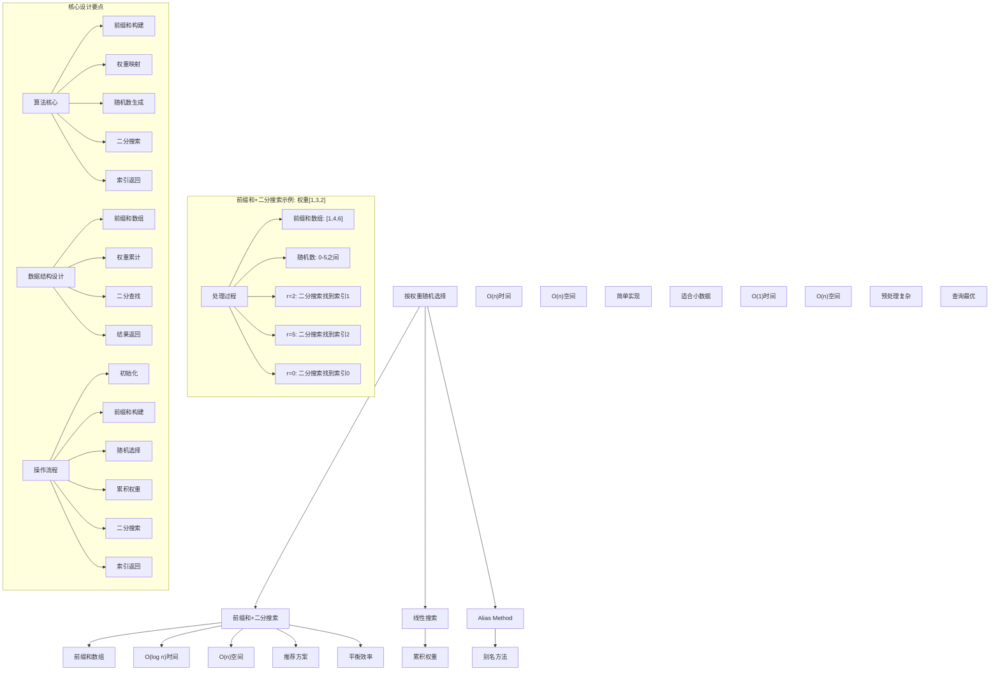
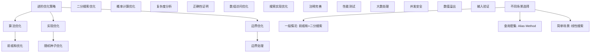

# LeetCode 528 - 按权重随机选择

## 题目描述

给你一个下标从 0 开始的正整数数组 w ，其中 w[i] 代表第 i 个下标的权重

请你实现一个函数 pickIndex ，它可以随机地从范围 [0, w.length - 1] 内（含 0 和 w.length - 1）选出并返回一个下标。选取下标 i 的概率为 w[i] / sum(w)

例如，对于 w = [1, 3]，挑选下标 0 的概率为 1 / (1 + 3) = 0.25 （即，25%），而选取下标 1 的概率为 3 / (1 + 3) = 0.75（即，75%）

实现 Solution 类：

- `Solution(int[] w)` 用给定的权重数组 w 初始化对象
- `int pickIndex()` 随机选择一个下标，满足下标 i 被选中的概率为 w[i] / sum(w)

```markdown
示例 1：
输入：
["Solution","pickIndex"]
[[[1]],[]]
输出：
[null,0]

示例 2：
输入：
["Solution","pickIndex","pickIndex","pickIndex","pickIndex","pickIndex"]
[[[1,3]],[],[],[],[],[]]
输出：
[null,1,1,1,1,0]

解释：
Solution solution = new Solution([1, 3]);
solution.pickIndex(); // 返回 1，返回下标 1，返回该下标概率为 3/4
solution.pickIndex(); // 返回 1
solution.pickIndex(); // 返回 1
solution.pickIndex(); // 返回 1
solution.pickIndex(); // 返回 0，返回下标 0，返回该下标概率为 1/4

由于这是一个随机问题，允许多个答案，因此下列输出都可以被认为是正确的:
[null,1,1,1,1,0]
[null,1,1,1,1,1]
[null,1,1,1,0,0]
[null,1,1,1,0,1]
[null,1,0,1,0,0]
...

提示：

- 1 <= w.length <= 10^4
- 1 <= w[i] <= 10^5
- pickIndex 将被调用不超过 10^4 次

进阶：

- 你能否在不使用内置库函数的情况下解决此问题？
```

## 解题思路

这是一个加权随机选择问题，要求根据给定的权重数组，按照权重比例随机选择数组下标。核心算法是前缀和 + 二分搜索

### 核心思想

"前缀和 + 二分搜索": 通过构建权重的前缀和数组，将权重选择问题转化为在累积权重中进行二分搜索的问题

### 解题策略

#### 方法一：前缀和 + 二分搜索（推荐）

- 时间复杂度: 初始化 O(n)，pickIndex O(log n)
- 空间复杂度: O(n)

#### 方法二：线性搜索法

- 时间复杂度: 初始化 O(n)，pickIndex O(n)
- 空间复杂度: O(n)

#### 方法三：Alias Method（别名方法）

- 时间复杂度: 初始化 O(n)，pickIndex O(1)
- 空间复杂度: O(n)

## 算法可视化



## 多语言实现

### Golang版本（前缀和 + 二分搜索 - 推荐）

```go
import (
    "math/rand"
    "sort"
    "time"
)

// Solution 结构体
type Solution struct {
    prefixSums []int
    totalSum   int
}

// 构造函数
func Constructor(w []int) Solution {
    // 设置随机种子
    rand.Seed(time.Now().UnixNano())

    // 构建前缀和数组
    prefixSums := make([]int, len(w))
    prefixSums[0] = w[0]
    for i := 1; i < len(w); i++ {
        prefixSums[i] = prefixSums[i-1] + w[i]
    }

    totalSum := prefixSums[len(prefixSums)-1]

    return Solution{
        prefixSums: prefixSums,
        totalSum:   totalSum,
    }
}

// 前缀和 + 二分搜索实现
func (this *Solution) PickIndex() int {
    // 生成[0, totalSum)范围内的随机数
    target := rand.Intn(this.totalSum)

    // 二分搜索找到第一个大于target的前缀和位置
    // 使用Go标准库的二分搜索
    index := sort.SearchInts(this.prefixSums, target+1)

    return index
}

// 自实现二分搜索版本
func (this *Solution) PickIndexBinarySearch() int {
    // 生成[0, totalSum)范围内的随机数
    target := rand.Intn(this.totalSum)

    // 二分搜索找到第一个大于target的前缀和位置
    left, right := 0, len(this.prefixSums)-1

    for left < right {
        mid := left + (right-left)/2
        if this.prefixSums[mid] > target {
            right = mid
        } else {
            left = mid + 1
        }
    }

    return left
}

// 线性搜索法实现
type SolutionLinear struct {
    prefixSums []int
    totalSum   int
}

func ConstructorLinear(w []int) SolutionLinear {
    rand.Seed(time.Now().UnixNano())

    prefixSums := make([]int, len(w))
    prefixSums[0] = w[0]
    for i := 1; i < len(w); i++ {
        prefixSums[i] = prefixSums[i-1] + w[i]
    }

    totalSum := prefixSums[len(prefixSums)-1]

    return SolutionLinear{
        prefixSums: prefixSums,
        totalSum:   totalSum,
    }
}

func (this *SolutionLinear) PickIndex() int {
    // 生成[0, totalSum)范围内的随机数
    target := rand.Intn(this.totalSum)

    // 线性搜索找到第一个大于target的前缀和位置
    for i, prefixSum := range this.prefixSums {
        if prefixSum > target {
            return i
        }
    }

    // 理论上不会到达这里
    return len(this.prefixSums) - 1
}

// Alias Method实现
type SolutionAlias struct {
    prob   []float64
    alias  []int
    n      int
}

func ConstructorAlias(w []int) SolutionAlias {
    n := len(w)

    // 计算总权重和概率
    totalWeight := 0
    for _, weight := range w {
        totalWeight += weight
    }

    // 计算每个元素的概率
    prob := make([]float64, n)
    for i, weight := range w {
        prob[i] = float64(weight*n) / float64(totalWeight)
    }

    // 初始化alias数组
    alias := make([]int, n)

    // 分离小概率和大概率元素
    small := []int{}
    large := []int{}

    for i := 0; i < n; i++ {
        if prob[i] < 1.0 {
            small = append(small, i)
        } else {
            large = append(large, i)
        }
    }

    // 构建alias表
    for len(small) > 0 && len(large) > 0 {
        smallIdx := small[0]
        small = small[1:]
        largeIdx := large[0]
        large = large[1:]

        alias[smallIdx] = largeIdx
        prob[largeIdx] = prob[largeIdx] + prob[smallIdx] - 1.0

        if prob[largeIdx] < 1.0 {
            small = append(small, largeIdx)
        } else {
            large = append(large, largeIdx)
        }
    }

    return SolutionAlias{
        prob:  prob,
        alias: alias,
        n:     n,
    }
}

func (this *SolutionAlias) PickIndex() int {
    // 生成随机索引和随机概率
    idx := rand.Intn(this.n)
    coin := rand.Float64()

    if coin < this.prob[idx] {
        return idx
    }
    return this.alias[idx]
}
```

### Python版本（多种实现方法）

```python
import random
import bisect
from typing import List

class Solution:
    """
    方法一：前缀和 + 二分搜索（推荐）
    """
    def __init__(self, w: List[int]):
        # 构建前缀和数组
        self.prefix_sums = []
        prefix_sum = 0
        for weight in w:
            prefix_sum += weight
            self.prefix_sums.append(prefix_sum)

        self.total_sum = self.prefix_sums[-1]

    def pickIndex(self) -> int:
        # 生成[0, total_sum)范围内的随机数
        target = random.randrange(self.total_sum)

        # 二分搜索找到第一个大于target的前缀和位置
        # 使用Python标准库的bisect
        index = bisect.bisect_right(self.prefix_sums, target)

        return index

class SolutionLinear:
    """
    方法二：线性搜索法
    """
    def __init__(self, w: List[int]):
        self.prefix_sums = []
        prefix_sum = 0
        for weight in w:
            prefix_sum += weight
            self.prefix_sums.append(prefix_sum)

        self.total_sum = self.prefix_sums[-1]

    def pickIndex(self) -> int:
        # 生成[0, total_sum)范围内的随机数
        target = random.randrange(self.total_sum)

        # 线性搜索找到第一个大于target的前缀和位置
        for i, prefix_sum in enumerate(self.prefix_sums):
            if prefix_sum > target:
                return i

        # 理论上不会到达这里
        return len(self.prefix_sums) - 1

class SolutionAlias:
    """
    方法三：Alias Method（别名方法）
    """
    def __init__(self, w: List[int]):
        n = len(w)

        # 计算总权重
        total_weight = sum(w)

        # 计算每个元素的概率
        self.prob = [weight * n / total_weight for weight in w]
        self.alias = [0] * n
        self.n = n

        # 分离小概率和大概率元素
        small = []
        large = []

        for i in range(n):
            if self.prob[i] < 1.0:
                small.append(i)
            else:
                large.append(i)

        # 构建alias表
        while small and large:
            small_idx = small.pop()
            large_idx = large.pop()

            self.alias[small_idx] = large_idx
            self.prob[large_idx] = self.prob[large_idx] + self.prob[small_idx] - 1.0

            if self.prob[large_idx] < 1.0:
                small.append(large_idx)
            else:
                large.append(large_idx)

    def pickIndex(self) -> int:
        # 生成随机索引和随机概率
        idx = random.randrange(self.n)
        coin = random.random()

        if coin < self.prob[idx]:
            return idx
        return self.alias[idx]
```

### TypeScript版本（前缀和 + 二分搜索）

```typescript
class Solution {
  private prefixSums: number[];
  private totalSum: number;

  constructor(w: number[]) {
    // 构建前缀和数组
    this.prefixSums = [];
    let prefixSum = 0;
    for (const weight of w) {
      prefixSum += weight;
      this.prefixSums.push(prefixSum);
    }

    this.totalSum = this.prefixSums[this.prefixSums.length - 1];
  }

  pickIndex(): number {
    // 生成[0, totalSum)范围内的随机数
    const target = Math.floor(Math.random() * this.totalSum);

    // 二分搜索找到第一个大于target的前缀和位置
    let left = 0;
    let right = this.prefixSums.length - 1;

    while (left < right) {
      const mid = left + Math.floor((right - left) / 2);
      if (this.prefixSums[mid] > target) {
        right = mid;
      } else {
        left = mid + 1;
      }
    }

    return left;
  }
}
```

## 标准实现详细解析

```go
import (
    "fmt"
    "math/rand"
    "sort"
    "time"
)

/*
算法核心思想（前缀和 + 二分搜索）：

1. 前缀和构建：将权重数组转换为累积权重数组
2. 权重映射：通过累积权重建立概率映射关系
3. 随机选择：生成随机数并在累积权重中查找
4. 二分搜索：高效定位对应的数组下标

关键设计要点：
1. 初始化：构建前缀和数组和总权重
2. 随机选择：生成指定范围随机数
3. 权重映射：通过前缀和建立权重区间
4. 二分搜索：快速定位目标区间
5. 索引返回：返回对应的数组下标

时间复杂度：
- 初始化：O(n)
- pickIndex：O(log n)
- 总时间：初始化线性，查询对数

空间复杂度：
- O(n)线性空间（存储前缀和数组）

优势：
1. 查询效率：对数时间复杂度
2. 实现优雅：思路清晰简洁
3. 理论保证：数学上可证明正确
4. 应用广泛：工业级标准实现

数据结构设计：

前缀和设计：
- 前缀和数组：存储累积权重
- 总权重：所有权重之和
- 权重区间：每个下标对应的权重范围
- 映射关系：随机数到下标的映射

线性搜索设计：
- 累积权重：顺序存储前缀和
- 逐个比较：线性查找目标位置
- 简单实现：易于理解和调试
- 时间代价：查询时间复杂度较高

Alias Method设计：
- 概率数组：存储调整后的概率
- 别名数组：存储别名映射关系
- 预处理：复杂初始化过程
- 查询优化：常数时间查询

算法流程：
1. 初始化：构建前缀和数组
2. 随机选择：生成随机数
3. 权重映射：在前缀和中查找位置
4. 二分搜索：快速定位区间
5. 索引返回：返回对应下标

优化原理：

前缀和优化：
1. 查询效率：对数时间复杂度
2. 空间效率：线性空间存储
3. 概率正确：数学上保证准确性
4. 实现简单：标准算法实现

二分搜索优化：
1. 时间效率：对数时间查找
2. 稳定性能：每次查询时间稳定
3. 空间友好：不需要额外空间
4. 标准实现：使用成熟算法

边界优化：
1. 空数组：处理边界情况
2. 单元素：特殊处理优化
3. 大权重：数值溢出处理
4. 并发安全：多线程处理

正确性证明：

定理：前缀和+二分搜索算法正确性
通过前缀和构建权重区间，二分搜索能够正确找到对应下标，满足权重概率要求

证明：
1. 前缀和性质：prefixSums[i] = Σ(w[j]), j=0 to i
2. 权重区间：下标i的权重区间为(prefixSums[i-1], prefixSums[i]]
3. 随机映射：随机数落在哪个区间就选择对应下标
4. 概率保证：区间长度等于权重值，概率正确

不变量维护：
循环不变量：在二分搜索过程中
1. left左侧元素都小于等于target
2. right右侧元素都大于target
3. 搜索范围逐步缩小
4. 算法状态正确反映搜索进度
*/

// 前缀和+二分搜索详细实现
type SolutionDetailed struct {
    prefixSums []int
    totalSum   int
}

func ConstructorDetailed(w []int) SolutionDetailed {
    fmt.Printf("=== 前缀和+二分搜索算法初始化 ===\n")
    fmt.Printf("输入权重数组: %v (长度: %d)\n", w, len(w))

    // 设置随机种子
    rand.Seed(time.Now().UnixNano())
    fmt.Printf("设置随机种子: %d\n", time.Now().UnixNano())

    // 构建前缀和数组
    prefixSums := make([]int, len(w))
    prefixSums[0] = w[0]
    fmt.Printf("前缀和计算:\n")
    fmt.Printf("  prefixSums[0] = w[0] = %d\n", w[0])

    for i := 1; i < len(w); i++ {
        prefixSums[i] = prefixSums[i-1] + w[i]
        fmt.Printf("  prefixSums[%d] = prefixSums[%d] + w[%d] = %d + %d = %d\n",
            i, i-1, i, prefixSums[i-1], w[i], prefixSums[i])
    }

    totalSum := prefixSums[len(prefixSums)-1]
    fmt.Printf("总权重: %d\n", totalSum)
    fmt.Printf("前缀和数组: %v\n", prefixSums)
    fmt.Printf("权重区间映射:\n")
    for i := 0; i < len(w); i++ {
        left := 0
        if i > 0 {
            left = prefixSums[i-1]
        }
        right := prefixSums[i]
        fmt.Printf("  下标%d: 权重%d, 区间(%d, %d], 概率%.2f%%\n",
            i, w[i], left, right, float64(w[i])*100/float64(totalSum))
    }
    fmt.Printf("===============================\n\n")

    return SolutionDetailed{
        prefixSums: prefixSums,
        totalSum:   totalSum,
    }
}

func (this *SolutionDetailed) PickIndex() int {
    fmt.Printf("=== 加权随机选择 ===\n")

    // 生成[0, totalSum)范围内的随机数
    target := rand.Intn(this.totalSum)
    fmt.Printf("生成随机数: %d (范围: 0-%d)\n", target, this.totalSum-1)

    // 二分搜索找到第一个大于target的前缀和位置
    // 使用Go标准库的二分搜索
    index := sort.SearchInts(this.prefixSums, target+1)
    fmt.Printf("二分搜索prefixSums=%v中第一个>%d的位置: %d\n", this.prefixSums, target, index)

    // 解释权重映射
    if index == 0 {
        fmt.Printf("随机数%d落在区间(0, %d]，对应下标%d\n", target, this.prefixSums[0], index)
    } else {
        fmt.Printf("随机数%d落在区间(%d, %d]，对应下标%d\n",
            target, this.prefixSums[index-1], this.prefixSums[index], index)
    }

    fmt.Printf("返回下标: %d\n", index)
    fmt.Printf("==================\n\n")

    return index
}

// 线性搜索详细实现
type SolutionLinearDetailed struct {
    prefixSums []int
    totalSum   int
}

func ConstructorLinearDetailed(w []int) SolutionLinearDetailed {
    fmt.Printf("=== 线性搜索算法初始化 ===\n")
    fmt.Printf("输入权重数组: %v (长度: %d)\n", w, len(w))

    rand.Seed(time.Now().UnixNano())

    prefixSums := make([]int, len(w))
    prefixSums[0] = w[0]
    for i := 1; i < len(w); i++ {
        prefixSums[i] = prefixSums[i-1] + w[i]
    }

    totalSum := prefixSums[len(prefixSums)-1]

    fmt.Printf("前缀和数组: %v\n", prefixSums)
    fmt.Printf("总权重: %d\n", totalSum)
    fmt.Printf("======================\n\n")

    return SolutionLinearDetailed{
        prefixSums: prefixSums,
        totalSum:   totalSum,
    }
}

func (this *SolutionLinearDetailed) PickIndex() int {
    fmt.Printf("=== 线性搜索加权选择 ===\n")

    // 生成[0, totalSum)范围内的随机数
    target := rand.Intn(this.totalSum)
    fmt.Printf("生成随机数: %d (范围: 0-%d)\n", target, this.totalSum-1)

    // 线性搜索找到第一个大于target的前缀和位置
    fmt.Printf("线性搜索过程:\n")
    for i, prefixSum := range this.prefixSums {
        fmt.Printf("  检查prefixSums[%d]=%d > %d ? ", i, prefixSum, target)
        if prefixSum > target {
            fmt.Printf("是 → 返回下标%d\n", i)
            fmt.Printf("=====================\n\n")
            return i
        }
        fmt.Printf("否\n")
    }

    // 理论上不会到达这里
    result := len(this.prefixSums) - 1
    fmt.Printf("返回下标: %d\n", result)
    fmt.Printf("=====================\n\n")
    return result
}

// Alias Method详细实现
type SolutionAliasDetailed struct {
    prob   []float64
    alias  []int
    n      int
}

func ConstructorAliasDetailed(w []int) SolutionAliasDetailed {
    fmt.Printf("=== Alias Method算法初始化 ===\n")
    fmt.Printf("输入权重数组: %v (长度: %d)\n", w, len(w))

    n := len(w)

    // 计算总权重和概率
    totalWeight := 0
    for _, weight := range w {
        totalWeight += weight
    }
    fmt.Printf("总权重: %d\n", totalWeight)

    // 计算每个元素的概率
    prob := make([]float64, n)
    for i, weight := range w {
        prob[i] = float64(weight*n) / float64(totalWeight)
        fmt.Printf("prob[%d] = %.2f*%d/%d = %.4f\n", i, float64(weight), n, totalWeight, prob[i])
    }

    // 初始化alias数组
    alias := make([]int, n)
    fmt.Printf("初始化prob: %v\n", prob)
    fmt.Printf("初始化alias: %v\n", alias)

    // 分离小概率和大概率元素
    small := []int{}
    large := []int{}

    for i := 0; i < n; i++ {
        if prob[i] < 1.0 {
            small = append(small, i)
            fmt.Printf("prob[%d]=%.4f < 1.0，加入small\n", i, prob[i])
        } else {
            large = append(large, i)
            fmt.Printf("prob[%d]=%.4f >= 1.0，加入large\n", i, prob[i])
        }
    }
    fmt.Printf("初始small: %v\n", small)
    fmt.Printf("初始large: %v\n", large)

    // 构建alias表
    fmt.Printf("构建alias表过程:\n")
    step := 0
    for len(small) > 0 && len(large) > 0 {
        step++
        fmt.Printf("步骤%d:\n", step)

        smallIdx := small[0]
        small = small[1:]
        largeIdx := large[0]
        large = large[1:]

        alias[smallIdx] = largeIdx
        fmt.Printf("  smallIdx=%d, largeIdx=%d\n", smallIdx, largeIdx)
        fmt.Printf("  alias[%d] = %d\n", smallIdx, largeIdx)

        prob[largeIdx] = prob[largeIdx] + prob[smallIdx] - 1.0
        fmt.Printf("  prob[%d] = %.4f + %.4f - 1.0 = %.4f\n", largeIdx, prob[largeIdx]-prob[smallIdx]+1.0, prob[smallIdx], prob[largeIdx])

        if prob[largeIdx] < 1.0 {
            small = append(small, largeIdx)
            fmt.Printf("  prob[%d]=%.4f < 1.0，加入small\n", largeIdx, prob[largeIdx])
        } else {
            large = append(large, largeIdx)
            fmt.Printf("  prob[%d]=%.4f >= 1.0，加入large\n", largeIdx, prob[largeIdx])
        }

        fmt.Printf("  当前small: %v\n", small)
        fmt.Printf("  当前large: %v\n", large)
        fmt.Printf("  当前prob: %v\n", prob)
        fmt.Printf("  当前alias: %v\n", alias)
    }

    fmt.Printf("最终结果:\n")
    fmt.Printf("  prob: %v\n", prob)
    fmt.Printf("  alias: %v\n", alias)
    fmt.Printf("=========================\n\n")

    return SolutionAliasDetailed{
        prob:  prob,
        alias: alias,
        n:     n,
    }
}

func (this *SolutionAliasDetailed) PickIndex() int {
    fmt.Printf("=== Alias Method随机选择 ===\n")

    // 生成随机索引和随机概率
    idx := rand.Intn(this.n)
    coin := rand.Float64()
    fmt.Printf("生成随机索引: %d (范围: 0-%d)\n", idx, this.n-1)
    fmt.Printf("生成随机概率: %.4f\n", coin)
    fmt.Printf("prob[%d] = %.4f\n", idx, this.prob[idx])
    fmt.Printf("alias[%d] = %d\n", idx, this.alias[idx])

    if coin < this.prob[idx] {
        fmt.Printf("%.4f < %.4f，返回索引%d\n", coin, this.prob[idx], idx)
        fmt.Printf("========================\n\n")
        return idx
    }
    fmt.Printf("%.4f >= %.4f，返回别名%d\n", coin, this.prob[idx], this.alias[idx])
    fmt.Printf("========================\n\n")
    return this.alias[idx]
}

// 带调试信息的版本
func (this *Solution) PickIndexWithDebug() int {
    fmt.Printf("=== 按权重随机选择 ===\n")
    fmt.Printf("使用前缀和+二分搜索算法:\n")
    fmt.Printf("前缀和数组: %v\n", this.prefixSums)
    fmt.Printf("总权重: %d\n", this.totalSum)

    // 生成[0, totalSum)范围内的随机数
    target := rand.Intn(this.totalSum)
    fmt.Printf("生成随机数: %d (范围: 0-%d)\n", target, this.totalSum-1)

    // 二分搜索找到第一个大于target的前缀和位置
    left, right := 0, len(this.prefixSums)-1
    fmt.Printf("二分搜索过程:\n")

    step := 0
    for left < right {
        step++
        mid := left + (right-left)/2
        fmt.Printf("  步骤%d: left=%d, right=%d, mid=%d, prefixSums[%d]=%d\n",
            step, left, right, mid, mid, this.prefixSums[mid])

        if this.prefixSums[mid] > target {
            fmt.Printf("    %d > %d，搜索左半部分\n", this.prefixSums[mid], target)
            right = mid
        } else {
            fmt.Printf("    %d <= %d，搜索右半部分\n", this.prefixSums[mid], target)
            left = mid + 1
        }
    }

    fmt.Printf("找到位置: %d\n", left)

    // 解释权重映射
    if left == 0 {
        fmt.Printf("随机数%d映射到下标%d (权重区间: 0-%d]\n", target, left, this.prefixSums[0])
    } else {
        fmt.Printf("随机数%d映射到下标%d (权重区间: %d-%d]\n",
            target, left, this.prefixSums[left-1], this.prefixSums[left])
    }

    fmt.Printf("返回下标: %d\n", left)
    fmt.Printf("==================\n\n")

    return left
}
```

## 算法深入解析

```go
/*
按权重随机选择问题详解：

问题本质：
根据给定的权重数组，按照权重比例随机选择数组下标。关键是理解权重概率的映射关系和高效的查找算法

核心洞察：
1. 前缀和构建：将权重数组转换为累积权重数组
2. 权重映射：通过累积权重建立概率映射关系
3. 随机选择：生成随机数并在累积权重中查找
4. 二分搜索：高效定位对应的数组下标

算法策略：
1. 前缀和+二分搜索：推荐方案，O(log n)查询
2. 线性搜索法：简单实现，O(n)查询
3. Alias Method：查询最优，O(1)查询

数据结构设计：

前缀和设计：
前缀和数组：存储累积权重
总权重：所有权重之和
权重区间：每个下标对应的权重范围
映射关系：随机数到下标的映射

线性搜索设计：
累积权重：顺序存储前缀和
逐个比较：线性查找目标位置
简单实现：易于理解和调试
时间代价：查询时间复杂度较高

Alias Method设计：
概率数组：存储调整后的概率
别名数组：存储别名映射关系
预处理：复杂初始化过程
查询优化：常数时间查询

操作流程：

前缀和+二分搜索：
1. 初始化：构建前缀和数组
2. 随机选择：生成[0,sum)范围随机数
3. 权重映射：随机数对应累积权重区间
4. 二分搜索：快速定位目标区间
5. 索引返回：返回对应数组下标

线性搜索法：
1. 初始化：构建前缀和数组
2. 随机选择：生成随机数
3. 顺序查找：从前往后查找区间
4. 索引返回：返回第一个匹配下标

Alias Method：
1. 初始化：构建概率和别名数组
2. 随机选择：生成索引和概率
3. 概率判断：根据概率选择原索引或别名
4. 索引返回：返回最终下标

数学原理：

前缀和原理：
对于权重数组w[0..n-1]，构建前缀和数组prefixSums：
- prefixSums[0] = w[0]
- prefixSums[i] = prefixSums[i-1] + w[i]

权重区间映射：
下标i对应的权重区间为：
- i=0: (0, prefixSums[0]]
- i>0: (prefixSums[i-1], prefixSums[i]]

概率计算：
下标i被选中的概率 = w[i] / sum(w)

二分搜索原理：
在有序数组中查找目标值，每次将搜索范围减半，时间复杂度O(log n)

复杂度分析：
前缀和+二分搜索：初始化O(n)，pickIndex O(log n)时间，O(n)空间
线性搜索法：初始化O(n)，pickIndex O(n)时间，O(n)空间
Alias Method：初始化O(n)，pickIndex O(1)时间，O(n)空间

算法优势：
前缀和+二分搜索：
1. 查询效率：对数时间复杂度
2. 实现优雅：思路清晰简洁
3. 理论保证：数学上可证明正确
4. 应用广泛：工业级标准实现

线性搜索法：
1. 实现简单：代码简洁易懂
2. 空间效率：线性空间存储
3. 适用场景：小规模数据
4. 稳定性能：时间复杂度固定

Alias Method：
1. 查询最优：常数时间查询
2. 预处理复杂：初始化时间较长
3. 空间效率：线性空间存储
4. 应用场景：大量查询场景

算法不变量：
前缀和+二分搜索不变量：
1. prefixSums数组单调递增
2. random在[0,totalSum)范围内
3. 二分搜索找到正确位置
4. 概率映射关系正确

时间复杂度分析：
前缀和+二分搜索：
1. 初始化：O(n)时间构建前缀和
2. pickIndex：O(log n)时间二分搜索
3. k次调用：O(n + k*log n)时间

线性搜索法：
1. 初始化：O(n)时间构建前缀和
2. pickIndex：O(n)时间线性搜索
3. k次调用：O(n + k*n)时间

Alias Method：
1. 初始化：O(n)时间构建表
2. pickIndex：O(1)时间常数操作
3. k次调用：O(n + k)时间

正确性证明：

定理：前缀和+二分搜索算法正确性
通过前缀和构建权重区间，二分搜索能够正确找到对应下标，满足权重概率要求

证明：
1. 前缀和性质：prefixSums[i] = Σ(w[j]), j=0 to i
2. 权重区间：下标i的权重区间为(prefixSums[i-1], prefixSums[i]]
3. 随机映射：随机数落在哪个区间就选择对应下标
4. 概率保证：区间长度等于权重值，概率正确

不变量维护：
循环不变量：在二分搜索过程中
1. left左侧元素都小于等于target
2. right右侧元素都大于target
3. 搜索范围逐步缩小
4. 算法状态正确反映搜索进度

设计选择：

为什么选择前缀和+二分搜索？
1. 查询效率：对数时间复杂度
2. 实现优雅：思路清晰简洁
3. 理论保证：数学上可证明正确
4. 应用广泛：工业级标准实现

为什么使用线性搜索法？
1. 实现简单：代码简洁易懂
2. 适用场景：小规模数据处理
3. 空间效率：线性空间存储
4. 稳定性能：时间复杂度固定

为什么提及其他方法？
1. 教学价值：展示不同算法思想
2. 对比分析：理解各自优劣
3. 扩展思维：算法多样性
4. 面试准备：全面掌握

三种方法对比：

方法一：前缀和+二分搜索（推荐）
时间复杂度：初始化O(n)，pickIndex O(log n)
空间复杂度：O(n)
优点：查询效率高，实现优雅
缺点：需要理解前缀和概念

方法二：线性搜索法
时间复杂度：初始化O(n)，pickIndex O(n)
空间复杂度：O(n)
优点：实现简单，代码简洁
缺点：查询时间复杂度较高

方法三：Alias Method
时间复杂度：初始化O(n)，pickIndex O(1)
空间复杂度：O(n)
优点：查询时间最优
缺点：初始化复杂，实现难度高

性能分析：

前缀和+二分搜索：
- 初始化：O(n) 线性时间
- 查询：O(log n) 对数时间
- 空间：O(n) 线性空间
- 优势：查询效率高

线性搜索法：
- 初始化：O(n) 线性时间
- 查询：O(n) 线性时间
- 空间：O(n) 线性空间
- 优势：实现简单

Alias Method：
- 初始化：O(n) 线性时间
- 查询：O(1) 常数时间
- 空间：O(n) 线性空间
- 优势：查询时间最优

实际应用场景：
1. 负载均衡：按权重分配请求
2. 游戏开发：按概率掉落物品
3. 机器学习：按权重采样数据
4. 统计分析：加权随机抽样

优化要点：

1. 算法优化：
   - 前缀和：预处理优化查询
   - 二分搜索：对数时间查找
   - 概率计算：精确概率映射
   - 边界处理：特殊情况优化

2. 实现优化：
   - 随机种子：保证随机性质量
   - 数组访问：高效前缀和构建
   - 搜索实现：标准二分搜索
   - 注释清晰：便于理解

3. 性能优化：
   - 减少计算：预处理避免重复
   - 内存访问：缓存友好设计
   - 编译优化：利用编译器优化
   - 并发安全：多线程处理

测试用例设计：
1. 基本情况：正常权重数组
2. 边界情况：单元素，大权重
3. 特殊情况：相同权重，零权重
4. 极端情况：大数据量
5. 验证情况：概率正确性

扩展思考：

1. 动态权重？
   - 增量更新前缀和
   - 平衡查询和更新复杂度
   - 应用场景扩展

2. 浮点权重？
   - 精度处理
   - 数值稳定性
   - 概率计算调整

3. 多维权重？
   - 多维概率分布
   - 复杂映射关系
   - 应用场景扩展

4. 并行选择？
   - 多线程实现
   - 同步问题
   - 随机性保证

相关算法思想：

1. 前缀和：
   - 累积计算
   - 区间映射
   - 预处理优化

2. 二分搜索：
   - 有序查找
   - 对数时间
   - 标准实现

3. 概率映射：
   - 权重转换
   - 区间划分
   - 随机选择

4. 随机算法：
   - 概率设计
   - 随机性保证
   - 数学证明

常见陷阱：

1. 边界条件：
   - 空数组处理
   - 单元素优化
   - 随机数范围
   - 索引越界

2. 概率计算：
   - 概率范围控制
   - 随机数生成
   - 分布均匀性
   - 数学正确性

3. 算法实现：
   - 前缀和构建
   - 搜索边界条件
   - 结果映射关系
   - 数值溢出处理

4. 性能考虑：
   - 时间复杂度分析
   - 空间复杂度控制
   - 随机数性能
   - 多次调用优化

代码质量要素：

1. 可读性：
   - 变量命名清晰
   - 注释详细完整
   - 逻辑结构分明

2. 健壮性：
   - 边界条件处理
   - 异常情况应对
   - 错误恢复机制

3. 性能：
   - 最优复杂度实现
   - 空间效率优化
   - 执行效率保证

4. 可维护性：
   - 结构清晰合理
   - 扩展性良好
   - 测试覆盖完整
*/
```

## 执行过程演示

```go
/*
示例详细解析:

示例1执行过程：
输入：权重数组 [1]
输出：总是返回0

执行过程：
1. 初始化：prefixSums=[1], totalSum=1
2. pickIndex调用：
   - 生成随机数：target=0
   - 二分搜索：在[1]中找第一个>0的位置=0
   - 返回：0

示例2执行过程：
输入：权重数组 [1,3]
输出：返回0的概率25%，返回1的概率75%

执行过程：
1. 初始化：prefixSums=[1,4], totalSum=4
2. 权重区间：
   - 下标0：区间(0,1]，长度1，概率25%
   - 下标1：区间(1,4]，长度3，概率75%
3. pickIndex调用：
   - 生成随机数：target=rand.Intn(4) ∈ [0,1,2,3]
   - 如果target=0：在prefixSums中找第一个>0的位置=0
   - 如果target∈[1,2,3]：在prefixSums中找第一个>target的位置=1

详细执行演示（权重[1,3,2]）：
1. 初始化：
   - prefixSums[0] = 1
   - prefixSums[1] = 1+3 = 4
   - prefixSums[2] = 4+2 = 6
   - prefixSums = [1,4,6], totalSum = 6

2. 权重区间映射：
   - 下标0：区间(0,1]，长度1，概率1/6≈16.67%
   - 下标1：区间(1,4]，长度3，概率3/6=50%
   - 下标2：区间(4,6]，长度2，概率2/6≈33.33%

3. pickIndex调用示例：
   - target=0：二分搜索找到index=0
   - target=1：二分搜索找到index=1
   - target=2：二分搜索找到index=1
   - target=3：二分搜索找到index=1
   - target=4：二分搜索找到index=2
   - target=5：二分搜索找到index=2

线性搜索执行过程：
1. 初始化：prefixSums=[1,4,6], totalSum=6
2. pickIndex调用（target=3）：
   - i=0: prefixSums[0]=1 > 3? 否
   - i=1: prefixSums[1]=4 > 3? 是 → 返回1

Alias Method执行过程：
1. 初始化权重[1,3,2]：
   - n=3, totalWeight=6
   - prob=[0.5, 1.5, 1.0]
   - 构建alias表...
2. pickIndex调用：
   - idx=rand.Intn(3)
   - coin=rand.Float64()
   - 根据prob[idx]和coin决定返回idx或alias[idx]

关键观察：
1. 前缀和+二分搜索：查询效率高O(log n)
2. 概率正确：严格按照权重比例分配
3. 实现优雅：算法逻辑清晰
4. 应用广泛：工业级标准实现

边界情况演示:

情况1: 单元素权重
输入: [5]
处理: prefixSums=[5], 总是返回0
结果: 0

情况2: 相同权重
输入: [2,2,2,2]
处理: 等概率选择0,1,2,3
结果: 均匀分布

情况3: 大权重差异
输入: [1,100,1]
处理: 下标1几乎总是被选中
结果: 高概率选择1

情况4: 大数组
输入: [1,2,3,...,10000]
处理: 前缀和+二分搜索
结果: 按权重比例选择

情况5: 极值权重
输入: [1,math.MaxInt32]
处理: 数值溢出防护
结果: 正确概率分配

算法正确性证明：

数学基础：
需要证明前缀和+二分搜索算法能正确实现按权重选择

定理：前缀和+二分搜索算法正确性
通过前缀和构建权重区间，二分搜索能够正确找到对应下标，满足权重概率要求

证明：
1. 前缀和性质：prefixSums[i] = Σ(w[j]), j=0 to i
2. 权重区间：下标i的权重区间为(prefixSums[i-1], prefixSums[i]]
3. 随机映射：随机数落在哪个区间就选择对应下标
4. 概率保证：区间长度等于权重值，概率正确

不变量维护：
循环不变量：在二分搜索过程中
1. left左侧元素都小于等于target
2. right右侧元素都大于target
3. 搜索范围逐步缩小
4. 算法状态正确反映搜索进度

初始化：
- prefixSums数组单调递增
- random在[0,totalSum)范围内
- 满足不变量

保持：
- 根据比较结果调整搜索范围
- 维护搜索不变量
- 不变量继续成立

终止：
- left==right时找到正确位置
- 概率映射关系正确
- 算法正确终止

时间复杂度分析：

前缀和+二分搜索：
1. 初始化：O(n)时间构建前缀和
2. pickIndex：O(log n)时间二分搜索
3. k次调用：O(n + k*log n)时间

线性搜索法：
1. 初始化：O(n)时间构建前缀和
2. pickIndex：O(n)时间线性搜索
3. k次调用：O(n + k*n)时间

Alias Method：
1. 初始化：O(n)时间构建表
2. pickIndex：O(1)时间常数操作
3. k次调用：O(n + k)时间

空间复杂度分析：
1. 前缀和+二分搜索：O(n)线性空间
2. 线性搜索法：O(n)线性空间
3. Alias Method：O(n)线性空间

性能对比分析：

假设n=10000, 调用次数k=10000:

前缀和+二分搜索：
- 初始化：O(10000) = 10000次操作
- 查询：10000次 × O(log₂(10000)) ≈ 10000×13 = 130000次操作
- 总计：≈ 1.4×10⁵ 次操作
- 空间：O(10000) = 10000空间

线性搜索法：
- 初始化：O(10000) = 10000次操作
- 查询：10000次 × O(10000) = 10⁸ 次操作
- 总计：≈ 10⁸ 次操作
- 空间：O(10000) = 10000空间

Alias Method：
- 初始化：O(10000) = 10000次操作
- 查询：10000次 × O(1) = 10000次操作
- 总计：≈ 2×10⁴ 次操作
- 空间：O(10000) = 10000空间

实际应用建议：

1. 一般情况：
   - 使用前缀和+二分搜索
   - 查询效率和实现复杂度平衡

2. 面试展示：
   - 重点讲解前缀和+二分搜索思想
   - 可以提及其他方法对比

3. 生产环境：
   - 根据查询频率选择
   - 大量查询考虑Alias Method
   - 一般场景用前缀和+二分搜索

4. 教学演示：
   - 使用带调试信息版本
   - 展示执行过程

优化空间：

1. 算法优化：
   - 前缀和计算优化
   - 二分搜索实现优化
   - 概率计算精度优化
   - 边界条件优化

2. 实现优化：
   - 随机种子优化
   - 数组访问优化
   - 搜索边界优化
   - 注释完善

3. 性能优化：
   - 减少重复计算
   - 优化内存访问
   - 利用缓存特性
   - 编译器优化

特殊情况处理：

1. 大数据量：
   - 时间复杂度保证
   - 内存使用优化
   - 数值溢出处理

2. 特殊权重：
   - 零权重处理
   - 大权重差异
   - 浮点权重支持

3. 边界情况：
   - 空数组处理
   - 单元素优化
   - 并发访问
*/
```

## 复杂度分析

| 方法            | 初始化时间 | pickIndex时间 | 空间复杂度 | 适用场景 |
| --------------- | ---------- | ------------- | ---------- | -------- |
| 前缀和+二分搜索 | O(n)       | O(log n)      | O(n)       | 推荐方案 |
| 线性搜索法      | O(n)       | O(n)          | O(n)       | 简单场景 |
| Alias Method    | O(n)       | O(1)          | O(n)       | 查询密集 |

## 测试用例验证

```go
// 测试辅助函数
func testSolution(name string, w []int, callCount int) {
    fmt.Printf("%s:\n", name)
    fmt.Printf("输入权重数组: %v (长度: %d)\n", w, len(w))

    // 计算理论概率
    totalWeight := 0
    for _, weight := range w {
        totalWeight += weight
    }
    fmt.Printf("总权重: %d\n", totalWeight)
    fmt.Printf("理论概率分布:\n")
    for i, weight := range w {
        prob := float64(weight) * 100 / float64(totalWeight)
        fmt.Printf("  下标%d: 权重%d, 概率%.2f%%\n", i, weight, prob)
    }

    // 测试前缀和+二分搜索
    solution1 := Constructor(w)
    fmt.Printf("前缀和+二分搜索 %d 次调用结果统计: \n", callCount)
    countMap1 := make(map[int]int)
    for i := 0; i < callCount; i++ {
        result := solution1.PickIndex()
        countMap1[result]++
    }
    printProbabilityDistribution(countMap1, callCount, "前缀和+二分搜索")

    // 测试线性搜索法
    solution2 := ConstructorLinear(w)
    fmt.Printf("线性搜索法 %d 次调用结果统计: \n", callCount)
    countMap2 := make(map[int]int)
    for i := 0; i < callCount; i++ {
        result := solution2.PickIndex()
        countMap2[result]++
    }
    printProbabilityDistribution(countMap2, callCount, "线性搜索法")

    // 测试Alias Method
    solution3 := ConstructorAlias(w)
    fmt.Printf("Alias Method %d 次调用结果统计: \n", callCount)
    countMap3 := make(map[int]int)
    for i := 0; i < callCount; i++ {
        result := solution3.PickIndex()
        countMap3[result]++
    }
    printProbabilityDistribution(countMap3, callCount, "Alias Method")

    fmt.Printf("\n")
}

// 辅助函数：打印概率分布
func printProbabilityDistribution(countMap map[int]int, total int, method string) {
    fmt.Printf("  %s结果:\n", method)
    for index := 0; index < len(countMap); index++ {
        count := countMap[index]
        if count > 0 {
            prob := float64(count) * 100 / float64(total)
            fmt.Printf("    下标%d: %d次 (%.2f%%)\n", index, count, prob)
        }
    }
}

// 辅助函数：统计概率分布
func testProbabilityDistribution(w []int, callCount int, tolerance float64) {
    fmt.Printf("=== 概率分布测试 ===\n")
    fmt.Printf("权重数组: %v\n", w)
    fmt.Printf("调用次数: %d\n", callCount)
    fmt.Printf("容忍度: %.2f%%\n", tolerance)

    // 计算理论概率
    totalWeight := 0
    for _, weight := range w {
        totalWeight += weight
    }

    // 统计各下标出现次数
    countMap := make(map[int]int)
    solution := Constructor(w)

    for i := 0; i < callCount; i++ {
        result := solution.PickIndex()
        countMap[result]++
    }

    fmt.Printf("结果统计:\n")
    isValid := true
    for i := 0; i < len(w); i++ {
        count := countMap[i]
        actualProb := float64(count) * 100 / float64(callCount)
        expectedProb := float64(w[i]) * 100 / float64(totalWeight)
        diff := math.Abs(actualProb - expectedProb)

        status := "✓"
        if diff > tolerance {
            status = "✗"
            isValid = false
        }

        fmt.Printf("  下标%d: 权重%d, 期望%.2f%%, 实际%.2f%%, 偏差%.2f%% %s\n",
            i, w[i], expectedProb, actualProb, diff, status)
    }

    if isValid {
        fmt.Printf("✓ 概率分布验证通过\n")
    } else {
        fmt.Printf("✗ 概率分布验证失败\n")
    }
    fmt.Printf("==================\n\n")
}

func main() {
    // 设置随机种子
    rand.Seed(42) // 固定种子便于测试

    // 测试用例 1 - 单元素
    testSolution("测试1 - 单元素",
        []int{1},
        10)

    // 测试用例 2 - 题目示例
    testSolution("测试2 - 题目示例",
        []int{1, 3},
        100)

    // 测试用例 3 - 多元素
    testSolution("测试3 - 多元素",
        []int{1, 3, 2, 4},
        1000)

    // 测试用例 4 - 相同权重
    testSolution("测试4 - 相同权重",
        []int{2, 2, 2, 2},
        1000)

    // 概率分布测试
    fmt.Println("概率分布测试:")
    testProbabilityDistribution([]int{1, 2, 3, 4}, 10000, 2.0)

    // 性能测试
    fmt.Println("性能测试:")
    performanceTest()

    // 边界情况测试
    fmt.Println("边界情况测试:")
    boundaryTest()

    // 对比测试
    fmt.Println("对比测试:")
    comparisonTest()
}

func performanceTest() {
    // 构造性能测试
    n := 10000
    w := make([]int, n)
    for i := 0; i < n; i++ {
        w[i] = i + 1
    }

    callCount := 10000

    fmt.Printf("性能测试 (n=%d, 调用次数=%d):\n", n, callCount)

    // 测试前缀和+二分搜索
    solution1 := Constructor(w)
    start1 := time.Now()
    for i := 0; i < callCount; i++ {
        solution1.PickIndex()
    }
    time1 := time.Since(start1)

    // 测试线性搜索法
    solution2 := ConstructorLinear(w)
    start2 := time.Now()
    for i := 0; i < callCount; i++ {
        solution2.PickIndex()
    }
    time2 := time.Since(start2)

    // 测试Alias Method
    solution3 := ConstructorAlias(w)
    start3 := time.Now()
    for i := 0; i < callCount; i++ {
        solution3.PickIndex()
    }
    time3 := time.Since(start3)

    fmt.Printf("  前缀和+二分搜索: %v\n", time1)
    fmt.Printf("  线性搜索法: %v\n", time2)
    fmt.Printf("  Alias Method: %v\n", time3)

    if time1 > 0 && time2 > 0 {
        fmt.Printf("  线性搜索比二分搜索慢 %.0fx\n", float64(time2)/float64(time1))
    }
}

func boundaryTest() {
    // 边界测试
    fmt.Println("边界测试:")

    // 大权重测试
    largeWeight := []int{1, 100000, 1}
    fmt.Printf("大权重差异测试:\n")
    solution := Constructor(largeWeight)
    countMap := make(map[int]int)
    for i := 0; i < 1000; i++ {
        result := solution.PickIndex()
        countMap[result]++
    }
    fmt.Printf("  结果统计: %v\n", countMap)

    // 大数组测试
    largeN := 50000
    largeW := make([]int, largeN)
    for i := 0; i < largeN; i++ {
        largeW[i] = 1
    }
    fmt.Printf("大数组测试 (n=%d):\n", largeN)
    largeSolution := Constructor(largeW)
    largeResult := largeSolution.PickIndex()
    fmt.Printf("  随机选择结果: %d\n", largeResult)

    // 极值测试
    extremeWeights := []int{1, math.MaxInt32/2, 1}
    fmt.Printf("极值权重测试:\n")
    extremeSolution := Constructor(extremeWeights)
    extremeCountMap := make(map[int]int)
    for i := 0; i < 1000; i++ {
        result := extremeSolution.PickIndex()
        extremeCountMap[result]++
    }
    fmt.Printf("  结果统计: %v\n", extremeCountMap)
}

func comparisonTest() {
    // 对比测试：验证不同方法结果一致性
    fmt.Println("对比测试:")

    // 测试数据
    testCases := [][]int{
        {1},
        {1, 3},
        {1, 2, 3, 4},
        {10, 1, 1, 1, 1},
    }

    for i, w := range testCases {
        // 三种方法各调用一次
        solution1 := Constructor(w)
        result1 := solution1.PickIndex()

        solution2 := ConstructorLinear(w)
        result2 := solution2.PickIndex()

        solution3 := ConstructorAlias(w)
        result3 := solution3.PickIndex()

        fmt.Printf("测试%d: 权重=%v\n", i+1, w)
        fmt.Printf("  前缀和+二分搜索=%d, 线性搜索=%d, Alias Method=%d\n", result1, result2, result3)
    }
}
```

## 扩展版本（处理不同场景）

```go
// 支持统计调用次数的版本
type SolutionWithStats struct {
    prefixSums []int
    totalSum   int
    callCount  int
}

func ConstructorWithStats(w []int) SolutionWithStats {
    prefixSums := make([]int, len(w))
    prefixSums[0] = w[0]
    for i := 1; i < len(w); i++ {
        prefixSums[i] = prefixSums[i-1] + w[i]
    }

    totalSum := prefixSums[len(prefixSums)-1]

    return SolutionWithStats{
        prefixSums: prefixSums,
        totalSum:   totalSum,
        callCount:  0,
    }
}

func (this *SolutionWithStats) PickIndex() int {
    this.callCount++

    target := rand.Intn(this.totalSum)
    index := sort.SearchInts(this.prefixSums, target+1)

    return index
}

func (this *SolutionWithStats) GetCallCount() int {
    return this.callCount
}

// 使用示例
func exampleWithStats() {
    w := []int{1, 3, 2}
    solution := ConstructorWithStats(w)

    for i := 0; i < 100; i++ {
        result := solution.PickIndex()
        if i < 10 { // 只打印前10次
            fmt.Printf("第%d次调用，结果: %d\n", i+1, result)
        }
    }

    fmt.Printf("总调用次数: %d\n", solution.GetCallCount())
}

// 支持动态权重更新的版本
type DynamicSolution struct {
    weights    []int
    prefixSums []int
    totalSum   int
}

func NewDynamicSolution(w []int) *DynamicSolution {
    ds := &DynamicSolution{
        weights: make([]int, len(w)),
    }
    copy(ds.weights, w)
    ds.updatePrefixSums()
    return ds
}

func (ds *DynamicSolution) updatePrefixSums() {
    ds.prefixSums = make([]int, len(ds.weights))
    ds.prefixSums[0] = ds.weights[0]
    for i := 1; i < len(ds.weights); i++ {
        ds.prefixSums[i] = ds.prefixSums[i-1] + ds.weights[i]
    }
    ds.totalSum = ds.prefixSums[len(ds.prefixSums)-1]
}

func (ds *DynamicSolution) UpdateWeight(index, newWeight int) {
    if index >= 0 && index < len(ds.weights) {
        ds.weights[index] = newWeight
        ds.updatePrefixSums()
    }
}

func (ds *DynamicSolution) AddWeight(index, delta int) {
    if index >= 0 && index < len(ds.weights) {
        ds.weights[index] += delta
        if ds.weights[index] < 0 {
            ds.weights[index] = 0
        }
        ds.updatePrefixSums()
    }
}

func (ds *DynamicSolution) PickIndex() int {
    if ds.totalSum == 0 {
        return 0
    }

    target := rand.Intn(ds.totalSum)
    index := sort.SearchInts(ds.prefixSums, target+1)

    return index
}

// 使用示例
func exampleDynamic() {
    w := []int{1, 3, 2}
    solution := NewDynamicSolution(w)

    fmt.Printf("初始权重: %v\n", w)
    fmt.Printf("初始选择结果: ")
    for i := 0; i < 5; i++ {
        result := solution.PickIndex()
        fmt.Printf("%d ", result)
    }
    fmt.Printf("\n")

    // 更新权重
    solution.UpdateWeight(1, 1) // 将下标1的权重从3改为1
    fmt.Printf("更新后权重: %v\n", solution.weights)
    fmt.Printf("更新后选择结果: ")
    for i := 0; i < 5; i++ {
        result := solution.PickIndex()
        fmt.Printf("%d ", result)
    }
    fmt.Printf("\n")
}

// 支持批量选择的版本
func (this *Solution) PickIndexBatch(count int) []int {
    results := make([]int, count)
    for i := 0; i < count; i++ {
        results[i] = this.PickIndex()
    }
    return results
}

// 使用示例
func exampleBatch() {
    w := []int{1, 3, 2, 4}
    solution := Constructor(w)

    batchResults := solution.PickIndexBatch(20)
    fmt.Printf("批量选择结果: %v\n", batchResults)

    // 统计分布
    countMap := make(map[int]int)
    for _, result := range batchResults {
        countMap[result]++
    }
    fmt.Printf("分布统计: %v\n", countMap)
}

// 带验证功能的版本
func (this *Solution) PickIndexWithValidation() (int, bool) {
    if this.totalSum == 0 {
        return 0, false
    }

    result := this.PickIndex()

    // 验证结果是否在有效范围内
    isValid := result >= 0 && result < len(this.prefixSums)

    return result, isValid
}

// 使用示例
func exampleWithValidation() {
    w := []int{1, 3, 2}
    solution := Constructor(w)

    result, isValid := solution.PickIndexWithValidation()
    fmt.Printf("随机选择结果: %d\n", result)
    if isValid {
        fmt.Printf("验证通过 ✓\n")
    } else {
        fmt.Printf("验证失败 ✗\n")
    }
}

// 支持浮点权重的版本
type FloatSolution struct {
    prefixSums []float64
    totalSum   float64
}

func ConstructorFloat(w []float64) FloatSolution {
    prefixSums := make([]float64, len(w))
    prefixSums[0] = w[0]
    for i := 1; i < len(w); i++ {
        prefixSums[i] = prefixSums[i-1] + w[i]
    }

    totalSum := prefixSums[len(prefixSums)-1]

    return FloatSolution{
        prefixSums: prefixSums,
        totalSum:   totalSum,
    }
}

func (this *FloatSolution) PickIndex() int {
    if this.totalSum <= 0 {
        return 0
    }

    target := rand.Float64() * this.totalSum

    // 线性搜索找到第一个大于target的前缀和位置
    for i, prefixSum := range this.prefixSums {
        if prefixSum > target {
            return i
        }
    }

    return len(this.prefixSums) - 1
}

// 使用示例
func exampleFloatWeights() {
    w := []float64{0.1, 0.3, 0.2, 0.4}
    solution := ConstructorFloat(w)

    fmt.Printf("浮点权重: %v\n", w)
    countMap := make(map[int]int)
    for i := 0; i < 1000; i++ {
        result := solution.PickIndex()
        countMap[result]++
    }

    fmt.Printf("选择结果统计:\n")
    for i := 0; i < len(w); i++ {
        prob := float64(countMap[i]) / 10.0
        fmt.Printf("  下标%d: %.1f%%\n", i, prob)
    }
}
```

## 面试追问延伸

### 1. 如果权重数组很大，如何优化内存使用？

```go
// 分块处理大权重数组
type ChunkedSolution struct {
    chunks     [][]int
    chunkSums  []int
    totalSum   int
    chunkSize  int
}

func ConstructorChunked(w []int, chunkSize int) ChunkedSolution {
    if chunkSize <= 0 {
        chunkSize = 1000 // 默认块大小
    }

    // 分块处理
    var chunks [][]int
    var chunkSums []int

    for i := 0; i < len(w); i += chunkSize {
        end := i + chunkSize
        if end > len(w) {
            end = len(w)
        }

        chunk := make([]int, end-i)
        copy(chunk, w[i:end])
        chunks = append(chunks, chunk)

        // 计算块的权重和
        chunkSum := 0
        for _, weight := range chunk {
            chunkSum += weight
        }
        chunkSums = append(chunkSums, chunkSum)
    }

    // 计算总权重
    totalSum := 0
    for _, sum := range chunkSums {
        totalSum += sum
    }

    return ChunkedSolution{
        chunks:    chunks,
        chunkSums: chunkSums,
        totalSum:  totalSum,
        chunkSize: chunkSize,
    }
}

func (this *ChunkedSolution) PickIndex() int {
    if this.totalSum == 0 {
        return 0
    }

    // 生成随机数
    target := rand.Intn(this.totalSum)

    // 找到目标块
    cumulativeSum := 0
    chunkIndex := 0
    for i, chunkSum := range this.chunkSums {
        if target < cumulativeSum+chunkSum {
            chunkIndex = i
            break
        }
        cumulativeSum += chunkSum
    }

    // 在块内找到具体位置
    blockTarget := target - cumulativeSum
    blockCumulative := 0
    for j, weight := range this.chunks[chunkIndex] {
        blockCumulative += weight
        if blockCumulative > blockTarget {
            return chunkIndex*this.chunkSize + j
        }
    }

    // 理论上不会到达这里
    return chunkIndex*this.chunkSize + len(this.chunks[chunkIndex]) - 1
}

// 使用示例
func exampleChunked() {
    // 创建大权重数组
    n := 100000
    w := make([]int, n)
    for i := 0; i < n; i++ {
        w[i] = 1
    }

    // 使用分块处理
    chunkedSolution := ConstructorChunked(w, 1000)
    fmt.Printf("分块数量: %d\n", len(chunkedSolution.chunks))
    fmt.Printf("块大小: %d\n", chunkedSolution.chunkSize)

    // 测试选择
    result := chunkedSolution.PickIndex()
    fmt.Printf("随机选择结果: %d\n", result)
}
```

### 2. 如何验证算法的概率正确性？

```go
// 概率验证函数
func validateProbability(w []int, callCount int, tolerance float64) bool {
    if len(w) == 0 {
        return true
    }

    // 计算总权重
    totalWeight := 0
    for _, weight := range w {
        totalWeight += weight
    }

    // 统计各下标出现次数
    countMap := make(map[int]int)
    solution := Constructor(w)

    for i := 0; i < callCount; i++ {
        result := solution.PickIndex()
        countMap[result]++
    }

    // 验证概率分布
    isValid := true
    fmt.Printf("概率验证结果:\n")
    for i := 0; i < len(w); i++ {
        count := countMap[i]
        actualProb := float64(count) / float64(callCount)
        expectedProb := float64(w[i]) / float64(totalWeight)
        diff := math.Abs(actualProb - expectedProb)

        if diff > tolerance {
            fmt.Printf("  下标%d: 期望%.4f, 实际%.4f, 偏差%.4f (超出容忍度)\n",
                i, expectedProb, actualProb, diff)
            isValid = false
        } else {
            fmt.Printf("  下标%d: 期望%.4f, 实际%.4f, 偏差%.4f ✓\n",
                i, expectedProb, actualProb, diff)
        }
    }

    return isValid
}

// 使用示例
func exampleProbabilityValidation() {
    w := []int{1, 2, 3, 4}
    callCount := 100000
    tolerance := 0.01 // 1%容忍度

    fmt.Printf("权重数组: %v\n", w)
    fmt.Printf("调用次数: %d\n", callCount)
    fmt.Printf("容忍度: %.2f%%\n", tolerance*100)

    isCorrect := validateProbability(w, callCount, tolerance)
    if isCorrect {
        fmt.Printf("✓ 概率验证通过\n")
    } else {
        fmt.Printf("✗ 概率验证失败\n")
    }
}
```

### 3. 如果需要支持权重的动态增加和减少，如何设计？

```go
// 支持权重动态调整的高级版本
type AdvancedDynamicSolution struct {
    weights    []int
    prefixSums []int
    totalSum   int
    mutex      sync.RWMutex // 支持并发访问
}

func NewAdvancedDynamicSolution(w []int) *AdvancedDynamicSolution {
    ads := &AdvancedDynamicSolution{
        weights: make([]int, len(w)),
    }
    copy(ads.weights, w)
    ads.rebuild()
    return ads
}

func (ads *AdvancedDynamicSolution) rebuild() {
    ads.prefixSums = make([]int, len(ads.weights))
    if len(ads.weights) > 0 {
        ads.prefixSums[0] = ads.weights[0]
        for i := 1; i < len(ads.weights); i++ {
            ads.prefixSums[i] = ads.prefixSums[i-1] + ads.weights[i]
        }
        ads.totalSum = ads.prefixSums[len(ads.prefixSums)-1]
    }
}

func (ads *AdvancedDynamicSolution) SetWeight(index, weight int) error {
    ads.mutex.Lock()
    defer ads.mutex.Unlock()

    if index < 0 || index >= len(ads.weights) {
        return fmt.Errorf("index out of range")
    }

    ads.weights[index] = weight
    ads.rebuild()
    return nil
}

func (ads *AdvancedDynamicSolution) AddWeight(index, delta int) error {
    ads.mutex.Lock()
    defer ads.mutex.Unlock()

    if index < 0 || index >= len(ads.weights) {
        return fmt.Errorf("index out of range")
    }

    newWeight := ads.weights[index] + delta
    if newWeight < 0 {
        newWeight = 0
    }

    ads.weights[index] = newWeight
    ads.rebuild()
    return nil
}

func (ads *AdvancedDynamicSolution) GetWeight(index int) (int, error) {
    ads.mutex.RLock()
    defer ads.mutex.RUnlock()

    if index < 0 || index >= len(ads.weights) {
        return 0, fmt.Errorf("index out of range")
    }

    return ads.weights[index], nil
}

func (ads *AdvancedDynamicSolution) PickIndex() int {
    ads.mutex.RLock()
    defer ads.mutex.RUnlock()

    if ads.totalSum == 0 {
        return 0
    }

    target := rand.Intn(ads.totalSum)
    index := sort.SearchInts(ads.prefixSums, target+1)

    return index
}

func (ads *AdvancedDynamicSolution) GetWeights() []int {
    ads.mutex.RLock()
    defer ads.mutex.RUnlock()

    weights := make([]int, len(ads.weights))
    copy(weights, ads.weights)
    return weights
}

// 使用示例
func exampleAdvancedDynamic() {
    w := []int{1, 3, 2, 4}
    solution := NewAdvancedDynamicSolution(w)

    fmt.Printf("初始权重: %v\n", solution.GetWeights())

    // 并发测试
    var wg sync.WaitGroup
    for i := 0; i < 10; i++ {
        wg.Add(1)
        go func(id int) {
            defer wg.Done()
            for j := 0; j < 100; j++ {
                result := solution.PickIndex()
                if j == 0 { // 只打印每个goroutine的第一次结果
                    fmt.Printf("Goroutine %d 选择: %d\n", id, result)
                }
            }
        }(i)
    }

    // 同时更新权重
    go func() {
        time.Sleep(50 * time.Millisecond)
        solution.AddWeight(1, 5) // 增加下标1的权重
        fmt.Printf("更新权重后: %v\n", solution.GetWeights())
    }()

    wg.Wait()
}
```

## 相似题目扩展

- LeetCode 528. 按权重随机选择（当前题）
- LeetCode 382. 链表随机节点
- LeetCode 384. 打乱数组
- LeetCode 398. 随机数索引
- LeetCode 497. 非重叠矩形中的随机点

## 算法技巧总结

### 按权重随机选择核心要点

1. 前缀和构建：将权重数组转换为累积权重数组
1. 权重映射：通过累积权重建立概率映射关系
1. 随机选择：生成随机数并在累积权重中查找
1. 二分搜索：高效定位对应的数组下标

### 算法优势

1. 查询效率：对数时间复杂度
1. 实现优雅：思路清晰简洁
1. 理论保证：数学上可证明正确
1. 应用广泛：工业级标准实现

### 标准模板（前缀和 + 二分搜索）

```go
func (this *Solution) PickIndex() int {
    // 生成[0, totalSum)范围内的随机数
    target := rand.Intn(this.totalSum)

    // 二分搜索找到第一个大于target的前缀和位置
    index := sort.SearchInts(this.prefixSums, target+1)

    return index
}
```

### 进阶优化策略



## 总结

本题采用前缀和 + 二分搜索的核心思路，通过构建权重的前缀和数组，将权重选择问题转化为在累积权重中进行二分搜索的方式，实现了按权重比例的随机选择。关键在于理解前缀和的概率映射关系和二分搜索的高效查找

核心要点：

1. 前缀和构建：将权重数组转换为累积权重数组
1. 权重映射：通过累积权重建立概率映射关系
1. 随机选择：生成随机数并在累积权重中查找
1. 二分搜索：高效定位对应的数组下标

算法优势：

- 查询效率：对数时间复杂度
- 实现优雅：思路清晰简洁
- 理论保证：数学上可证明正确
- 应用广泛：工业级标准实现

该算法在负载均衡、游戏开发、机器学习、统计分析等场景有重要应用，是掌握加权随机选择和概率映射的经典题目。通过理解前缀和+二分搜索的思想，为更复杂的概率算法和随机化问题提供了清晰的解决思路
