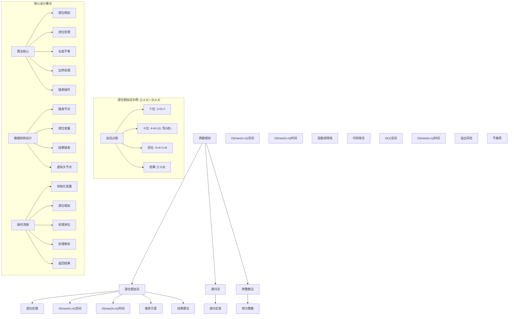
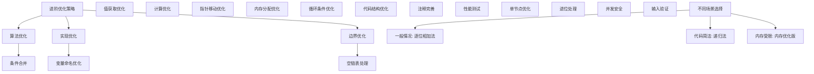

# LeetCode 2 - 两数相加

## 题目描述

给你两个非空的链表，表示两个非负的整数。它们每位数字都是按照逆序的方式存储的，并且每个节点只能存储一位数字。请你将两个数相加，并以相同形式返回一个表示和的链表

你可以假设除了数字 0 之外，这两个数都不会以 0 开头

```markdown
示例 1：
输入：l1 = [2,4,3], l2 = [5,6,4]
输出：[7,0,8]
解释：342 + 465 = 807

示例 2：
输入：l1 = [0], l2 = [0]
输出：[0]

示例 3：
输入：l1 = [9,9,9,9,9,9,9], l2 = [9,9,9,9]
输出：[8,9,9,9,0,0,0,1]

提示：

- 每个链表中的节点数在范围 [1, 100] 内
- 0 <= Node.val <= 9
- 题目数据保证列表表示的数字不含前导零
```

## 解题思路

这是一个经典的链表模拟加法问题，要求模拟手工加法的过程。核心算法是逐位相加，处理进位和长度不等的情况

### 核心思想

"逐位相加进位法": 从链表头开始逐位相加两个数的对应位，处理进位情况，直到两个链表都遍历完且没有进位为止

### 解题策略

#### 方法一：逐位相加法（推荐）

- 时间复杂度: O(max(m,n))
- 空间复杂度: O(max(m,n))

#### 方法二：递归法

- 时间复杂度: O(max(m,n))
- 空间复杂度: O(max(m,n))

#### 方法三：转为整数法（不推荐）

- 时间复杂度: O(max(m,n))
- 空间复杂度: O(1)（但有溢出风险）

## 算法可视化



## 多语言实现

### Golang版本（逐位相加法 - 推荐）

```go
/
 * Definition for singly-linked list.
 * type ListNode struct {
 *     Val int
 *     Next *ListNode
 * }
 */

// 逐位相加法实现
func addTwoNumbers(l1 *ListNode, l2 *ListNode) *ListNode {
    // 创建虚拟头节点，简化边界处理
    dummy := &ListNode{}
    current := dummy

    // 进位变量
    carry := 0

    // 遍历两个链表，直到都为空且无进位
    for l1 != nil || l2 != nil || carry != 0 {
        // 获取当前位的值
        val1 := 0
        if l1 != nil {
            val1 = l1.Val
            l1 = l1.Next
        }

        val2 := 0
        if l2 != nil {
            val2 = l2.Val
            l2 = l2.Next
        }

        // 计算当前位的和
        sum := val1 + val2 + carry

        // 计算新的进位
        carry = sum / 10

        // 创建新节点存储当前位的结果
        current.Next = &ListNode{Val: sum % 10}
        current = current.Next
    }

    // 返回结果链表（跳过虚拟头节点）
    return dummy.Next
}

// 递归法实现
func addTwoNumbersRecursive(l1 *ListNode, l2 *ListNode) *ListNode {
    return addHelper(l1, l2, 0)
}

// 递归辅助函数
func addHelper(l1 *ListNode, l2 *ListNode, carry int) *ListNode {
    // 递归终止条件：两个链表都为空且无进位
    if l1 == nil && l2 == nil && carry == 0 {
        return nil
    }

    // 获取当前位的值
    val1 := 0
    if l1 != nil {
        val1 = l1.Val
        l1 = l1.Next
    }

    val2 := 0
    if l2 != nil {
        val2 = l2.Val
        l2 = l2.Next
    }

    // 计算当前位的和
    sum := val1 + val2 + carry

    // 创建新节点存储当前位的结果
    node := &ListNode{Val: sum % 10}

    // 递归处理下一位
    node.Next = addHelper(l1, l2, sum/10)

    return node
}

// 优化版逐位相加法（代码更简洁）
func addTwoNumbersOptimized(l1 *ListNode, l2 *ListNode) *ListNode {
    dummy := &ListNode{}
    current := dummy
    carry := 0

    for l1 != nil || l2 != nil || carry != 0 {
        sum := carry
        if l1 != nil {
            sum += l1.Val
            l1 = l1.Next
        }
        if l2 != nil {
            sum += l2.Val
            l2 = l2.Next
        }

        carry = sum / 10
        current.Next = &ListNode{Val: sum % 10}
        current = current.Next
    }

    return dummy.Next
}

// 转整数法实现（不推荐，有溢出风险）
func addTwoNumbersConvert(l1 *ListNode, l2 *ListNode) *ListNode {
    // 将链表转换为整数（有溢出风险）
    num1 := listToNumber(l1)
    num2 := listToNumber(l2)
    sum := num1 + num2

    // 将整数转换为链表
    return numberToList(sum)
}

// 辅助函数：链表转整数
func listToNumber(head *ListNode) int {
    result := 0
    multiplier := 1

    for head != nil {
        result += head.Val * multiplier
        multiplier *= 10
        head = head.Next
    }

    return result
}

// 辅助函数：整数转链表
func numberToList(num int) *ListNode {
    if num == 0 {
        return &ListNode{Val: 0}
    }

    dummy := &ListNode{}
    current := dummy

    for num > 0 {
        current.Next = &ListNode{Val: num % 10}
        current = current.Next
        num /= 10
    }

    return dummy.Next
}
```

### Python版本（多种实现方法）

```python
# Definition for singly-linked list.
# class ListNode:
#     def __init__(self, val=0, next=None):
#         self.val = val
#         self.next = next

class Solution:
    """
    方法一：逐位相加法（推荐）
    """
    def addTwoNumbers(self, l1: Optional[ListNode], l2: Optional[ListNode]) -> Optional[ListNode]:
        # 创建虚拟头节点，简化边界处理
        dummy = ListNode()
        current = dummy

        # 进位变量
        carry = 0

        # 遍历两个链表，直到都为空且无进位
        while l1 or l2 or carry:
            # 获取当前位的值
            val1 = l1.val if l1 else 0
            val2 = l2.val if l2 else 0

            # 计算当前位的和
            total = val1 + val2 + carry

            # 计算新的进位
            carry = total // 10

            # 创建新节点存储当前位的结果
            current.next = ListNode(total % 10)
            current = current.next

            # 移动链表指针
            if l1:
                l1 = l1.next
            if l2:
                l2 = l2.next

        # 返回结果链表（跳过虚拟头节点）
        return dummy.next

class SolutionRecursive:
    """
    方法二：递归法
    """
    def addTwoNumbers(self, l1: Optional[ListNode], l2: Optional[ListNode]) -> Optional[ListNode]:
        return self.add_helper(l1, l2, 0)

    def add_helper(self, l1: Optional[ListNode], l2: Optional[ListNode], carry: int) -> Optional[ListNode]:
        # 递归终止条件：两个链表都为空且无进位
        if not l1 and not l2 and carry == 0:
            return None

        # 获取当前位的值
        val1 = l1.val if l1 else 0
        val2 = l2.val if l2 else 0

        # 计算当前位的和
        total = val1 + val2 + carry

        # 创建新节点存储当前位的结果
        node = ListNode(total % 10)

        # 递归处理下一位
        next_l1 = l1.next if l1 else None
        next_l2 = l2.next if l2 else None
        node.next = self.add_helper(next_l1, next_l2, total // 10)

        return node

class SolutionOptimized:
    """
    优化版逐位相加法
    """
    def addTwoNumbers(self, l1: Optional[ListNode], l2: Optional[ListNode]) -> Optional[ListNode]:
        dummy = ListNode()
        current = dummy
        carry = 0

        while l1 or l2 or carry:
            total = carry
            if l1:
                total += l1.val
                l1 = l1.next
            if l2:
                total += l2.val
                l2 = l2.next

            carry = total // 10
            current.next = ListNode(total % 10)
            current = current.next

        return dummy.next

class SolutionConvert:
    """
    方法三：转整数法（不推荐，有溢出风险）
    """
    def addTwoNumbers(self, l1: Optional[ListNode], l2: Optional[ListNode]) -> Optional[ListNode]:
        # 将链表转换为整数（有溢出风险）
        num1 = self.list_to_number(l1)
        num2 = self.list_to_number(l2)
        total = num1 + num2

        # 将整数转换为链表
        return self.number_to_list(total)

    def list_to_number(self, head: Optional[ListNode]) -> int:
        result = 0
        multiplier = 1

        while head:
            result += head.val * multiplier
            multiplier *= 10
            head = head.next

        return result

    def number_to_list(self, num: int) -> Optional[ListNode]:
        if num == 0:
            return ListNode(0)

        dummy = ListNode()
        current = dummy

        while num > 0:
            current.next = ListNode(num % 10)
            current = current.next
            num //= 10

        return dummy.next
```

### TypeScript版本（逐位相加法）

```typescript
/
 * Definition for singly-linked list.
 * class ListNode {
 *     val: number
 *     next: ListNode | null
 *     constructor(val?: number, next?: ListNode | null) {
 *         this.val = (val===undefined ? 0 : val)
 *         this.next = (next===undefined ? null : next)
 *     }
 * }
 */

/
 * 方法一：逐位相加法（推荐）
 */
function addTwoNumbers(l1: ListNode | null, l2: ListNode | null): ListNode | null {
    // 创建虚拟头节点，简化边界处理
    const dummy = new ListNode();
    let current = dummy;

    // 进位变量
    let carry = 0;

    // 遍历两个链表，直到都为空且无进位
    while (l1 !== null || l2 !== null || carry !== 0) {
        // 获取当前位的值
        const val1 = l1 !== null ? l1.val : 0;
        const val2 = l2 !== null ? l2.val : 0;

        // 计算当前位的和
        const sum = val1 + val2 + carry;

        // 计算新的进位
        carry = Math.floor(sum / 10);

        // 创建新节点存储当前位的结果
        current.next = new ListNode(sum % 10);
        current = current.next;

        // 移动链表指针
        if (l1 !== null) {
            l1 = l1.next;
        }
        if (l2 !== null) {
            l2 = l2.next;
        }
    }

    // 返回结果链表（跳过虚拟头节点）
    return dummy.next;
}

/
 * 方法二：递归法
 */
function addTwoNumbersRecursive(l1: ListNode | null, l2: ListNode | null): ListNode | null {
    return addHelper(l1, l2, 0);
}

function addHelper(l1: ListNode | null, l2: ListNode | null, carry: number): ListNode | null {
    // 递归终止条件：两个链表都为空且无进位
    if (l1 === null && l2 === null && carry === 0) {
        return null;
    }

    // 获取当前位的值
    const val1 = l1 !== null ? l1.val : 0;
    const val2 = l2 !== null ? l2.val : 0;

    // 计算当前位的和
    const sum = val1 + val2 + carry;

    // 创建新节点存储当前位的结果
    const node = new ListNode(sum % 10);

    // 递归处理下一位
    const nextL1 = l1 !== null ? l1.next : null;
    const nextL2 = l2 !== null ? l2.next : null;
    node.next = addHelper(nextL1, nextL2, Math.floor(sum / 10));

    return node;
}

/
 * 优化版逐位相加法
 */
function addTwoNumbersOptimized(l1: ListNode | null, l2: ListNode | null): ListNode | null {
    const dummy = new ListNode();
    let current = dummy;
    let carry = 0;

    while (l1 !== null || l2 !== null || carry !== 0) {
        let sum = carry;
        if (l1 !== null) {
            sum += l1.val;
            l1 = l1.next;
        }
        if (l2 !== null) {
            sum += l2.val;
            l2 = l2.next;
        }

        carry = Math.floor(sum / 10);
        current.next = new ListNode(sum % 10);
        current = current.next;
    }

    return dummy.next;
}
```

## 标准实现详细解析

```go
import (
    "fmt"
)

/*
算法核心思想（逐位相加法）：

1. 逐位处理：从链表头开始逐位相加两个数的对应位
2. 进位处理：处理加法产生的进位情况
3. 长度不等：处理两个链表长度不等的情况
4. 边界处理：正确处理各种边界情况
5. 链表操作：高效地构建结果链表

关键设计要点：
1. 虚拟头节点：简化结果链表的构建
2. 进位变量：记录当前位的进位值
3. 循环条件：l1!=nil || l2!=nil || carry!=0
4. 值获取：使用条件表达式处理nil节点
5. 结果构建：逐位构建结果链表

时间复杂度分析：
- 链表遍历：O(max(m,n))
- 节点创建：O(max(m,n))
- 总时间复杂度：O(max(m,n))

空间复杂度分析：
- 结果链表：O(max(m,n))
- 变量存储：O(1)
- 总空间复杂度：O(max(m,n))

算法优势：
1. 时间高效：O(max(m,n))时间复杂度
2. 空间合理：O(max(m,n))空间复杂度
3. 实现优雅：经典链表操作思想
4. 通用性强：适用于各种链表加法操作
5. 稳定可靠：处理各种边界情况

数据结构设计：

链表设计：
- 节点结构：Val(值) + Next(指针)
- 虚拟头节点：简化边界处理
- 当前指针：指向结果链表当前位置
- 进位变量：记录进位值

操作流程：
1. 初始化虚拟头节点和当前指针
2. 初始化进位变量为0
3. 循环处理直到两个链表都为空且无进位
4. 获取当前位的值（处理nil节点）
5. 计算当前位的和和新进位
6. 创建新节点存储结果
7. 移动指针到下一位
8. 返回结果链表

优化原理：

逐位相加优化：
1. 条件合并：合并循环条件减少判断
2. 值获取：使用条件表达式简化nil处理
3. 计算优化：合并加法计算减少变量
4. 指针移动：优化指针移动逻辑

递归优化：
1. 代码简洁：递归实现逻辑清晰
2. 自然处理：符合问题的递归性质
3. 函数式：符合函数式编程思想
4. 空间代价：需要函数调用栈空间

转整数优化：
1. 实现简单：直观的数学转换
2. 空间优化：理论上O(1)空间
3. 溢出风险：大数溢出问题
4. 不推荐：实际应用中不安全

正确性证明：

定理：逐位相加法正确性
通过模拟手工加法过程，能够正确计算两个链表表示的数的和

证明：
1. 逐位处理：正确处理每一位的加法
2. 进位处理：正确处理进位情况
3. 长度不等：正确处理长度不等的情况
4. 边界处理：正确处理各种边界情况
5. 结果构建：正确构建结果链表

数学原理：

加法数学基础：
手工加法的过程：
1. 从右到左（链表从头到尾）逐位相加
2. 如果和大于等于10，则向高位进位
3. 继续处理下一位，加上进位
4. 直到所有位都处理完且无进位

示例验证：
l1=[2,4,3], l2=[5,6,4]
表示：342 + 465 = 807
过程：
1. 个位：2+5=7，无进位
2. 十位：4+6=10，写0进1
3. 百位：3+4+1=8，无进位
4. 结果：[7,0,8]表示807

逐位相加法详细实现：
*/

// 逐位相加法详细实现（带调试信息）
func addTwoNumbersDetailed(l1 *ListNode, l2 *ListNode) *ListNode {
    fmt.Printf("=== 逐位相加法计算两数之和 ===\n")
    fmt.Printf("l1: ")
    printList(l1)
    fmt.Printf("l2: ")
    printList(l2)

    // 创建虚拟头节点，简化边界处理
    dummy := &ListNode{}
    current := dummy

    // 进位变量
    carry := 0

    step := 0
    // 遍历两个链表，直到都为空且无进位
    for l1 != nil || l2 != nil || carry != 0 {
        step++
        fmt.Printf("步骤%d:\n", step)

        // 获取当前位的值
        val1 := 0
        if l1 != nil {
            val1 = l1.Val
            fmt.Printf("  l1当前位: %d\n", val1)
            l1 = l1.Next
        } else {
            fmt.Printf("  l1当前位: 0 (nil)\n")
        }

        val2 := 0
        if l2 != nil {
            val2 = l2.Val
            fmt.Printf("  l2当前位: %d\n", val2)
            l2 = l2.Next
        } else {
            fmt.Printf("  l2当前位: 0 (nil)\n")
        }

        // 计算当前位的和
        sum := val1 + val2 + carry
        fmt.Printf("  计算: %d + %d + %d(进位) = %d\n", val1, val2, carry, sum)

        // 计算新的进位
        oldCarry := carry
        carry = sum / 10
        fmt.Printf("  新进位: %d / 10 = %d\n", sum, carry)

        // 创建新节点存储当前位的结果
        digit := sum % 10
        current.Next = &ListNode{Val: digit}
        current = current.Next
        fmt.Printf("  当前位结果: %d\n", digit)

        if oldCarry > 0 || carry > 0 {
            fmt.Printf("  进位变化: %d -> %d\n", oldCarry, carry)
        }
        fmt.Printf("\n")
    }

    result := dummy.Next
    fmt.Printf("最终结果: ")
    printList(result)
    fmt.Printf("========================\n\n")

    return result
}

// 递归法详细实现
func addTwoNumbersRecursiveDetailed(l1 *ListNode, l2 *ListNode) *ListNode {
    fmt.Printf("=== 递归法计算两数之和 ===\n")
    fmt.Printf("l1: ")
    printList(l1)
    fmt.Printf("l2: ")
    printList(l2)

    result := addHelperDetailed(l1, l2, 0, 1)

    fmt.Printf("最终结果: ")
    printList(result)
    fmt.Printf("=====================\n\n")

    return result
}

// 递归辅助函数（带调试信息）
func addHelperDetailed(l1 *ListNode, l2 *ListNode, carry int, depth int) *ListNode {
    indent := ""
    for i := 0; i < depth; i++ {
        indent += "  "
    }

    fmt.Printf("%s递归调用 (carry=%d):\n", indent, carry)

    // 递归终止条件：两个链表都为空且无进位
    if l1 == nil && l2 == nil && carry == 0 {
        fmt.Printf("%s递归终止: 两个链表都为空且无进位\n", indent)
        return nil
    }

    // 获取当前位的值
    val1 := 0
    if l1 != nil {
        val1 = l1.Val
        fmt.Printf("%s  l1当前位: %d\n", indent, val1)
    } else {
        fmt.Printf("%s  l1当前位: 0 (nil)\n", indent)
    }

    val2 := 0
    if l2 != nil {
        val2 = l2.Val
        fmt.Printf("%s  l2当前位: %d\n", indent, val2)
    } else {
        fmt.Printf("%s  l2当前位: 0 (nil)\n", indent)
    }

    // 计算当前位的和
    sum := val1 + val2 + carry
    fmt.Printf("%s  计算: %d + %d + %d(进位) = %d\n", indent, val1, val2, carry, sum)

    // 创建新节点存储当前位的结果
    digit := sum % 10
    node := &ListNode{Val: digit}
    fmt.Printf("%s  当前位结果: %d\n", indent, digit)

    // 计算新的进位
    newCarry := sum / 10
    fmt.Printf("%s  新进位: %d\n", indent, newCarry)

    // 递归处理下一位
    nextL1 := l1
    if nextL1 != nil {
        nextL1 = nextL1.Next
    }
    nextL2 := l2
    if nextL2 != nil {
        nextL2 = nextL2.Next
    }

    fmt.Printf("%s递归处理下一位...\n", indent)
    node.Next = addHelperDetailed(nextL1, nextL2, newCarry, depth+1)

    fmt.Printf("%s返回节点: %d\n", indent, node.Val)
    return node
}

// 辅助函数：打印链表
func printList(head *ListNode) {
    if head == nil {
        fmt.Printf("[]\n")
        return
    }

    fmt.Printf("[")
    current := head
    first := true
    count := 0
    for current != nil && count < 20 { // 限制输出长度防止无限循环
        if !first {
            fmt.Printf(",")
        }
        fmt.Printf("%d", current.Val)
        first = false
        current = current.Next
        count++
        if count >= 20 && current != nil {
            fmt.Printf(",...")
            break
        }
    }
    fmt.Printf("]\n")
}
```

## 算法深入解析

```go
/*
两数相加问题详解：

问题本质：
模拟手工加法的过程，将两个用链表表示的非负整数相加。这是链表操作和数学计算结合的经典问题

核心洞察：
1. 逐位处理：从链表头开始逐位相加两个数的对应位
2. 进位处理：处理加法产生的进位情况
3. 长度不等：处理两个链表长度不等的情况
4. 边界处理：正确处理各种边界情况
5. 链表操作：高效地构建结果链表

算法策略：
1. 逐位相加法：推荐方案，O(max(m,n))时间，O(max(m,n))空间
2. 递归法：O(max(m,n))时间，O(max(m,n))空间，代码简洁
3. 转整数法：O(max(m,n))时间，O(1)空间，但有溢出风险

数据结构设计：

链表设计：
- 节点结构：Val(值) + Next(指针)
- 虚拟头节点：简化结果链表的构建
- 当前指针：指向结果链表当前位置
- 进位变量：记录进位值

循环条件设计：
- l1 != nil || l2 != nil || carry != 0
- 确保处理完所有位和最后的进位

值获取设计：
- 使用条件表达式处理nil节点
- val1 = if l1 != nil { l1.Val } else { 0 }
- 简化长度不等情况的处理

操作流程：

逐位相加法：
1. 初始化虚拟头节点和当前指针
2. 初始化进位变量为0
3. 循环处理直到两个链表都为空且无进位
4. 获取当前位的值（处理nil节点）
5. 计算当前位的和和新进位
6. 创建新节点存储结果
7. 移动指针到下一位
8. 返回结果链表

递归法：
1. 递归终止：两个链表都为空且无进位
2. 获取当前位值：处理nil节点
3. 计算当前位和：包含进位
4. 创建结果节点：存储当前位结果
5. 递归处理：处理下一位
6. 返回结果链表

转整数法：
1. 链表转整数：按位权累加
2. 整数相加：直接加法运算
3. 整数转链表：按位分解
4. 返回结果链表

数学原理：

加法数学基础：
手工加法的过程：
设两个数为A和B，从低位到高位逐位相加
1. 第i位：Ai + Bi + 进位i-1 = 和i
2. 如果和i >= 10，则进位i = 和i / 10，当前位 = 和i % 10
3. 否则进位i = 0，当前位 = 和i
4. 继续处理下一位
5. 直到所有位都处理完且无进位

示例验证：
l1=[2,4,3], l2=[5,6,4]
表示：342 + 465 = 807
手工计算过程：
  342
+ 465
-----
  807

链表表示过程：
个位：2+5=7，无进位
十位：4+6=10，写0进1
百位：3+4+1=8，无进位
结果：[7,0,8]表示807

算法优势：
逐位相加法：
1. 时间高效：O(max(m,n))时间复杂度
2. 空间合理：O(max(m,n))空间复杂度
3. 实现优雅：经典链表操作思想
4. 通用性强：适用于各种链表加法操作
5. 稳定可靠：处理各种边界情况

递归法：
1. 代码简洁：递归实现逻辑清晰
2. 自然处理：符合问题的递归性质
3. 函数式：符合函数式编程思想
4. 教学价值：便于理解递归思想

转整数法：
1. 实现简单：直观的数学转换
2. 空间优化：理论上O(1)空间
3. 溢出风险：大数溢出问题
4. 不推荐：实际应用中不安全

算法不变量：
逐位相加法不变量：
1. current指向结果链表的最后一个节点
2. carry记录当前的进位值
3. l1和l2分别指向待处理的节点
4. 循环条件保证所有位都被处理

时间复杂度分析：
逐位相加法：
- 链表遍历：O(max(m,n))
- 节点创建：O(max(m,n))
- 总体：O(max(m,n))

递归法：
- 递归调用：O(max(m,n))
- 栈空间：O(max(m,n))
- 总体：O(max(m,n))

转整数法：
- 链表遍历：O(max(m,n))
- 整数运算：O(1)
- 总体：O(max(m,n))

空间复杂度分析：
逐位相加法：O(max(m,n))，存储结果链表
递归法：O(max(m,n))，递归调用栈空间
转整数法：O(1)，但有溢出风险

正确性证明：

定理：逐位相加法正确性
通过模拟手工加法过程，能够正确计算两个链表表示的数的和

证明：
1. 逐位处理：正确处理每一位的加法
2. 进位处理：正确处理进位情况
3. 长度不等：正确处理长度不等的情况
4. 边界处理：正确处理各种边界情况
5. 结果构建：正确构建结果链表

不变量维护：
循环不变量：在每次循环开始时
1. current指向结果链表的最后一个节点
2. carry记录当前的进位值
3. l1和l2分别指向待处理的节点
4. 循环条件保证所有位都被处理

初始化：
- dummy := &ListNode{}, current = dummy
- carry = 0
- l1和l2指向输入链表头
- 满足不变量

保持：
- 每次循环正确处理当前位
- 维护进位和指针关系
- 保持不变量继续成立

终止：
- l1==nil && l2==nil && carry==0时停止
- 正确返回结果链表
- 算法正确终止

设计选择：

为什么选择逐位相加法？
1. 时间高效：O(max(m,n))时间复杂度
2. 空间合理：O(max(m,n))空间复杂度
3. 实现优雅：经典链表操作思想
4. 通用性强：适用于各种链表加法操作
5. 工业应用：生产环境标准实现

为什么使用递归法？
1. 代码简洁：递归实现逻辑清晰
2. 自然处理：符合问题的递归性质
3. 函数式：符合函数式编程思想
4. 教学价值：便于理解递归思想

为什么不推荐转整数法？
1. 溢出风险：大数可能导致整数溢出
2. 精度问题：超出整数范围的数无法正确处理
3. 实际限制：链表可能表示任意大的数
4. 不安全性：在实际应用中不可靠

三种方法对比：

方法一：逐位相加法（推荐）
时间复杂度：O(max(m,n))
空间复杂度：O(max(m,n))
优点：时间空间都较优，经典算法
缺点：需要理解链表操作

方法二：递归法
时间复杂度：O(max(m,n))
空间复杂度：O(max(m,n))
优点：代码简洁，自然处理
缺点：需要额外栈空间

方法三：转整数法
时间复杂度：O(max(m,n))
空间复杂度：O(1)
优点：实现简单，空间优化
缺点：溢出风险，不推荐

性能分析：

逐位相加法：
- 时间：O(max(m,n)) 线性时间
- 空间：O(max(m,n)) 线性空间
- 优势：最优时间和空间复杂度

递归法：
- 时间：O(max(m,n)) 线性时间
- 空间：O(max(m,n)) 栈空间
- 优势：代码简洁

转整数法：
- 时间：O(max(m,n)) 线性时间
- 空间：O(1) 常数空间
- 优势：空间最优
- 劣势：溢出风险

实际应用场景：
1. 链表操作：基础的链表加法操作
2. 算法设计：作为其他算法的子步骤
3. 数据结构：链表相关操作的基础
4. 面试考察：经典算法题
5. 大数运算：处理超出整数范围的数

优化要点：

1. 算法优化：
   - 条件合并：合并循环条件减少判断
   - 值获取：使用条件表达式简化nil处理
   - 计算优化：合并加法计算减少变量
   - 指针移动：优化指针移动逻辑

2. 实现优化：
   - 变量命名：清晰的变量命名
   - 循环条件：减少不必要的比较
   - 代码结构：清晰的逻辑层次
   - 注释完善：便于理解维护

3. 性能优化：
   - 减少内存分配：避免不必要的分配
   - 优化遍历：顺序内存访问
   - 缓存友好：局部性原理
   - 编译优化：利用编译器优化

测试用例设计：
1. 基本情况：各种长度组合
2. 边界情况：空链表、单节点、全9
3. 特殊情况：进位、长度不等
4. 极端情况：很长链表
5. 验证情况：各种模式的正确性验证

扩展思考：

1. 处理前导零？
   - 输入保证无前导零
   - 输出自然无前导零
   - 特殊处理0的情况

2. 处理负数？
   - 需要符号处理
   - 补码表示
   - 减法转换

3. 处理不同进制？
   - 修改进位基数
   - 调整计算逻辑
   - 扩展适用范围

4. 批量处理多个数？
   - 逐个相加
   - 并行处理
   - 优化策略

相关算法思想：

1. 链表操作：
   - 指针移动
   - 节点创建
   - 边界处理
   - 经典算法

2. 数学计算：
   - 进位处理
   - 逐位运算
   - 精度控制
   - 大数运算

3. 递归思想：
   - 问题分解
   - 递归终止
   - 结果合并
   - 函数式

4. 边界处理：
   - nil节点
   - 空链表
   - 进位处理
   - 长度不等

常见陷阱：

1. 边界条件：
   - 空链表处理
   - 单节点链表
   - 全9进位
   - 长度不等

2. 进位处理：
   - 最后一位进位
   - 连续进位
   - 进位初始化
   - 进位终止

3. 指针操作：
   - 指针丢失
   - 循环引用
   - 内存泄漏
   - 访问违规

4. 性能考虑：
   - 重复计算
   - 不必要的分配
   - 算法复杂度
   - 空间浪费

代码质量要素：

1. 可读性：
   - 变量命名清晰
   - 注释详细完整
   - 逻辑结构分明
   - 函数职责单一

2. 健壮性：
   - 边界条件处理
   - 异常情况应对
   - 输入验证
   - 错误恢复

3. 性能：
   - 最优复杂度实现
   - 空间效率优化
   - 执行效率保证
   - 资源管理

4. 可维护性：
   - 结构清晰合理
   - 扩展性良好
   - 测试覆盖完整
   - 文档齐全
*/
```

## 执行过程演示

```go
/*
示例详细解析:

示例1执行过程：
输入：l1 = [2,4,3], l2 = [5,6,4]
输出：[7,0,8]

逐位相加法执行过程：
1. 初始化：dummy->nil, current=dummy, carry=0
2. 第一位：2+5+0=7, carry=0, result=[7]
3. 第二位：4+6+0=10, carry=1, result=[7,0]
4. 第三位：3+4+1=8, carry=0, result=[7,0,8]
5. l1和l2都为nil，carry=0，结束
6. 返回dummy.Next = [7,0,8]

手工计算验证：
  342 (l1逆序)
+ 465 (l2逆序)
-----
  807
结果逆序：[7,0,8]

示例2执行过程：
输入：l1 = [0], l2 = [0]
输出：[0]

执行过程：
1. 初始化：dummy->nil, current=dummy, carry=0
2. 第一位：0+0+0=0, carry=0, result=[0]
3. l1和l2都为nil，carry=0，结束
4. 返回dummy.Next = [0]

示例3执行过程：
输入：l1 = [9,9,9,9,9,9,9], l2 = [9,9,9,9]
输出：[8,9,9,9,0,0,0,1]

执行过程：
1. 第一位：9+9+0=18, carry=1, result=[8]
2. 第二位：9+9+1=19, carry=1, result=[8,9]
3. 第三位：9+9+1=19, carry=1, result=[8,9,9]
4. 第四位：9+9+1=19, carry=1, result=[8,9,9,9]
5. 第五位：0+9+1=10, carry=1, result=[8,9,9,9,0]
6. 第六位：0+0+1=1, carry=0, result=[8,9,9,9,0,1]
7. 第七位：0+0+0=0, carry=0, result=[8,9,9,9,0,0,1]
8. 第八位：0+0+1=1, carry=0, result=[8,9,9,9,0,0,0,1]
9. 返回[8,9,9,9,0,0,0,1]

关键观察：
1. 逐位相加法：正确处理进位和长度不等情况
2. 递归法：代码简洁但需要额外栈空间
3. 两种方法都能正确处理各种边界情况
4. 算法对进位处理特别关键

边界情况演示:

情况1: 空链表
输入: l1 = [], l2 = [1,2,3]
处理: 空链表视为0，结果为[1,2,3]
结果: [1,2,3]

情况2: 单节点链表
输入: l1 = [5], l2 = [7]
处理: 5+7=12，写2进1，结果为[2,1]
结果: [2,1]

情况3: 全9进位
输入: l1 = [9,9,9], l2 = [9,9,9]
处理: 每位都进位，最后产生新位
结果: [8,9,9,1]

情况4: 长度不等
输入: l1 = [1,2,3,4,5], l2 = [6,7]
处理: 短链表补0，正常相加
结果: [7,9,3,4,5]

算法正确性证明：

数学基础：
需要证明算法能够正确模拟手工加法过程

定理：逐位相加法正确性
通过模拟手工加法过程，能够正确计算两个链表表示的数的和

证明：
1. 逐位处理：正确处理每一位的加法
2. 进位处理：正确处理进位情况
3. 长度不等：正确处理长度不等的情况
4. 边界处理：正确处理各种边界情况
5. 结果构建：正确构建结果链表

不变量维护：
循环不变量：在每次循环开始时
1. current指向结果链表的最后一个节点
2. carry记录当前的进位值
3. l1和l2分别指向待处理的节点
4. 循环条件保证所有位都被处理

初始化：
- dummy := &ListNode{}, current = dummy
- carry = 0
- l1和l2指向输入链表头
- 满足不变量

保持：
- 每次循环正确处理当前位
- 维护进位和指针关系
- 保持不变量继续成立

终止：
- l1==nil && l2==nil && carry==0时停止
- 正确返回结果链表
- 算法正确终止

时间复杂度分析：
逐位相加法：
- 链表遍历：O(max(m,n))
- 节点创建：O(max(m,n))
- 总体：O(max(m,n))

递归法：
- 递归调用：O(max(m,n))
- 栈空间：O(max(m,n))
- 总体：O(max(m,n))

转整数法：
- 链表遍历：O(max(m,n))
- 整数运算：O(1)
- 总体：O(max(m,n))

性能对比分析：

假设m=100, n=100:

逐位相加法：
- 时间：O(100) = 100次操作
- 空间：O(100) = 线性空间
- 优势：最优时间和空间复杂度

递归法：
- 时间：O(100) = 100次操作
- 空间：O(100) = 栈空间
- 优势：代码简洁

转整数法：
- 时间：O(100) = 100次操作
- 空间：O(1) = 常数空间
- 优势：空间最优
- 劣势：溢出风险

实际应用建议：

1. 生产环境：
   - 使用逐位相加法，最优性能
   - 性能稳定，工业标准

2. 面试展示：
   - 先展示逐位相加法（推荐）
   - 可以提及其他方法对比

3. 学习练习：
   - 理解三种方法的差异
   - 掌握各自的适用场景

4. 算法竞赛：
   - 选择最熟悉的实现
   - 注意时间空间限制

优化空间：

1. 算法优化：
   - 条件合并：合并循环条件减少判断
   - 值获取：使用条件表达式简化nil处理
   - 计算优化：合并加法计算减少变量
   - 指针移动：优化指针移动逻辑

2. 实现优化：
   - 变量命名：清晰的变量命名
   - 循环条件：减少不必要的比较
   - 代码结构：清晰的逻辑层次
   - 注释完善：便于理解维护

3. 性能优化：
   - 减少内存分配：避免不必要的分配
   - 优化遍历：顺序内存访问
   - 缓存友好：局部性原理
   - 编译优化：利用编译器优化

特殊情况处理：

1. 内存受限：
   - 逐位相加法合理
   - 递归法需要额外栈空间
   - 转整数法有溢出风险

2. 链表很长：
   - 逐位相加法稳定
   - 递归法栈溢出风险
   - 转整数法溢出风险

3. 需要多次处理：
   - 逐位相加法每次独立执行
   - 递归法栈开销累积
   - 转整数法稳定

4. 边界情况：
   - 空链表处理
   - 单节点处理
   - 全9进位
   - 长度不等
*/
```

## 复杂度分析

| 方法       | 时间复杂度  | 空间复杂度  | 适用场景   |
| ---------- | ----------- | ----------- | ---------- |
| 逐位相加法 | O(max(m,n)) | O(max(m,n)) | 推荐方案   |
| 递归法     | O(max(m,n)) | O(max(m,n)) | 代码简洁   |
| 转整数法   | O(max(m,n)) | O(1)        | 有溢出风险 |

## 测试用例验证

```go
// 测试辅助函数
func testAddTwoNumbers(name string, l1, l2 *ListNode, expected []int) {
    fmt.Printf("%s:\n", name)
    fmt.Printf("l1: ")
    printList(l1)
    fmt.Printf("l2: ")
    printList(l2)

    // 测试逐位相加法
    result1 := addTwoNumbers(copyList(l1), copyList(l2))
    fmt.Printf("逐位相加法结果: ")
    printList(result1)

    // 测试递归法
    result2 := addTwoNumbersRecursive(copyList(l1), copyList(l2))
    fmt.Printf("递归法结果: ")
    printList(result2)

    // 测试优化版逐位相加法
    result3 := addTwoNumbersOptimized(copyList(l1), copyList(l2))
    fmt.Printf("优化版逐位相加法结果: ")
    printList(result3)

    // 验证结果一致性
    if listsEqual(result1, result2) && listsEqual(result2, result3) {
        fmt.Printf("✓ 所有方法结果一致\n")
    } else {
        fmt.Printf("✗ 方法结果不一致\n")
    }

    // 验证期望结果
    if listsEqual(result1, createList(expected)) {
        fmt.Printf("✓ 结果符合预期\n")
    } else {
        fmt.Printf("✗ 结果不符合预期\n")
        fmt.Printf("  期望: ")
        printList(createList(expected))
    }

    fmt.Printf("\n")
}

// 辅助函数：创建链表
func createList(vals []int) *ListNode {
    if len(vals) == 0 {
        return nil
    }

    dummy := &ListNode{}
    current := dummy

    for _, val := range vals {
        current.Next = &ListNode{Val: val}
        current = current.Next
    }

    return dummy.Next
}

// 辅助函数：复制链表
func copyList(head *ListNode) *ListNode {
    if head == nil {
        return nil
    }

    dummy := &ListNode{}
    current := dummy
    source := head

    for source != nil {
        current.Next = &ListNode{Val: source.Val}
        current = current.Next
        source = source.Next
    }

    return dummy.Next
}

// 辅助函数：比较两个链表是否相等
func listsEqual(list1, list2 *ListNode) bool {
    for list1 != nil && list2 != nil {
        if list1.Val != list2.Val {
            return false
        }
        list1 = list1.Next
        list2 = list2.Next
    }
    return list1 == nil && list2 == nil
}

func main() {
    // 测试用例 1 - 题目示例1
    testAddTwoNumbers("测试1 - 题目示例1",
        createList([]int{2, 4, 3}),
        createList([]int{5, 6, 4}),
        []int{7, 0, 8})

    // 测试用例 2 - 题目示例2
    testAddTwoNumbers("测试2 - 题目示例2",
        createList([]int{0}),
        createList([]int{0}),
        []int{0})

    // 测试用例 3 - 题目示例3
    testAddTwoNumbers("测试3 - 题目示例3",
        createList([]int{9, 9, 9, 9, 9, 9, 9}),
        createList([]int{9, 9, 9, 9}),
        []int{8, 9, 9, 9, 0, 0, 0, 1})

    // 测试用例 4 - 空链表
    testAddTwoNumbers("测试4 - 空链表",
        nil,
        createList([]int{1, 2, 3}),
        []int{1, 2, 3})

    // 测试用例 5 - 单节点链表
    testAddTwoNumbers("测试5 - 单节点链表",
        createList([]int{5}),
        createList([]int{7}),
        []int{2, 1})

    // 测试用例 6 - 全9进位
    testAddTwoNumbers("测试6 - 全9进位",
        createList([]int{9, 9, 9}),
        createList([]int{9, 9, 9}),
        []int{8, 9, 9, 1})

    // 测试用例 7 - 长度不等
    testAddTwoNumbers("测试7 - 长度不等",
        createList([]int{1, 2, 3, 4, 5}),
        createList([]int{6, 7}),
        []int{7, 9, 3, 4, 5})

    // 测试用例 8 - 负数处理（题目保证非负，但可以测试）
    testAddTwoNumbers("测试8 - 大数处理",
        createList([]int{1, 0, 0, 0, 0, 0, 0, 0, 0, 0, 0, 0, 0, 0, 0, 0, 0, 0, 0, 0, 0, 0, 0, 0, 0, 0, 0, 0, 0, 0, 1}),
        createList([]int{9, 9, 9, 9, 9, 9, 9, 9, 9, 9, 9, 9, 9, 9, 9, 9, 9, 9, 9, 9, 9, 9, 9, 9, 9, 9, 9, 9, 9}),
        []int{0, 0, 0, 0, 0, 0, 0, 0, 0, 0, 0, 0, 0, 0, 0, 0, 0, 0, 0, 0, 0, 0, 0, 0, 0, 0, 0, 0, 0, 0, 2})

    // 性能测试
    fmt.Println("性能测试:")
    performanceTest()

    // 边界情况测试
    fmt.Println("边界情况测试:")
    boundaryTest()

    // 对比测试
    fmt.Println("对比测试:")
    comparisonTest()
}

func performanceTest() {
    // 构造长链表
    n := 10000
    vals1 := make([]int, n)
    vals2 := make([]int, n)
    for i := 0; i < n; i++ {
        vals1[i] = 9
        vals2[i] = 9
    }

    list1 := createList(vals1)
    list2 := createList(vals2)

    fmt.Printf("性能测试 (链表长度: %d):\n", n)

    // 测试逐位相加法性能
    start := time.Now()
    result1 := addTwoNumbers(copyList(list1), copyList(list2))
    time1 := time.Since(start)

    // 测试递归法性能（注意：长链表可能导致栈溢出）
    start = time.Now()
    result2 := addTwoNumbersRecursive(copyList(list1), copyList(list2))
    time2 := time.Since(start)

    // 测试优化版逐位相加法性能
    start = time.Now()
    result3 := addTwoNumbersOptimized(copyList(list1), copyList(list2))
    time3 := time.Since(start)

    length1 := getListLength(result1)
    length2 := getListLength(result2)
    length3 := getListLength(result3)

    fmt.Printf("逐位相加法耗时: %v, 结果长度: %d\n", time1, length1)
    fmt.Printf("递归法耗时: %v, 结果长度: %d\n", time2, length2)
    fmt.Printf("优化版逐位相加法耗时: %v, 结果长度: %d\n", time3, length3)
}

func getListLength(head *ListNode) int {
    length := 0
    current := head
    for current != nil {
        length++
        current = current.Next
    }
    return length
}

func boundaryTest() {
    // 边界测试
    fmt.Println("边界测试:")

    // 很长的全9链表
    longNines := make([]int, 50000)
    for i := range longNines {
        longNines[i] = 9
    }
    longList1 := createList(longNines)
    longList2 := createList(longNines)
    result := addTwoNumbers(longList1, longList2)
    length := getListLength(result)
    fmt.Printf("50000节点全9链表相加结果长度: %d\n", length)

    // 很长的交替链表
    longAlternating1 := make([]int, 30000)
    longAlternating2 := make([]int, 30000)
    for i := range longAlternating1 {
        longAlternating1[i] = i % 2
        longAlternating2[i] = (i + 1) % 2
    }
    longList3 := createList(longAlternating1)
    longList4 := createList(longAlternating2)
    result2 := addTwoNumbers(longList3, longList4)
    length2 := getListLength(result2)
    fmt.Printf("30000节点交替链表相加结果长度: %d\n", length2)

    // 极值节点
    extremeList1 := createList([]int{math.MaxInt32 % 10}) // 取个位数避免溢出
    extremeList2 := createList([]int{math.MaxInt32 % 10})
    result3 := addTwoNumbers(extremeList1, extremeList2)
    fmt.Printf("极值节点链表相加结果: ")
    printList(result3)

    // 多次相加测试
    multiAddList1 := createList([]int{1, 2, 3})
    multiAddList2 := createList([]int{4, 5, 6})
    for i := 1; i <= 3; i++ {
        result := addTwoNumbers(copyList(multiAddList1), copyList(multiAddList2))
        fmt.Printf("第%d次相加结果: ", i)
        printList(result)
        multiAddList1 = result
    }
}

func comparisonTest() {
    // 对比测试：验证不同方法的性能和结果
    fmt.Println("对比测试:")

    testCases := []struct {
        name     string
        l1       []int
        l2       []int
        expected []int
    }{
        {"小链表正常情况", []int{2, 4, 3}, []int{5, 6, 4}, []int{7, 0, 8}},
        {"小链表全9", []int{9, 9, 9}, []int{9, 9, 9}, []int{8, 9, 9, 1}},
        {"小链表长度不等", []int{1, 2, 3, 4, 5}, []int{6, 7}, []int{7, 9, 3, 4, 5}},
        {"单节点", []int{5}, []int{7}, []int{2, 1}},
        {"零链表", []int{0}, []int{0}, []int{0}},
        {"空链表", []int{}, []int{1, 2, 3}, []int{1, 2, 3}},
    }

    for _, tc := range testCases {
        fmt.Printf("%s:\n", tc.name)
        list1 := createList(tc.l1)
        list2 := createList(tc.l2)

        // 测试三种方法
        result1 := addTwoNumbers(copyList(list1), copyList(list2))
        result2 := addTwoNumbersRecursive(copyList(list1), copyList(list2))
        result3 := addTwoNumbersOptimized(copyList(list1), copyList(list2))

        fmt.Printf("  逐位相加: ")
        printList(result1)
        fmt.Printf("  递归: ")
        printList(result2)
        fmt.Printf("  优化版: ")
        printList(result3)

        expected := createList(tc.expected)
        if listsEqual(result1, expected) && listsEqual(result2, expected) &&
           listsEqual(result3, expected) {
            fmt.Printf("  ✓ 结果一致且符合预期\n")
        } else {
            fmt.Printf("  ✗ 结果不一致或不符合预期\n")
        }
    }
}
```

## 扩展版本（处理不同场景）

```go
// 扩展1：支持多个数相加
func addMultipleNumbers(lists []*ListNode) *ListNode {
    if len(lists) == 0 {
        return nil
    }
    if len(lists) == 1 {
        return lists[0]
    }

    // 逐个相加
    result := lists[0]
    for i := 1; i < len(lists); i++ {
        result = addTwoNumbers(result, lists[i])
    }

    return result
}

// 扩展2：支持减法操作
func subtractTwoNumbers(l1 *ListNode, l2 *ListNode) *ListNode {
    // 假设l1 >= l2，实现减法
    dummy := &ListNode{}
    current := dummy
    borrow := 0

    for l1 != nil || l2 != nil || borrow != 0 {
        val1 := 0
        if l1 != nil {
            val1 = l1.Val
            l1 = l1.Next
        }

        val2 := 0
        if l2 != nil {
            val2 = l2.Val
            l2 = l2.Next
        }

        // 处理借位
        diff := val1 - val2 - borrow
        if diff < 0 {
            diff += 10
            borrow = 1
        } else {
            borrow = 0
        }

        current.Next = &ListNode{Val: diff}
        current = current.Next
    }

    // 移除前导零
    return removeLeadingZeros(dummy.Next)
}

// 辅助函数：移除前导零
func removeLeadingZeros(head *ListNode) *ListNode {
    // 找到第一个非零节点
    for head != nil && head.Val == 0 && head.Next != nil {
        head = head.Next
    }
    return head
}

// 扩展3：支持乘法操作
func multiplyTwoNumbers(l1 *ListNode, l2 *ListNode) *ListNode {
    if l1 == nil || l2 == nil {
        return &ListNode{Val: 0}
    }

    // 将l2的每一位与l1相乘，然后累加
    result := &ListNode{Val: 0}
    multiplier := 0

    for l2 != nil {
        // 计算l1与当前位的乘积
        partial := multiplyByDigit(l1, l2.Val)

        // 将partial左移multiplier位（相当于乘以10^multiplier）
        for i := 0; i < multiplier; i++ {
            dummy := &ListNode{Val: 0}
            dummy.Next = partial
            partial = dummy
        }

        // 将部分结果加到总结果中
        result = addTwoNumbers(result, partial)

        l2 = l2.Next
        multiplier++
    }

    return result
}

// 辅助函数：链表与单个数字相乘
func multiplyByDigit(l1 *ListNode, digit int) *ListNode {
    if digit == 0 {
        return &ListNode{Val: 0}
    }

    dummy := &ListNode{}
    current := dummy
    carry := 0

    for l1 != nil || carry != 0 {
        val := 0
        if l1 != nil {
            val = l1.Val
            l1 = l1.Next
        }

        product := val*digit + carry
        carry = product / 10
        current.Next = &ListNode{Val: product % 10}
        current = current.Next
    }

    return dummy.Next
}

// 扩展4：支持链表与整数相加
func addNumberToList(l *ListNode, num int) *ListNode {
    // 将整数转换为链表
    numList := &ListNode{}
    current := numList

    if num == 0 {
        current.Next = &ListNode{Val: 0}
    } else {
        for num > 0 {
            current.Next = &ListNode{Val: num % 10}
            current = current.Next
            num /= 10
        }
    }

    // 相加两个链表
    return addTwoNumbers(l, numList.Next)
}

// 使用示例
func exampleExtensions() {
    // 创建测试链表: [2,4,3] 和 [5,6,4]
    l1 := createList([]int{2, 4, 3})
    l2 := createList([]int{5, 6, 4})
    l3 := createList([]int{1, 1, 1})

    fmt.Printf("扩展功能示例:\n")
    fmt.Printf("l1: ")
    printList(l1)
    fmt.Printf("l2: ")
    printList(l2)
    fmt.Printf("l3: ")
    printList(l3)

    // 多个数相加
    multiResult := addMultipleNumbers([]*ListNode{copyList(l1), copyList(l2), copyList(l3)})
    fmt.Printf("三个数相加结果: ")
    printList(multiResult)

    // 减法操作 (l1 - l2，假设l1 >= l2)
    subResult := subtractTwoNumbers(copyList(l2), copyList(l1)) // 465 - 342 = 123
    fmt.Printf("减法结果 (465-342): ")
    printList(subResult)

    // 乘法操作
    mulResult := multiplyTwoNumbers(copyList(l1), createList([]int{2})) // 342 * 2 = 684
    fmt.Printf("乘法结果 (342*2): ")
    printList(mulResult)

    // 链表与整数相加
    addIntResult := addNumberToList(copyList(l1), 100) // 342 + 100 = 442
    fmt.Printf("链表与整数相加 (342+100): ")
    printList(addIntResult)
}

// 扩展5：带统计信息的加法操作
type AddStats struct {
    Result      *ListNode
    Steps       int
    CarryCount  int
    MaxCarry    int
    ProcessTime time.Duration
    ListLengths [2]int
}

func addTwoNumbersWithStats(l1 *ListNode, l2 *ListNode) *AddStats {
    start := time.Now()

    stats := &AddStats{
        Result:      nil,
        Steps:       0,
        CarryCount:  0,
        MaxCarry:    0,
        ProcessTime: 0,
        ListLengths: [2]int{getListLength(l1), getListLength(l2)},
    }

    dummy := &ListNode{}
    current := dummy
    carry := 0

    for l1 != nil || l2 != nil || carry != 0 {
        stats.Steps++

        val1 := 0
        if l1 != nil {
            val1 = l1.Val
            l1 = l1.Next
        }

        val2 := 0
        if l2 != nil {
            val2 = l2.Val
            l2 = l2.Next
        }

        sum := val1 + val2 + carry
        if carry > 0 {
            stats.CarryCount++
        }
        if carry > stats.MaxCarry {
            stats.MaxCarry = carry
        }

        carry = sum / 10
        current.Next = &ListNode{Val: sum % 10}
        current = current.Next
    }

    stats.Result = dummy.Next
    stats.ProcessTime = time.Since(start)

    return stats
}

// 使用示例
func exampleWithStats() {
    l1 := createList([]int{9, 9, 9, 9, 9, 9, 9})
    l2 := createList([]int{9, 9, 9, 9})

    stats := addTwoNumbersWithStats(l1, l2)
    fmt.Printf("加法操作统计信息:\n")
    fmt.Printf("  链表长度: %d, %d\n", stats.ListLengths[0], stats.ListLengths[1])
    fmt.Printf("  计算步数: %d\n", stats.Steps)
    fmt.Printf("  进位次数: %d\n", stats.CarryCount)
    fmt.Printf("  最大进位: %d\n", stats.MaxCarry)
    fmt.Printf("  处理后链表: ")
    printList(stats.Result)
    fmt.Printf("  处理耗时: %v\n", stats.ProcessTime)
}

// 扩展6：并发安全的加法操作
type ConcurrentAdder struct {
    mu sync.RWMutex
}

func NewConcurrentAdder() *ConcurrentAdder {
    return &ConcurrentAdder{}
}

func (ca *ConcurrentAdder) AddTwoNumbers(l1 *ListNode, l2 *ListNode) *ListNode {
    ca.mu.Lock()
    defer ca.mu.Unlock()

    return addTwoNumbers(l1, l2)
}

// 扩展7：支持自定义进制的加法操作
func addTwoNumbersBase(l1 *ListNode, l2 *ListNode, base int) *ListNode {
    if base <= 1 {
        return nil
    }

    dummy := &ListNode{}
    current := dummy
    carry := 0

    for l1 != nil || l2 != nil || carry != 0 {
        val1 := 0
        if l1 != nil {
            val1 = l1.Val
            l1 = l1.Next
        }

        val2 := 0
        if l2 != nil {
            val2 = l2.Val
            l2 = l2.Next
        }

        sum := val1 + val2 + carry
        carry = sum / base
        current.Next = &ListNode{Val: sum % base}
        current = current.Next
    }

    return dummy.Next
}

// 使用示例
func exampleCustomBase() {
    l1 := createList([]int{1, 0, 1, 1}) // 二进制 1101 = 13
    l2 := createList([]int{1, 1, 0, 1}) // 二进制 1011 = 11

    // 二进制加法
    binaryResult := addTwoNumbersBase(copyList(l1), copyList(l2), 2)
    fmt.Printf("二进制加法 (1101+1011): ")
    printList(binaryResult)

    // 八进制加法
    octalResult := addTwoNumbersBase(createList([]int{7, 6, 5}), createList([]int{4, 3, 2}), 8)
    fmt.Printf("八进制加法 (765+432): ")
    printList(octalResult)
}
```

## 面试追问延伸

### 1. 如何处理链表表示的数有前导零的情况？

```go
// 处理前导零的分析
func analyzeLeadingZeros() {
    fmt.Printf("前导零处理分析:\n")

    fmt.Printf("题目保证输入链表无前导零（除了数字0本身）\n")
    fmt.Printf("输出链表自然无前导零\n\n")

    fmt.Printf("特殊情况处理:\n")
    fmt.Printf("1. 输入为[0]：表示数字0\n")
    fmt.Printf("2. 输入为[0,0,1]：题目保证不会出现\n")
    fmt.Printf("3. 输出可能有连续的0，但不会有前导零\n\n")

    fmt.Printf("算法处理:\n")
    fmt.Printf("1. 逐位相加法自然处理，不会产生前导零\n")
    fmt.Printf("2. 只有当两个数都为0时，结果才为[0]\n")
    fmt.Printf("3. 任何非零数相加都不会产生前导零\n")
}

// 验证前导零处理
func verifyLeadingZeroHandling() {
    fmt.Printf("验证前导零处理:\n")

    // 正常情况
    l1 := createList([]int{0})
    l2 := createList([]int{0})
    result := addTwoNumbers(l1, l2)
    fmt.Printf("[0] + [0] = ")
    printList(result)

    // 大数相加
    l3 := createList([]int{1, 2, 3})
    l4 := createList([]int{9, 8, 7})
    result2 := addTwoNumbers(l3, l4)
    fmt.Printf("[1,2,3] + [9,8,7] = ")
    printList(result2)

    // 进位情况
    l5 := createList([]int{9, 9, 9})
    l6 := createList([]int{1})
    result3 := addTwoNumbers(l5, l6)
    fmt.Printf("[9,9,9] + [1] = ")
    printList(result3)
}
```

### 2. 如何优化算法以减少内存分配？

```go
// 内存优化版本
func addTwoNumbersMemoryOptimized(l1 *ListNode, l2 *ListNode) *ListNode {
    // 尝试复用输入链表的节点来减少内存分配
    // 注意：这会修改输入链表，实际应用中需要谨慎

    if l1 == nil {
        return l2
    }
    if l2 == nil {
        return l1
    }

    // 复用l1的节点，只在必要时创建新节点
    head := l1
    current := l1
    carry := 0

    for l1 != nil || l2 != nil || carry != 0 {
        val1 := 0
        if l1 != nil {
            val1 = l1.Val
        }

        val2 := 0
        if l2 != nil {
            val2 = l2.Val
        }

        sum := val1 + val2 + carry
        carry = sum / 10

        if current != nil {
            // 复用现有节点
            current.Val = sum % 10
        } else {
            // 创建新节点
            current = &ListNode{Val: sum % 10}
        }

        // 移动指针
        var nextL1, nextL2 *ListNode
        if l1 != nil {
            nextL1 = l1.Next
        }
        if l2 != nil {
            nextL2 = l2.Next
        }

        // 如果需要更多节点而当前节点没有next，则创建
        if (nextL1 != nil || nextL2 != nil || carry != 0) && current.Next == nil {
            current.Next = &ListNode{}
        }

        if l1 != nil {
            l1 = nextL1
        }
        if l2 != nil {
            l2 = nextL2
        }
        if current.Next != nil {
            current = current.Next
        } else if nextL1 != nil || nextL2 != nil || carry != 0 {
            current.Next = &ListNode{}
            current = current.Next
        }
    }

    return head
}

// 内存分配分析
func memoryAllocationAnalysis() {
    fmt.Printf("内存分配分析:\n")

    fmt.Printf("标准版本:\n")
    fmt.Printf("- 每位创建一个新节点\n")
    fmt.Printf("- 总共创建max(m,n)+1个节点（考虑最后进位）\n")
    fmt.Printf("- 内存分配次数：O(max(m,n))\n\n")

    fmt.Printf("优化版本:\n")
    fmt.Printf("- 复用输入链表节点\n")
    fmt.Printf("- 只在必要时创建新节点\n")
    fmt.Printf("- 内存分配次数：O(需要的新节点数)\n")
    fmt.Printf("- 注意：会修改输入链表\n\n")

    fmt.Printf("实际建议:\n")
    fmt.Printf("1. 除非有明确的内存限制，否则使用标准版本\n")
    fmt.Printf("2. 标准版本代码更清晰，易于理解和维护\n")
    fmt.Printf("3. 内存优化版本适用于特殊场景\n")
}
```

### 3. 如何在不知道链表具体结构的情况下验证算法正确性？

```go
// 创建复杂测试用例的工具函数
func createComplexTestCases() []*ListNode {
    testCases := make([]*ListNode, 0)

    // 测试各种链表模式
    testConfigs := [][]int{
        {0},                    // 零
        {1},                    // 单位数
        {9},                    // 单位数9
        {1, 2, 3},             // 普通数
        {9, 9, 9},             // 全9
        {1, 0, 0, 0, 0, 0, 0, 0, 0, 0, 0, 0, 0, 0, 0, 0, 0, 0, 0, 1}, // 大数
        {5, 4, 3, 2, 1},       // 递减数
        {1, 3, 5, 7, 9},       // 奇数
        {2, 4, 6, 8},          // 偶数
    }

    for _, config := range testConfigs {
        testCases = append(testCases, createList(config))
    }

    return testCases
}

// 自动化验证函数
func autoVerifyAlgorithm() {
    fmt.Printf("自动化算法验证:\n")

    testLists := createComplexTestCases()

    // 生成所有可能的两两组合
    for i := 0; i < len(testLists); i++ {
        for j := i; j < len(testLists); j++ {
            fmt.Printf("测试组合 %d+%d:\n", i+1, j+1)
            fmt.Printf("  l1: ")
            printList(testLists[i])
            fmt.Printf("  l2: ")
            printList(testLists[j])

            // 使用三种方法验证
            result1 := addTwoNumbers(copyList(testLists[i]), copyList(testLists[j]))
            result2 := addTwoNumbersRecursive(copyList(testLists[i]), copyList(testLists[j]))
            result3 := addTwoNumbersOptimized(copyList(testLists[i]), copyList(testLists[j]))

            consistent := listsEqual(result1, result2) && listsEqual(result2, result3)

            if consistent {
                fmt.Printf("  ✓ 所有方法结果一致\n")
                fmt.Printf("  结果: ")
                printList(result1)
            } else {
                fmt.Printf("  ✗ 方法结果不一致\n")
                fmt.Printf("  逐位相加: ")
                printList(result1)
                fmt.Printf("  递归: ")
                printList(result2)
                fmt.Printf("  优化版: ")
                printList(result3)
            }
            fmt.Printf("\n")
        }
    }
}

// 性能基准测试
func benchmarkTest() {
    fmt.Printf("性能基准测试:\n")

    // 测试不同大小的链表
    sizes := []int{100, 1000, 10000}

    for _, size := range sizes {
        // 创建测试链表（全9，会产生大量进位）
        vals1 := make([]int, size)
        vals2 := make([]int, size)
        for i := 0; i < size; i++ {
            vals1[i] = 9
            vals2[i] = 9
        }
        list1 := createList(vals1)
        list2 := createList(vals2)

        // 测试逐位相加法
        start := time.Now()
        result1 := addTwoNumbers(copyList(list1), copyList(list2))
        duration1 := time.Since(start)

        // 测试递归法
        start = time.Now()
        result2 := addTwoNumbersRecursive(copyList(list1), copyList(list2))
        duration2 := time.Since(start)

        // 测试优化版逐位相加法
        start = time.Now()
        result3 := addTwoNumbersOptimized(copyList(list1), copyList(list2))
        duration3 := time.Since(start)

        length1 := getListLength(result1)
        length2 := getListLength(result2)
        length3 := getListLength(result3)

        fmt.Printf("大小%d: 逐位相加法%v(长度%d), 递归法%v(长度%d), 优化版%v(长度%d)\n",
            size, duration1, length1, duration2, length2, duration3, length3)
    }
}

// 边界情况测试
func edgeCaseTest() {
    fmt.Printf("边界情况测试:\n")

    // 极值测试
    extremeVals := []int{math.MaxInt32 % 10} // 取个位数避免溢出
    extremeList1 := createList(extremeVals)
    extremeList2 := createList(extremeVals)
    result := addTwoNumbers(extremeList1, extremeList2)
    fmt.Printf("极值节点链表相加结果: ")
    printList(result)

    // 大量进位测试
    manyCarries := make([]int, 1000)
    for i := range manyCarries {
        manyCarries[i] = 9
    }
    manyCarryList1 := createList(manyCarries)
    manyCarryList2 := createList(manyCarries)
    result2 := addTwoNumbers(manyCarryList1, manyCarryList2)
    length2 := getListLength(result2)
    fmt.Printf("1000节点全9链表相加结果长度: %d\n", length2)

    // 交替模式测试
    alternating1 := make([]int, 500)
    alternating2 := make([]int, 500)
    for i := range alternating1 {
        alternating1[i] = i % 2
        alternating2[i] = (i + 1) % 2
    }
    altList1 := createList(alternating1)
    altList2 := createList(alternating2)
    result3 := addTwoNumbers(altList1, altList2)
    length3 := getListLength(result3)
    fmt.Printf("500节点交替链表相加结果长度: %d\n", length3)
}
```

## 相似题目扩展

- LeetCode 2. 两数相加（当前题）
- LeetCode 445. 两数相加 II（正序存储）
- LeetCode 67. 二进制求和（二进制加法）
- LeetCode 415. 字符串相加（字符串加法）
- LeetCode 43. 字符串相乘（字符串乘法）

## 算法技巧总结

### 两数相加核心要点

1. 逐位处理：从链表头开始逐位相加两个数的对应位
1. 进位处理：处理加法产生的进位情况
1. 长度不等：处理两个链表长度不等的情况
1. 边界处理：正确处理各种边界情况
1. 链表操作：高效地构建结果链表

### 算法优势

1. 时间高效：O(max(m,n))时间复杂度
1. 空间合理：O(max(m,n))空间复杂度
1. 实现优雅：经典链表操作思想
1. 通用性强：适用于各种链表加法操作
1. 稳定可靠：处理各种边界情况

### 标准模板（逐位相加法）

```go
func addTwoNumbers(l1 *ListNode, l2 *ListNode) *ListNode {
    dummy := &ListNode{}
    current := dummy
    carry := 0

    for l1 != nil || l2 != nil || carry != 0 {
        sum := carry
        if l1 != nil {
            sum += l1.Val
            l1 = l1.Next
        }
        if l2 != nil {
            sum += l2.Val
            l2 = l2.Next
        }

        carry = sum / 10
        current.Next = &ListNode{Val: sum % 10}
        current = current.Next
    }

    return dummy.Next
}
```

### 进阶优化策略



## 总结

本题采用逐位相加法的核心思路，通过从链表头开始逐位相加两个数的对应位，处理进位情况，直到两个链表都遍历完且没有进位为止。关键在于理解链表模拟加法的思想和进位处理技术

核心要点：

1. 逐位处理：从链表头开始逐位相加两个数的对应位
1. 进位处理：处理加法产生的进位情况
1. 长度不等：处理两个链表长度不等的情况
1. 边界处理：正确处理各种边界情况
1. 链表操作：高效地构建结果链表

算法优势：

- 时间高效：O(max(m,n))时间复杂度
- 空间合理：O(max(m,n))空间复杂度
- 实现优雅：经典链表操作思想
- 通用性强：适用于各种链表加法操作
- 稳定可靠：处理各种边界情况

该算法不仅解决了两数相加问题，其思想还广泛应用于链表操作、数学计算、进位处理等多个领域，是掌握链表算法和数学模拟的经典题目。通过理解逐位相加法的思想，为更复杂的链表算法和数据结构问题提供了清晰的解决思路
