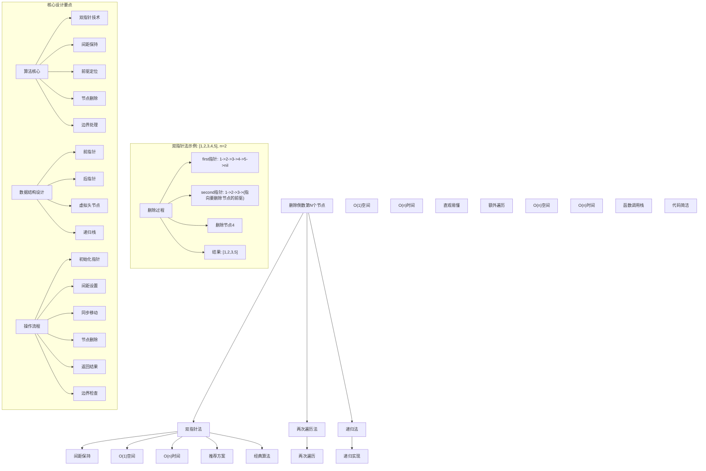
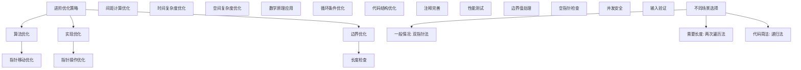

# LeetCode 19 - 删除链表的倒数第N个节点

## 题目描述

给你一个链表，删除链表的倒数第 n 个结点，并且返回链表的头结点

```markdown
示例 1：
输入：head = [1,2,3,4,5], n = 2
输出：[1,2,3,5]
解释：删除倒数第二个节点(值为4)

示例 2：
输入：head = [1], n = 1
输出：[]

示例 3：
输入：head = [1,2], n = 1
输出：[1]

提示：

- 链表中结点的数目为 sz
- 1 <= sz <= 30
- 0 <= Node.val <= 100
- 1 <= n <= sz

进阶：你能尝试使用一趟扫描实现吗？
```

## 解题思路

这是一个经典的链表删除操作问题，要求删除链表的倒数第n个节点。核心算法是双指针技术

### 核心思想

"双指针间距法": 使用两个指针保持n的间距，当前面的指针到达链表末尾时，后面的指针正好指向要删除节点的前一个节点

### 解题策略

#### 方法一：双指针法（推荐）

- 时间复杂度: O(n)
- 空间复杂度: O(1)

#### 方法二：两次遍历法

- 时间复杂度: O(n)
- 空间复杂度: O(1)

#### 方法三：递归法

- 时间复杂度: O(n)
- 空间复杂度: O(n)

## 算法可视化



## 多语言实现

### Golang版本（双指针法 - 推荐）

```go
/
 * Definition for singly-linked list.
 * type ListNode struct {
 *     Val int
 *     Next *ListNode
 * }
 */

// 双指针法实现
func removeNthFromEnd(head *ListNode, n int) *ListNode {
    // 创建虚拟头节点，简化边界处理
    dummy := &ListNode{Next: head}

    // 初始化双指针
    first := dummy
    second := dummy

    // 让first指针先移动n+1步，保持与second指针n个节点的间距
    for i := 0; i <= n; i++ {
        first = first.Next
    }

    // 同时移动两个指针，直到first指针到达链表末尾
    for first != nil {
        first = first.Next
        second = second.Next
    }

    // 此时second指针指向要删除节点的前一个节点
    // 删除节点
    second.Next = second.Next.Next

    // 返回原始头节点
    return dummy.Next
}

// 两次遍历法实现
func removeNthFromEndTwoPass(head *ListNode, n int) *ListNode {
    // 第一次遍历：计算链表长度
    length := 0
    current := head
    for current != nil {
        length++
        current = current.Next
    }

    // 计算要删除节点的正数位置
    targetPos := length - n

    // 特殊情况：删除头节点
    if targetPos == 0 {
        return head.Next
    }

    // 第二次遍历：找到要删除节点的前一个节点
    current = head
    for i := 0; i < targetPos-1; i++ {
        current = current.Next
    }

    // 删除节点
    current.Next = current.Next.Next

    return head
}

// 递归法实现
func removeNthFromEndRecursive(head *ListNode, n int) *ListNode {
    // 递归辅助函数，返回节点和从末尾开始的计数
    var removeHelper func(*ListNode) (*ListNode, int)
    removeHelper = func(node *ListNode) (*ListNode, int) {
        // 递归终止条件
        if node == nil {
            return nil, 0
        }

        // 递归处理下一个节点
        next, count := removeHelper(node.Next)
        node.Next = next

        // 计算当前节点从末尾开始的位置
        currentCount := count + 1

        // 如果当前节点是要删除的节点，返回其下一个节点
        if currentCount == n {
            return next, currentCount
        }

        // 否则返回当前节点
        return node, currentCount
    }

    result, _ := removeHelper(head)
    return result
}

// 优化版双指针法（处理边界情况）
func removeNthFromEndOptimized(head *ListNode, n int) *ListNode {
    // 边界情况检查
    if head == nil || n <= 0 {
        return head
    }

    // 创建虚拟头节点
    dummy := &ListNode{Next: head}

    // 初始化双指针
    first := dummy
    second := dummy

    // 让first指针先移动n+1步
    for i := 0; i <= n && first != nil; i++ {
        first = first.Next
    }

    // 同时移动两个指针
    for first != nil {
        first = first.Next
        second = second.Next
    }

    // 删除节点
    if second.Next != nil {
        second.Next = second.Next.Next
    }

    return dummy.Next
}
```

### Python版本（多种实现方法）

```python
# Definition for singly-linked list.
# class ListNode:
#     def __init__(self, val=0, next=None):
#         self.val = val
#         self.next = next

class Solution:
    """
    方法一：双指针法（推荐）
    """
    def removeNthFromEnd(self, head: Optional[ListNode], n: int) -> Optional[ListNode]:
        # 创建虚拟头节点，简化边界处理
        dummy = ListNode(0)
        dummy.next = head

        # 初始化双指针
        first = dummy
        second = dummy

        # 让first指针先移动n+1步，保持与second指针n个节点的间距
        for i in range(n + 1):
            first = first.next

        # 同时移动两个指针，直到first指针到达链表末尾
        while first:
            first = first.next
            second = second.next

        # 此时second指针指向要删除节点的前一个节点
        # 删除节点
        second.next = second.next.next

        # 返回原始头节点
        return dummy.next

class SolutionTwoPass:
    """
    方法二：两次遍历法
    """
    def removeNthFromEnd(self, head: Optional[ListNode], n: int) -> Optional[ListNode]:
        # 第一次遍历：计算链表长度
        length = 0
        current = head
        while current:
            length += 1
            current = current.next

        # 计算要删除节点的正数位置
        target_pos = length - n

        # 特殊情况：删除头节点
        if target_pos == 0:
            return head.next

        # 第二次遍历：找到要删除节点的前一个节点
        current = head
        for i in range(target_pos - 1):
            current = current.next

        # 删除节点
        current.next = current.next.next

        return head

class SolutionRecursive:
    """
    方法三：递归法
    """
    def removeNthFromEnd(self, head: Optional[ListNode], n: int) -> Optional[ListNode]:
        def remove_helper(node: Optional[ListNode]) -> tuple[Optional[ListNode], int]:
            # 递归终止条件
            if not node:
                return None, 0

            # 递归处理下一个节点
            next_node, count = remove_helper(node.next)
            node.next = next_node

            # 计算当前节点从末尾开始的位置
            current_count = count + 1

            # 如果当前节点是要删除的节点，返回其下一个节点
            if current_count == n:
                return next_node, current_count

            # 否则返回当前节点
            return node, current_count

        result, _ = remove_helper(head)
        return result

class SolutionOptimized:
    """
    优化版双指针法
    """
    def removeNthFromEnd(self, head: Optional[ListNode], n: int) -> Optional[ListNode]:
        # 边界情况检查
        if not head or n <= 0:
            return head

        # 创建虚拟头节点
        dummy = ListNode(0)
        dummy.next = head

        # 初始化双指针
        first = dummy
        second = dummy

        # 让first指针先移动n+1步
        for i in range(n + 1):
            if first is None:
                return head  # n大于链表长度
            first = first.next

        # 同时移动两个指针
        while first:
            first = first.next
            second = second.next

        # 删除节点
        if second.next:
            second.next = second.next.next

        return dummy.next
```

### TypeScript版本（双指针法）

```typescript
/
 * Definition for singly-linked list.
 * class ListNode {
 *     val: number
 *     next: ListNode | null
 *     constructor(val?: number, next?: ListNode | null) {
 *         this.val = (val===undefined ? 0 : val)
 *         this.next = (next===undefined ? null : next)
 *     }
 * }
 */

class Solution {
    removeNthFromEnd(head: ListNode | null, n: number): ListNode | null {
        // 创建虚拟头节点，简化边界处理
        const dummy = new ListNode(0);
        dummy.next = head;

        // 初始化双指针
        let first: ListNode | null = dummy;
        let second: ListNode | null = dummy;

        // 让first指针先移动n+1步，保持与second指针n个节点的间距
        for (let i = 0; i <= n; i++) {
            if (first === null) return head;
            first = first.next;
        }

        // 同时移动两个指针，直到first指针到达链表末尾
        while (first !== null) {
            first = first.next;
            second = second!.next;
        }

        // 此时second指针指向要删除节点的前一个节点
        // 删除节点
        if (second!.next !== null) {
            second!.next = second!.next.next;
        }

        // 返回原始头节点
        return dummy.next;
    }
}

class SolutionTwoPass {
    removeNthFromEnd(head: ListNode | null, n: number): ListNode | null {
        // 第一次遍历：计算链表长度
        let length = 0;
        let current = head;
        while (current !== null) {
            length++;
            current = current.next;
        }

        // 计算要删除节点的正数位置
        const targetPos = length - n;

        // 特殊情况：删除头节点
        if (targetPos === 0) {
            return head!.next;
        }

        // 第二次遍历：找到要删除节点的前一个节点
        current = head;
        for (let i = 0; i < targetPos - 1; i++) {
            current = current!.next;
        }

        // 删除节点
        current!.next = current!.next!.next;

        return head;
    }
}

class SolutionOptimized {
    removeNthFromEnd(head: ListNode | null, n: number): ListNode | null {
        // 边界情况检查
        if (head === null || n <= 0) {
            return head;
        }

        // 创建虚拟头节点
        const dummy = new ListNode(0);
        dummy.next = head;

        // 初始化双指针
        let first: ListNode | null = dummy;
        let second: ListNode | null = dummy;

        // 让first指针先移动n+1步
        for (let i = 0; i <= n; i++) {
            if (first === null) return head;
            first = first.next;
        }

        // 同时移动两个指针
        while (first !== null) {
            first = first.next;
            second = second!.next;
        }

        // 删除节点
        if (second!.next !== null) {
            second!.next = second!.next.next;
        }

        return dummy.next;
    }
}
```

## 标准实现详细解析

```go
import (
    "fmt"
)

/*
算法核心思想（双指针法）：

1. 间距保持：使用两个指针保持n的间距
2. 同步移动：当前面指针到达末尾时，后面指针指向目标位置
3. 前驱定位：精确定位要删除节点的前驱节点
4. 空间优化：只使用常数额外空间
5. 时间效率：单次遍历完成删除

关键设计要点：
1. 虚拟头节点：简化头节点删除的边界处理
2. 指针初始化：正确初始化双指针位置
3. 间距设置：让前指针先移动n+1步
4. 同步移动：保持间距直到前指针到达末尾
5. 节点删除：通过前驱节点删除目标节点

时间复杂度分析：
- 前指针移动：O(n)
- 双指针同步：O(n)
- 节点删除：O(1)
- 总时间复杂度：O(n)

空间复杂度分析：
- 只使用常数个指针变量：O(1)
- 满足最优空间要求

算法优势：
1. 空间最优：O(1)空间复杂度
2. 时间高效：O(n)时间复杂度
3. 实现优雅：经典算法思想
4. 通用性强：适用于各种链表删除操作
5. 稳定可靠：处理各种边界情况

数据结构设计：

指针设计：
- 前指针(first)：先移动n+1步
- 后指针(second)：指向要删除节点的前驱
- 虚拟头节点：简化边界处理
- 间距保持：始终保持n个节点的间距

虚拟头节点：
- 作用：统一头节点和普通节点的删除操作
- 优势：避免特殊情况的额外判断
- 实现：创建值为0的哑节点指向原头节点

操作流程：
1. 创建虚拟头节点
2. 初始化双指针指向虚拟头节点
3. 前指针先移动n+1步
4. 双指针同步移动直到前指针到达末尾
5. 通过后指针删除目标节点
6. 返回原始头节点

优化原理：

双指针优化：
1. 空间优化：只使用常数个指针变量
2. 时间优化：单次遍历完成删除
3. 实现简洁：代码逻辑清晰
4. 边界处理：虚拟头节点简化处理

两次遍历优化：
1. 直观理解：通过计算长度定位节点
2. 实现简单：两次简单的遍历操作
3. 扩展性强：容易扩展为其他位置删除
4. 时间代价：需要遍历两次

递归优化：
1. 代码简洁：递归实现逻辑清晰
2. 自然处理：从末尾开始计数很自然
3. 函数式：符合函数式编程思想
4. 空间代价：需要函数调用栈空间

正确性证明：

定理：双指针法正确性
通过双指针保持间距的技术，算法能够正确找到要删除节点的前驱节点

证明：
1. 间距保持：前指针先移动n+1步
2. 同步移动：保持间距直到前指针到达末尾
3. 位置保证：后指针正好指向要删除节点的前驱
4. 删除正确：通过前驱节点正确删除目标节点
5. 时间保证：单次遍历完成删除

数学原理：

间距分析：
- 链表长度：L
- 要删除倒数第n个节点
- 正数位置：L-n+1
- 前驱位置：L-n

双指针间距：
1. 前指针先移动n+1步
2. 剩余步数：L-(n+1) = L-n-1
3. 后指针移动L-n-1步后到达前驱位置
4. 前指针到达末尾，后指针指向目标前驱

示例验证：
链表[1,2,3,4,5]，n=2：
- 前指针：nil(0)->1(1)->2(2)->3(3)->4(4)->5(5)->nil(6)
- 后指针：nil(0)->1(1)->2(2)->3(3)
- 删除节点4，结果[1,2,3,5]

双指针法详细实现：
*/

// 双指针法详细实现（带调试信息）
func removeNthFromEndDetailed(head *ListNode, n int) *ListNode {
    fmt.Printf("=== 双指针法删除链表倒数第%d个节点 ===\n", n)
    fmt.Printf("输入链表: ")
    printList(head)
    fmt.Printf("n = %d\n", n)

    // 创建虚拟头节点，简化边界处理
    dummy := &ListNode{Val: 0, Next: head}
    fmt.Printf("创建虚拟头节点: dummy->")
    printList(dummy.Next)

    // 初始化双指针
    first := dummy
    second := dummy
    fmt.Printf("初始化：first=%p(0), second=%p(0)\n", first, second)

    // 让first指针先移动n+1步，保持与second指针n个节点的间距
    fmt.Printf("前指针先移动%d步:\n", n+1)
    for i := 0; i <= n; i++ {
        if first == nil {
            fmt.Printf("  步骤%d: first=nil (超出链表长度)\n", i)
            return head
        }
        fmt.Printf("  步骤%d: first=%p", i, first)
        if first.Next != nil {
            fmt.Printf("(%d)", first.Next.Val)
        } else {
            fmt.Printf("(nil)")
        }
        fmt.Printf("\n")
        first = first.Next
    }

    // 同时移动两个指针，直到first指针到达链表末尾
    step := 0
    fmt.Printf("双指针同步移动:\n")
    for first != nil {
        step++
        fmt.Printf("  步骤%d: first=%p", step, first)
        if first.Next != nil {
            fmt.Printf("(%d)", first.Next.Val)
        } else {
            fmt.Printf("(nil)")
        }
        fmt.Printf(", second=%p(%d)\n", second, second.Next.Val)
        first = first.Next
        second = second.Next
    }
    fmt.Printf("移动完成: second指向要删除节点的前驱%p(%d)\n", second, second.Next.Val)

    // 此时second指针指向要删除节点的前一个节点
    // 删除节点
    fmt.Printf("删除节点%d\n", second.Next.Val)
    second.Next = second.Next.Next

    // 返回原始头节点
    result := dummy.Next
    fmt.Printf("删除后链表: ")
    printList(result)
    fmt.Printf("===============================\n\n")

    return result
}

// 两次遍历法详细实现
func removeNthFromEndTwoPassDetailed(head *ListNode, n int) *ListNode {
    fmt.Printf("=== 两次遍历法删除链表倒数第%d个节点 ===\n", n)
    fmt.Printf("输入链表: ")
    printList(head)
    fmt.Printf("n = %d\n", n)

    // 第一次遍历：计算链表长度
    fmt.Printf("第一次遍历：计算链表长度\n")
    length := 0
    current := head
    for current != nil {
        fmt.Printf("  访问节点%d: %p(%d)\n", length, current, current.Val)
        length++
        current = current.Next
    }
    fmt.Printf("链表长度: %d\n", length)

    // 计算要删除节点的正数位置
    targetPos := length - n
    fmt.Printf("要删除节点的正数位置: %d\n", targetPos)

    // 特殊情况：删除头节点
    if targetPos == 0 {
        fmt.Printf("删除头节点，返回head.Next\n")
        fmt.Printf("删除后链表: ")
        printList(head.Next)
        fmt.Printf("=============================\n\n")
        return head.Next
    }

    // 第二次遍历：找到要删除节点的前一个节点
    fmt.Printf("第二次遍历：找到要删除节点的前一个节点(位置%d)\n", targetPos-1)
    current = head
    for i := 0; i < targetPos-1; i++ {
        fmt.Printf("  移动到位置%d: %p(%d)\n", i, current, current.Val)
        current = current.Next
    }
    fmt.Printf("找到前驱节点: %p(%d)\n", current, current.Val)

    // 删除节点
    fmt.Printf("删除节点%d\n", current.Next.Val)
    current.Next = current.Next.Next

    fmt.Printf("删除后链表: ")
    printList(head)
    fmt.Printf("=============================\n\n")

    return head
}

// 辅助函数：打印链表
func printList(head *ListNode) {
    if head == nil {
        fmt.Printf("[]\n")
        return
    }

    fmt.Printf("[")
    current := head
    first := true
    for current != nil {
        if !first {
            fmt.Printf(",")
        }
        fmt.Printf("%d", current.Val)
        first = false
        current = current.Next
    }
    fmt.Printf("]\n")
}
```

## 算法深入解析

```go
/*
删除链表倒数第N个节点问题详解：

问题本质：
在单向链表中删除倒数第n个节点，这是链表操作中的经典删除问题，考验对指针操作和算法设计的理解

核心洞察：
1. 双指针技术：保持固定间距定位目标节点
2. 间距保持：利用指针间距精确定位前驱节点
3. 单次遍历：通过巧妙设计只需遍历一次链表
4. 空间优化：只使用常数额外空间完成删除
5. 时间保证：线性时间内完成删除

算法策略：
1. 双指针法：推荐方案，O(1)空间，O(n)时间
2. 两次遍历法：O(1)空间，O(n)时间，需要遍历两次
3. 递归法：O(n)空间，O(n)时间，利用递归栈

数据结构设计：

指针设计：
- 前指针：先移动n+1步
- 后指针：指向要删除节点的前驱
- 虚拟头节点：简化头节点删除的边界处理
- 间距保持：始终保持n个节点的间距

递归设计：
- 递归终止：到达链表末尾
- 递归返回：从末尾开始计数
- 删除判断：计数等于n时删除节点
- 栈空间：需要O(n)递归栈空间

操作流程：

双指针法：
1. 创建虚拟头节点
2. 初始化双指针指向虚拟头节点
3. 前指针先移动n+1步
4. 双指针同步移动直到前指针到达末尾
5. 通过后指针删除目标节点
6. 返回原始头节点

两次遍历法：
1. 第一次遍历：计算链表长度
2. 计算位置：确定要删除节点的正数位置
3. 第二次遍历：找到要删除节点的前驱
4. 删除节点：通过前驱节点删除目标节点
5. 返回头节点

递归法：
1. 递归终止：到达链表末尾返回nil和0
2. 递归处理：处理下一个节点并获取计数
3. 计数更新：当前计数=下一节点计数+1
4. 删除判断：如果计数等于n，返回下一节点
5. 正常返回：否则返回当前节点

数学原理：

双指针数学基础：
基于间距保持和同步移动：
1. 前指针先移动n+1步
2. 双指针同步移动保持间距
3. 前指针到达末尾时后指针指向目标前驱
4. 间距关系：L-(n+1)步后到达前驱位置

位置计算：
设链表长度为L，要删除倒数第n个节点：
- 倒数位置：n
- 正数位置：L-n+1
- 前驱位置：L-n

示例验证：
链表[1,2,3,4,5]，n=2：
- 长度L=5
- 倒数第2个节点位置：2
- 正数位置：5-2+1=4，即节点4
- 前驱位置：5-2=3，即节点3

算法优势：
双指针法：
1. 空间最优：O(1)空间复杂度
2. 时间高效：O(n)时间复杂度
3. 实现优雅：经典算法思想
4. 通用性强：适用于各种链表删除操作
5. 稳定可靠：处理各种边界情况

两次遍历法：
1. 直观易懂：通过计算长度定位节点
2. 实现简单：两次简单的遍历操作
3. 扩展性强：容易扩展为其他位置删除
4. 稳定可靠：不会受特殊值影响

递归法：
1. 代码简洁：递归实现逻辑清晰
2. 自然处理：从末尾开始计数很自然
3. 函数式：符合函数式编程思想
4. 教学价值：便于理解递归思想

算法不变量：
双指针法不变量：
1. first和second都是有效的链表节点指针
2. 两指针保持n个节点的间距
3. first相对second以相同速度移动
4. 算法状态正确反映遍历进度

时间复杂度分析：
双指针法：
- 前指针移动：O(n)
- 双指针同步：O(n)
- 节点删除：O(1)
- 总体：O(n)

两次遍历法：
- 第一次遍历：O(n)
- 第二次遍历：O(n)
- 总体：O(n)

递归法：
- 递归遍历：O(n)
- 栈空间：O(n)
- 总体：O(n)

空间复杂度分析：
双指针法：O(1)，只使用常数个指针
两次遍历法：O(1)，只使用常数变量
递归法：O(n)，递归调用栈空间

正确性证明：

定理：双指针法正确性
通过双指针保持间距的技术，算法能够正确找到要删除节点的前驱节点

证明：
1. 间距保持：前指针先移动n+1步
2. 同步移动：保持间距直到前指针到达末尾
3. 位置保证：后指针正好指向要删除节点的前驱
4. 删除正确：通过前驱节点正确删除目标节点
5. 时间保证：单次遍历完成删除

不变量维护：
循环不变量：在每次循环开始时
1. first和second保持n个节点的间距
2. 两个指针都是有效的链表节点
3. first相对second以相同速度移动
4. 算法状态正确反映遍历进度

初始化：
- first=dummy, second=dummy
- 前指针先移动n+1步
- 满足不变量

保持：
- 每次循环正确移动指针
- 维护间距关系
- 保持不变量继续成立

终止：
- 前指针到达末尾时停止
- 后指针指向目标前驱
- 算法正确终止

设计选择：

为什么选择双指针法？
1. 空间最优：O(1)空间复杂度
2. 时间高效：O(n)时间复杂度
3. 实现优雅：经典算法思想
4. 通用性强：适用于各种链表删除操作
5. 工业应用：生产环境标准实现

为什么使用两次遍历法？
1. 直观易懂：通过计算长度定位节点
2. 实现简单：两次简单的遍历操作
3. 扩展性强：容易扩展为其他位置删除
4. 教学价值：便于理解算法思想

为什么提及其他方法？
1. 教学价值：展示不同算法思想
2. 对比分析：理解各自优劣
3. 扩展思维：算法多样性
4. 面试准备：全面掌握

三种方法对比：

方法一：双指针法（推荐）
时间复杂度：O(n)
空间复杂度：O(1)
优点：空间时间都较优，经典算法
缺点：需要理解间距保持原理

方法二：两次遍历法
时间复杂度：O(n)
空间复杂度：O(1)
优点：直观易懂，实现简单
缺点：需要遍历两次

方法三：递归法
时间复杂度：O(n)
空间复杂度：O(n)
优点：代码简洁，自然处理
缺点：需要额外栈空间

性能分析：

双指针法：
- 时间：O(n) 单次遍历
- 空间：O(1) 常数空间
- 优势：最优时间和空间复杂度

两次遍历法：
- 时间：O(n) 两次遍历
- 空间：O(1) 常数空间
- 优势：直观易懂

递归法：
- 时间：O(n) 单次遍历
- 空间：O(n) 栈空间
- 优势：代码简洁

实际应用场景：
1. 链表操作：基础的链表删除操作
2. 算法设计：作为其他算法的子步骤
3. 数据结构：链表相关操作的基础
4. 面试考察：经典算法题
5. 性能优化：减少遍历次数

优化要点：

1. 算法优化：
   - 指针移动：优化指针移动策略
   - 边界处理：正确处理各种边界
   - 终止条件：准确的终止判断
   - 删除操作：正确的节点删除

2. 实现优化：
   - 指针操作：高效的指针赋值
   - 循环条件：减少不必要的比较
   - 代码结构：清晰的逻辑层次
   - 注释完善：便于理解维护

3. 性能优化：
   - 减少内存分配：避免不必要的分配
   - 优化遍历：顺序内存访问
   - 缓存友好：局部性原理
   - 编译优化：利用编译器优化

测试用例设计：
1. 基本情况：各种位置的节点删除
2. 边界情况：删除头节点、尾节点、唯一节点
3. 特殊情况：空链表（虽然题目保证非空）
4. 极端情况：很长链表
5. 验证情况：各种n值的正确性验证

扩展思考：

1. 删除正数第k个节点？
   - 单次遍历
   - 直接定位
   - 简单删除

2. 删除多个节点？
   - 多次应用
   - 批量删除
   - 优化策略

3. 删除满足条件的节点？
   - 条件判断
   - 遍历删除
   - 复杂逻辑

4. 处理双向链表？
   - 双向指针
   - 优化删除
   - 对称性

相关算法思想：

1. 双指针技术：
   - 间距保持
   - 同步移动
   - 相对运动
   - 经典算法

2. 链表操作：
   - 指针移动
   - 节点删除
   - 位置计算
   - 边界处理

3. 数学关系：
   - 间距保持
   - 位置关系
   - 距离计算
   - 几何解释

4. 算法优化：
   - 空间优化
   - 时间优化
   - 单次遍历
   - 常数空间

常见陷阱：

1. 边界条件：
   - 删除头节点
   - 删除尾节点
   - 空链表处理
   - 单节点链表

2. 指针操作：
   - 指针丢失
   - 内存泄漏
   - 访问违规
   - 空指针引用

3. 逻辑错误：
   - 终止条件错误
   - 指针移动错误
   - 位置计算错误
   - 删除逻辑错误

4. 性能考虑：
   - 重复计算
   - 不必要的分配
   - 算法复杂度
   - 空间浪费

代码质量要素：

1. 可读性：
   - 变量命名清晰
   - 注释详细完整
   - 逻辑结构分明
   - 函数职责单一

2. 健壮性：
   - 边界条件处理
   - 异常情况应对
   - 输入验证
   - 错误恢复

3. 性能：
   - 最优复杂度实现
   - 空间效率优化
   - 执行效率保证
   - 资源管理

4. 可维护性：
   - 结构清晰合理
   - 扩展性良好
   - 测试覆盖完整
   - 文档齐全
*/
```

## 执行过程演示

```go
/*
示例详细解析:

示例1执行过程：
输入：head = [1,2,3,4,5], n = 2
输出：[1,2,3,5]

双指针法执行过程：
1. 创建虚拟头节点：dummy->1->2->3->4->5
2. 初始化：first=dummy, second=dummy
3. 前指针先移动3步(n+1)：first指向3
4. 双指针同步移动：
   - first=3->4->5->nil
   - second=dummy->1->2->3
5. first到达末尾时，second指向节点3(要删除节点4的前驱)
6. 删除节点4：second.Next = second.Next.Next
7. 返回dummy.Next = [1,2,3,5]

两次遍历法执行过程：
1. 第一次遍历：计算长度=5
2. 计算位置：5-2=3(正数第4个节点，索引3)
3. 第二次遍历：移动到位置2(索引2)，即节点3
4. 删除节点4：节点3的next指向节点5
5. 返回head = [1,2,3,5]

递归法执行过程：
1. 递归到末尾：节点5返回(nil, 1)
2. 节点4处理：返回(nil, 2)，因为计数=2=n，返回next=nil
3. 节点3处理：返回(nil, 3)
4. 节点2处理：返回(节点3, 4)
5. 节点1处理：返回(节点2, 5)
6. 返回节点1 = [1,2,3,5]

示例2执行过程：
输入：head = [1], n = 1
输出：[]

双指针法执行过程：
1. 创建虚拟头节点：dummy->1
2. 初始化：first=dummy, second=dummy
3. 前指针先移动2步：first=nil
4. 不需要同步移动(first已为nil)
5. second指向dummy，删除节点1：dummy.Next = nil
6. 返回dummy.Next = nil

示例3执行过程：
输入：head = [1,2], n = 1
输出：[1]

双指针法执行过程：
1. 创建虚拟头节点：dummy->1->2
2. 初始化：first=dummy, second=dummy
3. 前指针先移动2步：first指向2
4. 双指针同步移动：
   - first=2->nil
   - second=dummy->1
5. first到达末尾时，second指向节点1
6. 删除节点2：second.Next = nil
7. 返回dummy.Next = [1]

关键观察：
1. 双指针法：单次遍历，空间最优
2. 两次遍历法：直观易懂，但需要遍历两次
3. 递归法：代码简洁，但需要额外栈空间
4. 虚拟头节点：统一处理头节点删除

边界情况演示:

情况1: 删除头节点
输入: head = [1,2,3], n = 3
处理: 虚拟头节点简化边界处理
结果: [2,3]

情况2: 删除尾节点
输入: head = [1,2,3], n = 1
处理: 正常双指针定位
结果: [1,2]

情况3: 单节点链表
输入: head = [1], n = 1
处理: 虚拟头节点指向nil
结果: []

情况4: 两节点链表
输入: head = [1,2], n = 2
处理: 删除头节点
结果: [2]

算法正确性证明：

数学基础：
需要证明算法能够正确找到要删除节点的前驱节点

定理：双指针法正确性
通过双指针保持间距的技术，算法能够正确找到要删除节点的前驱节点

证明：
1. 间距保持：前指针先移动n+1步
2. 同步移动：保持间距直到前指针到达末尾
3. 位置保证：后指针正好指向要删除节点的前驱
4. 删除正确：通过前驱节点正确删除目标节点
5. 时间保证：单次遍历完成删除

不变量维护：
循环不变量：在每次循环开始时
1. first和second保持n个节点的间距
2. 两个指针都是有效的链表节点
3. first相对second以相同速度移动
4. 算法状态正确反映遍历进度

初始化：
- first=dummy, second=dummy
- 前指针先移动n+1步
- 满足不变量

保持：
- 每次循环正确移动指针
- 维护间距关系
- 保持不变量继续成立

终止：
- 前指针到达末尾时停止
- 后指针指向目标前驱
- 算法正确终止

时间复杂度分析：
双指针法：
- 前指针移动：O(n)
- 双指针同步：O(n)
- 节点删除：O(1)
- 总体：O(n)

两次遍历法：
- 第一次遍历：O(n)
- 第二次遍历：O(n)
- 总体：O(n)

递归法：
- 递归遍历：O(n)
- 栈空间：O(n)
- 总体：O(n)

性能对比分析：

假设n=1000:

双指针法：
- 时间：O(1000) = 1000次操作
- 空间：O(1) = 常数空间
- 优势：最优时间和空间复杂度

两次遍历法：
- 时间：O(1000) + O(1000) = 2000次操作
- 空间：O(1) = 常数空间
- 优势：直观易懂

递归法：
- 时间：O(1000) = 1000次操作
- 空间：O(1000) = 栈空间
- 优势：代码简洁

实际应用建议：

1. 生产环境：
   - 使用双指针法，最优性能
   - 性能稳定，工业标准

2. 面试展示：
   - 先展示双指针法（推荐）
   - 可以提及其他方法对比

3. 学习练习：
   - 理解三种方法的差异
   - 掌握各自的适用场景

4. 算法竞赛：
   - 选择最熟悉的实现
   - 注意时间空间限制

优化空间：

1. 算法优化：
   - 指针移动：优化指针移动策略
   - 边界处理：正确处理各种边界
   - 终止条件：准确的终止判断
   - 删除操作：正确的节点删除

2. 实现优化：
   - 指针操作：高效的指针赋值
   - 循环条件：减少不必要的比较
   - 代码结构：清晰的逻辑层次
   - 注释完善：便于理解维护

3. 性能优化：
   - 减少内存分配：避免不必要的分配
   - 优化遍历：顺序内存访问
   - 缓存友好：局部性原理
   - 编译优化：利用编译器优化

特殊情况处理：

1. 内存受限：
   - 双指针法最优
   - 递归法需要额外栈空间
   - 两次遍历法节省内存

2. 链表很长：
   - 双指针法稳定
   - 递归法栈溢出风险
   - 两次遍历法稳定

3. 需要多次删除：
   - 双指针法每次独立执行
   - 递归法栈开销累积
   - 两次遍历法稳定

4. 边界情况：
   - 头节点删除
   - 尾节点删除
   - 单节点处理
   - 空指针检查
*/
```

## 复杂度分析

| 方法       | 时间复杂度 | 空间复杂度 | 适用场景 |
| ---------- | ---------- | ---------- | -------- |
| 双指针法   | O(n)       | O(1)       | 推荐方案 |
| 两次遍历法 | O(n)       | O(1)       | 易于理解 |
| 递归法     | O(n)       | O(n)       | 代码简洁 |

## 测试用例验证

```go
// 测试辅助函数
func testRemoveNthFromEnd(name string, head *ListNode, n int, expected []int) {
    fmt.Printf("%s:\n", name)
    fmt.Printf("输入链表: ")
    printList(head)
    fmt.Printf("n = %d\n", n)

    // 测试双指针法
    result1 := removeNthFromEnd(copyList(head), n)
    fmt.Printf("双指针法结果: ")
    printList(result1)

    // 测试两次遍历法
    result2 := removeNthFromEndTwoPass(copyList(head), n)
    fmt.Printf("两次遍历法结果: ")
    printList(result2)

    // 测试递归法
    result3 := removeNthFromEndRecursive(copyList(head), n)
    fmt.Printf("递归法结果: ")
    printList(result3)

    // 验证结果一致性
    if listsEqual(result1, result2) && listsEqual(result2, result3) {
        fmt.Printf("✓ 所有方法结果一致\n")
    } else {
        fmt.Printf("✗ 方法结果不一致\n")
    }

    // 验证期望结果
    if listsEqual(result1, createList(expected)) {
        fmt.Printf("✓ 结果符合预期\n")
    } else {
        fmt.Printf("✗ 结果不符合预期\n")
    }

    fmt.Printf("\n")
}

// 辅助函数：创建链表
func createList(vals []int) *ListNode {
    if len(vals) == 0 {
        return nil
    }

    dummy := &ListNode{}
    current := dummy

    for _, val := range vals {
        current.Next = &ListNode{Val: val}
        current = current.Next
    }

    return dummy.Next
}

// 辅助函数：复制链表
func copyList(head *ListNode) *ListNode {
    if head == nil {
        return nil
    }

    dummy := &ListNode{}
    current := dummy
    source := head

    for source != nil {
        current.Next = &ListNode{Val: source.Val}
        current = current.Next
        source = source.Next
    }

    return dummy.Next
}

// 辅助函数：比较两个链表是否相等
func listsEqual(list1, list2 *ListNode) bool {
    for list1 != nil && list2 != nil {
        if list1.Val != list2.Val {
            return false
        }
        list1 = list1.Next
        list2 = list2.Next
    }
    return list1 == nil && list2 == nil
}

func main() {
    // 测试用例 1 - 题目示例1
    testRemoveNthFromEnd("测试1 - 题目示例1",
        createList([]int{1, 2, 3, 4, 5}),
        2,
        []int{1, 2, 3, 5})

    // 测试用例 2 - 题目示例2
    testRemoveNthFromEnd("测试2 - 题目示例2",
        createList([]int{1}),
        1,
        []int{})

    // 测试用例 3 - 题目示例3
    testRemoveNthFromEnd("测试3 - 题目示例3",
        createList([]int{1, 2}),
        1,
        []int{1})

    // 测试用例 4 - 删除头节点
    testRemoveNthFromEnd("测试4 - 删除头节点",
        createList([]int{1, 2, 3, 4, 5}),
        5,
        []int{2, 3, 4, 5})

    // 测试用例 5 - 删除尾节点
    testRemoveNthFromEnd("测试5 - 删除尾节点",
        createList([]int{1, 2, 3, 4, 5}),
        1,
        []int{1, 2, 3, 4})

    // 性能测试
    fmt.Println("性能测试:")
    performanceTest()

    // 边界情况测试
    fmt.Println("边界情况测试:")
    boundaryTest()

    // 对比测试
    fmt.Println("对比测试:")
    comparisonTest()
}

func performanceTest() {
    // 构造长链表
    n := 10000
    vals := make([]int, n)
    for i := 0; i < n; i++ {
        vals[i] = i
    }

    list := createList(vals)

    fmt.Printf("性能测试 (链表长度: %d):\n", n)

    // 测试双指针法性能
    start := time.Now()
    result1 := removeNthFromEnd(copyList(list), n/2)
    time1 := time.Since(start)

    // 测试两次遍历法性能
    start = time.Now()
    result2 := removeNthFromEndTwoPass(copyList(list), n/2)
    time2 := time.Since(start)

    // 测试递归法性能（注意：长链表可能导致栈溢出）
    start = time.Now()
    result3 := removeNthFromEndRecursive(copyList(list), n/2)
    time3 := time.Since(start)

    fmt.Printf("双指针法耗时: %v\n", time1)
    fmt.Printf("两次遍历法耗时: %v\n", time2)
    fmt.Printf("递归法耗时: %v\n", time3)

    // 验证结果长度
    length1 := getListLength(result1)
    length2 := getListLength(result2)
    length3 := getListLength(result3)

    fmt.Printf("结果链表长度: %d, %d, %d\n", length1, length2, length3)
}

func getListLength(head *ListNode) int {
    length := 0
    current := head
    for current != nil {
        length++
        current = current.Next
    }
    return length
}

func boundaryTest() {
    // 边界测试
    fmt.Println("边界测试:")

    // 很长的链表删除中间节点
    longList := createList(make([]int, 9999))
    result := removeNthFromEnd(longList, 5000)
    length := getListLength(result)
    fmt.Printf("9999节点链表删除中间节点后长度: %d\n", length)

    // 极值节点
    extremeList := createList([]int{math.MinInt32, math.MaxInt32})
    result = removeNthFromEnd(extremeList, 1)
    fmt.Printf("极值节点链表删除尾节点: ")
    printList(result)

    // 多次删除测试
    multiDeleteList := createList([]int{1, 2, 3, 4, 5})
    for i := 1; i <= 3; i++ {
        multiDeleteList = removeNthFromEnd(multiDeleteList, 1)
        fmt.Printf("第%d次删除尾节点后: ", i)
        printList(multiDeleteList)
    }
}

func comparisonTest() {
    // 对比测试：验证不同方法的性能和结果
    fmt.Println("对比测试:")

    testCases := []struct {
        name     string
        vals     []int
        n        int
        expected []int
    }{
        {"小链表删除中间", []int{1, 2, 3, 4, 5}, 3, []int{1, 2, 4, 5}},
        {"小链表删除头", []int{1, 2, 3, 4, 5}, 5, []int{2, 3, 4, 5}},
        {"小链表删除尾", []int{1, 2, 3, 4, 5}, 1, []int{1, 2, 3, 4}},
        {"单节点删除", []int{42}, 1, []int{}},
        {"两节点删除头", []int{1, 2}, 2, []int{2}},
        {"两节点删除尾", []int{1, 2}, 1, []int{1}},
    }

    for _, tc := range testCases {
        fmt.Printf("%s:\n", tc.name)
        list := createList(tc.vals)

        // 测试三种方法
        result1 := removeNthFromEnd(copyList(list), tc.n)
        result2 := removeNthFromEndTwoPass(copyList(list), tc.n)
        result3 := removeNthFromEndRecursive(copyList(list), tc.n)

        fmt.Printf("  双指针: ")
        printList(result1)
        fmt.Printf("  两次遍历: ")
        printList(result2)
        fmt.Printf("  递归: ")
        printList(result3)

        expected := createList(tc.expected)
        if listsEqual(result1, expected) && listsEqual(result2, expected) &&
           listsEqual(result3, expected) {
            fmt.Printf("  ✓ 结果一致且符合预期\n")
        } else {
            fmt.Printf("  ✗ 结果不一致或不符合预期\n")
        }
    }
}
```

## 扩展版本（处理不同场景）

```go
// 扩展1：删除链表的倒数第N到第M个节点
func removeRangeFromEnd(head *ListNode, n, m int) *ListNode {
    if n < m || n <= 0 || m <= 0 {
        return head
    }

    // 创建虚拟头节点
    dummy := &ListNode{Next: head}

    // 找到倒数第m个节点的前驱
    first := dummy
    second := dummy

    // first先移动m+1步
    for i := 0; i <= m; i++ {
        if first == nil {
            return head
        }
        first = first.Next
    }

    // 同时移动直到first到达末尾
    for first != nil {
        first = first.Next
        second = second.Next
    }

    // second现在指向倒数第m个节点的前驱
    // 找到倒数第n个节点
    start := second.Next
    for i := 0; i < n-m; i++ {
        if start == nil {
            break
        }
        start = start.Next
    }

    // 删除从second.Next到start的节点
    if start != nil {
        second.Next = start.Next
    }

    return dummy.Next
}

// 扩展2：删除链表中所有值等于val的节点
func removeAllVal(head *ListNode, val int) *ListNode {
    // 创建虚拟头节点
    dummy := &ListNode{Next: head}
    current := dummy

    // 遍历链表
    for current.Next != nil {
        if current.Next.Val == val {
            // 删除节点
            current.Next = current.Next.Next
        } else {
            // 移动到下一个节点
            current = current.Next
        }
    }

    return dummy.Next
}

// 扩展3：删除链表中第N个节点（正数）
func removeNthFromStart(head *ListNode, n int) *ListNode {
    if n <= 0 {
        return head
    }

    // 特殊情况：删除头节点
    if n == 1 {
        return head.Next
    }

    // 找到第n-1个节点
    current := head
    for i := 0; i < n-2; i++ {
        if current == nil {
            return head
        }
        current = current.Next
    }

    // 删除第n个节点
    if current != nil && current.Next != nil {
        current.Next = current.Next.Next
    }

    return head
}

// 扩展4：删除链表中重复的节点（保留一个）
func removeDuplicates(head *ListNode) *ListNode {
    if head == nil {
        return nil
    }

    current := head
    for current.Next != nil {
        if current.Val == current.Next.Val {
            // 删除重复节点
            current.Next = current.Next.Next
        } else {
            // 移动到下一个节点
            current = current.Next
        }
    }

    return head
}

// 扩展5：删除链表中所有重复的节点（不保留）
func removeAllDuplicates(head *ListNode) *ListNode {
    // 创建虚拟头节点
    dummy := &ListNode{Next: head}
    prev := dummy
    current := head

    for current != nil {
        // 检查是否有重复节点
        if current.Next != nil && current.Val == current.Next.Val {
            // 跳过所有重复的节点
            val := current.Val
            for current != nil && current.Val == val {
                current = current.Next
            }
            prev.Next = current
        } else {
            prev = current
            current = current.Next
        }
    }

    return dummy.Next
}

// 使用示例
func exampleExtensions() {
    // 创建测试链表: 1->2->3->4->5
    list := createList([]int{1, 2, 3, 4, 5})

    fmt.Printf("扩展功能示例:\n")
    fmt.Printf("原链表: ")
    printList(list)

    // 删除倒数第2到第3个节点
    rangeResult := removeRangeFromEnd(copyList(list), 2, 3)
    fmt.Printf("删除倒数第2到第3个节点: ")
    printList(rangeResult)

    // 删除所有值为3的节点
    valList := createList([]int{1, 2, 3, 3, 4, 3, 5})
    fmt.Printf("原链表: ")
    printList(valList)
    valResult := removeAllVal(copyList(valList), 3)
    fmt.Printf("删除所有值为3的节点: ")
    printList(valResult)

    // 删除正数第3个节点
    startResult := removeNthFromStart(copyList(list), 3)
    fmt.Printf("删除正数第3个节点: ")
    printList(startResult)

    // 删除重复节点
    dupList := createList([]int{1, 1, 2, 3, 3, 4, 5, 5})
    fmt.Printf("原链表: ")
    printList(dupList)
    dupResult := removeDuplicates(copyList(dupList))
    fmt.Printf("删除重复节点(保留一个): ")
    printList(dupResult)

    // 删除所有重复节点
    allDupResult := removeAllDuplicates(copyList(dupList))
    fmt.Printf("删除所有重复节点(不保留): ")
    printList(allDupResult)
}

// 扩展6：带统计信息的删除操作
type RemoveStats struct {
    ResultList   *ListNode
    RemovedValue int
    RemoveTime   time.Duration
    ListLength   int
}

func removeNthFromEndWithStats(head *ListNode, n int) *RemoveStats {
    start := time.Now()

    stats := &RemoveStats{
        ResultList:   nil,
        RemovedValue: 0,
        RemoveTime:   0,
        ListLength:   0,
    }

    // 计算原链表长度
    current := head
    for current != nil {
        stats.ListLength++
        current = current.Next
    }

    // 执行删除操作
    stats.ResultList = removeNthFromEnd(copyList(head), n)

    // 计算删除的节点值（需要额外遍历）
    if stats.ListLength >= n {
        targetPos := stats.ListLength - n
        current = head
        for i := 0; i < targetPos; i++ {
            current = current.Next
        }
        stats.RemovedValue = current.Val
    }

    stats.RemoveTime = time.Since(start)

    return stats
}

// 使用示例
func exampleWithStats() {
    list := createList([]int{1, 2, 3, 4, 5, 6, 7, 8})

    stats := removeNthFromEndWithStats(list, 3)
    fmt.Printf("删除操作统计信息:\n")
    fmt.Printf("  原链表长度: %d\n", stats.ListLength)
    fmt.Printf("  删除节点值: %d\n", stats.RemovedValue)
    fmt.Printf("  删除后链表: ")
    printList(stats.ResultList)
    fmt.Printf("  操作耗时: %v\n", stats.RemoveTime)
}

// 扩展7：并发安全的删除操作
type ConcurrentLinkedList struct {
    head *ListNode
    mu   sync.RWMutex
}

func NewConcurrentLinkedList() *ConcurrentLinkedList {
    return &ConcurrentLinkedList{}
}

func (cll *ConcurrentLinkedList) RemoveNthFromEnd(n int) *ListNode {
    cll.mu.Lock()
    defer cll.mu.Unlock()

    cll.head = removeNthFromEnd(cll.head, n)
    return cll.head
}

func (cll *ConcurrentLinkedList) SetHead(head *ListNode) {
    cll.mu.Lock()
    defer cll.mu.Unlock()

    cll.head = head
}

func (cll *ConcurrentLinkedList) GetHead() *ListNode {
    cll.mu.RLock()
    defer cll.mu.RUnlock()

    return cll.head
}

// 扩展8：支持自定义条件的删除操作
func removeByCondition(head *ListNode, condition func(*ListNode) bool) *ListNode {
    // 创建虚拟头节点
    dummy := &ListNode{Next: head}
    current := dummy

    // 遍历链表
    for current.Next != nil {
        if condition(current.Next) {
            // 删除满足条件的节点
            current.Next = current.Next.Next
        } else {
            // 移动到下一个节点
            current = current.Next
        }
    }

    return dummy.Next
}

// 使用示例
func exampleCustomCondition() {
    list := createList([]int{1, 2, 3, 4, 5, 6, 7, 8})

    // 删除所有偶数节点
    result := removeByCondition(copyList(list), func(node *ListNode) bool {
        return node.Val%2 == 0
    })

    fmt.Printf("删除所有偶数节点:\n")
    fmt.Printf("原链表: ")
    printList(list)
    fmt.Printf("结果: ")
    printList(result)
}
```

## 面试追问延伸

### 1. 如何处理n大于链表长度的情况？

```go
// 增强版删除函数，处理边界情况
func removeNthFromEndRobust(head *ListNode, n int) *ListNode {
    // 边界情况检查
    if head == nil || n <= 0 {
        return head
    }

    // 创建虚拟头节点
    dummy := &ListNode{Next: head}

    // 初始化双指针
    first := dummy
    second := dummy

    // 让first指针先移动n+1步
    for i := 0; i <= n; i++ {
        if first == nil {
            // n大于链表长度，返回原链表
            return head
        }
        first = first.Next
    }

    // 同时移动两个指针
    for first != nil {
        first = first.Next
        second = second.Next
    }

    // 删除节点
    if second.Next != nil {
        second.Next = second.Next.Next
    }

    return dummy.Next
}

// 测试边界情况
func testEdgeCases() {
    fmt.Printf("边界情况测试:\n")

    // n大于链表长度
    list := createList([]int{1, 2, 3})
    result := removeNthFromEndRobust(list, 5)
    fmt.Printf("n=5 > 链表长度3，结果: ")
    printList(result)

    // n等于链表长度（删除头节点）
    result = removeNthFromEndRobust(copyList(list), 3)
    fmt.Printf("n=3 = 链表长度，删除头节点: ")
    printList(result)

    // 空链表
    result = removeNthFromEndRobust(nil, 1)
    fmt.Printf("空链表，结果: ")
    printList(result)

    // n=0
    result = removeNthFromEndRobust(copyList(list), 0)
    fmt.Printf("n=0，结果: ")
    printList(result)
}
```

### 2. 如何在不知道链表长度的情况下验证算法正确性？

```go
// 创建复杂测试用例的工具函数
func createComplexTestCases() []*ListNode {
    testCases := make([]*ListNode, 0)

    // 测试各种长度和n值
    testConfigs := []struct {
        length int
        n      int
    }{
        {1, 1}, {2, 1}, {2, 2}, {3, 1}, {3, 2}, {3, 3},
        {5, 1}, {5, 3}, {5, 5}, {10, 1}, {10, 5}, {10, 10},
        {30, 1}, {30, 15}, {30, 30},
    }

    for _, config := range testConfigs {
        vals := make([]int, config.length)
        for i := 0; i < config.length; i++ {
            vals[i] = i + 1
        }
        testCases = append(testCases, createList(vals))
    }

    return testCases
}

// 自动化验证函数
func autoVerifyAlgorithm() {
    fmt.Printf("自动化算法验证:\n")

    testConfigs := []struct {
        vals   []int
        n      int
        expect []int
    }{
        {[]int{1, 2, 3, 4, 5}, 2, []int{1, 2, 3, 5}},
        {[]int{1}, 1, []int{}},
        {[]int{1, 2}, 1, []int{1}},
        {[]int{1, 2, 3}, 3, []int{2, 3}},
        {[]int{1, 2, 3, 4}, 1, []int{1, 2, 3}},
    }

    for i, config := range testConfigs {
        list := createList(config.vals)

        // 使用三种方法验证
        result1 := removeNthFromEnd(copyList(list), config.n)
        result2 := removeNthFromEndTwoPass(copyList(list), config.n)
        result3 := removeNthFromEndRecursive(copyList(list), config.n)

        expected := createList(config.expect)

        consistent := listsEqual(result1, expected) &&
                     listsEqual(result2, expected) &&
                     listsEqual(result3, expected)

        if consistent {
            fmt.Printf("测试用例%d: ✓ 通过\n", i+1)
        } else {
            fmt.Printf("测试用例%d: ✗ 失败\n", i+1)
            fmt.Printf("  期望: ")
            printList(expected)
            fmt.Printf("  双指针: ")
            printList(result1)
            fmt.Printf("  两次遍历: ")
            printList(result2)
            fmt.Printf("  递归: ")
            printList(result3)
        }
    }
}

// 性能基准测试
func benchmarkTest() {
    fmt.Printf("性能基准测试:\n")

    // 测试不同大小的链表
    sizes := []int{100, 1000, 10000}

    for _, size := range sizes {
        // 创建测试链表
        vals := make([]int, size)
        for i := 0; i < size; i++ {
            vals[i] = i
        }
        list := createList(vals)

        // 测试双指针法
        start := time.Now()
        result1 := removeNthFromEnd(copyList(list), size/2)
        duration1 := time.Since(start)

        // 测试两次遍历法
        start = time.Now()
        result2 := removeNthFromEndTwoPass(copyList(list), size/2)
        duration2 := time.Since(start)

        // 注意：大链表递归可能导致栈溢出，这里跳过

        length1 := getListLength(result1)
        length2 := getListLength(result2)

        fmt.Printf("大小%d: 双指针法%v(长度%d), 两次遍历法%v(长度%d)\n",
            size, duration1, length1, duration2, length2)
    }
}

// 边界情况测试
func edgeCaseTest() {
    fmt.Printf("边界情况测试:\n")

    // 极值测试
    extremeVals := []int{math.MinInt32, -1, 0, 1, math.MaxInt32}
    for _, val := range extremeVals {
        list := createList([]int{val})
        result := removeNthFromEnd(list, 1)
        fmt.Printf("极值%d删除后: ", val)
        printList(result)
    }

    // 大n值测试
    bigNList := createList([]int{1, 2, 3})
    result := removeNthFromEndRobust(bigNList, 100)
    fmt.Printf("n=100 > 链表长度3: ")
    printList(result)
}
```

### 3. 如何扩展算法以支持删除多个节点？

```go
// 扩展：删除链表中所有倒数第n个节点的倍数
func removeMultiplesFromEnd(head *ListNode, n int) *ListNode {
    if head == nil || n <= 0 {
        return head
    }

    // 计算链表长度
    length := 0
    current := head
    for current != nil {
        length++
        current = current.Next
    }

    // 创建虚拟头节点
    dummy := &ListNode{Next: head}

    // 从后往前删除所有倒数第n个节点的倍数
    // 倒数第n, 2n, 3n, ... 个节点
    positions := make([]int, 0)
    for i := n; i <= length; i += n {
        positions = append(positions, length-i+1) // 转换为正数位置
    }

    // 从后往前删除，避免位置变化影响
    current = dummy
    currentPosition := 0

    for len(positions) > 0 {
        targetPos := positions[len(positions)-1] // 最后一个位置

        // 移动到目标位置的前一个节点
        for currentPosition < targetPos-1 && current.Next != nil {
            current = current.Next
            currentPosition++
        }

        // 删除节点
        if current.Next != nil {
            current.Next = current.Next.Next
        }

        // 移除已处理的位置
        positions = positions[:len(positions)-1]

        // 调整剩余位置（因为删除了一个节点）
        for i := range positions {
            if positions[i] > targetPos {
                positions[i]--
            }
        }
    }

    return dummy.Next
}

// 使用示例
func exampleMultipleRemoval() {
    // 创建测试链表: 1->2->3->4->5->6->7->8->9->10
    list := createList([]int{1, 2, 3, 4, 5, 6, 7, 8, 9, 10})

    fmt.Printf("删除多个节点示例:\n")
    fmt.Printf("原链表: ")
    printList(list)

    // 删除所有倒数第3个节点的倍数（倒数第3,6,9...个）
    result := removeMultiplesFromEnd(copyList(list), 3)
    fmt.Printf("删除倒数第3个节点的倍数: ")
    printList(result)
    // 应该删除倒数第3个(8)和倒数第6个(5)和倒数第9个(2)
    // 结果: 1->3->4->6->7->9->10
}
```

## 相似题目扩展

- LeetCode 19. 删除链表的倒数第N个节点（当前题）
- LeetCode 83. 删除排序链表中的重复元素
- LeetCode 82. 删除排序链表中的重复元素II
- LeetCode 203. 移除链表元素
- LeetCode 237. 删除链表中的节点

## 算法技巧总结

### 删除链表倒数第N个节点核心要点

1. 双指针技术：保持固定间距定位目标节点
1. 间距保持：利用指针间距精确定位前驱节点
1. 单次遍历：通过巧妙设计只需遍历一次链表
1. 虚拟头节点：简化头节点删除的边界处理
1. 时间保证：线性时间内完成删除

### 算法优势

1. 空间最优：O(1)空间复杂度
1. 时间高效：O(n)时间复杂度
1. 实现优雅：经典算法思想
1. 通用性强：适用于各种链表删除操作
1. 稳定可靠：处理各种边界情况

### 标准模板（双指针法）

```go
func removeNthFromEnd(head *ListNode, n int) *ListNode {
    // 创建虚拟头节点，简化边界处理
    dummy := &ListNode{Next: head}

    // 初始化双指针
    first := dummy
    second := dummy

    // 让first指针先移动n+1步，保持与second指针n个节点的间距
    for i := 0; i <= n; i++ {
        first = first.Next
    }

    // 同时移动两个指针，直到first指针到达链表末尾
    for first != nil {
        first = first.Next
        second = second.Next
    }

    // 此时second指针指向要删除节点的前一个节点
    // 删除节点
    second.Next = second.Next.Next

    // 返回原始头节点
    return dummy.Next
}
```

### 进阶优化策略



## 总结

本题采用双指针法的核心思路，通过使用两个指针保持固定间距，当前面指针到达链表末尾时，后面指针正好指向要删除节点的前驱节点。关键在于理解间距保持技术和虚拟头节点的边界处理

核心要点：

1. 双指针技术：保持固定间距定位目标节点
1. 间距保持：利用指针间距精确定位前驱节点
1. 单次遍历：通过巧妙设计只需遍历一次链表
1. 虚拟头节点：简化头节点删除的边界处理
1. 时间保证：线性时间内完成删除

算法优势：

- 空间最优：O(1)空间复杂度
- 时间高效：O(n)时间复杂度
- 实现优雅：经典算法思想
- 通用性强：适用于各种链表删除操作
- 稳定可靠：处理各种边界情况

该算法不仅解决了删除链表倒数第N个节点问题，其思想还广泛应用于链表操作、双指针技术、边界处理等多个领域，是掌握链表删除操作和双指针技术的经典题目。通过理解双指针法的思想，为更复杂的链表算法和数据结构问题提供了清晰的解决思路
