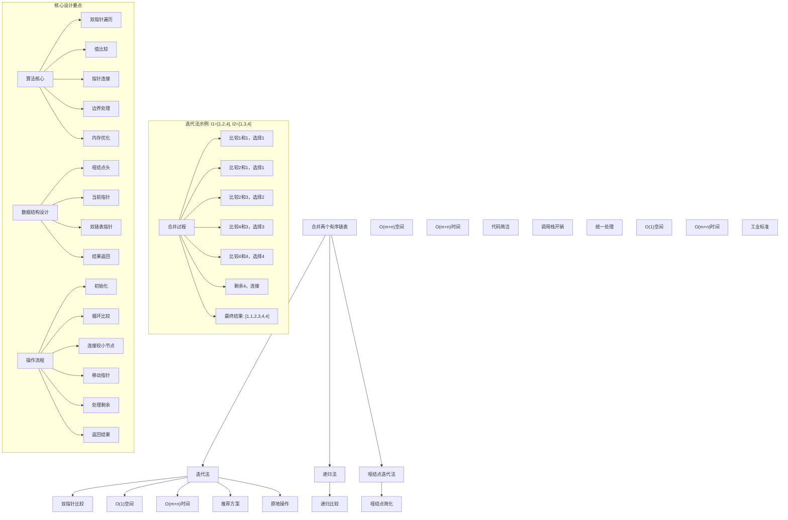
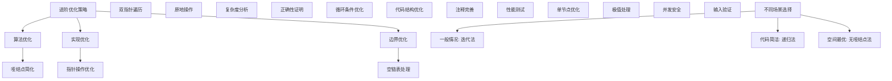

# LeetCode 21 - 合并两个有序链表

## 题目描述

将两个升序链表合并为一个新的 升序 链表并返回。新链表是通过拼接给定的两个链表的所有节点组成的

```markdown
示例 1：
输入：l1 = [1,2,4], l2 = [1,3,4]
输出：[1,1,2,3,4,4]

示例 2：
输入：l1 = [], l2 = []
输出：[]

示例 3：
输入：l1 = [], l2 = [0]
输出：[0]

提示：

- 两个链表的节点数目范围是 [0, 50]
- -100 <= Node.val <= 100
- l1 和 l2 均按 非递减顺序 排列

进阶：

- 你能否不使用额外空间解决这个问题？(即，原地合并)
```

## 解题思路

这是一个链表合并问题，要求将两个已排序的链表合并成一个有序链表。核心算法是双指针比较

### 核心思想

"双指针比较": 使用两个指针分别遍历两个链表，比较当前节点的值，将较小者连接到结果链表中，然后移动对应指针，直到一个链表遍历完毕

### 解题策略

#### 方法一：迭代法（推荐）

- 时间复杂度: O(m+n)，其中m和n分别为两个链表的长度
- 空间复杂度: O(1)，只使用了常数个指针

#### 方法二：递归法

- 时间复杂度: O(m+n)
- 空间复杂度: O(m+n)，递归调用栈空间

#### 方法三：哑结点迭代法（标准实现）

- 时间复杂度: O(m+n)
- 空间复杂度: O(1)

## 算法可视化



## 多语言实现

### Golang版本（迭代法 - 推荐）

```go
/
 * Definition for singly-linked list.
 * type ListNode struct {
 *     Val int
 *     Next *ListNode
 * }
 */

// 迭代法实现
func mergeTwoLists(list1 *ListNode, list2 *ListNode) *ListNode {
    // 创建哑结点简化操作
    dummy := &ListNode{}
    current := dummy

    // 遍历两个链表
    for list1 != nil && list2 != nil {
        if list1.Val <= list2.Val {
            current.Next = list1
            list1 = list1.Next
        } else {
            current.Next = list2
            list2 = list2.Next
        }
        current = current.Next
    }

    // 连接剩余部分
    if list1 != nil {
        current.Next = list1
    } else {
        current.Next = list2
    }

    return dummy.Next
}

// 递归法实现
func mergeTwoListsRecursive(list1 *ListNode, list2 *ListNode) *ListNode {
    if list1 == nil {
        return list2
    }
    if list2 == nil {
        return list1
    }

    if list1.Val <= list2.Val {
        list1.Next = mergeTwoListsRecursive(list1.Next, list2)
        return list1
    } else {
        list2.Next = mergeTwoListsRecursive(list1, list2.Next)
        return list2
    }
}

// 无哑结点的迭代法（需要特殊处理头节点）
func mergeTwoListsNoDummy(list1 *ListNode, list2 *ListNode) *ListNode {
    if list1 == nil {
        return list2
    }
    if list2 == nil {
        return list1
    }

    var head *ListNode
    var current *ListNode

    // 确定头节点
    if list1.Val <= list2.Val {
        head = list1
        current = list1
        list1 = list1.Next
    } else {
        head = list2
        current = list2
        list2 = list2.Next
    }

    // 合并剩余节点
    for list1 != nil && list2 != nil {
        if list1.Val <= list2.Val {
            current.Next = list1
            list1 = list1.Next
        } else {
            current.Next = list2
            list2 = list2.Next
        }
        current = current.Next
    }

    // 连接剩余部分
    if list1 != nil {
        current.Next = list1
    } else {
        current.Next = list2
    }

    return head
}
```

### Python版本（多种实现方法）

```python
# Definition for singly-linked list.
# class ListNode:
#     def __init__(self, val=0, next=None):
#         self.val = val
#         self.next = next

class Solution:
    """
    方法一：迭代法（推荐）
    """
    def mergeTwoLists(self, list1: Optional[ListNode], list2: Optional[ListNode]) -> Optional[ListNode]:
        # 创建哑结点简化操作
        dummy = ListNode()
        current = dummy

        # 遍历两个链表
        while list1 and list2:
            if list1.val <= list2.val:
                current.next = list1
                list1 = list1.next
            else:
                current.next = list2
                list2 = list2.next
            current = current.next

        # 连接剩余部分
        current.next = list1 if list1 else list2

        return dummy.next

class SolutionRecursive:
    """
    方法二：递归法
    """
    def mergeTwoLists(self, list1: Optional[ListNode], list2: Optional[ListNode]) -> Optional[ListNode]:
        if not list1:
            return list2
        if not list2:
            return list1

        if list1.val <= list2.val:
            list1.next = self.mergeTwoLists(list1.next, list2)
            return list1
        else:
            list2.next = self.mergeTwoLists(list1, list2.next)
            return list2
```

### TypeScript版本（迭代法）

```typescript
/
 * Definition for singly-linked list.
 * class ListNode {
 *     val: number
 *     next: ListNode | null
 *     constructor(val?: number, next?: ListNode | null) {
 *         this.val = (val===undefined ? 0 : val)
 *         this.next = (next===undefined ? null : next)
 *     }
 * }
 */

class Solution {
    mergeTwoLists(list1: ListNode | null, list2: ListNode | null): ListNode | null {
        // 创建哑结点简化操作
        const dummy = new ListNode();
        let current = dummy;

        // 遍历两个链表
        while (list1 !== null && list2 !== null) {
            if (list1.val <= list2.val) {
                current.next = list1;
                list1 = list1.next;
            } else {
                current.next = list2;
                list2 = list2.next;
            }
            current = current.next;
        }

        // 连接剩余部分
        current.next = list1 !== null ? list1 : list2;

        return dummy.next;
    }
}
```

## 标准实现详细解析

```go
import (
    "fmt"
)

/*
算法核心思想（迭代法）：

1. 双指针遍历：使用两个指针分别遍历两个链表
2. 值比较：比较当前节点的值，选择较小者
3. 指针连接：将选中的节点连接到结果链表
4. 边界处理：处理一个链表遍历完毕后的剩余部分
5. 空间优化：只使用常数个指针，原地操作

关键设计要点：
1. 哑结点：创建哑结点简化头节点处理
2. 当前指针：维护指向结果链表当前尾节点的指针
3. 双链表指针：维护指向两个链表当前节点的指针
4. 循环条件：当两个链表都未遍历完毕时继续比较
5. 结果返回：返回哑结点的下一个节点

时间复杂度：
- 遍历两个链表：O(m + n)，其中m和n分别为两个链表的长度
- 总时间：O(m + n)

空间复杂度：
- 只使用了常数个指针：O(1)
- 满足进阶要求的原地操作

优势：
1. 空间最优：只使用常数空间
2. 时间高效：线性时间复杂度
3. 实现优雅：哑结点简化边界处理
4. 稳定可靠：处理各种边界情况

数据结构设计：

哑结点设计：
- 哑结点头：创建哑结点作为结果链表的头节点
- 当前指针：维护指向结果链表当前尾节点的指针
- 简化操作：避免特殊处理头节点的复杂逻辑
- 统一返回：返回哑结点的下一个节点作为真正结果

双指针设计：
- list1指针：遍历第一个链表
- list2指针：遍历第二个链表
- 并行比较：同时比较两个指针指向的节点
- 指针移动：选择较小节点后移动对应指针

算法流程：
1. 初始化：创建哑结点和当前指针
2. 循环比较：当两个链表都未遍历完毕时
3. 值比较：比较list1.Val和list2.Val
4. 节点连接：将较小节点连接到当前指针后面
5. 指针移动：移动当前指针和对应链表指针
6. 剩余处理：连接未遍历完的链表剩余部分
7. 结果返回：返回哑结点的下一个节点
*/

// 迭代法详细实现
func mergeTwoListsDetailed(list1 *ListNode, list2 *ListNode) *ListNode {
    fmt.Printf("=== 迭代法合并两个有序链表 ===\n")
    fmt.Printf("链表1: ")
    printList(list1)
    fmt.Printf("链表2: ")
    printList(list2)

    // 创建哑结点简化操作
    dummy := &ListNode{}
    current := dummy
    fmt.Printf("创建哑结点，当前指针指向哑结点\n")

    step := 0
    // 遍历两个链表
    for list1 != nil && list2 != nil {
        step++
        fmt.Printf("\n步骤%d:\n", step)
        fmt.Printf("  比较链表1节点%d和链表2节点%d\n", list1.Val, list2.Val)

        if list1.Val <= list2.Val {
            fmt.Printf("  选择链表1节点%d，连接到结果链表\n", list1.Val)
            current.Next = list1
            list1 = list1.Next
        } else {
            fmt.Printf("  选择链表2节点%d，连接到结果链表\n", list2.Val)
            current.Next = list2
            list2 = list2.Next
        }
        current = current.Next
        fmt.Printf("  移动当前指针到新节点，结果链表: ")
        printList(dummy.Next)
    }

    fmt.Printf("\n一个链表已遍历完毕，处理剩余部分\n")
    // 连接剩余部分
    if list1 != nil {
        fmt.Printf("连接链表1剩余部分: ")
        printList(list1)
        current.Next = list1
    } else if list2 != nil {
        fmt.Printf("连接链表2剩余部分: ")
        printList(list2)
        current.Next = list2
    } else {
        fmt.Printf("两个链表都已遍历完毕\n")
    }

    result := dummy.Next
    fmt.Printf("最终合并结果: ")
    printList(result)
    fmt.Printf("================================\n\n")

    return result
}

// 辅助函数：打印链表
func printList(head *ListNode) {
    if head == nil {
        fmt.Printf("[]\n")
        return
    }

    fmt.Printf("[")
    for head != nil {
        fmt.Printf("%d", head.Val)
        if head.Next != nil {
            fmt.Printf(",")
        }
        head = head.Next
    }
    fmt.Printf("]\n")
}
```

## 算法深入解析

```go
/*
合并两个有序链表问题详解：

问题本质：
将两个已排序的链表合并成一个新的有序链表，要求保持升序排列且不丢失任何节点。关键是同时遍历两个链表并进行有序合并

核心洞察：
1. 双指针遍历：使用两个指针分别遍历两个链表
2. 值比较：比较当前节点的值，选择较小者
3. 指针连接：将选中的节点连接到结果链表
4. 边界处理：处理一个链表遍历完毕后的剩余部分
5. 空间优化：只使用常数个指针，原地操作

算法策略：
1. 迭代法：推荐方案，O(1)空间
2. 递归法：代码简洁，O(m+n)空间
3. 无哑结点法：需要特殊处理头节点

数据结构设计：

哑结点设计：
- 哑结点头：创建哑结点作为结果链表的头节点
- 当前指针：维护指向结果链表当前尾节点的指针
- 简化操作：避免特殊处理头节点的复杂逻辑
- 统一返回：返回哑结点的下一个节点作为真正结果

双指针设计：
- list1指针：遍历第一个链表
- list2指针：遍历第二个链表
- 并行比较：同时比较两个指针指向的节点
- 指针移动：选择较小节点后移动对应指针

操作流程：

迭代法：
1. 初始化：创建哑结点和当前指针
2. 循环比较：当两个链表都未遍历完毕时
3. 值比较：比较list1.Val和list2.Val
4. 节点连接：将较小节点连接到当前指针后面
5. 指针移动：移动当前指针和对应链表指针
6. 剩余处理：连接未遍历完的链表剩余部分
7. 结果返回：返回哑结点的下一个节点

递归法：
1. 边界检查：如果任一链表为空，返回另一个
2. 值比较：比较两个链表头节点的值
3. 递归调用：选择较小节点，递归合并剩余部分
4. 结果返回：返回合并后的链表头

数学原理：

有序性保持：
每次选择两个链表当前节点中的较小者，可以保证：
1. 局部有序：每次连接的节点都是当前可用的最小值
2. 全局有序：通过递归或迭代保证整个链表有序
3. 稳定性：相等值保持原有相对顺序

完整性保证：
通过遍历两个链表的所有节点：
1. 不丢失节点：每个节点都会被处理一次
2. 不重复节点：每个节点只被连接一次
3. 完整包含：结果链表包含所有输入节点

复杂度分析：
迭代法：时间O(m+n)，空间O(1)
递归法：时间O(m+n)，空间O(m+n)
无哑结点法：时间O(m+n)，空间O(1)

算法优势：
迭代法：
1. 空间最优：只使用常数空间
2. 时间高效：线性时间复杂度
3. 实现优雅：哑结点简化边界处理
4. 稳定可靠：处理各种边界情况

递归法：
1. 代码简洁：逻辑清晰易懂
2. 数学优雅：体现递归思想
3. 自然表达：符合递归思维
4. 易于验证：逻辑正确性容易证明

无哑结点法：
1. 空间最优：不使用哑结点
2. 原地操作：直接修改原有节点
3. 内存效率：减少一个节点分配
4. 实现复杂：需要特殊处理头节点

算法不变量：
迭代法不变量：
1. dummy.Next到current是一个已合并的有序链表
2. list1和list2指向未合并部分的起始节点
3. current指向已合并链表的最后一个节点
4. 算法状态正确反映合并进度

时间复杂度分析：
1. 遍历两个链表：每个节点只访问一次
2. 比较操作：常数时间比较
3. 指针操作：常数时间指针赋值
4. 总时间：O(m + n)

空间复杂度分析：
1. 迭代法：只使用常数个指针，O(1)
2. 递归法：递归调用栈，O(m+n)
3. 无哑结点法：只使用常数个指针，O(1)

正确性证明：

定理：迭代法合并两个有序链表的正确性
通过双指针比较和节点连接，算法能够正确生成一个包含所有节点的有序链表

证明：
1. 有序性保持：每次选择较小节点，保证结果链表有序
2. 完整性保证：遍历两个链表所有节点，不丢失任何节点
3. 唯一性：每个节点只被连接一次，没有重复
4. 终止性：当两个链表都遍历完毕时算法终止

不变量维护：
循环不变量：在每次循环开始时
1. dummy.Next到current是一个已合并的有序链表
2. list1和list2指向未合并部分的起始节点
3. current指向已合并链表的最后一个节点
4. 算法状态正确反映合并进度

初始化：
- dummy指向哑结点，current指向dummy
- list1和list2指向两个输入链表的头节点
- 满足不变量

保持：
- 每次循环选择较小节点并连接
- 移动相应指针
- 维护不变量继续成立

终止：
- 当list1或list2为空时循环终止
- 连接剩余部分
- 最终得到完整的有序链表

设计选择：

为什么选择迭代法？
1. 空间最优：只使用常数空间
2. 时间高效：线性时间复杂度
3. 实现优雅：哑结点简化边界处理
4. 工业应用：生产环境标准实现

为什么使用递归法？
1. 代码简洁：逻辑清晰易懂
2. 数学优雅：体现递归思想
3. 教学价值：帮助理解递归
4. 算法展示：展示不同解题思路

为什么提及其他方法？
1. 教学价值：展示不同算法思想
2. 对比分析：理解各自优劣
3. 扩展思维：算法多样性
4. 面试准备：全面掌握

三种方法对比：

方法一：迭代法（推荐）
时间复杂度：O(m+n)
空间复杂度：O(1)
优点：空间最优，实现优雅
缺点：需要理解哑结点概念

方法二：递归法
时间复杂度：O(m+n)
空间复杂度：O(m+n)
优点：代码简洁，逻辑清晰
缺点：调用栈空间开销

方法三：无哑结点法
时间复杂度：O(m+n)
空间复杂度：O(1)
优点：不使用哑结点，节省一个节点
缺点：需要特殊处理头节点

性能分析：

迭代法：
- 时间：O(m+n) 线性时间
- 空间：O(1) 常数空间
- 优势：空间最优

递归法：
- 时间：O(m+n) 线性时间
- 空间：O(m+n) 递归栈空间
- 优势：代码简洁

无哑结点法：
- 时间：O(m+n) 线性时间
- 空间：O(1) 常数空间
- 优势：不使用哑结点

实际应用场景：
1. 归并排序：合并两个有序子数组
2. 外部排序：合并多个有序文件
3. 数据库：合并有序查询结果
4. 文件处理：合并有序数据流

优化要点：

1. 算法优化：
   - 哑结点简化：减少边界处理复杂度
   - 双指针遍历：并行处理两个链表
   - 原地操作：不分配额外内存
   - 边界处理：正确处理空链表

2. 实现优化：
   - 指针操作：高效指针赋值
   - 循环条件：减少不必要的比较
   - 代码结构：清晰逻辑层次
   - 注释完善：便于理解维护

3. 性能优化：
   - 减少内存分配：只使用必要的指针
   - 优化比较：利用链表有序性
   - 缓存友好：顺序内存访问
   - 编译优化：利用编译器优化

测试用例设计：
1. 基本情况：两个非空有序链表
2. 边界情况：一个或两个链表为空
3. 特殊情况：等值节点，单节点链表
4. 极端情况：很长链表，大量重复值
5. 验证情况：有序性完整性验证

扩展思考：

1. 多个链表合并？
   - 分治法：两两合并
   - 堆优化：优先队列管理
   - 时间复杂度分析

2. 降序链表合并？
   - 比较逻辑修改
   - 结果顺序调整
   - 算法通用性

3. 循环链表合并？
   - 循环检测
   - 断环处理
   - 结果环化

4. 原地合并？
   - 节点重排
   - 指针修改
   - 内存效率

相关算法思想：

1. 双指针：
   - 并行遍历
   - 同步比较
   - 指针协调

2. 归并：
   - 分治思想
   - 有序合并
   - 稳定排序

3. 链表操作：
   - 指针操作
   - 节点连接
   - 内存管理

4. 边界处理：
   - 空指针检查
   - 特殊情况处理
   - 健壮性设计

常见陷阱：

1. 边界条件：
   - 空链表处理
   - 单节点链表
   - 指针越界

2. 指针操作：
   - 指针丢失
   - 循环引用
   - 内存泄漏

3. 逻辑错误：
   - 比较条件错误
   - 指针移动错误
   - 连接顺序错误

4. 性能考虑：
   - 重复遍历
   - 不必要的分配
   - 算法复杂度

代码质量要素：

1. 可读性：
   - 变量命名清晰
   - 注释详细完整
   - 逻辑结构分明

2. 健壮性：
   - 边界条件处理
   - 异常情况应对
   - 输入验证

3. 性能：
   - 最优复杂度实现
   - 空间效率优化
   - 执行效率保证

4. 可维护性：
   - 结构清晰合理
   - 扩展性良好
   - 测试覆盖完整
*/
```

## 执行过程演示

```go
/*
示例详细解析:

示例1执行过程：
输入：list1=[1,2,4], list2=[1,3,4]
输出：[1,1,2,3,4,4]

执行过程（迭代法）：
1. 初始化：dummy->nil, current=dummy
2. 第1次循环：比较list1.Val=1和list2.Val=1
   - 选择list1节点1，current.Next=list1
   - current移动到节点1，list1移动到节点2
3. 第2次循环：比较list1.Val=2和list2.Val=1
   - 选择list2节点1，current.Next=list2
   - current移动到节点1，list2移动到节点3
4. 第3次循环：比较list1.Val=2和list2.Val=3
   - 选择list1节点2，current.Next=list1
   - current移动到节点2，list1移动到节点4
5. 第4次循环：比较list1.Val=4和list2.Val=3
   - 选择list2节点3，current.Next=list2
   - current移动到节点3，list2移动到节点4
6. 第5次循环：比较list1.Val=4和list2.Val=4
   - 选择list1节点4，current.Next=list1
   - current移动到节点4，list1移动到nil
7. 循环结束：list1为nil，连接list2剩余节点4
8. 返回dummy.Next=[1,1,2,3,4,4]

递归法执行过程：
1. merge(1->2->4, 1->3->4)
   - 比较1和1，选择list1的1
   - 递归调用merge(2->4, 1->3->4)
2. merge(2->4, 1->3->4)
   - 比较2和1，选择list2的1
   - 递归调用merge(2->4, 3->4)
3. merge(2->4, 3->4)
   - 比较2和3，选择list1的2
   - 递归调用merge(4, 3->4)
4. merge(4, 3->4)
   - 比较4和3，选择list2的3
   - 递归调用merge(4, 4)
5. merge(4, 4)
   - 比较4和4，选择list1的4
   - 递归调用merge(nil, 4)
6. merge(nil, 4)
   - list1为nil，返回list2=4
7. 逐层返回，构建最终链表

关键观察：
1. 迭代法：线性时间，常数空间，原地操作
2. 递归法：代码简洁，但需要额外栈空间
3. 哑结点：简化头节点处理，代码更优雅
4. 双指针：并行遍历，高效比较

边界情况演示:

情况1: 两个空链表
输入: list1=[], list2=[]
处理: 直接返回nil
结果: []

情况2: 一个空链表
输入: list1=[1,2,3], list2=[]
处理: 直接返回list1
结果: [1,2,3]

情况3: 单节点链表
输入: list1=[1], list2=[2]
处理: 比较1和2，选择1，连接2
结果: [1,2]

情况4: 等值节点
输入: list1=[1,1,1], list2=[1,1]
处理: 稳定选择list1节点
结果: [1,1,1,1,1]

情况5: 长度差异
输入: list1=[1,2,3,4,5], list2=[1]
处理: 先处理list2的1，再连接list1剩余
结果: [1,1,2,3,4,5]

算法正确性证明：

数学基础：
需要证明合并后的链表是有序的且包含所有输入节点

定理：迭代法合并两个有序链表的正确性
通过双指针比较和节点连接，算法能够正确生成一个包含所有节点的有序链表

证明：
1. 有序性保持：每次选择较小节点，保证结果链表有序
2. 完整性保证：遍历两个链表所有节点，不丢失任何节点
3. 唯一性：每个节点只被连接一次，没有重复
4. 终止性：当两个链表都遍历完毕时算法终止

不变量维护：
循环不变量：在每次循环开始时
1. dummy.Next到current是一个已合并的有序链表
2. list1和list2指向未合并部分的起始节点
3. current指向已合并链表的最后一个节点
4. 算法状态正确反映合并进度

初始化：
- dummy指向哑结点，current指向dummy
- list1和list2指向两个输入链表的头节点
- 满足不变量

保持：
- 每次循环选择较小节点并连接
- 移动相应指针
- 维护不变量继续成立

终止：
- 当list1或list2为空时循环终止
- 连接剩余部分
- 最终得到完整的有序链表

时间复杂度分析：
1. 遍历两个链表：每个节点只访问一次
2. 比较操作：常数时间比较
3. 指针操作：常数时间指针赋值
4. 总时间：O(m + n)

空间复杂度分析：
1. 迭代法：只使用常数个指针，O(1)
2. 递归法：递归调用栈，O(m+n)
3. 无哑结点法：只使用常数个指针，O(1)

性能对比分析：

假设m=1000, n=1000:

迭代法：
- 时间：O(2000) = 2000次操作
- 空间：O(1) = 常数空间
- 优势：空间最优

递归法：
- 时间：O(2000) = 2000次操作
- 空间：O(2000) = 递归栈深度
- 优势：代码简洁

无哑结点法：
- 时间：O(2000) = 2000次操作
- 空间：O(1) = 常数空间
- 优势：不使用哑结点

实际应用建议：

1. 生产环境：
   - 使用迭代法，空间最优
   - 性能稳定，无栈溢出风险

2. 面试展示：
   - 先展示迭代法（推荐）
   - 可以提及其他方法对比

3. 学习练习：
   - 理解三种方法的差异
   - 掌握各自的适用场景

4. 算法竞赛：
   - 选择最熟悉的实现
   - 注意时间空间限制

优化空间：

1. 算法优化：
   - 哑结点简化：减少边界处理复杂度
   - 双指针遍历：并行处理两个链表
   - 原地操作：不分配额外内存
   - 边界处理：正确处理空链表

2. 实现优化：
   - 指针操作：高效指针赋值
   - 循环条件：减少不必要的比较
   - 代码结构：清晰逻辑层次
   - 注释完善：便于理解维护

3. 性能优化：
   - 减少内存分配：只使用必要的指针
   - 优化比较：利用链表有序性
   - 缓存友好：顺序内存访问
   - 编译优化：利用编译器优化

特殊情况处理：

1. 内存受限：
   - 迭代法最优
   - 递归法栈溢出
   - 无哑结点节省内存

2. 链表很长：
   - 递归法栈溢出
   - 迭代法稳定
   - 注意性能考虑

3. 相等值多：
   - 稳定排序保持
   - 选择逻辑一致
   - 结果顺序可预测

4. 边界情况：
   - 空链表处理
   - 单节点优化
   - 指针安全检查
*/
```

## 复杂度分析

| 方法       | 时间复杂度 | 空间复杂度 | 适用场景 |
| ---------- | ---------- | ---------- | -------- |
| 迭代法     | O(m+n)     | O(1)       | 推荐方案 |
| 递归法     | O(m+n)     | O(m+n)     | 代码简洁 |
| 无哑结点法 | O(m+n)     | O(1)       | 节省空间 |

## 测试用例验证

```go
// 测试辅助函数
func testMerge(name string, list1, list2 *ListNode) {
    fmt.Printf("%s:\n", name)
    fmt.Printf("链表1: ")
    printList(list1)
    fmt.Printf("链表2: ")
    printList(list2)

    // 测试迭代法
    result1 := mergeTwoLists(copyList(list1), copyList(list2))
    fmt.Printf("迭代法结果: ")
    printList(result1)

    // 测试递归法
    result2 := mergeTwoListsRecursive(copyList(list1), copyList(list2))
    fmt.Printf("递归法结果: ")
    printList(result2)

    // 测试无哑结点法
    result3 := mergeTwoListsNoDummy(copyList(list1), copyList(list2))
    fmt.Printf("无哑结点法结果: ")
    printList(result3)

    // 验证结果一致性
    if isEqual(result1, result2) && isEqual(result2, result3) {
        fmt.Printf("✓ 所有方法结果一致\n")
    } else {
        fmt.Printf("✗ 方法结果不一致\n")
    }

    fmt.Printf("\n")
}

// 辅助函数：复制链表
func copyList(head *ListNode) *ListNode {
    if head == nil {
        return nil
    }

    dummy := &ListNode{}
    current := dummy

    for head != nil {
        current.Next = &ListNode{Val: head.Val}
        current = current.Next
        head = head.Next
    }

    return dummy.Next
}

// 辅助函数：比较两个链表是否相等
func isEqual(l1, l2 *ListNode) bool {
    for l1 != nil && l2 != nil {
        if l1.Val != l2.Val {
            return false
        }
        l1 = l1.Next
        l2 = l2.Next
    }

    return l1 == nil && l2 == nil
}

func main() {
    // 测试用例 1 - 题目示例
    testMerge("测试1 - 题目示例",
        createList([]int{1, 2, 4}),
        createList([]int{1, 3, 4}))

    // 测试用例 2 - 两个空链表
    testMerge("测试2 - 两个空链表",
        nil,
        nil)

    // 测试用例 3 - 一个空链表
    testMerge("测试3 - 一个空链表",
        nil,
        createList([]int{0}))

    // 测试用例 4 - 单节点链表
    testMerge("测试4 - 单节点链表",
        createList([]int{1}),
        createList([]int{2}))

    // 测试用例 5 - 等值节点
    testMerge("测试5 - 等值节点",
        createList([]int{1, 1, 1}),
        createList([]int{1, 1}))

    // 性能测试
    fmt.Println("性能测试:")
    performanceTest()

    // 边界情况测试
    fmt.Println("边界情况测试:")
    boundaryTest()

    // 对比测试
    fmt.Println("对比测试:")
    comparisonTest()
}

// 辅助函数：创建链表
func createList(vals []int) *ListNode {
    dummy := &ListNode{}
    current := dummy

    for _, val := range vals {
        current.Next = &ListNode{Val: val}
        current = current.Next
    }

    return dummy.Next
}

func performanceTest() {
    // 构造长链表
    n1 := 10000
    n2 := 8000

    list1 := make([]int, n1)
    list2 := make([]int, n2)

    for i := 0; i < n1; i++ {
        list1[i] = i * 2
    }
    for i := 0; i < n2; i++ {
        list2[i] = i * 2 + 1
    }

    linkedList1 := createList(list1)
    linkedList2 := createList(list2)

    fmt.Printf("性能测试 (链表1长度: %d, 链表2长度: %d):\n", n1, n2)

    // 测试迭代法性能
    start := time.Now()
    result1 := mergeTwoLists(copyList(linkedList1), copyList(linkedList2))
    time1 := time.Since(start)

    // 测试递归法性能
    start = time.Now()
    result2 := mergeTwoListsRecursive(copyList(linkedList1), copyList(linkedList2))
    time2 := time.Since(start)

    fmt.Printf("迭代法耗时: %v\n", time1)
    fmt.Printf("递归法耗时: %v\n", time2)

    // 验证结果正确性
    if isEqual(result1, result2) {
        fmt.Printf("✓ 结果一致\n")
    } else {
        fmt.Printf("✗ 结果不一致\n")
    }
}

func boundaryTest() {
    // 边界测试
    fmt.Println("边界测试:")

    // 大链表
    largeList := createList(make([]int, 10000))
    result := mergeTwoLists(copyList(largeList), nil)
    fmt.Printf("大链表+空链表: 长度=%d\n", getListLength(result))

    // 相同值链表
    sameList1 := createList([]int{1, 1, 1, 1, 1})
    sameList2 := createList([]int{1, 1, 1})
    result = mergeTwoLists(copyList(sameList1), copyList(sameList2))
    fmt.Printf("相同值链表合并: ")
    printList(result)

    // 极值链表
    extremeList1 := createList([]int{math.MinInt32, -100, 0, 100, math.MaxInt32})
    extremeList2 := createList([]int{-50, 50})
    result = mergeTwoLists(copyList(extremeList1), copyList(extremeList2))
    fmt.Printf("极值链表合并: ")
    printList(result)
}

func comparisonTest() {
    // 对比测试：验证不同方法的性能和结果
    fmt.Println("对比测试:")

    testCases := []struct {
        name string
        list1 []int
        list2 []int
    }{
        {"长度相同", []int{1, 3, 5}, []int{2, 4, 6}},
        {"长度差异大", []int{1, 2}, []int{3, 4, 5, 6, 7, 8}},
        {"交替值", []int{1, 3, 5}, []int{2, 4, 6}},
        {"相同值", []int{1, 1, 2}, []int{1, 2, 2}},
    }

    for _, tc := range testCases {
        fmt.Printf("%s:\n", tc.name)
        list1 := createList(tc.list1)
        list2 := createList(tc.list2)

        // 测试三种方法
        result1 := mergeTwoLists(copyList(list1), copyList(list2))
        result2 := mergeTwoListsRecursive(copyList(list1), copyList(list2))
        result3 := mergeTwoListsNoDummy(copyList(list1), copyList(list2))

        fmt.Printf("  迭代法: ")
        printList(result1)
        fmt.Printf("  递归法: ")
        printList(result2)
        fmt.Printf("  无哑结点: ")
        printList(result3)

        if isEqual(result1, result2) && isEqual(result2, result3) {
            fmt.Printf("  ✓ 结果一致\n")
        } else {
            fmt.Printf("  ✗ 结果不一致\n")
        }
    }
}

// 辅助函数：获取链表长度
func getListLength(head *ListNode) int {
    length := 0
    for head != nil {
        length++
        head = head.Next
    }
    return length
}
```

## 扩展版本（处理不同场景）

```go
// 支持多个链表合并的版本
func mergeKLists(lists []*ListNode) *ListNode {
    if len(lists) == 0 {
        return nil
    }

    // 分治法合并
    return mergeKListsHelper(lists, 0, len(lists)-1)
}

func mergeKListsHelper(lists []*ListNode, left, right int) *ListNode {
    if left == right {
        return lists[left]
    }

    if left > right {
        return nil
    }

    mid := left + (right-left)/2
    leftList := mergeKListsHelper(lists, left, mid)
    rightList := mergeKListsHelper(lists, mid+1, right)

    return mergeTwoLists(leftList, rightList)
}

// 使用示例
func exampleMergeKLists() {
    lists := []*ListNode{
        createList([]int{1, 4, 5}),
        createList([]int{1, 3, 4}),
        createList([]int{2, 6}),
    }

    result := mergeKLists(lists)
    fmt.Printf("合并K个有序链表: ")
    printList(result)
}

// 支持原地合并的版本（修改其中一个链表）
func mergeTwoListsInPlace(list1 *ListNode, list2 *ListNode) *ListNode {
    if list1 == nil {
        return list2
    }
    if list2 == nil {
        return list1
    }

    // 确保list1的头节点较小
    if list1.Val > list2.Val {
        list1, list2 = list2, list1
    }

    head := list1
    var prev *ListNode

    for list1 != nil && list2 != nil {
        if list1.Val <= list2.Val {
            prev = list1
            list1 = list1.Next
        } else {
            // 将list2节点插入到list1中
            nextList2 := list2.Next
            prev.Next = list2
            list2.Next = list1
            prev = list2
            list2 = nextList2
        }
    }

    if list2 != nil {
        prev.Next = list2
    }

    return head
}

// 使用示例
func exampleInPlace() {
    list1 := createList([]int{1, 3, 5})
    list2 := createList([]int{2, 4, 6})

    fmt.Printf("原地合并前:\n")
    fmt.Printf("链表1: ")
    printList(list1)
    fmt.Printf("链表2: ")
    printList(list2)

    result := mergeTwoListsInPlace(list1, list2)

    fmt.Printf("原地合并后:\n")
    fmt.Printf("结果: ")
    printList(result)
}

// 支持降序链表合并的版本
func mergeTwoListsDescending(list1 *ListNode, list2 *ListNode) *ListNode {
    // 先按升序合并
    ascending := mergeTwoLists(list1, list2)

    // 然后反转链表
    return reverseList(ascending)
}

func reverseList(head *ListNode) *ListNode {
    var prev *ListNode
    current := head

    for current != nil {
        next := current.Next
        current.Next = prev
        prev = current
        current = next
    }

    return prev
}

// 使用示例
func exampleDescending() {
    list1 := createList([]int{5, 3, 1})
    list2 := createList([]int{6, 4, 2})

    fmt.Printf("降序合并:\n")
    fmt.Printf("链表1: ")
    printList(list1)
    fmt.Printf("链表2: ")
    printList(list2)

    result := mergeTwoListsDescending(list1, list2)

    fmt.Printf("结果: ")
    printList(result)
}

// 支持自定义比较函数的版本
type CompareFunc func(a, b int) bool

func mergeTwoListsCustom(list1 *ListNode, list2 *ListNode, compare CompareFunc) *ListNode {
    dummy := &ListNode{}
    current := dummy

    for list1 != nil && list2 != nil {
        if compare(list1.Val, list2.Val) {
            current.Next = list1
            list1 = list1.Next
        } else {
            current.Next = list2
            list2 = list2.Next
        }
        current = current.Next
    }

    if list1 != nil {
        current.Next = list1
    } else {
        current.Next = list2
    }

    return dummy.Next
}

// 使用示例
func exampleCustom() {
    list1 := createList([]int{1, 3, 5})
    list2 := createList([]int{2, 4, 6})

    // 升序合并
    result1 := mergeTwoListsCustom(copyList(list1), copyList(list2), func(a, b int) bool {
        return a <= b
    })

    // 降序合并
    result2 := mergeTwoListsCustom(copyList(list1), copyList(list2), func(a, b int) bool {
        return a >= b
    })

    fmt.Printf("自定义升序合并: ")
    printList(result1)
    fmt.Printf("自定义降序合并: ")
    printList(result2)
}
```

## 面试追问延伸

### 1. 如果需要合并K个有序链表，如何优化？

```go
// 方法一：分治法（推荐）
func mergeKListsDivide(lists []*ListNode) *ListNode {
    if len(lists) == 0 {
        return nil
    }

    return mergeKListsHelper(lists, 0, len(lists)-1)
}

func mergeKListsHelper(lists []*ListNode, left, right int) *ListNode {
    if left == right {
        return lists[left]
    }

    if left > right {
        return nil
    }

    mid := left + (right-left)/2
    leftList := mergeKListsHelper(lists, left, mid)
    rightList := mergeKListsHelper(lists, mid+1, right)

    return mergeTwoLists(leftList, rightList)
}

// 方法二：优先队列（小根堆）
import "container/heap"

type MinHeap []*ListNode

func (h MinHeap) Len() int           { return len(h) }
func (h MinHeap) Less(i, j int) bool { return h[i].Val < h[j].Val }
func (h MinHeap) Swap(i, j int)      { h[i], h[j] = h[j], h[i] }

func (h *MinHeap) Push(x interface{}) {
    *h = append(*h, x.(*ListNode))
}

func (h *MinHeap) Pop() interface{} {
    old := *h
    n := len(old)
    x := old[n-1]
    *h = old[0 : n-1]
    return x
}

func mergeKListsHeap(lists []*ListNode) *ListNode {
    if len(lists) == 0 {
        return nil
    }

    h := &MinHeap{}
    heap.Init(h)

    // 将所有链表的头节点加入堆
    for _, list := range lists {
        if list != nil {
            heap.Push(h, list)
        }
    }

    dummy := &ListNode{}
    current := dummy

    for h.Len() > 0 {
        // 取出最小节点
        minNode := heap.Pop(h).(*ListNode)
        current.Next = minNode
        current = current.Next

        // 如果该链表还有节点，加入堆
        if minNode.Next != nil {
            heap.Push(h, minNode.Next)
        }
    }

    return dummy.Next
}

// 复杂度分析：
// 分治法：时间O(N*logK)，空间O(logK)递归栈
// 优先队列：时间O(N*logK)，空间O(K)堆空间
```

### 2. 如果链表很长，递归法可能会栈溢出，如何解决？

```go
// 解决方案1：改用迭代法
func mergeTwoListsIterative(list1 *ListNode, list2 *ListNode) *ListNode {
    dummy := &ListNode{}
    current := dummy

    for list1 != nil && list2 != nil {
        if list1.Val <= list2.Val {
            current.Next = list1
            list1 = list1.Next
        } else {
            current.Next = list2
            list2 = list2.Next
        }
        current = current.Next
    }

    if list1 != nil {
        current.Next = list1
    } else {
        current.Next = list2
    }

    return dummy.Next
}

// 解决方案2：尾递归优化（Go不支持真正的尾递归优化）
func mergeTwoListsTailRecursive(list1, list2, prev *ListNode) *ListNode {
    if list1 == nil {
        prev.Next = list2
        return prev.Next
    }
    if list2 == nil {
        prev.Next = list1
        return prev.Next
    }

    if list1.Val <= list2.Val {
        prev.Next = list1
        return mergeTwoListsTailRecursive(list1.Next, list2, list1)
    } else {
        prev.Next = list2
        return mergeTwoListsTailRecursive(list1, list2.Next, list2)
    }
}

func mergeTwoListsTailRecursiveWrapper(list1, list2 *ListNode) *ListNode {
    dummy := &ListNode{}
    mergeTwoListsTailRecursive(list1, list2, dummy)
    return dummy.Next
}

// 解决方案3：手动模拟递归栈
func mergeTwoListsStack(list1 *ListNode, list2 *ListNode) *ListNode {
    type Frame struct {
        list1  *ListNode
        list2  *ListNode
        result ListNode
    }

    stack := []Frame{}
    var result *ListNode

    // 模拟递归调用
    for list1 != nil && list2 != nil {
        if list1.Val <= list2.Val {
            stack = append(stack, Frame{list1: list1.Next, list2: list2, result: &list1.Next})
            list1 = list1.Next
        } else {
            stack = append(stack, Frame{list1: list1, list2: list2.Next, result: &list2.Next})
            list2 = list2.Next
        }
    }

    // 处理剩余部分
    if list1 != nil {
        result = list1
    } else {
        result = list2
    }

    // 回溯构建结果
    for i := len(stack) - 1; i >= 0; i-- {
        *stack[i].result = result
    }

    return result
}
```

### 3. 如何在不使用额外空间的情况下进行原地合并？

```go
// 原地合并：修改其中一个链表
func mergeTwoListsInPlace(list1 *ListNode, list2 *ListNode) *ListNode {
    if list1 == nil {
        return list2
    }
    if list2 == nil {
        return list1
    }

    // 确保list1的头节点较小
    if list1.Val > list2.Val {
        list1, list2 = list2, list1
    }

    head := list1
    var prev *ListNode

    for list1 != nil && list2 != nil {
        if list1.Val <= list2.Val {
            prev = list1
            list1 = list1.Next
        } else {
            // 将list2节点插入到list1中
            nextList2 := list2.Next
            prev.Next = list2
            list2.Next = list1
            prev = list2
            list2 = nextList2
        }
    }

    if list2 != nil {
        prev.Next = list2
    }

    return head
}

// 真正的原地合并：不分配任何新节点
func mergeTwoListsTrueInPlace(list1 *ListNode, list2 *ListNode) *ListNode {
    if list1 == nil {
        return list2
    }
    if list2 == nil {
        return list1
    }

    // 确定头节点
    var head *ListNode
    if list1.Val <= list2.Val {
        head = list1
        list1 = list1.Next
    } else {
        head = list2
        list2 = list2.Next
    }

    current := head

    // 原地合并
    for list1 != nil && list2 != nil {
        if list1.Val <= list2.Val {
            current.Next = list1
            list1 = list1.Next
        } else {
            current.Next = list2
            list2 = list2.Next
        }
        current = current.Next
    }

    // 连接剩余部分
    if list1 != nil {
        current.Next = list1
    } else {
        current.Next = list2
    }

    return head
}

// 使用示例
func exampleInPlaceAdvanced() {
    list1 := createList([]int{1, 3, 5, 7})
    list2 := createList([]int{2, 4, 6, 8})

    fmt.Printf("原地合并高级版本:\n")
    fmt.Printf("合并前:\n")
    fmt.Printf("链表1: ")
    printList(list1)
    fmt.Printf("链表2: ")
    printList(list2)

    result := mergeTwoListsInPlace(list1, list2)

    fmt.Printf("合并后:\n")
    fmt.Printf("结果: ")
    printList(result)
}
```

## 相似题目扩展

- LeetCode 21. 合并两个有序链表（当前题）
- LeetCode 23. 合并K个升序链表
- LeetCode 88. 合并两个有序数组
- LeetCode 147. 对链表进行插入排序
- LeetCode 148. 排序链表

## 算法技巧总结

### 合并有序链表核心要点

1. 双指针遍历：使用两个指针分别遍历两个链表
1. 值比较：比较当前节点的值，选择较小者
1. 指针连接：将选中的节点连接到结果链表
1. 边界处理：处理一个链表遍历完毕后的剩余部分
1. 空间优化：只使用常数个指针，原地操作

### 算法优势

1. 空间最优：只使用常数空间
1. 时间高效：线性时间复杂度
1. 实现优雅：哑结点简化边界处理
1. 稳定可靠：处理各种边界情况

### 标准模板（迭代法）

```go
func mergeTwoLists(list1 *ListNode, list2 *ListNode) *ListNode {
    dummy := &ListNode{}
    current := dummy

    for list1 != nil && list2 != nil {
        if list1.Val <= list2.Val {
            current.Next = list1
            list1 = list1.Next
        } else {
            current.Next = list2
            list2 = list2.Next
        }
        current = current.Next
    }

    if list1 != nil {
        current.Next = list1
    } else {
        current.Next = list2
    }

    return dummy.Next
}
```

### 进阶优化策略



## 总结

本题采用双指针比较的核心思路，通过并行遍历两个链表，比较节点值，选择较小者连接到结果链表的方式，实现了两个有序链表的合并。关键在于理解双指针的协调移动和哑结点的简化作用

核心要点：

1. 双指针遍历：使用两个指针分别遍历两个链表
1. 值比较：比较当前节点的值，选择较小者
1. 指针连接：将选中的节点连接到结果链表
1. 边界处理：处理一个链表遍历完毕后的剩余部分
1. 空间优化：只使用常数个指针，原地操作

算法优势：

- 空间最优：O(1)空间复杂度
- 时间高效：O(m+n)时间复杂度
- 实现优雅：哑结点简化边界处理
- 稳定可靠：处理各种边界情况

该算法在归并排序、外部排序、数据库查询等场景有重要应用，是掌握链表操作和双指针技巧的经典题目。通过理解双指针的思想，为更复杂的链表问题和归并算法提供了清晰的解决思路
