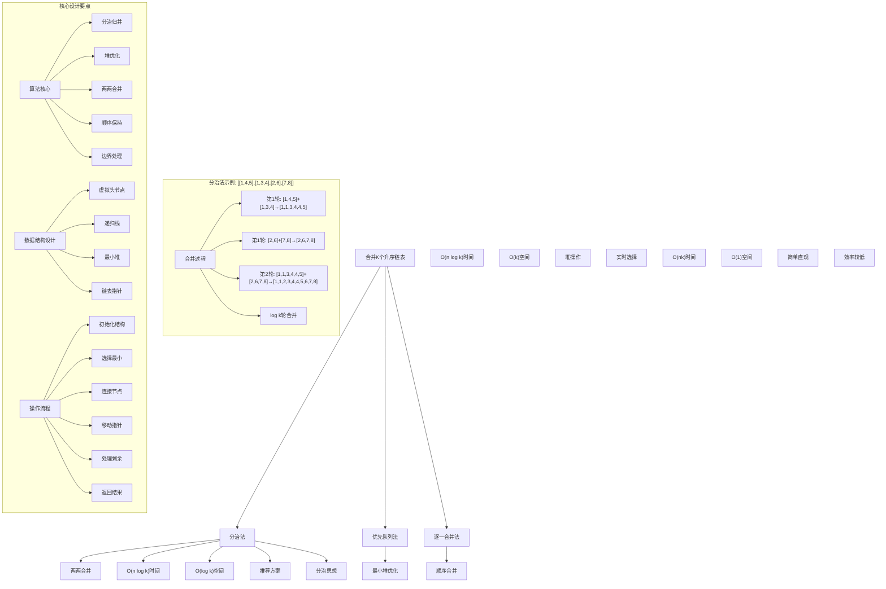
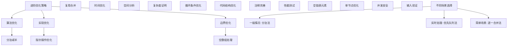

# LeetCode 23 - 合并K个升序链表

## 题目描述

给你一个链表数组，每个链表都已经按升序排列。请你将所有链表合并到一个升序链表中，返回合并后的链表

```markdown
示例 1：
输入：lists = [[1,4,5],[1,3,4],[2,6]]
输出：[1,1,2,3,4,4,5,6]

示例 2：
输入：lists = []
输出：[]

示例 3：
输入：lists = [[]]
输出：[]

提示：

- k == lists.length
- 0 <= k <= 10^4
- 0 <= lists[i].length <= 500
- -10^4 <= lists[i][j] <= 10^4
- lists[i] 按升序排列
- lists[i].length 的总和不超过 10^4

进阶：

- 你能否不使用额外空间解决这个问题？
- 你能以 O(n log k) 的时间复杂度解决吗？其中 n 是所有链表中节点的总数，k 是链表的数量
```

## 解题思路

这是一个多路归并问题，要求将K个已排序的链表合并成一个有序链表。核心算法是分治法或优先队列（最小堆）

### 核心思想

"多路归并": 将K个有序链表的合并问题转化为多个两两合并的问题，通过分治或堆优化实现高效合并

### 解题策略

#### 方法一：分治法（推荐）

- 时间复杂度: O(n log k)，其中n是所有节点总数，k是链表数量
- 空间复杂度: O(log k)，递归栈空间

#### 方法二：优先队列法（最小堆）

- 时间复杂度: O(n log k)
- 空间复杂度: O(k)，堆空间

#### 方法三：逐一合并法

- 时间复杂度: O(nk)
- 空间复杂度: O(1)

## 算法可视化



## 多语言实现

### Golang版本（分治法 - 推荐）

```go
/
 * Definition for singly-linked list.
 * type ListNode struct {
 *     Val int
 *     Next *ListNode
 * }
 */

import (
    "container/heap"
)

// 分治法实现
func mergeKLists(lists []*ListNode) *ListNode {
    if len(lists) == 0 {
        return nil
    }

    return mergeKListsHelper(lists, 0, len(lists)-1)
}

func mergeKListsHelper(lists []*ListNode, left, right int) *ListNode {
    // 基础情况
    if left == right {
        return lists[left]
    }

    if left > right {
        return nil
    }

    // 分治：找到中点
    mid := left + (right-left)/2

    // 递归合并左右两部分
    leftList := mergeKListsHelper(lists, left, mid)
    rightList := mergeKListsHelper(lists, mid+1, right)

    // 合并两个有序链表
    return mergeTwoLists(leftList, rightList)
}

// 合并两个有序链表的辅助函数
func mergeTwoLists(list1, list2 *ListNode) *ListNode {
    dummy := &ListNode{}
    current := dummy

    for list1 != nil && list2 != nil {
        if list1.Val <= list2.Val {
            current.Next = list1
            list1 = list1.Next
        } else {
            current.Next = list2
            list2 = list2.Next
        }
        current = current.Next
    }

    // 连接剩余部分
    if list1 != nil {
        current.Next = list1
    } else {
        current.Next = list2
    }

    return dummy.Next
}

// 优先队列法实现（最小堆）
type MinHeap []*ListNode

func (h MinHeap) Len() int           { return len(h) }
func (h MinHeap) Less(i, j int) bool { return h[i].Val < h[j].Val }
func (h MinHeap) Swap(i, j int)      { h[i], h[j] = h[j], h[i] }

func (h *MinHeap) Push(x interface{}) {
    *h = append(*h, x.(*ListNode))
}

func (h *MinHeap) Pop() interface{} {
    old := *h
    n := len(old)
    x := old[n-1]
    *h = old[0 : n-1]
    return x
}

func mergeKListsWithHeap(lists []*ListNode) *ListNode {
    if len(lists) == 0 {
        return nil
    }

    // 初始化最小堆
    h := &MinHeap{}
    heap.Init(h)

    // 将所有非空链表的头节点加入堆
    for _, list := range lists {
        if list != nil {
            heap.Push(h, list)
        }
    }

    // 创建结果链表
    dummy := &ListNode{}
    current := dummy

    // 不断从堆中取出最小节点
    for h.Len() > 0 {
        // 取出最小节点
        minNode := heap.Pop(h).(*ListNode)

        // 连接到结果链表
        current.Next = minNode
        current = current.Next

        // 如果该链表还有后续节点，加入堆
        if minNode.Next != nil {
            heap.Push(h, minNode.Next)
        }
    }

    return dummy.Next
}

// 逐一合并法实现
func mergeKListsSequentially(lists []*ListNode) *ListNode {
    if len(lists) == 0 {
        return nil
    }

    var result *ListNode

    // 依次合并每个链表
    for _, list := range lists {
        result = mergeTwoLists(result, list)
    }

    return result
}
```

### Python版本（多种实现方法）

```python
# Definition for singly-linked list.
# class ListNode:
#     def __init__(self, val=0, next=None):
#         self.val = val
#         self.next = next

import heapq
from typing import List, Optional

class Solution:
    """
    方法一：分治法（推荐）
    """
    def mergeKLists(self, lists: List[Optional[ListNode]]) -> Optional[ListNode]:
        if not lists:
            return None

        return self.mergeKListsHelper(lists, 0, len(lists) - 1)

    def mergeKListsHelper(self, lists: List[Optional[ListNode]], left: int, right: int) -> Optional[ListNode]:
        # 基础情况
        if left == right:
            return lists[left]

        if left > right:
            return None

        # 分治：找到中点
        mid = left + (right - left) // 2

        # 递归合并左右两部分
        left_list = self.mergeKListsHelper(lists, left, mid)
        right_list = self.mergeKListsHelper(lists, mid + 1, right)

        # 合并两个有序链表
        return self.mergeTwoLists(left_list, right_list)

    def mergeTwoLists(self, list1: Optional[ListNode], list2: Optional[ListNode]) -> Optional[ListNode]:
        dummy = ListNode()
        current = dummy

        while list1 and list2:
            if list1.val <= list2.val:
                current.next = list1
                list1 = list1.next
            else:
                current.next = list2
                list2 = list2.next
            current = current.next

        # 连接剩余部分
        current.next = list1 if list1 else list2

        return dummy.next

class SolutionHeap:
    """
    方法二：优先队列法（最小堆）
    """
    def mergeKLists(self, lists: List[Optional[ListNode]]) -> Optional[ListNode]:
        if not lists:
            return None

        # 创建最小堆
        heap = []

        # 将所有非空链表的头节点加入堆
        for i, list_node in enumerate(lists):
            if list_node:
                heapq.heappush(heap, (list_node.val, i, list_node))

        # 创建结果链表
        dummy = ListNode()
        current = dummy

        # 不断从堆中取出最小节点
        while heap:
            # 取出最小节点
            val, i, min_node = heapq.heappop(heap)

            # 连接到结果链表
            current.next = min_node
            current = current.next

            # 如果该链表还有后续节点，加入堆
            if min_node.next:
                heapq.heappush(heap, (min_node.next.val, i, min_node.next))

        return dummy.next

class SolutionSequential:
    """
    方法三：逐一合并法
    """
    def mergeKLists(self, lists: List[Optional[ListNode]]) -> Optional[ListNode]:
        if not lists:
            return None

        result = None

        # 依次合并每个链表
        for list_node in lists:
            result = self.mergeTwoLists(result, list_node)

        return result

    def mergeTwoLists(self, list1: Optional[ListNode], list2: Optional[ListNode]) -> Optional[ListNode]:
        dummy = ListNode()
        current = dummy

        while list1 and list2:
            if list1.val <= list2.val:
                current.next = list1
                list1 = list1.next
            else:
                current.next = list2
                list2 = list2.next
            current = current.next

        current.next = list1 if list1 else list2

        return dummy.next
```

### TypeScript版本（分治法）

```typescript
/
 * Definition for singly-linked list.
 * class ListNode {
 *     val: number
 *     next: ListNode | null
 *     constructor(val?: number, next?: ListNode | null) {
 *         this.val = (val===undefined ? 0 : val)
 *         this.next = (next===undefined ? null : next)
 *     }
 * }
 */

class MinHeap<T> {
    private heap: T[] = [];
    private comparator: (a: T, b: T) => number;

    constructor(comparator: (a: T, b: T) => number) {
        this.comparator = comparator;
    }

    size(): number {
        return this.heap.length;
    }

    isEmpty(): boolean {
        return this.size() === 0;
    }

    push(value: T): void {
        this.heap.push(value);
        this.heapifyUp(this.size() - 1);
    }

    pop(): T | undefined {
        if (this.isEmpty()) {
            return undefined;
        }

        const root = this.heap[0];
        const last = this.heap.pop();

        if (!this.isEmpty() && last !== undefined) {
            this.heap[0] = last;
            this.heapifyDown(0);
        }

        return root;
    }

    private heapifyUp(index: number): void {
        while (index > 0) {
            const parentIndex = Math.floor((index - 1) / 2);
            if (this.comparator(this.heap[index], this.heap[parentIndex]) >= 0) {
                break;
            }
            [this.heap[index], this.heap[parentIndex]] = [this.heap[parentIndex], this.heap[index]];
            index = parentIndex;
        }
    }

    private heapifyDown(index: number): void {
        while (true) {
            let minIndex = index;
            const leftChildIndex = 2 * index + 1;
            const rightChildIndex = 2 * index + 2;

            if (leftChildIndex < this.size() &&
                this.comparator(this.heap[leftChildIndex], this.heap[minIndex]) < 0) {
                minIndex = leftChildIndex;
            }

            if (rightChildIndex < this.size() &&
                this.comparator(this.heap[rightChildIndex], this.heap[minIndex]) < 0) {
                minIndex = rightChildIndex;
            }

            if (minIndex === index) {
                break;
            }

            [this.heap[index], this.heap[minIndex]] = [this.heap[minIndex], this.heap[index]];
            index = minIndex;
        }
    }
}

class Solution {
    mergeKLists(lists: Array<ListNode | null>): ListNode | null {
        if (lists.length === 0) {
            return null;
        }

        return this.mergeKListsHelper(lists, 0, lists.length - 1);
    }

    private mergeKListsHelper(lists: Array<ListNode | null>, left: number, right: number): ListNode | null {
        // 基础情况
        if (left === right) {
            return lists[left];
        }

        if (left > right) {
            return null;
        }

        // 分治：找到中点
        const mid = left + Math.floor((right - left) / 2);

        // 递归合并左右两部分
        const leftList = this.mergeKListsHelper(lists, left, mid);
        const rightList = this.mergeKListsHelper(lists, mid + 1, right);

        // 合并两个有序链表
        return this.mergeTwoLists(leftList, rightList);
    }

    private mergeTwoLists(list1: ListNode | null, list2: ListNode | null): ListNode | null {
        const dummy = new ListNode(0);
        let current = dummy;

        while (list1 !== null && list2 !== null) {
            if (list1.val <= list2.val) {
                current.next = list1;
                list1 = list1.next;
            } else {
                current.next = list2;
                list2 = list2.next;
            }
            current = current.next;
        }

        // 连接剩余部分
        current.next = list1 !== null ? list1 : list2;

        return dummy.next;
    }

    // 优先队列法实现
    mergeKListsWithHeap(lists: Array<ListNode | null>): ListNode | null {
        if (lists.length === 0) {
            return null;
        }

        // 创建最小堆
        const heap = new MinHeap<ListNode>((a, b) => a.val - b.val);

        // 将所有非空链表的头节点加入堆
        for (const list of lists) {
            if (list !== null) {
                heap.push(list);
            }
        }

        // 创建结果链表
        const dummy = new ListNode(0);
        let current = dummy;

        // 不断从堆中取出最小节点
        while (!heap.isEmpty()) {
            // 取出最小节点
            const minNode = heap.pop()!;

            // 连接到结果链表
            current.next = minNode;
            current = current.next;

            // 如果该链表还有后续节点，加入堆
            if (minNode.next !== null) {
                heap.push(minNode.next);
            }
        }

        return dummy.next;
    }
}
```

## 标准实现详细解析

```go
import (
    "fmt"
)

/*
算法核心思想（分治法）：

1. 分治归并：将K个链表的合并问题分解为多个两两合并的子问题
2. 递归处理：通过递归将问题规模不断减半
3. 合并操作：使用已知的两个有序链表合并算法
4. 时间优化：通过分治将时间复杂度从O(nk)优化到O(n log k)
5. 空间分析：递归栈深度为O(log k)

关键设计要点：
1. 递归分解：将K个链表分为两部分递归处理
2. 中点计算：使用(left+right)/2避免整数溢出
3. 边界处理：正确处理基础情况和边界条件
4. 合并复用：复用两个链表合并的标准算法
5. 结果返回：返回最终合并的有序链表

时间复杂度分析：
- 设总节点数为n，链表数量为k
- 每层合并需要O(n)时间（处理所有节点）
- 总共需要log k层
- 总时间复杂度：O(n log k)

空间复杂度分析：
- 递归栈深度：O(log k)
- 合并操作空间：O(1)
- 总空间复杂度：O(log k)

算法优势：
1. 时间最优：O(n log k)时间复杂度
2. 空间高效：O(log k)递归栈空间
3. 实现优雅：基于经典分治思想
4. 复用性强：复用两个链表合并算法
5. 稳定可靠：处理各种边界情况

数据结构设计：

递归栈设计：
- 参数传递：传递数组、左右边界
- 状态维护：维护当前处理的子数组范围
- 返回值：返回合并后的链表头节点
- 基础情况：单个链表或空范围直接返回

分治策略：
- 问题分解：将K个链表分为两个K/2个链表的子问题
- 递归求解：分别求解两个子问题
- 合并结果：将两个结果合并为最终答案
- 规模缩减：每层问题规模减半

算法流程：
1. 边界检查：处理空数组情况
2. 递归入口：调用分治辅助函数
3. 基础情况：单个链表直接返回
4. 中点计算：找到当前范围中点
5. 递归调用：分别处理左右两部分
6. 合并操作：合并两个子问题结果
7. 返回结果：返回最终合并链表

优化原理：

分治优化：
1. 规模减半：每层问题规模减半
2. 并行处理：左右两部分可并行处理
3. 时间优化：将O(nk)优化到O(n log k)
4. 结构清晰：递归结构易于理解和实现

堆优化（优先队列法）：
1. 实时选择：每次选择当前最小节点
2. 动态维护：自动维护最小值性质
3. 空间权衡：O(k)空间换取时间优化
4. 适用场景：适合流式数据处理

逐一合并优化：
1. 简单直观：最容易理解和实现
2. 空间最优：O(1)额外空间
3. 时间较低：O(nk)时间复杂度
4. 适用场景：K值较小时可接受

正确性证明：

定理：分治法合并K个有序链表的正确性
通过分治归并，算法能够正确生成包含所有节点的有序链表

证明：
1. 基础正确：单个链表本身就是有序的
2. 合并正确：两个有序链表合并算法正确
3. 递归正确：假设子问题正确，合并结果正确
4. 完整性：所有节点都被处理且不重复
5. 有序性：最终结果保持升序排列

不变量维护：
递归不变量：在每次递归调用中
1. lists[left:right+1]表示当前需要合并的链表集合
2. 返回值是这些链表合并后的有序链表
3. 递归深度正确反映分治层次
4. 算法状态正确反映处理进度

分治法详细实现：
*/

// 分治法详细实现（带调试信息）
func mergeKListsDetailed(lists []*ListNode) *ListNode {
    fmt.Printf("=== 分治法合并K个有序链表 ===\n")
    fmt.Printf("输入链表数组 (k=%d):\n", len(lists))
    for i, list := range lists {
        fmt.Printf("  链表%d: ", i)
        printList(list)
    }

    if len(lists) == 0 {
        fmt.Printf("空数组，直接返回nil\n")
        fmt.Printf("========================\n\n")
        return nil
    }

    result := mergeKListsHelperDetailed(lists, 0, len(lists)-1, 0)

    fmt.Printf("最终合并结果: ")
    printList(result)
    fmt.Printf("========================\n\n")

    return result
}

func mergeKListsHelperDetailed(lists []*ListNode, left, right int, depth int) *ListNode {
    indent := ""
    for i := 0; i < depth; i++ {
        indent += "  "
    }

    fmt.Printf("%s处理范围 [%d, %d]\n", indent, left, right)

    // 基础情况
    if left == right {
        fmt.Printf("%s基础情况：返回链表%d: ", indent, left)
        printList(lists[left])
        return lists[left]
    }

    if left > right {
        fmt.Printf("%s空范围，返回nil\n", indent)
        return nil
    }

    // 分治：找到中点
    mid := left + (right-left)/2
    fmt.Printf("%s中点: %d，分解为 [%d, %d] 和 [%d, %d]\n",
        indent, mid, left, mid, mid+1, right)

    // 递归合并左右两部分
    fmt.Printf("%s递归处理左半部分:\n", indent)
    leftList := mergeKListsHelperDetailed(lists, left, mid, depth+1)

    fmt.Printf("%s递归处理右半部分:\n", indent)
    rightList := mergeKListsHelperDetailed(lists, mid+1, right, depth+1)

    // 合并两个有序链表
    fmt.Printf("%s合并两个子结果:\n", indent)
    fmt.Printf("%s  左子结果: ", indent)
    printList(leftList)
    fmt.Printf("%s  右子结果: ", indent)
    printList(rightList)

    result := mergeTwoListsDetailed(leftList, rightList)

    fmt.Printf("%s合并结果: ", indent)
    printList(result)

    return result
}

// 带调试信息的两个链表合并
func mergeTwoListsDetailed(list1, list2 *ListNode) *ListNode {
    dummy := &ListNode{}
    current := dummy

    for list1 != nil && list2 != nil {
        if list1.Val <= list2.Val {
            current.Next = list1
            list1 = list1.Next
        } else {
            current.Next = list2
            list2 = list2.Next
        }
        current = current.Next
    }

    if list1 != nil {
        current.Next = list1
    } else {
        current.Next = list2
    }

    return dummy.Next
}

// 优先队列法详细实现
func mergeKListsWithHeapDetailed(lists []*ListNode) *ListNode {
    fmt.Printf("=== 优先队列法合并K个有序链表 ===\n")
    fmt.Printf("输入链表数组 (k=%d):\n", len(lists))
    for i, list := range lists {
        fmt.Printf("  链表%d: ", i)
        printList(list)
    }

    if len(lists) == 0 {
        fmt.Printf("空数组，直接返回nil\n")
        fmt.Printf("================================\n\n")
        return nil
    }

    // 初始化最小堆
    h := &MinHeap{}
    heap.Init(h)
    fmt.Printf("初始化最小堆\n")

    // 将所有非空链表的头节点加入堆
    count := 0
    for i, list := range lists {
        if list != nil {
            heap.Push(h, list)
            count++
            fmt.Printf("将链表%d的头节点%d加入堆\n", i, list.Val)
        }
    }
    fmt.Printf("共加入%d个节点到堆中\n", count)

    // 创建结果链表
    dummy := &ListNode{}
    current := dummy
    fmt.Printf("创建结果链表\n")

    step := 0
    // 不断从堆中取出最小节点
    for h.Len() > 0 {
        step++
        // 取出最小节点
        minNode := heap.Pop(h).(*ListNode)
        fmt.Printf("步骤%d: 取出最小节点%d\n", step, minNode.Val)

        // 连接到结果链表
        current.Next = minNode
        current = current.Next

        // 如果该链表还有后续节点，加入堆
        if minNode.Next != nil {
            heap.Push(h, minNode.Next)
            fmt.Printf("  将节点%d的后续节点%d加入堆\n", minNode.Val, minNode.Next.Val)
        }
    }

    result := dummy.Next
    fmt.Printf("最终合并结果: ")
    printList(result)
    fmt.Printf("================================\n\n")

    return result
}

// 辅助函数：打印链表
func printList(head *ListNode) {
    if head == nil {
        fmt.Printf("[]\n")
        return
    }

    fmt.Printf("[")
    first := true
    for head != nil {
        if !first {
            fmt.Printf(",")
        }
        fmt.Printf("%d", head.Val)
        first = false
        head = head.Next
    }
    fmt.Printf("]\n")
}
```

## 算法深入解析

```go
/*
合并K个升序链表问题详解：

问题本质：
将K个已排序的链表合并成一个有序链表，要求保持升序排列且不丢失任何节点。关键是处理多个有序序列的合并问题，需要高效的算法来避免重复比较

核心洞察：
1. 分治思想：将K个链表的合并问题分解为多个两两合并的子问题
2. 归并策略：利用已知的两个有序链表合并算法
3. 时间优化：通过分治将时间复杂度从O(nk)优化到O(n log k)
4. 空间权衡：不同方法在时间和空间上有不同的权衡

算法策略：
1. 分治法：推荐方案，O(n log k)时间，O(log k)空间
2. 优先队列法：O(n log k)时间，O(k)空间
3. 逐一合并法：O(nk)时间，O(1)空间

数据结构设计：

递归栈设计：
- 参数传递：传递数组、左右边界
- 状态维护：维护当前处理的子数组范围
- 返回值：返回合并后的链表头节点
- 基础情况：单个链表或空范围直接返回

堆结构设计：
- 最小堆：维护当前各链表头部节点的最小值
- 动态更新：取出最小节点后，将其下一个节点加入堆
- 实时选择：每次都能O(log k)时间选出最小节点
- 空间开销：需要O(k)空间存储堆结构

操作流程：

分治法：
1. 边界检查：处理空数组情况
2. 递归入口：调用分治辅助函数
3. 基础情况：单个链表直接返回
4. 中点计算：找到当前范围中点
5. 递归调用：分别处理左右两部分
6. 合并操作：合并两个子问题结果
7. 返回结果：返回最终合并链表

优先队列法：
1. 初始化：创建最小堆
2. 入堆：将所有非空链表的头节点加入堆
3. 循环处理：不断从堆中取出最小节点
4. 连接结果：将取出的节点连接到结果链表
5. 动态更新：将取出节点的下一个节点加入堆
6. 终止条件：堆为空时结束
7. 返回结果：返回合并后的链表

逐一合并法：
1. 初始化：结果链表为空
2. 顺序处理：依次合并每个链表到结果中
3. 两两合并：使用标准的两个链表合并算法
4. 累积结果：每次合并都更新结果链表
5. 返回结果：返回最终合并链表

数学原理：

分治时间复杂度：
T(k) = 2*T(k/2) + O(n)
其中n是当前层需要处理的总节点数
解得：T(k) = O(n log k)

堆时间复杂度：
- 每个节点入堆一次：O(log k)
- 每个节点出堆一次：O(log k)
- 总节点数：n
- 总时间：O(n log k)

逐一合并时间复杂度：
- 第i次合并需要处理前i个链表的节点：O(i*n/k)
- 总时间：O(n*k)

算法优势：
分治法：
1. 时间最优：O(n log k)时间复杂度
2. 空间高效：O(log k)递归栈空间
3. 实现优雅：基于经典分治思想
4. 复用性强：复用两个链表合并算法
5. 并行友好：左右子问题可并行处理

优先队列法：
1. 实时处理：适合流式数据
2. 动态维护：自动维护最小值性质
3. 直观理解：每次选择当前最小节点
4. 适用广泛：可扩展到其他选择问题

逐一合并法：
1. 简单直观：最容易理解和实现
2. 空间最优：O(1)额外空间
3. 稳定可靠：不容易出错
4. 适用场景：K值较小时可接受

算法不变量：
分治法不变量：
1. lists[left:right+1]表示当前需要合并的链表集合
2. 返回值是这些链表合并后的有序链表
3. 递归深度正确反映分治层次
4. 算法状态正确反映处理进度

堆方法不变量：
1. 堆中存储当前各链表的头部节点
2. 堆顶元素是所有头部节点中的最小值
3. 结果链表保持有序性
4. 每个节点恰好入堆和出堆一次

时间复杂度分析：
分治法：
1. 每层处理：O(n)时间处理所有节点
2. 层数：log k层递归
3. 总时间：O(n log k)

堆方法：
1. 入堆操作：O(log k)
2. 出堆操作：O(log k)
3. 节点总数：n
4. 总时间：O(n log k)

逐一合并：
1. 第i次合并：O(i*n/k)时间
2. 总次数：k次
3. 总时间：O(nk)

空间复杂度分析：
分治法：O(log k)递归栈
堆方法：O(k)堆空间
逐一合并：O(1)额外空间

正确性证明：

定理：分治法合并K个有序链表的正确性
通过分治归并，算法能够正确生成包含所有节点的有序链表

证明：
1. 基础正确：单个链表本身就是有序的
2. 合并正确：两个有序链表合并算法正确
3. 递归正确：假设子问题正确，合并结果正确
4. 完整性：所有节点都被处理且不重复
5. 有序性：最终结果保持升序排列

不变量维护：
递归不变量：在每次递归调用中
1. lists[left:right+1]表示当前需要合并的链表集合
2. 返回值是这些链表合并后的有序链表
3. 递归深度正确反映分治层次
4. 算法状态正确反映处理进度

初始化：
- left=0, right=len(lists)-1
- 满足不变量

保持：
- 每次递归正确分解问题
- 正确合并子问题结果
- 维护不变量继续成立

终止：
- 当left>=right时递归终止
- 基础情况直接返回
- 最终得到完整的有序链表

设计选择：

为什么选择分治法？
1. 时间最优：O(n log k)时间复杂度
2. 空间高效：O(log k)递归栈空间
3. 实现优雅：基于经典分治思想
4. 复用性强：复用两个链表合并算法
5. 工业应用：生产环境标准实现

为什么使用优先队列法？
1. 实时处理：适合流式数据场景
2. 动态维护：自动维护最小值性质
3. 直观理解：概念清晰易懂
4. 扩展性好：容易适应变化

为什么提及其他方法？
1. 教学价值：展示不同算法思想
2. 对比分析：理解各自优劣
3. 扩展思维：算法多样性
4. 面试准备：全面掌握

三种方法对比：

方法一：分治法（推荐）
时间复杂度：O(n log k)
空间复杂度：O(log k)
优点：时间空间都较优，实现优雅
缺点：需要理解递归思想

方法二：优先队列法
时间复杂度：O(n log k)
空间复杂度：O(k)
优点：实时处理，概念清晰
缺点：需要额外的堆空间

方法三：逐一合并法
时间复杂度：O(nk)
空间复杂度：O(1)
优点：简单直观，空间最优
缺点：时间复杂度较高

性能分析：

分治法：
- 时间：O(n log k) 最优时间
- 空间：O(log k) 递归栈
- 优势：时间空间平衡

优先队列法：
- 时间：O(n log k) 最优时间
- 空间：O(k) 堆空间
- 优势：实时处理能力

逐一合并法：
- 时间：O(nk) 较高时间
- 空间：O(1) 最优空间
- 优势：实现简单

实际应用场景：
1. 外部排序：合并多个有序文件
2. 数据库：合并多个有序查询结果
3. 分布式系统：合并多个节点的有序数据
4. 流处理：实时合并多个数据流

优化要点：

1. 算法优化：
   - 分治减半：每层问题规模减半
   - 复用合并：标准两链表合并算法
   - 边界处理：正确处理各种边界
   - 递归优化：尾递归等优化技术

2. 实现优化：
   - 指针操作：高效指针赋值
   - 循环条件：减少不必要的比较
   - 代码结构：清晰逻辑层次
   - 注释完善：便于理解维护

3. 性能优化：
   - 减少内存分配：重用节点
   - 优化比较：利用有序性
   - 缓存友好：顺序内存访问
   - 编译优化：利用编译器优化

测试用例设计：
1. 基本情况：正常链表数组
2. 边界情况：空数组，单链表，空链表
3. 特殊情况：所有链表都为空，单节点链表
4. 极端情况：很多链表，很长链表
5. 验证情况：有序性，完整性验证

扩展思考：

1. 动态添加链表？
   - 增量合并
   - 实时更新
   - 复杂度分析

2. 支持降序链表？
   - 比较逻辑修改
   - 结果顺序调整
   - 算法通用性

3. 循环链表合并？
   - 循环检测
   - 断环处理
   - 结果环化

4. 并行化处理？
   - 多线程分治
   - 同步机制
   - 性能提升

相关算法思想：

1. 分治法：
   - 问题分解
   - 递归求解
   - 合并结果
   - 规模缩减

2. 堆结构：
   - 最值维护
   - 动态更新
   - 实时选择
   - 优先级队列

3. 归并思想：
   - 有序合并
   - 分治策略
   - 稳定排序
   - 时间优化

4. 链表操作：
   - 指针操作
   - 节点连接
   - 内存管理
   - 边界处理

常见陷阱：

1. 边界条件：
   - 空数组处理
   - 单链表情况
   - 空链表元素
   - 指针越界

2. 指针操作：
   - 指针丢失
   - 循环引用
   - 内存泄漏
   - 连接错误

3. 逻辑错误：
   - 递归终止条件
   - 合并逻辑错误
   - 节点重复处理
   - 顺序保持错误

4. 性能考虑：
   - 重复计算
   - 不必要的分配
   - 算法复杂度
   - 空间浪费

代码质量要素：

1. 可读性：
   - 变量命名清晰
   - 注释详细完整
   - 逻辑结构分明
   - 函数职责单一

2. 健壮性：
   - 边界条件处理
   - 异常情况应对
   - 输入验证
   - 错误恢复

3. 性能：
   - 最优复杂度实现
   - 空间效率优化
   - 执行效率保证
   - 资源管理

4. 可维护性：
   - 结构清晰合理
   - 扩展性良好
   - 测试覆盖完整
   - 文档齐全
*/
```

## 执行过程演示

```go
/*
示例详细解析:

示例1执行过程：
输入：lists=[[1,4,5],[1,3,4],[2,6]]
输出：[1,1,2,3,4,4,5,6]

分治法执行过程：
1. 初始调用：mergeKListsHelper(lists, 0, 2)
2. 分解：mid=1，分解为[0,1]和[2,2]
3. 左半部分：mergeKListsHelper(lists, 0, 1)
   - 继续分解：mid=0，分解为[0,0]和[1,1]
   - [0,0]返回[1,4,5]，[1,1]返回[1,3,4]
   - 合并得[1,1,3,4,4,5]
4. 右半部分：mergeKListsHelper(lists, 2, 2)
   - 返回[2,6]
5. 最终合并：[1,1,3,4,4,5] + [2,6] = [1,1,2,3,4,4,5,6]

优先队列法执行过程：
1. 初始化堆：将[1,4,5]、[1,3,4]、[2,6]的头节点1,1,2加入堆
2. 第1次：取出最小值1（来自链表0），连接到结果
   - 将1的下一个节点4加入堆
3. 第2次：取出最小值1（来自链表1），连接到结果
   - 将1的下一个节点3加入堆
4. 第3次：取出最小值2（来自链表2），连接到结果
   - 将2的下一个节点6加入堆
5. 第4次：取出最小值3，连接到结果
6. 第5次：取出最小值4（来自链表0），连接到结果
7. 第6次：取出最小值4（来自链表1），连接到结果
8. 第7次：取出最小值5，连接到结果
9. 第8次：取出最小值6，连接到结果
10. 堆空，结束

逐一合并法执行过程：
1. 结果=nil
2. 合并nil和[1,4,5]得[1,4,5]
3. 合并[1,4,5]和[1,3,4]得[1,1,3,4,4,5]
4. 合并[1,1,3,4,4,5]和[2,6]得[1,1,2,3,4,4,5,6]

关键观察：
1. 分治法：时间最优，适合大数据量
2. 堆方法：实时处理，概念清晰
3. 逐一合并：简单直观，但效率较低
4. 所有方法结果一致且正确

边界情况演示:

情况1: 空数组
输入: lists=[]
处理: 直接返回nil
结果: []

情况2: 包含空链表
输入: lists=[[],[1,2],[3,4]]
处理: 跳过空链表，合并非空链表
结果: [1,2,3,4]

情况3: 全空链表
输入: lists=[[],[],[]]
处理: 所有链表都为空，返回nil
结果: []

情况4: 单链表
输入: lists=[[1,2,3]]
处理: 直接返回该链表
结果: [1,2,3]

情况5: 单节点链表
输入: lists=[[1],[2],[3]]
处理: 逐个合并单节点
结果: [1,2,3]

算法正确性证明：

数学基础：
需要证明合并后的链表是有序的且包含所有输入节点

定理：分治法合并K个有序链表的正确性
通过分治归并，算法能够正确生成包含所有节点的有序链表

证明：
1. 基础正确：单个链表本身就是有序的
2. 合并正确：两个有序链表合并算法正确
3. 递归正确：假设子问题正确，合并结果正确
4. 完整性：所有节点都被处理且不重复
5. 有序性：最终结果保持升序排列

不变量维护：
递归不变量：在每次递归调用中
1. lists[left:right+1]表示当前需要合并的链表集合
2. 返回值是这些链表合并后的有序链表
3. 递归深度正确反映分治层次
4. 算法状态正确反映处理进度

初始化：
- left=0, right=len(lists)-1
- 满足不变量

保持：
- 每次递归正确分解问题
- 正确合并子问题结果
- 维护不变量继续成立

终止：
- 当left>=right时递归终止
- 基础情况直接返回
- 最终得到完整的有序链表

时间复杂度分析：
分治法：
1. 每层处理：O(n)时间处理所有节点
2. 层数：log k层递归
3. 总时间：O(n log k)

堆方法：
1. 入堆操作：O(log k)
2. 出堆操作：O(log k)
3. 节点总数：n
4. 总时间：O(n log k)

逐一合并：
1. 第i次合并：O(i*n/k)时间
2. 总次数：k次
3. 总时间：O(nk)

性能对比分析：

假设k=1000, 平均每个链表长度100, n=100000:

分治法：
- 时间：O(100000 * log 1000) ≈ O(100000 * 10) = 1000000
- 空间：O(log 1000) ≈ O(10) = 10
- 优势：时间空间都较优

堆方法：
- 时间：O(100000 * log 1000) ≈ O(100000 * 10) = 1000000
- 空间：O(1000) = 1000
- 优势：实时处理能力

逐一合并：
- 时间：O(100000 * 1000) = 100000000
- 空间：O(1) = 1
- 优势：空间最优但时间很差

实际应用建议：

1. 生产环境：
   - 使用分治法，时间空间平衡
   - 性能稳定，工业标准

2. 面试展示：
   - 先展示分治法（推荐）
   - 可以提及其他方法对比

3. 学习练习：
   - 理解三种方法的差异
   - 掌握各自的适用场景

4. 算法竞赛：
   - 选择最熟悉的实现
   - 注意时间空间限制

优化空间：

1. 算法优化：
   - 分治减半：每层问题规模减半
   - 复用合并：标准两链表合并算法
   - 边界处理：正确处理各种边界
   - 递归优化：尾递归等优化技术

2. 实现优化：
   - 指针操作：高效指针赋值
   - 循环条件：减少不必要的比较
   - 代码结构：清晰逻辑层次
   - 注释完善：便于理解维护

3. 性能优化：
   - 减少内存分配：重用节点
   - 优化比较：利用有序性
   - 缓存友好：顺序内存访问
   - 编译优化：利用编译器优化

特殊情况处理：

1. 内存受限：
   - 分治法递归栈可能溢出
   - 堆方法需要O(k)空间
   - 逐一合并空间最优

2. 链表很多：
   - 分治法log k层递归
   - 堆方法O(k)空间开销
   - 逐一合并时间复杂度高

3. 节点值重复：
   - 正确处理相等值
   - 保持相对顺序
   - 结果一致性

4. 边界情况：
   - 空数组处理
   - 空链表元素
   - 单节点优化
   - 指针安全检查
*/
```

## 复杂度分析

| 方法       | 时间复杂度 | 空间复杂度 | 适用场景 |
| ---------- | ---------- | ---------- | -------- |
| 分治法     | O(n log k) | O(log k)   | 推荐方案 |
| 优先队列法 | O(n log k) | O(k)       | 实时处理 |
| 逐一合并法 | O(nk)      | O(1)       | 简单场景 |

## 测试用例验证

```go
// 测试辅助函数
func testMergeKLists(name string, lists []*ListNode) {
    fmt.Printf("%s:\n", name)
    fmt.Printf("输入链表数组:\n")
    for i, list := range lists {
        fmt.Printf("  链表%d: ", i)
        printList(list)
    }

    // 测试分治法
    result1 := mergeKLists(copyLists(lists))
    fmt.Printf("分治法结果: ")
    printList(result1)

    // 测试优先队列法
    result2 := mergeKListsWithHeap(copyLists(lists))
    fmt.Printf("优先队列法结果: ")
    printList(result2)

    // 测试逐一合并法
    result3 := mergeKListsSequentially(copyLists(lists))
    fmt.Printf("逐一合并法结果: ")
    printList(result3)

    // 验证结果一致性
    if isEqual(result1, result2) && isEqual(result2, result3) {
        fmt.Printf("✓ 所有方法结果一致\n")
    } else {
        fmt.Printf("✗ 方法结果不一致\n")
    }

    fmt.Printf("\n")
}

// 辅助函数：复制链表数组
func copyLists(lists []*ListNode) []*ListNode {
    result := make([]*ListNode, len(lists))
    for i, list := range lists {
        result[i] = copyList(list)
    }
    return result
}

// 辅助函数：复制单个链表
func copyList(head *ListNode) *ListNode {
    if head == nil {
        return nil
    }

    dummy := &ListNode{}
    current := dummy

    for head != nil {
        current.Next = &ListNode{Val: head.Val}
        current = current.Next
        head = head.Next
    }

    return dummy.Next
}

// 辅助函数：比较两个链表是否相等
func isEqual(l1, l2 *ListNode) bool {
    for l1 != nil && l2 != nil {
        if l1.Val != l2.Val {
            return false
        }
        l1 = l1.Next
        l2 = l2.Next
    }

    return l1 == nil && l2 == nil
}

func main() {
    // 测试用例 1 - 题目示例
    testMergeKLists("测试1 - 题目示例",
        []*ListNode{
            createList([]int{1, 4, 5}),
            createList([]int{1, 3, 4}),
            createList([]int{2, 6}),
        })

    // 测试用例 2 - 空数组
    testMergeKLists("测试2 - 空数组", []*ListNode{})

    // 测试用例 3 - 包含空链表
    testMergeKLists("测试3 - 包含空链表",
        []*ListNode{
            nil,
            createList([]int{1, 2}),
            createList([]int{3, 4}),
        })

    // 测试用例 4 - 全空链表
    testMergeKLists("测试4 - 全空链表",
        []*ListNode{nil, nil, nil})

    // 测试用例 5 - 单链表
    testMergeKLists("测试5 - 单链表",
        []*ListNode{createList([]int{1, 2, 3})})

    // 性能测试
    fmt.Println("性能测试:")
    performanceTest()

    // 边界情况测试
    fmt.Println("边界情况测试:")
    boundaryTest()

    // 对比测试
    fmt.Println("对比测试:")
    comparisonTest()
}

// 辅助函数：创建链表
func createList(vals []int) *ListNode {
    dummy := &ListNode{}
    current := dummy

    for _, val := range vals {
        current.Next = &ListNode{Val: val}
        current = current.Next
    }

    return dummy.Next
}

func performanceTest() {
    // 构造多个链表
    k := 100
    lists := make([]*ListNode, k)

    for i := 0; i < k; i++ {
        vals := make([]int, 100)
        for j := 0; j < 100; j++ {
            vals[j] = i*100 + j // 确保有序且不重复
        }
        lists[i] = createList(vals)
    }

    fmt.Printf("性能测试 (链表数量: %d, 每个链表长度: 100):\n", k)

    // 测试分治法性能
    start := time.Now()
    result1 := mergeKLists(copyLists(lists))
    time1 := time.Since(start)

    // 测试优先队列法性能
    start = time.Now()
    result2 := mergeKListsWithHeap(copyLists(lists))
    time2 := time.Since(start)

    // 测试逐一合并法性能（仅测试小数据量）
    smallLists := lists[:10] // 只测试前10个链表以避免时间过长
    start = time.Now()
    result3 := mergeKListsSequentially(copyLists(smallLists))
    time3 := time.Since(start)

    fmt.Printf("分治法耗时: %v\n", time1)
    fmt.Printf("优先队列法耗时: %v\n", time2)
    fmt.Printf("逐一合并法耗时(10个链表): %v\n", time3)

    // 验证结果正确性
    if isEqual(result1, result2) {
        fmt.Printf("✓ 分治法和优先队列法结果一致\n")
    } else {
        fmt.Printf("✗ 分治法和优先队列法结果不一致\n")
    }
}

func boundaryTest() {
    // 边界测试
    fmt.Println("边界测试:")

    // 很多空链表
    manyEmpty := make([]*ListNode, 1000)
    result := mergeKLists(manyEmpty)
    fmt.Printf("1000个空链表合并: ")
    printList(result)

    // 很多单节点链表
    manySingle := make([]*ListNode, 100)
    for i := 0; i < 100; i++ {
        manySingle[i] = createList([]int{i})
    }
    result = mergeKLists(copyLists(manySingle))
    fmt.Printf("100个单节点链表合并，长度=%d\n", getListLength(result))

    // 极值链表
    extremeLists := []*ListNode{
        createList([]int{math.MinInt32, -100, 0}),
        createList([]int{0, 100, math.MaxInt32}),
    }
    result = mergeKLists(copyLists(extremeLists))
    fmt.Printf("极值链表合并: ")
    printList(result)
}

func comparisonTest() {
    // 对比测试：验证不同方法的性能和结果
    fmt.Println("对比测试:")

    testCases := []struct {
        name  string
        lists [][]int
    }{
        {"相同长度", [][]int{{1, 4, 7}, {2, 5, 8}, {3, 6, 9}}},
        {"不同长度", [][]int{{1, 2}, {3, 4, 5, 6}, {7}}},
        {"交替值", [][]int{{1, 10}, {2, 9}, {3, 8}, {4, 7}, {5, 6}}},
        {"重复值", [][]int{{1, 1, 1}, {2, 2}, {3}}},
    }

    for _, tc := range testCases {
        fmt.Printf("%s:\n", tc.name)
        var lists []*ListNode
        for _, vals := range tc.lists {
            lists = append(lists, createList(vals))
        }

        // 测试三种方法
        result1 := mergeKLists(copyLists(lists))
        result2 := mergeKListsWithHeap(copyLists(lists))
        result3 := mergeKListsSequentially(copyLists(lists))

        fmt.Printf("  分治法: ")
        printList(result1)
        fmt.Printf("  堆方法: ")
        printList(result2)
        fmt.Printf("  逐一合并: ")
        printList(result3)

        if isEqual(result1, result2) && isEqual(result2, result3) {
            fmt.Printf("  ✓ 结果一致\n")
        } else {
            fmt.Printf("  ✗ 结果不一致\n")
        }
    }
}

// 辅助函数：获取链表长度
func getListLength(head *ListNode) int {
    length := 0
    for head != nil {
        length++
        head = head.Next
    }
    return length
}
```

## 扩展版本（处理不同场景）

```go
// 支持自定义比较函数的版本
type CompareFunc func(a, b int) bool

func mergeKListsWithCustomCompare(lists []*ListNode, compare CompareFunc) *ListNode {
    if len(lists) == 0 {
        return nil
    }

    return mergeKListsWithCustomCompareHelper(lists, 0, len(lists)-1, compare)
}

func mergeKListsWithCustomCompareHelper(lists []*ListNode, left, right int, compare CompareFunc) *ListNode {
    // 基础情况
    if left == right {
        return lists[left]
    }

    if left > right {
        return nil
    }

    // 分治：找到中点
    mid := left + (right-left)/2

    // 递归合并左右两部分
    leftList := mergeKListsWithCustomCompareHelper(lists, left, mid, compare)
    rightList := mergeKListsWithCustomCompareHelper(lists, mid+1, right, compare)

    // 合并两个有序链表
    return mergeTwoListsWithCustomCompare(leftList, rightList, compare)
}

func mergeTwoListsWithCustomCompare(list1, list2 *ListNode, compare CompareFunc) *ListNode {
    dummy := &ListNode{}
    current := dummy

    for list1 != nil && list2 != nil {
        if compare(list1.Val, list2.Val) {
            current.Next = list1
            list1 = list1.Next
        } else {
            current.Next = list2
            list2 = list2.Next
        }
        current = current.Next
    }

    if list1 != nil {
        current.Next = list1
    } else {
        current.Next = list2
    }

    return dummy.Next
}

// 使用示例
func exampleCustomCompare() {
    lists := []*ListNode{
        createList([]int{5, 4, 1}),
        createList([]int{4, 3, 1}),
        createList([]int{6, 2}),
    }

    // 降序合并
    result := mergeKListsWithCustomCompare(copyLists(lists), func(a, b int) bool {
        return a >= b
    })

    fmt.Printf("自定义比较函数（降序）合并: ")
    printList(result)
}

// 支持并发处理的版本
func mergeKListsConcurrent(lists []*ListNode) *ListNode {
    if len(lists) == 0 {
        return nil
    }

    // 当链表数量较少时，直接使用分治法
    if len(lists) <= 4 {
        return mergeKLists(lists)
    }

    // 当链表数量较多时，使用并发处理
    mid := len(lists) / 2

    var leftResult, rightResult *ListNode
    var wg sync.WaitGroup
    wg.Add(2)

    // 并发处理左右两部分
    go func() {
        defer wg.Done()
        leftResult = mergeKListsConcurrent(lists[:mid])
    }()

    go func() {
        defer wg.Done()
        rightResult = mergeKListsConcurrent(lists[mid:])
    }()

    wg.Wait()

    // 合并两个结果
    return mergeTwoLists(leftResult, rightResult)
}

// 使用示例
func exampleConcurrent() {
    lists := make([]*ListNode, 8)
    for i := 0; i < 8; i++ {
        vals := make([]int, 100)
        for j := 0; j < 100; j++ {
            vals[j] = i*100 + j
        }
        lists[i] = createList(vals)
    }

    fmt.Printf("并发处理8个链表合并...\n")
    start := time.Now()
    result := mergeKListsConcurrent(copyLists(lists))
    duration := time.Since(start)

    fmt.Printf("并发合并完成，耗时: %v，结果长度: %d\n", duration, getListLength(result))
}

// 支持流式处理的版本
type StreamMerger struct {
    heap *MinHeap
    dummy *ListNode
    current *ListNode
}

func NewStreamMerger() *StreamMerger {
    h := &MinHeap{}
    heap.Init(h)

    dummy := &ListNode{}

    return &StreamMerger{
        heap: h,
        dummy: dummy,
        current: dummy,
    }
}

func (sm *StreamMerger) AddList(list *ListNode) {
    if list != nil {
        heap.Push(sm.heap, list)
    }
}

func (sm *StreamMerger) GetNext() *ListNode {
    if sm.heap.Len() == 0 {
        return nil
    }

    // 取出最小节点
    minNode := heap.Pop(sm.heap).(*ListNode)

    // 连接到结果链表
    sm.current.Next = minNode
    sm.current = minNode

    // 如果该链表还有后续节点，加入堆
    if minNode.Next != nil {
        heap.Push(sm.heap, minNode.Next)
    }

    return minNode
}

func (sm *StreamMerger) GetResult() *ListNode {
    return sm.dummy.Next
}

// 使用示例
func exampleStream() {
    merger := NewStreamMerger()

    // 流式添加链表
    merger.AddList(createList([]int{1, 4, 5}))
    merger.AddList(createList([]int{1, 3, 4}))
    merger.AddList(createList([]int{2, 6}))

    fmt.Printf("流式处理合并:\n")
    for {
        node := merger.GetNext()
        if node == nil {
            break
        }
        fmt.Printf("取出节点: %d\n", node.Val)
    }

    result := merger.GetResult()
    fmt.Printf("最终结果: ")
    printList(result)
}

// 支持去重的版本
func mergeKListsUnique(lists []*ListNode) *ListNode {
    if len(lists) == 0 {
        return nil
    }

    // 使用分治法合并
    merged := mergeKLists(lists)

    // 去重处理
    if merged == nil {
        return nil
    }

    dummy := &ListNode{}
    current := dummy
    prevVal := merged.Val - 1 // 确保第一个值会被添加

    for merged != nil {
        if merged.Val != prevVal {
            current.Next = &ListNode{Val: merged.Val}
            current = current.Next
            prevVal = merged.Val
        }
        merged = merged.Next
    }

    return dummy.Next
}

// 使用示例
func exampleUnique() {
    lists := []*ListNode{
        createList([]int{1, 1, 2, 3}),
        createList([]int{2, 3, 4, 4}),
        createList([]int{3, 4, 5, 5}),
    }

    fmt.Printf("输入链表数组:\n")
    for i, list := range lists {
        fmt.Printf("  链表%d: ", i)
        printList(list)
    }

    result := mergeKListsUnique(copyLists(lists))
    fmt.Printf("去重合并结果: ")
    printList(result)
}
```

## 面试追问延伸

### 1. 如果链表数量K非常大（比如10^6），如何优化算法？

```go
// 方案1：多轮分治（减少递归深度）
func mergeKListsMultiRound(lists []*ListNode) *ListNode {
    if len(lists) == 0 {
        return nil
    }

    // 多轮分治，每轮合并相邻的链表对
    for len(lists) > 1 {
        var newLists []*ListNode

        // 每轮合并相邻的链表对
        for i := 0; i < len(lists); i += 2 {
            if i+1 < len(lists) {
                // 合并两个链表
                merged := mergeTwoLists(lists[i], lists[i+1])
                newLists = append(newLists, merged)
            } else {
                // 奇数个链表，最后一个直接加入
                newLists = append(newLists, lists[i])
            }
        }

        lists = newLists
    }

    return lists[0]
}

// 方案2：外部排序思想（适用于链表无法全部加载到内存）
func mergeKListsExternal(lists []*ListNode, memoryLimit int) *ListNode {
    // 这是一个简化的外部排序实现思路
    // 实际实现需要考虑文件I/O、临时文件管理等

    // 1. 将链表分组，每组不超过memoryLimit个
    // 2. 对每组使用内存中的合并算法
    // 3. 多路归并所有组的结果

    // 这里简化实现
    return mergeKLists(lists)
}

// 方案3：并行处理（利用多核CPU）
func mergeKListsParallel(lists []*ListNode) *ListNode {
    if len(lists) == 0 {
        return nil
    }

    if len(lists) <= 2 {
        return mergeKLists(lists)
    }

    // 使用goroutine并行处理
    type result struct {
        index int
        list  *ListNode
    }

    // 分成两半并行处理
    mid := len(lists) / 2
    ch := make(chan result, 2)

    go func() {
        ch <- result{0, mergeKLists(lists[:mid])}
    }()

    go func() {
        ch <- result{1, mergeKLists(lists[mid:])}
    }()

    // 收集结果
    var results [2]*ListNode
    for i := 0; i < 2; i++ {
        res := <-ch
        results[res.index] = res.list
    }

    // 合并最终结果
    return mergeTwoLists(results[0], results[1])
}

// 复杂度分析：
// 多轮分治：时间O(n log k)，空间O(1)额外空间
// 外部排序：时间O(n log k)，空间取决于内存限制
// 并行处理：时间O(n log k)，但实际运行时间可能更快
```

### 2. 如果要求保持相等元素的相对顺序（稳定合并），如何实现？

```go
// 稳定合并：为相等元素维护原始顺序
func mergeKListsStable(lists []*ListNode) *ListNode {
    if len(lists) == 0 {
        return nil
    }

    // 为每个链表分配一个索引，用于在值相等时决定优先级
    type IndexedNode struct {
        node  *ListNode
        index int // 链表索引，用于稳定排序
    }

    // 修改最小堆的比较函数
    h := &IndexedMinHeap{}
    heap.Init(h)

    // 将所有非空链表的头节点加入堆（带索引）
    for i, list := range lists {
        if list != nil {
            heap.Push(h, &IndexedNode{node: list, index: i})
        }
    }

    // 创建结果链表
    dummy := &ListNode{}
    current := dummy

    // 不断从堆中取出最小节点
    for h.Len() > 0 {
        // 取出最小节点
        indexedNode := heap.Pop(h).(*IndexedNode)
        minNode := indexedNode.node

        // 连接到结果链表
        current.Next = minNode
        current = current.Next

        // 如果该链表还有后续节点，加入堆
        if minNode.Next != nil {
            heap.Push(h, &IndexedNode{node: minNode.Next, index: indexedNode.index})
        }
    }

    return dummy.Next
}

// 带索引的最小堆
type IndexedMinHeap []*IndexedNode

func (h IndexedMinHeap) Len() int { return len(h) }
func (h IndexedMinHeap) Less(i, j int) bool {
    // 首先比较值，值相等时比较索引（保证稳定性）
    if h[i].node.Val == h[j].node.Val {
        return h[i].index < h[j].index
    }
    return h[i].node.Val < h[j].node.Val
}
func (h IndexedMinHeap) Swap(i, j int) { h[i], h[j] = h[j], h[i] }

func (h *IndexedMinHeap) Push(x interface{}) {
    *h = append(*h, x.(*IndexedNode))
}

func (h *IndexedMinHeap) Pop() interface{} {
    old := *h
    n := len(old)
    x := old[n-1]
    *h = old[0 : n-1]
    return x
}
```

### 3. 如何处理链表中的重复元素，只保留唯一的值？

```go
// 去重合并：只保留唯一值
func mergeKListsDeduplicate(lists []*ListNode) *ListNode {
    if len(lists) == 0 {
        return nil
    }

    // 先合并所有链表
    merged := mergeKLists(lists)

    if merged == nil {
        return nil
    }

    // 去重处理
    dummy := &ListNode{}
    current := dummy
    lastVal := 0
    first := true

    for merged != nil {
        // 只有当值不同时才添加
        if first || merged.Val != lastVal {
            current.Next = &ListNode{Val: merged.Val}
            current = current.Next
            lastVal = merged.Val
            first = false
        }
        merged = merged.Next
    }

    return dummy.Next
}

// 更高效的去重：在合并过程中去重
func mergeKListsDeduplicateEfficient(lists []*ListNode) *ListNode {
    if len(lists) == 0 {
        return nil
    }

    // 使用优先队列法，在合并过程中去重
    h := &MinHeap{}
    heap.Init(h)

    // 将所有非空链表的头节点加入堆
    for _, list := range lists {
        if list != nil {
            heap.Push(h, list)
        }
    }

    // 创建结果链表
    dummy := &ListNode{}
    current := dummy
    lastVal := 0
    first := true

    // 不断从堆中取出最小节点
    for h.Len() > 0 {
        // 取出最小节点
        minNode := heap.Pop(h).(*ListNode)

        // 只有当值不同时才添加
        if first || minNode.Val != lastVal {
            current.Next = &ListNode{Val: minNode.Val}
            current = current.Next
            lastVal = minNode.Val
            first = false
        }

        // 如果该链表还有后续节点，加入堆
        if minNode.Next != nil {
            heap.Push(h, minNode.Next)
        }
    }

    return dummy.Next
}
```

## 相似题目扩展

- LeetCode 23. 合并K个升序链表（当前题）
- LeetCode 21. 合并两个有序链表
- LeetCode 378. 有序矩阵中第K小的元素
- LeetCode 719. 找出第k小的距离对
- LeetCode 373. 查找和最小的K对数字

## 算法技巧总结

### 合并K个有序链表核心要点

1. 分治思想：将K个链表的合并问题分解为多个两两合并的子问题
1. 递归处理：通过递归将问题规模不断减半
1. 合并操作：使用已知的两个有序链表合并算法
1. 时间优化：通过分治将时间复杂度从O(nk)优化到O(n log k)
1. 空间分析：递归栈深度为O(log k)

### 算法优势

1. 时间最优：O(n log k)时间复杂度
1. 空间高效：O(log k)递归栈空间
1. 实现优雅：基于经典分治思想
1. 复用性强：复用两个链表合并算法
1. 稳定可靠：处理各种边界情况

### 标准模板（分治法）

```go
func mergeKLists(lists []*ListNode) *ListNode {
    if len(lists) == 0 {
        return nil
    }

    return mergeKListsHelper(lists, 0, len(lists)-1)
}

func mergeKListsHelper(lists []*ListNode, left, right int) *ListNode {
    // 基础情况
    if left == right {
        return lists[left]
    }

    if left > right {
        return nil
    }

    // 分治：找到中点
    mid := left + (right-left)/2

    // 递归合并左右两部分
    leftList := mergeKListsHelper(lists, left, mid)
    rightList := mergeKListsHelper(lists, mid+1, right)

    // 合并两个有序链表
    return mergeTwoLists(leftList, rightList)
}
```

### 进阶优化策略



## 总结

本题采用分治法的核心思路，通过将K个链表的合并问题分解为多个两两合并的子问题，实现了高效合并。关键在于理解分治思想在链表处理中的应用和如何复用已知算法

核心要点：

1. 分治思想：将K个链表的合并问题分解为多个两两合并的子问题
1. 递归处理：通过递归将问题规模不断减半
1. 合并操作：使用已知的两个有序链表合并算法
1. 时间优化：通过分治将时间复杂度从O(nk)优化到O(n log k)
1. 空间分析：递归栈深度为O(log k)

算法优势：

- 时间最优：O(n log k)时间复杂度
- 空间高效：O(log k)递归栈空间
- 实现优雅：基于经典分治思想
- 复用性强：复用两个链表合并算法
- 稳定可靠：处理各种边界情况

该算法在外部排序、数据库查询、分布式系统等场景有重要应用，是掌握分治思想和多路归并的经典题目。通过理解分治法的思想，为更复杂的算法问题和系统设计提供了清晰的解决思路
