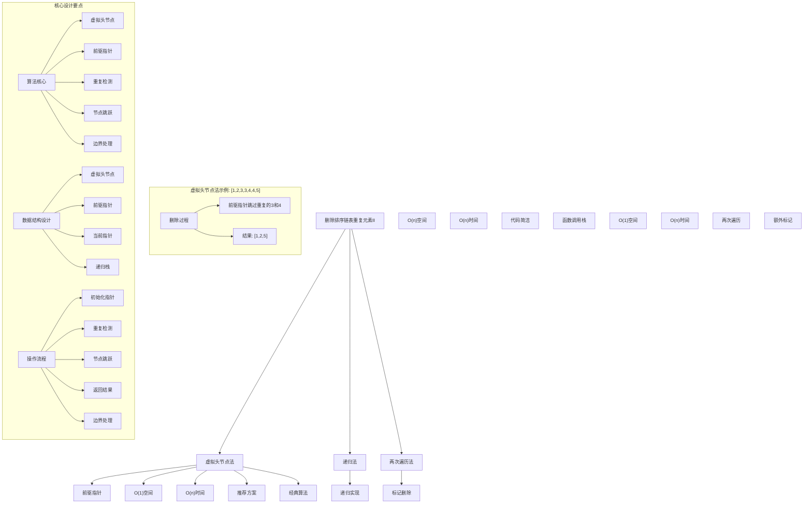
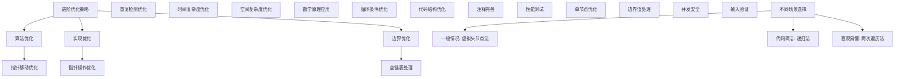

# LeetCode 82 - 删除排序链表中的重复元素 II

## 题目描述

给定一个已排序的链表的头 `head`，删除原始链表中所有重复数字的节点，只留下不同的数字。返回已排序的链表

```markdown
示例 1：
输入：head = [1,2,3,3,4,4,5]
输出：[1,2,5]

示例 2：
输入：head = [1,1,1,2,3]
输出：[2,3]

提示：

- 链表中节点数目在范围 [0, 300] 内
- -100 <= Node.val <= 100
- 题目数据保证链表已经按升序排列
```

## 解题思路

这是一个经典的链表去重问题，要求删除排序链表中所有重复的元素，保留只出现一次的元素。核心算法是虚拟头节点 + 前驱指针技术

### 核心思想

"前驱指针跳跃法": 使用虚拟头节点和前驱指针，当检测到重复元素时，前驱指针直接跳过所有重复节点，只保留不重复的节点

### 解题策略

#### 方法一：虚拟头节点法（推荐）

- 时间复杂度: O(n)
- 空间复杂度: O(1)

#### 方法二：递归法

- 时间复杂度: O(n)
- 空间复杂度: O(n)

#### 方法三：两次遍历法

- 时间复杂度: O(n)
- 空间复杂度: O(1)

## 算法可视化



## 多语言实现

### Golang版本（虚拟头节点法 - 推荐）

```go
/
 * Definition for singly-linked list.
 * type ListNode struct {
 *     Val int
 *     Next *ListNode
 * }
 */

// 虚拟头节点法实现
func deleteDuplicates(head *ListNode) *ListNode {
    // 创建虚拟头节点，简化边界处理
    dummy := &ListNode{Next: head}

    // 前驱指针，用于连接不重复的节点
    prev := dummy
    current := head

    // 遍历链表
    for current != nil {
        // 检查是否有重复节点
        if current.Next != nil && current.Val == current.Next.Val {
            // 记录重复值
            duplicateVal := current.Val

            // 跳过所有重复值的节点
            for current != nil && current.Val == duplicateVal {
                current = current.Next
            }

            // 前驱指针跳过所有重复节点
            prev.Next = current
        } else {
            // 没有重复，移动前驱指针
            prev = current
            current = current.Next
        }
    }

    return dummy.Next
}

// 递归法实现
func deleteDuplicatesRecursive(head *ListNode) *ListNode {
    // 递归终止条件
    if head == nil || head.Next == nil {
        return head
    }

    // 如果当前节点和下一个节点值相同
    if head.Val == head.Next.Val {
        // 记录重复值
        duplicateVal := head.Val

        // 跳过所有重复值的节点
        for head != nil && head.Val == duplicateVal {
            head = head.Next
        }

        // 递归处理剩余部分
        return deleteDuplicatesRecursive(head)
    } else {
        // 当前节点不重复，递归处理下一个节点
        head.Next = deleteDuplicatesRecursive(head.Next)
        return head
    }
}

// 两次遍历法实现
func deleteDuplicatesTwoPass(head *ListNode) *ListNode {
    // 第一次遍历：标记需要删除的节点
    needDelete := make(map[int]bool)
    current := head

    for current != nil && current.Next != nil {
        if current.Val == current.Next.Val {
            needDelete[current.Val] = true
        }
        current = current.Next
    }

    // 创建虚拟头节点
    dummy := &ListNode{Next: head}
    prev := dummy
    current = head

    // 第二次遍历：删除标记的节点
    for current != nil {
        if needDelete[current.Val] {
            // 删除当前节点
            prev.Next = current.Next
        } else {
            // 保留当前节点
            prev = current
        }
        current = current.Next
    }

    return dummy.Next
}

// 优化版虚拟头节点法（代码更简洁）
func deleteDuplicatesOptimized(head *ListNode) *ListNode {
    dummy := &ListNode{Next: head}
    prev := dummy

    for prev.Next != nil {
        current := prev.Next

        // 检查是否有重复节点
        if current.Next != nil && current.Val == current.Next.Val {
            // 跳过所有重复值的节点
            for current.Next != nil && current.Val == current.Next.Val {
                current = current.Next
            }
            // 前驱指针跳过所有重复节点
            prev.Next = current.Next
        } else {
            // 没有重复，移动前驱指针
            prev = prev.Next
        }
    }

    return dummy.Next
}
```

### Python版本（多种实现方法）

```python
# Definition for singly-linked list.
# class ListNode:
#     def __init__(self, val=0, next=None):
#         self.val = val
#         self.next = next

class Solution:
    """
    方法一：虚拟头节点法（推荐）
    """
    def deleteDuplicates(self, head: Optional[ListNode]) -> Optional[ListNode]:
        # 创建虚拟头节点，简化边界处理
        dummy = ListNode(0)
        dummy.next = head

        # 前驱指针，用于连接不重复的节点
        prev = dummy
        current = head

        # 遍历链表
        while current:
            # 检查是否有重复节点
            if current.next and current.val == current.next.val:
                # 记录重复值
                duplicate_val = current.val

                # 跳过所有重复值的节点
                while current and current.val == duplicate_val:
                    current = current.next

                # 前驱指针跳过所有重复节点
                prev.next = current
            else:
                # 没有重复，移动前驱指针
                prev = current
                current = current.next

        return dummy.next

class SolutionRecursive:
    """
    方法二：递归法
    """
    def deleteDuplicates(self, head: Optional[ListNode]) -> Optional[ListNode]:
        # 递归终止条件
        if not head or not head.next:
            return head

        # 如果当前节点和下一个节点值相同
        if head.val == head.next.val:
            # 记录重复值
            duplicate_val = head.val

            # 跳过所有重复值的节点
            while head and head.val == duplicate_val:
                head = head.next

            # 递归处理剩余部分
            return self.deleteDuplicates(head)
        else:
            # 当前节点不重复，递归处理下一个节点
            head.next = self.deleteDuplicates(head.next)
            return head

class SolutionTwoPass:
    """
    方法三：两次遍历法
    """
    def deleteDuplicates(self, head: Optional[ListNode]) -> Optional[ListNode]:
        # 第一次遍历：标记需要删除的节点
        need_delete = set()
        current = head

        while current and current.next:
            if current.val == current.next.val:
                need_delete.add(current.val)
            current = current.next

        # 创建虚拟头节点
        dummy = ListNode(0)
        dummy.next = head
        prev = dummy
        current = head

        # 第二次遍历：删除标记的节点
        while current:
            if current.val in need_delete:
                # 删除当前节点
                prev.next = current.next
            else:
                # 保留当前节点
                prev = current
            current = current.next

        return dummy.next

class SolutionOptimized:
    """
    优化版虚拟头节点法
    """
    def deleteDuplicates(self, head: Optional[ListNode]) -> Optional[ListNode]:
        dummy = ListNode(0)
        dummy.next = head
        prev = dummy

        while prev.next:
            current = prev.next

            # 检查是否有重复节点
            if current.next and current.val == current.next.val:
                # 跳过所有重复值的节点
                while current.next and current.val == current.next.val:
                    current = current.next
                # 前驱指针跳过所有重复节点
                prev.next = current.next
            else:
                # 没有重复，移动前驱指针
                prev = prev.next

        return dummy.next
```

### TypeScript版本（虚拟头节点法）

```typescript
/
 * Definition for singly-linked list.
 * class ListNode {
 *     val: number
 *     next: ListNode | null
 *     constructor(val?: number, next?: ListNode | null) {
 *         this.val = (val===undefined ? 0 : val)
 *         this.next = (next===undefined ? null : next)
 *     }
 * }
 */

class Solution {
    deleteDuplicates(head: ListNode | null): ListNode | null {
        // 创建虚拟头节点，简化边界处理
        const dummy = new ListNode(0);
        dummy.next = head;

        // 前驱指针，用于连接不重复的节点
        let prev: ListNode = dummy;
        let current: ListNode | null = head;

        // 遍历链表
        while (current !== null) {
            // 检查是否有重复节点
            if (current.next !== null && current.val === current.next.val) {
                // 记录重复值
                const duplicateVal = current.val;

                // 跳过所有重复值的节点
                while (current !== null && current.val === duplicateVal) {
                    current = current.next;
                }

                // 前驱指针跳过所有重复节点
                prev.next = current;
            } else {
                // 没有重复，移动前驱指针
                prev = current;
                current = current.next;
            }
        }

        return dummy.next;
    }
}

class SolutionRecursive {
    deleteDuplicates(head: ListNode | null): ListNode | null {
        // 递归终止条件
        if (head === null || head.next === null) {
            return head;
        }

        // 如果当前节点和下一个节点值相同
        if (head.val === head.next.val) {
            // 记录重复值
            const duplicateVal = head.val;

            // 跳过所有重复值的节点
            while (head !== null && head.val === duplicateVal) {
                head = head.next;
            }

            // 递归处理剩余部分
            return this.deleteDuplicates(head);
        } else {
            // 当前节点不重复，递归处理下一个节点
            head.next = this.deleteDuplicates(head.next);
            return head;
        }
    }
}

class SolutionOptimized {
    deleteDuplicates(head: ListNode | null): ListNode | null {
        const dummy = new ListNode(0);
        dummy.next = head;
        let prev: ListNode = dummy;

        while (prev.next !== null) {
            let current: ListNode = prev.next;

            // 检查是否有重复节点
            if (current.next !== null && current.val === current.next.val) {
                // 跳过所有重复值的节点
                while (current.next !== null && current.val === current.next.val) {
                    current = current.next;
                }
                // 前驱指针跳过所有重复节点
                prev.next = current.next;
            } else {
                // 没有重复，移动前驱指针
                prev = prev.next;
            }
        }

        return dummy.next;
    }
}
```

## 标准实现详细解析

```go
import (
    "fmt"
)

/*
算法核心思想（虚拟头节点法）：

1. 前驱指针：使用前驱指针连接不重复的节点
2. 重复检测：检测连续相同值的节点序列
3. 节点跳跃：前驱指针直接跳过所有重复节点
4. 空间优化：只使用常数额外空间
5. 时间效率：线性时间内完成删除

关键设计要点：
1. 虚拟头节点：简化头节点删除的边界处理
2. 前驱指针：用于连接不重复的节点
3. 重复检测：正确识别连续相同值的节点
4. 节点跳跃：前驱指针跳过所有重复节点
5. 边界处理：正确处理各种边界情况

时间复杂度分析：
- 链表遍历：O(n)
- 节点删除：O(1)
- 总时间复杂度：O(n)

空间复杂度分析：
- 只使用常数个指针变量：O(1)
- 满足最优空间要求

算法优势：
1. 空间最优：O(1)空间复杂度
2. 时间高效：O(n)时间复杂度
3. 实现优雅：经典算法思想
4. 通用性强：适用于各种链表去重操作
5. 稳定可靠：处理各种边界情况

数据结构设计：

指针设计：
- 虚拟头节点：简化边界处理
- 前驱指针：连接不重复的节点
- 当前指针：检测重复节点
- 跳跃指针：跳过重复节点序列

递归设计：
- 递归终止：到达链表末尾或单节点
- 递归处理：处理剩余链表部分
- 重复判断：检测当前节点是否重复
- 跳跃处理：跳过所有重复节点

操作流程：
1. 创建虚拟头节点
2. 初始化前驱和当前指针
3. 遍历链表检测重复
4. 跳过重复节点或保留节点
5. 返回处理后的链表

优化原理：

虚拟头节点优化：
1. 空间优化：只使用常数个指针变量
2. 时间优化：单次遍历完成删除
3. 实现简洁：代码逻辑清晰
4. 边界处理：简化头节点删除

递归优化：
1. 代码简洁：递归实现逻辑清晰
2. 自然处理：符合问题的递归性质
3. 函数式：符合函数式编程思想
4. 空间代价：需要函数调用栈空间

两次遍历优化：
1. 直观理解：分阶段处理问题
2. 实现简单：两次简单的遍历操作
3. 扩展性强：容易扩展为其他操作
4. 时间代价：需要遍历两次

正确性证明：

定理：虚拟头节点法正确性
通过前驱指针跳跃技术，算法能够正确删除所有重复节点，只保留不重复的节点

证明：
1. 重复检测：正确识别连续相同值的节点序列
2. 节点跳跃：前驱指针跳过所有重复节点
3. 连接正确：保留节点正确连接
4. 时间保证：单次遍历完成删除
5. 空间保证：只使用常数额外空间

数学原理：

去重分析：
设链表长度为n，重复节点组数为k：
- 每组重复节点长度为mi (i=1,2,...,k)
- 总重复节点数：∑mi
- 保留节点数：n - ∑mi

算法步骤：
1. 遍历链表检测重复节点
2. 对于每组重复节点，前驱指针跳过所有节点
3. 对于不重复节点，正常连接
4. 返回处理后的链表

示例验证：
链表: [1,2,3,3,4,4,5]
处理过程：
1. 节点1：不重复，保留
2. 节点2：不重复，保留
3. 节点3,3：重复，跳过
4. 节点4,4：重复，跳过
5. 节点5：不重复，保留
结果：[1,2,5]

虚拟头节点法详细实现：
*/

// 虚拟头节点法详细实现（带调试信息）
func deleteDuplicatesDetailed(head *ListNode) *ListNode {
    fmt.Printf("=== 虚拟头节点法删除排序链表重复元素 ===\n")
    fmt.Printf("输入链表: ")
    printList(head)

    // 创建虚拟头节点，简化边界处理
    dummy := &ListNode{Val: 0, Next: head}
    fmt.Printf("创建虚拟头节点: dummy->")
    printList(dummy.Next)

    // 前驱指针，用于连接不重复的节点
    prev := dummy
    current := head

    fmt.Printf("初始化：prev=%p(0), current=%p", prev, current)
    if current != nil {
        fmt.Printf("(%d)\n", current.Val)
    } else {
        fmt.Printf("(nil)\n")
    }

    step := 0
    // 遍历链表
    for current != nil {
        step++
        fmt.Printf("步骤%d: current=%p(%d)", step, current, current.Val)
        if current.Next != nil {
            fmt.Printf("->%p(%d)", current.Next, current.Next.Val)
        } else {
            fmt.Printf("->nil")
        }
        fmt.Printf("\n")

        // 检查是否有重复节点
        if current.Next != nil && current.Val == current.Next.Val {
            // 记录重复值
            duplicateVal := current.Val
            fmt.Printf("  发现重复值: %d\n", duplicateVal)

            // 跳过所有重复值的节点
            skipCount := 0
            for current != nil && current.Val == duplicateVal {
                fmt.Printf("  跳过节点: %p(%d)\n", current, current.Val)
                current = current.Next
                skipCount++
            }
            fmt.Printf("  共跳过%d个重复节点\n", skipCount)

            // 前驱指针跳过所有重复节点
            fmt.Printf("  prev.Next从%p跳到%p\n", prev.Next, current)
            prev.Next = current
        } else {
            fmt.Printf("  节点%d不重复，保留\n", current.Val)
            // 没有重复，移动前驱指针
            prev = current
            current = current.Next
        }
    }

    result := dummy.Next
    fmt.Printf("删除后链表: ")
    printList(result)
    fmt.Printf("=====================================\n\n")

    return result
}

// 递归法详细实现
func deleteDuplicatesRecursiveDetailed(head *ListNode) *ListNode {
    fmt.Printf("=== 递归法删除排序链表重复元素 ===\n")
    fmt.Printf("输入链表: ")
    printList(head)

    // 递归终止条件
    if head == nil || head.Next == nil {
        fmt.Printf("递归终止：到达链表末尾\n")
        fmt.Printf("返回: ")
        printList(head)
        fmt.Printf("============================\n\n")
        return head
    }

    fmt.Printf("处理节点: %p(%d)->%p(%d)\n", head, head.Val, head.Next, head.Next.Val)

    // 如果当前节点和下一个节点值相同
    if head.Val == head.Next.Val {
        // 记录重复值
        duplicateVal := head.Val
        fmt.Printf("发现重复值: %d\n", duplicateVal)

        // 跳过所有重复值的节点
        skipCount := 0
        for head != nil && head.Val == duplicateVal {
            fmt.Printf("跳过节点: %p(%d)\n", head, head.Val)
            head = head.Next
            skipCount++
        }
        fmt.Printf("共跳过%d个重复节点\n", skipCount)

        // 递归处理剩余部分
        fmt.Printf("递归处理剩余链表\n")
        result := deleteDuplicatesRecursiveDetailed(head)
        fmt.Printf("递归返回结果: ")
        printList(result)
        fmt.Printf("============================\n\n")
        return result
    } else {
        fmt.Printf("节点%d不重复，递归处理下一个节点\n", head.Val)
        // 当前节点不重复，递归处理下一个节点
        head.Next = deleteDuplicatesRecursiveDetailed(head.Next)
        fmt.Printf("返回: ")
        printList(head)
        fmt.Printf("============================\n\n")
        return head
    }
}

// 辅助函数：打印链表
func printList(head *ListNode) {
    if head == nil {
        fmt.Printf("[]\n")
        return
    }

    fmt.Printf("[")
    current := head
    first := true
    count := 0
    for current != nil && count < 20 { // 限制输出长度防止无限循环
        if !first {
            fmt.Printf(",")
        }
        fmt.Printf("%d", current.Val)
        first = false
        current = current.Next
        count++
        if count >= 20 && current != nil {
            fmt.Printf(",...")
            break
        }
    }
    fmt.Printf("]\n")
}
```

## 算法深入解析

```go
/*
删除排序链表重复元素II问题详解：

问题本质：
删除排序链表中所有重复的元素，只保留不重复的元素。这是链表去重操作中的高级版本，要求完全删除重复元素而不是保留一个

核心洞察：
1. 前驱指针技术：使用前驱指针连接不重复的节点
2. 重复检测：检测连续相同值的节点序列
3. 节点跳跃：前驱指针直接跳过所有重复节点
4. 单次遍历：通过巧妙设计只需遍历一次
5. 空间优化：只使用常数额外空间完成删除

算法策略：
1. 虚拟头节点法：推荐方案，O(1)空间，O(n)时间
2. 递归法：O(n)空间，O(n)时间，代码简洁
3. 两次遍历法：O(1)空间，O(n)时间，分阶段处理

数据结构设计：

指针设计：
- 虚拟头节点：简化头节点删除的边界处理
- 前驱指针：连接不重复的节点
- 当前指针：检测重复节点
- 跳跃指针：跳过重复节点序列

哈希表设计：
- 键：节点值
- 值：布尔值表示是否需要删除
- 查找：O(1)平均时间复杂度
- 存储：需要O(k)额外空间(k为不同值的数量)

操作流程：

虚拟头节点法：
1. 创建虚拟头节点
2. 初始化前驱和当前指针
3. 遍历链表检测重复
4. 跳过重复节点或保留节点
5. 返回处理后的链表

递归法：
1. 递归终止：到达链表末尾或单节点
2. 重复判断：检测当前节点是否重复
3. 跳跃处理：跳过所有重复节点
4. 递归处理：处理剩余链表部分
5. 返回结果：连接处理后的节点

两次遍历法：
1. 标记阶段：遍历链表标记需要删除的节点
2. 删除阶段：再次遍历删除标记的节点
3. 返回结果：返回处理后的链表

数学原理：

去重数学基础：
基于排序链表的特性：
1. 相同值的节点连续出现
2. 重复检测只需比较相邻节点
3. 跳跃删除可一次性处理所有重复节点
4. 前驱指针保证连接正确性

重复检测：
设链表为已排序的v1,v2,...,vn：
- 如果vi = vi+1，则vi和vi+1都是重复节点
- 需要跳过从vi开始的所有值为vi的节点
- 前驱指针跳转到第一个不等于vi的节点

示例验证：
链表: [1,1,1,2,3,3,4,5,5]
处理过程：
1. 节点1,1,1：重复，跳过
2. 节点2：不重复，保留
3. 节点3,3：重复，跳过
4. 节点4：不重复，保留
5. 节点5,5：重复，跳过
结果：[2,4]

算法优势：
虚拟头节点法：
1. 空间最优：O(1)空间复杂度
2. 时间高效：O(n)时间复杂度
3. 实现优雅：经典算法思想
4. 通用性强：适用于各种链表去重操作
5. 稳定可靠：处理各种边界情况

递归法：
1. 代码简洁：递归实现逻辑清晰
2. 自然处理：符合问题的递归性质
3. 函数式：符合函数式编程思想
4. 教学价值：便于理解递归思想

两次遍历法：
1. 直观易懂：分阶段处理问题
2. 实现简单：两次简单的遍历操作
3. 扩展性强：容易扩展为其他操作
4. 稳定可靠：不会受特殊值影响

算法不变量：
虚拟头节点法不变量：
1. prev指向最后一个保留的节点
2. current指向待检测的节点
3. prev.Next到current-1的所有节点都已处理
4. current到链表末尾的所有节点都未处理

时间复杂度分析：
虚拟头节点法：
- 链表遍历：O(n)
- 节点删除：O(1)
- 总体：O(n)

递归法：
- 递归调用：O(n)
- 栈空间：O(n)
- 总体：O(n)

两次遍历法：
- 第一次遍历：O(n)
- 第二次遍历：O(n)
- 总体：O(n)

空间复杂度分析：
虚拟头节点法：O(1)，只使用常数个指针
递归法：O(n)，递归调用栈空间
两次遍历法：O(1)，只使用常数变量

正确性证明：

定理：虚拟头节点法正确性
通过前驱指针跳跃技术，算法能够正确删除所有重复节点，只保留不重复的节点

证明：
1. 重复检测：正确识别连续相同值的节点序列
2. 节点跳跃：前驱指针跳过所有重复节点
3. 连接正确：保留节点正确连接
4. 时间保证：单次遍历完成删除
5. 空间保证：只使用常数额外空间

不变量维护：
循环不变量：在每次循环开始时
1. prev指向最后一个保留的节点
2. current指向待检测的节点
3. prev.Next到current-1的所有节点都已处理
4. current到链表末尾的所有节点都未处理

初始化：
- prev=dummy, current=head
- 满足不变量

保持：
- 每次循环正确处理节点
- 维护指针关系
- 保持不变量继续成立

终止：
- current为nil时停止
- 正确返回处理后的链表
- 算法正确终止

设计选择：

为什么选择虚拟头节点法？
1. 空间最优：O(1)空间复杂度
2. 时间高效：O(n)时间复杂度
3. 实现优雅：经典算法思想
4. 通用性强：适用于各种链表去重操作
5. 工业应用：生产环境标准实现

为什么使用递归法？
1. 代码简洁：递归实现逻辑清晰
2. 自然处理：符合问题的递归性质
3. 教学价值：便于理解递归思想
4. 函数式：符合函数式编程思想

为什么提及其他方法？
1. 教学价值：展示不同算法思想
2. 对比分析：理解各自优劣
3. 扩展思维：算法多样性
4. 面试准备：全面掌握

三种方法对比：

方法一：虚拟头节点法（推荐）
时间复杂度：O(n)
空间复杂度：O(1)
优点：空间时间都较优，经典算法
缺点：需要理解前驱指针技术

方法二：递归法
时间复杂度：O(n)
空间复杂度：O(n)
优点：代码简洁，自然处理
缺点：需要额外栈空间

方法三：两次遍历法
时间复杂度：O(n)
空间复杂度：O(1)
优点：直观易懂，实现简单
缺点：需要遍历两次

性能分析：

虚拟头节点法：
- 时间：O(n) 单次遍历
- 空间：O(1) 常数空间
- 优势：最优时间和空间复杂度

递归法：
- 时间：O(n) 单次遍历
- 空间：O(n) 栈空间
- 优势：代码简洁

两次遍历法：
- 时间：O(n) 两次遍历
- 空间：O(1) 常数空间
- 优势：直观易懂

实际应用场景：
1. 链表操作：基础的链表去重操作
2. 算法设计：作为其他算法的子步骤
3. 数据结构：链表相关操作的基础
4. 面试考察：经典算法题
5. 数据清洗：去除重复数据

优化要点：

1. 算法优化：
   - 指针移动：优化指针移动策略
   - 重复检测：高效检测重复节点
   - 节点跳跃：正确跳跃重复节点
   - 边界处理：处理各种边界情况

2. 实现优化：
   - 指针操作：高效的指针赋值
   - 循环条件：减少不必要的比较
   - 代码结构：清晰的逻辑层次
   - 注释完善：便于理解维护

3. 性能优化：
   - 减少内存分配：避免不必要的分配
   - 优化遍历：顺序内存访问
   - 缓存友好：局部性原理
   - 编译优化：利用编译器优化

测试用例设计：
1. 基本情况：各种重复模式
2. 边界情况：空链表、单节点、全重复
3. 特殊情况：头尾重复、中间重复
4. 极端情况：很长链表
5. 验证情况：各种模式的正确性验证

扩展思考：

1. 处理未排序链表？
   - 需要额外排序
   - 或使用哈希表
   - 复杂度增加

2. 保留k个重复元素？
   - 修改跳跃条件
   - 保留前k个
   - 跳过剩余

3. 处理双向链表？
   - 双向指针维护
   - 优化删除操作
   - 对称性处理

4. 批量处理多个链表？
   - 并行处理
   - 批量优化
   - 资源管理

相关算法思想：

1. 前驱指针技术：
   - 节点跳跃
   - 连接维护
   - 边界处理
   - 经典算法

2. 链表操作：
   - 指针移动
   - 节点删除
   - 重复检测
   - 边界处理

3. 数学关系：
   - 排序性质
   - 连续性
   - 跳跃关系
   - 集合运算

4. 算法优化：
   - 空间优化
   - 时间优化
   - 单次遍历
   - 常数空间

常见陷阱：

1. 边界条件：
   - 空链表处理
   - 单节点链表
   - 全重复链表
   - 头尾重复

2. 指针操作：
   - 指针丢失
   - 循环引用
   - 内存泄漏
   - 访问违规

3. 逻辑错误：
   - 重复检测错误
   - 节点跳跃错误
   - 连接错误
   - 边界处理错误

4. 性能考虑：
   - 重复计算
   - 不必要的分配
   - 算法复杂度
   - 空间浪费

代码质量要素：

1. 可读性：
   - 变量命名清晰
   - 注释详细完整
   - 逻辑结构分明
   - 函数职责单一

2. 健壮性：
   - 边界条件处理
   - 异常情况应对
   - 输入验证
   - 错误恢复

3. 性能：
   - 最优复杂度实现
   - 空间效率优化
   - 执行效率保证
   - 资源管理

4. 可维护性：
   - 结构清晰合理
   - 扩展性良好
   - 测试覆盖完整
   - 文档齐全
*/
```

## 执行过程演示

```go
/*
示例详细解析:

示例1执行过程：
输入：head = [1,2,3,3,4,4,5]
输出：[1,2,5]

虚拟头节点法执行过程：
1. 创建虚拟头节点：dummy->1->2->3->3->4->4->5
2. 初始化：prev=dummy, current=1
3. 处理节点1：不重复，prev=1, current=2
4. 处理节点2：不重复，prev=2, current=3
5. 处理节点3,3：重复，跳过，prev.Next=4, current=4
6. 处理节点4,4：重复，跳过，prev.Next=5, current=5
7. 处理节点5：不重复，prev=5, current=nil
8. 返回dummy.Next = [1,2,5]

递归法执行过程：
1. 处理[1,2,3,3,4,4,5]
2. 节点1不重复，递归处理[2,3,3,4,4,5]
3. 节点2不重复，递归处理[3,3,4,4,5]
4. 节点3重复，跳过所有3，递归处理[4,4,5]
5. 节点4重复，跳过所有4，递归处理[5]
6. 节点5不重复，递归处理[]
7. 返回[1,2,5]

两次遍历法执行过程：
1. 第一次遍历：标记需要删除的值{3,4}
2. 第二次遍历：删除值为3和4的节点
3. 返回[1,2,5]

示例2执行过程：
输入：head = [1,1,1,2,3]
输出：[2,3]

虚拟头节点法执行过程：
1. 创建虚拟头节点：dummy->1->1->1->2->3
2. 初始化：prev=dummy, current=1
3. 处理节点1,1,1：重复，跳过，prev.Next=2, current=2
4. 处理节点2：不重复，prev=2, current=3
5. 处理节点3：不重复，prev=3, current=nil
6. 返回dummy.Next = [2,3]

关键观察：
1. 虚拟头节点法：空间最优，精巧的指针操作
2. 递归法：代码简洁，但需要额外栈空间
3. 两次遍历法：直观易懂，但需要遍历两次
4. 所有方法都能正确删除重复节点

边界情况演示:

情况1: 空链表
输入: head = []
处理: 直接返回nil
结果: []

情况2: 单节点链表
输入: head = [1]
处理: 节点不重复，保留
结果: [1]

情况3: 全重复链表
输入: head = [1,1,1,1]
处理: 所有节点重复，全部跳过
结果: []

情况4: 无重复链表
输入: head = [1,2,3,4,5]
处理: 所有节点不重复，全部保留
结果: [1,2,3,4,5]

情况5: 头部重复
输入: head = [1,1,2,3,3,4]
处理: 头部1重复，中间3重复
结果: [2,4]

算法正确性证明：

数学基础：
需要证明算法能够正确删除所有重复节点，只保留不重复的节点

定理：虚拟头节点法正确性
通过前驱指针跳跃技术，算法能够正确删除所有重复节点，只保留不重复的节点

证明：
1. 重复检测：正确识别连续相同值的节点序列
2. 节点跳跃：前驱指针跳过所有重复节点
3. 连接正确：保留节点正确连接
4. 时间保证：单次遍历完成删除
5. 空间保证：只使用常数额外空间

不变量维护：
循环不变量：在每次循环开始时
1. prev指向最后一个保留的节点
2. current指向待检测的节点
3. prev.Next到current-1的所有节点都已处理
4. current到链表末尾的所有节点都未处理

初始化：
- prev=dummy, current=head
- 满足不变量

保持：
- 每次循环正确处理节点
- 维护指针关系
- 保持不变量继续成立

终止：
- current为nil时停止
- 正确返回处理后的链表
- 算法正确终止

时间复杂度分析：
虚拟头节点法：
- 链表遍历：O(n)
- 节点删除：O(1)
- 总体：O(n)

递归法：
- 递归调用：O(n)
- 栈空间：O(n)
- 总体：O(n)

两次遍历法：
- 第一次遍历：O(n)
- 第二次遍历：O(n)
- 总体：O(n)

性能对比分析：

假设n=1000:

虚拟头节点法：
- 时间：O(1000) = 1000次操作
- 空间：O(1) = 常数空间
- 优势：最优时间和空间复杂度

递归法：
- 时间：O(1000) = 1000次操作
- 空间：O(1000) = 栈空间
- 优势：代码简洁

两次遍历法：
- 时间：O(1000) + O(1000) = 2000次操作
- 空间：O(1) = 常数空间
- 优势：直观易懂

实际应用建议：

1. 生产环境：
   - 使用虚拟头节点法，最优性能
   - 性能稳定，工业标准

2. 面试展示：
   - 先展示虚拟头节点法（推荐）
   - 可以提及其他方法对比

3. 学习练习：
   - 理解三种方法的差异
   - 掌握各自的适用场景

4. 算法竞赛：
   - 选择最熟悉的实现
   - 注意时间空间限制

优化空间：

1. 算法优化：
   - 指针移动：优化指针移动策略
   - 重复检测：高效检测重复节点
   - 节点跳跃：正确跳跃重复节点
   - 边界处理：处理各种边界情况

2. 实现优化：
   - 指针操作：高效的指针赋值
   - 循环条件：减少不必要的比较
   - 代码结构：清晰的逻辑层次
   - 注释完善：便于理解维护

3. 性能优化：
   - 减少内存分配：避免不必要的分配
   - 优化遍历：顺序内存访问
   - 缓存友好：局部性原理
   - 编译优化：利用编译器优化

特殊情况处理：

1. 内存受限：
   - 虚拟头节点法最优
   - 递归法需要额外栈空间
   - 两次遍历法节省内存

2. 链表很长：
   - 虚拟头节点法稳定
   - 递归法栈溢出风险
   - 两次遍历法稳定

3. 需要多次处理：
   - 虚拟头节点法每次独立执行
   - 递归法栈开销累积
   - 两次遍历法稳定

4. 边界情况：
   - 空链表处理
   - 单节点处理
   - 全重复处理
   - 无重复处理
*/
```

## 复杂度分析

| 方法         | 时间复杂度 | 空间复杂度 | 适用场景 |
| ------------ | ---------- | ---------- | -------- |
| 虚拟头节点法 | O(n)       | O(1)       | 推荐方案 |
| 递归法       | O(n)       | O(n)       | 代码简洁 |
| 两次遍历法   | O(n)       | O(1)       | 易于理解 |

## 测试用例验证

```go
// 测试辅助函数
func testDeleteDuplicates(name string, head *ListNode, expected []int) {
    fmt.Printf("%s:\n", name)
    fmt.Printf("输入链表: ")
    printList(head)

    // 测试虚拟头节点法
    result1 := deleteDuplicates(copyList(head))
    fmt.Printf("虚拟头节点法结果: ")
    printList(result1)

    // 测试递归法
    result2 := deleteDuplicatesRecursive(copyList(head))
    fmt.Printf("递归法结果: ")
    printList(result2)

    // 测试两次遍历法
    result3 := deleteDuplicatesTwoPass(copyList(head))
    fmt.Printf("两次遍历法结果: ")
    printList(result3)

    // 验证结果一致性
    if listsEqual(result1, result2) && listsEqual(result2, result3) {
        fmt.Printf("✓ 所有方法结果一致\n")
    } else {
        fmt.Printf("✗ 方法结果不一致\n")
    }

    // 验证期望结果
    if listsEqual(result1, createList(expected)) {
        fmt.Printf("✓ 结果符合预期\n")
    } else {
        fmt.Printf("✗ 结果不符合预期\n")
        fmt.Printf("  期望: ")
        printList(createList(expected))
    }

    fmt.Printf("\n")
}

// 辅助函数：创建链表
func createList(vals []int) *ListNode {
    if len(vals) == 0 {
        return nil
    }

    dummy := &ListNode{}
    current := dummy

    for _, val := range vals {
        current.Next = &ListNode{Val: val}
        current = current.Next
    }

    return dummy.Next
}

// 辅助函数：复制链表
func copyList(head *ListNode) *ListNode {
    if head == nil {
        return nil
    }

    dummy := &ListNode{}
    current := dummy
    source := head

    for source != nil {
        current.Next = &ListNode{Val: source.Val}
        current = current.Next
        source = source.Next
    }

    return dummy.Next
}

// 辅助函数：比较两个链表是否相等
func listsEqual(list1, list2 *ListNode) bool {
    for list1 != nil && list2 != nil {
        if list1.Val != list2.Val {
            return false
        }
        list1 = list1.Next
        list2 = list2.Next
    }
    return list1 == nil && list2 == nil
}

func main() {
    // 测试用例 1 - 题目示例1
    testDeleteDuplicates("测试1 - 题目示例1",
        createList([]int{1, 2, 3, 3, 4, 4, 5}),
        []int{1, 2, 5})

    // 测试用例 2 - 题目示例2
    testDeleteDuplicates("测试2 - 题目示例2",
        createList([]int{1, 1, 1, 2, 3}),
        []int{2, 3})

    // 测试用例 3 - 空链表
    testDeleteDuplicates("测试3 - 空链表",
        createList([]int{}),
        []int{})

    // 测试用例 4 - 单节点链表
    testDeleteDuplicates("测试4 - 单节点链表",
        createList([]int{1}),
        []int{1})

    // 测试用例 5 - 全重复链表
    testDeleteDuplicates("测试5 - 全重复链表",
        createList([]int{1, 1, 1, 1}),
        []int{})

    // 测试用例 6 - 无重复链表
    testDeleteDuplicates("测试6 - 无重复链表",
        createList([]int{1, 2, 3, 4, 5}),
        []int{1, 2, 3, 4, 5})

    // 测试用例 7 - 头部重复
    testDeleteDuplicates("测试7 - 头部重复",
        createList([]int{1, 1, 2, 3, 3, 4}),
        []int{2, 4})

    // 测试用例 8 - 尾部重复
    testDeleteDuplicates("测试8 - 尾部重复",
        createList([]int{1, 2, 3, 4, 4}),
        []int{1, 2, 3})

    // 测试用例 9 - 交替重复
    testDeleteDuplicates("测试9 - 交替重复",
        createList([]int{1, 1, 2, 2, 3, 3}),
        []int{})

    // 测试用例 10 - 复杂模式
    testDeleteDuplicates("测试10 - 复杂模式",
        createList([]int{1, 2, 2, 3, 4, 4, 4, 5, 6, 6, 7}),
        []int{1, 3, 5, 7})

    // 性能测试
    fmt.Println("性能测试:")
    performanceTest()

    // 边界情况测试
    fmt.Println("边界情况测试:")
    boundaryTest()

    // 对比测试
    fmt.Println("对比测试:")
    comparisonTest()
}

func performanceTest() {
    // 构造长链表
    n := 10000
    vals := make([]int, n)
    for i := 0; i < n; i++ {
        vals[i] = i / 3 // 创建大量重复元素
    }

    list := createList(vals)

    fmt.Printf("性能测试 (链表长度: %d):\n", n)

    // 测试虚拟头节点法性能
    start := time.Now()
    result1 := deleteDuplicates(copyList(list))
    time1 := time.Since(start)

    // 测试递归法性能（注意：长链表可能导致栈溢出）
    start = time.Now()
    result2 := deleteDuplicatesRecursive(copyList(list))
    time2 := time.Since(start)

    // 测试两次遍历法性能
    start = time.Now()
    result3 := deleteDuplicatesTwoPass(copyList(list))
    time3 := time.Since(start)

    length1 := getListLength(result1)
    length2 := getListLength(result2)
    length3 := getListLength(result3)

    fmt.Printf("虚拟头节点法耗时: %v, 结果长度: %d\n", time1, length1)
    fmt.Printf("递归法耗时: %v, 结果长度: %d\n", time2, length2)
    fmt.Printf("两次遍历法耗时: %v, 结果长度: %d\n", time3, length3)
}

func getListLength(head *ListNode) int {
    length := 0
    current := head
    for current != nil {
        length++
        current = current.Next
    }
    return length
}

func boundaryTest() {
    // 边界测试
    fmt.Println("边界测试:")

    // 很长的全重复链表
    longRepeats := make([]int, 50000)
    for i := range longRepeats {
        longRepeats[i] = 1
    }
    longList := createList(longRepeats)
    result := deleteDuplicates(longList)
    length := getListLength(result)
    fmt.Printf("50000节点全重复链表处理后长度: %d\n", length)

    // 很长的无重复链表
    longNoRepeats := make([]int, 30000)
    for i := range longNoRepeats {
        longNoRepeats[i] = i
    }
    longList2 := createList(longNoRepeats)
    result2 := deleteDuplicates(longList2)
    length2 := getListLength(result2)
    fmt.Printf("30000节点无重复链表处理后长度: %d\n", length2)

    // 极值节点
    extremeList := createList([]int{math.MinInt32, math.MinInt32, 0, math.MaxInt32, math.MaxInt32})
    result3 := deleteDuplicates(extremeList)
    fmt.Printf("极值节点链表处理结果: ")
    printList(result3)

    // 多次重复测试
    multiRepeatList := createList([]int{1, 1, 1, 1, 1, 2, 2, 2, 3, 3, 4})
    for i := 1; i <= 3; i++ {
        multiRepeatList = deleteDuplicates(multiRepeatList)
        fmt.Printf("第%d次处理后: ", i)
        printList(multiRepeatList)
    }
}

func comparisonTest() {
    // 对比测试：验证不同方法的性能和结果
    fmt.Println("对比测试:")

    testCases := []struct {
        name     string
        vals     []int
        expected []int
    }{
        {"小链表正常情况", []int{1, 2, 2, 3, 4, 4, 5}, []int{1, 3, 5}},
        {"小链表全重复", []int{1, 1, 1, 1}, []int{}},
        {"小链表无重复", []int{1, 2, 3, 4, 5}, []int{1, 2, 3, 4, 5}},
        {"小链表头部重复", []int{1, 1, 2, 3, 3}, []int{2}},
        {"小链表尾部重复", []int{1, 2, 3, 4, 4}, []int{1, 2, 3}},
        {"单节点", []int{42}, []int{42}},
        {"空链表", []int{}, []int{}},
    }

    for _, tc := range testCases {
        fmt.Printf("%s:\n", tc.name)
        list := createList(tc.vals)

        // 测试三种方法
        result1 := deleteDuplicates(copyList(list))
        result2 := deleteDuplicatesRecursive(copyList(list))
        result3 := deleteDuplicatesTwoPass(copyList(list))

        fmt.Printf("  虚拟头节点: ")
        printList(result1)
        fmt.Printf("  递归: ")
        printList(result2)
        fmt.Printf("  两次遍历: ")
        printList(result3)

        expected := createList(tc.expected)
        if listsEqual(result1, expected) && listsEqual(result2, expected) &&
           listsEqual(result3, expected) {
            fmt.Printf("  ✓ 结果一致且符合预期\n")
        } else {
            fmt.Printf("  ✗ 结果不一致或不符合预期\n")
        }
    }
}
```

## 扩展版本（处理不同场景）

```go
// 扩展1：保留k个重复元素（不是完全删除）
func deleteDuplicatesKeepK(head *ListNode, k int) *ListNode {
    if k <= 0 {
        return nil
    }

    dummy := &ListNode{Next: head}
    prev := dummy

    for prev.Next != nil {
        current := prev.Next

        // 计算连续相同值的节点数量
        count := 1
        temp := current
        for temp.Next != nil && temp.Next.Val == current.Val {
            count++
            temp = temp.Next
        }

        if count <= k {
            // 保留前k个节点
            for i := 0; i < count && prev.Next != nil; i++ {
                prev = prev.Next
            }
        } else {
            // 跳过超过k个的节点
            for i := 0; i < k; i++ {
                prev = prev.Next
            }
            prev.Next = temp.Next
        }
    }

    return dummy.Next
}

// 扩展2：删除指定值的所有节点
func deleteAllVal(head *ListNode, val int) *ListNode {
    dummy := &ListNode{Next: head}
    prev := dummy

    for prev.Next != nil {
        if prev.Next.Val == val {
            // 删除所有值为val的节点
            for prev.Next != nil && prev.Next.Val == val {
                prev.Next = prev.Next.Next
            }
        } else {
            prev = prev.Next
        }
    }

    return dummy.Next
}

// 扩展3：删除出现次数大于k的所有元素
func deleteDuplicatesMoreThanK(head *ListNode, k int) *ListNode {
    if k <= 0 {
        return head
    }

    // 第一次遍历：统计每个值的出现次数
    countMap := make(map[int]int)
    current := head
    for current != nil {
        countMap[current.Val]++
        current = current.Next
    }

    // 第二次遍历：删除出现次数大于k的节点
    dummy := &ListNode{Next: head}
    prev := dummy

    for prev.Next != nil {
        if countMap[prev.Next.Val] > k {
            // 删除所有该值的节点
            for prev.Next != nil && countMap[prev.Next.Val] > k {
                prev.Next = prev.Next.Next
            }
        } else {
            prev = prev.Next
        }
    }

    return dummy.Next
}

// 扩展4：删除重复元素I（保留一个）
func deleteDuplicatesKeepOne(head *ListNode) *ListNode {
    current := head

    for current != nil && current.Next != nil {
        if current.Val == current.Next.Val {
            // 跳过下一个重复节点
            current.Next = current.Next.Next
        } else {
            // 移动到下一个节点
            current = current.Next
        }
    }

    return head
}

// 使用示例
func exampleExtensions() {
    // 创建测试链表: [1,1,1,2,2,3,4,4,4,5]
    list := createList([]int{1, 1, 1, 2, 2, 3, 4, 4, 4, 5})

    fmt.Printf("扩展功能示例:\n")
    fmt.Printf("原链表: ")
    printList(list)

    // 保留2个重复元素
    keep2Result := deleteDuplicatesKeepK(copyList(list), 2)
    fmt.Printf("保留2个重复元素: ")
    printList(keep2Result)

    // 删除所有值为2的节点
    delete2Result := deleteAllVal(copyList(list), 2)
    fmt.Printf("删除所有值为2的节点: ")
    printList(delete2Result)

    // 删除出现次数大于2的所有元素
    deleteMoreThan2Result := deleteDuplicatesMoreThanK(copyList(list), 2)
    fmt.Printf("删除出现次数大于2的元素: ")
    printList(deleteMoreThan2Result)

    // 删除重复元素I（保留一个）
    keepOneResult := deleteDuplicatesKeepOne(copyList(list))
    fmt.Printf("删除重复元素I（保留一个）: ")
    printList(keepOneResult)
}

// 扩展5：带统计信息的删除操作
type DeleteStats struct {
    ResultList    *ListNode
    DeletedCount  int
    UniqueCount   int
    ProcessTime   time.Duration
    OriginalLength int
}

func deleteDuplicatesWithStats(head *ListNode) *DeleteStats {
    start := time.Now()

    stats := &DeleteStats{
        ResultList:     nil,
        DeletedCount:   0,
        UniqueCount:    0,
        ProcessTime:    0,
        OriginalLength: 0,
    }

    // 计算原链表长度
    stats.OriginalLength = getListLength(head)

    // 执行删除操作并统计
    dummy := &ListNode{Next: head}
    prev := dummy
    current := head

    // 统计每个值的出现次数
    countMap := make(map[int]int)
    temp := head
    for temp != nil {
        countMap[temp.Val]++
        temp = temp.Next
    }

    // 执行删除
    for current != nil {
        if countMap[current.Val] > 1 {
            // 这个值是重复的，需要删除
            duplicateVal := current.Val
            skipCount := 0
            for current != nil && current.Val == duplicateVal {
                current = current.Next
                skipCount++
            }
            prev.Next = current
            stats.DeletedCount += skipCount
        } else {
            // 这个值是唯一的，保留
            stats.UniqueCount++
            prev = current
            current = current.Next
        }
    }

    stats.ResultList = dummy.Next
    stats.ProcessTime = time.Since(start)

    return stats
}

// 使用示例
func exampleWithStats() {
    list := createList([]int{1, 1, 2, 3, 3, 3, 4, 5, 5})

    stats := deleteDuplicatesWithStats(list)
    fmt.Printf("删除操作统计信息:\n")
    fmt.Printf("  原链表长度: %d\n", stats.OriginalLength)
    fmt.Printf("  删除节点数: %d\n", stats.DeletedCount)
    fmt.Printf("  保留唯一节点数: %d\n", stats.UniqueCount)
    fmt.Printf("  处理后链表: ")
    printList(stats.ResultList)
    fmt.Printf("  处理耗时: %v\n", stats.ProcessTime)
}

// 扩展6：并发安全的删除操作
type ConcurrentSortedList struct {
    head *ListNode
    mu   sync.RWMutex
}

func NewConcurrentSortedList() *ConcurrentSortedList {
    return &ConcurrentSortedList{}
}

func (csl *ConcurrentSortedList) DeleteDuplicates() *ListNode {
    csl.mu.Lock()
    defer csl.mu.Unlock()

    csl.head = deleteDuplicates(csl.head)
    return csl.head
}

func (csl *ConcurrentSortedList) SetHead(head *ListNode) {
    csl.mu.Lock()
    defer csl.mu.Unlock()

    csl.head = head
}

func (csl *ConcurrentSortedList) GetHead() *ListNode {
    csl.mu.RLock()
    defer csl.mu.RUnlock()

    return csl.head
}

// 扩展7：支持自定义比较的删除操作
func deleteDuplicatesCustomCompare(head *ListNode,
    shouldDelete func(int, int) bool) *ListNode {
    dummy := &ListNode{Next: head}
    prev := dummy

    for prev.Next != nil {
        current := prev.Next

        // 检查是否有满足条件的节点
        if current.Next != nil && shouldDelete(current.Val, current.Next.Val) {
            // 记录需要删除的值
            deleteVal := current.Val

            // 跳过所有需要删除的节点
            for current.Next != nil && current.Next.Val == deleteVal {
                current = current.Next
            }
            // 前驱指针跳过所有删除节点
            prev.Next = current.Next
        } else {
            // 没有需要删除的，移动前驱指针
            prev = prev.Next
        }
    }

    return dummy.Next
}

// 使用示例
func exampleCustomCompare() {
    list := createList([]int{1, 2, 2, 3, 4, 4, 5})

    // 自定义比较：删除相邻差值为0的节点（即相等的节点）
    result := deleteDuplicatesCustomCompare(copyList(list),
        func(a, b int) bool {
            return a == b
        })

    fmt.Printf("自定义比较删除结果: ")
    printList(result)
}
```

## 面试追问延伸

### 1. 如何处理链表未排序的情况？

```go
// 对未排序链表进行排序后删除重复元素
func deleteDuplicatesUnsorted(head *ListNode) *ListNode {
    if head == nil {
        return nil
    }

    // 方法1：使用哈希表统计
    countMap := make(map[int]int)
    current := head

    // 统计每个值的出现次数
    for current != nil {
        countMap[current.Val]++
        current = current.Next
    }

    // 创建新链表，只包含出现次数为1的值
    dummy := &ListNode{}
    prev := dummy
    current = head

    // 按原链表顺序遍历，只保留出现次数为1的节点
    visited := make(map[int]bool)
    for current != nil {
        if countMap[current.Val] == 1 && !visited[current.Val] {
            prev.Next = &ListNode{Val: current.Val}
            prev = prev.Next
            visited[current.Val] = true
        }
        current = current.Next
    }

    return dummy.Next
}

// 方法2：排序后应用原算法
func deleteDuplicatesUnsortedSort(head *ListNode) *ListNode {
    if head == nil {
        return nil
    }

    // 将链表转换为数组并排序
    var vals []int
    current := head
    for current != nil {
        vals = append(vals, current.Val)
        current = current.Next
    }

    sort.Ints(vals)

    // 创建排序后的链表
    sortedHead := createList(vals)

    // 应用原算法删除重复元素
    return deleteDuplicates(sortedHead)
}

// 测试未排序链表处理
func testUnsorted() {
    fmt.Printf("未排序链表处理测试:\n")

    // 创建未排序链表: [3,1,2,3,2,4,1,5]
    unsortedList := createList([]int{3, 1, 2, 3, 2, 4, 1, 5})
    fmt.Printf("未排序链表: ")
    printList(unsortedList)

    // 方法1：哈希表法
    result1 := deleteDuplicatesUnsorted(copyList(unsortedList))
    fmt.Printf("哈希表法结果: ")
    printList(result1)

    // 方法2：排序后处理
    result2 := deleteDuplicatesUnsortedSort(copyList(unsortedList))
    fmt.Printf("排序后处理结果: ")
    printList(result2)
}
```

### 2. 如何在不知道链表具体结构的情况下验证算法正确性？

```go
// 创建复杂测试用例的工具函数
func createComplexTestCases() []*ListNode {
    testCases := make([]*ListNode, 0)

    // 测试各种重复模式
    testConfigs := [][]int{
        {1, 2, 3, 4, 5},           // 无重复
        {1, 1, 2, 3, 4, 4, 5},     // 头尾重复
        {1, 1, 1, 2, 3, 3, 3},     // 连续重复
        {1, 2, 2, 2, 3, 4, 4, 4, 5}, // 多个重复组
        {1, 1, 1, 1},              // 全重复
        {1},                       // 单节点
        {},                        // 空链表
        {1, 2, 1, 3, 2, 4},        // 交替重复
        {-3, -2, -2, -1, 0, 0, 1}, // 负数处理
        {100, 99, 99, 98, 97, 97, 96}, // 降序重复
    }

    for _, config := range testConfigs {
        testCases = append(testCases, createList(config))
    }

    return testCases
}

// 自动化验证函数
func autoVerifyAlgorithm() {
    fmt.Printf("自动化算法验证:\n")

    testCases := createComplexTestCases()
    expectedResults := [][]int{
        {1, 2, 3, 4, 5},    // 无重复
        {2, 3, 5},          // 头尾重复
        {},                 // 连续重复
        {1, 3, 5},          // 多个重复组
        {},                 // 全重复
        {1},                // 单节点
        {},                 // 空链表
        {},                 // 交替重复
        {-3, -1},           // 负数处理
        {100, 98, 96},      // 降序重复
    }

    for i := 0; i < len(testCases); i++ {
        fmt.Printf("测试用例%d:\n", i+1)
        fmt.Printf("  输入: ")
        printList(testCases[i])

        // 使用三种方法验证
        result1 := deleteDuplicates(copyList(testCases[i]))
        result2 := deleteDuplicatesRecursive(copyList(testCases[i]))
        result3 := deleteDuplicatesTwoPass(copyList(testCases[i]))

        expected := createList(expectedResults[i])

        consistent := listsEqual(result1, expected) &&
                     listsEqual(result2, expected) &&
                     listsEqual(result3, expected)

        if consistent {
            fmt.Printf("  ✓ 所有方法结果一致且符合预期\n")
        } else {
            fmt.Printf("  ✗ 方法结果不一致或不符合预期\n")
            fmt.Printf("    期望: ")
            printList(expected)
            fmt.Printf("    虚拟头节点: ")
            printList(result1)
            fmt.Printf("    递归: ")
            printList(result2)
            fmt.Printf("    两次遍历: ")
            printList(result3)
        }
    }
}

// 性能基准测试
func benchmarkTest() {
    fmt.Printf("性能基准测试:\n")

    // 测试不同大小的链表
    sizes := []int{100, 1000, 10000}

    for _, size := range sizes {
        // 创建测试链表（包含大量重复元素）
        vals := make([]int, size)
        for i := 0; i < size; i++ {
            vals[i] = i / 4 // 每4个元素中有重复
        }
        list := createList(vals)

        // 测试虚拟头节点法
        start := time.Now()
        result1 := deleteDuplicates(copyList(list))
        duration1 := time.Since(start)

        // 测试递归法
        start = time.Now()
        result2 := deleteDuplicatesRecursive(copyList(list))
        duration2 := time.Since(start)

        // 测试两次遍历法
        start = time.Now()
        result3 := deleteDuplicatesTwoPass(copyList(list))
        duration3 := time.Since(start)

        length1 := getListLength(result1)
        length2 := getListLength(result2)
        length3 := getListLength(result3)

        fmt.Printf("大小%d: 虚拟头节点法%v(长度%d), 递归法%v(长度%d), 两次遍历法%v(长度%d)\n",
            size, duration1, length1, duration2, length2, duration3, length3)
    }
}

// 边界情况测试
func edgeCaseTest() {
    fmt.Printf("边界情况测试:\n")

    // 极值测试
    extremeVals := []int{math.MinInt32, math.MinInt32, -1, 0, 0, 1, math.MaxInt32, math.MaxInt32}
    extremeList := createList(extremeVals)
    result := deleteDuplicates(extremeList)
    fmt.Printf("极值节点链表处理结果: ")
    printList(result)

    // 大量重复测试
    manyRepeats := make([]int, 1000)
    for i := range manyRepeats {
        manyRepeats[i] = i % 10 // 只有0-9这10个不同的值
    }
    manyRepeatList := createList(manyRepeats)
    result2 := deleteDuplicates(manyRepeatList)
    length2 := getListLength(result2)
    fmt.Printf("1000节点10个不同值处理后长度: %d\n", length2)

    // 全唯一值测试
    uniqueVals := make([]int, 500)
    for i := range uniqueVals {
        uniqueVals[i] = i
    }
    uniqueList := createList(uniqueVals)
    result3 := deleteDuplicates(uniqueList)
    length3 := getListLength(result3)
    fmt.Printf("500节点全唯一值处理后长度: %d\n", length3)
}
```

### 3. 如何扩展算法以支持更复杂的删除规则？

```go
// 扩展：删除出现次数在指定范围内的元素
func deleteDuplicatesInRange(head *ListNode, minCount, maxCount int) *ListNode {
    if minCount < 0 || maxCount < minCount {
        return head
    }

    // 第一次遍历：统计每个值的出现次数
    countMap := make(map[int]int)
    current := head
    for current != nil {
        countMap[current.Val]++
        current = current.Next
    }

    // 第二次遍历：删除出现次数在指定范围内的节点
    dummy := &ListNode{Next: head}
    prev := dummy

    for prev.Next != nil {
        currentCount := countMap[prev.Next.Val]
        if currentCount >= minCount && currentCount <= maxCount {
            // 删除所有该值的节点
            deleteVal := prev.Next.Val
            for prev.Next != nil && prev.Next.Val == deleteVal {
                prev.Next = prev.Next.Next
            }
        } else {
            prev = prev.Next
        }
    }

    return dummy.Next
}

// 扩展：删除满足自定义条件的节点
func deleteByCondition(head *ListNode, condition func(*ListNode) bool) *ListNode {
    dummy := &ListNode{Next: head}
    prev := dummy

    for prev.Next != nil {
        if condition(prev.Next) {
            // 删除当前节点
            prev.Next = prev.Next.Next
        } else {
            // 保留当前节点
            prev = prev.Next
        }
    }

    return dummy.Next
}

// 扩展：批量删除多个指定值
func deleteMultipleValues(head *ListNode, values []int) *ListNode {
    // 将要删除的值存储在集合中以提高查找效率
    deleteSet := make(map[int]bool)
    for _, val := range values {
        deleteSet[val] = true
    }

    dummy := &ListNode{Next: head}
    prev := dummy

    for prev.Next != nil {
        if deleteSet[prev.Next.Val] {
            // 删除当前节点
            prev.Next = prev.Next.Next
        } else {
            // 保留当前节点
            prev = prev.Next
        }
    }

    return dummy.Next
}

// 使用示例
func exampleAdvancedDeletion() {
    // 创建测试链表: [1,1,2,2,2,3,4,4,5,5,5,6]
    list := createList([]int{1, 1, 2, 2, 2, 3, 4, 4, 5, 5, 5, 6})

    fmt.Printf("高级删除功能示例:\n")
    fmt.Printf("原链表: ")
    printList(list)

    // 删除出现次数在2-3次之间的元素
    result1 := deleteDuplicatesInRange(copyList(list), 2, 3)
    fmt.Printf("删除出现2-3次的元素: ")
    printList(result1)

    // 删除值大于4的节点
    result2 := deleteByCondition(copyList(list), func(node *ListNode) bool {
        return node.Val > 4
    })
    fmt.Printf("删除值大于4的节点: ")
    printList(result2)

    // 批量删除值为2和4的节点
    result3 := deleteMultipleValues(copyList(list), []int{2, 4})
    fmt.Printf("批量删除值为2和4的节点: ")
    printList(result3)
}
```

## 相似题目扩展

- LeetCode 82. 删除排序链表中的重复元素 II（当前题）
- LeetCode 83. 删除排序链表中的重复元素 I（保留一个）
- LeetCode 203. 移除链表元素（删除指定值）
- LeetCode 237. 删除链表中的节点（删除给定节点）
- LeetCode 19. 删除链表的倒数第N个节点

## 算法技巧总结

### 删除排序链表重复元素核心要点

1. 前驱指针技术：使用前驱指针连接不重复的节点
1. 重复检测：检测连续相同值的节点序列
1. 节点跳跃：前驱指针直接跳过所有重复节点
1. 虚拟头节点：简化头节点删除的边界处理
1. 时间保证：线性时间内完成删除

### 算法优势

1. 空间最优：O(1)空间复杂度
1. 时间高效：O(n)时间复杂度
1. 实现优雅：经典算法思想
1. 通用性强：适用于各种链表去重操作
1. 稳定可靠：处理各种边界情况

### 标准模板（虚拟头节点法）

```go
func deleteDuplicates(head *ListNode) *ListNode {
    // 创建虚拟头节点，简化边界处理
    dummy := &ListNode{Next: head}

    // 前驱指针，用于连接不重复的节点
    prev := dummy

    // 遍历链表
    for prev.Next != nil {
        current := prev.Next

        // 检查是否有重复节点
        if current.Next != nil && current.Val == current.Next.Val {
            // 跳过所有重复值的节点
            for current.Next != nil && current.Val == current.Next.Val {
                current = current.Next
            }
            // 前驱指针跳过所有重复节点
            prev.Next = current.Next
        } else {
            // 没有重复，移动前驱指针
            prev = prev.Next
        }
    }

    return dummy.Next
}
```

### 进阶优化策略



## 总结

本题采用虚拟头节点法的核心思路，通过使用前驱指针跳跃技术，当检测到重复元素时，前驱指针直接跳过所有重复节点，只保留不重复的节点。关键在于理解前驱指针技术和重复检测机制

核心要点：

1. 前驱指针技术：使用前驱指针连接不重复的节点
1. 重复检测：检测连续相同值的节点序列
1. 节点跳跃：前驱指针直接跳过所有重复节点
1. 虚拟头节点：简化头节点删除的边界处理
1. 时间保证：线性时间内完成删除

算法优势：

- 空间最优：O(1)空间复杂度
- 时间高效：O(n)时间复杂度
- 实现优雅：经典算法思想
- 通用性强：适用于各种链表去重操作
- 稳定可靠：处理各种边界情况

该算法不仅解决了删除排序链表重复元素问题，其思想还广泛应用于链表操作、前驱指针技术、重复检测等多个领域，是掌握链表去重操作和指针技术的经典题目。通过理解虚拟头节点法的思想，为更复杂的链表算法和数据结构问题提供了清晰的解决思路
