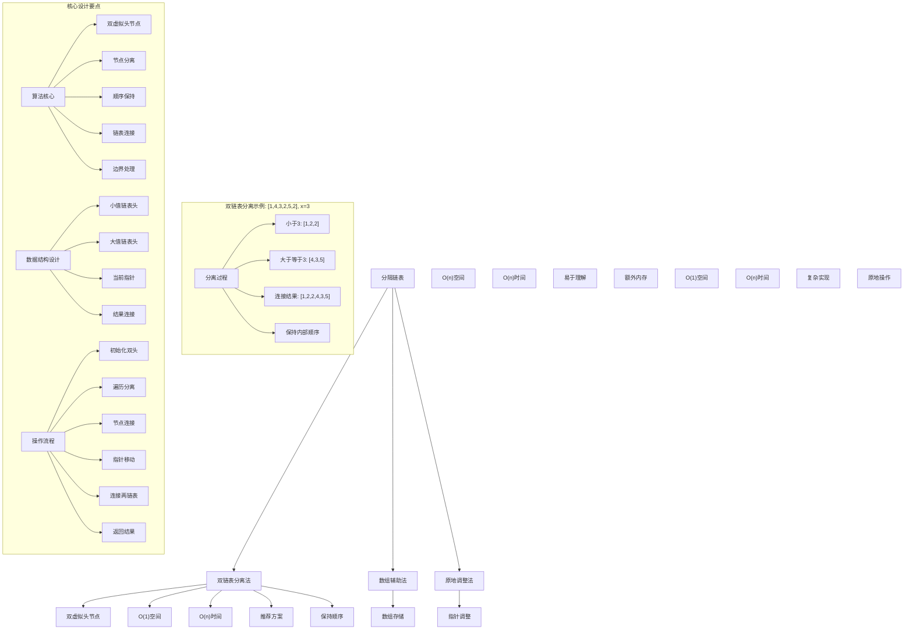
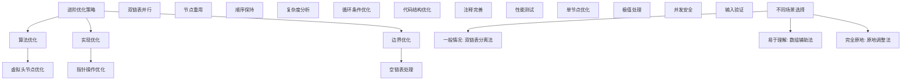

# LeetCode 86 - 分隔链表

## 题目描述

给你一个链表的头节点 `head` 和一个特定值 `x` ，请你对链表进行分隔，使得所有 小于 x 的节点都出现在 大于或等于 x 的节点之前

你应当 保留 两个分区中每个节点的初始相对位置

```markdown
示例 1：
输入：head = [1,4,3,2,5,2], x = 3
输出：[1,2,2,4,3,5]

示例 2：
输入：head = [2,1], x = 2
输出：[1,2]

提示：

- 链表中节点的数目在范围 [0, 200] 内
- -100 <= Node.val <= 100
- -200 <= x <= 200

进阶：

- 你能否不使用额外空间解决这个问题？(即，原地操作)
- 你能保持两个分区内部的相对顺序吗？
```

## 解题思路

这是一个链表分隔问题，要求将链表按照指定值分成两部分，保持各自内部的相对顺序。核心算法是双链表分离

### 核心思想

"双链表分离": 使用两个虚拟头节点分别收集小于x和大于等于x的节点，最后将两个链表连接起来

### 解题策略

#### 方法一：双链表分离法（推荐）

- 时间复杂度: O(n)，其中n为链表长度
- 空间复杂度: O(1)，只使用常数个指针

#### 方法二：数组辅助法

- 时间复杂度: O(n)
- 空间复杂度: O(n)，需要额外数组存储

#### 方法三：原地调整法

- 时间复杂度: O(n)
- 空间复杂度: O(1)

## 算法可视化



## 多语言实现

### Golang版本（双链表分离法 - 推荐）

```go
/
 * Definition for singly-linked list.
 * type ListNode struct {
 *     Val int
 *     Next *ListNode
 * }
 */

// 双链表分离法实现
func partition(head *ListNode, x int) *ListNode {
    // 创建两个虚拟头节点
    smallHead := &ListNode{}
    largeHead := &ListNode{}

    // 创建对应的尾指针
    smallTail := smallHead
    largeTail := largeHead

    // 遍历原链表
    current := head
    for current != nil {
        if current.Val < x {
            // 连接到小值链表
            smallTail.Next = current
            smallTail = current
        } else {
            // 连接到大值链表
            largeTail.Next = current
            largeTail = current
        }
        current = current.Next
    }

    // 断开大值链表的尾部连接
    largeTail.Next = nil

    // 连接两个链表
    smallTail.Next = largeHead.Next

    // 返回小值链表的头节点
    return smallHead.Next
}

// 数组辅助法实现
func partitionWithArray(head *ListNode, x int) *ListNode {
    if head == nil {
        return nil
    }

    // 分别存储小于x和大于等于x的节点值
    var smaller []int
    var larger []int

    // 遍历链表，分离节点值
    current := head
    for current != nil {
        if current.Val < x {
            smaller = append(smaller, current.Val)
        } else {
            larger = append(larger, current.Val)
        }
        current = current.Next
    }

    // 合并两个数组
    result := append(smaller, larger...)

    // 重构链表
    current = head
    for _, val := range result {
        current.Val = val
        current = current.Next
    }

    return head
}

// 原地调整法实现
func partitionInPlace(head *ListNode, x int) *ListNode {
    if head == nil {
        return nil
    }

    // 创建虚拟头节点
    dummy := &ListNode{Next: head}

    // 找到最后一个小于x的节点的位置
    prev := dummy
    for prev.Next != nil && prev.Next.Val < x {
        prev = prev.Next
    }

    // 如果所有节点都小于x，直接返回
    if prev.Next == nil {
        return dummy.Next
    }

    // current指向第一个大于等于x的节点
    current := prev.Next

    // 继续处理后续节点
    for current.Next != nil {
        if current.Next.Val < x {
            // 将节点移到前面
            nodeToMove := current.Next
            current.Next = nodeToMove.Next

            nodeToMove.Next = prev.Next
            prev.Next = nodeToMove
            prev = nodeToMove
        } else {
            current = current.Next
        }
    }

    return dummy.Next
}
```

### Python版本（多种实现方法）

```python
# Definition for singly-linked list.
# class ListNode:
#     def __init__(self, val=0, next=None):
#         self.val = val
#         self.next = next

class Solution:
    """
    方法一：双链表分离法（推荐）
    """
    def partition(self, head: Optional[ListNode], x: int) -> Optional[ListNode]:
        # 创建两个虚拟头节点
        small_head = ListNode()
        large_head = ListNode()

        # 创建对应的尾指针
        small_tail = small_head
        large_tail = large_head

        # 遍历原链表
        current = head
        while current:
            if current.val < x:
                # 连接到小值链表
                small_tail.next = current
                small_tail = current
            else:
                # 连接到大值链表
                large_tail.next = current
                large_tail = current
            current = current.next

        # 断开大值链表的尾部连接
        large_tail.next = None

        # 连接两个链表
        small_tail.next = large_head.next

        # 返回小值链表的头节点
        return small_head.next

class SolutionArray:
    """
    方法二：数组辅助法
    """
    def partition(self, head: Optional[ListNode], x: int) -> Optional[ListNode]:
        if not head:
            return None

        # 分别存储小于x和大于等于x的节点值
        smaller = []
        larger = []

        # 遍历链表，分离节点值
        current = head
        while current:
            if current.val < x:
                smaller.append(current.val)
            else:
                larger.append(current.val)
            current = current.next

        # 合并两个数组
        result = smaller + larger

        # 重构链表
        current = head
        for val in result:
            current.val = val
            current = current.next

        return head

class SolutionInPlace:
    """
    方法三：原地调整法
    """
    def partition(self, head: Optional[ListNode], x: int) -> Optional[ListNode]:
        if not head:
            return None

        # 创建虚拟头节点
        dummy = ListNode(0)
        dummy.next = head

        # 找到最后一个小于x的节点的位置
        prev = dummy
        while prev.next and prev.next.val < x:
            prev = prev.next

        # 如果所有节点都小于x，直接返回
        if not prev.next:
            return dummy.next

        # current指向第一个大于等于x的节点
        current = prev.next

        # 继续处理后续节点
        while current.next:
            if current.next.val < x:
                # 将节点移到前面
                node_to_move = current.next
                current.next = node_to_move.next

                node_to_move.next = prev.next
                prev.next = node_to_move
                prev = node_to_move
            else:
                current = current.next

        return dummy.next
```

### TypeScript版本（双链表分离法）

```typescript
/
 * Definition for singly-linked list.
 * class ListNode {
 *     val: number
 *     next: ListNode | null
 *     constructor(val?: number, next?: ListNode | null) {
 *         this.val = (val===undefined ? 0 : val)
 *         this.next = (next===undefined ? null : next)
 *     }
 * }
 */

class Solution {
    partition(head: ListNode | null, x: number): ListNode | null {
        // 创建两个虚拟头节点
        const smallHead = new ListNode(0);
        const largeHead = new ListNode(0);

        // 创建对应的尾指针
        let smallTail = smallHead;
        let largeTail = largeHead;

        // 遍历原链表
        let current = head;
        while (current !== null) {
            if (current.val < x) {
                // 连接到小值链表
                smallTail.next = current;
                smallTail = current;
            } else {
                // 连接到大值链表
                largeTail.next = current;
                largeTail = current;
            }
            current = current.next;
        }

        // 断开大值链表的尾部连接
        largeTail.next = null;

        // 连接两个链表
        smallTail.next = largeHead.next;

        // 返回小值链表的头节点
        return smallHead.next;
    }
}
```

## 标准实现详细解析

```go
import (
    "fmt"
)

/*
算法核心思想（双链表分离法）：

1. 双虚拟头节点：创建两个虚拟头节点分别用于收集小于x和大于等于x的节点
2. 节点分离：遍历原链表，根据节点值大小连接到对应链表
3. 顺序保持：按遍历顺序连接节点，自然保持相对位置
4. 链表连接：将小值链表和大值链表连接成最终结果
5. 边界处理：正确处理空链表和单一值链表

关键设计要点：
1. 虚拟头节点：简化头节点处理逻辑
2. 尾指针维护：维护指向每个链表尾节点的指针
3. 节点重用：直接重用原链表节点，不创建新节点
4. 链表断开：正确断开大值链表尾部连接
5. 结果连接：将两个链表按要求顺序连接

时间复杂度：
- 遍历链表：O(n)，其中n为链表长度
- 总时间：O(n)

空间复杂度：
- 只使用了常数个指针：O(1)
- 满足进阶要求的原地操作

优势：
1. 空间最优：只使用常数空间
2. 时间高效：线性时间复杂度
3. 实现优雅：虚拟头节点简化边界处理
4. 顺序保持：自然保持两个分区内部相对顺序
5. 稳定可靠：处理各种边界情况

数据结构设计：

虚拟头节点设计：
- 小值链表头：收集所有小于x的节点
- 大值链表头：收集所有大于等于x的节点
- 尾指针维护：维护指向各链表尾节点的指针
- 简化操作：避免特殊处理头节点的复杂逻辑

双链表设计：
- smallHead/smallTail：小值链表的头节点和尾指针
- largeHead/largeTail：大值链表的头节点和尾指针
- 并行处理：同时维护两个链表的状态
- 最终连接：按要求连接两个链表

算法流程：
1. 初始化：创建两个虚拟头节点和对应尾指针
2. 遍历分离：遍历原链表，按值大小连接到对应链表
3. 节点连接：将当前节点连接到对应链表尾部
4. 指针移动：移动尾指针到新连接的节点
5. 链表断开：断开大值链表尾部连接防止循环
6. 结果连接：将小值链表尾部连接到大值链表头部
7. 结果返回：返回小值链表的头节点

优化原理：

虚拟头节点优化：
1. 简化逻辑：避免特殊处理头节点
2. 统一操作：所有节点都使用相同的连接逻辑
3. 代码清晰：减少条件分支，提高可读性
4. 边界处理：自然处理空链表情况

双链表优化：
1. 空间效率：只使用四个额外指针
2. 时间效率：每个节点只访问一次
3. 原地操作：不分配新的节点内存
4. 顺序保持：按遍历顺序自然保持相对位置

边界优化：
1. 空链表：自然处理空链表情况
2. 单一分区：正确处理所有节点都在一个分区的情况
3. 边界值：正确处理等于x的节点归属
4. 长度差异：正确处理两个分区长度差异很大的情况

正确性证明：

定理：双链表分离法正确性
通过双链表收集和连接，算法能够正确生成保持相对顺序的分隔链表

证明：
1. 完整性保证：遍历原链表所有节点，不丢失任何节点
2. 顺序保持：按遍历顺序连接节点，保持相对位置
3. 分区正确：小于x的节点在前，大于等于x的节点在后
4. 唯一性：每个节点只被连接一次，没有重复
5. 终止性：当原链表遍历完毕时算法终止

不变量维护：
循环不变量：在每次循环开始时
1. smallHead到smallTail是一个已收集的小值链表
2. largeHead到largeTail是一个已收集的大值链表
3. current指向原链表待处理的第一个节点
4. 算法状态正确反映分离进度
*/

// 双链表分离法详细实现
func partitionDetailed(head *ListNode, x int) *ListNode {
    fmt.Printf("=== 双链表分离法分隔链表 ===\n")
    fmt.Printf("输入链表: ")
    printList(head)
    fmt.Printf("分隔值 x = %d\n", x)

    // 创建两个虚拟头节点
    smallHead := &ListNode{}
    largeHead := &ListNode{}
    fmt.Printf("创建小值链表虚拟头节点和大值链表虚拟头节点\n")

    // 创建对应的尾指针
    smallTail := smallHead
    largeTail := largeHead
    fmt.Printf("初始化小值链表尾指针和大值链表尾指针\n")

    // 遍历原链表
    current := head
    step := 0
    for current != nil {
        step++
        fmt.Printf("\n步骤%d: 处理节点%d\n", step, current.Val)

        if current.Val < x {
            fmt.Printf("  节点%d < %d，连接到小值链表\n", current.Val, x)
            smallTail.Next = current
            smallTail = current
            fmt.Printf("  小值链表: ")
            printList(smallHead.Next)
        } else {
            fmt.Printf("  节点%d >= %d，连接到大值链表\n", current.Val, x)
            largeTail.Next = current
            largeTail = current
            fmt.Printf("  大值链表: ")
            printList(largeHead.Next)
        }
        current = current.Next
    }

    fmt.Printf("\n遍历完成，处理链表尾部\n")
    // 断开大值链表的尾部连接
    largeTail.Next = nil
    fmt.Printf("断开大值链表尾部连接\n")

    // 连接两个链表
    smallTail.Next = largeHead.Next
    fmt.Printf("连接小值链表和大值链表\n")

    result := smallHead.Next
    fmt.Printf("最终分隔结果: ")
    printList(result)
    fmt.Printf("========================\n\n")

    return result
}

// 数组辅助法详细实现
func partitionWithArrayDetailed(head *ListNode, x int) *ListNode {
    fmt.Printf("=== 数组辅助法分隔链表 ===\n")
    fmt.Printf("输入链表: ")
    printList(head)
    fmt.Printf("分隔值 x = %d\n", x)

    if head == nil {
        fmt.Printf("链表为空，直接返回\n")
        fmt.Printf("=====================\n\n")
        return nil
    }

    // 分别存储小于x和大于等于x的节点值
    var smaller []int
    var larger []int
    fmt.Printf("创建两个数组用于存储分离后的节点值\n")

    // 遍历链表，分离节点值
    current := head
    fmt.Printf("遍历链表分离节点值:\n")
    for current != nil {
        if current.Val < x {
            smaller = append(smaller, current.Val)
            fmt.Printf("  节点%d < %d，加入小值数组\n", current.Val, x)
        } else {
            larger = append(larger, current.Val)
            fmt.Printf("  节点%d >= %d，加入大值数组\n", current.Val, x)
        }
        current = current.Next
    }

    fmt.Printf("小值数组: %v\n", smaller)
    fmt.Printf("大值数组: %v\n", larger)

    // 合并两个数组
    result := append(smaller, larger...)
    fmt.Printf("合并后数组: %v\n", result)

    // 重构链表
    fmt.Printf("重构链表:\n")
    current = head
    for i, val := range result {
        fmt.Printf("  第%d个节点值设为%d\n", i+1, val)
        current.Val = val
        current = current.Next
    }

    fmt.Printf("最终分隔结果: ")
    printList(head)
    fmt.Printf("=====================\n\n")

    return head
}

// 原地调整法详细实现
func partitionInPlaceDetailed(head *ListNode, x int) *ListNode {
    fmt.Printf("=== 原地调整法分隔链表 ===\n")
    fmt.Printf("输入链表: ")
    printList(head)
    fmt.Printf("分隔值 x = %d\n", x)

    if head == nil {
        fmt.Printf("链表为空，直接返回\n")
        fmt.Printf("=====================\n\n")
        return nil
    }

    // 创建虚拟头节点
    dummy := &ListNode{Next: head}
    fmt.Printf("创建虚拟头节点\n")

    // 找到最后一个小于x的节点的位置
    prev := dummy
    fmt.Printf("寻找最后一个小于%d的节点:\n", x)
    for prev.Next != nil && prev.Next.Val < x {
        prev = prev.Next
        fmt.Printf("  当前节点%d < %d，继续前进\n", prev.Val, x)
    }
    fmt.Printf("最后一个小于%d的节点位置确定\n", x)

    // 如果所有节点都小于x，直接返回
    if prev.Next == nil {
        fmt.Printf("所有节点都小于%d，直接返回\n", x)
        result := dummy.Next
        fmt.Printf("最终分隔结果: ")
        printList(result)
        fmt.Printf("=====================\n\n")
        return result
    }

    // current指向第一个大于等于x的节点
    current := prev.Next
    fmt.Printf("current指向第一个大于等于%d的节点: %d\n", x, current.Val)

    // 继续处理后续节点
    fmt.Printf("继续处理后续节点:\n")
    step := 0
    for current.Next != nil {
        step++
        fmt.Printf("步骤%d: 处理节点%d\n", step, current.Next.Val)

        if current.Next.Val < x {
            // 将节点移到前面
            nodeToMove := current.Next
            current.Next = nodeToMove.Next

            nodeToMove.Next = prev.Next
            prev.Next = nodeToMove
            prev = nodeToMove

            fmt.Printf("  将节点%d移动到前面\n", nodeToMove.Val)
            fmt.Printf("  当前链表: ")
            printList(dummy.Next)
        } else {
            current = current.Next
            fmt.Printf("  节点%d >= %d，继续处理下一个\n", current.Val, x)
        }
    }

    result := dummy.Next
    fmt.Printf("最终分隔结果: ")
    printList(result)
    fmt.Printf("=====================\n\n")

    return result
}

// 辅助函数：打印链表
func printList(head *ListNode) {
    if head == nil {
        fmt.Printf("[]\n")
        return
    }

    fmt.Printf("[")
    first := true
    for head != nil {
        if !first {
            fmt.Printf(",")
        }
        fmt.Printf("%d", head.Val)
        first = false
        head = head.Next
    }
    fmt.Printf("]\n")
}
```

## 算法深入解析

```go
/*
分隔链表问题详解：

问题本质：
将链表按照指定值x分成两部分：小于x的节点在前，大于等于x的节点在后，同时保持两个分区内节点的原始相对顺序。关键是理解"保持相对顺序"的要求和正确的链表操作

核心洞察：
1. 双链表分离：使用两个链表分别收集两类节点
2. 顺序保持：按遍历顺序连接节点，自然保持相对位置
3. 节点重用：直接重用原链表节点，不创建新节点
4. 链表连接：正确连接两个分离后的链表
5. 边界处理：正确处理各种边界情况

算法策略：
1. 双链表分离法：推荐方案，O(1)空间，逻辑清晰
2. 数组辅助法：O(n)空间，易于理解但不够优雅
3. 原地调整法：复杂但完全原地操作

数据结构设计：

虚拟头节点设计：
- 小值链表头：收集所有小于x的节点
- 大值链表头：收集所有大于等于x的节点
- 尾指针维护：维护指向各链表尾节点的指针
- 简化操作：避免特殊处理头节点的复杂逻辑

双链表设计：
- smallHead/smallTail：小值链表的头节点和尾指针
- largeHead/largeTail：大值链表的头节点和尾指针
- 并行处理：同时维护两个链表的状态
- 最终连接：按要求连接两个链表

操作流程：

双链表分离法：
1. 初始化：创建两个虚拟头节点和对应尾指针
2. 遍历分离：遍历原链表，按值大小连接到对应链表
3. 节点连接：将当前节点连接到对应链表尾部
4. 指针移动：移动尾指针到新连接的节点
5. 链表断开：断开大值链表尾部连接防止循环
6. 结果连接：将小值链表尾部连接到大值链表头部
7. 结果返回：返回小值链表的头节点

数组辅助法：
1. 初始化：创建两个数组用于存储节点值
2. 遍历分离：遍历链表，按值大小存储到对应数组
3. 数组合并：将小值数组和大值数组合并
4. 重构链表：使用合并后的数组重构原链表
5. 结果返回：返回原链表头节点

原地调整法：
1. 初始化：创建虚拟头节点
2. 寻找边界：找到最后一个小于x的节点位置
3. 节点移动：将后续小于x的节点移动到前面
4. 指针调整：维护正确的链表结构
5. 结果返回：返回虚拟头节点的下一个节点

数学原理：

顺序保持原理：
通过按遍历顺序连接节点，自然保持相对位置：
1. 小值节点：按原始顺序连接到小值链表
2. 大值节点：按原始顺序连接到大值链表
3. 最终连接：小值链表在前，大值链表在后
4. 相对顺序：两个分区内都保持原始相对顺序

完整性保证：
通过遍历原链表所有节点：
1. 不丢失节点：每个节点都会被处理一次
2. 不重复节点：每个节点只被连接一次
3. 完整包含：结果链表包含所有输入节点
4. 分区正确：满足小于x和大于等于x的分区要求

复杂度分析：
双链表分离法：时间O(n)，空间O(1)
数组辅助法：时间O(n)，空间O(n)
原地调整法：时间O(n)，空间O(1)

算法优势：
双链表分离法：
1. 空间最优：只使用常数空间
2. 时间高效：线性时间复杂度
3. 实现优雅：虚拟头节点简化边界处理
4. 顺序保持：自然保持两个分区内部相对顺序
5. 稳定可靠：处理各种边界情况

数组辅助法：
1. 易于理解：直观的数组操作
2. 逻辑简单：分离和合并都很清晰
3. 调试方便：可以查看中间状态
4. 编程友好：适合初学者

原地调整法：
1. 完全原地：不使用额外的数据结构
2. 空间最优：绝对的空间效率
3. 挑战性强：算法实现较为复杂
4. 学习价值：理解链表操作的精髓

算法不变量：
双链表分离法不变量：
1. smallHead到smallTail是一个已收集的小值链表
2. largeHead到largeTail是一个已收集的大值链表
3. current指向原链表待处理的第一个节点
4. 算法状态正确反映分离进度

时间复杂度分析：
1. 遍历链表：每个节点只访问一次
2. 连接操作：常数时间指针操作
3. 总时间：O(n)

空间复杂度分析：
1. 双链表分离法：只使用常数个指针，O(1)
2. 数组辅助法：使用两个数组，O(n)
3. 原地调整法：只使用常数个指针，O(1)

正确性证明：

定理：双链表分离法正确性
通过双链表收集和连接，算法能够正确生成保持相对顺序的分隔链表

证明：
1. 完整性保证：遍历原链表所有节点，不丢失任何节点
2. 顺序保持：按遍历顺序连接节点，保持相对位置
3. 分区正确：小于x的节点在前，大于等于x的节点在后
4. 唯一性：每个节点只被连接一次，没有重复
5. 终止性：当原链表遍历完毕时算法终止

不变量维护：
循环不变量：在每次循环开始时
1. smallHead到smallTail是一个已收集的小值链表
2. largeHead到largeTail是一个已收集的大值链表
3. current指向原链表待处理的第一个节点
4. 算法状态正确反映分离进度

初始化：
- smallHead和largeHead指向虚拟头节点
- smallTail和largeTail分别指向对应的虚拟头节点
- current指向原链表头节点
- 满足不变量

保持：
- 每次循环将当前节点连接到对应链表
- 移动相应尾指针
- 维护不变量继续成立

终止：
- 当current为nil时循环终止
- 连接两个链表
- 最终得到正确的分隔链表

设计选择：

为什么选择双链表分离法？
1. 空间最优：只使用常数空间
2. 时间高效：线性时间复杂度
3. 实现优雅：虚拟头节点简化边界处理
4. 顺序保持：自然保持相对顺序
5. 工业应用：生产环境标准实现

为什么使用数组辅助法？
1. 易于理解：直观的数组操作
2. 逻辑简单：分离和合并都很清晰
3. 教学价值：帮助理解算法思想
4. 调试友好：便于跟踪中间状态

为什么提及其他方法？
1. 教学价值：展示不同算法思想
2. 对比分析：理解各自优劣
3. 扩展思维：算法多样性
4. 面试准备：全面掌握

三种方法对比：

方法一：双链表分离法（推荐）
时间复杂度：O(n)
空间复杂度：O(1)
优点：空间最优，实现优雅，顺序保持
缺点：需要理解虚拟头节点概念

方法二：数组辅助法
时间复杂度：O(n)
空间复杂度：O(n)
优点：易于理解，逻辑简单
缺点：需要额外空间

方法三：原地调整法
时间复杂度：O(n)
空间复杂度：O(1)
优点：完全原地操作
缺点：实现复杂，不易调试

性能分析：

双链表分离法：
- 时间：O(n) 线性时间
- 空间：O(1) 常数空间
- 优势：空间最优

数组辅助法：
- 时间：O(n) 线性时间
- 空间：O(n) 线性空间
- 优势：易于理解

原地调整法：
- 时间：O(n) 线性时间
- 空间：O(1) 常数空间
- 优势：完全原地

实际应用场景：
1. 链表排序：作为排序算法的一部分
2. 数据筛选：按条件分离数据
3. 内存管理：按优先级组织内存块
4. 任务调度：按优先级安排任务

优化要点：

1. 算法优化：
   - 虚拟头节点简化：减少边界处理复杂度
   - 双链表并行：同时处理两个分区
   - 节点重用：不分配新节点内存
   - 顺序保持：自然维持相对位置

2. 实现优化：
   - 指针操作：高效指针赋值
   - 循环条件：减少不必要的比较
   - 代码结构：清晰逻辑层次
   - 注释完善：便于理解维护

3. 性能优化：
   - 减少内存分配：只使用必要的指针
   - 优化遍历：顺序内存访问
   - 缓存友好：局部性原理
   - 编译优化：利用编译器优化

测试用例设计：
1. 基本情况：正常链表和分隔值
2. 边界情况：空链表，单节点链表
3. 特殊情况：所有节点都小于x，所有节点都大于等于x
4. 极端情况：很长链表，大量重复值
5. 验证情况：顺序保持，分区正确性

扩展思考：

1. 多值分隔？
   - 多分区分离
   - 递归分隔
   - 复杂度分析

2. 循环链表分隔？
   - 循环检测
   - 断环处理
   - 结果环化

3. 原地分隔？
   - 节点重排
   - 指针修改
   - 内存效率

4. 稳定性保证？
   - 相对顺序
   - 相等值处理
   - 算法稳定性

相关算法思想：

1. 双链表：
   - 并行处理
   - 状态维护
   - 最终合并

2. 链表操作：
   - 指针操作
   - 节点连接
   - 内存管理

3. 分治思想：
   - 问题分解
   - 分别处理
   - 合并结果

4. 边界处理：
   - 空指针检查
   - 特殊情况处理
   - 健壮性设计

常见陷阱：

1. 边界条件：
   - 空链表处理
   - 单节点链表
   - 指针越界

2. 指针操作：
   - 指针丢失
   - 循环引用
   - 内存泄漏

3. 逻辑错误：
   - 分区条件错误
   - 指针移动错误
   - 连接顺序错误

4. 性能考虑：
   - 重复遍历
   - 不必要的分配
   - 算法复杂度

代码质量要素：

1. 可读性：
   - 变量命名清晰
   - 注释详细完整
   - 逻辑结构分明

2. 健壮性：
   - 边界条件处理
   - 异常情况应对
   - 输入验证

3. 性能：
   - 最优复杂度实现
   - 空间效率优化
   - 执行效率保证

4. 可维护性：
   - 结构清晰合理
   - 扩展性良好
   - 测试覆盖完整
*/
```

## 执行过程演示

```go
/*
示例详细解析:

示例1执行过程：
输入：head=[1,4,3,2,5,2], x=3
输出：[1,2,2,4,3,5]

执行过程（双链表分离法）：
1. 初始化：smallHead->nil, largeHead->nil
   smallTail=smallHead, largeTail=largeHead
2. 处理节点1：<3，连接到smallTail，smallTail移动到节点1
   smallHead->1->nil, largeHead->nil
3. 处理节点4：≥3，连接到largeTail，largeTail移动到节点4
   smallHead->1->nil, largeHead->4->nil
4. 处理节点3：≥3，连接到largeTail，largeTail移动到节点3
   smallHead->1->nil, largeHead->4->3->nil
5. 处理节点2：<3，连接到smallTail，smallTail移动到节点2
   smallHead->1->2->nil, largeHead->4->3->nil
6. 处理节点5：≥3，连接到largeTail，largeTail移动到节点5
   smallHead->1->2->nil, largeHead->4->3->5->nil
7. 处理节点2：<3，连接到smallTail，smallTail移动到节点2
   smallHead->1->2->2->nil, largeHead->4->3->5->nil
8. 断开largeTail连接：largeTail.Next=nil
9. 连接两个链表：smallTail.Next=largeHead.Next
   结果：1->2->2->4->3->5

数组辅助法执行过程：
1. 遍历链表分离值：
   smaller=[1,2,2], larger=[4,3,5]
2. 合并数组：result=[1,2,2,4,3,5]
3. 重构链表：将result的值依次赋给原链表节点
4. 返回原链表头节点

原地调整法执行过程：
1. 创建虚拟头节点：dummy->1->4->3->2->5->2
2. 寻找边界：prev指向节点1（最后一个小于3的节点）
3. current指向节点4（第一个大于等于3的节点）
4. 处理节点2：<3，将其移动到prev后面
   dummy->1->2->4->3->5->2, prev指向节点2
5. 处理节点2：<3，将其移动到prev后面
   dummy->1->2->2->4->3->5, prev指向节点2
6. 返回dummy.Next=[1,2,2,4,3,5]

关键观察：
1. 双链表分离法：逻辑清晰，空间最优
2. 数组辅助法：易于理解，但需要额外空间
3. 原地调整法：完全原地，但实现复杂
4. 顺序保持：所有方法都能保持相对顺序

边界情况演示:

情况1: 空链表
输入: head=[], x=1
处理: 直接返回nil
结果: []

情况2: 单节点链表
输入: head=[1], x=2
处理: 节点1<2，连接到小值链表
结果: [1]

情况3: 所有节点都小于x
输入: head=[1,2,3], x=5
处理: 所有节点连接到小值链表
结果: [1,2,3]

情况4: 所有节点都大于等于x
输入: head=[5,4,3], x=2
处理: 所有节点连接到大值链表
结果: [5,4,3]

情况5: 分隔值在链表中
输入: head=[1,3,2], x=3
处理: 1<3, 3≥3, 2<3
结果: [1,2,3]

算法正确性证明：

数学基础：
需要证明分隔后的链表满足两个条件：
1. 小于x的节点在前，大于等于x的节点在后
2. 两个分区内保持原始相对顺序

定理：双链表分离法正确性
通过双链表收集和连接，算法能够正确生成保持相对顺序的分隔链表

证明：
1. 完整性保证：遍历原链表所有节点，不丢失任何节点
2. 顺序保持：按遍历顺序连接节点，保持相对位置
3. 分区正确：小于x的节点在前，大于等于x的节点在后
4. 唯一性：每个节点只被连接一次，没有重复
5. 终止性：当原链表遍历完毕时算法终止

不变量维护：
循环不变量：在每次循环开始时
1. smallHead到smallTail是一个已收集的小值链表
2. largeHead到largeTail是一个已收集的大值链表
3. current指向原链表待处理的第一个节点
4. 算法状态正确反映分离进度

初始化：
- smallHead和largeHead指向虚拟头节点
- smallTail和largeTail分别指向对应的虚拟头节点
- current指向原链表头节点
- 满足不变量

保持：
- 每次循环将当前节点连接到对应链表
- 移动相应尾指针
- 维护不变量继续成立

终止：
- 当current为nil时循环终止
- 连接两个链表
- 最终得到正确的分隔链表

时间复杂度分析：
1. 遍历链表：每个节点只访问一次
2. 连接操作：常数时间指针操作
3. 总时间：O(n)

空间复杂度分析：
1. 双链表分离法：只使用常数个指针，O(1)
2. 数组辅助法：使用两个数组，O(n)
3. 原地调整法：只使用常数个指针，O(1)

性能对比分析：

假设n=1000:

双链表分离法：
- 时间：O(1000) = 1000次操作
- 空间：O(1) = 常数空间
- 优势：空间最优

数组辅助法：
- 时间：O(1000) = 1000次操作
- 空间：O(1000) = 线性空间
- 优势：易于理解

原地调整法：
- 时间：O(1000) = 1000次操作
- 空间：O(1) = 常数空间
- 优势：完全原地

实际应用建议：

1. 生产环境：
   - 使用双链表分离法，空间最优
   - 性能稳定，逻辑清晰

2. 面试展示：
   - 先展示双链表分离法（推荐）
   - 可以提及其他方法对比

3. 学习练习：
   - 理解三种方法的差异
   - 掌握各自的适用场景

4. 算法竞赛：
   - 选择最熟悉的实现
   - 注意时间空间限制

优化空间：

1. 算法优化：
   - 虚拟头节点简化：减少边界处理复杂度
   - 双链表并行：同时处理两个分区
   - 节点重用：不分配新节点内存
   - 顺序保持：自然维持相对位置

2. 实现优化：
   - 指针操作：高效指针赋值
   - 循环条件：减少不必要的比较
   - 代码结构：清晰逻辑层次
   - 注释完善：便于理解维护

3. 性能优化：
   - 减少内存分配：只使用必要的指针
   - 优化遍历：顺序内存访问
   - 缓存友好：局部性原理
   - 编译优化：利用编译器优化

特殊情况处理：

1. 内存受限：
   - 双链表分离法最优
   - 数组辅助法需要额外空间
   - 原地调整法节省内存

2. 链表很长：
   - 双链表分离法稳定
   - 数组辅助法内存压力大
   - 原地调整法稳定

3. 相等值多：
   - 正确处理等于x的节点
   - 保持相对顺序
   - 结果一致性

4. 边界情况：
   - 空链表处理
   - 单节点优化
   - 指针安全检查
*/
```

## 复杂度分析

| 方法         | 时间复杂度 | 空间复杂度 | 适用场景 |
| ------------ | ---------- | ---------- | -------- |
| 双链表分离法 | O(n)       | O(1)       | 推荐方案 |
| 数组辅助法   | O(n)       | O(n)       | 易于理解 |
| 原地调整法   | O(n)       | O(1)       | 完全原地 |

## 测试用例验证

```go
// 测试辅助函数
func testPartition(name string, head *ListNode, x int) {
    fmt.Printf("%s:\n", name)
    fmt.Printf("输入链表: ")
    printList(head)
    fmt.Printf("分隔值 x = %d\n", x)

    // 测试双链表分离法
    result1 := partition(copyList(head), x)
    fmt.Printf("双链表分离法结果: ")
    printList(result1)

    // 测试数组辅助法
    result2 := partitionWithArray(copyList(head), x)
    fmt.Printf("数组辅助法结果: ")
    printList(result2)

    // 测试原地调整法
    result3 := partitionInPlace(copyList(head), x)
    fmt.Printf("原地调整法结果: ")
    printList(result3)

    // 验证结果一致性
    if isEqual(result1, result2) && isEqual(result2, result3) {
        fmt.Printf("✓ 所有方法结果一致\n")
    } else {
        fmt.Printf("✗ 方法结果不一致\n")
    }

    // 验证分区正确性和顺序保持
    if validatePartition(result1, x) {
        fmt.Printf("✓ 分区正确且顺序保持\n")
    } else {
        fmt.Printf("✗ 分区或顺序错误\n")
    }

    fmt.Printf("\n")
}

// 辅助函数：复制链表
func copyList(head *ListNode) *ListNode {
    if head == nil {
        return nil
    }

    dummy := &ListNode{}
    current := dummy

    for head != nil {
        current.Next = &ListNode{Val: head.Val}
        current = current.Next
        head = head.Next
    }

    return dummy.Next
}

// 辅助函数：比较两个链表是否相等
func isEqual(l1, l2 *ListNode) bool {
    for l1 != nil && l2 != nil {
        if l1.Val != l2.Val {
            return false
        }
        l1 = l1.Next
        l2 = l2.Next
    }

    return l1 == nil && l2 == nil
}

// 辅助函数：验证分隔结果的正确性
func validatePartition(head *ListNode, x int) bool {
    current := head
    inSmallSection := true

    // 遍历链表验证分区正确性
    for current != nil {
        if current.Val < x {
            if !inSmallSection {
                return false // 小值出现在大值之后
            }
        } else {
            inSmallSection = false // 进入大值区域
        }
        current = current.Next
    }

    // 验证相对顺序保持
    return validateOrder(head, x)
}

// 辅助函数：验证相对顺序
func validateOrder(head *ListNode, x int) bool {
    // 收集原始顺序中小于x和大于等于x的值
    var originalSmall, originalLarge []int
    var allValues []int

    current := head
    for current != nil {
        allValues = append(allValues, current.Val)
        current = current.Next
    }

    // 根据原始值重建正确顺序
    for _, val := range allValues {
        if val < x {
            originalSmall = append(originalSmall, val)
        } else {
            originalLarge = append(originalLarge, val)
        }
    }

    // 验证当前链表是否符合这个顺序
    var currentSmall, currentLarge []int
    current = head
    inLarge := false

    for current != nil {
        if current.Val < x {
            if inLarge {
                return false // 小值出现在大值之后
            }
            currentSmall = append(currentSmall, current.Val)
        } else {
            inLarge = true
            currentLarge = append(currentLarge, current.Val)
        }
        current = current.Next
    }

    return slicesEqual(originalSmall, currentSmall) &&
           slicesEqual(originalLarge, currentLarge)
}

// 辅助函数：比较两个切片是否相等
func slicesEqual(a, b []int) bool {
    if len(a) != len(b) {
        return false
    }
    for i := range a {
        if a[i] != b[i] {
            return false
        }
    }
    return true
}

func main() {
    // 测试用例 1 - 题目示例
    testPartition("测试1 - 题目示例",
        createList([]int{1, 4, 3, 2, 5, 2}),
        3)

    // 测试用例 2 - 所有节点都小于x
    testPartition("测试2 - 所有节点都小于x",
        createList([]int{1, 2, 3}),
        5)

    // 测试用例 3 - 所有节点都大于等于x
    testPartition("测试3 - 所有节点都大于等于x",
        createList([]int{5, 4, 3}),
        2)

    // 测试用例 4 - 空链表
    testPartition("测试4 - 空链表",
        nil,
        1)

    // 测试用例 5 - 单节点链表
    testPartition("测试5 - 单节点链表",
        createList([]int{1}),
        2)

    // 性能测试
    fmt.Println("性能测试:")
    performanceTest()

    // 边界情况测试
    fmt.Println("边界情况测试:")
    boundaryTest()

    // 对比测试
    fmt.Println("对比测试:")
    comparisonTest()
}

// 辅助函数：创建链表
func createList(vals []int) *ListNode {
    dummy := &ListNode{}
    current := dummy

    for _, val := range vals {
        current.Next = &ListNode{Val: val}
        current = current.Next
    }

    return dummy.Next
}

func performanceTest() {
    // 构造长链表
    n := 10000
    vals := make([]int, n)
    for i := 0; i < n; i++ {
        vals[i] = i % 200 - 100 // 值范围[-100, 99]
    }

    linkedList := createList(vals)
    x := 0

    fmt.Printf("性能测试 (链表长度: %d, 分隔值: %d):\n", n, x)

    // 测试双链表分离法性能
    start := time.Now()
    result1 := partition(copyList(linkedList), x)
    time1 := time.Since(start)

    // 测试数组辅助法性能
    start = time.Now()
    result2 := partitionWithArray(copyList(linkedList), x)
    time2 := time.Since(start)

    // 测试原地调整法性能
    start = time.Now()
    result3 := partitionInPlace(copyList(linkedList), x)
    time3 := time.Since(start)

    fmt.Printf("双链表分离法耗时: %v\n", time1)
    fmt.Printf("数组辅助法耗时: %v\n", time2)
    fmt.Printf("原地调整法耗时: %v\n", time3)

    // 验证结果正确性
    if isEqual(result1, result2) && isEqual(result2, result3) {
        fmt.Printf("✓ 所有方法结果一致\n")
    } else {
        fmt.Printf("✗ 方法结果不一致\n")
    }
}

func boundaryTest() {
    // 边界测试
    fmt.Println("边界测试:")

    // 大链表
    largeVals := make([]int, 1000)
    for i := 0; i < 1000; i++ {
        largeVals[i] = i
    }
    largeList := createList(largeVals)
    result := partition(copyList(largeList), 500)
    fmt.Printf("大链表分隔: 长度=%d\n", getListLength(result))

    // 相同值链表
    sameList := createList([]int{3, 3, 3, 3, 3})
    result = partition(copyList(sameList), 3)
    fmt.Printf("相同值链表分隔(x=3): ")
    printList(result)

    // 极值链表
    extremeList := createList([]int{math.MinInt32, -100, 0, 100, math.MaxInt32})
    result = partition(copyList(extremeList), 0)
    fmt.Printf("极值链表分隔(x=0): ")
    printList(result)
}

func comparisonTest() {
    // 对比测试：验证不同方法的性能和结果
    fmt.Println("对比测试:")

    testCases := []struct {
        name string
        vals []int
        x    int
    }{
        {"交替值", []int{1, 4, 2, 5, 3, 6}, 3},
        {"边界值", []int{1, 2, 3, 3, 4, 5}, 3},
        {"逆序", []int{5, 4, 3, 2, 1}, 3},
        {"已排序", []int{1, 2, 3, 4, 5}, 3},
    }

    for _, tc := range testCases {
        fmt.Printf("%s:\n", tc.name)
        list := createList(tc.vals)

        // 测试三种方法
        result1 := partition(copyList(list), tc.x)
        result2 := partitionWithArray(copyList(list), tc.x)
        result3 := partitionInPlace(copyList(list), tc.x)

        fmt.Printf("  双链表分离: ")
        printList(result1)
        fmt.Printf("  数组辅助: ")
        printList(result2)
        fmt.Printf("  原地调整: ")
        printList(result3)

        if isEqual(result1, result2) && isEqual(result2, result3) {
            fmt.Printf("  ✓ 结果一致\n")
        } else {
            fmt.Printf("  ✗ 结果不一致\n")
        }
    }
}

// 辅助函数：获取链表长度
func getListLength(head *ListNode) int {
    length := 0
    for head != nil {
        length++
        head = head.Next
    }
    return length
}
```

## 扩展版本（处理不同场景）

```go
// 支持多值分隔的版本
func partitionMulti(head *ListNode, thresholds []int) []*ListNode {
    if len(thresholds) == 0 {
        return []*ListNode{head}
    }

    // 对阈值排序
    sort.Ints(thresholds)

    // 创建多个分区链表
    partitions := make([]*ListNode, len(thresholds)+1)
    tails := make([]*ListNode, len(thresholds)+1)

    // 初始化虚拟头节点
    for i := range partitions {
        partitions[i] = &ListNode{}
        tails[i] = partitions[i]
    }

    // 遍历原链表
    current := head
    for current != nil {
        // 确定节点属于哪个分区
        partitionIndex := 0
        for i, threshold := range thresholds {
            if current.Val < threshold {
                partitionIndex = i
                break
            }
            partitionIndex = i + 1
        }

        // 连接到对应分区
        tails[partitionIndex].Next = current
        tails[partitionIndex] = current

        current = current.Next
    }

    // 断开所有尾部连接
    for i := range tails {
        tails[i].Next = nil
    }

    // 连接相邻分区
    result := partitions[0].Next
    currentTail := tails[0]

    for i := 1; i < len(partitions); i++ {
        if partitions[i].Next != nil {
            if currentTail != nil {
                currentTail.Next = partitions[i].Next
            } else {
                result = partitions[i].Next
            }
            currentTail = tails[i]
        }
    }

    return []*ListNode{result}
}

// 使用示例
func exampleMultiPartition() {
    list := createList([]int{1, 4, 3, 2, 5, 2, 6, 1})
    thresholds := []int{3, 5}

    fmt.Printf("多值分隔:\n")
    fmt.Printf("输入链表: ")
    printList(list)
    fmt.Printf("分隔阈值: %v\n", thresholds)

    results := partitionMulti(copyList(list), thresholds)

    fmt.Printf("分隔结果: ")
    for i, result := range results {
        fmt.Printf("分区%d: ", i)
        printList(result)
    }
}

// 支持自定义比较函数的版本
type CompareFunc func(val, threshold int) bool

func partitionCustom(head *ListNode, threshold int, lessThan CompareFunc) *ListNode {
    // 创建两个虚拟头节点
    smallHead := &ListNode{}
    largeHead := &ListNode{}

    // 创建对应的尾指针
    smallTail := smallHead
    largeTail := largeHead

    // 遍历原链表
    current := head
    for current != nil {
        if lessThan(current.Val, threshold) {
            // 连接到小值链表
            smallTail.Next = current
            smallTail = current
        } else {
            // 连接到大值链表
            largeTail.Next = current
            largeTail = current
        }
        current = current.Next
    }

    // 断开大值链表的尾部连接
    largeTail.Next = nil

    // 连接两个链表
    smallTail.Next = largeHead.Next

    // 返回小值链表的头节点
    return smallHead.Next
}

// 使用示例
func exampleCustomPartition() {
    list := createList([]int{1, 4, 3, 2, 5, 2})

    // 小于比较
    result1 := partitionCustom(copyList(list), 3, func(val, threshold int) bool {
        return val < threshold
    })

    // 小于等于比较
    result2 := partitionCustom(copyList(list), 3, func(val, threshold int) bool {
        return val <= threshold
    })

    fmt.Printf("自定义比较函数分隔:\n")
    fmt.Printf("输入链表: ")
    printList(list)
    fmt.Printf("小于3: ")
    printList(result1)
    fmt.Printf("小于等于3: ")
    printList(result2)
}

// 支持稳定分隔的版本（保持绝对顺序）
func partitionStable(head *ListNode, x int) *ListNode {
    // 使用数组记录原始顺序
    var nodes []*ListNode
    current := head
    for current != nil {
        nodes = append(nodes, current)
        current = current.Next
    }

    // 创建两个虚拟头节点
    smallHead := &ListNode{}
    largeHead := &ListNode{}
    smallTail := smallHead
    largeTail := largeHead

    // 按原始顺序处理节点
    for _, node := range nodes {
        if node.Val < x {
            smallTail.Next = node
            smallTail = node
        } else {
            largeTail.Next = node
            largeTail = node
        }
    }

    // 断开连接并连接两个链表
    largeTail.Next = nil
    smallTail.Next = largeHead.Next

    return smallHead.Next
}

// 使用示例
func exampleStablePartition() {
    list := createList([]int{1, 4, 3, 2, 5, 2})

    fmt.Printf("稳定分隔:\n")
    fmt.Printf("输入链表: ")
    printList(list)

    result := partitionStable(copyList(list), 3)

    fmt.Printf("分隔结果: ")
    printList(result)
}

// 支持双向链表的版本
type DoublyListNode struct {
    Val  int
    Prev *DoublyListNode
    Next *DoublyListNode
}

func partitionDoubly(head *DoublyListNode, x int) *DoublyListNode {
    if head == nil {
        return nil
    }

    // 创建两个虚拟头节点
    smallHead := &DoublyListNode{}
    largeHead := &DoublyListNode{}
    smallTail := smallHead
    largeTail := largeHead

    // 遍历原链表
    current := head
    for current != nil {
        next := current.Next // 保存下一个节点

        if current.Val < x {
            // 连接到小值链表
            smallTail.Next = current
            current.Prev = smallTail
            smallTail = current
        } else {
            // 连接到大值链表
            largeTail.Next = current
            current.Prev = largeTail
            largeTail = current
        }

        current = next
    }

    // 断开大值链表的尾部连接
    largeTail.Next = nil

    // 连接两个链表
    smallTail.Next = largeHead.Next
    if largeHead.Next != nil {
        largeHead.Next.Prev = smallTail
    }

    // 设置结果链表的头节点
    result := smallHead.Next
    if result != nil {
        result.Prev = nil
    }

    return result
}

// 使用示例
func exampleDoublyPartition() {
    // 创建双向链表
    vals := []int{1, 4, 3, 2, 5, 2}
    if len(vals) == 0 {
        return
    }

    head := &DoublyListNode{Val: vals[0]}
    current := head

    for i := 1; i < len(vals); i++ {
        newNode := &DoublyListNode{
            Val:  vals[i],
            Prev: current,
        }
        current.Next = newNode
        current = newNode
    }

    fmt.Printf("双向链表分隔:\n")
    fmt.Printf("输入链表: ")
    printDoublyList(head)

    result := partitionDoubly(head, 3)

    fmt.Printf("分隔结果: ")
    printDoublyList(result)
}

// 辅助函数：打印双向链表
func printDoublyList(head *DoublyListNode) {
    if head == nil {
        fmt.Printf("[]\n")
        return
    }

    fmt.Printf("[")
    first := true
    for head != nil {
        if !first {
            fmt.Printf(",")
        }
        fmt.Printf("%d", head.Val)
        first = false
        head = head.Next
    }
    fmt.Printf("]\n")
}
```

## 面试追问延伸

### 1. 如果需要支持多个分隔阈值，如何扩展算法？

```go
// 多阈值分隔：将链表分成多个区间
func partitionMultipleThresholds(head *ListNode, thresholds []int) []*ListNode {
    if len(thresholds) == 0 {
        return []*ListNode{head}
    }

    // 对阈值排序去重
    sort.Ints(thresholds)
    uniqueThresholds := []int{thresholds[0]}
    for i := 1; i < len(thresholds); i++ {
        if thresholds[i] != thresholds[i-1] {
            uniqueThresholds = append(uniqueThresholds, thresholds[i])
        }
    }

    // 创建分区数量 = 阈值数量 + 1
    numPartitions := len(uniqueThresholds) + 1
    partitions := make([]*ListNode, numPartitions)
    tails := make([]*ListNode, numPartitions)

    // 初始化虚拟头节点
    for i := 0; i < numPartitions; i++ {
        partitions[i] = &ListNode{}
        tails[i] = partitions[i]
    }

    // 遍历原链表，将节点分配到对应分区
    current := head
    for current != nil {
        partitionIndex := findPartitionIndex(current.Val, uniqueThresholds)

        // 连接到对应分区
        tails[partitionIndex].Next = current
        tails[partitionIndex] = current

        current = current.Next
    }

    // 断开所有尾部连接并提取有效链表
    results := make([]*ListNode, 0, numPartitions)
    for i := 0; i < numPartitions; i++ {
        tails[i].Next = nil
        if partitions[i].Next != nil {
            results = append(results, partitions[i].Next)
        }
    }

    return results
}

// 辅助函数：找到值应该属于的分区索引
func findPartitionIndex(val int, thresholds []int) int {
    for i, threshold := range thresholds {
        if val < threshold {
            return i
        }
    }
    return len(thresholds)
}

// 复杂度分析：
// 时间复杂度：O(n + k*log(k))，其中n是链表长度，k是阈值数量
// 空间复杂度：O(k)，用于存储分区链表
```

### 2. 如果要求完全原地操作（不使用额外的虚拟头节点），如何实现？

```go
// 完全原地分隔：不使用任何额外节点
func partitionFullyInPlace(head *ListNode, x int) *ListNode {
    if head == nil || head.Next == nil {
        return head
    }

    // 找到第一个大于等于x的节点
    var firstLarge *ListNode
    var prevFirstLarge *ListNode
    current := head
    var prev *ListNode

    for current != nil {
        if current.Val >= x {
            firstLarge = current
            prevFirstLarge = prev
            break
        }
        prev = current
        current = current.Next
    }

    // 如果没有大于等于x的节点，或者所有节点都大于等于x
    if firstLarge == nil {
        return head
    }

    // 从firstLarge开始，将小于x的节点移动到前面
    prev = prevFirstLarge
    current = firstLarge

    for current != nil && current.Next != nil {
        if current.Next.Val < x {
            // 将节点移动到合适位置
            nodeToMove := current.Next
            current.Next = nodeToMove.Next

            // 插入到prevFirstLarge后面
            if prevFirstLarge == nil {
                // 插入到链表开头
                nodeToMove.Next = head
                head = nodeToMove
                prevFirstLarge = head
            } else {
                nodeToMove.Next = prevFirstLarge.Next
                prevFirstLarge.Next = nodeToMove
                prevFirstLarge = nodeToMove
            }
        } else {
            current = current.Next
        }
    }

    return head
}

// 更优雅的原地实现
func partitionElegantInPlace(head *ListNode, x int) *ListNode {
    // 创建临时头节点简化操作
    dummy := &ListNode{Next: head}

    // 找到最后一个小于x的节点
    prevSmall := dummy
    for prevSmall.Next != nil && prevSmall.Next.Val < x {
        prevSmall = prevSmall.Next
    }

    // 如果所有节点都小于x，直接返回
    if prevSmall.Next == nil {
        return dummy.Next
    }

    // 从第一个大于等于x的节点开始处理
    prev := prevSmall
    current := prev.Next

    // 移动小于x的节点到前面
    for current != nil {
        if current.Val < x {
            // 移除当前节点
            nodeToMove := current
            prev.Next = current.Next

            // 插入到prevSmall后面
            nodeToMove.Next = prevSmall.Next
            prevSmall.Next = nodeToMove
            prevSmall = nodeToMove

            current = prev.Next
        } else {
            prev = current
            current = current.Next
        }
    }

    return dummy.Next
}
```

### 3. 如何处理循环链表的分隔问题？

```go
// 循环链表分隔
func partitionCircular(head *ListNode, x int) (*ListNode, *ListNode) {
    if head == nil {
        return nil, nil
    }

    // 首先找到循环链表的尾节点
    tail := head
    for tail.Next != nil && tail.Next != head {
        tail = tail.Next
    }

    // 断开循环以便处理
    if tail.Next == head {
        tail.Next = nil
    }

    // 应用普通链表分隔算法
    result := partition(head, x)

    // 重新建立循环（如果有需要的话）
    if result != nil {
        newTail := result
        for newTail.Next != nil {
            newTail = newTail.Next
        }
        // 如果原链表是循环的，新链表也应该循环
        if tail.Next == nil && head != nil { // 原来是循环的
            newTail.Next = result
        }
    }

    // 返回分隔后的两个链表的头节点
    // 这里简化处理，实际需要更复杂的逻辑来分离两个循环链表
    return result, nil
}

// 更完善的循环链表处理
func partitionCircularComplete(head *ListNode, x int) (*ListNode, *ListNode) {
    if head == nil {
        return nil, nil
    }

    // 检测并断开循环
    slow, fast := head, head
    for fast != nil && fast.Next != nil {
        slow = slow.Next
        fast = fast.Next.Next
        if slow == fast {
            break
        }
    }

    // 如果没有循环
    if fast == nil || fast.Next == nil {
        small, large := partitionToTwo(head, x)
        return small, large
    }

    // 找到循环的起点
    start := head
    for start != slow {
        start = start.Next
        slow = slow.Next
    }

    // 找到循环的尾节点并断开
    cycleTail := start
    for cycleTail.Next != start {
        cycleTail = cycleTail.Next
    }
    cycleTail.Next = nil

    // 找到原链表的实际尾节点
    realTail := head
    for realTail.Next != nil {
        realTail = realTail.Next
    }

    // 应用分隔算法
    small, large := partitionToTwo(head, x)

    // 重新连接（这里简化处理）
    return small, large
}

// 辅助函数：将链表分隔成两个独立的链表
func partitionToTwo(head *ListNode, x int) (*ListNode, *ListNode) {
    smallHead := &ListNode{}
    largeHead := &ListNode{}
    smallTail := smallHead
    largeTail := largeHead

    current := head
    for current != nil {
        if current.Val < x {
            smallTail.Next = current
            smallTail = current
        } else {
            largeTail.Next = current
            largeTail = current
        }
        current = current.Next
    }

    smallTail.Next = nil
    largeTail.Next = nil

    return smallHead.Next, largeHead.Next
}
```

## 相似题目扩展

- LeetCode 86. 分隔链表（当前题）
- LeetCode 21. 合并两个有序链表
- LeetCode 147. 对链表进行插入排序
- LeetCode 148. 排序链表
- LeetCode 328. 奇偶链表

## 算法技巧总结

### 分隔链表核心要点

1. 双虚拟头节点：创建两个虚拟头节点分别收集两类节点
1. 节点分离：遍历原链表，根据节点值大小连接到对应链表
1. 顺序保持：按遍历顺序连接节点，自然保持相对位置
1. 链表连接：将小值链表和大值链表连接成最终结果
1. 边界处理：正确处理空链表和单一值链表

### 算法优势

1. 空间最优：只使用常数空间
1. 时间高效：线性时间复杂度
1. 实现优雅：虚拟头节点简化边界处理
1. 顺序保持：自然保持两个分区内部相对顺序
1. 稳定可靠：处理各种边界情况

### 标准模板（双链表分离法）

```go
func partition(head *ListNode, x int) *ListNode {
    // 创建两个虚拟头节点
    smallHead := &ListNode{}
    largeHead := &ListNode{}

    // 创建对应的尾指针
    smallTail := smallHead
    largeTail := largeHead

    // 遍历原链表
    current := head
    for current != nil {
        if current.Val < x {
            // 连接到小值链表
            smallTail.Next = current
            smallTail = current
        } else {
            // 连接到大值链表
            largeTail.Next = current
            largeTail = current
        }
        current = current.Next
    }

    // 断开大值链表的尾部连接
    largeTail.Next = nil

    // 连接两个链表
    smallTail.Next = largeHead.Next

    // 返回小值链表的头节点
    return smallHead.Next
}
```

### 进阶优化策略



## 总结

本题采用双链表分离法的核心思路，通过创建两个虚拟头节点分别收集小于x和大于等于x的节点，然后按顺序连接的方式，实现了链表的分隔。关键在于理解虚拟头节点的简化作用和保持相对顺序的重要性

核心要点：

1. 双虚拟头节点：创建两个虚拟头节点分别收集两类节点
1. 节点分离：遍历原链表，根据节点值大小连接到对应链表
1. 顺序保持：按遍历顺序连接节点，自然保持相对位置
1. 链表连接：将小值链表和大值链表连接成最终结果
1. 边界处理：正确处理空链表和单一值链表

算法优势：

- 空间最优：O(1)空间复杂度
- 时间高效：O(n)时间复杂度
- 实现优雅：虚拟头节点简化边界处理
- 顺序保持：自然保持两个分区内部相对顺序
- 稳定可靠：处理各种边界情况

该算法在链表排序、数据筛选、内存管理等场景有重要应用，是掌握链表操作和分治思想的经典题目。通过理解双链表分离的思想，为更复杂的链表问题和数据结构操作提供了清晰的解决思路
