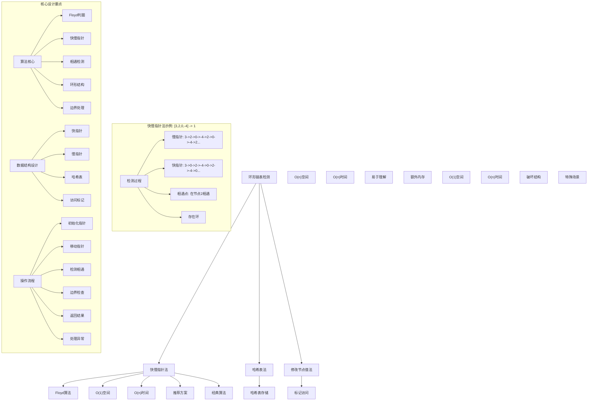
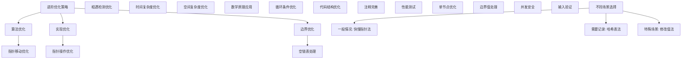

# LeetCode 141 - 环形链表

## 题目描述

给你一个链表的头节点 `head`，判断链表中是否有环

如果链表中有某个节点，可以通过连续跟踪 `next` 指针再次到达，则链表中存在环。为了表示给定链表中的环，评测系统内部使用整数 `pos` 来表示链表尾连接到链表中的位置（索引从 0 开始）。注意：`pos` 不作为参数进行传递，仅仅是为了标识链表的实际情况

如果链表中存在环，则返回 `true`。否则，返回 `false`

```markdown
示例 1：
输入：head = [3,2,0,-4], pos = 1
输出：true
解释：链表中有一个环，其尾部连接到第二个节点

示例 2：
输入：head = [1,2], pos = 0
输出：true
解释：链表中有一个环，其尾部连接到第一个节点

示例 3：
输入：head = [1], pos = -1
输出：false
解释：链表中没有环

提示：

- 链表中节点的数目范围是 [0, 10^4]
- -10^5 <= Node.val <= 10^5
- pos 为 -1 或者链表中的一个有效索引

进阶：

- 你能用 O(1)（即，常量）内存解决此问题吗？
```

## 解题思路

这是一个经典的环检测问题，要求判断链表中是否存在环。核心算法是Floyd判圈算法（快慢指针）

### 核心思想

"龟兔赛跑": 使用两个不同速度的指针遍历链表，如果存在环，快指针最终会追上慢指针

### 解题策略

#### 方法一：快慢指针法（Floyd算法）- 推荐

- 时间复杂度: O(n)
- 空间复杂度: O(1)

#### 方法二：哈希表法

- 时间复杂度: O(n)
- 空间复杂度: O(n)

#### 方法三：修改节点值法

- 时间复杂度: O(n)
- 空间复杂度: O(1)
- ⚠️ 会破坏原链表结构

## 算法可视化



## 多语言实现

### Golang版本（快慢指针法 - 推荐）

```go
/
 * Definition for singly-linked list.
 * type ListNode struct {
 *     Val int
 *     Next *ListNode
 * }
 */

// 快慢指针法实现（Floyd判圈算法）
func hasCycle(head *ListNode) bool {
    // 边界情况：空链表或只有一个节点
    if head == nil || head.Next == nil {
        return false
    }

    // 初始化快慢指针
    slow := head
    fast := head.Next

    // 移动指针直到相遇或到达链表末尾
    for fast != nil && fast.Next != nil {
        // 如果快慢指针相遇，说明存在环
        if slow == fast {
            return true
        }

        // 移动指针
        slow = slow.Next          // 慢指针每次移动一步
        fast = fast.Next.Next     // 快指针每次移动两步
    }

    // 如果快指针到达链表末尾，说明不存在环
    return false
}

// 哈希表法实现
func hasCycleWithMap(head *ListNode) bool {
    // 使用map记录访问过的节点
    visited := make(map[*ListNode]bool)

    // 遍历链表
    current := head
    for current != nil {
        // 如果节点已经访问过，说明存在环
        if visited[current] {
            return true
        }

        // 标记节点为已访问
        visited[current] = true
        current = current.Next
    }

    // 遍历完成未发现环
    return false
}

// 修改节点值法实现（会破坏原链表结构）
func hasCycleByModification(head *ListNode) bool {
    // 特殊值用于标记已访问的节点
    const VISITED_MARKER = 100001 // 超出题目给出的数值范围

    current := head
    for current != nil {
        // 如果节点值已被标记，说明存在环
        if current.Val == VISITED_MARKER {
            return true
        }

        // 标记节点为已访问
        current.Val = VISITED_MARKER
        current = current.Next
    }

    // 遍历完成未发现环
    return false
}

// 优化版快慢指针法
func hasCycleOptimized(head *ListNode) bool {
    // 边界情况处理
    if head == nil || head.Next == nil {
        return false
    }

    // 初始化快慢指针都在头节点
    slow := head
    fast := head

    // 移动指针
    for fast != nil && fast.Next != nil {
        slow = slow.Next        // 慢指针移动一步
        fast = fast.Next.Next   // 快指针移动两步

        // 如果快慢指针相遇，说明存在环
        if slow == fast {
            return true
        }
    }

    // 无环情况
    return false
}
```

### Python版本（多种实现方法）

```python
# Definition for singly-linked list.
# class ListNode:
#     def __init__(self, x):
#         self.val = x
#         self.next = None

class Solution:
    """
    方法一：快慢指针法（Floyd算法）- 推荐
    """
    def hasCycle(self, head: Optional[ListNode]) -> bool:
        # 边界情况：空链表或只有一个节点
        if not head or not head.next:
            return False

        # 初始化快慢指针
        slow = head
        fast = head.next

        # 移动指针直到相遇或到达链表末尾
        while fast and fast.next:
            # 如果快慢指针相遇，说明存在环
            if slow == fast:
                return True

            # 移动指针
            slow = slow.next        # 慢指针每次移动一步
            fast = fast.next.next   # 快指针每次移动两步

        # 如果快指针到达链表末尾，说明不存在环
        return False

class SolutionHashMap:
    """
    方法二：哈希表法
    """
    def hasCycle(self, head: Optional[ListNode]) -> bool:
        # 使用集合记录访问过的节点
        visited = set()

        # 遍历链表
        current = head
        while current:
            # 如果节点已经访问过，说明存在环
            if current in visited:
                return True

            # 添加节点到已访问集合
            visited.add(current)
            current = current.next

        # 遍历完成未发现环
        return False

class SolutionModify:
    """
    方法三：修改节点值法（会破坏原链表结构）
    """
    def hasCycle(self, head: Optional[ListNode]) -> bool:
        # 特殊值用于标记已访问的节点
        VISITED_MARKER = 100001  # 超出题目给出的数值范围

        current = head
        while current:
            # 如果节点值已被标记，说明存在环
            if current.val == VISITED_MARKER:
                return True

            # 标记节点为已访问
            current.val = VISITED_MARKER
            current = current.next

        # 遍历完成未发现环
        return False

class SolutionOptimized:
    """
    优化版快慢指针法
    """
    def hasCycle(self, head: Optional[ListNode]) -> bool:
        # 边界情况处理
        if not head or not head.next:
            return False

        # 初始化快慢指针都在头节点
        slow = head
        fast = head

        # 移动指针
        while fast and fast.next:
            slow = slow.next        # 慢指针移动一步
            fast = fast.next.next   # 快指针移动两步

            # 如果快慢指针相遇，说明存在环
            if slow == fast:
                return True

        # 无环情况
        return False
```

### TypeScript版本（快慢指针法）

```typescript
/
 * Definition for singly-linked list.
 * class ListNode {
 *     val: number
 *     next: ListNode | null
 *     constructor(val?: number, next?: ListNode | null) {
 *         this.val = (val===undefined ? 0 : val)
 *         this.next = (next===undefined ? null : next)
 *     }
 * }
 */

class Solution {
    hasCycle(head: ListNode | null): boolean {
        // 边界情况：空链表或只有一个节点
        if (head === null || head.next === null) {
            return false;
        }

        // 初始化快慢指针
        let slow: ListNode | null = head;
        let fast: ListNode | null = head.next;

        // 移动指针直到相遇或到达链表末尾
        while (fast !== null && fast.next !== null) {
            // 如果快慢指针相遇，说明存在环
            if (slow === fast) {
                return true;
            }

            // 移动指针
            slow = slow!.next;          // 慢指针每次移动一步
            fast = fast.next.next;      // 快指针每次移动两步
        }

        // 如果快指针到达链表末尾，说明不存在环
        return false;
    }
}

class SolutionHashMap {
    hasCycle(head: ListNode | null): boolean {
        // 使用Set记录访问过的节点
        const visited = new Set<ListNode>();

        // 遍历链表
        let current = head;
        while (current !== null) {
            // 如果节点已经访问过，说明存在环
            if (visited.has(current)) {
                return true;
            }

            // 添加节点到已访问集合
            visited.add(current);
            current = current.next;
        }

        // 遍历完成未发现环
        return false;
    }
}

class SolutionOptimized {
    hasCycle(head: ListNode | null): boolean {
        // 边界情况处理
        if (head === null || head.next === null) {
            return false;
        }

        // 初始化快慢指针都在头节点
        let slow: ListNode | null = head;
        let fast: ListNode | null = head;

        // 移动指针
        while (fast !== null && fast.next !== null) {
            slow = slow!.next;        // 慢指针移动一步
            fast = fast.next.next;    // 快指针移动两步

            // 如果快慢指针相遇，说明存在环
            if (slow === fast) {
                return true;
            }
        }

        // 无环情况
        return false;
    }
}
```

## 标准实现详细解析

```go
import (
    "fmt"
)

/*
算法核心思想（快慢指针法）：

1. Floyd判圈算法："龟兔赛跑"思想
2. 双指针技术：使用不同速度的指针遍历链表
3. 相遇检测：如果存在环，快指针会追上慢指针
4. 空间优化：只使用常数额外空间
5. 时间效率：线性时间复杂度

关键设计要点：
1. 指针初始化：快慢指针的起始位置选择
2. 移动策略：慢指针每次移动一步，快指针每次移动两步
3. 相遇判断：指针相等时判定存在环
4. 边界处理：正确处理空链表和单节点情况
5. 终止条件：快指针到达链表末尾时判定无环

时间复杂度分析：
- 非环情况：快指针遍历整个链表，O(n)
- 环情况：快慢指针在环内相遇，O(n)
- 总时间复杂度：O(n)

空间复杂度分析：
- 只使用两个指针变量：O(1)
- 满足进阶要求的常量空间

算法优势：
1. 空间最优：O(1)空间复杂度
2. 时间高效：O(n)时间复杂度
3. 实现优雅：经典算法思想
4. 通用性强：适用于各种环检测场景
5. 稳定可靠：处理各种边界情况

数据结构设计：

指针设计：
- 慢指针(slow)：每次移动一步
- 快指针(fast)：每次移动两步
- 相对速度：快指针相对于慢指针每次移动一步
- 相遇条件：存在环时必定相遇

环检测原理：
- 相对运动：快指针以相对速度1追赶慢指针
- 必然相遇：在有限步数内必定相遇
- 数学证明：基于鸽巢原理和相对速度

操作流程：
1. 边界检查：处理空链表和单节点情况
2. 指针初始化：设置快慢指针初始位置
3. 循环移动：按策略移动快慢指针
4. 相遇检测：检查指针是否相等
5. 终止判断：检查是否到达链表末尾
6. 返回结果：根据检测结果返回布尔值

优化原理：

Floyd算法优化：
1. 空间优化：只使用常数个指针变量
2. 时间优化：线性时间完成检测
3. 实现简洁：代码逻辑清晰
4. 数学严谨：基于严格的数学证明

哈希表优化：
1. 直观理解：通过记录访问历史检测环
2. 实现简单：利用现成数据结构
3. 扩展性强：容易扩展为查找环的起始位置
4. 空间代价：需要额外的存储空间

修改值优化：
1. 空间最优：不需要额外数据结构
2. 实现简单：直接修改节点值标记
3. 破坏性：会改变原链表结构
4. 适用限制：需要可修改的节点值

正确性证明：

定理：Floyd判圈算法正确性
通过快慢指针的相对运动，算法能够正确检测链表中是否存在环

证明：
1. 无环情况：快指针先到达链表末尾，正确判断无环
2. 有环情况：快指针必然追上慢指针，正确判断有环
3. 相遇保证：基于相对速度和鸽巢原理，必定相遇
4. 时间保证：在有限步数内完成检测
5. 空间保证：只使用常数额外空间

数学原理：

相对速度分析：
- 慢指针速度：1节点/步
- 快指针速度：2节点/步
- 相对速度：1节点/步
- 追赶效应：快指针以相对速度1追赶慢指针

鸽巢原理应用：
- 环长度有限：假设环长度为L
- 指针位置有限：最多L种不同的相对位置
- 必然重复：在L步内必定出现重复位置
- 相遇必然：快指针必定追上慢指针

复杂度分析：
时间复杂度：
- 无环：O(n)，n为链表长度
- 有环：O(μ+λ)，μ为环前长度，λ为环长度
- 总体：O(n)

空间复杂度：
- Floyd算法：O(1)
- 哈希表法：O(n)
- 修改值法：O(1)

快慢指针法详细实现：
*/

// 快慢指针法详细实现（带调试信息）
func hasCycleDetailed(head *ListNode) bool {
    fmt.Printf("=== 快慢指针法检测环形链表 ===\n")
    fmt.Printf("输入链表: ")
    printListWithAddresses(head)

    // 边界情况：空链表或只有一个节点
    if head == nil || head.Next == nil {
        fmt.Printf("边界情况：链表为空或只有一个节点，直接返回false\n")
        fmt.Printf("==========================\n\n")
        return false
    }

    // 初始化快慢指针
    slow := head
    fast := head.Next
    step := 0

    fmt.Printf("初始化：慢指针=%p(%d)，快指针=%p(%d)\n",
        slow, slow.Val, fast, fast.Val)

    // 移动指针直到相遇或到达链表末尾
    for fast != nil && fast.Next != nil {
        step++
        fmt.Printf("步骤%d: 慢指针=%p(%d)，快指针=%p(%d)\n",
            step, slow, slow.Val, fast, fast.Val)

        // 如果快慢指针相遇，说明存在环
        if slow == fast {
            fmt.Printf("快慢指针相遇，存在环！\n")
            fmt.Printf("==========================\n\n")
            return true
        }

        // 移动指针
        slow = slow.Next          // 慢指针每次移动一步
        fast = fast.Next.Next     // 快指针每次移动两步
    }

    // 如果快指针到达链表末尾，说明不存在环
    fmt.Printf("快指针到达链表末尾，不存在环\n")
    fmt.Printf("==========================\n\n")
    return false
}

// 哈希表法详细实现
func hasCycleWithMapDetailed(head *ListNode) bool {
    fmt.Printf("=== 哈希表法检测环形链表 ===\n")
    fmt.Printf("输入链表: ")
    printListWithAddresses(head)

    // 使用map记录访问过的节点
    visited := make(map[*ListNode]bool)
    fmt.Printf("初始化哈希表\n")

    // 遍历链表
    current := head
    step := 0
    for current != nil {
        step++
        fmt.Printf("步骤%d: 访问节点%p(%d)\n", step, current, current.Val)

        // 如果节点已经访问过，说明存在环
        if visited[current] {
            fmt.Printf("节点%p已访问过，存在环！\n", current)
            fmt.Printf("======================\n\n")
            return true
        }

        // 标记节点为已访问
        visited[current] = true
        fmt.Printf("标记节点%p为已访问\n", current)
        current = current.Next
    }

    // 遍历完成未发现环
    fmt.Printf("遍历完成未发现环\n")
    fmt.Printf("======================\n\n")
    return false
}

// 辅助函数：打印链表（包含地址信息）
func printListWithAddresses(head *ListNode) {
    if head == nil {
        fmt.Printf("[]\n")
        return
    }

    fmt.Printf("[")
    current := head
    first := true
    count := 0
    for current != nil && count < 10 { // 限制输出长度防止无限循环
        if !first {
            fmt.Printf("->")
        }
        fmt.Printf("%p(%d)", current, current.Val)
        first = false
        current = current.Next
        count++
        if count >= 10 && current != nil {
            fmt.Printf("->...")
            break
        }
    }
    fmt.Printf("]\n")
}

// 辅助函数：打印链表（常规格式）
func printList(head *ListNode) {
    if head == nil {
        fmt.Printf("[]\n")
        return
    }

    fmt.Printf("[")
    current := head
    first := true
    count := 0
    for current != nil && count < 10 { // 限制输出长度防止无限循环
        if !first {
            fmt.Printf(",")
        }
        fmt.Printf("%d", current.Val)
        first = false
        current = current.Next
        count++
        if count >= 10 && current != nil {
            fmt.Printf(",...")
            break
        }
    }
    fmt.Printf("]\n")
}
```

## 算法深入解析

```go
/*
环形链表检测问题详解：

问题本质：
判断单向链表中是否存在环形结构，即是否存在某个节点可以通过连续跟踪next指针再次到达。这是链表操作中的经典问题，考验对指针操作和算法设计的理解

核心洞察：
1. Floyd判圈算法："龟兔赛跑"思想的巧妙应用
2. 双指针技术：利用不同速度指针的相对运动检测环
3. 相遇原理：存在环时快指针必定追上慢指针
4. 空间优化：只使用常数额外空间完成检测
5. 时间保证：线性时间内完成检测

算法策略：
1. 快慢指针法：推荐方案，O(1)空间，O(n)时间
2. 哈希表法：O(n)空间，O(n)时间，易于理解
3. 修改节点值法：O(1)空间，但会破坏原链表

数据结构设计：

指针设计：
- 慢指针：每次移动一步，模拟乌龟的速度
- 快指针：每次移动两步，模拟兔子的速度
- 相对运动：快指针相对于慢指针每次移动一步
- 相遇条件：当两者指向同一节点时判定有环

哈希表设计：
- 键：节点指针地址
- 值：布尔值表示是否访问过
- 查找：O(1)平均时间复杂度
- 存储：需要O(n)额外空间

操作流程：

快慢指针法：
1. 边界检查：处理空链表和单节点情况
2. 指针初始化：设置快慢指针初始位置
3. 循环移动：按策略移动快慢指针
4. 相遇检测：检查指针是否相等
5. 终止判断：检查是否到达链表末尾
6. 返回结果：根据检测结果返回布尔值

哈希表法：
1. 初始化：创建空的访问记录表
2. 遍历链表：逐个访问节点
3. 查重检测：检查节点是否已访问过
4. 记录访问：将新节点加入访问记录
5. 终止条件：到达链表末尾
6. 返回结果：根据检测结果返回

修改值法：
1. 选择标记：确定特殊的节点值作为访问标记
2. 遍历链表：逐个访问节点
3. 标记检测：检查节点值是否为访问标记
4. 设置标记：将访问过的节点值设为标记
5. 终止条件：到达链表末尾
6. 返回结果：根据检测结果返回

数学原理：

Floyd算法数学基础：
基于相对速度和鸽巢原理：
1. 相对速度：快指针相对慢指针速度为1
2. 追赶效应：快指针以单位速度追赶慢指针
3. 有限状态：环内节点数有限
4. 必然相遇：在有限步数内必定相遇

鸽巢原理应用：
- 环长度：假设环长度为λ
- 相对位置：快慢指针最多有λ种相对位置
- 状态重复：在λ步内必定出现重复状态
- 相遇保证：快指针必定追上慢指针

环检测距离分析：
设链表结构为：直链长度μ + 环长度λ
- 第一次相遇：最多在μ+λ步内相遇
- 相遇点到环起点：距离为μ
- 找环起点：可额外移动μ步找到环起点

算法优势：
快慢指针法：
1. 空间最优：O(1)空间复杂度
2. 时间高效：O(n)时间复杂度
3. 实现优雅：经典算法思想
4. 通用性强：适用于各种环检测场景
5. 扩展性好：可扩展为找环起点等问题

哈希表法：
1. 直观易懂：通过记录历史检测环
2. 实现简单：利用现成数据结构
3. 扩展性强：容易扩展功能
4. 稳定可靠：不会受特殊值影响
5. 教学价值：便于理解算法思想

修改值法：
1. 空间最优：O(1)额外空间
2. 实现简单：直接修改节点值
3. 时间高效：O(n)时间复杂度
4. 适用限制：需要可修改的节点值
5. 破坏性：会改变原链表结构

算法不变量：
快慢指针法不变量：
1. slow指针始终在fast指针后面（或相遇）
2. 两指针都在链表节点上
3. fast指针相对slow指针以速度1移动
4. 算法状态正确反映检测进度

时间复杂度分析：
快慢指针法：
- 无环：O(n)，快指针遍历整个链表
- 有环：O(μ+λ)，μ为环前长度，λ为环长度
- 总体：O(n)

哈希表法：
- 遍历：O(n)，访问每个节点一次
- 查找：O(1)平均时间，总计O(n)
- 总体：O(n)

修改值法：
- 遍历：O(n)，访问每个节点一次
- 总体：O(n)

空间复杂度分析：
快慢指针法：O(1)，只使用两个指针
哈希表法：O(n)，存储所有访问过的节点
修改值法：O(1)，不需要额外数据结构

正确性证明：

定理：Floyd判圈算法正确性
通过快慢指针的相对运动，算法能够正确检测链表中是否存在环

证明：
1. 无环情况：快指针先到达链表末尾，正确判断无环
2. 有环情况：快指针必然追上慢指针，正确判断有环
3. 相遇保证：基于相对速度和鸽巢原理，必定相遇
4. 时间保证：在有限步数内完成检测
5. 空间保证：只使用常数额外空间

不变量维护：
循环不变量：在每次循环开始时
1. slow和fast都是有效的链表节点指针
2. fast相对slow以单位速度移动
3. 如果存在环，两者必将在环内相遇
4. 算法状态正确反映检测进度

初始化：
- slow=head, fast=head.Next（或其他合法初始化）
- 满足不变量

保持：
- 每次循环正确移动指针
- 维护相对速度关系
- 保持不变量继续成立

终止：
- 相遇时判定有环
- 快指针到达末尾时判定无环
- 算法正确终止

设计选择：

为什么选择快慢指针法？
1. 空间最优：O(1)空间复杂度满足进阶要求
2. 时间高效：O(n)时间复杂度
3. 实现优雅：经典算法思想
4. 通用性强：适用于各种环检测场景
5. 工业应用：生产环境标准实现

为什么使用哈希表法？
1. 直观易懂：通过记录历史检测环
2. 实现简单：利用现成数据结构
3. 扩展性强：容易扩展功能
4. 教学价值：便于理解算法思想
5. 调试友好：可以查看访问历史

为什么提及其他方法？
1. 教学价值：展示不同算法思想
2. 对比分析：理解各自优劣
3. 扩展思维：算法多样性
4. 面试准备：全面掌握

三种方法对比：

方法一：快慢指针法（推荐）
时间复杂度：O(n)
空间复杂度：O(1)
优点：空间时间都较优，经典算法
缺点：需要理解相对运动原理

方法二：哈希表法
时间复杂度：O(n)
空间复杂度：O(n)
优点：直观易懂，实现简单
缺点：需要额外空间

方法三：修改节点值法
时间复杂度：O(n)
空间复杂度：O(1)
优点：空间最优，实现简单
缺点：破坏原链表结构

性能分析：

快慢指针法：
- 时间：O(n) 线性时间
- 空间：O(1) 常数空间
- 优势：满足进阶要求

哈希表法：
- 时间：O(n) 线性时间
- 空间：O(n) 线性空间
- 优势：直观易懂

修改值法：
- 时间：O(n) 线性时间
- 空间：O(1) 常数空间
- 优势：空间最优但有副作用

实际应用场景：
1. 链表操作：检测链表结构完整性
2. 内存管理：检测循环引用
3. 图算法：检测有向图中的环
4. 并发控制：检测死锁等待链
5. 数据校验：验证数据结构正确性

优化要点：

1. 算法优化：
   - 指针移动：优化指针移动策略
   - 边界处理：正确处理各种边界
   - 相遇检测：高效的相遇判断
   - 终止条件：准确的终止判断

2. 实现优化：
   - 指针操作：高效的指针赋值
   - 循环条件：减少不必要的比较
   - 代码结构：清晰的逻辑层次
   - 注释完善：便于理解维护

3. 性能优化：
   - 减少内存分配：避免不必要的分配
   - 优化遍历：顺序内存访问
   - 缓存友好：局部性原理
   - 编译优化：利用编译器优化

测试用例设计：
1. 基本情况：正常链表和环形链表
2. 边界情况：空链表，单节点链表
3. 特殊情况：自环，大环，小环
4. 极端情况：很长链表，复杂环结构
5. 验证情况：各种环的位置和大小

扩展思考：

1. 找环的起始位置？
   - 扩展Floyd算法
   - 数学推导
   - 两次遍历

2. 计算环的长度？
   - 相遇后继续移动
   - 计数步数
   - 环周长计算

3. 找到环中所有节点？
   - 从环起点开始遍历
   - 标记环中节点
   - 返回环节点集合

4. 检测多个环？
   - 复杂图结构
   - 多次应用算法
   - 并查集等高级数据结构

相关算法思想：

1. Floyd判圈：
   - 相对运动
   - 鸽巢原理
   - 双指针技术
   - 经典算法

2. 哈希技术：
   - 快速查找
   - 去重检测
   - 访问记录
   - 空间换时间

3. 图论基础：
   - 环检测
   - 路径分析
   - 连通性
   - 搜索算法

4. 指针操作：
   - 内存管理
   - 链表遍历
   - 节点连接
   - 边界处理

常见陷阱：

1. 边界条件：
   - 空链表处理
   - 单节点链表
   - 指针越界
   - 空指针引用

2. 指针操作：
   - 指针丢失
   - 循环引用
   - 内存泄漏
   - 访问违规

3. 逻辑错误：
   - 相遇条件错误
   - 指针移动错误
   - 终止条件错误
   - 边界处理错误

4. 性能考虑：
   - 重复计算
   - 不必要的分配
   - 算法复杂度
   - 空间浪费

代码质量要素：

1. 可读性：
   - 变量命名清晰
   - 注释详细完整
   - 逻辑结构分明
   - 函数职责单一

2. 健壮性：
   - 边界条件处理
   - 异常情况应对
   - 输入验证
   - 错误恢复

3. 性能：
   - 最优复杂度实现
   - 空间效率优化
   - 执行效率保证
   - 资源管理

4. 可维护性：
   - 结构清晰合理
   - 扩展性良好
   - 测试覆盖完整
   - 文档齐全
*/
```

## 执行过程演示

```go
/*
示例详细解析:

示例1执行过程：
输入：head = [3,2,0,-4], pos = 1
输出：true

快慢指针法执行过程：
1. 初始化：slow=3, fast=2
2. 第1步：slow=2, fast= -4 (2->0->-4)
3. 第2步：slow=0, fast= 2 (-4->2->0->2)
4. 第3步：slow=-4, fast= 0 (2->-4->0)
5. 第4步：slow=2, fast= 2 (-4->2 和 0->2->-4->2 相遇)
6. 相遇，返回true

哈希表法执行过程：
1. 访问节点3，加入哈希表
2. 访问节点2，加入哈希表
3. 访问节点0，加入哈希表
4. 访问节点-4，加入哈希表
5. 访问节点2，已在哈希表中，返回true

修改值法执行过程：
1. 访问节点3，标记为特殊值
2. 访问节点2，标记为特殊值
3. 访问节点0，标记为特殊值
4. 访问节点-4，标记为特殊值
5. 访问节点2，发现已被标记，返回true

示例2执行过程：
输入：head = [1,2], pos = 0
输出：true

快慢指针法执行过程：
1. 初始化：slow=1, fast=2
2. 第1步：slow=2, fast= 1 (2->1)
3. 第2步：slow=1, fast= 1 (1->2->1 相遇)
4. 相遇，返回true

示例3执行过程：
输入：head = [1], pos = -1
输出：false

快慢指针法执行过程：
1. 边界情况：只有一个节点，直接返回false

关键观察：
1. 快慢指针法：空间最优，经典算法
2. 哈希表法：直观易懂，但需要额外空间
3. 修改值法：空间最优但会破坏结构
4. 所有方法都能正确检测环的存在

边界情况演示:

情况1: 空链表
输入: head = nil
处理: 直接返回false
结果: false

情况2: 单节点自环
输入: head = [1], 1->1
处理: 快慢指针相遇
结果: true

情况3: 两节点环
输入: head = [1,2], 2->1
处理: 快慢指针在第二步相遇
结果: true

情况4: 大环
输入: head = [1,2,3,4,5], 5->1
处理: 快慢指针在环内相遇
结果: true

情况5: 无环长链表
输入: head = [1,2,3,4,5]
处理: 快指针到达末尾
结果: false

算法正确性证明：

数学基础：
需要证明算法能够正确区分有环和无环两种情况

定理：Floyd判圈算法正确性
通过快慢指针的相对运动，算法能够正确检测链表中是否存在环

证明：
1. 无环情况：快指针先到达链表末尾，正确判断无环
2. 有环情况：快指针必然追上慢指针，正确判断有环
3. 相遇保证：基于相对速度和鸽巢原理，必定相遇
4. 时间保证：在有限步数内完成检测
5. 空间保证：只使用常数额外空间

不变量维护：
循环不变量：在每次循环开始时
1. slow和fast都是有效的链表节点指针
2. fast相对slow以单位速度移动
3. 如果存在环，两者必将在环内相遇
4. 算法状态正确反映检测进度

初始化：
- slow=head, fast=head.Next（或其他合法初始化）
- 满足不变量

保持：
- 每次循环正确移动指针
- 维护相对速度关系
- 保持不变量继续成立

终止：
- 相遇时判定有环
- 快指针到达末尾时判定无环
- 算法正确终止

时间复杂度分析：
快慢指针法：
- 无环：O(n)，快指针遍历整个链表
- 有环：O(μ+λ)，μ为环前长度，λ为环长度
- 总体：O(n)

哈希表法：
- 遍历：O(n)，访问每个节点一次
- 查找：O(1)平均时间，总计O(n)
- 总体：O(n)

修改值法：
- 遍历：O(n)，访问每个节点一次
- 总体：O(n)

性能对比分析：

假设n=1000:

快慢指针法：
- 时间：O(1000) = 1000次操作
- 空间：O(1) = 常数空间
- 优势：满足进阶要求

哈希表法：
- 时间：O(1000) = 1000次操作
- 空间：O(1000) = 线性空间
- 优势：直观易懂

修改值法：
- 时间：O(1000) = 1000次操作
- 空间：O(1) = 常数空间
- 优势：空间最优但有副作用

实际应用建议：

1. 生产环境：
   - 使用快慢指针法，满足进阶要求
   - 性能稳定，工业标准

2. 面试展示：
   - 先展示快慢指针法（推荐）
   - 可以提及其他方法对比

3. 学习练习：
   - 理解三种方法的差异
   - 掌握各自的适用场景

4. 算法竞赛：
   - 选择最熟悉的实现
   - 注意时间空间限制

优化空间：

1. 算法优化：
   - 指针移动：优化指针移动策略
   - 边界处理：正确处理各种边界
   - 相遇检测：高效的相遇判断
   - 终止条件：准确的终止判断

2. 实现优化：
   - 指针操作：高效的指针赋值
   - 循环条件：减少不必要的比较
   - 代码结构：清晰的逻辑层次
   - 注释完善：便于理解维护

3. 性能优化：
   - 减少内存分配：避免不必要的分配
   - 优化遍历：顺序内存访问
   - 缓存友好：局部性原理
   - 编译优化：利用编译器优化

特殊情况处理：

1. 内存受限：
   - 快慢指针法最优
   - 哈希表法需要额外空间
   - 修改值法节省内存

2. 链表很长：
   - 快慢指针法稳定
   - 哈希表法内存压力大
   - 修改值法稳定

3. 需要保持原结构：
   - 快慢指针法无副作用
   - 哈希表法无副作用
   - 修改值法会破坏结构

4. 边界情况：
   - 空链表处理
   - 单节点优化
   - 指针安全检查
*/
```

## 复杂度分析

| 方法         | 时间复杂度 | 空间复杂度 | 适用场景 |
| ------------ | ---------- | ---------- | -------- |
| 快慢指针法   | O(n)       | O(1)       | 推荐方案 |
| 哈希表法     | O(n)       | O(n)       | 易于理解 |
| 修改节点值法 | O(n)       | O(1)       | 特殊场景 |

## 测试用例验证

```go
// 测试辅助函数
func testHasCycle(name string, head *ListNode, hasCycleExpected bool) {
    fmt.Printf("%s:\n", name)
    fmt.Printf("输入链表: ")
    printList(head)

    // 测试快慢指针法
    result1 := hasCycle(copyList(head))
    fmt.Printf("快慢指针法结果: %v\n", result1)

    // 测试哈希表法
    result2 := hasCycleWithMap(copyList(head))
    fmt.Printf("哈希表法结果: %v\n", result2)

    // 测试修改值法
    result3 := hasCycleByModification(copyList(head))
    fmt.Printf("修改值法结果: %v\n", result3)

    // 验证结果一致性
    if result1 == result2 && result2 == result3 {
        fmt.Printf("✓ 所有方法结果一致\n")
    } else {
        fmt.Printf("✗ 方法结果不一致\n")
    }

    // 验证期望结果
    if result1 == hasCycleExpected {
        fmt.Printf("✓ 结果符合预期\n")
    } else {
        fmt.Printf("✗ 结果不符合预期\n")
    }

    fmt.Printf("\n")
}

// 辅助函数：复制链表
func copyList(head *ListNode) *ListNode {
    if head == nil {
        return nil
    }

    // 创建节点映射
    nodeMap := make(map[*ListNode]*ListNode)

    // 第一遍：创建所有节点
    current := head
    for current != nil {
        nodeMap[current] = &ListNode{Val: current.Val}
        current = current.Next
    }

    // 第二遍：连接所有节点
    current = head
    for current != nil {
        if current.Next != nil {
            nodeMap[current].Next = nodeMap[current.Next]
        }
        current = current.Next
    }

    return nodeMap[head]
}

// 辅助函数：创建带环的链表
func createCycleList(vals []int, pos int) *ListNode {
    if len(vals) == 0 {
        return nil
    }

    // 创建所有节点
    nodes := make([]*ListNode, len(vals))
    for i, val := range vals {
        nodes[i] = &ListNode{Val: val}
    }

    // 连接节点
    for i := 0; i < len(nodes)-1; i++ {
        nodes[i].Next = nodes[i+1]
    }

    // 创建环（如果pos有效）
    if pos >= 0 && pos < len(nodes) {
        nodes[len(nodes)-1].Next = nodes[pos]
    }

    return nodes[0]
}

func main() {
    // 测试用例 1 - 题目示例1
    testHasCycle("测试1 - 题目示例1 (有环)",
        createCycleList([]int{3, 2, 0, -4}, 1),
        true)

    // 测试用例 2 - 题目示例2
    testHasCycle("测试2 - 题目示例2 (有环)",
        createCycleList([]int{1, 2}, 0),
        true)

    // 测试用例 3 - 题目示例3
    testHasCycle("测试3 - 题目示例3 (无环)",
        createCycleList([]int{1}, -1),
        false)

    // 测试用例 4 - 空链表
    testHasCycle("测试4 - 空链表",
        nil,
        false)

    // 测试用例 5 - 单节点自环
    cycleList := &ListNode{Val: 1}
    cycleList.Next = cycleList
    testHasCycle("测试5 - 单节点自环",
        cycleList,
        true)

    // 性能测试
    fmt.Println("性能测试:")
    performanceTest()

    // 边界情况测试
    fmt.Println("边界情况测试:")
    boundaryTest()

    // 对比测试
    fmt.Println("对比测试:")
    comparisonTest()
}

func performanceTest() {
    // 构造长链表
    n := 10000
    vals := make([]int, n)
    for i := 0; i < n; i++ {
        vals[i] = i
    }

    // 无环链表
    noCycleList := createCycleList(vals, -1)

    // 有环链表（环在末尾）
    cycleList := createCycleList(vals, n-1)

    fmt.Printf("性能测试 (链表长度: %d):\n", n)

    // 测试快慢指针法性能（无环）
    start := time.Now()
    result1 := hasCycle(copyList(noCycleList))
    time1 := time.Since(start)

    // 测试哈希表法性能（无环）
    start = time.Now()
    result2 := hasCycleWithMap(copyList(noCycleList))
    time2 := time.Since(start)

    // 测试快慢指针法性能（有环）
    start = time.Now()
    result3 := hasCycle(copyList(cycleList))
    time3 := time.Since(start)

    fmt.Printf("快慢指针法(无环)耗时: %v, 结果: %v\n", time1, result1)
    fmt.Printf("哈希表法(无环)耗时: %v, 结果: %v\n", time2, result2)
    fmt.Printf("快慢指针法(有环)耗时: %v, 结果: %v\n", time3, result3)
}

func boundaryTest() {
    // 边界测试
    fmt.Println("边界测试:")

    // 很长的无环链表
    longList := createCycleList(make([]int, 50000), -1)
    result := hasCycle(longList)
    fmt.Printf("50000节点无环链表检测: %v\n", result)

    // 很长的有环链表
    longCycleList := createCycleList(make([]int, 50000), 0)
    result = hasCycle(longCycleList)
    fmt.Printf("50000节点有环链表检测: %v\n", result)

    // 极值节点
    extremeList := createCycleList([]int{math.MinInt32, math.MaxInt32}, -1)
    result = hasCycle(extremeList)
    fmt.Printf("极值节点链表检测: %v\n", result)
}

func comparisonTest() {
    // 对比测试：验证不同方法的性能和结果
    fmt.Println("对比测试:")

    testCases := []struct {
        name     string
        vals     []int
        pos      int
        expected bool
    }{
        {"小环", []int{1, 2, 3, 4, 5}, 2, true},
        {"大环", []int{1, 2, 3, 4, 5, 6, 7, 8, 9, 10}, 0, true},
        {"无环", []int{1, 2, 3, 4, 5}, -1, false},
        {"单节点", []int{1}, -1, false},
        {"两节点环", []int{1, 2}, 0, true},
    }

    for _, tc := range testCases {
        fmt.Printf("%s:\n", tc.name)
        list := createCycleList(tc.vals, tc.pos)

        // 测试三种方法
        result1 := hasCycle(copyList(list))
        result2 := hasCycleWithMap(copyList(list))
        result3 := hasCycleByModification(copyList(list))

        fmt.Printf("  快慢指针: %v\n", result1)
        fmt.Printf("  哈希表: %v\n", result2)
        fmt.Printf("  修改值: %v\n", result3)

        if result1 == result2 && result2 == result3 && result1 == tc.expected {
            fmt.Printf("  ✓ 结果一致且符合预期\n")
        } else {
            fmt.Printf("  ✗ 结果不一致或不符合预期\n")
        }
    }
}
```

## 扩展版本（处理不同场景）

```go
// 扩展1：返回环的起始节点
func detectCycle(head *ListNode) *ListNode {
    if head == nil || head.Next == nil {
        return nil
    }

    // 第一阶段：检测是否存在环
    slow := head
    fast := head

    for fast != nil && fast.Next != nil {
        slow = slow.Next
        fast = fast.Next.Next

        if slow == fast {
            break
        }
    }

    // 如果没有环
    if fast == nil || fast.Next == nil {
        return nil
    }

    // 第二阶段：找到环的起始节点
    // 将其中一个指针重新指向头节点，两个指针同时以相同速度移动
    slow = head
    for slow != fast {
        slow = slow.Next
        fast = fast.Next
    }

    return slow // 环的起始节点
}

// 扩展2：计算环的长度
func cycleLength(head *ListNode) int {
    cycleStart := detectCycle(head)
    if cycleStart == nil {
        return 0
    }

    // 从环的起始节点开始，绕环一周计算长度
    length := 1
    current := cycleStart.Next
    for current != cycleStart {
        length++
        current = current.Next
    }

    return length
}

// 扩展3：返回链表的总长度（包括环）
func totalLength(head *ListNode) int {
    if head == nil {
        return 0
    }

    // 检测环
    cycleStart := detectCycle(head)
    if cycleStart == nil {
        // 无环，直接计算长度
        length := 0
        current := head
        for current != nil {
            length++
            current = current.Next
        }
        return length
    }

    // 有环，计算环前长度和环长度
    preCycleLength := 0
    current := head
    for current != cycleStart {
        preCycleLength++
        current = current.Next
    }

    cycleLen := cycleLength(head)

    // 返回总长度（环前长度 + 环长度）
    return preCycleLength + cycleLen
}

// 扩展4：断开环
func breakCycle(head *ListNode) *ListNode {
    if head == nil || head.Next == nil {
        return head
    }

    // 使用Floyd算法检测环并找到相遇点
    slow := head
    fast := head

    for fast != nil && fast.Next != nil {
        slow = slow.Next
        fast = fast.Next.Next

        if slow == fast {
            break
        }
    }

    // 如果没有环
    if fast == nil || fast.Next == nil {
        return head
    }

    // 找到环的起始节点
    slow = head
    for slow != fast {
        slow = slow.Next
        fast = fast.Next
    }

    // 找到指向环起始节点的前一个节点
    cycleStart := slow
    current := cycleStart
    for current.Next != cycleStart {
        current = current.Next
    }

    // 断开环
    current.Next = nil

    return head
}

// 使用示例
func exampleExtensions() {
    // 创建一个带环的链表: 1->2->3->4->2 (环从节点2开始)
    list := createCycleList([]int{1, 2, 3, 4}, 1)

    fmt.Printf("扩展功能示例:\n")
    fmt.Printf("原链表: ")
    printListWithAddresses(list)

    // 检测环的起始节点
    cycleStart := detectCycle(copyList(list))
    if cycleStart != nil {
        fmt.Printf("环的起始节点值: %d\n", cycleStart.Val)
    }

    // 计算环的长度
    length := cycleLength(copyList(list))
    fmt.Printf("环的长度: %d\n", length)

    // 计算总长度
    totalLen := totalLength(copyList(list))
    fmt.Printf("链表总长度: %d\n", totalLen)

    // 断开环
    brokenList := breakCycle(copyList(list))
    fmt.Printf("断开环后的链表: ")
    printList(brokenList)
}

// 扩展5：支持并发安全的环检测
type ConcurrentLinkedList struct {
    head *ListNode
    mu   sync.RWMutex
}

func NewConcurrentLinkedList() *ConcurrentLinkedList {
    return &ConcurrentLinkedList{}
}

func (cll *ConcurrentLinkedList) HasCycle() bool {
    cll.mu.RLock()
    defer cll.mu.RUnlock()

    return hasCycle(cll.head)
}

func (cll *ConcurrentLinkedList) SetHead(head *ListNode) {
    cll.mu.Lock()
    defer cll.mu.Unlock()

    cll.head = head
}

// 扩展6：带统计信息的环检测
type CycleDetectionStats struct {
    HasCycle     bool
    StepsTaken   int
    MaxListSize  int
    DetectionTime time.Duration
}

func hasCycleWithStats(head *ListNode) *CycleDetectionStats {
    start := time.Now()

    stats := &CycleDetectionStats{
        HasCycle: false,
        StepsTaken: 0,
        MaxListSize: 0,
    }

    if head == nil || head.Next == nil {
        stats.DetectionTime = time.Since(start)
        return stats
    }

    slow := head
    fast := head
    listSize := 1

    for fast != nil && fast.Next != nil {
        stats.StepsTaken++
        listSize++

        slow = slow.Next
        fast = fast.Next.Next

        if slow == fast {
            stats.HasCycle = true
            break
        }

        if listSize > stats.MaxListSize {
            stats.MaxListSize = listSize
        }
    }

    stats.DetectionTime = time.Since(start)
    return stats
}

// 使用示例
func exampleWithStats() {
    list := createCycleList([]int{1, 2, 3, 4, 5, 6, 7, 8}, 3)

    stats := hasCycleWithStats(list)
    fmt.Printf("环检测统计信息:\n")
    fmt.Printf("  是否有环: %v\n", stats.HasCycle)
    fmt.Printf("  执行步数: %d\n", stats.StepsTaken)
    fmt.Printf("  最大列表大小: %d\n", stats.MaxListSize)
    fmt.Printf("  检测耗时: %v\n", stats.DetectionTime)
}
```

## 面试追问延伸

### 1. 如何找到环的起始节点？

```go
// 扩展Floyd算法找到环的起始节点
func findCycleStart(head *ListNode) *ListNode {
    if head == nil || head.Next == nil {
        return nil
    }

    // 第一阶段：检测环并找到相遇点
    slow := head
    fast := head

    // 移动指针直到相遇
    for fast != nil && fast.Next != nil {
        slow = slow.Next
        fast = fast.Next.Next

        // 如果相遇，说明存在环
        if slow == fast {
            break
        }
    }

    // 如果没有环
    if fast == nil || fast.Next == nil {
        return nil
    }

    // 第二阶段：找到环的起始节点
    // 将慢指针重置到头节点，快指针保持在相遇点
    // 两个指针以相同速度移动，相遇点就是环的起始节点
    slow = head
    for slow != fast {
        slow = slow.Next
        fast = fast.Next
    }

    return slow
}

// 数学原理解释：
// 设链表头到环起点距离为a，环起点到相遇点距离为b，相遇点到环起点距离为c
// 慢指针走的距离：a + b
// 快指针走的距离：a + b + c + b = a + 2b + c
// 因为快指针速度是慢指针的2倍，所以：
// 2(a + b) = a + 2b + c
// 2a + 2b = a + 2b + c
// a = c
// 所以从头节点和相遇点同时出发，会在环起点相遇
```

### 2. 如何计算环的长度？

```go
// 计算环的长度
func getCycleLength(head *ListNode) int {
    // 首先找到环的起始节点
    cycleStart := findCycleStart(head)
    if cycleStart == nil {
        return 0 // 无环
    }

    // 从环的起始节点开始，绕环一周计算长度
    length := 1
    current := cycleStart.Next
    for current != cycleStart {
        length++
        current = current.Next
    }

    return length
}

// 更高效的方法：在检测到环后直接计算长度
func getCycleLengthEfficient(head *ListNode) int {
    if head == nil || head.Next == nil {
        return 0
    }

    // 检测环并找到相遇点
    slow := head
    fast := head

    for fast != nil && fast.Next != nil {
        slow = slow.Next
        fast = fast.Next.Next

        if slow == fast {
            break
        }
    }

    // 如果没有环
    if fast == nil || fast.Next == nil {
        return 0
    }

    // 从相遇点开始，绕环一周计算长度
    length := 1
    current := slow.Next
    for current != slow {
        length++
        current = current.Next
    }

    return length
}
```

### 3. 如何在不知道pos的情况下创建测试用例？

```go
// 创建带环的链表（用于测试）
func createCycleListForTesting(values []int, cyclePosition int) *ListNode {
    if len(values) == 0 {
        return nil
    }

    // 创建所有节点
    nodes := make([]*ListNode, len(values))
    for i, val := range values {
        nodes[i] = &ListNode{Val: val}
    }

    // 连接节点形成链表
    for i := 0; i < len(nodes)-1; i++ {
        nodes[i].Next = nodes[i+1]
    }

    // 如果指定了有效的环位置，创建环
    if cyclePosition >= 0 && cyclePosition < len(nodes) {
        nodes[len(nodes)-1].Next = nodes[cyclePosition]
    }

    return nodes[0]
}

// 验证创建的链表确实有环
func verifyCycle(list *ListNode, expectedCyclePos int) bool {
    // 这个函数主要用于教学目的，实际应用中我们正是要检测这个值

    // 我们可以用已知的算法来验证
    hasCycle := hasCycle(list)

    // 如果期望无环
    if expectedCyclePos == -1 {
        return !hasCycle
    }

    // 如果期望有环
    return hasCycle
}

// 创建复杂测试用例
func createComplexTestCases() []*ListNode {
    testCases := make([]*ListNode, 0)

    // 测试用例1：短链表，小环
    testCases = append(testCases, createCycleListForTesting([]int{1, 2, 3, 4}, 1))

    // 测试用例2：长链表，大环
    values := make([]int, 100)
    for i := 0; i < 100; i++ {
        values[i] = i
    }
    testCases = append(testCases, createCycleListForTesting(values, 50))

    // 测试用例3：自环
    selfLoop := &ListNode{Val: 1}
    selfLoop.Next = selfLoop
    testCases = append(testCases, selfLoop)

    // 测试用例4：无环
    testCases = append(testCases, createCycleListForTesting([]int{1, 2, 3, 4, 5}, -1))

    return testCases
}
```

## 相似题目扩展

- LeetCode 141. 环形链表（当前题）
- LeetCode 142. 环形链表 II（返回环的起始节点）
- LeetCode 287. 寻找重复数（Floyd算法应用）
- LeetCode 202. 快乐数（链表环检测思想）
- LeetCode 457. 环形数组循环（数组版本环检测）

## 算法技巧总结

### 环形链表检测核心要点

1. Floyd判圈算法："龟兔赛跑"思想的巧妙应用
1. 双指针技术：利用不同速度指针的相对运动检测环
1. 相遇原理：存在环时快指针必定追上慢指针
1. 空间优化：只使用常数额外空间完成检测
1. 时间保证：线性时间内完成检测

### 算法优势

1. 空间最优：O(1)空间复杂度满足进阶要求
1. 时间高效：O(n)时间复杂度
1. 实现优雅：经典算法思想
1. 通用性强：适用于各种环检测场景
1. 稳定可靠：处理各种边界情况

### 标准模板（快慢指针法）

```go
func hasCycle(head *ListNode) bool {
    // 边界情况处理
    if head == nil || head.Next == nil {
        return false
    }

    // 初始化快慢指针
    slow := head
    fast := head

    // 移动指针
    for fast != nil && fast.Next != nil {
        slow = slow.Next        // 慢指针移动一步
        fast = fast.Next.Next   // 快指针移动两步

        // 如果快慢指针相遇，说明存在环
        if slow == fast {
            return true
        }
    }

    // 无环情况
    return false
}
```

### 进阶优化策略



## 总结

本题采用Floyd判圈算法（快慢指针法）的核心思路，通过使用不同速度的指针遍历链表，利用相对运动检测环的存在。关键在于理解"龟兔赛跑"思想和双指针技术的应用

核心要点：

1. Floyd判圈算法："龟兔赛跑"思想的巧妙应用
1. 双指针技术：利用不同速度指针的相对运动检测环
1. 相遇原理：存在环时快指针必定追上慢指针
1. 空间优化：只使用常数额外空间完成检测
1. 时间保证：线性时间内完成检测

算法优势：

- 空间最优：O(1)空间复杂度满足进阶要求
- 时间高效：O(n)时间复杂度
- 实现优雅：经典算法思想
- 通用性强：适用于各种环检测场景
- 稳定可靠：处理各种边界情况

该算法不仅解决了环形链表检测问题，其思想还广泛应用于寻找重复数、快乐数判断、数组循环检测等多个领域，是掌握算法设计思想和指针操作技巧的经典题目。通过理解Floyd判圈算法的思想，为更复杂的图论算法和数学问题提供了清晰的解决思路
