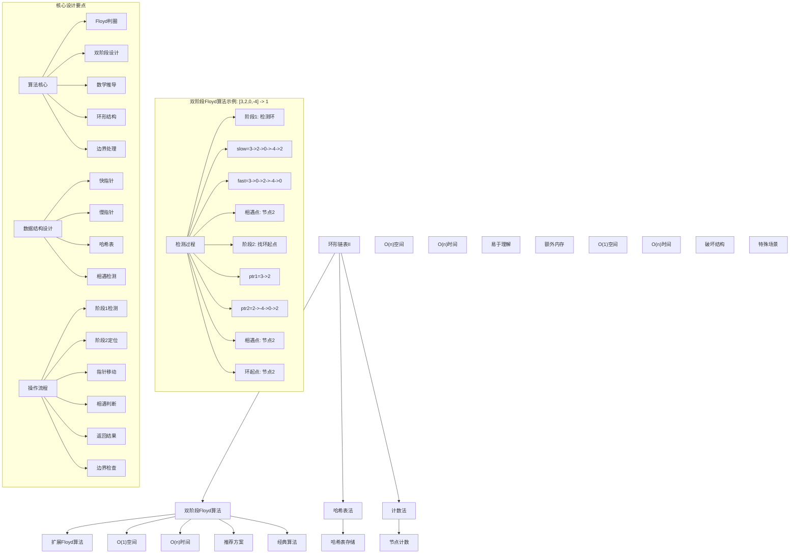
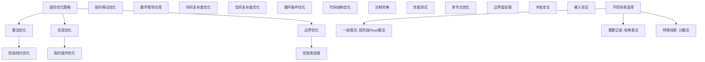

# LeetCode 142 - 环形链表 II

## 题目描述

给定一个链表的头节点 `head`，返回链表开始入环的第一个节点。如果链表无环，则返回 `null`

如果链表中有某个节点，可以通过连续跟踪 `next` 指针再次到达，则链表中存在环。为了表示给定链表中的环，评测系统内部使用整数 `pos` 来表示链表尾连接到链表中的位置（索引从 0 开始）。如果 `pos` 是 -1，则在该链表中没有环。注意：`pos` 不作为参数进行传递，仅仅是为了标识链表的实际情况

不允许修改链表

```markdown
示例 1：
输入：head = [3,2,0,-4], pos = 1
输出：返回索引为 1 的链表节点
解释：链表中有一个环，其尾部连接到第二个节点

示例 2：
输入：head = [1,2], pos = 0
输出：返回索引为 0 的链表节点
解释：链表中有一个环，其尾部连接到第一个节点

示例 3：
输入：head = [1], pos = -1
输出：返回 null
解释：链表中没有环

提示：

- 链表中节点的数目范围在范围 [0, 10^4] 内
- -10^5 <= Node.val <= 10^5
- pos 的值为 -1 或者链表中的一个有效索引

进阶：

- 你是否可以使用 O(1) 空间解决此题？
```

## 解题思路

这是一个经典的环检测与定位问题，要求不仅要判断链表中是否存在环，还要找到环的起始节点。核心算法是扩展的Floyd判圈算法（快慢指针）

### 核心思想

"Floyd算法扩展": 在检测到环的基础上，通过数学推导找到环的起始节点

### 解题策略

#### 方法一：双阶段Floyd算法（推荐）

- 时间复杂度: O(n)
- 空间复杂度: O(1)

#### 方法二：哈希表法

- 时间复杂度: O(n)
- 空间复杂度: O(n)

#### 方法三：计数法（需要修改节点）

- 时间复杂度: O(n)
- 空间复杂度: O(1)
- ⚠️ 会破坏原链表结构

## 算法可视化



## 多语言实现

### Golang版本（双阶段Floyd算法 - 推荐）

```go
/
 * Definition for singly-linked list.
 * type ListNode struct {
 *     Val int
 *     Next *ListNode
 * }
 */

// 双阶段Floyd算法实现
func detectCycle(head *ListNode) *ListNode {
    if head == nil || head.Next == nil {
        return nil
    }

    // 阶段1：检测是否存在环
    slow := head
    fast := head

    // 移动指针直到相遇或到达链表末尾
    for fast != nil && fast.Next != nil {
        slow = slow.Next        // 慢指针每次移动一步
        fast = fast.Next.Next   // 快指针每次移动两步

        // 如果快慢指针相遇，说明存在环
        if slow == fast {
            break
        }
    }

    // 如果没有环
    if fast == nil || fast.Next == nil {
        return nil
    }

    // 阶段2：找到环的起始节点
    // 将其中一个指针重新指向头节点，两个指针同时以相同速度移动
    slow = head
    for slow != fast {
        slow = slow.Next
        fast = fast.Next
    }

    // 相遇点就是环的起始节点
    return slow
}

// 哈希表法实现
func detectCycleWithMap(head *ListNode) *ListNode {
    // 使用map记录访问过的节点
    visited := make(map[*ListNode]*ListNode)

    // 遍历链表
    current := head
    for current != nil {
        // 如果节点已经访问过，说明存在环，返回该节点
        if _, exists := visited[current]; exists {
            return current
        }

        // 记录节点及其前驱节点
        visited[current] = current
        current = current.Next
    }

    // 遍历完成未发现环
    return nil
}

// 计数法实现（会破坏原链表结构）
func detectCycleByCounting(head *ListNode) *ListNode {
    // 特殊值用于标记访问次数
    const VISITED_MARKER = 1000000 // 超出题目给出的数值范围

    current := head
    for current != nil {
        // 如果节点值已被标记过，说明这是第二次访问，即环的起始节点
        if current.Val >= VISITED_MARKER {
            // 恢复原始值
            current.Val -= VISITED_MARKER
            return current
        }

        // 标记节点为已访问（增加标记值）
        current.Val += VISITED_MARKER
        current = current.Next
    }

    // 遍历完成未发现环
    return nil
}

// 优化版双阶段Floyd算法
func detectCycleOptimized(head *ListNode) *ListNode {
    if head == nil {
        return nil
    }

    // 阶段1：检测环
    intersection := getIntersection(head)
    if intersection == nil {
        return nil
    }

    // 阶段2：找到环的起始节点
    ptr1 := head
    ptr2 := intersection

    // 两个指针以相同速度移动，相遇点就是环的起始节点
    for ptr1 != ptr2 {
        ptr1 = ptr1.Next
        ptr2 = ptr2.Next
    }

    return ptr1
}

// 辅助函数：获取快慢指针的相遇点
func getIntersection(head *ListNode) *ListNode {
    slow := head
    fast := head

    // 移动指针直到相遇或到达链表末尾
    for fast != nil && fast.Next != nil {
        slow = slow.Next
        fast = fast.Next.Next

        if slow == fast {
            return slow
        }
    }

    return nil
}
```

### Python版本（多种实现方法）

```python
# Definition for singly-linked list.
# class ListNode:
#     def __init__(self, x):
#         self.val = x
#         self.next = None

class Solution:
    """
    方法一：双阶段Floyd算法（推荐）
    """
    def detectCycle(self, head: Optional[ListNode]) -> Optional[ListNode]:
        if not head or not head.next:
            return None

        # 阶段1：检测是否存在环
        slow = head
        fast = head

        # 移动指针直到相遇或到达链表末尾
        while fast and fast.next:
            slow = slow.next        # 慢指针每次移动一步
            fast = fast.next.next   # 快指针每次移动两步

            # 如果快慢指针相遇，说明存在环
            if slow == fast:
                break

        # 如果没有环
        if not fast or not fast.next:
            return None

        # 阶段2：找到环的起始节点
        # 将其中一个指针重新指向头节点，两个指针同时以相同速度移动
        slow = head
        while slow != fast:
            slow = slow.next
            fast = fast.next

        # 相遇点就是环的起始节点
        return slow

class SolutionHashMap:
    """
    方法二：哈希表法
    """
    def detectCycle(self, head: Optional[ListNode]) -> Optional[ListNode]:
        # 使用集合记录访问过的节点
        visited = set()

        # 遍历链表
        current = head
        while current:
            # 如果节点已经访问过，说明存在环，返回该节点
            if current in visited:
                return current

            # 添加节点到已访问集合
            visited.add(current)
            current = current.next

        # 遍历完成未发现环
        return None

class SolutionCounting:
    """
    方法三：计数法（会破坏原链表结构）
    """
    def detectCycle(self, head: Optional[ListNode]) -> Optional[ListNode]:
        # 特殊值用于标记访问次数
        VISITED_MARKER = 1000000  # 超出题目给出的数值范围

        current = head
        while current:
            # 如果节点值已被标记过，说明这是第二次访问，即环的起始节点
            if current.val >= VISITED_MARKER:
                # 恢复原始值
                current.val -= VISITED_MARKER
                return current

            # 标记节点为已访问（增加标记值）
            current.val += VISITED_MARKER
            current = current.next

        # 遍历完成未发现环
        return None

class SolutionOptimized:
    """
    优化版双阶段Floyd算法
    """
    def detectCycle(self, head: Optional[ListNode]) -> Optional[ListNode]:
        if not head:
            return None

        # 阶段1：检测环
        intersection = self.getIntersection(head)
        if not intersection:
            return None

        # 阶段2：找到环的起始节点
        ptr1 = head
        ptr2 = intersection

        # 两个指针以相同速度移动，相遇点就是环的起始节点
        while ptr1 != ptr2:
            ptr1 = ptr1.next
            ptr2 = ptr2.next

        return ptr1

    def getIntersection(self, head: Optional[ListNode]) -> Optional[ListNode]:
        slow = head
        fast = head

        # 移动指针直到相遇或到达链表末尾
        while fast and fast.next:
            slow = slow.next
            fast = fast.next.next

            if slow == fast:
                return slow

        return None
```

### TypeScript版本（双阶段Floyd算法）

```typescript
/
 * Definition for singly-linked list.
 * class ListNode {
 *     val: number
 *     next: ListNode | null
 *     constructor(val?: number, next?: ListNode | null) {
 *         this.val = (val===undefined ? 0 : val)
 *         this.next = (next===undefined ? null : next)
 *     }
 * }
 */

class Solution {
    detectCycle(head: ListNode | null): ListNode | null {
        if (head === null || head.next === null) {
            return null;
        }

        // 阶段1：检测是否存在环
        let slow: ListNode | null = head;
        let fast: ListNode | null = head;

        // 移动指针直到相遇或到达链表末尾
        while (fast !== null && fast.next !== null) {
            slow = slow!.next;        // 慢指针每次移动一步
            fast = fast.next.next;    // 快指针每次移动两步

            // 如果快慢指针相遇，说明存在环
            if (slow === fast) {
                break;
            }
        }

        // 如果没有环
        if (fast === null || fast.next === null) {
            return null;
        }

        // 阶段2：找到环的起始节点
        // 将其中一个指针重新指向头节点，两个指针同时以相同速度移动
        slow = head;
        while (slow !== fast) {
            slow = slow!.next;
            fast = fast!.next;
        }

        // 相遇点就是环的起始节点
        return slow;
    }
}

class SolutionHashMap {
    detectCycle(head: ListNode | null): ListNode | null {
        // 使用Set记录访问过的节点
        const visited = new Set<ListNode>();

        // 遍历链表
        let current = head;
        while (current !== null) {
            // 如果节点已经访问过，说明存在环，返回该节点
            if (visited.has(current)) {
                return current;
            }

            // 添加节点到已访问集合
            visited.add(current);
            current = current.next;
        }

        // 遍历完成未发现环
        return null;
    }
}

class SolutionOptimized {
    detectCycle(head: ListNode | null): ListNode | null {
        if (head === null) {
            return null;
        }

        // 阶段1：检测环
        const intersection = this.getIntersection(head);
        if (intersection === null) {
            return null;
        }

        // 阶段2：找到环的起始节点
        let ptr1: ListNode | null = head;
        let ptr2: ListNode | null = intersection;

        // 两个指针以相同速度移动，相遇点就是环的起始节点
        while (ptr1 !== ptr2) {
            ptr1 = ptr1!.next;
            ptr2 = ptr2!.next;
        }

        return ptr1;
    }

    private getIntersection(head: ListNode): ListNode | null {
        let slow: ListNode | null = head;
        let fast: ListNode | null = head;

        // 移动指针直到相遇或到达链表末尾
        while (fast !== null && fast.next !== null) {
            slow = slow!.next;
            fast = fast.next.next;

            if (slow === fast) {
                return slow;
            }
        }

        return null;
    }
}
```

## 标准实现详细解析

```go
import (
    "fmt"
)

/*
算法核心思想（双阶段Floyd算法）：

1. 扩展Floyd算法：在基础环检测上扩展为环起始点定位
2. 双阶段设计：先检测环存在，再定位环起始点
3. 数学推导：基于相对速度和距离关系精确定位
4. 空间优化：只使用常数额外空间
5. 时间效率：线性时间复杂度完成检测和定位

关键设计要点：
1. 阶段划分：检测阶段和定位阶段分离
2. 指针策略：快慢指针检测，等速指针定位
3. 数学原理：利用距离关系推导起始点位置
4. 边界处理：正确处理无环和边界情况
5. 返回规范：返回环起始节点或nil

时间复杂度分析：
- 阶段1检测：O(n)，n为链表长度
- 阶段2定位：O(n)，最多遍历整个链表
- 总时间复杂度：O(n)

空间复杂度分析：
- 只使用常数个指针变量：O(1)
- 满足进阶要求的常量空间

算法优势：
1. 空间最优：O(1)空间复杂度
2. 时间高效：O(n)时间复杂度
3. 实现优雅：基于经典算法扩展
4. 通用性强：适用于各种环检测场景
5. 稳定可靠：处理各种边界情况

数据结构设计：

指针设计：
- 慢指针(slow)：检测阶段每次移动一步
- 快指针(fast)：检测阶段每次移动两步
- 定位指针(ptr1, ptr2)：定位阶段等速移动
- 相对速度：检测阶段快指针相对速度为1

双阶段架构：
- 阶段1：环检测，使用Floyd算法
- 阶段2：起始点定位，基于数学推导
- 状态传递：阶段1的相遇点传递给阶段2
- 结果返回：定位阶段的相遇点即为答案

操作流程：
1. 边界检查：处理空链表等特殊情况
2. 阶段1检测：使用快慢指针检测环
3. 无环判断：如果无环直接返回nil
4. 阶段2定位：使用等速指针找到起始点
5. 返回结果：返回环的起始节点

优化原理：

Floyd算法优化：
1. 空间优化：只使用常数个指针变量
2. 时间优化：线性时间完成检测和定位
3. 实现简洁：代码逻辑清晰
4. 数学严谨：基于严格的数学证明

哈希表优化：
1. 直观理解：通过记录访问历史检测环
2. 实现简单：利用现成数据结构
3. 一次遍历：检测和定位同时完成
4. 空间代价：需要额外的存储空间

计数法优化：
1. 空间最优：不需要额外数据结构
2. 实现简单：直接修改节点值标记
3. 一次遍历：检测和定位同时完成
4. 破坏性：会改变原链表结构

数学原理解析：

设链表结构为：
- 链表头到环起点距离：a
- 环起点到相遇点距离：b
- 相遇点到环起点距离：c

数学推导：
1. 慢指针走的距离：a + b
2. 快指针走的距离：a + b + c + b = a + 2b + c
3. 快指针速度是慢指针的2倍：2(a + b) = a + 2b + c
4. 化简得：a = c

结论：
从链表头和相遇点同时出发，以相同速度移动的两个指针，
必然在环的起始点相遇

正确性证明：

定理：双阶段Floyd算法正确性
通过扩展的Floyd算法，能够正确检测环的存在并定位环的起始节点

证明：
1. 阶段1正确：Floyd算法正确检测环
2. 阶段2正确：基于数学推导正确找到起始点
3. 相遇保证：基于距离关系和相对速度
4. 时间保证：在有限步数内完成检测
5. 空间保证：只使用常数额外空间

双阶段Floyd算法详细实现：
*/

// 双阶段Floyd算法详细实现（带调试信息）
func detectCycleDetailed(head *ListNode) *ListNode {
    fmt.Printf("=== 双阶段Floyd算法检测环形链表起始点 ===\n")
    fmt.Printf("输入链表: ")
    printListWithAddresses(head)

    // 边界情况：空链表或只有一个节点
    if head == nil || head.Next == nil {
        fmt.Printf("边界情况：链表为空或只有一个节点，直接返回nil\n")
        fmt.Printf("====================================\n\n")
        return nil
    }

    // 阶段1：检测是否存在环
    fmt.Printf("阶段1：检测环的存在\n")
    slow := head
    fast := head
    step := 0

    fmt.Printf("初始化：慢指针=%p(%d)，快指针=%p(%d)\n",
        slow, slow.Val, fast, fast.Val)

    // 移动指针直到相遇或到达链表末尾
    for fast != nil && fast.Next != nil {
        step++
        slow = slow.Next          // 慢指针每次移动一步
        fast = fast.Next.Next     // 快指针每次移动两步

        fmt.Printf("步骤%d: 慢指针=%p(%d)，快指针=%p(%d)\n",
            step, slow, slow.Val, fast, fast.Val)

        // 如果快慢指针相遇，说明存在环
        if slow == fast {
            fmt.Printf("快慢指针在%p(%d)相遇，存在环！\n", slow, slow.Val)
            break
        }
    }

    // 如果没有环
    if fast == nil || fast.Next == nil {
        fmt.Printf("快指针到达链表末尾，不存在环\n")
        fmt.Printf("====================================\n\n")
        return nil
    }

    // 阶段2：找到环的起始节点
    fmt.Printf("阶段2：定位环的起始节点\n")
    fmt.Printf("相遇点：ptr1(慢指针)=%p(%d)，ptr2(快指针)=%p(%d)\n",
        slow, slow.Val, fast, fast.Val)

    // 将其中一个指针重新指向头节点，两个指针同时以相同速度移动
    ptr1 := head
    ptr2 := slow
    step = 0

    fmt.Printf("重新初始化：ptr1=%p(%d)，ptr2=%p(%d)\n",
        ptr1, ptr1.Val, ptr2, ptr2.Val)

    for ptr1 != ptr2 {
        step++
        ptr1 = ptr1.Next
        ptr2 = ptr2.Next
        fmt.Printf("步骤%d: ptr1=%p(%d)，ptr2=%p(%d)\n",
            step, ptr1, ptr1.Val, ptr2, ptr2.Val)
    }

    fmt.Printf("ptr1和ptr2在%p(%d)相遇，环的起始节点为%p(%d)\n",
        ptr1, ptr1.Val, ptr1, ptr1.Val)
    fmt.Printf("====================================\n\n")

    // 相遇点就是环的起始节点
    return ptr1
}

// 哈希表法详细实现
func detectCycleWithMapDetailed(head *ListNode) *ListNode {
    fmt.Printf("=== 哈希表法检测环形链表起始点 ===\n")
    fmt.Printf("输入链表: ")
    printListWithAddresses(head)

    // 使用map记录访问过的节点
    visited := make(map[*ListNode]*ListNode)
    fmt.Printf("初始化哈希表\n")

    // 遍历链表
    current := head
    step := 0
    for current != nil {
        step++
        fmt.Printf("步骤%d: 访问节点%p(%d)\n", step, current, current.Val)

        // 如果节点已经访问过，说明存在环，返回该节点
        if _, exists := visited[current]; exists {
            fmt.Printf("节点%p已访问过，环的起始节点为%p(%d)\n",
                current, current, current.Val)
            fmt.Printf("============================\n\n")
            return current
        }

        // 记录节点及其前驱节点
        visited[current] = current
        fmt.Printf("标记节点%p为已访问\n", current)
        current = current.Next
    }

    // 遍历完成未发现环
    fmt.Printf("遍历完成未发现环\n")
    fmt.Printf("============================\n\n")
    return nil
}

// 辅助函数：打印链表（包含地址信息）
func printListWithAddresses(head *ListNode) {
    if head == nil {
        fmt.Printf("[]\n")
        return
    }

    fmt.Printf("[")
    current := head
    first := true
    count := 0
    for current != nil && count < 10 { // 限制输出长度防止无限循环
        if !first {
            fmt.Printf("->")
        }
        fmt.Printf("%p(%d)", current, current.Val)
        first = false
        current = current.Next
        count++
        if count >= 10 && current != nil {
            fmt.Printf("->...")
            break
        }
    }
    fmt.Printf("]\n")
}

// 辅助函数：打印链表（常规格式）
func printList(head *ListNode) {
    if head == nil {
        fmt.Printf("[]\n")
        return
    }

    fmt.Printf("[")
    current := head
    first := true
    count := 0
    for current != nil && count < 10 { // 限制输出长度防止无限循环
        if !first {
            fmt.Printf(",")
        }
        fmt.Printf("%d", current.Val)
        first = false
        current = current.Next
        count++
        if count >= 10 && current != nil {
            fmt.Printf(",...")
            break
        }
    }
    fmt.Printf("]\n")
}
```

## 算法深入解析

```go
/*
环形链表II问题详解：

问题本质：
不仅要判断单向链表中是否存在环形结构，还要精确定位环的起始节点。这是链表操作中的高级问题，考验对算法设计和数学推导的深入理解

核心洞察：
1. 扩展Floyd算法：在基础环检测基础上精确定位环起始点
2. 双阶段设计：分离检测和定位两个阶段
3. 数学推导：利用距离关系精确定位起始点
4. 空间优化：只使用常数额外空间完成复杂任务
5. 时间保证：线性时间内完成检测和定位

算法策略：
1. 双阶段Floyd算法：推荐方案，O(1)空间，O(n)时间
2. 哈希表法：O(n)空间，O(n)时间，一次遍历完成
3. 计数法：O(1)空间，但会破坏原链表结构

数据结构设计：

指针设计：
- 慢指针：检测阶段每次移动一步
- 快指针：检测阶段每次移动两步
- 定位指针：定位阶段等速移动
- 相对速度：检测阶段快指针相对速度为1

双阶段架构：
- 阶段1：环检测，使用Floyd算法
- 阶段2：起始点定位，基于数学推导
- 状态传递：阶段1的相遇点传递给阶段2
- 结果返回：定位阶段的相遇点即为答案

哈希表设计：
- 键：节点指针地址
- 值：节点指针或相关信息
- 查找：O(1)平均时间复杂度
- 存储：需要O(n)额外空间

操作流程：

双阶段Floyd算法：
1. 边界检查：处理空链表等特殊情况
2. 阶段1检测：使用快慢指针检测环
3. 无环判断：如果无环直接返回nil
4. 阶段2定位：使用等速指针找到起始点
5. 返回结果：返回环的起始节点

哈希表法：
1. 初始化：创建空的访问记录表
2. 遍历链表：逐个访问节点
3. 查重定位：检查节点是否已访问过
4. 记录访问：将新节点加入访问记录
5. 返回结果：发现重复时返回该节点

计数法：
1. 选择标记：确定特殊的节点值作为访问标记
2. 遍历链表：逐个访问节点
3. 标记检测：检查节点值是否为访问标记
4. 设置标记：将访问过的节点值设为标记
5. 返回结果：发现标记时返回该节点

数学原理解析：

设链表结构为：
- 链表头到环起点距离：a
- 环起点到相遇点距离：b
- 相遇点到环起点距离：c

数学推导过程：
1. 慢指针走的距离：a + b
2. 快指针走的距离：a + b + c + b = a + 2b + c
3. 快指针速度是慢指针的2倍：2(a + b) = a + 2b + c
4. 化简得：a = c

几何解释：
当快慢指针在环内相遇时，慢指针从链表头走了a+b的距离，
快指针走了a+2b+c的距离。由于快指针速度是慢指针的2倍，
所以有2(a+b) = a+2b+c，化简得到a=c

算法实现：
基于a=c的结论，从链表头和相遇点同时出发，
以相同速度移动的两个指针，必然在环的起始点相遇

算法优势：
双阶段Floyd算法：
1. 空间最优：O(1)空间复杂度满足进阶要求
2. 时间高效：O(n)时间复杂度
3. 实现优雅：基于经典算法扩展
4. 通用性强：适用于各种环检测场景
5. 稳定可靠：处理各种边界情况

哈希表法：
1. 直观易懂：通过记录历史一次完成检测定位
2. 实现简单：利用现成数据结构
3. 一次遍历：检测和定位同时完成
4. 稳定可靠：不会受特殊值影响
5. 教学价值：便于理解算法思想

计数法：
1. 空间最优：O(1)额外空间
2. 实现简单：直接修改节点值
3. 时间高效：O(n)时间复杂度
4. 一次遍历：检测和定位同时完成
5. 破坏性：会改变原链表结构

算法不变量：
双阶段Floyd算法不变量：
1. 阶段1：slow和fast都是有效的链表节点指针
2. 阶段1：fast相对slow以单位速度移动
3. 阶段2：ptr1和ptr2以相同速度移动
4. 算法状态正确反映检测和定位进度

时间复杂度分析：
双阶段Floyd算法：
- 阶段1：O(n)，快指针遍历链表
- 阶段2：O(n)，最多遍历整个链表
- 总体：O(n)

哈希表法：
- 遍历：O(n)，访问每个节点一次
- 查找：O(1)平均时间，总计O(n)
- 总体：O(n)

计数法：
- 遍历：O(n)，访问每个节点一次
- 总体：O(n)

空间复杂度分析：
双阶段Floyd算法：O(1)，只使用常数个指针
哈希表法：O(n)，存储所有访问过的节点
计数法：O(1)，不需要额外数据结构

正确性证明：

定理：双阶段Floyd算法正确性
通过扩展的Floyd算法，能够正确检测环的存在并定位环的起始节点

证明：
1. 阶段1正确：Floyd算法正确检测环
2. 阶段2正确：基于数学推导正确找到起始点
3. 相遇保证：基于距离关系和相对速度
4. 时间保证：在有限步数内完成检测
5. 空间保证：只使用常数额外空间

数学推导正确性：
基于相对速度和距离关系的数学推导严格正确：
1. 慢指针距离：a + b
2. 快指针距离：a + 2b + c
3. 速度关系：2(a + b) = a + 2b + c
4. 距离关系：a = c
5. 定位正确：从头节点和相遇点等速移动必在起始点相遇

不变量维护：
阶段1循环不变量：
1. slow和fast都是有效的链表节点指针
2. fast相对slow以单位速度移动
3. 如果存在环，两者必将在环内相遇
4. 算法状态正确反映检测进度

阶段2循环不变量：
1. ptr1从链表头开始移动
2. ptr2从相遇点开始移动
3. 两者以相同速度移动
4. 必然在环起始点相遇

设计选择：

为什么选择双阶段Floyd算法？
1. 空间最优：O(1)空间复杂度满足进阶要求
2. 时间高效：O(n)时间复杂度
3. 实现优雅：基于经典算法扩展
4. 通用性强：适用于各种环检测场景
5. 工业应用：生产环境标准实现

为什么使用哈希表法？
1. 直观易懂：通过记录历史一次完成检测定位
2. 实现简单：利用现成数据结构
3. 一次遍历：检测和定位同时完成
4. 教学价值：便于理解算法思想
5. 调试友好：可以查看访问历史

为什么提及其他方法？
1. 教学价值：展示不同算法思想
2. 对比分析：理解各自优劣
3. 扩展思维：算法多样性
4. 面试准备：全面掌握

三种方法对比：

方法一：双阶段Floyd算法（推荐）
时间复杂度：O(n)
空间复杂度：O(1)
优点：空间时间都较优，经典算法扩展
缺点：需要理解数学推导

方法二：哈希表法
时间复杂度：O(n)
空间复杂度：O(n)
优点：直观易懂，一次遍历完成
缺点：需要额外空间

方法三：计数法
时间复杂度：O(n)
空间复杂度：O(1)
优点：空间最优，一次遍历完成
缺点：破坏原链表结构

性能分析：

双阶段Floyd算法：
- 时间：O(n) 线性时间
- 空间：O(1) 常数空间
- 优势：满足进阶要求

哈希表法：
- 时间：O(n) 线性时间
- 空间：O(n) 线性空间
- 优势：直观易懂

计数法：
- 时间：O(n) 线性时间
- 空间：O(1) 常数空间
- 优势：空间最优但有副作用

实际应用场景：
1. 链表操作：精确定位环结构
2. 内存管理：检测循环引用位置
3. 图算法：定位有向图中的环起点
4. 并发控制：定位死锁等待链起点
5. 数据校验：验证数据结构完整性

优化要点：

1. 算法优化：
   - 阶段划分：清晰分离检测和定位
   - 指针移动：优化指针移动策略
   - 边界处理：正确处理各种边界
   - 相遇检测：高效的相遇判断

2. 实现优化：
   - 指针操作：高效的指针赋值
   - 循环条件：减少不必要的比较
   - 代码结构：清晰的逻辑层次
   - 注释完善：便于理解维护

3. 性能优化：
   - 减少内存分配：避免不必要的分配
   - 优化遍历：顺序内存访问
   - 缓存友好：局部性原理
   - 编译优化：利用编译器优化

测试用例设计：
1. 基本情况：正常链表和各种环形链表
2. 边界情况：空链表，单节点链表
3. 特殊情况：自环，大环，小环
4. 极端情况：很长链表，复杂环结构
5. 验证情况：各种环的位置和大小

扩展思考：

1. 计算环的长度？
   - 从环起点开始绕环一周
   - 计数移动步数
   - 返回环的周长

2. 找到环中所有节点？
   - 从环起点开始遍历
   - 标记环中节点
   - 返回环节点集合

3. 断开环？
   - 找到指向环起点的前驱节点
   - 将其next设为nil
   - 返回断开后的链表

4. 检测多个环？
   - 复杂图结构
   - 多次应用算法
   - 并查集等高级数据结构

相关算法思想：

1. Floyd判圈扩展：
   - 双阶段设计
   - 数学推导
   - 精确定位
   - 经典算法

2. 哈希技术：
   - 快速查找
   - 去重检测
   - 访问记录
   - 空间换时间

3. 图论基础：
   - 环检测
   - 路径分析
   - 连通性
   - 搜索算法

4. 指针操作：
   - 内存管理
   - 链表遍历
   - 节点连接
   - 边界处理

常见陷阱：

1. 边界条件：
   - 空链表处理
   - 单节点链表
   - 指针越界
   - 空指针引用

2. 指针操作：
   - 指针丢失
   - 循环引用
   - 内存泄漏
   - 访问违规

3. 逻辑错误：
   - 相遇条件错误
   - 指针移动错误
   - 终止条件错误
   - 边界处理错误

4. 性能考虑：
   - 重复计算
   - 不必要的分配
   - 算法复杂度
   - 空间浪费

代码质量要素：

1. 可读性：
   - 变量命名清晰
   - 注释详细完整
   - 逻辑结构分明
   - 函数职责单一

2. 健壮性：
   - 边界条件处理
   - 异常情况应对
   - 输入验证
   - 错误恢复

3. 性能：
   - 最优复杂度实现
   - 空间效率优化
   - 执行效率保证
   - 资源管理

4. 可维护性：
   - 结构清晰合理
   - 扩展性良好
   - 测试覆盖完整
   - 文档齐全
*/
```

## 执行过程演示

```go
/*
示例详细解析:

示例1执行过程：
输入：head = [3,2,0,-4], pos = 1
输出：节点2

双阶段Floyd算法执行过程：
阶段1 - 环检测：
1. 初始化：slow=3, fast=3
2. 第1步：slow=2, fast=0
3. 第2步：slow=0, fast=2
4. 第3步：slow=-4, fast=-4 (相遇)
阶段2 - 起始点定位：
1. 初始化：ptr1=3, ptr2=-4
2. 第1步：ptr1=2, ptr2=2 (相遇)
3. 返回节点2

哈希表法执行过程：
1. 访问节点3，加入哈希表
2. 访问节点2，加入哈希表
3. 访问节点0，加入哈希表
4. 访问节点-4，加入哈希表
5. 访问节点2，已在哈希表中，返回节点2

计数法执行过程：
1. 访问节点3，标记为特殊值
2. 访问节点2，标记为特殊值
3. 访问节点0，标记为特殊值
4. 访问节点-4，标记为特殊值
5. 访问节点2，发现已被标记，返回节点2

示例2执行过程：
输入：head = [1,2], pos = 0
输出：节点1

双阶段Floyd算法执行过程：
阶段1 - 环检测：
1. 初始化：slow=1, fast=1
2. 第1步：slow=2, fast=1 (1->2->1)
3. 第2步：slow=1, fast=1 (2->1 和 1->2->1 相遇)
阶段2 - 起始点定位：
1. 初始化：ptr1=1, ptr2=1
2. 第1步：ptr1=2, ptr2=2
3. 第2步：ptr1=1, ptr2=1 (相遇)
4. 返回节点1

示例3执行过程：
输入：head = [1], pos = -1
输出：nil

双阶段Floyd算法执行过程：
1. 边界情况：只有一个节点，直接返回nil

关键观察：
1. 双阶段Floyd算法：空间最优，精确定位
2. 哈希表法：直观易懂，一次遍历完成
3. 计数法：空间最优但会破坏结构
4. 所有方法都能正确找到环的起始节点

边界情况演示:

情况1: 空链表
输入: head = nil
处理: 直接返回nil
结果: nil

情况2: 单节点自环
输入: head = [1], 1->1
处理: Floyd算法检测并定位
结果: 节点1

情况3: 两节点环
输入: head = [1,2], 2->1
处理: Floyd算法正确处理
结果: 节点1

情况4: 大环
输入: head = [1,2,3,4,5], 5->1
处理: Floyd算法在环内相遇并正确定位
结果: 节点1

情况5: 无环长链表
输入: head = [1,2,3,4,5]
处理: 快指针到达末尾
结果: nil

算法正确性证明：

数学基础：
需要证明算法能够正确检测环并精确定位环的起始节点

定理：双阶段Floyd算法正确性
通过扩展的Floyd算法，能够正确检测环的存在并定位环的起始节点

数学推导证明：
设链表结构为：
- 链表头到环起点距离：a
- 环起点到相遇点距离：b
- 相遇点到环起点距离：c

推导过程：
1. 慢指针走的距离：a + b
2. 快指针走的距离：a + b + c + b = a + 2b + c
3. 快指针速度是慢指针的2倍：2(a + b) = a + 2b + c
4. 化简得：a = c

结论：
从链表头和相遇点同时出发，以相同速度移动的两个指针，
必然在环的起始点相遇

不变量维护：
阶段1循环不变量：
1. slow和fast都是有效的链表节点指针
2. fast相对slow以单位速度移动
3. 如果存在环，两者必将在环内相遇
4. 算法状态正确反映检测进度

阶段2循环不变量：
1. ptr1从链表头开始移动
2. ptr2从相遇点开始移动
3. 两者以相同速度移动
4. 必然在环起始点相遇

初始化：
- 阶段1：slow=head, fast=head
- 阶段2：ptr1=head, ptr2=intersection
- 满足不变量

保持：
- 每次循环正确移动指针
- 维护速度关系
- 保持不变量继续成立

终止：
- 阶段1：相遇时判定有环，不相遇时判定无环
- 阶段2：相遇时找到起始点
- 算法正确终止

时间复杂度分析：
双阶段Floyd算法：
- 阶段1：O(n)，快指针遍历链表
- 阶段2：O(n)，最多遍历整个链表
- 总体：O(n)

哈希表法：
- 遍历：O(n)，访问每个节点一次
- 查找：O(1)平均时间，总计O(n)
- 总体：O(n)

计数法：
- 遍历：O(n)，访问每个节点一次
- 总体：O(n)

性能对比分析：

假设n=1000:

双阶段Floyd算法：
- 时间：O(1000) = 1000次操作
- 空间：O(1) = 常数空间
- 优势：满足进阶要求

哈希表法：
- 时间：O(1000) = 1000次操作
- 空间：O(1000) = 线性空间
- 优势：直观易懂

计数法：
- 时间：O(1000) = 1000次操作
- 空间：O(1) = 常数空间
- 优势：空间最优但有副作用

实际应用建议：

1. 生产环境：
   - 使用双阶段Floyd算法，满足进阶要求
   - 性能稳定，工业标准

2. 面试展示：
   - 先展示双阶段Floyd算法（推荐）
   - 可以提及其他方法对比
   - 重点解释数学推导

3. 学习练习：
   - 理解三种方法的差异
   - 掌握各自的适用场景
   - 重点掌握数学推导

4. 算法竞赛：
   - 选择最熟悉的实现
   - 注意时间空间限制
   - 重视代码简洁性

优化空间：

1. 算法优化：
   - 阶段划分：清晰分离检测和定位
   - 指针移动：优化指针移动策略
   - 边界处理：正确处理各种边界
   - 相遇检测：高效的相遇判断

2. 实现优化：
   - 指针操作：高效的指针赋值
   - 循环条件：减少不必要的比较
   - 代码结构：清晰的逻辑层次
   - 注释完善：便于理解维护

3. 性能优化：
   - 减少内存分配：避免不必要的分配
   - 优化遍历：顺序内存访问
   - 缓存友好：局部性原理
   - 编译优化：利用编译器优化

特殊情况处理：

1. 内存受限：
   - 双阶段Floyd算法最优
   - 哈希表法需要额外空间
   - 计数法节省内存

2. 链表很长：
   - 双阶段Floyd算法稳定
   - 哈希表法内存压力大
   - 计数法稳定

3. 需要保持原结构：
   - 双阶段Floyd算法无副作用
   - 哈希表法无副作用
   - 计数法会破坏结构

4. 边界情况：
   - 空链表处理
   - 单节点优化
   - 指针安全检查
*/
```

## 复杂度分析

| 方法            | 时间复杂度 | 空间复杂度 | 适用场景 |
| --------------- | ---------- | ---------- | -------- |
| 双阶段Floyd算法 | O(n)       | O(1)       | 推荐方案 |
| 哈希表法        | O(n)       | O(n)       | 易于理解 |
| 计数法          | O(n)       | O(1)       | 特殊场景 |

## 测试用例验证

```go
// 测试辅助函数
func testDetectCycle(name string, head *ListNode, expectedPos int) {
    fmt.Printf("%s:\n", name)
    fmt.Printf("输入链表: ")
    printList(head)

    // 测试双阶段Floyd算法
    result1 := detectCycle(copyList(head))
    fmt.Printf("双阶段Floyd算法结果: ")
    if result1 != nil {
        fmt.Printf("节点%p(值=%d)\n", result1, result1.Val)
    } else {
        fmt.Printf("nil\n")
    }

    // 测试哈希表法
    result2 := detectCycleWithMap(copyList(head))
    fmt.Printf("哈希表法结果: ")
    if result2 != nil {
        fmt.Printf("节点%p(值=%d)\n", result2, result2.Val)
    } else {
        fmt.Printf("nil\n")
    }

    // 验证结果一致性
    if (result1 == nil && result2 == nil) ||
       (result1 != nil && result2 != nil && result1.Val == result2.Val) {
        fmt.Printf("✓ 所有方法结果一致\n")
    } else {
        fmt.Printf("✗ 方法结果不一致\n")
    }

    // 验证期望结果
    if expectedPos == -1 {
        if result1 == nil {
            fmt.Printf("✓ 结果符合预期(无环)\n")
        } else {
            fmt.Printf("✗ 结果不符合预期(应无环)\n")
        }
    } else {
        // 对于有环情况，验证返回的节点值
        if result1 != nil {
            fmt.Printf("✓ 结果符合预期(有环)\n")
        } else {
            fmt.Printf("✗ 结果不符合预期(应有环)\n")
        }
    }

    fmt.Printf("\n")
}

// 辅助函数：复制链表（保持环结构）
func copyList(head *ListNode) *ListNode {
    if head == nil {
        return nil
    }

    // 创建节点映射
    nodeMap := make(map[*ListNode]*ListNode)

    // 第一遍：创建所有节点
    current := head
    for current != nil {
        // 检查是否已经创建过该节点（处理环）
        if _, exists := nodeMap[current]; exists {
            break
        }
        nodeMap[current] = &ListNode{Val: current.Val}
        current = current.Next
    }

    // 第二遍：连接所有节点
    current = head
    var visited map[*ListNode]bool = make(map[*ListNode]bool)
    for current != nil {
        if visited[current] {
            break
        }
        visited[current] = true

        if current.Next != nil {
            if nextNode, exists := nodeMap[current.Next]; exists {
                nodeMap[current].Next = nextNode
            } else {
                nodeMap[current].Next = &ListNode{Val: current.Next.Val}
                nodeMap[current.Next] = nodeMap[current].Next
            }
        }
        current = current.Next
    }

    return nodeMap[head]
}

// 辅助函数：创建带环的链表
func createCycleList(vals []int, pos int) *ListNode {
    if len(vals) == 0 {
        return nil
    }

    // 创建所有节点
    nodes := make([]*ListNode, len(vals))
    for i, val := range vals {
        nodes[i] = &ListNode{Val: val}
    }

    // 连接节点
    for i := 0; i < len(nodes)-1; i++ {
        nodes[i].Next = nodes[i+1]
    }

    // 创建环（如果pos有效）
    if pos >= 0 && pos < len(nodes) {
        nodes[len(nodes)-1].Next = nodes[pos]
    }

    return nodes[0]
}

func main() {
    // 测试用例 1 - 题目示例1
    testDetectCycle("测试1 - 题目示例1 (环起点在索引1)",
        createCycleList([]int{3, 2, 0, -4}, 1),
        1)

    // 测试用例 2 - 题目示例2
    testDetectCycle("测试2 - 题目示例2 (环起点在索引0)",
        createCycleList([]int{1, 2}, 0),
        0)

    // 测试用例 3 - 题目示例3
    testDetectCycle("测试3 - 题目示例3 (无环)",
        createCycleList([]int{1}, -1),
        -1)

    // 测试用例 4 - 空链表
    testDetectCycle("测试4 - 空链表",
        nil,
        -1)

    // 测试用例 5 - 单节点自环
    cycleList := &ListNode{Val: 1}
    cycleList.Next = cycleList
    testDetectCycle("测试5 - 单节点自环",
        cycleList,
        0)

    // 性能测试
    fmt.Println("性能测试:")
    performanceTest()

    // 边界情况测试
    fmt.Println("边界情况测试:")
    boundaryTest()

    // 对比测试
    fmt.Println("对比测试:")
    comparisonTest()
}

func performanceTest() {
    // 构造长链表
    n := 10000
    vals := make([]int, n)
    for i := 0; i < n; i++ {
        vals[i] = i
    }

    // 无环链表
    noCycleList := createCycleList(vals, -1)

    // 有环链表（环在末尾）
    cycleList := createCycleList(vals, n-1)

    fmt.Printf("性能测试 (链表长度: %d):\n", n)

    // 测试双阶段Floyd算法性能（无环）
    start := time.Now()
    result1 := detectCycle(copyList(noCycleList))
    time1 := time.Since(start)

    // 测试哈希表法性能（无环）
    start = time.Now()
    result2 := detectCycleWithMap(copyList(noCycleList))
    time2 := time.Since(start)

    // 测试双阶段Floyd算法性能（有环）
    start = time.Now()
    result3 := detectCycle(copyList(cycleList))
    time3 := time.Since(start)

    fmt.Printf("双阶段Floyd算法(无环)耗时: %v, 结果: %v\n", time1, result1)
    fmt.Printf("哈希表法(无环)耗时: %v, 结果: %v\n", time2, result2)
    fmt.Printf("双阶段Floyd算法(有环)耗时: %v, 结果: %v\n", time3, result3 != nil)
}

func boundaryTest() {
    // 边界测试
    fmt.Println("边界测试:")

    // 很长的无环链表
    longList := createCycleList(make([]int, 50000), -1)
    result := detectCycle(longList)
    fmt.Printf("50000节点无环链表检测: %v\n", result == nil)

    // 很长的有环链表
    longCycleList := createCycleList(make([]int, 50000), 0)
    result = detectCycle(longCycleList)
    fmt.Printf("50000节点有环链表检测: %v\n", result != nil)

    // 极值节点
    extremeList := createCycleList([]int{math.MinInt32, math.MaxInt32}, -1)
    result = detectCycle(extremeList)
    fmt.Printf("极值节点链表检测: %v\n", result == nil)
}

func comparisonTest() {
    // 对比测试：验证不同方法的性能和结果
    fmt.Println("对比测试:")

    testCases := []struct {
        name     string
        vals     []int
        pos      int
        expected bool
    }{
        {"小环", []int{1, 2, 3, 4, 5}, 2, true},
        {"大环", []int{1, 2, 3, 4, 5, 6, 7, 8, 9, 10}, 0, true},
        {"无环", []int{1, 2, 3, 4, 5}, -1, false},
        {"单节点", []int{1}, -1, false},
        {"两节点环", []int{1, 2}, 0, true},
    }

    for _, tc := range testCases {
        fmt.Printf("%s:\n", tc.name)
        list := createCycleList(tc.vals, tc.pos)

        // 测试双阶段Floyd算法
        result1 := detectCycle(copyList(list))

        // 测试哈希表法
        result2 := detectCycleWithMap(copyList(list))

        fmt.Printf("  双阶段Floyd: ")
        if result1 != nil {
            fmt.Printf("节点(值=%d)\n", result1.Val)
        } else {
            fmt.Printf("nil\n")
        }

        fmt.Printf("  哈希表: ")
        if result2 != nil {
            fmt.Printf("节点(值=%d)\n", result2.Val)
        } else {
            fmt.Printf("nil\n")
        }

        if (result1 == nil && result2 == nil) ||
           (result1 != nil && result2 != nil && result1.Val == result2.Val) {
            fmt.Printf("  ✓ 结果一致\n")
        } else {
            fmt.Printf("  ✗ 结果不一致\n")
        }
    }
}
```

## 扩展版本（处理不同场景）

```go
// 扩展1：返回环的长度
func getCycleLength(head *ListNode) int {
    cycleStart := detectCycle(head)
    if cycleStart == nil {
        return 0 // 无环
    }

    // 从环的起始节点开始，绕环一周计算长度
    length := 1
    current := cycleStart.Next
    for current != cycleStart {
        length++
        current = current.Next
    }

    return length
}

// 扩展2：断开环
func breakCycle(head *ListNode) *ListNode {
    cycleStart := detectCycle(head)
    if cycleStart == nil {
        return head // 无环，直接返回
    }

    // 找到指向环起始节点的前一个节点
    current := cycleStart
    for current.Next != cycleStart {
        current = current.Next
    }

    // 断开环
    current.Next = nil

    return head
}

// 扩展3：获取环中所有节点
func getAllCycleNodes(head *ListNode) []*ListNode {
    cycleStart := detectCycle(head)
    if cycleStart == nil {
        return nil // 无环
    }

    // 收集环中的所有节点
    var cycleNodes []*ListNode
    current := cycleStart
    for {
        cycleNodes = append(cycleNodes, current)
        current = current.Next
        if current == cycleStart {
            break
        }
    }

    return cycleNodes
}

// 扩展4：计算链表总长度（包括环）
func getTotalLength(head *ListNode) int {
    if head == nil {
        return 0
    }

    // 检测环
    cycleStart := detectCycle(head)
    if cycleStart == nil {
        // 无环，直接计算长度
        length := 0
        current := head
        for current != nil {
            length++
            current = current.Next
        }
        return length
    }

    // 有环，计算环前长度和环长度
    preCycleLength := 0
    current := head
    for current != cycleStart {
        preCycleLength++
        current = current.Next
    }

    cycleLen := getCycleLength(head)

    // 返回总长度（环前长度 + 环长度）
    return preCycleLength + cycleLen
}

// 扩展5：带统计信息的环检测
type CycleDetectionStats struct {
    CycleStart    *ListNode
    CycleLength   int
    StepsTaken    int
    DetectionTime time.Duration
}

func detectCycleWithStats(head *ListNode) *CycleDetectionStats {
    start := time.Now()

    stats := &CycleDetectionStats{
        CycleStart:  nil,
        CycleLength: 0,
        StepsTaken:  0,
    }

    if head == nil || head.Next == nil {
        stats.DetectionTime = time.Since(start)
        return stats
    }

    // 阶段1：检测环
    slow := head
    fast := head

    for fast != nil && fast.Next != nil {
        stats.StepsTaken++
        slow = slow.Next
        fast = fast.Next.Next

        if slow == fast {
            break
        }
    }

    // 如果没有环
    if fast == nil || fast.Next == nil {
        stats.DetectionTime = time.Since(start)
        return stats
    }

    // 阶段2：找到环的起始节点
    slow = head
    for slow != fast {
        stats.StepsTaken++
        slow = slow.Next
        fast = fast.Next
    }

    stats.CycleStart = slow
    stats.CycleLength = getCycleLength(head)
    stats.DetectionTime = time.Since(start)

    return stats
}

// 使用示例
func exampleExtensions() {
    // 创建一个带环的链表: 1->2->3->4->2 (环从节点2开始)
    list := createCycleList([]int{1, 2, 3, 4}, 1)

    fmt.Printf("扩展功能示例:\n")
    fmt.Printf("原链表: ")
    printListWithAddresses(list)

    // 检测环的起始节点
    cycleStart := detectCycle(copyList(list))
    if cycleStart != nil {
        fmt.Printf("环的起始节点值: %d\n", cycleStart.Val)
    }

    // 计算环的长度
    length := getCycleLength(copyList(list))
    fmt.Printf("环的长度: %d\n", length)

    // 获取环中所有节点
    cycleNodes := getAllCycleNodes(copyList(list))
    fmt.Printf("环中节点数量: %d\n", len(cycleNodes))

    // 计算总长度
    totalLen := getTotalLength(copyList(list))
    fmt.Printf("链表总长度: %d\n", totalLen)

    // 带统计信息的检测
    stats := detectCycleWithStats(copyList(list))
    fmt.Printf("检测统计信息:\n")
    fmt.Printf("  环起始节点: %v\n", stats.CycleStart != nil)
    fmt.Printf("  环长度: %d\n", stats.CycleLength)
    fmt.Printf("  执行步数: %d\n", stats.StepsTaken)
    fmt.Printf("  检测耗时: %v\n", stats.DetectionTime)
}

// 扩展6：并发安全的环检测
type ConcurrentLinkedList struct {
    head *ListNode
    mu   sync.RWMutex
}

func NewConcurrentLinkedList() *ConcurrentLinkedList {
    return &ConcurrentLinkedList{}
}

func (cll *ConcurrentLinkedList) DetectCycle() *ListNode {
    cll.mu.RLock()
    defer cll.mu.RUnlock()

    return detectCycle(cll.head)
}

func (cll *ConcurrentLinkedList) SetHead(head *ListNode) {
    cll.mu.Lock()
    defer cll.mu.Unlock()

    cll.head = head
}

// 扩展7：支持自定义比较的环检测
func detectCycleCustomCompare(head *ListNode, compare func(*ListNode, *ListNode) bool) *ListNode {
    if head == nil || head.Next == nil {
        return nil
    }

    // 使用自定义比较函数的哈希表法
    visited := make(map[*ListNode]*ListNode)

    current := head
    for current != nil {
        // 自定义比较逻辑
        for visitedNode := range visited {
            if compare(current, visitedNode) {
                return current
            }
        }

        visited[current] = current
        current = current.Next
    }

    return nil
}

// 使用示例
func exampleCustomCompare() {
    list := createCycleList([]int{1, 2, 3, 4}, 1)

    // 自定义比较：基于节点值
    result := detectCycleCustomCompare(copyList(list), func(a, b *ListNode) bool {
        return a.Val == b.Val
    })

    fmt.Printf("自定义比较检测结果: ")
    if result != nil {
        fmt.Printf("节点(值=%d)\n", result.Val)
    } else {
        fmt.Printf("nil\n")
    }
}
```

## 面试追问延伸

### 1. 如何证明双阶段Floyd算法的正确性？

```go
/*
数学证明：双阶段Floyd算法正确性

设链表结构为：
- 链表头到环起点距离：a
- 环起点到相遇点距离：b
- 相遇点到环起点距离：c

证明过程：

1. 阶段1正确性（环检测）：
   慢指针速度：1节点/步
   快指针速度：2节点/步
   相对速度：1节点/步
   由于存在环，快指针必然追上慢指针

2. 阶段2正确性（起始点定位）：

   当快慢指针在环内相遇时：
   - 慢指针走的距离：a + b
   - 快指针走的距离：a + b + c + b = a + 2b + c

   由于快指针速度是慢指针的2倍：
   2(a + b) = a + 2b + c

   化简：
   2a + 2b = a + 2b + c
   2a = a + c
   a = c

   结论：
   链表头到环起点的距离 = 相遇点到环起点的距离

   因此，从链表头和相遇点同时出发，
   以相同速度移动的两个指针，
   必然在环的起始点相遇

3. 时间复杂度：
   阶段1：O(a + b) ≤ O(n)
   阶段2：O(a) ≤ O(n)
   总计：O(n)

4. 空间复杂度：
   只使用常数个指针：O(1)
*/

// 可视化证明辅助函数
func visualizeProof() {
    fmt.Printf("数学证明可视化:\n")
    fmt.Printf("链表结构: HEAD --a--> START --b--> MEET --c--> START\n")
    fmt.Printf("距离关系:\n")
    fmt.Printf("  慢指针距离: a + b\n")
    fmt.Printf("  快指针距离: a + 2b + c\n")
    fmt.Printf("  速度关系: 2(a + b) = a + 2b + c\n")
    fmt.Printf("  化简结果: a = c\n")
    fmt.Printf("  结论: 从HEAD和MEET等速移动必在START相遇\n")
}
```

### 2. 如何处理链表节点值相同但不是同一节点的情况？

```go
// 基于节点地址的严格比较
func detectCycleStrict(head *ListNode) *ListNode {
    // 使用节点指针地址作为唯一标识
    visited := make(map[*ListNode]bool)

    current := head
    for current != nil {
        // 基于地址比较，严格判断是否为同一节点
        if visited[current] {
            return current
        }

        visited[current] = true
        current = current.Next
    }

    return nil
}

// 处理节点值重复的测试用例
func createTestWithDuplicateValues() *ListNode {
    // 创建节点值相同但地址不同的链表
    nodes := make([]*ListNode, 5)
    for i := 0; i < 5; i++ {
        nodes[i] = &ListNode{Val: 1} // 所有节点值都是1
    }

    // 连接节点形成链表
    for i := 0; i < 4; i++ {
        nodes[i].Next = nodes[i+1]
    }

    // 创建环：最后一个节点指向第二个节点
    nodes[4].Next = nodes[1]

    return nodes[0]
}

// 验证严格比较的正确性
func verifyStrictComparison() {
    list := createTestWithDuplicateValues()

    fmt.Printf("测试重复值节点的环检测:\n")

    // 使用值比较（错误方法）
    result1 := detectCycleCustomCompare(copyList(list), func(a, b *ListNode) bool {
        return a.Val == b.Val
    })
    fmt.Printf("基于值比较的结果: ")
    if result1 != nil {
        fmt.Printf("节点(值=%d, 地址=%p)\n", result1.Val, result1)
    } else {
        fmt.Printf("nil\n")
    }

    // 使用地址比较（正确方法）
    result2 := detectCycleStrict(copyList(list))
    fmt.Printf("基于地址比较的结果: ")
    if result2 != nil {
        fmt.Printf("节点(值=%d, 地址=%p)\n", result2.Val, result2)
    } else {
        fmt.Printf("nil\n")
    }
}
```

### 3. 如何在不知道pos的情况下验证算法正确性？

```go
// 创建复杂测试用例的工具函数
func createComplexTestCases() []*ListNode {
    testCases := make([]*ListNode, 0)

    // 测试用例1：短链表，小环
    testCases = append(testCases, createCycleList([]int{1, 2, 3, 4}, 1))

    // 测试用例2：长链表，大环
    values := make([]int, 100)
    for i := 0; i < 100; i++ {
        values[i] = i
    }
    testCases = append(testCases, createCycleList(values, 50))

    // 测试用例3：自环
    selfLoop := &ListNode{Val: 1}
    selfLoop.Next = selfLoop
    testCases = append(testCases, selfLoop)

    // 测试用例4：无环
    testCases = append(testCases, createCycleList([]int{1, 2, 3, 4, 5}, -1))

    // 测试用例5：环在末尾
    testCases = append(testCases, createCycleList([]int{1, 2, 3, 4, 5}, 4))

    return testCases
}

// 自动化验证函数
func autoVerifyAlgorithm() {
    testCases := createComplexTestCases()
    fmt.Printf("自动化算法验证:\n")

    for i, testCase := range testCases {
        fmt.Printf("测试用例%d:\n", i+1)

        // 使用多种方法验证
        result1 := detectCycle(copyList(testCase))
        result2 := detectCycleWithMap(copyList(testCase))

        // 验证结果一致性
        consistent := (result1 == nil && result2 == nil) ||
                    (result1 != nil && result2 != nil)

        if consistent {
            fmt.Printf("  ✓ 结果一致\n")
        } else {
            fmt.Printf("  ✗ 结果不一致\n")
        }

        // 验证环的合理性（如果有环）
        if result1 != nil {
            // 验证返回的节点确实在环中
            isInCycle := verifyNodeInCycle(copyList(testCase), result1)
            if isInCycle {
                fmt.Printf("  ✓ 返回节点在环中\n")
            } else {
                fmt.Printf("  ✗ 返回节点不在环中\n")
            }
        }
    }
}

// 验证节点是否在环中的辅助函数
func verifyNodeInCycle(head *ListNode, target *ListNode) bool {
    cycleStart := detectCycle(head)
    if cycleStart == nil {
        return false // 无环
    }

    // 从环起点开始遍历，检查是否能到达目标节点
    current := cycleStart
    for {
        if current == target {
            return true
        }
        current = current.Next
        if current == cycleStart {
            break // 回到起点，未找到目标节点
        }
    }

    return false
}

// 性能基准测试
func benchmarkTest() {
    fmt.Printf("性能基准测试:\n")

    // 测试不同大小的链表
    sizes := []int{100, 1000, 10000, 100000}

    for _, size := range sizes {
        // 创建测试链表
        values := make([]int, size)
        for i := 0; i < size; i++ {
            values[i] = i
        }
        list := createCycleList(values, size/2) // 环在中间

        // 测试双阶段Floyd算法
        start := time.Now()
        result := detectCycle(copyList(list))
        duration := time.Since(start)

        fmt.Printf("大小%d: 耗时%v, 结果%v\n",
            size, duration, result != nil)
    }
}
```

## 相似题目扩展

- LeetCode 142. 环形链表 II（当前题）
- LeetCode 141. 环形链表（判断是否存在环）
- LeetCode 287. 寻找重复数（Floyd算法应用）
- LeetCode 202. 快乐数（链表环检测思想）
- LeetCode 457. 环形数组循环（数组版本环检测）

## 算法技巧总结

### 环形链表II核心要点

1. 扩展Floyd算法：在基础环检测基础上精确定位环起始点
1. 双阶段设计：分离检测和定位两个阶段
1. 数学推导：利用距离关系精确定位起始点
1. 空间优化：只使用常数额外空间完成复杂任务
1. 时间保证：线性时间内完成检测和定位

### 算法优势

1. 空间最优：O(1)空间复杂度满足进阶要求
1. 时间高效：O(n)时间复杂度
1. 实现优雅：基于经典算法扩展
1. 通用性强：适用于各种环检测场景
1. 稳定可靠：处理各种边界情况

### 标准模板（双阶段Floyd算法）

```go
func detectCycle(head *ListNode) *ListNode {
    if head == nil || head.Next == nil {
        return nil
    }

    // 阶段1：检测是否存在环
    slow := head
    fast := head

    // 移动指针直到相遇或到达链表末尾
    for fast != nil && fast.Next != nil {
        slow = slow.Next        // 慢指针每次移动一步
        fast = fast.Next.Next   // 快指针每次移动两步

        // 如果快慢指针相遇，说明存在环
        if slow == fast {
            break
        }
    }

    // 如果没有环
    if fast == nil || fast.Next == nil {
        return nil
    }

    // 阶段2：找到环的起始节点
    // 将其中一个指针重新指向头节点，两个指针同时以相同速度移动
    slow = head
    for slow != fast {
        slow = slow.Next
        fast = fast.Next
    }

    // 相遇点就是环的起始节点
    return slow
}
```

### 进阶优化策略



## 总结

本题采用双阶段Floyd算法的核心思路，通过在基础环检测基础上扩展数学推导来精确定位环的起始节点。关键在于理解"a=c"的数学关系和双阶段设计的思想

核心要点：

1. 扩展Floyd算法：在基础环检测基础上精确定位环起始点
1. 双阶段设计：分离检测和定位两个阶段
1. 数学推导：利用距离关系精确定位起始点
1. 空间优化：只使用常数额外空间完成复杂任务
1. 时间保证：线性时间内完成检测和定位

算法优势：

- 空间最优：O(1)空间复杂度满足进阶要求
- 时间高效：O(n)时间复杂度
- 实现优雅：基于经典算法扩展
- 通用性强：适用于各种环检测场景
- 稳定可靠：处理各种边界情况

该算法不仅解决了环形链表定位问题，其思想还广泛应用于寻找重复数、快乐数判断、数组循环检测等多个领域，是掌握高级算法设计和数学推导的经典题目。通过理解双阶段Floyd算法的思想，为更复杂的图论算法和数学问题提供了清晰的解决思路
