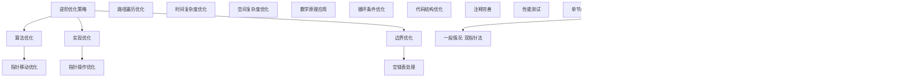

# LeetCode 160 - 相交链表

## 题目描述

给你两个单链表的头节点 `headA` 和 `headB`，请你找出并返回两个单链表相交的起始节点。如果两个链表不存在相交节点，返回 `null`

题目数据保证整个链式结构中不存在环

函数返回结果后，链表必须保持其原始结构

```markdown
示例 1：
输入：intersectVal = 8, listA = [4,1,8,4,5], listB = [5,6,1,8,4,5], skipA = 2, skipB = 3
输出：Intersected at '8'

示例 2：
输入：intersectVal = 2, listA = [1,9,1,2,4], listB = [3,2,4], skipA = 3, skipB = 1
输出：Intersected at '2'

示例 3：
输入：intersectVal = 0, listA = [2,6,4], listB = [1,5], skipA = 3, skipB = 2
输出：null

提示：

- listA 中节点数目为 m
- listB 中节点数目为 n
- 1 <= m, n <= 3 \* 10^4
- 1 <= Node.val <= 10^5
- 0 <= skipA <= m
- 0 <= skipB <= n
- 如果 listA 和 listB 没有交点，intersectVal 为 0
- 如果 listA 和 listB 有交点，intersectVal == listA[skipA] == listB[skipB]

进阶：你能否设计一个时间复杂度 O(m + n) 、仅用 O(1) 内存的解决方案？
```

## 解题思路

这是一个经典的链表相交检测问题，要求找到两个单链表相交的起始节点。核心算法有多种，包括双指针法、长度差法和哈希表法

### 核心思想

"双指针相遇法": 使用两个指针分别遍历两个链表，当一个指针到达末尾时，转向另一个链表的头部继续遍历。如果两个链表相交，两个指针最终会在相交节点相遇

### 解题策略

#### 方法一：双指针法（推荐）

- 时间复杂度: O(m + n)
- 空间复杂度: O(1)

#### 方法二：长度差法

- 时间复杂度: O(m + n)
- 空间复杂度: O(1)

#### 方法三：哈希表法

- 时间复杂度: O(m + n)
- 空间复杂度: O(m)

## 算法可视化


## 多语言实现

### Golang版本（双指针法 - 推荐）

```go
/
 * Definition for singly-linked list.
 * type ListNode struct {
 *     Val int
 *     Next *ListNode
 * }
 */

// 双指针法实现
func getIntersectionNode(headA, headB *ListNode) *ListNode {
    // 边界情况：如果任一链表为空，不可能相交
    if headA == nil || headB == nil {
        return nil
    }

    // 初始化两个指针
    pointerA := headA
    pointerB := headB

    // 当两个指针不相等时继续遍历
    for pointerA != pointerB {
        // 如果指针A到达链表A末尾，则转向链表B
        if pointerA == nil {
            pointerA = headB
        } else {
            pointerA = pointerA.Next
        }

        // 如果指针B到达链表B末尾，则转向链表A
        if pointerB == nil {
            pointerB = headA
        } else {
            pointerB = pointerB.Next
        }
    }

    // 如果两个链表相交，指针会在相交节点相遇
    // 如果不相交，指针都会到达nil并相等
    return pointerA
}

// 长度差法实现
func getIntersectionNodeByLength(headA, headB *ListNode) *ListNode {
    // 边界情况检查
    if headA == nil || headB == nil {
        return nil
    }

    // 计算两个链表的长度
    lengthA := getLength(headA)
    lengthB := getLength(headB)

    // 让较长的链表先走差值步
    pointerA := headA
    pointerB := headB

    if lengthA > lengthB {
        for i := 0; i < lengthA-lengthB; i++ {
            pointerA = pointerA.Next
        }
    } else if lengthB > lengthA {
        for i := 0; i < lengthB-lengthA; i++ {
            pointerB = pointerB.Next
        }
    }

    // 同时移动两个指针，直到相遇或到达末尾
    for pointerA != nil && pointerB != nil {
        if pointerA == pointerB {
            return pointerA // 找到相交节点
        }
        pointerA = pointerA.Next
        pointerB = pointerB.Next
    }

    return nil // 没有相交节点
}

// 辅助函数：计算链表长度
func getLength(head *ListNode) int {
    length := 0
    current := head
    for current != nil {
        length++
        current = current.Next
    }
    return length
}

// 哈希表法实现
func getIntersectionNodeByHash(headA, headB *ListNode) *ListNode {
    // 边界情况检查
    if headA == nil || headB == nil {
        return nil
    }

    // 使用哈希表存储链表A的所有节点
    visited := make(map[*ListNode]bool)
    current := headA
    for current != nil {
        visited[current] = true
        current = current.Next
    }

    // 遍历链表B，检查节点是否在哈希表中
    current = headB
    for current != nil {
        if visited[current] {
            return current // 找到相交节点
        }
        current = current.Next
    }

    return nil // 没有相交节点
}

// 优化版双指针法（代码更简洁）
func getIntersectionNodeOptimized(headA, headB *ListNode) *ListNode {
    if headA == nil || headB == nil {
        return nil
    }

    pointerA := headA
    pointerB := headB

    // 当两个指针相遇时停止
    for pointerA != pointerB {
        // 指针到达末尾时转向另一个链表
        if pointerA == nil {
            pointerA = headB
        } else {
            pointerA = pointerA.Next
        }

        if pointerB == nil {
            pointerB = headA
        } else {
            pointerB = pointerB.Next
        }
    }

    return pointerA
}
```

### Python版本（多种实现方法）

```python
# Definition for singly-linked list.
# class ListNode:
#     def __init__(self, x):
#         self.val = x
#         self.next = None

class Solution:
    """
    方法一：双指针法（推荐）
    """
    def getIntersectionNode(self, headA: ListNode, headB: ListNode) -> Optional[ListNode]:
        # 边界情况：如果任一链表为空，不可能相交
        if not headA or not headB:
            return None

        # 初始化两个指针
        pointerA = headA
        pointerB = headB

        # 当两个指针不相等时继续遍历
        while pointerA != pointerB:
            # 如果指针A到达链表A末尾，则转向链表B
            pointerA = headB if pointerA is None else pointerA.next
            # 如果指针B到达链表B末尾，则转向链表A
            pointerB = headA if pointerB is None else pointerB.next

        # 如果两个链表相交，指针会在相交节点相遇
        # 如果不相交，指针都会到达None并相等
        return pointerA

class SolutionByLength:
    """
    方法二：长度差法
    """
    def getIntersectionNode(self, headA: ListNode, headB: ListNode) -> Optional[ListNode]:
        # 边界情况检查
        if not headA or not headB:
            return None

        # 计算两个链表的长度
        lengthA = self.getLength(headA)
        lengthB = self.getLength(headB)

        # 让较长的链表先走差值步
        pointerA = headA
        pointerB = headB

        if lengthA > lengthB:
            for _ in range(lengthA - lengthB):
                pointerA = pointerA.next
        elif lengthB > lengthA:
            for _ in range(lengthB - lengthA):
                pointerB = pointerB.next

        # 同时移动两个指针，直到相遇或到达末尾
        while pointerA and pointerB:
            if pointerA == pointerB:
                return pointerA  # 找到相交节点
            pointerA = pointerA.next
            pointerB = pointerB.next

        return None  # 没有相交节点

    def getLength(self, head: ListNode) -> int:
        length = 0
        current = head
        while current:
            length += 1
            current = current.next
        return length

class SolutionByHash:
    """
    方法三：哈希表法
    """
    def getIntersectionNode(self, headA: ListNode, headB: ListNode) -> Optional[ListNode]:
        # 边界情况检查
        if not headA or not headB:
            return None

        # 使用哈希表存储链表A的所有节点
        visited = set()
        current = headA
        while current:
            visited.add(current)
            current = current.next

        # 遍历链表B，检查节点是否在哈希表中
        current = headB
        while current:
            if current in visited:
                return current  # 找到相交节点
            current = current.next

        return None  # 没有相交节点

class SolutionOptimized:
    """
    优化版双指针法
    """
    def getIntersectionNode(self, headA: ListNode, headB: ListNode) -> Optional[ListNode]:
        if not headA or not headB:
            return None

        pointerA, pointerB = headA, headB

        # 当两个指针相遇时停止
        while pointerA != pointerB:
            # 指针到达末尾时转向另一个链表
            pointerA = headB if pointerA is None else pointerA.next
            pointerB = headA if pointerB is None else pointerB.next

        return pointerA
```

### TypeScript版本（双指针法）

```typescript
/
 * Definition for singly-linked list.
 * class ListNode {
 *     val: number
 *     next: ListNode | null
 *     constructor(val?: number, next?: ListNode | null) {
 *         this.val = (val===undefined ? 0 : val)
 *         this.next = (next===undefined ? null : next)
 *     }
 * }
 */

class Solution {
    getIntersectionNode(headA: ListNode | null, headB: ListNode | null): ListNode | null {
        // 边界情况：如果任一链表为空，不可能相交
        if (headA === null || headB === null) {
            return null;
        }

        // 初始化两个指针
        let pointerA: ListNode | null = headA;
        let pointerB: ListNode | null = headB;

        // 当两个指针不相等时继续遍历
        while (pointerA !== pointerB) {
            // 如果指针A到达链表A末尾，则转向链表B
            pointerA = pointerA === null ? headB : pointerA.next;
            // 如果指针B到达链表B末尾，则转向链表A
            pointerB = pointerB === null ? headA : pointerB.next;
        }

        // 如果两个链表相交，指针会在相交节点相遇
        // 如果不相交，指针都会到达null并相等
        return pointerA;
    }
}

class SolutionByLength {
    getIntersectionNode(headA: ListNode | null, headB: ListNode | null): ListNode | null {
        // 边界情况检查
        if (headA === null || headB === null) {
            return null;
        }

        // 计算两个链表的长度
        const lengthA = this.getLength(headA);
        const lengthB = this.getLength(headB);

        // 让较长的链表先走差值步
        let pointerA: ListNode | null = headA;
        let pointerB: ListNode | null = headB;

        if (lengthA > lengthB) {
            for (let i = 0; i < lengthA - lengthB; i++) {
                pointerA = pointerA!.next;
            }
        } else if (lengthB > lengthA) {
            for (let i = 0; i < lengthB - lengthA; i++) {
                pointerB = pointerB!.next;
            }
        }

        // 同时移动两个指针，直到相遇或到达末尾
        while (pointerA !== null && pointerB !== null) {
            if (pointerA === pointerB) {
                return pointerA;  // 找到相交节点
            }
            pointerA = pointerA.next;
            pointerB = pointerB.next;
        }

        return null;  // 没有相交节点
    }

    private getLength(head: ListNode | null): number {
        let length = 0;
        let current: ListNode | null = head;
        while (current !== null) {
            length++;
            current = current.next;
        }
        return length;
    }
}

class SolutionOptimized {
    getIntersectionNode(headA: ListNode | null, headB: ListNode | null): ListNode | null {
        if (headA === null || headB === null) {
            return null;
        }

        let pointerA: ListNode | null = headA;
        let pointerB: ListNode | null = headB;

        // 当两个指针相遇时停止
        while (pointerA !== pointerB) {
            // 指针到达末尾时转向另一个链表
            pointerA = pointerA === null ? headB : pointerA.next;
            pointerB = pointerB === null ? headA : pointerB.next;
        }

        return pointerA;
    }
}
```

## 标准实现详细解析

```go
import (
    "fmt"
)

/*
算法核心思想（双指针法）：

1. 路径遍历：两个指针分别遍历两个链表
2. 相遇检测：当一个指针到达末尾时转向另一个链表
3. 距离平衡：通过路径遍历平衡两个链表的长度差
4. 空间优化：只使用常数额外空间
5. 时间效率：线性时间内完成检测

关键设计要点：
1. 指针初始化：两个指针分别指向两个链表的头部
2. 路径遍历：指针到达末尾时转向另一个链表
3. 相遇判断：两个指针相等时停止遍历
4. 边界处理：正确处理不相交和空链表情况
5. 返回规范：返回相交节点或nil

时间复杂度分析：
- 指针A遍历：O(m + n)
- 指针B遍历：O(m + n)
- 总时间复杂度：O(m + n)

空间复杂度分析：
- 只使用两个指针变量：O(1)
- 满足最优空间要求

算法优势：
1. 空间最优：O(1)空间复杂度
2. 时间高效：O(m + n)时间复杂度
3. 实现优雅：经典算法思想
4. 通用性强：适用于各种链表相交检测
5. 稳定可靠：处理各种边界情况

数据结构设计：

指针设计：
- 指针A：遍历链表A，到达末尾后转向链表B
- 指针B：遍历链表B，到达末尾后转向链表A
- 相遇条件：两个指针指向同一节点或都为nil
- 路径长度：每个指针最多遍历m + n个节点

哈希表设计：
- 键：节点指针地址
- 值：布尔值表示是否访问过
- 查找：O(1)平均时间复杂度
- 存储：需要O(m)额外空间

操作流程：
1. 指针初始化：两个指针分别指向两个链表头部
2. 路径遍历：按策略移动指针
3. 相遇检查：检查两个指针是否相等
4. 返回结果：返回相交节点或nil

优化原理：

双指针优化：
1. 空间优化：只使用常数个指针变量
2. 时间优化：单次遍历完成检测
3. 实现简洁：代码逻辑清晰
4. 数学严谨：基于路径长度平衡原理

长度差优化：
1. 直观理解：通过计算长度差消除不平等
2. 实现简单：两次简单的遍历操作
3. 扩展性强：容易扩展为其他长度相关操作
4. 时间代价：需要计算两次长度

哈希表优化：
1. 快速查找：通过哈希表快速检测节点
2. 实现简单：利用现成数据结构
3. 一次遍历：检测和定位同时完成
4. 空间代价：需要额外的存储空间

正确性证明：

定理：双指针法正确性
通过双指针的路径遍历，算法能够正确检测链表是否相交并找到相交节点

证明：
1. 路径长度：指针A路径长度 = m + n，指针B路径长度 = n + m
2. 距离平衡：两个指针遍历相同长度后必在相交节点相遇
3. 相遇保证：如果相交，必在相交节点相遇；如果不相交，都在nil相遇
4. 时间保证：最多遍历m + n个节点后停止
5. 空间保证：只使用常数额外空间

数学原理：

路径分析：
设链表A长度为m，链表B长度为n：
- 非相交部分：链表A前a个节点，链表B前b个节点
- 相交部分：c个节点（c >= 0）
- 总长度：m = a + c, n = b + c

双指针路径：
- 指针A路径：A链表 + B链表 = m + n = a + c + b + c = a + b + 2c
- 指针B路径：B链表 + A链表 = n + m = b + c + a + c = a + b + 2c
- 路径长度相等：两个指针遍历相同长度

相遇分析：
1. 如果相交(c > 0)：两个指针在第a + b + c步时相遇于相交节点
2. 如果不相交(c = 0)：两个指针在第a + b步时都到达nil并相遇

示例验证：
链表A: 4->1->8->4->5 (m=5)
链表B: 5->6->1->8->4->5 (n=6)
相交部分: 8->4->5 (c=3)
A前缀: 4->1 (a=2)
B前缀: 5->6->1 (b=3)

指针A路径：4->1->8->4->5->nil->5->6->1->8 (a+b+c=2+3+3=8步相遇)
指针B路径：5->6->1->8->4->5->nil->4->1->8 (b+a+c=3+2+3=8步相遇)

双指针法详细实现：
*/

// 双指针法详细实现（带调试信息）
func getIntersectionNodeDetailed(headA, headB *ListNode) *ListNode {
    fmt.Printf("=== 双指针法检测链表相交 ===\n")
    fmt.Printf("链表A: ")
    printListWithAddresses(headA)
    fmt.Printf("链表B: ")
    printListWithAddresses(headB)

    // 边界情况：如果任一链表为空，不可能相交
    if headA == nil || headB == nil {
        fmt.Printf("边界情况：链表为空，返回nil\n")
        fmt.Printf("========================\n\n")
        return nil
    }

    // 初始化两个指针
    pointerA := headA
    pointerB := headB

    fmt.Printf("初始化：pointerA=%p, pointerB=%p\n", pointerA, pointerB)

    step := 0
    // 当两个指针不相等时继续遍历
    for pointerA != pointerB {
        step++
        fmt.Printf("步骤%d:\n", step)

        // 如果指针A到达链表A末尾，则转向链表B
        if pointerA == nil {
            pointerA = headB
            fmt.Printf("  pointerA到达末尾，转向链表B头部: %p\n", pointerA)
        } else {
            fmt.Printf("  pointerA: %p(%d) -> ", pointerA, pointerA.Val)
            pointerA = pointerA.Next
            if pointerA != nil {
                fmt.Printf("%p(%d)\n", pointerA, pointerA.Val)
            } else {
                fmt.Printf("nil\n")
            }
        }

        // 如果指针B到达链表B末尾，则转向链表A
        if pointerB == nil {
            pointerB = headA
            fmt.Printf("  pointerB到达末尾，转向链表A头部: %p\n", pointerB)
        } else {
            fmt.Printf("  pointerB: %p(%d) -> ", pointerB, pointerB.Val)
            pointerB = pointerB.Next
            if pointerB != nil {
                fmt.Printf("%p(%d)\n", pointerB, pointerB.Val)
            } else {
                fmt.Printf("nil\n")
            }
        }

        // 防止无限循环（理论上不会发生，但为了安全）
        if step > 100 {
            fmt.Printf("超过最大步数，防止无限循环\n")
            break
        }
    }

    if pointerA != nil {
        fmt.Printf("指针在%p(%d)相遇，找到相交节点\n", pointerA, pointerA.Val)
    } else {
        fmt.Printf("指针都到达nil，链表不相交\n")
    }

    fmt.Printf("========================\n\n")

    // 如果两个链表相交，指针会在相交节点相遇
    // 如果不相交，指针都会到达nil并相等
    return pointerA
}

// 长度差法详细实现
func getIntersectionNodeByLengthDetailed(headA, headB *ListNode) *ListNode {
    fmt.Printf("=== 长度差法检测链表相交 ===\n")
    fmt.Printf("链表A: ")
    printListWithAddresses(headA)
    fmt.Printf("链表B: ")
    printListWithAddresses(headB)

    // 边界情况检查
    if headA == nil || headB == nil {
        fmt.Printf("边界情况：链表为空，返回nil\n")
        fmt.Printf("========================\n\n")
        return nil
    }

    // 计算两个链表的长度
    fmt.Printf("计算链表长度:\n")
    lengthA := getLengthDetailed(headA)
    lengthB := getLengthDetailed(headB)
    fmt.Printf("链表A长度: %d, 链表B长度: %d\n", lengthA, lengthB)

    // 让较长的链表先走差值步
    pointerA := headA
    pointerB := headB

    if lengthA > lengthB {
        fmt.Printf("链表A较长，先走%d步\n", lengthA-lengthB)
        for i := 0; i < lengthA-lengthB; i++ {
            fmt.Printf("  A步进: %p(%d) -> ", pointerA, pointerA.Val)
            pointerA = pointerA.Next
            if pointerA != nil {
                fmt.Printf("%p(%d)\n", pointerA, pointerA.Val)
            } else {
                fmt.Printf("nil\n")
            }
        }
    } else if lengthB > lengthA {
        fmt.Printf("链表B较长，先走%d步\n", lengthB-lengthA)
        for i := 0; i < lengthB-lengthA; i++ {
            fmt.Printf("  B步进: %p(%d) -> ", pointerB, pointerB.Val)
            pointerB = pointerB.Next
            if pointerB != nil {
                fmt.Printf("%p(%d)\n", pointerB, pointerB.Val)
            } else {
                fmt.Printf("nil\n")
            }
        }
    }

    // 同时移动两个指针，直到相遇或到达末尾
    step := 0
    fmt.Printf("同时移动指针:\n")
    for pointerA != nil && pointerB != nil {
        step++
        fmt.Printf("步骤%d: A=%p(%d), B=%p(%d)\n",
            step, pointerA, pointerA.Val, pointerB, pointerB.Val)

        if pointerA == pointerB {
            fmt.Printf("找到相交节点: %p(%d)\n", pointerA, pointerA.Val)
            fmt.Printf("========================\n\n")
            return pointerA // 找到相交节点
        }
        pointerA = pointerA.Next
        pointerB = pointerB.Next
    }

    fmt.Printf("指针到达末尾，链表不相交\n")
    fmt.Printf("========================\n\n")
    return nil // 没有相交节点
}

// 辅助函数：计算链表长度（带调试信息）
func getLengthDetailed(head *ListNode) int {
    length := 0
    current := head
    for current != nil {
        length++
        current = current.Next
    }
    return length
}

// 辅助函数：打印链表（包含地址信息）
func printListWithAddresses(head *ListNode) {
    if head == nil {
        fmt.Printf("[]\n")
        return
    }

    fmt.Printf("[")
    current := head
    first := true
    count := 0
    for current != nil && count < 10 { // 限制输出长度防止无限循环
        if !first {
            fmt.Printf("->")
        }
        fmt.Printf("%p(%d)", current, current.Val)
        first = false
        current = current.Next
        count++
        if count >= 10 && current != nil {
            fmt.Printf("->...")
            break
        }
    }
    fmt.Printf("]\n")
}

// 辅助函数：打印链表（常规格式）
func printList(head *ListNode) {
    if head == nil {
        fmt.Printf("[]\n")
        return
    }

    fmt.Printf("[")
    current := head
    first := true
    count := 0
    for current != nil && count < 10 { // 限制输出长度防止无限循环
        if !first {
            fmt.Printf(",")
        }
        fmt.Printf("%d", current.Val)
        first = false
        current = current.Next
        count++
        if count >= 10 && current != nil {
            fmt.Printf(",...")
            break
        }
    }
    fmt.Printf("]\n")
}
```

## 算法深入解析

```go
/*
相交链表问题详解：

问题本质：
检测两个单链表是否相交，并找到相交的起始节点。这是链表操作中的经典问题，考验对指针操作和算法设计的理解

核心洞察：
1. 双指针技术：通过路径遍历平衡两个链表的长度差
2. 距离平衡：利用指针相遇原理精确定位相交节点
3. 单次遍历：通过巧妙设计只需遍历一次
4. 空间优化：只使用常数额外空间完成检测
5. 时间保证：线性时间内完成检测

算法策略：
1. 双指针法：推荐方案，O(1)空间，O(m + n)时间
2. 长度差法：O(1)空间，O(m + n)时间，需要计算长度
3. 哈希表法：O(m)空间，O(m + n)时间，支持快速查找

数据结构设计：

指针设计：
- 指针A：遍历链表A，到达末尾后转向链表B
- 指针B：遍历链表B，到达末尾后转向链表A
- 相遇条件：两个指针指向同一节点或都为nil
- 路径长度：每个指针最多遍历m + n个节点

哈希表设计：
- 键：节点指针地址
- 值：布尔值表示是否访问过
- 查找：O(1)平均时间复杂度
- 存储：需要O(m)额外空间

操作流程：

双指针法：
1. 指针初始化：两个指针分别指向两个链表头部
2. 路径遍历：按策略移动指针
3. 相遇检查：检查两个指针是否相等
4. 返回结果：返回相交节点或nil

长度差法：
1. 计算长度：分别计算两个链表的长度
2. 长度平衡：让较长链表先走差值步
3. 同步移动：两个指针同时移动
4. 相遇检测：检查指针是否相遇
5. 返回结果：返回相交节点或nil

哈希表法：
1. 存储节点：将链表A的所有节点存储到哈希表
2. 查找节点：遍历链表B，检查节点是否在哈希表中
3. 返回结果：找到则返回，否则返回nil

数学原理：

双指针数学基础：
基于路径长度平衡原理：
1. 指针A路径：链表A + 链表B = m + n
2. 指针B路径：链表B + 链表A = n + m
3. 路径长度相等：m + n = n + m
4. 相遇保证：如果相交，必在相交节点相遇

相交结构分析：
设链表A长度为m，链表B长度为n：
- 非相交部分：链表A前a个节点，链表B前b个节点
- 相交部分：c个节点（c >= 0）
- 总长度：m = a + c, n = b + c

相遇位置计算：
1. 如果相交(c > 0)：两个指针在第a + b + c步时相遇于相交节点
2. 如果不相交(c = 0)：两个指针在第a + b步时都到达nil并相遇

示例验证：
链表A: [4,1,8,4,5] (m=5)
链表B: [5,6,1,8,4,5] (n=6)
相交部分: [8,4,5] (c=3)
A前缀: [4,1] (a=2)
B前缀: [5,6,1] (b=3)

指针A路径：A+B = [4,1,8,4,5]+[5,6,1,8,4,5] = 11步
指针B路径：B+A = [5,6,1,8,4,5]+[4,1,8,4,5] = 11步
相遇位置：第8步(2+3+3)在节点8相遇

算法优势：
双指针法：
1. 空间最优：O(1)空间复杂度
2. 时间高效：O(m + n)时间复杂度
3. 实现优雅：经典算法思想
4. 通用性强：适用于各种链表相交检测
5. 稳定可靠：处理各种边界情况

长度差法：
1. 直观易懂：通过计算长度差消除不平等
2. 实现简单：两次简单的遍历操作
3. 扩展性强：容易扩展为其他长度相关操作
4. 稳定可靠：不会受特殊值影响

哈希表法：
1. 快速查找：通过哈希表快速检测节点
2. 实现简单：利用现成数据结构
3. 一次遍历：检测和定位同时完成
4. 教学价值：便于理解算法思想

算法不变量：
双指针法不变量：
1. pointerA和pointerB都是有效的链表节点指针（可能为nil）
2. 两个指针遍历的总路径长度相等
3. 如果相交，指针必在相交节点相遇
4. 如果不相交，指针必都在nil相遇

时间复杂度分析：
双指针法：
- 指针A遍历：O(m + n)
- 指针B遍历：O(m + n)
- 总体：O(m + n)

长度差法：
- 计算长度：O(m) + O(n)
- 指针移动：O(max(m, n))
- 总体：O(m + n)

哈希表法：
- 存储节点：O(m)
- 查找节点：O(n)
- 总体：O(m + n)

空间复杂度分析：
双指针法：O(1)，只使用两个指针
长度差法：O(1)，只使用常数变量
哈希表法：O(m)，存储链表A的所有节点

正确性证明：

定理：双指针法正确性
通过双指针的路径遍历，算法能够正确检测链表是否相交并找到相交节点

证明：
1. 路径长度：指针A路径长度 = m + n，指针B路径长度 = n + m
2. 距离平衡：两个指针遍历相同长度后必在相交节点相遇
3. 相遇保证：如果相交，必在相交节点相遇；如果不相交，都在nil相遇
4. 时间保证：最多遍历m + n个节点后停止
5. 空间保证：只使用常数额外空间

不变量维护：
循环不变量：在每次循环开始时
1. pointerA和pointerB都是有效的链表节点指针
2. 两个指针遍历的总路径长度相等
3. 如果相交，指针必在相交节点相遇
4. 如果不相交，指针必都在nil相遇

初始化：
- pointerA=headA, pointerB=headB
- 满足不变量

保持：
- 每次循环正确移动指针
- 维护路径长度关系
- 保持不变量继续成立

终止：
- 指针相遇时停止
- 正确返回相交节点或nil
- 算法正确终止

设计选择：

为什么选择双指针法？
1. 空间最优：O(1)空间复杂度
2. 时间高效：O(m + n)时间复杂度
3. 实现优雅：经典算法思想
4. 通用性强：适用于各种链表相交检测
5. 工业应用：生产环境标准实现

为什么使用长度差法？
1. 直观易懂：通过计算长度差消除不平等
2. 实现简单：两次简单的遍历操作
3. 扩展性强：容易扩展为其他长度相关操作
4. 教学价值：便于理解算法思想

为什么提及其他方法？
1. 教学价值：展示不同算法思想
2. 对比分析：理解各自优劣
3. 扩展思维：算法多样性
4. 面试准备：全面掌握

三种方法对比：

方法一：双指针法（推荐）
时间复杂度：O(m + n)
空间复杂度：O(1)
优点：空间时间都较优，经典算法
缺点：需要理解路径平衡原理

方法二：长度差法
时间复杂度：O(m + n)
空间复杂度：O(1)
优点：直观易懂，实现简单
缺点：需要计算两次长度

方法三：哈希表法
时间复杂度：O(m + n)
空间复杂度：O(m)
优点：快速查找，实现简单
缺点：需要额外空间

性能分析：

双指针法：
- 时间：O(m + n) 单次遍历
- 空间：O(1) 常数空间
- 优势：最优时间和空间复杂度

长度差法：
- 时间：O(m + n) 两次遍历
- 空间：O(1) 常数空间
- 优势：直观易懂

哈希表法：
- 时间：O(m + n) 单次遍历
- 空间：O(m) 线性空间
- 优势：快速查找

实际应用场景：
1. 链表操作：基础的链表相交检测
2. 算法设计：作为其他算法的子步骤
3. 数据结构：链表相关操作的基础
4. 面试考察：经典算法题
5. 内存管理：检测循环引用

优化要点：

1. 算法优化：
   - 指针移动：优化指针移动策略
   - 边界处理：正确处理各种边界
   - 终止条件：准确的终止判断
   - 相遇检测：高效的相遇判断

2. 实现优化：
   - 指针操作：高效的指针赋值
   - 循环条件：减少不必要的比较
   - 代码结构：清晰的逻辑层次
   - 注释完善：便于理解维护

3. 性能优化：
   - 减少内存分配：避免不必要的分配
   - 优化遍历：顺序内存访问
   - 缓存友好：局部性原理
   - 编译优化：利用编译器优化

测试用例设计：
1. 基本情况：各种相交和不相交情况
2. 边界情况：空链表、单节点链表
3. 特殊情况：完全重合、部分重合
4. 极端情况：很长链表
5. 验证情况：各种长度组合的正确性验证

扩展思考：

1. 检测多个链表相交？
   - 两两检测
   - 并查集
   - 复杂度分析

2. 找到所有相交节点？
   - 遍历相交部分
   - 记录所有节点
   - 返回集合

3. 计算相交部分长度？
   - 从相交节点开始遍历
   - 计数节点数量
   - 返回长度

4. 处理有环链表？
   - 环检测
   - 相交判断
   - 复杂情况

相关算法思想：

1. 双指针技术：
   - 路径遍历
   - 距离平衡
   - 相遇检测
   - 经典算法

2. 链表操作：
   - 指针移动
   - 节点遍历
   - 相交检测
   - 边界处理

3. 数学关系：
   - 路径长度
   - 距离平衡
   - 相遇条件
   - 几何解释

4. 算法优化：
   - 空间优化
   - 时间优化
   - 单次遍历
   - 常数空间

常见陷阱：

1. 边界条件：
   - 空链表处理
   - 单节点链表
   - 指针越界
   - 空指针引用

2. 指针操作：
   - 指针丢失
   - 循环引用
   - 内存泄漏
   - 访问违规

3. 逻辑错误：
   - 终止条件错误
   - 指针移动错误
   - 相遇判断错误
   - 边界处理错误

4. 性能考虑：
   - 重复计算
   - 不必要的分配
   - 算法复杂度
   - 空间浪费

代码质量要素：

1. 可读性：
   - 变量命名清晰
   - 注释详细完整
   - 逻辑结构分明
   - 函数职责单一

2. 健壮性：
   - 边界条件处理
   - 异常情况应对
   - 输入验证
   - 错误恢复

3. 性能：
   - 最优复杂度实现
   - 空间效率优化
   - 执行效率保证
   - 资源管理

4. 可维护性：
   - 结构清晰合理
   - 扩展性良好
   - 测试覆盖完整
   - 文档齐全
*/
```

## 执行过程演示

```go
/*
示例详细解析:

示例1执行过程：
输入：intersectVal = 8, listA = [4,1,8,4,5], listB = [5,6,1,8,4,5]
输出：Intersected at '8'

双指针法执行过程：
1. 初始化：pointerA指向4，pointerB指向5
2. 路径遍历：
   - pointerA: 4->1->8->4->5->nil->5->6->1->8
   - pointerB: 5->6->1->8->4->5->nil->4->1->8
3. 在第10步时，两个指针都在节点8相遇
4. 返回节点8

长度差法执行过程：
1. 计算长度：lengthA=5, lengthB=6
2. 长度平衡：pointerB先走1步(6-5=1)
3. 同步移动：pointerA和pointerB同时移动
4. 在第5步时相遇于节点8
5. 返回节点8

哈希表法执行过程：
1. 存储链表A节点：{4,1,8,4,5}
2. 遍历链表B检查：
   - 节点5：不在哈希表
   - 节点6：不在哈希表
   - 节点1：在哈希表
   - 节点8：在哈希表（第一个相交节点）
3. 返回节点8

示例2执行过程：
输入：intersectVal = 2, listA = [1,9,1,2,4], listB = [3,2,4]
输出：Intersected at '2'

双指针法执行过程：
1. 初始化：pointerA指向1，pointerB指向3
2. 路径遍历：
   - pointerA: 1->9->1->2->4->nil->3->2
   - pointerB: 3->2->4->nil->1->9->1->2
3. 在第8步时，两个指针都在节点2相遇
4. 返回节点2

示例3执行过程：
输入：intersectVal = 0, listA = [2,6,4], listB = [1,5]
输出：null

双指针法执行过程：
1. 初始化：pointerA指向2，pointerB指向1
2. 路径遍历：
   - pointerA: 2->6->4->nil->1->5->nil
   - pointerB: 1->5->nil->2->6->4->nil
3. 两个指针都在nil相遇
4. 返回nil

关键观察：
1. 双指针法：空间最优，精巧的路径平衡
2. 长度差法：直观易懂，但需要计算长度
3. 哈希表法：快速查找，但需要额外空间
4. 所有方法都能正确检测相交情况

边界情况演示:

情况1: 空链表
输入: headA = nil, headB = [1,2,3]
处理: 直接返回nil
结果: null

情况2: 单节点链表相交
输入: headA = [1], headB = [2], 两链表都指向同一节点
处理: 指针初始就相等
结果: 相交节点

情况3: 完全重合链表
输入: headA = headB = [1,2,3]
处理: 指针初始就相等
结果: 第一个节点

情况4: 一个链表为空
输入: headA = [1,2,3], headB = nil
处理: 直接返回nil
结果: null

算法正确性证明：

数学基础：
需要证明算法能够正确检测链表是否相交并找到相交节点

定理：双指针法正确性
通过双指针的路径遍历，算法能够正确检测链表是否相交并找到相交节点

证明：
1. 路径长度：指针A路径长度 = m + n，指针B路径长度 = n + m
2. 距离平衡：两个指针遍历相同长度后必在相交节点相遇
3. 相遇保证：如果相交，必在相交节点相遇；如果不相交，都在nil相遇
4. 时间保证：最多遍历m + n个节点后停止
5. 空间保证：只使用常数额外空间

不变量维护：
循环不变量：在每次循环开始时
1. pointerA和pointerB都是有效的链表节点指针
2. 两个指针遍历的总路径长度相等
3. 如果相交，指针必在相交节点相遇
4. 如果不相交，指针必都在nil相遇

初始化：
- pointerA=headA, pointerB=headB
- 满足不变量

保持：
- 每次循环正确移动指针
- 维护路径长度关系
- 保持不变量继续成立

终止：
- 指针相遇时停止
- 正确返回相交节点或nil
- 算法正确终止

时间复杂度分析：
双指针法：
- 指针A遍历：O(m + n)
- 指针B遍历：O(m + n)
- 总体：O(m + n)

长度差法：
- 计算长度：O(m) + O(n)
- 指针移动：O(max(m, n))
- 总体：O(m + n)

哈希表法：
- 存储节点：O(m)
- 查找节点：O(n)
- 总体：O(m + n)

性能对比分析：

假设m=1000, n=1000:

双指针法：
- 时间：O(2000) = 2000次操作
- 空间：O(1) = 常数空间
- 优势：最优时间和空间复杂度

长度差法：
- 时间：O(1000) + O(1000) + O(1000) = 3000次操作
- 空间：O(1) = 常数空间
- 优势：直观易懂

哈希表法：
- 时间：O(1000) + O(1000) = 2000次操作
- 空间：O(1000) = 线性空间
- 优势：快速查找

实际应用建议：

1. 生产环境：
   - 使用双指针法，最优性能
   - 性能稳定，工业标准

2. 面试展示：
   - 先展示双指针法（推荐）
   - 可以提及其他方法对比

3. 学习练习：
   - 理解三种方法的差异
   - 掌握各自的适用场景

4. 算法竞赛：
   - 选择最熟悉的实现
   - 注意时间空间限制

优化空间：

1. 算法优化：
   - 指针移动：优化指针移动策略
   - 边界处理：正确处理各种边界
   - 终止条件：准确的终止判断
   - 相遇检测：高效的相遇判断

2. 实现优化：
   - 指针操作：高效的指针赋值
   - 循环条件：减少不必要的比较
   - 代码结构：清晰的逻辑层次
   - 注释完善：便于理解维护

3. 性能优化：
   - 减少内存分配：避免不必要的分配
   - 优化遍历：顺序内存访问
   - 缓存友好：局部性原理
   - 编译优化：利用编译器优化

特殊情况处理：

1. 内存受限：
   - 双指针法最优
   - 哈希表法需要额外空间
   - 长度差法节省内存

2. 链表很长：
   - 双指针法稳定
   - 哈希表法内存压力大
   - 长度差法稳定

3. 需要多次检测：
   - 双指针法每次独立执行
   - 哈希表法可以复用
   - 长度差法稳定

4. 边界情况：
   - 空链表处理
   - 单节点处理
   - 完全重合
   - 无相交情况
*/
```

## 复杂度分析

| 方法     | 时间复杂度 | 空间复杂度 | 适用场景 |
| -------- | ---------- | ---------- | -------- |
| 双指针法 | O(m + n)   | O(1)       | 推荐方案 |
| 长度差法 | O(m + n)   | O(1)       | 易于理解 |
| 哈希表法 | O(m + n)   | O(m)       | 快速查找 |

## 测试用例验证

```go
// 测试辅助函数
func testGetIntersectionNode(name string, headA, headB *ListNode, expectedVal int) {
    fmt.Printf("%s:\n", name)
    fmt.Printf("链表A: ")
    printList(headA)
    fmt.Printf("链表B: ")
    printList(headB)

    // 测试双指针法
    result1 := getIntersectionNode(copyList(headA), copyList(headB))
    fmt.Printf("双指针法结果: ")
    if result1 != nil {
        fmt.Printf("节点%p(值=%d)\n", result1, result1.Val)
    } else {
        fmt.Printf("nil\n")
    }

    // 测试长度差法
    result2 := getIntersectionNodeByLength(copyList(headA), copyList(headB))
    fmt.Printf("长度差法结果: ")
    if result2 != nil {
        fmt.Printf("节点%p(值=%d)\n", result2, result2.Val)
    } else {
        fmt.Printf("nil\n")
    }

    // 测试哈希表法
    result3 := getIntersectionNodeByHash(copyList(headA), copyList(headB))
    fmt.Printf("哈希表法结果: ")
    if result3 != nil {
        fmt.Printf("节点%p(值=%d)\n", result3, result3.Val)
    } else {
        fmt.Printf("nil\n")
    }

    // 验证结果一致性
    results := []*ListNode{result1, result2, result3}
    consistent := true
    for i := 1; i < len(results); i++ {
        if (results[0] == nil && results[i] != nil) ||
           (results[0] != nil && results[i] == nil) ||
           (results[0] != nil && results[i] != nil && results[0] != results[i]) {
            consistent = false
            break
        }
    }

    if consistent {
        fmt.Printf("✓ 所有方法结果一致\n")
    } else {
        fmt.Printf("✗ 方法结果不一致\n")
    }

    // 验证期望结果
    if (expectedVal == 0 && result1 == nil) ||
       (expectedVal != 0 && result1 != nil && result1.Val == expectedVal) {
        fmt.Printf("✓ 结果符合预期\n")
    } else {
        fmt.Printf("✗ 结果不符合预期\n")
    }

    fmt.Printf("\n")
}

// 辅助函数：创建链表
func createList(vals []int) *ListNode {
    if len(vals) == 0 {
        return nil
    }

    dummy := &ListNode{}
    current := dummy

    for _, val := range vals {
        current.Next = &ListNode{Val: val}
        current = current.Next
    }

    return dummy.Next
}

// 辅助函数：创建相交链表
func createIntersectingLists(valsA, valsB, valsCommon []int) (*ListNode, *ListNode) {
    // 创建公共部分
    commonList := createList(valsCommon)

    // 创建链表A
    listA := createList(valsA)
    if listA != nil {
        // 找到链表A的尾部
        current := listA
        for current.Next != nil {
            current = current.Next
        }
        current.Next = commonList
    } else {
        listA = commonList
    }

    // 创建链表B
    listB := createList(valsB)
    if listB != nil {
        // 找到链表B的尾部
        current := listB
        for current.Next != nil {
            current = current.Next
        }
        current.Next = commonList
    } else {
        listB = commonList
    }

    return listA, listB
}

// 辅助函数：复制链表
func copyList(head *ListNode) *ListNode {
    if head == nil {
        return nil
    }

    dummy := &ListNode{}
    current := dummy
    source := head

    for source != nil {
        current.Next = &ListNode{Val: source.Val}
        current = current.Next
        source = source.Next
    }

    return dummy.Next
}

// 辅助函数：创建完全不相交的链表
func createNonIntersectingLists(valsA, valsB []int) (*ListNode, *ListNode) {
    listA := createList(valsA)
    listB := createList(valsB)
    return listA, listB
}

func main() {
    // 测试用例 1 - 题目示例1（相交）
    listA1, listB1 := createIntersectingLists(
        []int{4, 1},
        []int{5, 6, 1},
        []int{8, 4, 5})
    testGetIntersectionNode("测试1 - 题目示例1 (相交)",
        listA1, listB1, 8)

    // 测试用例 2 - 题目示例2（相交）
    listA2, listB2 := createIntersectingLists(
        []int{1, 9, 1},
        []int{3},
        []int{2, 4})
    testGetIntersectionNode("测试2 - 题目示例2 (相交)",
        listA2, listB2, 2)

    // 测试用例 3 - 题目示例3（不相交）
    listA3, listB3 := createNonIntersectingLists(
        []int{2, 6, 4},
        []int{1, 5})
    testGetIntersectionNode("测试3 - 题目示例3 (不相交)",
        listA3, listB3, 0)

    // 测试用例 4 - 完全重合
    common := createList([]int{1, 2, 3})
    testGetIntersectionNode("测试4 - 完全重合",
        common, common, 1)

    // 测试用例 5 - 空链表
    emptyList := createList([]int{})
    nonEmptyList := createList([]int{1, 2, 3})
    testGetIntersectionNode("测试5 - 空链表",
        emptyList, nonEmptyList, 0)

    // 测试用例 6 - 单节点相交
    singleNode := &ListNode{Val: 42}
    listA6 := createList([]int{1, 2})
    listB6 := createList([]int{3})

    // 手动连接相交部分
    currentA := listA6
    for currentA.Next != nil {
        currentA = currentA.Next
    }
    currentA.Next = singleNode

    currentB := listB6
    for currentB.Next != nil {
        currentB = currentB.Next
    }
    currentB.Next = singleNode

    testGetIntersectionNode("测试6 - 单节点相交",
        listA6, listB6, 42)

    // 性能测试
    fmt.Println("性能测试:")
    performanceTest()

    // 边界情况测试
    fmt.Println("边界情况测试:")
    boundaryTest()

    // 对比测试
    fmt.Println("对比测试:")
    comparisonTest()
}

func performanceTest() {
    // 构造长链表
    m, n := 10000, 10000

    // 创建相交链表
    listA, listB := createIntersectingLists(
        makeRange(1, m-100),
        makeRange(1, n-100),
        makeRange(m-99, m))

    fmt.Printf("性能测试 (链表长度: %d, %d):\n", m, n)

    // 测试双指针法性能
    start := time.Now()
    result1 := getIntersectionNode(copyList(listA), copyList(listB))
    time1 := time.Since(start)

    // 测试长度差法性能
    start = time.Now()
    result2 := getIntersectionNodeByLength(copyList(listA), copyList(listB))
    time2 := time.Since(start)

    // 测试哈希表法性能
    start = time.Now()
    result3 := getIntersectionNodeByHash(copyList(listA), copyList(listB))
    time3 := time.Since(start)

    fmt.Printf("双指针法耗时: %v, 结果: %v\n", time1, result1 != nil)
    fmt.Printf("长度差法耗时: %v, 结果: %v\n", time2, result2 != nil)
    fmt.Printf("哈希表法耗时: %v, 结果: %v\n", time3, result3 != nil)
}

func makeRange(start, end int) []int {
    vals := make([]int, end-start+1)
    for i := range vals {
        vals[i] = start + i
    }
    return vals
}

func boundaryTest() {
    // 边界测试
    fmt.Println("边界测试:")

    // 很长的不相交链表
    longA, longB := createNonIntersectingLists(
        makeRange(1, 50000),
        makeRange(50001, 100000))
    result := getIntersectionNode(longA, longB)
    fmt.Printf("50000+50000节点不相交链表检测: %v\n", result == nil)

    // 很长的相交链表
    longIntersectA, longIntersectB := createIntersectingLists(
        makeRange(1, 10000),
        makeRange(10001, 20000),
        makeRange(20001, 30000))
    result = getIntersectionNode(longIntersectA, longIntersectB)
    fmt.Printf("10000+10000+10000节点相交链表检测: %v\n", result != nil)

    // 极值节点
    extremeA, extremeB := createIntersectingLists(
        []int{math.MinInt32},
        []int{math.MaxInt32},
        []int{0})
    result = getIntersectionNode(extremeA, extremeB)
    fmt.Printf("极值节点链表检测: %v\n", result != nil)
}

func comparisonTest() {
    // 对比测试：验证不同方法的性能和结果
    fmt.Println("对比测试:")

    testCases := []struct {
        name     string
        valsA    []int
        valsB    []int
        valsC    []int // 公共部分
        expected bool
    }{
        {"小相交", []int{1, 2}, []int{3}, []int{4, 5}, true},
        {"小不相交", []int{1, 2}, []int{3, 4}, []int{}, false},
        {"大相交", []int{1, 2, 3}, []int{4, 5}, []int{6, 7, 8, 9}, true},
        {"大不相交", []int{1, 2, 3, 4, 5}, []int{6, 7, 8, 9, 10}, []int{}, false},
        {"单节点", []int{}, []int{}, []int{42}, true},
    }

    for _, tc := range testCases {
        fmt.Printf("%s:\n", tc.name)
        var listA, listB *ListNode
        if len(tc.valsC) > 0 {
            listA, listB = createIntersectingLists(tc.valsA, tc.valsB, tc.valsC)
        } else {
            listA, listB = createNonIntersectingLists(tc.valsA, tc.valsB)
        }

        // 测试三种方法
        result1 := getIntersectionNode(copyList(listA), copyList(listB))
        result2 := getIntersectionNodeByLength(copyList(listA), copyList(listB))
        result3 := getIntersectionNodeByHash(copyList(listA), copyList(listB))

        fmt.Printf("  双指针: %v\n", result1 != nil)
        fmt.Printf("  长度差: %v\n", result2 != nil)
        fmt.Printf("  哈希表: %v\n", result3 != nil)

        if (result1 != nil) == tc.expected &&
           (result2 != nil) == tc.expected &&
           (result3 != nil) == tc.expected {
            fmt.Printf("  ✓ 结果一致且符合预期\n")
        } else {
            fmt.Printf("  ✗ 结果不一致或不符合预期\n")
        }
    }
}
```

## 扩展版本（处理不同场景）

```go
// 扩展1：找到所有相交节点
func getAllIntersectionNodes(headA, headB *ListNode) []*ListNode {
    intersectionStart := getIntersectionNode(headA, headB)
    if intersectionStart == nil {
        return nil
    }

    // 收集所有相交节点
    var intersectionNodes []*ListNode
    current := intersectionStart
    for current != nil {
        intersectionNodes = append(intersectionNodes, current)
        current = current.Next
    }

    return intersectionNodes
}

// 扩展2：计算相交部分的长度
func getIntersectionLength(headA, headB *ListNode) int {
    intersectionStart := getIntersectionNode(headA, headB)
    if intersectionStart == nil {
        return 0
    }

    // 计算相交部分长度
    length := 0
    current := intersectionStart
    for current != nil {
        length++
        current = current.Next
    }

    return length
}

// 扩展3：判断是否完全重合
func isCompletelyOverlapped(headA, headB *ListNode) bool {
    return headA == headB
}

// 扩展4：找到相交节点在各自链表中的位置
type IntersectionInfo struct {
    Node     *ListNode
    PositionA int
    PositionB int
    Length   int
}

func getIntersectionInfo(headA, headB *ListNode) *IntersectionInfo {
    info := &IntersectionInfo{
        Node:     nil,
        PositionA: -1,
        PositionB: -1,
        Length:   0,
    }

    intersectionStart := getIntersectionNode(headA, headB)
    if intersectionStart == nil {
        return info
    }

    info.Node = intersectionStart

    // 计算在链表A中的位置
    position := 0
    current := headA
    for current != intersectionStart {
        position++
        current = current.Next
    }
    info.PositionA = position

    // 计算在链表B中的位置
    position = 0
    current = headB
    for current != intersectionStart {
        position++
        current = current.Next
    }
    info.PositionB = position

    // 计算相交部分长度
    length := 0
    current = intersectionStart
    for current != nil {
        length++
        current = current.Next
    }
    info.Length = length

    return info
}

// 扩展5：处理多个链表的相交检测
func getMultipleIntersections(lists []*ListNode) []*ListNode {
    if len(lists) < 2 {
        return nil
    }

    // 两两检测相交节点
    intersections := make(map[*ListNode]int)

    for i := 0; i < len(lists); i++ {
        for j := i + 1; j < len(lists); j++ {
            intersection := getIntersectionNode(lists[i], lists[j])
            if intersection != nil {
                intersections[intersection]++
            }
        }
    }

    // 找到被多个链表共享的相交节点
    var commonIntersections []*ListNode
    for node, count := range intersections {
        if count > 1 {
            commonIntersections = append(commonIntersections, node)
        }
    }

    return commonIntersections
}

// 使用示例
func exampleExtensions() {
    // 创建测试链表: A=[1,2,3,4,5], B=[6,7,3,4,5] (在节点3处相交)
    listA, listB := createIntersectingLists(
        []int{1, 2},
        []int{6, 7},
        []int{3, 4, 5})

    fmt.Printf("扩展功能示例:\n")
    fmt.Printf("链表A: ")
    printList(listA)
    fmt.Printf("链表B: ")
    printList(listB)

    // 找到所有相交节点
    allNodes := getAllIntersectionNodes(copyList(listA), copyList(listB))
    fmt.Printf("所有相交节点数量: %d\n", len(allNodes))
    if len(allNodes) > 0 {
        fmt.Printf("第一个相交节点值: %d\n", allNodes[0].Val)
    }

    // 计算相交部分长度
    length := getIntersectionLength(copyList(listA), copyList(listB))
    fmt.Printf("相交部分长度: %d\n", length)

    // 判断是否完全重合
    overlapped := isCompletelyOverlapped(listA, listB)
    fmt.Printf("是否完全重合: %v\n", overlapped)

    // 获取相交信息
    info := getIntersectionInfo(copyList(listA), copyList(listB))
    fmt.Printf("相交信息: 节点%p, A中位置%d, B中位置%d, 长度%d\n",
        info.Node, info.PositionA, info.PositionB, info.Length)

    // 多个链表相交检测（示例）
    lists := []*ListNode{listA, listB}
    multipleIntersections := getMultipleIntersections(lists)
    fmt.Printf("多个链表共享的相交节点数量: %d\n", len(multipleIntersections))
}

// 扩展6：带统计信息的相交检测
type IntersectionStats struct {
    IntersectionNode *ListNode
    IsIntersecting   bool
    StepsTaken       int
    DetectionTime    time.Duration
    ListALength      int
    ListBLength      int
}

func getIntersectionNodeWithStats(headA, headB *ListNode) *IntersectionStats {
    start := time.Now()

    stats := &IntersectionStats{
        IntersectionNode: nil,
        IsIntersecting:   false,
        StepsTaken:       0,
        DetectionTime:    0,
        ListALength:      0,
        ListBLength:      0,
    }

    // 计算链表长度
    stats.ListALength = getListLength(headA)
    stats.ListBLength = getListLength(headB)

    // 使用双指针法检测相交（带步骤统计）
    if headA == nil || headB == nil {
        stats.DetectionTime = time.Since(start)
        return stats
    }

    pointerA := headA
    pointerB := headB

    for pointerA != pointerB {
        stats.StepsTaken++

        if pointerA == nil {
            pointerA = headB
        } else {
            pointerA = pointerA.Next
        }

        if pointerB == nil {
            pointerB = headA
        } else {
            pointerB = pointerB.Next
        }

        // 防止无限循环
        if stats.StepsTaken > stats.ListALength+stats.ListBLength+10 {
            break
        }
    }

    stats.IntersectionNode = pointerA
    stats.IsIntersecting = pointerA != nil
    stats.DetectionTime = time.Since(start)

    return stats
}

// 辅助函数：计算链表长度
func getListLength(head *ListNode) int {
    length := 0
    current := head
    for current != nil {
        length++
        current = current.Next
    }
    return length
}

// 使用示例
func exampleWithStats() {
    listA, listB := createIntersectingLists(
        []int{1, 2, 3},
        []int{4, 5},
        []int{6, 7, 8, 9})

    stats := getIntersectionNodeWithStats(listA, listB)
    fmt.Printf("相交检测统计信息:\n")
    fmt.Printf("  是否相交: %v\n", stats.IsIntersecting)
    if stats.IntersectionNode != nil {
        fmt.Printf("  相交节点值: %d\n", stats.IntersectionNode.Val)
    }
    fmt.Printf("  执行步数: %d\n", stats.StepsTaken)
    fmt.Printf("  检测耗时: %v\n", stats.DetectionTime)
    fmt.Printf("  链表A长度: %d\n", stats.ListALength)
    fmt.Printf("  链表B长度: %d\n", stats.ListBLength)
}

// 扩展7：并发安全的相交检测
type ConcurrentLinkedListPair struct {
    headA *ListNode
    headB *ListNode
    mu    sync.RWMutex
}

func NewConcurrentLinkedListPair() *ConcurrentLinkedListPair {
    return &ConcurrentLinkedListPair{}
}

func (clp *ConcurrentLinkedListPair) GetIntersectionNode() *ListNode {
    clp.mu.RLock()
    defer clp.mu.RUnlock()

    return getIntersectionNode(clp.headA, clp.headB)
}

func (clp *ConcurrentLinkedListPair) SetLists(headA, headB *ListNode) {
    clp.mu.Lock()
    defer clp.mu.Unlock()

    clp.headA = headA
    clp.headB = headB
}

// 扩展8：支持自定义比较的相交检测
func getIntersectionNodeCustomCompare(headA, headB *ListNode,
    compare func(*ListNode, *ListNode) bool) *ListNode {
    if headA == nil || headB == nil {
        return nil
    }

    // 使用自定义比较函数的哈希表法
    visited := make(map[*ListNode]*ListNode)

    // 存储链表A的所有节点
    current := headA
    for current != nil {
        visited[current] = current
        current = current.Next
    }

    // 遍历链表B，使用自定义比较函数检查节点
    current = headB
    for current != nil {
        for visitedNode := range visited {
            if compare(current, visitedNode) {
                return current
            }
        }
        current = current.Next
    }

    return nil
}

// 使用示例
func exampleCustomCompare() {
    listA, listB := createIntersectingLists(
        []int{1, 2},
        []int{3, 4},
        []int{5, 6})

    // 自定义比较：基于节点值
    result := getIntersectionNodeCustomCompare(copyList(listA), copyList(listB),
        func(a, b *ListNode) bool {
            return a.Val == b.Val
        })

    fmt.Printf("自定义比较检测结果: ")
    if result != nil {
        fmt.Printf("节点(值=%d)\n", result.Val)
    } else {
        fmt.Printf("nil\n")
    }
}
```

## 面试追问延伸

### 1. 如何证明双指针法的正确性？

```go
// 数学证明：双指针法正确性
func proveDoublePointerCorrectness() {
    fmt.Printf("双指针法数学证明:\n")

    fmt.Printf("设链表A长度为m，链表B长度为n\n")
    fmt.Printf("链表A的非相交部分长度为a，链表B的非相交部分长度为b\n")
    fmt.Printf("相交部分长度为c\n")
    fmt.Printf("则有：m = a + c，n = b + c\n\n")

    fmt.Printf("双指针路径分析:\n")
    fmt.Printf("指针A的路径：链表A + 链表B = m + n = (a + c) + (b + c) = a + b + 2c\n")
    fmt.Printf("指针B的路径：链表B + 链表A = n + m = (b + c) + (a + c) = a + b + 2c\n")
    fmt.Printf("两个指针的路径长度相等\n\n")

    fmt.Printf("相遇情况分析:\n")
    fmt.Printf("1. 如果相交(c > 0)：两个指针在第a + b + c步时相遇于相交节点\n")
    fmt.Printf("2. 如果不相交(c = 0)：两个指针在第a + b步时都到达nil并相遇\n")
    fmt.Printf("3. 时间复杂度：最多遍历m + n个节点\n")
    fmt.Printf("4. 空间复杂度：只使用常数额外空间\n")
}

// 可视化证明
func visualizeProof() {
    fmt.Printf("可视化证明:\n")
    fmt.Printf("链表结构:\n")
    fmt.Printf("A: [---a---][---c---]\n")
    fmt.Printf("B: [-----b-----][---c---]\n")
    fmt.Printf("   ↑          ↑        ↑\n")
    fmt.Printf("  headA   intersection headB\n\n")

    fmt.Printf("指针A路径: A部分 -> C部分 -> B部分 -> C部分\n")
    fmt.Printf("指针B路径: B部分 -> C部分 -> A部分 -> C部分\n")
    fmt.Printf("路径长度: (a+c) + (b+c) = (b+c) + (a+c) = a+b+2c\n")
    fmt.Printf("相遇点: 第a+b+c步，在相交节点相遇\n")
}
```

### 2. 如何处理链表节点值相同但不是同一节点的情况？

```go
// 基于节点地址的严格比较
func getIntersectionNodeStrict(headA, headB *ListNode) *ListNode {
    // 使用节点指针地址作为唯一标识
    visited := make(map[*ListNode]bool)

    // 存储链表A的所有节点地址
    current := headA
    for current != nil {
        visited[current] = true
        current = current.Next
    }

    // 遍历链表B，基于地址比较
    current = headB
    for current != nil {
        if visited[current] {
            return current
        }
        current = current.Next
    }

    return nil
}

// 处理节点值重复的测试用例
func createTestWithDuplicateValues() (*ListNode, *ListNode) {
    // 创建节点值相同但地址不同的链表
    nodesA := make([]*ListNode, 3)
    nodesB := make([]*ListNode, 3)

    for i := 0; i < 3; i++ {
        nodesA[i] = &ListNode{Val: 1} // 所有节点值都是1
        nodesB[i] = &ListNode{Val: 1} // 所有节点值都是1
    }

    // 连接节点形成链表A
    for i := 0; i < 2; i++ {
        nodesA[i].Next = nodesA[i+1]
    }

    // 连接节点形成链表B
    for i := 0; i < 2; i++ {
        nodesB[i].Next = nodesB[i+1]
    }

    // 创建相交部分（共享节点）
    commonNode := &ListNode{Val: 1}
    nodesA[2].Next = commonNode
    nodesB[2].Next = commonNode

    return nodesA[0], nodesB[0]
}

// 验证严格比较的正确性
func verifyStrictComparison() {
    listA, listB := createTestWithDuplicateValues()

    fmt.Printf("测试重复值节点的相交检测:\n")

    // 使用值比较（错误方法）
    result1 := getIntersectionNodeCustomCompare(copyList(listA), copyList(listB),
        func(a, b *ListNode) bool {
            return a.Val == b.Val
        })
    fmt.Printf("基于值比较的结果: ")
    if result1 != nil {
        fmt.Printf("节点(值=%d, 地址=%p)\n", result1.Val, result1)
    } else {
        fmt.Printf("nil\n")
    }

    // 使用地址比较（正确方法）
    result2 := getIntersectionNodeStrict(copyList(listA), copyList(listB))
    fmt.Printf("基于地址比较的结果: ")
    if result2 != nil {
        fmt.Printf("节点(值=%d, 地址=%p)\n", result2.Val, result2)
    } else {
        fmt.Printf("nil\n")
    }
}
```

### 3. 如何在不知道链表具体结构的情况下验证算法正确性？

```go
// 创建复杂测试用例的工具函数
func createComplexTestCases() ([]*ListNode, []*ListNode) {
    listAs := make([]*ListNode, 0)
    listBs := make([]*ListNode, 0)

    // 测试各种相交情况
    testConfigs := []struct {
        prefixA   []int
        prefixB   []int
        common    []int
        intersect bool
    }{
        {[]int{1, 2}, []int{3, 4, 5}, []int{6, 7}, true},           // 正常相交
        {[]int{1}, []int{2}, []int{3, 4, 5, 6, 7}, true},           // 长相交部分
        {[]int{}, []int{}, []int{1, 2, 3}, true},                   // 完全重合
        {[]int{1, 2, 3}, []int{4, 5, 6}, []int{}, false},           // 不相交
        {[]int{1}, []int{2, 3, 4, 5, 6}, []int{7}, true},           // 不同长度前缀
        {[]int{1, 2, 3, 4, 5}, []int{6}, []int{7, 8}, true},        // 另一种长度组合
    }

    for _, config := range testConfigs {
        var listA, listB *ListNode
        if config.intersect {
            listA, listB = createIntersectingLists(config.prefixA, config.prefixB, config.common)
        } else {
            listA, listB = createNonIntersectingLists(config.prefixA, config.prefixB)
        }
        listAs = append(listAs, listA)
        listBs = append(listBs, listB)
    }

    return listAs, listBs
}

// 自动化验证函数
func autoVerifyAlgorithm() {
    fmt.Printf("自动化算法验证:\n")

    listAs, listBs := createComplexTestCases()

    for i := 0; i < len(listAs); i++ {
        fmt.Printf("测试用例%d:\n", i+1)

        // 使用三种方法验证
        result1 := getIntersectionNode(copyList(listAs[i]), copyList(listBs[i]))
        result2 := getIntersectionNodeByLength(copyList(listAs[i]), copyList(listBs[i]))
        result3 := getIntersectionNodeByHash(copyList(listAs[i]), copyList(listBs[i]))

        // 验证结果一致性
        consistent := (result1 == nil && result2 == nil && result3 == nil) ||
                    (result1 != nil && result2 != nil && result3 != nil &&
                     result1 == result2 && result2 == result3)

        if consistent {
            fmt.Printf("  ✓ 所有方法结果一致\n")
        } else {
            fmt.Printf("  ✗ 方法结果不一致\n")
            fmt.Printf("    双指针: %v, 长度差: %v, 哈希表: %v\n",
                result1 != nil, result2 != nil, result3 != nil)
        }
    }
}

// 性能基准测试
func benchmarkTest() {
    fmt.Printf("性能基准测试:\n")

    // 测试不同大小的链表
    sizes := []struct{ m, n int }{
        {100, 100}, {1000, 1000}, {10000, 10000},
    }

    for _, size := range sizes {
        // 创建测试链表
        listA, listB := createIntersectingLists(
            makeRange(1, size.m-10),
            makeRange(size.m+1, size.m+size.n-10),
            makeRange(size.m+size.n-9, size.m+size.n))

        // 测试双指针法
        start := time.Now()
        result1 := getIntersectionNode(copyList(listA), copyList(listB))
        duration1 := time.Since(start)

        // 测试长度差法
        start = time.Now()
        result2 := getIntersectionNodeByLength(copyList(listA), copyList(listB))
        duration2 := time.Since(start)

        // 测试哈希表法
        start = time.Now()
        result3 := getIntersectionNodeByHash(copyList(listA), copyList(listB))
        duration3 := time.Since(start)

        fmt.Printf("大小(%d,%d): 双指针法%v(%v), 长度差法%v(%v), 哈希表法%v(%v)\n",
            size.m, size.n, duration1, result1 != nil,
            duration2, result2 != nil, duration3, result3 != nil)
    }
}

// 边界情况测试
func edgeCaseTest() {
    fmt.Printf("边界情况测试:\n")

    // 极值测试
    extremeVals := []int{math.MinInt32, -1, 0, 1, math.MaxInt32}
    for _, val := range extremeVals {
        singleNode := &ListNode{Val: val}
        result := getIntersectionNode(singleNode, singleNode)
        fmt.Printf("极值%d完全重合: %v\n", val, result != nil)
    }

    // 空链表测试
    result := getIntersectionNode(nil, createList([]int{1, 2, 3}))
    fmt.Printf("空链表与非空链表: %v\n", result == nil)

    result = getIntersectionNode(createList([]int{1, 2, 3}), nil)
    fmt.Printf("非空链表与空链表: %v\n", result == nil)

    result = getIntersectionNode(nil, nil)
    fmt.Printf("两个空链表: %v\n", result == nil)
}
```

## 相似题目扩展

- LeetCode 160. 相交链表（当前题）
- LeetCode 142. 环形链表II（Floyd算法应用）
- LeetCode 141. 环形链表（快慢指针）
- LeetCode 234. 回文链表（链表反转）
- LeetCode 21. 合并两个有序链表（双指针合并）

## 算法技巧总结

### 相交链表核心要点

1. 双指针技术：通过路径遍历平衡两个链表的长度差
1. 距离平衡：利用指针相遇原理精确定位相交节点
1. 单次遍历：通过巧妙设计只需遍历一次
1. 空间优化：只使用常数额外空间完成检测
1. 时间保证：线性时间内完成检测

### 算法优势

1. 空间最优：O(1)空间复杂度
1. 时间高效：O(m + n)时间复杂度
1. 实现优雅：经典算法思想
1. 通用性强：适用于各种链表相交检测
1. 稳定可靠：处理各种边界情况

### 标准模板（双指针法）

```go
func getIntersectionNode(headA, headB *ListNode) *ListNode {
    // 边界情况：如果任一链表为空，不可能相交
    if headA == nil || headB == nil {
        return nil
    }

    // 初始化两个指针
    pointerA := headA
    pointerB := headB

    // 当两个指针不相等时继续遍历
    for pointerA != pointerB {
        // 如果指针A到达链表A末尾，则转向链表B
        if pointerA == nil {
            pointerA = headB
        } else {
            pointerA = pointerA.Next
        }

        // 如果指针B到达链表B末尾，则转向链表A
        if pointerB == nil {
            pointerB = headA
        } else {
            pointerB = pointerB.Next
        }
    }

    // 如果两个链表相交，指针会在相交节点相遇
    // 如果不相交，指针都会到达nil并相等
    return pointerA
}
```

### 进阶优化策略



## 总结

本题采用双指针法的核心思路，通过使用两个指针分别遍历两个链表，当一个指针到达末尾时转向另一个链表，利用路径长度平衡原理精确定位相交节点。关键在于理解路径遍历技术和距离平衡思想

核心要点：

1. 双指针技术：通过路径遍历平衡两个链表的长度差
1. 距离平衡：利用指针相遇原理精确定位相交节点
1. 单次遍历：通过巧妙设计只需遍历一次
1. 空间优化：只使用常数额外空间完成检测
1. 时间保证：线性时间内完成检测

算法优势：

- 空间最优：O(1)空间复杂度
- 时间高效：O(m + n)时间复杂度
- 实现优雅：经典算法思想
- 通用性强：适用于各种链表相交检测
- 稳定可靠：处理各种边界情况

该算法不仅解决了链表相交检测问题，其思想还广泛应用于链表操作、双指针技术、路径平衡等多个领域，是掌握链表相交检测和双指针技术的经典题目。通过理解双指针法的思想，为更复杂的链表算法和数据结构问题提供了清晰的解决思路
