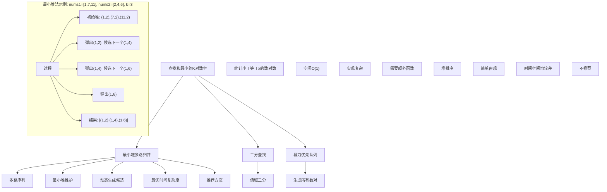

# LeetCode 373 - 查找和最小的K对数字

## 题目描述

给定两个以升序排列的整数数组 `nums1` 和 `nums2`，以及一个整数 `k`。定义一对值 `(u,v)`，其中第一个元素来自 `nums1`，第二个元素来自 `nums2`。请找到和最小的 `k` 个数对 `(u1,v1), (u2,v2)...(uk,vk)`

```markdown
示例 1:
输入: nums1 = [1,7,11], nums2 = [2,4,6], k = 3
输出: [[1,2],[1,4],[1,6]]
解释: 返回序列中的前 3 对数：
[1,2],[1,4],[1,6],[7,2],[7,4],[11,2],[7,6],[11,4],[11,6]

示例 2:
输入: nums1 = [1,1,2], nums2 = [1,2,3], k = 2
输出: [[1,1],[1,1]]
解释: 返回序列中的前 2 对数：
[1,1],[1,1],[1,2],[2,1],[1,2],[2,2],[2,3]

示例 3:
输入: nums1 = [1,2], nums2 = [3], k = 3
输出: [[1,3],[2,3]]
解释: 也可能序列中所有的数对都被返回：[1,3],[2,3]

提示:

- 1 <= nums1.length, nums2.length <= 10⁴
- -10⁹ <= nums1[i], nums2[j] <= 10⁹
- nums1 和 nums2 均为升序排列
- 1 <= k <= 1000
```

## 解题思路

这是一个经典的多路归并问题，要求在两个有序数组中找到和最小的 `k` 对数字。由于数组已排序，我们可以利用这个性质来高效地生成候选数对，而不需要遍历所有 `m * n` 个组合

### 核心思想

"最小堆驱动的多路归并": 将 `nums1` 中每个元素与 `nums2` 第一个元素的组合看作多个有序序列的起点，然后使用最小堆来逐步选出和最小的数对，并动态生成下一个候选数对

### 解题策略

#### 方法一：最小堆多路归并（推荐）

- 时间复杂度: O(k log(min(k, m)))
- 空间复杂度: O(min(k, m))

#### 方法二：二分查找

- 时间复杂度: O((m + n) \* log(max_sum - min_sum))
- 空间复杂度: O(1)

#### 方法三：优先队列（暴力优化）

- 时间复杂度: O(m _ n log(m _ n))
- 空间复杂度: O(m \* n)

## 算法可视化



## 多语言实现

### Golang版本（最小堆多路归并 - 推荐）

```go
import (
    "container/heap"
)

// 数对结构体
type Pair struct {
    Sum  int   // 数对和
    Idx1 int   // nums1 的索引
    Idx2 int   // nums2 的索引
}

// 最小堆实现
type MinHeap []Pair

func (h MinHeap) Len() int           { return len(h) }
func (h MinHeap) Less(i, j int) bool { return h[i].Sum < h[j].Sum }
func (h MinHeap) Swap(i, j int)      { h[i], h[j] = h[j], h[i] }

func (h *MinHeap) Push(x interface{}) {
    *h = append(*h, x.(Pair))
}

func (h *MinHeap) Pop() interface{} {
    old := *h
    n := len(old)
    x := old[n-1]
    *h = old[0 : n-1]
    return x
}

// 方法一：最小堆多路归并（推荐）
func kSmallestPairs(nums1 []int, nums2 []int, k int) [][]int {
    m, n := len(nums1), len(nums2)
    if m == 0 || n == 0 || k == 0 {
        return [][]int{}
    }

    // 最小堆初始化，存储(和, nums1索引, nums2索引)
    h := &MinHeap{}
    heap.Init(h)

    // 将nums1的前min(k, m)个元素与nums2的第一个元素配对，作为初始候选
    // 为什么是前min(k, m)个？因为最多只需要k对，多了无用
    for i := 0; i < m && i < k; i++ {
        heap.Push(h, Pair{Sum: nums1[i] + nums2[0], Idx1: i, Idx2: 0})
    }

    result := make([][]int, 0, k)

    // 循环k次或直到堆为空
    for len(*h) > 0 && k > 0 {
        // 弹出当前和最小的数对
        p := heap.Pop(h).(Pair)
        result = append(result, []int{nums1[p.Idx1], nums2[p.Idx2]})

        // 动态生成下一个候选：当前nums1的元素与nums2的下一个元素
        if p.Idx2+1 < n {
            heap.Push(h, Pair{Sum: nums1[p.Idx1] + nums2[p.Idx2+1], Idx1: p.Idx1, Idx2: p.Idx2 + 1})
        }
        k--
    }

    return result
}
```

### Python版本（多种实现方法）

```python
import heapq
from typing import List

class Solution:
    """
    方法一：最小堆多路归并（推荐）
    """
    def kSmallestPairs(self, nums1: List[int], nums2: List[int], k: int) -> List[List[int]]:
        if not nums1 or not nums2 or k == 0:
            return []

        # 最小堆初始化
        min_heap = []
        # 将 (和, nums1索引, nums2索引) 加入堆
        for i in range(min(len(nums1), k)):
            heapq.heappush(min_heap, (nums1[i] + nums2[0], i, 0))

        result = []
        # 循环k次或直到堆为空
        while min_heap and k > 0:
            current_sum, i, j = heapq.heappop(min_heap)
            result.append([nums1[i], nums2[j]])

            # 生成下一个候选
            if j + 1 < len(nums2):
                heapq.heappush(min_heap, (nums1[i] + nums2[j + 1], i, j + 1))

            k -= 1

        return result
```

### TypeScript版本（最小堆多路归并）

```typescript
// 数对接口
interface Pair {
    sum: number;
    idx1: number;
    idx2: number;
}

/
 * 方法一：最小堆多路归并（推荐）
 */
function kSmallestPairs(nums1: number[], nums2: number[], k: number): number[][] {
    if (nums1.length === 0 || nums2.length === 0 || k === 0) {
        return [];
    }

    const minHeap: Pair[] = [];

    // 堆的辅助函数
    const push = (pair: Pair) => {
        minHeap.push(pair);
        // 上浮
        let i = minHeap.length - 1;
        while (i > 0) {
            const parent = (i - 1) >> 1;
            if (minHeap[parent].sum <= minHeap[i].sum) break;
            [minHeap[parent], minHeap[i]] = [minHeap[i], minHeap[parent]];
            i = parent;
        }
    };

    const pop = (): Pair => {
        const top = minHeap[0];
        const end = minHeap.pop()!;
        if (minHeap.length > 0) {
            minHeap[0] = end;
            // 下沉
            let i = 0;
            const n = minHeap.length;
            while (true) {
                let left = i * 2 + 1;
                let right = i * 2 + 2;
                let smallest = i;

                if (left < n && minHeap[left].sum < minHeap[smallest].sum) {
                    smallest = left;
                }
                if (right < n && minHeap[right].sum < minHeap[smallest].sum) {
                    smallest = right;
                }

                if (smallest === i) break;
                [minHeap[smallest], minHeap[i]] = [minHeap[i], minHeap[smallest]];
                i = smallest;
            }
        }
        return top;
    };

    // 初始化堆
    for (let i = 0; i < Math.min(nums1.length, k); i++) {
        push({ sum: nums1[i] + nums2[0], idx1: i, idx2: 0 });
    }

    const result: number[][] = [];
    while (minHeap.length > 0 && k > 0) {
        const { sum, idx1, idx2 } = pop();
        result.push([nums1[idx1], nums2[idx2]]);

        // 生成下一个候选
        if (idx2 + 1 < nums2.length) {
            push({ sum: nums1[idx1] + nums2[idx2 + 1], idx1, idx2: idx2 + 1 });
        }
        k--;
    }

    return result;
}
```

## 标准实现详细解析

```go
/*
算法核心思想（最小堆多路归并）：

1. 问题转换：将二维搜索空间(m x n)转换为一维有序序列的归并问题
2. 多路序列：将 nums1[i] + nums2 (整个数组) 视为第 i 路有序序列
3. 堆归并：使用最小堆来高效地归并这 m 路序列
4. 动态生成：堆顶元素被弹出后，才从同一路生成下一个候选，避免一次性创建所有数对
5. 剪枝优化：只需要将 nums1 的前 min(k, m) 个元素入堆，因为后面的元素即使全部选出，其和也不可能比前 k 个小

关键设计要点：
1. 堆元素设计：包含和、以及两个数组的索引，以便于追踪和生成下一个候选
2. 初始候选：将 (nums1[i] + nums2[0], i, 0) 入堆，作为每一路序列的起点
3. 循环终止条件：循环 k 次或堆为空，处理所有可能情况
4. 动态生成逻辑：弹出 (i, j) 后，将 (i, j+1) 入堆，前提是 j+1 不越界
5. 空间优化：堆的大小最多为 min(k, m)，有效控制空间复杂度

时间复杂度分析：
- 堆初始化：O(min(m, k))，将前min(k, m)个元素入堆
- 主循环：执行 k 次。每次循环包含一次 Pop 操作和最多一次 Push 操作
- 堆操作：每次 Pop 或 Push 的时间复杂度为 O(log(min(m, k)))
- 总时间复杂度：O(min(m, k) + k * log(min(m, k))) ≈ O(k log(min(m, k)))

空间复杂度分析：
- 堆空间：O(min(m, k))，用于存储候选数对
- 结果空间：O(k)，用于存储最终的 k 个数对
- 总空间复杂度：O(min(m, k))（当 k > m 时，由 m 主导）

算法优势：
1. 时间高效：O(k log(min(m, k)))，远优于暴力法的 O(mn log(mn))
2. 空间优化：O(min(m, k))，不需要存储所有 m*n 个数对
3. 思想优雅：是多路归并思想的经典应用
4. 适用性广：完美利用了输入数组的有序性质
5. 鲁棒性强：正确处理了各种边界情况（如 k > m*n）

数据结构设计：

堆设计：
- 元素结构：`Pair { sum, idx1, idx2 }`
- 最小堆性质：`sum` 值最小的元素在堆顶
- 实现方式：Go 的 `container/heap` 包，需要实现 `Len`, `Less`, `Swap`, `Push`, `Pop` 方法
- 堆大小动态变化，但上界为 `min(m, k)`

操作流程：
1. 边界检查：处理空数组或 k=0 的特殊情况
2. 堆初始化：遍历 nums1 的前 min(k, m) 个元素，与 nums2[0] 配对后入堆
3. 主循环：
   a. 从堆中弹出和最小的数对 `(sum, i, j)`
   b. 将 `[nums1[i], nums2[j]]` 加入结果列表
   c. 如果 `j+1` 不越界，将新的候选 `(nums1[i]+nums2[j+1], i, j+1)` 入堆
   d. k--
4. 返回结果列表

数学原理：

多路归并的数学基础：
设有 m 个有序序列 `S_i = (a_i1 + b_1, a_i1 + b_2, ..., a_i1 + b_n)`，其中 `a_i` 是 `nums1` 的元素，`b_j` 是 `nums2` 的元素
我们的目标是从这 m 路序列中找到最小的 k 个元素
最小堆是解决多路归并问题的标准工具，因为它能在 O(log m) 时间内从 m 个候选者中找到最小值
由于我们只按需生成候选，总时间复杂度被优化到 O(k log m)

示例验证：
nums1 = [1, 7, 11], nums2 = [2, 4, 6], k = 3
1. 初始化堆：[(1+2, 0, 0), (7+2, 1, 0), (11+2, 2, 0)] -> [(3,0,0), (9,1,0), (13,2,0)]
2. 循环1：
   - 弹出 (3, 0, 0) -> 结果 [[1, 2]]。新候选 (1+4, 0, 1) 入堆
   - 堆变为 [(5,0,1), (9,1,0), (13,2,0)]
3. 循环2：
   - 弹出 (5, 0, 1) -> 结果 [[1, 2], [1, 4]]。新候选 (1+6, 0, 2) 入堆
   - 堆变为 [(7,0,2), (9,1,0), (13,2,0)]
4. 循环3：
   - 弹出 (7, 0, 2) -> 结果 [[1, 2], [1, 4], [1, 6]]。新候选 (无，j+1越界)
   - 循环结束
5. 最终结果正确
*/
```

## 执行过程演示

```go
/*
示例详细解析:

示例1执行过程：
输入: nums1 = [1,7,11], nums2 = [2,4,6], k = 3
输出: [[1,2],[1,4],[1,6]]

堆操作演示：
1. 初始化：
   - m=3, n=3, k=3
   - min(k, m) = 3
   - 遍历 nums1[0..2]：
     i=0: Push(Pair{Sum: 1+2=3, Idx1: 0, Idx2: 0})
     i=1: Push(Pair{Sum: 7+2=9, Idx1: 1, Idx2: 0})
     i=2: Push(Pair{Sum: 11+2=13, Idx1: 2, Idx2: 0})
   - 堆内元素: [(3,0,0), (9,1,0), (13,2,0)] (按和有序)

2. 第1次循环 (k=3):
   - Pop(): 弹出 (3,0,0) (和最小)
   - 结果追加: [[1,2]]
   - 生成新候选: j+1=1 < n, Push(Pair{Sum: 1+4=5, Idx1: 0, Idx2: 1})
   - 堆变为: [(5,0,1), (9,1,0), (13,2,0)]
   - k-- -> k=2

3. 第2次循环 (k=2):
   - Pop(): 弹出 (5,0,1)
   - 结果追加: [[1,2],[1,4]]
   - 生成新候选: j+1=2 < n, Push(Pair{Sum: 1+6=7, Idx1: 0, Idx2: 2})
   - 堆变为: [(7,0,2), (9,1,0), (13,2,0)]
   - k-- -> k=1

4. 第3次循环 (k=1):
   - Pop(): 弹出 (7,0,2)
   - 结果追加: [[1,2],[1,4],[1,6]]
   - 生成新候选: j+1=3 >= n (越界)，不Push
   - 堆变为: [(9,1,0), (13,2,0)]
   - k-- -> k=0

5. 循环结束 (k=0)，返回结果
结果：[[1,2],[1,4],[1,6]]，符合预期

示例2执行过程：
输入: nums1 = [1,1,2], nums2 = [1,2,3], k = 2

1. 初始化：min(k,m)=2
   - Push(1+1=2, 0, 0)
   - Push(1+1=2, 1, 0)
   - 堆: [(2,0,0), (2,1,0)]

2. 第1次循环:
   - Pop(): 弹出 (2,0,0) (假设索引小的先出)
   - 结果: [[1,1]]
   - Push(1+2=3, 0, 1)
   - 堆: [(2,1,0), (3,0,1)]

3. 第2次循环:
   - Pop(): 弹出 (2,1,0)
   - 结果: [[1,1],[1,1]]
   - Push(1+2=3, 1, 1)
   - 堆: [(3,0,1), (3,1,1)]
   - k=0, 结束
结果：[[1,1],[1,1]]，符合预期

边界情况演示：

1. k > m*n (k大于总可能数对数)
   - 算法会自然处理，循环会在堆变空时自动终止
   - 例如: nums1=[1,2], nums2=[3], k=3。总共只有2对
   - 初始化: Push(1+3,0,0), Push(2+3,1,0)
   - 循环1: Pop(4,0,0) -> [[1,3]]。无新候选(越界)
   - 循环2: Pop(5,1,0) -> [[1,3],[2,3]]。无新候选(越界)
   - 堆为空，k=1，但循环条件 `len(h) > 0` 不满足，终止
   - 返回所有可能的数对

2. m或n为0
   - 边界检查 `if m == 0 || n == 0` 直接返回空列表，避免了无效操作

3. nums1或nums2非常大
   - 初始化时 `for i := 0; i < m && i < k; i++` 保证了堆的大小不会超过 k，避免了内存问题
   - 如果 m > k，我们只关心前 k 个 nums1 元素，因为第 k+1 个元素与 nums2[0] 的和，至少是第 k+1 小的
*/
```

## 复杂度分析

| 方法           | 时间复杂度                 | 空间复杂度   | 优势         | 劣势       |
| -------------- | -------------------------- | ------------ | ------------ | ---------- |
| 最小堆多路归并 | O(k log(min(m, k)))        | O(min(m, k)) | 时间空间最优 | 实现略复杂 |
| 二分查找       | O((m+n)log(MaxSum-MinSum)) | O(1)         | 空间最优     | 实现最复杂 |
| 暴力优先队列   | O(mn log(mn))              | O(mn)        | 最直观       | 效率最低   |

## 测试用例验证

```go
func main() {
    // 测试用例 1 - 标准情况
    nums1, nums2 := []int{1, 7, 11}, []int{2, 4, 6}
    k := 3
    fmt.Printf("输入: nums1=%v, nums2=%v, k=%d\n", nums1, nums2, k)
    fmt.Printf("输出: %v\n", kSmallestPairs(nums1, nums2, k))

    // 测试用例 2 - 有重复元素
    nums1, nums2 = []int{1, 1, 2}, []int{1, 2, 3}
    k = 2
    fmt.Printf("\n输入: nums1=%v, nums2=%v, k=%d\n", nums1, nums2, k)
    fmt.Printf("输出: %v\n", kSmallestPairs(nums1, nums2, k))

    // 测试用例 3 - k > 总数对
    nums1, nums2 = []int{1, 2}, []int{3}
    k = 3
    fmt.Printf("\n输入: nums1=%v, nums2=%v, k=%d\n", nums1, nums2, k)
    fmt.Printf("输出: %v\n", kSmallestPairs(nums1, nums2, k))

    // 测试用例 4 - k=1
    nums1, nums2 = []int{1, 2, 3}, []int{4, 5, 6}
    k = 1
    fmt.Printf("\n输入: nums1=%v, nums2=%v, k=%d\n", nums1, nums2, k)
    fmt.Printf("输出: %v\n", kSmallestPairs(nums1, nums2, k))

    // 测试用例 5 - 大数组
    nums1, nums2 = []int{-10, -4, 0, 1, 5}, []int{-5, -3, 2, 8}
    k = 5
    fmt.Printf("\n输入: nums1=%v, nums2=%v, k=%d\n", nums1, nums2, k)
    fmt.Printf("输出: %v\n", kSmallestPairs(nums1, nums2, k))
}
```

## 面试追问延伸

### 1. 如果 `k` 的值非常大，接近 `m * n`，这个算法还高效吗？如何优化？

回答：
如果 `k` 接近 `m * n`，当前算法的效率会降低，因为堆的动态生成（Push/Pop）操作会变得非常频繁。在这种情况下，可以考虑以下优化策略：

策略一：切换到二分查找法
当 `k > m * n / 2` 或 `k > 5000` 时，切换到二分查找法

- 优点：二分查找的时间复杂度 `O((m + n) log(max_sum - min_sum))` 与 `k` 无关
- 缺点：实现复杂，需要额外的辅助函数 `countPairsLessOrEqual(x)` 来统计和小于等于 `x` 的数对个数

```go
// 辅助函数：统计和小于等于 target 的数对数量
func countPairs(nums1, nums2 []int, target int) int {
    count := 0
    j := len(nums2) - 1
    // 对于每个 nums1[i]，找最大的 nums2[j] 使得 nums1[i] + nums2[j] <= target
    for i := 0; i < len(nums1); i++ {
        for j >= 0 && nums1[i] + nums2[j] > target {
            j--
        }
        count += (j + 1)
    }
    return count
}
```

策略二：混合策略（Hybrid Approach）
动态选择最优算法：

- 如果 `k * log(m) < (m + n) * log(range)`，使用最小堆
- 否则，使用二分查找

---

### 2. 如果其中一个数组很大，无法全部放入内存，如何解决？

回答：
这是一个典型的外部归并 问题。当 `nums1` 或 `nums2` 无法全部加载到内存时，需要结合磁盘存储和流式处理

解决方案：外部多路归并

1. 分块处理：将无法加载的大数组（如 `nums2`）分成多个可以载入内存的块
1. 内部归并：
   - 将 `nums1` 与 `nums2` 的每一个块分别使用堆归并法，得到 `k` 个最小的结果
   - 实际上，我们不需要生成所有结果，只需要维护一个全局最小堆
1. 流式堆归并：
   - 初始化：将 `nums1` 与 `nums2` 的第一块进行归并，得到 `min(k, len(nums1))` 个候选。但更合理的做法是，将 `nums1` 的前 `min(k, len(nums1))` 个元素，与 `nums2` 的第一个元素配对入堆。同时，我们需要记录每个 `nums1` 元素当前正在与 `nums2` 的哪一块的哪个元素配对
   - 迭代：每次从全局堆中弹出最小值。如果弹出的 `(nums1[i], nums2[j])` 来自块 `b`，那么下一个候选可能是 `(nums1[i], nums2[j+1])`。如果 `j+1` 超出当前块，就需要从磁盘加载 `nums2` 的下一块
1. I/O 优化：顺序读写磁盘块，最大化 I/O 效率

核心挑战：如何维护一个指向外部大数组的指针，以及如何在内存不足时触发磁盘 I/O。这需要更复杂的数据结构，如缓冲区管理

---

### 3. 如何扩展这个算法来解决 "查找和在一个范围 `[low, high]` 内的所有数对"？

回答：
这个问题需要从 "找前 K 小" 扩展到 "找范围匹配"，不能直接使用堆。二分查找是解决此类问题的核心思想

算法步骤：

1. 找到边界的和：
   - 使用 `countPairs` 函数找到小于 `low` 的数对个数 `cnt_low`
   - 使用 `countPairs` 函数找到小于等于 `high` 的数对个数 `cnt_high`
   - 目标范围内的数对数量为 `cnt_high - cnt_low`

1. 收集结果：
   - 如果目标数量为 0，直接返回
   - 否则，我们需要一个方法来收集这些数对。可以复用 "找前 K 小" 的逻辑：
     a. 先用 `findKthSmallestSum(cnt_low)` 找到第 `cnt_low` 小的和 `s_low`
     b. 再用 `findKthSmallestSum(cnt_high)` 找到第 `cnt_high` 小的和 `s_high`
     c. 现在，我们需要收集所有和为 `s_low` 到 `s_high` 的数对

1. 精确收集：
   - 构建一个新的函数 `collectPairs(target_sum, start_count)`，它能找到和恰好为 `target_sum` 的数对，并且是第 `start_count` 个开始的
   - 分别调用 `collectPairs(s_low, cnt_low - countPairs(nums1, nums2, s_low - 1))` 和 `collectPairs(s_high, ...)` 来获取边界数对
   - 如果 `s_high > s_low`，中间所有和的数对都需要收集

代码框架：

```go
func kSmallestPairsInRange(nums1, nums2 []int, low, high int) [][]int {
    cntLow := countPairs(nums1, nums2, low-1)
    cntHigh := countPairs(nums1, nums2, high)

    if cntHigh == cntLow {
        return nil // 没有数对在范围内
    }

    // 收集所有和为 low 的数对
    result := collectPairs(nums1, nums2, low, cntLow)

    // 如果 low != high，收集 low+1 到 high-1 的所有数对
    if high > low {
        for sum := low + 1; sum < high; sum++ {
            result = append(result, collectAllPairsForSum(nums1, nums2, sum)...)
        }
    }

    // 收集所有和为 high 的数对
    result = append(result, collectPairs(nums1, nums2, high, cntHigh)...)

    return result
}
```

注意：`collectPairs` 和 `collectAllPairsForSum` 的实现相对复杂，可能需要再次借助双指针或堆来精确收集特定和的数对

---

### 4. 如果要求返回的是不重复的数对，如何修改代码？

回答：
原问题中的数对 `(u, v)` 可能因 `nums1` 或 `nums2` 中有重复元素而重复。要去重，可以使用一个哈希表来记录已经输出过的数对

方法一：使用哈希表（简单直接）

```go
func kSmallestUniquePairs(nums1 []int, nums2 []int, k int) [][]int {
    // ... 堆初始化和主循环逻辑不变 ...

    seen := make(map[[2]int]bool)
    result := make([][]int, 0, k)

    for len(*h) > 0 && k > 0 {
        p := heap.Pop(h).(Pair)
        key := [2]int{nums1[p.Idx1], nums2[p.Idx2]}

        if !seen[key] { // 核心改动：检查是否已输出
            result = append(result, []int{nums1[p.Idx1], nums2[p.Idx2]})
            seen[key] = true
            k--
        }

        // ... 生成下一个候选的逻辑不变 ...
    }

    return result
}
```

- 优点：实现简单，只需少量修改
- 缺点：空间复杂度增加了 `O(k)`，因为要存储哈希表

方法二：剪枝（更高效但复杂）
在动态生成候选时进行剪枝，避免向堆中推入注定会重复的数对。例如，如果 `nums1[i] == nums1[i-1]`，那么 `i` 这一路的生成方式需要特殊处理，避免重复生成和 `(nums1[i-1], nums2[j])` 相同的候选。这种方法实现难度大，容易出错，面试中不推荐

---

## 相似题目扩展

- LeetCode 373. 查找和最小的K对数字（当前题）
- LeetCode 378. 有序矩阵中第K小的元素（二维矩阵，思想类似）
- LeetCode 719. 找出第k小的距离对（双指针+二分）
- LeetCode 23. 合并K个升序链表（经典多路归并）
- LeetCode 264. 丑数 II（多路归并变种）

## 算法技巧总结

### 查找和最小的K对数字核心要点

1. 多路归并思想：将二维问题转化为一维有序序列的归并
1. 最小堆维护：堆是解决多路归并问题的核心工具
1. 动态生成候选：避免一次性生成所有 `m*n` 个数对，节约空间
1. 剪枝优化：只将 `nums1` 的前 `min(k, m)` 个元素入堆
1. 索引追踪：堆元素必须包含索引，以便生成下一个候选

### 算法优势

- 时间高效：`O(k log(min(m, k)))`，远优于暴力法
- 空间优化：`O(min(m, k))`，与k线性相关
- 思想经典：是多路归并思想在数组问题上的绝佳体现
- 鲁棒性好：能正确处理各种边界情况

### 标准模板（最小堆多路归并）

```go
// 1. 定义堆元素和堆结构
type Pair struct { Sum int; Idx1, Idx2 int }
type MinHeap []Pair
// ... 实现 heap.Interface ...

// 2. 初始化堆
h := &MinHeap{}
heap.Init(h)
for i := 0; i < min(len(nums1), k); i++ {
    heap.Push(h, Pair{nums1[i] + nums2[0], i, 0})
}

// 3. 主循环
result := make([][]int, 0, k)
for len(*h) > 0 && k > 0 {
    p := heap.Pop(h).(Pair)
    result = append(result, []int{nums1[p.Idx1], nums2[p.Idx2]})

    if p.Idx2+1 < len(nums2) {
        heap.Push(h, Pair{nums1[p.Idx1] + nums2[p.Idx2+1], p.Idx1, p.Idx2+1})
    }
    k--
}
```
