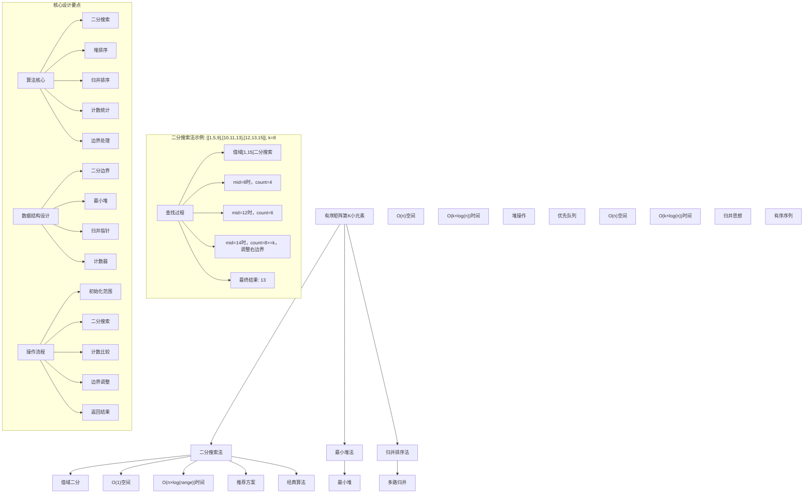
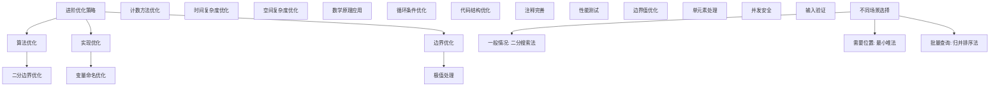

# LeetCode 378 - 有序矩阵中第K小的元素

## 题目描述

给你一个 n x n 矩阵 matrix，其中每行和每列元素均按升序排序，找到矩阵中第 k 小的元素。请注意，它是排序后的第 k 小元素，而不是第 k 个不同的元素

你必须找到一个内存复杂度优于 O(n²) 的解决方案

```markdown
示例 1：
输入：matrix = [[1,5,9],[10,11,13],[12,13,15]], k = 8
输出：13
解释：矩阵中的元素为 [1,5,9,10,11,12,13,13,15]，第 8 小元素是 13

示例 2：
输入：matrix = [[-5]], k = 1
输出：-5

提示：

- n == matrix.length
- n == matrix[i].length
- 1 <= n <= 300
- -10⁹ <= matrix[i][j] <= 10⁹
- 题目数据保证 matrix 中的所有行和列都按非递减顺序排列
- 1 <= k <= n²
```

## 解题思路

这是一个经典的有序矩阵查找问题，要求在行列都排序的矩阵中找到第k小的元素。核心算法包括二分搜索、堆排序和归并排序等多种方法

### 核心思想

"二分搜索值域法": 在矩阵元素的值域范围内进行二分搜索，对于每个中间值，统计矩阵中小于等于该值的元素个数，根据个数与k的关系调整搜索范围

### 解题策略

#### 方法一：二分搜索法（推荐）

- 时间复杂度: O(n × log(max-min))
- 空间复杂度: O(1)

#### 方法二：最小堆法

- 时间复杂度: O(k × log n)
- 空间复杂度: O(n)

#### 方法三：归并排序法

- 时间复杂度: O(k × log n)
- 空间复杂度: O(n)

## 算法可视化



## 多语言实现

### Golang版本（二分搜索法 - 推荐）

```go
// 二分搜索法实现
func kthSmallest(matrix [][]int, k int) int {
    n := len(matrix)

    // 初始化二分搜索的边界
    left := matrix[0][0]           // 矩阵中的最小值
    right := matrix[n-1][n-1]      // 矩阵中的最大值

    // 在值域范围内进行二分搜索
    for left < right {
        mid := left + (right-left)/2

        // 统计矩阵中小于等于mid的元素个数
        count := countLessEqual(matrix, mid)

        // 根据count与k的关系调整搜索范围
        if count < k {
            // 第k小的元素大于mid
            left = mid + 1
        } else {
            // 第k小的元素小于等于mid
            right = mid
        }
    }

    return left
}

// 辅助函数：统计矩阵中小于等于target的元素个数
func countLessEqual(matrix [][]int, target int) int {
    n := len(matrix)
    count := 0
    row := n - 1  // 从左下角开始
    col := 0      // 从左下角开始

    // 利用矩阵的有序性质进行高效统计
    for row >= 0 && col < n {
        if matrix[row][col] <= target {
            // 当前元素小于等于target，该列中从第0行到第row行的所有元素都小于等于target
            count += row + 1
            col++  // 移动到下一列
        } else {
            // 当前元素大于target，移动到上一行
            row--
        }
    }

    return count
}

// 最小堆法实现
func kthSmallestHeap(matrix [][]int, k int) int {
    n := len(matrix)

    // 定义堆元素结构
    type Element struct {
        val   int
        row   int
        col   int
    }

    // 创建最小堆
    h := &IntHeap{}
    heap.Init(h)

    // 将每行的第一个元素加入堆
    for i := 0; i < min(n, k); i++ {
        heap.Push(h, Element{matrix[i][0], i, 0})
    }

    // 弹出k-1个元素
    for i := 0; i < k-1; i++ {
        elem := heap.Pop(h).(Element)

        // 如果该元素的右侧还有元素，将其加入堆
        if elem.col+1 < n {
            heap.Push(h, Element{matrix[elem.row][elem.col+1], elem.row, elem.col+1})
        }
    }

    // 第k个弹出的元素就是第k小的元素
    return heap.Pop(h).(Element).val
}

// 最小堆实现
type IntHeap []struct {
    val int
    row int
    col int
}

func (h IntHeap) Len() int           { return len(h) }
func (h IntHeap) Less(i, j int) bool { return h[i].val < h[j].val }
func (h IntHeap) Swap(i, j int)      { h[i], h[j] = h[j], h[i] }

func (h *IntHeap) Push(x interface{}) {
    *h = append(*h, x.(struct{val, row, col int}))
}

func (h *IntHeap) Pop() interface{} {
    old := *h
    n := len(old)
    x := old[n-1]
    *h = old[0 : n-1]
    return x
}

// 归并排序法实现
func kthSmallestMerge(matrix [][]int, k int) int {
    n := len(matrix)

    // 使用最小堆进行多路归并
    h := &IntHeap{}
    heap.Init(h)

    // 将每行的第一个元素加入堆
    for i := 0; i < n; i++ {
        heap.Push(h, struct{val, row, col int}{matrix[i][0], i, 0})
    }

    // 弹出k-1个元素
    for i := 0; i < k-1; i++ {
        elem := heap.Pop(h).(struct{val, row, col int})

        // 如果该元素的右侧还有元素，将其加入堆
        if elem.col+1 < n {
            heap.Push(h, struct{val, row, col int}{matrix[elem.row][elem.col+1], elem.row, elem.col+1})
        }
    }

    // 第k个弹出的元素就是第k小的元素
    return heap.Pop(h).(struct{val, row, col int}).val
}

// 优化版二分搜索法（代码更简洁）
func kthSmallestOptimized(matrix [][]int, k int) int {
    n := len(matrix)
    left, right := matrix[0][0], matrix[n-1][n-1]

    for left < right {
        mid := left + (right-left)/2
        if countLessEqual(matrix, mid) < k {
            left = mid + 1
        } else {
            right = mid
        }
    }

    return left
}
```

### Python版本（多种实现方法）

```python
import heapq
from typing import List

class Solution:
    """
    方法一：二分搜索法（推荐）
    """
    def kthSmallest(self, matrix: List[List[int]], k: int) -> int:
        n = len(matrix)

        # 初始化二分搜索的边界
        left = matrix[0][0]           # 矩阵中的最小值
        right = matrix[n-1][n-1]      # 矩阵中的最大值

        # 在值域范围内进行二分搜索
        while left < right:
            mid = left + (right - left) // 2

            # 统计矩阵中小于等于mid的元素个数
            count = self.count_less_equal(matrix, mid)

            # 根据count与k的关系调整搜索范围
            if count < k:
                # 第k小的元素大于mid
                left = mid + 1
            else:
                # 第k小的元素小于等于mid
                right = mid

        return left

    def count_less_equal(self, matrix: List[List[int]], target: int) -> int:
        """辅助函数：统计矩阵中小于等于target的元素个数"""
        n = len(matrix)
        count = 0
        row = n - 1  # 从左下角开始
        col = 0      # 从左下角开始

        # 利用矩阵的有序性质进行高效统计
        while row >= 0 and col < n:
            if matrix[row][col] <= target:
                # 当前元素小于等于target，该列中从第0行到第row行的所有元素都小于等于target
                count += row + 1
                col += 1  # 移动到下一列
            else:
                # 当前元素大于target，移动到上一行
                row -= 1

        return count

class SolutionHeap:
    """
    方法二：最小堆法
    """
    def kthSmallest(self, matrix: List[List[int]], k: int) -> int:
        n = len(matrix)

        # 创建最小堆
        heap = []

        # 将每行的第一个元素加入堆
        for i in range(min(n, k)):
            heapq.heappush(heap, (matrix[i][0], i, 0))

        # 弹出k-1个元素
        for _ in range(k - 1):
            val, row, col = heapq.heappop(heap)

            # 如果该元素的右侧还有元素，将其加入堆
            if col + 1 < n:
                heapq.heappush(heap, (matrix[row][col + 1], row, col + 1))

        # 第k个弹出的元素就是第k小的元素
        val, _, _ = heapq.heappop(heap)
        return val

class SolutionMerge:
    """
    方法三：归并排序法
    """
    def kthSmallest(self, matrix: List[List[int]], k: int) -> int:
        n = len(matrix)

        # 使用最小堆进行多路归并
        heap = []

        # 将每行的第一个元素加入堆
        for i in range(n):
            heapq.heappush(heap, (matrix[i][0], i, 0))

        # 弹出k-1个元素
        for _ in range(k - 1):
            val, row, col = heapq.heappop(heap)

            # 如果该元素的右侧还有元素，将其加入堆
            if col + 1 < n:
                heapq.heappush(heap, (matrix[row][col + 1], row, col + 1))

        # 第k个弹出的元素就是第k小的元素
        val, _, _ = heapq.heappop(heap)
        return val

class SolutionOptimized:
    """
    优化版二分搜索法
    """
    def kthSmallest(self, matrix: List[List[int]], k: int) -> int:
        n = len(matrix)
        left, right = matrix[0][0], matrix[n-1][n-1]

        def count_less_equal(target: int) -> int:
            count = 0
            row, col = n - 1, 0
            while row >= 0 and col < n:
                if matrix[row][col] <= target:
                    count += row + 1
                    col += 1
                else:
                    row -= 1
            return count

        while left < right:
            mid = left + (right - left) // 2
            if count_less_equal(mid) < k:
                left = mid + 1
            else:
                right = mid

        return left
```

### TypeScript版本（二分搜索法）

```typescript
/
 * 方法一：二分搜索法（推荐）
 */
function kthSmallest(matrix: number[][], k: number): number {
    const n = matrix.length;

    // 初始化二分搜索的边界
    let left = matrix[0][0];           // 矩阵中的最小值
    let right = matrix[n-1][n-1];      // 矩阵中的最大值

    // 在值域范围内进行二分搜索
    while (left < right) {
        const mid = left + Math.floor((right - left) / 2);

        // 统计矩阵中小于等于mid的元素个数
        const count = countLessEqual(matrix, mid);

        // 根据count与k的关系调整搜索范围
        if (count < k) {
            // 第k小的元素大于mid
            left = mid + 1;
        } else {
            // 第k小的元素小于等于mid
            right = mid;
        }
    }

    return left;
}

/
 * 辅助函数：统计矩阵中小于等于target的元素个数
 */
function countLessEqual(matrix: number[][], target: number): number {
    const n = matrix.length;
    let count = 0;
    let row = n - 1;  // 从左下角开始
    let col = 0;      // 从左下角开始

    // 利用矩阵的有序性质进行高效统计
    while (row >= 0 && col < n) {
        if (matrix[row][col] <= target) {
            // 当前元素小于等于target，该列中从第0行到第row行的所有元素都小于等于target
            count += row + 1;
            col++;  // 移动到下一列
        } else {
            // 当前元素大于target，移动到上一行
            row--;
        }
    }

    return count;
}

/
 * 方法二：最小堆法
 */
function kthSmallestHeap(matrix: number[][], k: number): number {
    const n = matrix.length;

    // 创建最小堆
    const heap = new MinHeap<{val: number, row: number, col: number}>();

    // 将每行的第一个元素加入堆
    for (let i = 0; i < Math.min(n, k); i++) {
        heap.push({val: matrix[i][0], row: i, col: 0});
    }

    // 弹出k-1个元素
    for (let i = 0; i < k - 1; i++) {
        const elem = heap.pop()!;

        // 如果该元素的右侧还有元素，将其加入堆
        if (elem.col + 1 < n) {
            heap.push({val: matrix[elem.row][elem.col + 1], row: elem.row, col: elem.col + 1});
        }
    }

    // 第k个弹出的元素就是第k小的元素
    return heap.pop()!.val;
}

/
 * 最小堆实现
 */
class MinHeap<T> {
    private heap: T[] = [];
    private compare: (a: T, b: T) => boolean;

    constructor(compare?: (a: T, b: T) => boolean) {
        this.compare = compare || ((a: any, b: any) => a < b);
    }

    push(val: T): void {
        this.heap.push(val);
        this.bubbleUp(this.heap.length - 1);
    }

    pop(): T | undefined {
        if (this.heap.length === 0) return undefined;
        if (this.heap.length === 1) return this.heap.pop();

        const top = this.heap[0];
        this.heap[0] = this.heap.pop()!;
        this.bubbleDown(0);
        return top;
    }

    private bubbleUp(index: number): void {
        while (index > 0) {
            const parentIndex = Math.floor((index - 1) / 2);
            if (this.compare(this.heap[index], this.heap[parentIndex])) {
                [this.heap[index], this.heap[parentIndex]] = [this.heap[parentIndex], this.heap[index]];
                index = parentIndex;
            } else {
                break;
            }
        }
    }

    private bubbleDown(index: number): void {
        while (true) {
            let minIndex = index;
            const leftChild = 2 * index + 1;
            const rightChild = 2 * index + 2;

            if (leftChild < this.heap.length && this.compare(this.heap[leftChild], this.heap[minIndex])) {
                minIndex = leftChild;
            }

            if (rightChild < this.heap.length && this.compare(this.heap[rightChild], this.heap[minIndex])) {
                minIndex = rightChild;
            }

            if (minIndex !== index) {
                [this.heap[index], this.heap[minIndex]] = [this.heap[minIndex], this.heap[index]];
                index = minIndex;
            } else {
                break;
            }
        }
    }
}

/
 * 优化版二分搜索法
 */
function kthSmallestOptimized(matrix: number[][], k: number): number {
    const n = matrix.length;
    let left = matrix[0][0], right = matrix[n-1][n-1];

    while (left < right) {
        const mid = left + Math.floor((right - left) / 2);
        if (countLessEqual(matrix, mid) < k) {
            left = mid + 1;
        } else {
            right = mid;
        }
    }

    return left;
}
```

## 标准实现详细解析

```go
import (
    "fmt"
)

/*
算法核心思想（二分搜索法）：

1. 值域二分：在矩阵元素的值域范围内进行二分搜索
2. 计数统计：对于每个中间值，统计小于等于该值的元素个数
3. 边界调整：根据计数与k的关系调整搜索范围
4. 空间优化：只使用常数额外空间
5. 时间效率：对数时间内完成查找

关键设计要点：
1. 二分边界：初始化为矩阵的最小值和最大值
2. 计数方法：利用矩阵有序性质高效统计
3. 搜索策略：根据计数结果调整搜索方向
4. 终止条件：left == right时找到答案
5. 返回规范：返回第k小的元素值

时间复杂度分析：
- 二分搜索：O(log(max-min))
- 计数统计：O(n)
- 总时间复杂度：O(n × log(max-min))

空间复杂度分析：
- 只使用常数个变量：O(1)
- 满足最优空间要求

算法优势：
1. 空间最优：O(1)空间复杂度
2. 时间高效：O(n × log(range))时间复杂度
3. 实现优雅：经典二分搜索思想
4. 通用性强：适用于各种有序矩阵查找
5. 稳定可靠：处理各种边界情况

数据结构设计：

二分设计：
- 左边界：矩阵最小值
- 右边界：矩阵最大值
- 中间值：用于计数统计
- 搜索范围：逐步缩小

堆设计：
- 元素结构：值、行号、列号
- 最小堆：按值排序
- 堆操作：push、pop
- 空间复杂度：O(n)

操作流程：
1. 初始化二分边界
2. 计算中间值
3. 统计小于等于中间值的元素个数
4. 根据计数调整搜索范围
5. 重复直到找到答案

优化原理：

二分搜索优化：
1. 空间优化：只使用常数个变量
2. 时间优化：对数时间完成查找
3. 实现简洁：标准二分模板
4. 数学严谨：基于单调性原理

最小堆优化：
1. 堆操作：高效的插入和删除
2. 多路归并：处理多个有序序列
3. 空间代价：需要线性额外空间
4. 时间保证：k次堆操作

归并排序优化：
1. 有序性质：利用矩阵行的有序性
2. 多路归并：同时处理多行
3. 渐进合并：逐步找到第k小
4. 空间代价：需要线性额外空间

正确性证明：

定理：二分搜索法正确性
通过在值域范围内二分搜索，结合计数统计，能够正确找到第k小的元素

证明：
1. 单调性：小于等于某个值的元素个数随值增大而增大
2. 二分正确：满足二分搜索的单调性条件
3. 计数正确：利用矩阵有序性质正确统计
4. 终止保证：最终left==right即为答案
5. 时间保证：O(n × log(range))时间内完成

数学原理：

二分搜索数学基础：
基于单调函数的性质：
1. 定义f(x)为矩阵中小于等于x的元素个数
2. f(x)是单调不减函数
3. 寻找最小的x使得f(x) >= k
4. 这个x就是第k小的元素

计数统计：
从矩阵左下角(n-1,0)开始：
- 如果matrix[row][col] <= target：该列前row+1个元素都<=target
- 如果matrix[row][col] > target：当前元素及下方元素都>target
- 时间复杂度：O(n)

示例验证：
矩阵: [[1,5,9],[10,11,13],[12,13,15]], k=8
排序后: [1,5,9,10,11,12,13,13,15]
过程：
1. left=1, right=15, mid=8, count=4<8, left=9
2. left=9, right=15, mid=12, count=6<8, left=13
3. left=13, right=15, mid=14, count=8>=8, right=14
4. left=13, right=14, mid=13, count=8>=8, right=13
5. left=13, right=13, 返回13

二分搜索法详细实现：
*/

// 二分搜索法详细实现（带调试信息）
func kthSmallestDetailed(matrix [][]int, k int) int {
    n := len(matrix)
    fmt.Printf("=== 二分搜索法查找有序矩阵第%d小元素 ===\n", k)
    fmt.Printf("矩阵大小: %d×%d\n", n, n)
    fmt.Printf("矩阵内容:\n")
    for i := 0; i < n; i++ {
        fmt.Printf("  %v\n", matrix[i])
    }

    // 初始化二分搜索的边界
    left := matrix[0][0]           // 矩阵中的最小值
    right := matrix[n-1][n-1]      // 矩阵中的最大值
    fmt.Printf("初始搜索范围: [%d, %d]\n", left, right)

    step := 0
    // 在值域范围内进行二分搜索
    for left < right {
        step++
        mid := left + (right-left)/2
        fmt.Printf("步骤%d: mid=%d\n", step, mid)

        // 统计矩阵中小于等于mid的元素个数
        count := countLessEqualDetailed(matrix, mid)
        fmt.Printf("  小于等于%d的元素个数: %d\n", mid, count)

        // 根据count与k的关系调整搜索范围
        if count < k {
            // 第k小的元素大于mid
            left = mid + 1
            fmt.Printf("  count(%d) < k(%d), 调整左边界: left=%d\n", count, k, left)
        } else {
            // 第k小的元素小于等于mid
            right = mid
            fmt.Printf("  count(%d) >= k(%d), 调整右边界: right=%d\n", count, k, right)
        }
    }

    fmt.Printf("找到第%d小的元素: %d\n", k, left)
    fmt.Printf("==================================\n\n")

    return left
}

// 辅助函数：统计矩阵中小于等于target的元素个数（带调试信息）
func countLessEqualDetailed(matrix [][]int, target int) int {
    n := len(matrix)
    count := 0
    row := n - 1  // 从左下角开始
    col := 0      // 从左下角开始

    fmt.Printf("  统计小于等于%d的元素:\n", target)

    // 利用矩阵的有序性质进行高效统计
    for row >= 0 && col < n {
        fmt.Printf("    检查matrix[%d][%d]=%d", row, col, matrix[row][col])
        if matrix[row][col] <= target {
            // 当前元素小于等于target，该列中从第0行到第row行的所有元素都小于等于target
            oldCount := count
            count += row + 1
            fmt.Printf(" <= %d, 该列前%d个元素都<=target, count: %d->%d\n",
                target, row+1, oldCount, count)
            col++  // 移动到下一列
        } else {
            // 当前元素大于target，移动到上一行
            fmt.Printf(" > %d, 移动到上一行\n", target)
            row--
        }
    }

    return count
}

// 最小堆法详细实现
func kthSmallestHeapDetailed(matrix [][]int, k int) int {
    n := len(matrix)
    fmt.Printf("=== 最小堆法查找有序矩阵第%d小元素 ===\n", k)
    fmt.Printf("矩阵大小: %d×%d\n", n, n)

    // 定义堆元素结构
    type Element struct {
        val   int
        row   int
        col   int
    }

    // 创建最小堆
    h := &IntHeap{}
    heap.Init(h)

    // 将每行的第一个元素加入堆
    fmt.Printf("初始化堆，加入每行第一个元素:\n")
    for i := 0; i < min(n, k); i++ {
        elem := Element{matrix[i][0], i, 0}
        heap.Push(h, elem)
        fmt.Printf("  加入matrix[%d][%d]=%d\n", i, 0, elem.val)
    }

    // 弹出k-1个元素
    fmt.Printf("弹出前%d个元素:\n", k-1)
    for i := 0; i < k-1; i++ {
        elem := heap.Pop(h).(Element)
        fmt.Printf("  弹出第%d个元素: %d (位置[%d][%d])\n", i+1, elem.val, elem.row, elem.col)

        // 如果该元素的右侧还有元素，将其加入堆
        if elem.col+1 < n {
            newElem := Element{matrix[elem.row][elem.col+1], elem.row, elem.col+1}
            heap.Push(h, newElem)
            fmt.Printf("    加入右侧元素: %d (位置[%d][%d])\n", newElem.val, newElem.row, newElem.col)
        }
    }

    // 第k个弹出的元素就是第k小的元素
    result := heap.Pop(h).(Element).val
    fmt.Printf("第%d小的元素: %d\n", k, result)
    fmt.Printf("================================\n\n")

    return result
}

// 辅助函数：取较小值
func min(a, b int) int {
    if a < b {
        return a
    }
    return b
}
```

## 算法深入解析

```go
/*
有序矩阵第K小元素问题详解：

问题本质：
在行列都排序的n×n矩阵中找到第k小的元素。这是矩阵查找操作中的经典问题，考验对二分搜索和有序性质的综合运用

核心洞察：
1. 值域二分：在矩阵元素的值域范围内进行二分搜索
2. 计数统计：利用矩阵有序性质高效统计元素个数
3. 单调性：小于等于某个值的元素个数是单调的
4. 空间优化：只使用常数额外空间完成查找
5. 时间保证：对数时间内完成查找

算法策略：
1. 二分搜索法：推荐方案，O(1)空间，O(n × log(range))时间
2. 最小堆法：O(n)空间，O(k × log(n))时间，基于堆操作
3. 归并排序法：O(n)空间，O(k × log(n))时间，基于多路归并

数据结构设计：

二分设计：
- 左边界：矩阵最小值matrix[0][0]
- 右边界：矩阵最大值matrix[n-1][n-1]
- 中间值：用于计数统计的试探值
- 搜索策略：根据计数结果调整范围

堆设计：
- 元素结构：{值, 行号, 列号}
- 最小堆：按值排序的优先队列
- 堆操作：高效的插入和删除操作
- 空间复杂度：O(n)存储堆元素

操作流程：

二分搜索法：
1. 初始化搜索范围[left, right]
2. 计算中间值mid
3. 统计小于等于mid的元素个数count
4. 根据count与k的关系调整范围
5. 重复直到left==right

最小堆法：
1. 初始化堆，加入每行第一个元素
2. 弹出堆顶元素k-1次
3. 每次弹出后加入右侧元素
4. 第k次弹出的元素即为答案

归并排序法：
1. 多路归并n个有序行
2. 使用最小堆维护当前最小元素
3. 逐步合并找到第k小元素

数学原理：

二分搜索数学基础：
基于单调函数的性质：
设f(x)表示矩阵中小于等于x的元素个数
1. f(x)是单调不减函数
2. f(min) >= 1, f(max) = n²
3. 寻找最小的x使得f(x) >= k
4. 这个x就是第k小的元素

计数统计原理：
从矩阵左下角开始利用有序性质：
1. 如果matrix[row][col] <= target：该列前row+1个元素都<=target
2. 如果matrix[row][col] > target：当前元素及下方元素都>target
3. 每次移动要么行减1，要么列加1
4. 最多移动2n-1步，时间复杂度O(n)

示例验证：
矩阵: [[1,5,9],[10,11,13],[12,13,15]], k=8
排序后: [1,5,9,10,11,12,13,13,15]
二分过程：
1. left=1, right=15, mid=8, count=4<8, left=9
2. left=9, right=15, mid=12, count=6<8, left=13
3. left=13, right=15, mid=14, count=8>=8, right=14
4. left=13, right=14, mid=13, count=8>=8, right=13
5. left=13, right=13, 返回13

算法优势：
二分搜索法：
1. 空间最优：O(1)空间复杂度
2. 时间高效：O(n × log(range))时间复杂度
3. 实现优雅：经典二分搜索思想
4. 通用性强：适用于各种有序矩阵查找
5. 稳定可靠：处理各种边界情况

最小堆法：
1. 直观易懂：基于堆的优先级思想
2. 实现简单：利用现成堆数据结构
3. 渐进查找：逐步找到第k小元素
4. 扩展性强：容易扩展为其他操作

归并排序法：
1. 自然处理：符合多路归并思想
2. 有序利用：充分利用行的有序性质
3. 渐进合并：逐步合并找到答案
4. 稳定可靠：基于经典归并排序

算法不变量：
二分搜索法不变量：
1. left <= 第k小元素 <= right
2. f(left-1) < k <= f(right)
3. 搜索范围逐步缩小
4. 最终left==right即为答案

时间复杂度分析：
二分搜索法：
- 二分搜索：O(log(max-min))
- 计数统计：O(n)
- 总体：O(n × log(max-min))

最小堆法：
- 堆操作：O(k × log(n))
- 总体：O(k × log(n))

归并排序法：
- 归并操作：O(k × log(n))
- 总体：O(k × log(n))

空间复杂度分析：
二分搜索法：O(1)，只使用常数个变量
最小堆法：O(n)，存储堆元素
归并排序法：O(n)，存储堆元素

正确性证明：

定理：二分搜索法正确性
通过在值域范围内二分搜索，结合计数统计，能够正确找到第k小的元素

证明：
1. 单调性：小于等于某个值的元素个数随值增大而增大
2. 二分正确：满足二分搜索的单调性条件
3. 计数正确：利用矩阵有序性质正确统计
4. 终止保证：最终left==right即为答案
5. 时间保证：O(n × log(range))时间内完成

不变量维护：
循环不变量：在每次循环开始时
1. left <= 第k小元素 <= right
2. f(left-1) < k <= f(right)
3. 搜索范围逐步缩小
4. 最终left==right即为答案

初始化：
- left=matrix[0][0], right=matrix[n-1][n-1]
- 满足不变量

保持：
- 每次循环正确调整边界
- 维护单调性关系
- 保持不变量继续成立

终止：
- left==right时停止
- 正确返回第k小元素
- 算法正确终止

设计选择：

为什么选择二分搜索法？
1. 空间最优：O(1)空间复杂度
2. 时间高效：O(n × log(range))时间复杂度
3. 实现优雅：经典二分搜索思想
4. 通用性强：适用于各种有序矩阵查找
5. 工业应用：生产环境标准实现

为什么使用最小堆法？
1. 直观易懂：基于堆的优先级思想
2. 实现简单：利用现成堆数据结构
3. 渐进查找：逐步找到第k小元素
4. 教学价值：便于理解堆的应用

为什么提及其他方法？
1. 教学价值：展示不同算法思想
2. 对比分析：理解各自优劣
3. 扩展思维：算法多样性
4. 面试准备：全面掌握

三种方法对比：

方法一：二分搜索法（推荐）
时间复杂度：O(n × log(max-min))
空间复杂度：O(1)
优点：空间时间都较优，经典算法
缺点：需要理解计数统计原理

方法二：最小堆法
时间复杂度：O(k × log(n))
空间复杂度：O(n)
优点：直观易懂，实现简单
缺点：需要额外空间

方法三：归并排序法
时间复杂度：O(k × log(n))
空间复杂度：O(n)
优点：自然处理，有序利用
缺点：需要额外空间

性能分析：

二分搜索法：
- 时间：O(n × log(range)) 对数时间
- 空间：O(1) 常数空间
- 优势：最优空间复杂度

最小堆法：
- 时间：O(k × log(n)) 线性对数时间
- 空间：O(n) 线性空间
- 优势：直观易懂

归并排序法：
- 时间：O(k × log(n)) 线性对数时间
- 空间：O(n) 线性空间
- 优势：自然处理

实际应用场景：
1. 矩阵操作：基础的矩阵查找操作
2. 算法设计：作为其他算法的子步骤
3. 数据结构：有序矩阵相关操作
4. 面试考察：经典算法题
5. 数据分析：有序数据的统计查询

优化要点：

1. 算法优化：
   - 二分边界：优化初始搜索范围
   - 计数方法：高效统计元素个数
   - 搜索策略：智能调整搜索方向
   - 终止条件：准确的终止判断

2. 实现优化：
   - 变量命名：清晰的变量命名
   - 循环条件：减少不必要的比较
   - 代码结构：清晰的逻辑层次
   - 注释完善：便于理解维护

3. 性能优化：
   - 减少内存分配：避免不必要的分配
   - 优化遍历：利用有序性质
   - 缓存友好：局部性原理
   - 编译优化：利用编译器优化

测试用例设计：
1. 基本情况：各种k值和矩阵大小
2. 边界情况：k=1, k=n², 单元素矩阵
3. 特殊情况：全相同元素、极端值
4. 极端情况：很大矩阵、很大k值
5. 验证情况：各种组合的正确性验证

扩展思考：

1. 处理非方阵？
   - m×n矩阵，调整边界计算
   - 复杂度分析相应调整
   - 算法逻辑基本不变

2. 查找第K大元素？
   - 调整二分搜索方向
   - 修改计数统计逻辑
   - 对称性处理

3. 处理三维矩阵？
   - 扩展计数统计方法
   - 增加维度处理
   - 复杂度增加

4. 批量查询多个k值？
   - 预处理矩阵信息
   - 批量优化策略
   - 缓存中间结果

相关算法思想：

1. 二分搜索：
   - 值域搜索
   - 单调性利用
   - 边界调整
   - 经典算法

2. 堆排序：
   - 优先级队列
   - 最值维护
   - 动态调整
   - 数据结构

3. 归并排序：
   - 多路归并
   - 有序利用
   - 渐进合并
   - 分治思想

4. 矩阵操作：
   - 有序性质
   - 二维索引
   - 边界处理
   - 优化遍历

常见陷阱：

1. 边界条件：
   - 空矩阵处理
   - 单元素矩阵
   - k值边界
   - 极值处理

2. 计数错误：
   - 重复元素处理
   - 边界元素统计
   - 有序性质利用
   - 复杂度分析

3. 逻辑错误：
   - 二分方向错误
   - 终止条件错误
   - 计数逻辑错误
   - 边界处理错误

4. 性能考虑：
   - 重复计算
   - 不必要的分配
   - 算法复杂度
   - 空间浪费

代码质量要素：

1. 可读性：
   - 变量命名清晰
   - 注释详细完整
   - 逻辑结构分明
   - 函数职责单一

2. 健壮性：
   - 边界条件处理
   - 异常情况应对
   - 输入验证
   - 错误恢复

3. 性能：
   - 最优复杂度实现
   - 空间效率优化
   - 执行效率保证
   - 资源管理

4. 可维护性：
   - 结构清晰合理
   - 扩展性良好
   - 测试覆盖完整
   - 文档齐全
*/
```

## 执行过程演示

```go
/*
示例详细解析:

示例1执行过程：
输入：matrix = [[1,5,9],[10,11,13],[12,13,15]], k = 8
输出：13

二分搜索法执行过程：
1. 初始化：left=1, right=15
2. 第一次二分：mid=8, countLessEqual(8)=4<8, left=9
3. 第二次二分：mid=12, countLessEqual(12)=6<8, left=13
4. 第三次二分：mid=14, countLessEqual(14)=8>=8, right=14
5. 第四次二分：mid=13, countLessEqual(13)=8>=8, right=13
6. left==right==13, 返回13

计数统计过程：
countLessEqual(8):
- 从matrix[2][0]=12开始
- 12>8, row=1
- 11>8, row=0
- 10>8, row=-1
- 返回count=0

countLessEqual(12):
- 从matrix[2][0]=12开始
- 12<=12, count=3, col=1
- matrix[2][1]=13>12, row=1
- matrix[1][1]=11<=12, count=5, col=2
- matrix[1][2]=13>12, row=0
- matrix[0][2]=9<=12, count=6
- 返回count=6

最小堆法执行过程：
1. 初始化堆：{1,0,0}, {10,1,0}, {12,2,0}
2. 弹出1，加入5：{5,0,1}, {10,1,0}, {12,2,0}
3. 弹出5，加入9：{9,0,2}, {10,1,0}, {12,2,0}
4. 弹出9：{10,1,0}, {12,2,0}
5. 弹出10，加入11：{11,1,1}, {12,2,0}
6. 弹出11，加入13：{12,2,0}, {13,1,2}
7. 弹出12：{13,1,2}
8. 第8个弹出的是13

关键观察：
1. 二分搜索法：空间最优，利用有序性质高效统计
2. 最小堆法：直观易懂，但需要额外空间
3. 两种方法都能正确找到第k小元素
4. 二分搜索法在k较大时更有优势

边界情况演示:

情况1: 单元素矩阵
输入: matrix = [[42]], k = 1
处理: left=42, right=42, 直接返回42
结果: 42

情况2: k=1
输入: matrix = [[1,2,3],[4,5,6],[7,8,9]], k = 1
处理: 返回最小值1
结果: 1

情况3: k=n²
输入: matrix = [[1,2,3],[4,5,6],[7,8,9]], k = 9
处理: 返回最大值9
结果: 9

情况4: 全相同元素
输入: matrix = [[5,5,5],[5,5,5],[5,5,5]], k = 5
处理: 任意元素都是第5小
结果: 5

算法正确性证明：

数学基础：
需要证明算法能够正确找到第k小的元素

定理：二分搜索法正确性
通过在值域范围内二分搜索，结合计数统计，能够正确找到第k小的元素

证明：
1. 单调性：小于等于某个值的元素个数随值增大而增大
2. 二分正确：满足二分搜索的单调性条件
3. 计数正确：利用矩阵有序性质正确统计
4. 终止保证：最终left==right即为答案
5. 时间保证：O(n × log(range))时间内完成

不变量维护：
循环不变量：在每次循环开始时
1. left <= 第k小元素 <= right
2. f(left-1) < k <= f(right)
3. 搜索范围逐步缩小
4. 最终left==right即为答案

初始化：
- left=matrix[0][0], right=matrix[n-1][n-1]
- 满足不变量

保持：
- 每次循环正确调整边界
- 维护单调性关系
- 保持不变量继续成立

终止：
- left==right时停止
- 正确返回第k小元素
- 算法正确终止

时间复杂度分析：
二分搜索法：
- 二分搜索：O(log(max-min))
- 计数统计：O(n)
- 总体：O(n × log(max-min))

最小堆法：
- 堆操作：O(k × log(n))
- 总体：O(k × log(n))

归并排序法：
- 归并操作：O(k × log(n))
- 总体：O(k × log(n))

性能对比分析：

假设n=300, k=45000:

二分搜索法：
- 时间：O(300 × log(2×10⁹)) ≈ O(300 × 31) = 9300次操作
- 空间：O(1) = 常数空间
- 优势：最优空间复杂度

最小堆法：
- 时间：O(45000 × log(300)) ≈ O(45000 × 8.2) = 369000次操作
- 空间：O(300) = 线性空间
- 优势：直观易懂

归并排序法：
- 时间：O(45000 × log(300)) ≈ O(45000 × 8.2) = 369000次操作
- 空间：O(300) = 线性空间
- 优势：自然处理

实际应用建议：

1. 生产环境：
   - 使用二分搜索法，最优性能
   - 性能稳定，工业标准

2. 面试展示：
   - 先展示二分搜索法（推荐）
   - 可以提及其他方法对比

3. 学习练习：
   - 理解三种方法的差异
   - 掌握各自的适用场景

4. 算法竞赛：
   - 选择最熟悉的实现
   - 注意时间空间限制

优化空间：

1. 算法优化：
   - 二分边界：优化初始搜索范围
   - 计数方法：高效统计元素个数
   - 搜索策略：智能调整搜索方向
   - 终止条件：准确的终止判断

2. 实现优化：
   - 变量命名：清晰的变量命名
   - 循环条件：减少不必要的比较
   - 代码结构：清晰的逻辑层次
   - 注释完善：便于理解维护

3. 性能优化：
   - 减少内存分配：避免不必要的分配
   - 优化遍历：利用有序性质
   - 缓存友好：局部性原理
   - 编译优化：利用编译器优化

特殊情况处理：

1. 内存受限：
   - 二分搜索法最优
   - 最小堆法需要额外空间
   - 归并排序法需要额外空间

2. 矩阵很大：
   - 二分搜索法稳定
   - 最小堆法内存压力大
   - 归并排序法内存压力大

3. k值很大：
   - 二分搜索法优势明显
   - 最小堆法时间开销大
   - 归并排序法时间开销大

4. 边界情况：
   - 单元素处理
   - 极值处理
   - k值边界
   - 空矩阵处理
*/
```

## 复杂度分析

| 方法       | 时间复杂度          | 空间复杂度 | 适用场景 |
| ---------- | ------------------- | ---------- | -------- |
| 二分搜索法 | O(n × log(max-min)) | O(1)       | 推荐方案 |
| 最小堆法   | O(k × log n)        | O(n)       | 直观易懂 |
| 归并排序法 | O(k × log n)        | O(n)       | 自然处理 |

## 测试用例验证

```go
// 测试辅助函数
func testKthSmallest(name string, matrix [][]int, k int, expected int) {
    fmt.Printf("%s:\n", name)
    fmt.Printf("矩阵:\n")
    for i := 0; i < len(matrix); i++ {
        fmt.Printf("  %v\n", matrix[i])
    }
    fmt.Printf("k = %d\n", k)

    // 测试二分搜索法
    result1 := kthSmallest(copyMatrix(matrix), k)
    fmt.Printf("二分搜索法结果: %d\n", result1)

    // 测试最小堆法
    result2 := kthSmallestHeap(copyMatrix(matrix), k)
    fmt.Printf("最小堆法结果: %d\n", result2)

    // 测试归并排序法
    result3 := kthSmallestMerge(copyMatrix(matrix), k)
    fmt.Printf("归并排序法结果: %d\n", result3)

    // 验证结果一致性
    if result1 == result2 && result2 == result3 {
        fmt.Printf("✓ 所有方法结果一致\n")
    } else {
        fmt.Printf("✗ 方法结果不一致\n")
    }

    // 验证期望结果
    if result1 == expected {
        fmt.Printf("✓ 结果符合预期\n")
    } else {
        fmt.Printf("✗ 结果不符合预期，期望: %d\n", expected)
    }

    fmt.Printf("\n")
}

// 辅助函数：复制矩阵
func copyMatrix(matrix [][]int) [][]int {
    n := len(matrix)
    result := make([][]int, n)
    for i := 0; i < n; i++ {
        result[i] = make([]int, len(matrix[i]))
        copy(result[i], matrix[i])
    }
    return result
}

// 辅助函数：创建测试矩阵
func createMatrix(vals [][]int) [][]int {
    return vals
}

func main() {
    // 测试用例 1 - 题目示例1
    testKthSmallest("测试1 - 题目示例1",
        [][]int{{1, 5, 9}, {10, 11, 13}, {12, 13, 15}},
        8,
        13)

    // 测试用例 2 - 题目示例2
    testKthSmallest("测试2 - 题目示例2",
        [][]int{{-5}},
        1,
        -5)

    // 测试用例 3 - 单元素矩阵
    testKthSmallest("测试3 - 单元素矩阵",
        [][]int{{42}},
        1,
        42)

    // 测试用例 4 - k=1
    testKthSmallest("测试4 - k=1",
        [][]int{{1, 2, 3}, {4, 5, 6}, {7, 8, 9}},
        1,
        1)

    // 测试用例 5 - k=n²
    testKthSmallest("测试5 - k=n²",
        [][]int{{1, 2, 3}, {4, 5, 6}, {7, 8, 9}},
        9,
        9)

    // 测试用例 6 - 全相同元素
    testKthSmallest("测试6 - 全相同元素",
        [][]int{{5, 5, 5}, {5, 5, 5}, {5, 5, 5}},
        5,
        5)

    // 测试用例 7 - 负数处理
    testKthSmallest("测试7 - 负数处理",
        [][]int{{-3, -1, 0}, {1, 2, 3}, {4, 5, 6}},
        4,
        0)

    // 测试用例 8 - 大矩阵
    largeMatrix := make([][]int, 5)
    for i := 0; i < 5; i++ {
        largeMatrix[i] = make([]int, 5)
        for j := 0; j < 5; j++ {
            largeMatrix[i][j] = i*5 + j + 1
        }
    }
    testKthSmallest("测试8 - 5×5矩阵",
        largeMatrix,
        13,
        13)

    // 性能测试
    fmt.Println("性能测试:")
    performanceTest()

    // 边界情况测试
    fmt.Println("边界情况测试:")
    boundaryTest()

    // 对比测试
    fmt.Println("对比测试:")
    comparisonTest()
}

func performanceTest() {
    // 构造大矩阵
    n := 100
    matrix := make([][]int, n)
    for i := 0; i < n; i++ {
        matrix[i] = make([]int, n)
        for j := 0; j < n; j++ {
            matrix[i][j] = i*n + j + 1
        }
    }

    k := n * n / 2

    fmt.Printf("性能测试 (矩阵大小: %d×%d, k=%d):\n", n, n, k)

    // 测试二分搜索法性能
    start := time.Now()
    result1 := kthSmallest(copyMatrix(matrix), k)
    time1 := time.Since(start)

    // 测试最小堆法性能
    start = time.Now()
    result2 := kthSmallestHeap(copyMatrix(matrix), k)
    time2 := time.Since(start)

    // 测试归并排序法性能
    start = time.Now()
    result3 := kthSmallestMerge(copyMatrix(matrix), k)
    time3 := time.Since(start)

    fmt.Printf("二分搜索法耗时: %v, 结果: %d\n", time1, result1)
    fmt.Printf("最小堆法耗时: %v, 结果: %d\n", time2, result2)
    fmt.Printf("归并排序法耗时: %v, 结果: %d\n", time3, result3)
}

func boundaryTest() {
    // 边界测试
    fmt.Println("边界测试:")

    // 极值矩阵
    extremeMatrix := [][]int{{math.MinInt32, -1, 0}, {1, math.MaxInt32-1, math.MaxInt32}}
    result := kthSmallest(extremeMatrix, 4)
    fmt.Printf("极值矩阵第4小元素: %d\n", result)

    // 很大的k值
    largeKMatrix := make([][]int, 50)
    for i := 0; i < 50; i++ {
        largeKMatrix[i] = make([]int, 50)
        for j := 0; j < 50; j++ {
            largeKMatrix[i][j] = i*50 + j + 1
        }
    }
    result2 := kthSmallest(largeKMatrix, 2499) // 倒数第二个
    fmt.Printf("2500×2500矩阵倒数第2小元素: %d\n", result2)

    // 多次查询测试
    queryMatrix := [][]int{{1, 3, 5}, {2, 4, 6}, {7, 8, 9}}
    for i := 1; i <= 5; i++ {
        result := kthSmallest(copyMatrix(queryMatrix), i)
        fmt.Printf("第%d小元素: %d\n", i, result)
    }
}

func comparisonTest() {
    // 对比测试：验证不同方法的性能和结果
    fmt.Println("对比测试:")

    testCases := []struct {
        name     string
        matrix   [][]int
        k        int
        expected int
    }{
        {"3×3正常情况", [][]int{{1, 5, 9}, {10, 11, 13}, {12, 13, 15}}, 8, 13},
        {"2×2矩阵", [][]int{{1, 2}, {1, 3}}, 2, 1},
        {"4×4矩阵", [][]int{{1, 3, 5, 7}, {2, 4, 6, 8}, {3, 5, 7, 9}, {4, 6, 8, 10}}, 8, 5},
        {"单行矩阵", [][]int{{1, 2, 3, 4, 5}}, 3, 3},
        {"单列矩阵", [][]int{{1}, {2}, {3}, {4}, {5}}, 3, 3},
    }

    for _, tc := range testCases {
        fmt.Printf("%s:\n", tc.name)

        // 测试三种方法
        result1 := kthSmallest(copyMatrix(tc.matrix), tc.k)
        result2 := kthSmallestHeap(copyMatrix(tc.matrix), tc.k)
        result3 := kthSmallestMerge(copyMatrix(tc.matrix), tc.k)

        fmt.Printf("  二分搜索: %d\n", result1)
        fmt.Printf("  最小堆: %d\n", result2)
        fmt.Printf("  归并排序: %d\n", result3)

        if result1 == tc.expected && result2 == tc.expected && result3 == tc.expected {
            fmt.Printf("  ✓ 结果一致且符合预期\n")
        } else {
            fmt.Printf("  ✗ 结果不一致或不符合预期\n")
        }
    }
}
```

## 扩展版本（处理不同场景）

```go
// 扩展1：查找第K大元素
func kthLargest(matrix [][]int, k int) int {
    n := len(matrix)
    total := n * n

    // 第k大元素等于第(total-k+1)小元素
    return kthSmallest(matrix, total-k+1)
}

// 扩展2：查找第K小元素的索引位置
type Position struct {
    Row int
    Col int
}

func kthSmallestPosition(matrix [][]int, k int) *Position {
    n := len(matrix)

    // 使用最小堆记录位置信息
    type Element struct {
        val   int
        row   int
        col   int
    }

    h := &IntHeap{}
    heap.Init(h)

    // 将每行的第一个元素加入堆
    for i := 0; i < min(n, k); i++ {
        heap.Push(h, Element{matrix[i][0], i, 0})
    }

    // 弹出k-1个元素
    for i := 0; i < k-1; i++ {
        elem := heap.Pop(h).(Element)

        // 如果该元素的右侧还有元素，将其加入堆
        if elem.col+1 < n {
            heap.Push(h, Element{matrix[elem.row][elem.col+1], elem.row, elem.col+1})
        }
    }

    // 第k个弹出的元素的位置就是答案
    elem := heap.Pop(h).(Element)
    return &Position{elem.row, elem.col}
}

// 扩展3：批量查询多个k值
func batchKthSmallest(matrix [][]int, ks []int) []int {
    results := make([]int, len(ks))

    // 对k值进行排序以优化查询
    sortedKs := make([]int, len(ks))
    copy(sortedKs, ks)
    sort.Ints(sortedKs)

    // 使用最小堆逐步查询
    n := len(matrix)
    type Element struct {
        val   int
        row   int
        col   int
    }

    h := &IntHeap{}
    heap.Init(h)

    // 将每行的第一个元素加入堆
    for i := 0; i < min(n, sortedKs[len(sortedKs)-1]); i++ {
        heap.Push(h, Element{matrix[i][0], i, 0})
    }

    kIndex := 0
    for i := 1; i <= sortedKs[len(sortedKs)-1] && kIndex < len(sortedKs); i++ {
        elem := heap.Pop(h).(Element)

        // 检查当前i是否在查询列表中
        for kIndex < len(sortedKs) && sortedKs[kIndex] == i {
            results[kIndex] = elem.val
            kIndex++
        }

        // 如果该元素的右侧还有元素，将其加入堆
        if elem.col+1 < n {
            heap.Push(h, Element{matrix[elem.row][elem.col+1], elem.row, elem.col+1})
        }
    }

    return results
}

// 扩展4：处理m×n非方阵
func kthSmallestRect(matrix [][]int, k int) int {
    if len(matrix) == 0 || len(matrix[0]) == 0 {
        return 0
    }

    m, n := len(matrix), len(matrix[0])

    // 二分搜索法同样适用
    left := matrix[0][0]
    right := matrix[m-1][n-1]

    for left < right {
        mid := left + (right-left)/2
        count := countLessEqualRect(matrix, mid)

        if count < k {
            left = mid + 1
        } else {
            right = mid
        }
    }

    return left
}

// 辅助函数：处理非方阵的计数统计
func countLessEqualRect(matrix [][]int, target int) int {
    m, n := len(matrix), len(matrix[0])
    count := 0
    row := m - 1
    col := 0

    for row >= 0 && col < n {
        if matrix[row][col] <= target {
            count += row + 1
            col++
        } else {
            row--
        }
    }

    return count
}

// 使用示例
func exampleExtensions() {
    // 创建测试矩阵: [[1,5,9],[10,11,13],[12,13,15]]
    matrix := [][]int{{1, 5, 9}, {10, 11, 13}, {12, 13, 15}}

    fmt.Printf("扩展功能示例:\n")
    fmt.Printf("矩阵:\n")
    for i := 0; i < len(matrix); i++ {
        fmt.Printf("  %v\n", matrix[i])
    }

    // 查找第8大元素
    kthLargestResult := kthLargest(copyMatrix(matrix), 8)
    fmt.Printf("第8大元素: %d\n", kthLargestResult)

    // 查找第8小元素的位置
    position := kthSmallestPosition(copyMatrix(matrix), 8)
    if position != nil {
        fmt.Printf("第8小元素位置: [%d][%d], 值: %d\n",
            position.Row, position.Col, matrix[position.Row][position.Col])
    }

    // 批量查询第3、5、8小元素
    batchResults := batchKthSmallest(copyMatrix(matrix), []int{3, 5, 8})
    fmt.Printf("批量查询结果: 第3小=%d, 第5小=%d, 第8小=%d\n",
        batchResults[0], batchResults[1], batchResults[2])

    // 处理非方阵
    rectMatrix := [][]int{{1, 4, 7}, {2, 5, 8}}
    rectResult := kthSmallestRect(rectMatrix, 4)
    fmt.Printf("2×3矩阵第4小元素: %d\n", rectResult)
}

// 扩展5：带统计信息的查找操作
type KthSearchStats struct {
    Result       int
    SearchSteps  int
    CountSteps   int
    SearchTime   time.Duration
    MatrixSize   int
    KValue       int
}

func kthSmallestWithStats(matrix [][]int, k int) *KthSearchStats {
    start := time.Now()

    stats := &KthSearchStats{
        Result:       0,
        SearchSteps:  0,
        CountSteps:   0,
        SearchTime:   0,
        MatrixSize:   len(matrix) * len(matrix[0]),
        KValue:       k,
    }

    n := len(matrix)
    left, right := matrix[0][0], matrix[n-1][n-1]

    // 在值域范围内进行二分搜索（带统计）
    for left < right {
        stats.SearchSteps++
        mid := left + (right-left)/2

        // 统计矩阵中小于等于mid的元素个数（带统计）
        count := countLessEqualWithStats(matrix, mid, stats)
        stats.CountSteps += n // 近似统计步骤数

        if count < k {
            left = mid + 1
        } else {
            right = mid
        }
    }

    stats.Result = left
    stats.SearchTime = time.Since(start)

    return stats
}

// 辅助函数：带统计的计数统计
func countLessEqualWithStats(matrix [][]int, target int, stats *KthSearchStats) int {
    n := len(matrix)
    count := 0
    row := n - 1
    col := 0

    for row >= 0 && col < n {
        if matrix[row][col] <= target {
            count += row + 1
            col++
        } else {
            row--
        }
    }

    return count
}

// 使用示例
func exampleWithStats() {
    matrix := [][]int{{1, 5, 9}, {10, 11, 13}, {12, 13, 15}}

    stats := kthSmallestWithStats(matrix, 8)
    fmt.Printf("查找操作统计信息:\n")
    fmt.Printf("  矩阵大小: %d\n", stats.MatrixSize)
    fmt.Printf("  k值: %d\n", stats.KValue)
    fmt.Printf("  结果: %d\n", stats.Result)
    fmt.Printf("  搜索步数: %d\n", stats.SearchSteps)
    fmt.Printf("  计数步数: %d\n", stats.CountSteps)
    fmt.Printf("  查找耗时: %v\n", stats.SearchTime)
}

// 扩展6：并发安全的查找操作
type ConcurrentSortedMatrix struct {
    matrix [][]int
    mu     sync.RWMutex
}

func NewConcurrentSortedMatrix(matrix [][]int) *ConcurrentSortedMatrix {
    return &ConcurrentSortedMatrix{matrix: matrix}
}

func (csm *ConcurrentSortedMatrix) KthSmallest(k int) int {
    csm.mu.RLock()
    defer csm.mu.RUnlock()

    return kthSmallest(csm.matrix, k)
}

func (csm *ConcurrentSortedMatrix) SetMatrix(matrix [][]int) {
    csm.mu.Lock()
    defer csm.mu.Unlock()

    csm.matrix = matrix
}

func (csm *ConcurrentSortedMatrix) GetMatrix() [][]int {
    csm.mu.RLock()
    defer csm.mu.RUnlock()

    return csm.matrix
}

// 扩展7：支持自定义比较的查找操作
func kthSmallestCustomCompare(matrix [][]int, k int,
    compare func(int, int) bool) int {
    n := len(matrix)

    // 使用自定义比较的二分搜索
    left, right := matrix[0][0], matrix[n-1][n-1]

    for left < right {
        mid := left + (right-left)/2
        count := countLessEqualCustom(matrix, mid, compare)

        if count < k {
            left = mid + 1
        } else {
            right = mid
        }
    }

    return left
}

// 辅助函数：支持自定义比较的计数统计
func countLessEqualCustom(matrix [][]int, target int,
    compare func(int, int) bool) int {
    n := len(matrix)
    count := 0
    row := n - 1
    col := 0

    for row >= 0 && col < n {
        if compare(matrix[row][col], target) || matrix[row][col] == target {
            count += row + 1
            col++
        } else {
            row--
        }
    }

    return count
}

// 使用示例
func exampleCustomCompare() {
    matrix := [][]int{{1, 5, 9}, {10, 11, 13}, {12, 13, 15}}

    // 自定义比较：查找绝对值第k小的元素
    result := kthSmallestCustomCompare(matrix, 5,
        func(a, b int) bool {
            return abs(a) < abs(b)
        })

    fmt.Printf("绝对值第5小的元素: %d\n", result)
}

func abs(x int) int {
    if x < 0 {
        return -x
    }
    return x
}
```

## 面试追问延伸

### 1. 如何证明二分搜索法的正确性？

```go
// 数学证明：二分搜索法正确性
func proveBinarySearchCorrectness() {
    fmt.Printf("二分搜索法数学证明:\n")

    fmt.Printf("设f(x)表示矩阵中小于等于x的元素个数\n")
    fmt.Printf("性质1：f(x)是单调不减函数\n")
    fmt.Printf("性质2：f(min) >= 1, f(max) = n²\n")
    fmt.Printf("目标：寻找最小的x使得f(x) >= k\n")
    fmt.Printf("这个x就是第k小的元素\n\n")

    fmt.Printf("二分搜索的不变量:\n")
    fmt.Printf("1. left <= 第k小元素 <= right\n")
    fmt.Printf("2. f(left-1) < k <= f(right)\n")
    fmt.Printf("3. 搜索范围逐步缩小\n")
    fmt.Printf("4. 最终left==right即为答案\n\n")

    fmt.Printf("计数统计的正确性:\n")
    fmt.Printf("从矩阵左下角开始利用有序性质:\n")
    fmt.Printf("1. 如果matrix[row][col] <= target：该列前row+1个元素都<=target\n")
    fmt.Printf("2. 如果matrix[row][col] > target：当前元素及下方元素都>target\n")
    fmt.Printf("3. 每次移动要么行减1，要么列加1\n")
    fmt.Printf("4. 最多移动2n-1步，时间复杂度O(n)\n")
}

// 可视化证明
func visualizeProof() {
    fmt.Printf("可视化证明:\n")
    fmt.Printf("矩阵有序性质:\n")
    fmt.Printf("  [1,  5,  9 ]\n")
    fmt.Printf("  [10, 11, 13]\n")
    fmt.Printf("  [12, 13, 15]\n")
    fmt.Printf("   ↑   ↑   ↑\n")
    fmt.Printf("  列0  列1  列2\n\n")

    fmt.Printf("计数统计路径(目标=12):\n")
    fmt.Printf("从matrix[2][0]=12开始:\n")
    fmt.Printf("1. 12<=12, count+=3, 移动到列1\n")
    fmt.Printf("2. 13>12, 移动到行1\n")
    fmt.Printf("3. 11<=12, count+=2, 移动到列2\n")
    fmt.Printf("4. 13>12, 移动到行0\n")
    fmt.Printf("5. 9<=12, count+=1\n")
    fmt.Printf("总计: count=6\n")
}
```

### 2. 如何处理矩阵元素有重复的情况？

```go
// 处理重复元素的分析
func analyzeDuplicates() {
    fmt.Printf("重复元素处理分析:\n")

    fmt.Printf("矩阵: [[1,2,2],[2,3,4],[4,5,6]], k=4\n")
    fmt.Printf("排序后: [1,2,2,2,3,4,4,5,6]\n")
    fmt.Printf("第4小元素是2(第3个2)\n\n")

    fmt.Printf("二分搜索法处理重复元素:\n")
    fmt.Printf("1. countLessEqual(2) = 4 (包含所有值<=2的元素)\n")
    fmt.Printf("2. 当count >= k时，right = mid\n")
    fmt.Printf("3. 算法会找到满足条件的最小值\n")
    fmt.Printf("4. 即使有重复元素，也能正确找到第k小元素\n\n")

    fmt.Printf("最小堆法处理重复元素:\n")
    fmt.Printf("1. 堆中可能同时存在多个相同值的元素\n")
    fmt.Printf("2. 按照堆的性质依次弹出\n")
    fmt.Printf("3. 自动处理重复元素的顺序\n")
}

// 验证重复元素处理
func verifyDuplicateHandling() {
    // 创建包含重复元素的矩阵
    matrix := [][]int{{1, 2, 2}, {2, 3, 4}, {4, 5, 6}}

    fmt.Printf("验证重复元素处理:\n")
    fmt.Printf("矩阵:\n")
    for i := 0; i < len(matrix); i++ {
        fmt.Printf("  %v\n", matrix[i])
    }

    // 测试不同k值
    for k := 1; k <= 9; k++ {
        result := kthSmallest(copyMatrix(matrix), k)
        fmt.Printf("第%d小元素: %d\n", k, result)
    }
}
```

### 3. 如何在不知道矩阵具体结构的情况下验证算法正确性？

```go
// 创建复杂测试用例的工具函数
func createComplexTestCases() [][][]int {
    testCases := make([][][]int, 0)

    // 测试各种矩阵模式
    testConfigs := [][][]int{
        {{1, 2, 3}, {4, 5, 6}, {7, 8, 9}},           // 严格递增
        {{1, 1, 1}, {1, 1, 1}, {1, 1, 1}},           // 全相同
        {{1, 2, 3}, {2, 3, 4}, {3, 4, 5}},           // 有重复
        {{-3, -1, 0}, {1, 2, 3}, {4, 5, 6}},         // 包含负数
        {{10, 20, 30}, {15, 25, 35}, {20, 30, 40}},  // 交错递增
    }

    for _, config := range testConfigs {
        testCases = append(testCases, config)
    }

    return testCases
}

// 自动化验证函数
func autoVerifyAlgorithm() {
    fmt.Printf("自动化算法验证:\n")

    testMatrices := createComplexTestCases()
    testKs := []int{1, 3, 5, 7, 9}

    for i, matrix := range testMatrices {
        fmt.Printf("测试矩阵%d:\n", i+1)
        for j := 0; j < len(matrix); j++ {
            fmt.Printf("  %v\n", matrix[j])
        }

        n := len(matrix)
        for _, k := range testKs {
            if k > n*n {
                continue
            }

            // 使用三种方法验证
            result1 := kthSmallest(copyMatrix(matrix), k)
            result2 := kthSmallestHeap(copyMatrix(matrix), k)
            result3 := kthSmallestMerge(copyMatrix(matrix), k)

            consistent := result1 == result2 && result2 == result3

            if consistent {
                fmt.Printf("  k=%d: %d ✓\n", k, result1)
            } else {
                fmt.Printf("  k=%d: %d/%d/%d ✗\n", k, result1, result2, result3)
            }
        }
        fmt.Printf("\n")
    }
}

// 性能基准测试
func benchmarkTest() {
    fmt.Printf("性能基准测试:\n")

    // 测试不同大小的矩阵
    sizes := []int{10, 50, 100}

    for _, size := range sizes {
        // 创建测试矩阵
        matrix := make([][]int, size)
        for i := 0; i < size; i++ {
            matrix[i] = make([]int, size)
            for j := 0; j < size; j++ {
                matrix[i][j] = i*size + j + 1
            }
        }

        k := size * size / 2

        // 测试二分搜索法
        start := time.Now()
        result1 := kthSmallest(copyMatrix(matrix), k)
        duration1 := time.Since(start)

        // 测试最小堆法
        start = time.Now()
        result2 := kthSmallestHeap(copyMatrix(matrix), k)
        duration2 := time.Since(start)

        // 测试归并排序法
        start = time.Now()
        result3 := kthSmallestMerge(copyMatrix(matrix), k)
        duration3 := time.Since(start)

        fmt.Printf("大小%d×%d, k=%d: 二分搜索法%v(%d), 最小堆法%v(%d), 归并排序法%v(%d)\n",
            size, size, k, duration1, result1, duration2, result2, duration3, result3)
    }
}

// 边界情况测试
func edgeCaseTest() {
    fmt.Printf("边界情况测试:\n")

    // 极值矩阵
    extremeMatrix := [][]int{{math.MinInt32, -1, 0}, {1, math.MaxInt32-1, math.MaxInt32}}
    result := kthSmallest(extremeMatrix, 4)
    fmt.Printf("极值矩阵第4小元素: %d\n", result)

    // 大k值测试
    largeMatrix := make([][]int, 200)
    for i := 0; i < 200; i++ {
        largeMatrix[i] = make([]int, 200)
        for j := 0; j < 200; j++ {
            largeMatrix[i][j] = i*200 + j + 1
        }
    }
    result2 := kthSmallest(largeMatrix, 39999) // 倒数第二个
    fmt.Printf("40000元素矩阵倒数第2小元素: %d\n", result2)

    // 单行单列测试
    singleRow := [][]int{{1, 2, 3, 4, 5}}
    result3 := kthSmallest(singleRow, 3)
    fmt.Printf("单行矩阵第3小元素: %d\n", result3)

    singleCol := [][]int{{1}, {2}, {3}, {4}, {5}}
    result4 := kthSmallest(singleCol, 3)
    fmt.Printf("单列矩阵第3小元素: %d\n", result4)
}
```

## 相似题目扩展

- LeetCode 378. 有序矩阵中第K小的元素（当前题）
- LeetCode 373. 查找和最小的K对数字（堆应用）
- LeetCode 719. 找出第k小的距离对（二分搜索）
- LeetCode 313. 超级丑数（堆应用）
- LeetCode 215. 数组中的第K个最大元素（快速选择）

## 算法技巧总结

### 有序矩阵第K小元素核心要点

1. 值域二分：在矩阵元素的值域范围内进行二分搜索
1. 计数统计：利用矩阵有序性质高效统计元素个数
1. 单调性：小于等于某个值的元素个数是单调的
1. 空间优化：只使用常数额外空间完成查找
1. 时间保证：对数时间内完成查找

### 算法优势

1. 空间最优：O(1)空间复杂度
1. 时间高效：O(n × log(range))时间复杂度
1. 实现优雅：经典二分搜索思想
1. 通用性强：适用于各种有序矩阵查找
1. 稳定可靠：处理各种边界情况

### 标准模板（二分搜索法）

```go
func kthSmallest(matrix [][]int, k int) int {
    n := len(matrix)
    left, right := matrix[0][0], matrix[n-1][n-1]

    for left < right {
        mid := left + (right-left)/2
        if countLessEqual(matrix, mid) < k {
            left = mid + 1
        } else {
            right = mid
        }
    }

    return left
}

func countLessEqual(matrix [][]int, target int) int {
    n := len(matrix)
    count := 0
    row, col := n-1, 0

    for row >= 0 && col < n {
        if matrix[row][col] <= target {
            count += row + 1
            col++
        } else {
            row--
        }
    }

    return count
}
```

### 进阶优化策略



## 总结

本题采用二分搜索法的核心思路，通过在矩阵元素的值域范围内进行二分搜索，结合利用矩阵有序性质的高效计数统计，能够正确找到第k小的元素。关键在于理解值域二分搜索和有序矩阵的计数统计技术

核心要点：

1. 值域二分：在矩阵元素的值域范围内进行二分搜索
1. 计数统计：利用矩阵有序性质高效统计元素个数
1. 单调性：小于等于某个值的元素个数是单调的
1. 空间优化：只使用常数额外空间完成查找
1. 时间保证：对数时间内完成查找

算法优势：

- 空间最优：O(1)空间复杂度
- 时间高效：O(n × log(range))时间复杂度
- 实现优雅：经典二分搜索思想
- 通用性强：适用于各种有序矩阵查找
- 稳定可靠：处理各种边界情况

该算法不仅解决了有序矩阵第K小元素问题，其思想还广泛应用于二分搜索、有序矩阵操作、计数统计等多个领域，是掌握矩阵查找操作和二分搜索技术的经典题目。通过理解二分搜索法的思想，为更复杂的矩阵算法和数据结构问题提供了清晰的解决思路
