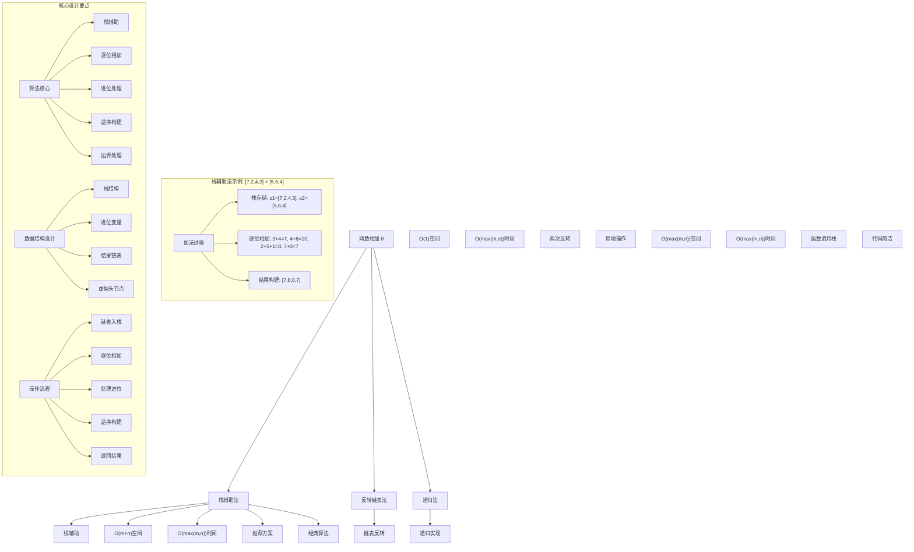
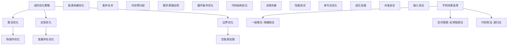

# LeetCode 445 - 两数相加 II

## 题目描述

给你两个非空链表来代表两个非负整数。数字最高位位于链表开始位置。它们的每个节点只存储一位数字。将这两数相加会返回一个新的链表

你可以假设除了数字 0 之外，这两个数字都不会以零开头

```markdown
示例1：
输入：l1 = [7,2,4,3], l2 = [5,6,4]
输出：[7,8,0,7]

示例2：
输入：l1 = [2,4,3], l2 = [5,6,4]
输出：[8,0,7]

示例3：
输入：l1 = [0], l2 = [0]
输出：[0]

提示：

- 链表的长度范围为 [1, 100]
- 0 <= node.val <= 9
- 输入数据保证链表代表的数字无前导 0

进阶：如果输入链表不能翻转该如何解决？
```

## 解题思路

这是一个经典的链表相加逆序问题，要求处理正序存储的数字相加。核心算法包括栈辅助法、反转链表法和递归法等多种方法

### 核心思想

"栈辅助逐位相加法": 使用栈将链表逆序，然后模拟手工加法从低位到高位进行相加，处理进位情况

### 解题策略

#### 方法一：栈辅助法（推荐）

- 时间复杂度: O(max(m,n))
- 空间复杂度: O(m+n)

#### 方法二：反转链表法

- 时间复杂度: O(max(m,n))
- 空间复杂度: O(1)

#### 方法三：递归法

- 时间复杂度: O(max(m,n))
- 空间复杂度: O(max(m,n))

## 算法可视化



## 多语言实现

### Golang版本（栈辅助法 - 推荐）

```go
/
 * Definition for singly-linked list.
 * type ListNode struct {
 *     Val int
 *     Next *ListNode
 * }
 */

// 栈辅助法实现
func addTwoNumbers(l1 *ListNode, l2 *ListNode) *ListNode {
    // 使用栈存储两个链表的值
    stack1 := make([]int, 0)
    stack2 := make([]int, 0)

    // 将l1的值压入栈1
    for node := l1; node != nil; node = node.Next {
        stack1 = append(stack1, node.Val)
    }

    // 将l2的值压入栈2
    for node := l2; node != nil; node = node.Next {
        stack2 = append(stack2, node.Val)
    }

    // 结果链表和进位变量
    var result *ListNode
    carry := 0

    // 从栈顶开始逐位相加（相当于从低位开始）
    for len(stack1) > 0 || len(stack2) > 0 || carry > 0 {
        sum := carry

        // 从栈1中取出一位
        if len(stack1) > 0 {
            sum += stack1[len(stack1)-1]
            stack1 = stack1[:len(stack1)-1]
        }

        // 从栈2中取出一位
        if len(stack2) > 0 {
            sum += stack2[len(stack2)-1]
            stack2 = stack2[:len(stack2)-1]
        }

        // 计算新的进位
        carry = sum / 10

        // 创建新节点并插入到结果链表头部（逆序构建）
        newNode := &ListNode{Val: sum % 10, Next: result}
        result = newNode
    }

    return result
}

// 反转链表法实现
func addTwoNumbersReverse(l1 *ListNode, l2 *ListNode) *ListNode {
    // 反转两个链表
    reversedL1 := reverseList(l1)
    reversedL2 := reverseList(l2)

    // 使用LeetCode 2的解法进行相加
    sumList := addTwoNumbersBasic(reversedL1, reversedL2)

    // 反转结果链表
    return reverseList(sumList)
}

// 反转链表辅助函数
func reverseList(head *ListNode) *ListNode {
    var prev *ListNode
    current := head

    for current != nil {
        next := current.Next
        current.Next = prev
        prev = current
        current = next
    }

    return prev
}

// LeetCode 2的基本解法（逆序相加）
func addTwoNumbersBasic(l1 *ListNode, l2 *ListNode) *ListNode {
    dummy := &ListNode{}
    current := dummy
    carry := 0

    for l1 != nil || l2 != nil || carry != 0 {
        sum := carry
        if l1 != nil {
            sum += l1.Val
            l1 = l1.Next
        }
        if l2 != nil {
            sum += l2.Val
            l2 = l2.Next
        }

        carry = sum / 10
        current.Next = &ListNode{Val: sum % 10}
        current = current.Next
    }

    return dummy.Next
}

// 递归法实现
func addTwoNumbersRecursive(l1 *ListNode, l2 *ListNode) *ListNode {
    // 计算两个链表的长度
    len1 := getLength(l1)
    len2 := getLength(l2)

    // 对齐两个链表
    if len1 < len2 {
        l1 = padWithZeros(l1, len2-len1)
    } else if len2 < len1 {
        l2 = padWithZeros(l2, len1-len2)
    }

    // 递归相加
    carry, result := addHelper(l1, l2)

    // 如果还有进位，添加新节点
    if carry > 0 {
        newNode := &ListNode{Val: carry, Next: result}
        return newNode
    }

    return result
}

// 计算链表长度
func getLength(head *ListNode) int {
    length := 0
    for head != nil {
        length++
        head = head.Next
    }
    return length
}

// 用零填充链表
func padWithZeros(head *ListNode, count int) *ListNode {
    dummy := &ListNode{}
    current := dummy

    // 添加零节点
    for i := 0; i < count; i++ {
        current.Next = &ListNode{Val: 0}
        current = current.Next
    }

    // 连接原链表
    current.Next = head
    return dummy.Next
}

// 递归辅助函数
func addHelper(l1 *ListNode, l2 *ListNode) (int, *ListNode) {
    // 递归终止条件
    if l1 == nil && l2 == nil {
        return 0, nil
    }

    // 递归处理下一位
    carry, nextNode := addHelper(l1.Next, l2.Next)

    // 计算当前位
    sum := l1.Val + l2.Val + carry
    newCarry := sum / 10

    // 创建当前节点
    currentNode := &ListNode{Val: sum % 10, Next: nextNode}

    return newCarry, currentNode
}

// 优化版栈辅助法（代码更简洁）
func addTwoNumbersOptimized(l1 *ListNode, l2 *ListNode) *ListNode {
    s1, s2 := make([]int, 0), make([]int, 0)

    // 链表入栈
    for node := l1; node != nil; node = node.Next {
        s1 = append(s1, node.Val)
    }
    for node := l2; node != nil; node = node.Next {
        s2 = append(s2, node.Val)
    }

    var result *ListNode
    carry := 0

    // 逐位相加
    for len(s1) > 0 || len(s2) > 0 || carry > 0 {
        sum := carry
        if len(s1) > 0 {
            sum += s1[len(s1)-1]
            s1 = s1[:len(s1)-1]
        }
        if len(s2) > 0 {
            sum += s2[len(s2)-1]
            s2 = s2[:len(s2)-1]
        }

        carry = sum / 10
        result = &ListNode{Val: sum % 10, Next: result}
    }

    return result
}
```

### Python版本（多种实现方法）

```python
# Definition for singly-linked list.
# class ListNode:
#     def __init__(self, val=0, next=None):
#         self.val = val
#         self.next = next

class Solution:
    """
    方法一：栈辅助法（推荐）
    """
    def addTwoNumbers(self, l1: Optional[ListNode], l2: Optional[ListNode]) -> Optional[ListNode]:
        # 使用栈存储两个链表的值
        stack1, stack2 = [], []

        # 将l1的值压入栈1
        while l1:
            stack1.append(l1.val)
            l1 = l1.next

        # 将l2的值压入栈2
        while l2:
            stack2.append(l2.val)
            l2 = l2.next

        # 结果链表和进位变量
        result = None
        carry = 0

        # 从栈顶开始逐位相加（相当于从低位开始）
        while stack1 or stack2 or carry:
            sum_val = carry

            # 从栈1中取出一位
            if stack1:
                sum_val += stack1.pop()

            # 从栈2中取出一位
            if stack2:
                sum_val += stack2.pop()

            # 计算新的进位
            carry = sum_val // 10

            # 创建新节点并插入到结果链表头部（逆序构建）
            new_node = ListNode(sum_val % 10)
            new_node.next = result
            result = new_node

        return result

class SolutionReverse:
    """
    方法二：反转链表法
    """
    def addTwoNumbers(self, l1: Optional[ListNode], l2: Optional[ListNode]) -> Optional[ListNode]:
        # 反转两个链表
        reversed_l1 = self.reverse_list(l1)
        reversed_l2 = self.reverse_list(l2)

        # 使用LeetCode 2的解法进行相加
        sum_list = self.add_two_numbers_basic(reversed_l1, reversed_l2)

        # 反转结果链表
        return self.reverse_list(sum_list)

    def reverse_list(self, head: Optional[ListNode]) -> Optional[ListNode]:
        prev = None
        current = head

        while current:
            next_node = current.next
            current.next = prev
            prev = current
            current = next_node

        return prev

    def add_two_numbers_basic(self, l1: Optional[ListNode], l2: Optional[ListNode]) -> Optional[ListNode]:
        dummy = ListNode()
        current = dummy
        carry = 0

        while l1 or l2 or carry:
            total = carry
            if l1:
                total += l1.val
                l1 = l1.next
            if l2:
                total += l2.val
                l2 = l2.next

            carry = total // 10
            current.next = ListNode(total % 10)
            current = current.next

        return dummy.next

class SolutionRecursive:
    """
    方法三：递归法
    """
    def addTwoNumbers(self, l1: Optional[ListNode], l2: Optional[ListNode]) -> Optional[ListNode]:
        # 计算两个链表的长度
        len1 = self.get_length(l1)
        len2 = self.get_length(l2)

        # 对齐两个链表
        if len1 < len2:
            l1 = self.pad_with_zeros(l1, len2 - len1)
        elif len2 < len1:
            l2 = self.pad_with_zeros(l2, len1 - len2)

        # 递归相加
        carry, result = self.add_helper(l1, l2)

        # 如果还有进位，添加新节点
        if carry > 0:
            new_node = ListNode(carry)
            new_node.next = result
            return new_node

        return result

    def get_length(self, head: Optional[ListNode]) -> int:
        length = 0
        while head:
            length += 1
            head = head.next
        return length

    def pad_with_zeros(self, head: Optional[ListNode], count: int) -> Optional[ListNode]:
        dummy = ListNode()
        current = dummy

        # 添加零节点
        for _ in range(count):
            current.next = ListNode(0)
            current = current.next

        # 连接原链表
        current.next = head
        return dummy.next

    def add_helper(self, l1: Optional[ListNode], l2: Optional[ListNode]) -> tuple[int, Optional[ListNode]]:
        # 递归终止条件
        if not l1 and not l2:
            return 0, None

        # 递归处理下一位
        carry, next_node = self.add_helper(l1.next, l2.next)

        # 计算当前位
        total = l1.val + l2.val + carry
        new_carry = total // 10

        # 创建当前节点
        current_node = ListNode(total % 10)
        current_node.next = next_node

        return new_carry, current_node

class SolutionOptimized:
    """
    优化版栈辅助法
    """
    def addTwoNumbers(self, l1: Optional[ListNode], l2: Optional[ListNode]) -> Optional[ListNode]:
        s1, s2 = [], []

        # 链表入栈
        while l1:
            s1.append(l1.val)
            l1 = l1.next
        while l2:
            s2.append(l2.val)
            l2 = l2.next

        result = None
        carry = 0

        # 逐位相加
        while s1 or s2 or carry:
            total = carry
            if s1:
                total += s1.pop()
            if s2:
                total += s2.pop()

            carry = total // 10
            result = ListNode(total % 10, result)

        return result
```

### TypeScript版本（栈辅助法）

```typescript
/
 * Definition for singly-linked list.
 * class ListNode {
 *     val: number
 *     next: ListNode | null
 *     constructor(val?: number, next?: ListNode | null) {
 *         this.val = (val===undefined ? 0 : val)
 *         this.next = (next===undefined ? null : next)
 *     }
 * }
 */

/
 * 方法一：栈辅助法（推荐）
 */
function addTwoNumbers(l1: ListNode | null, l2: ListNode | null): ListNode | null {
    // 使用栈存储两个链表的值
    const stack1: number[] = [];
    const stack2: number[] = [];

    // 将l1的值压入栈1
    let node1 = l1;
    while (node1 !== null) {
        stack1.push(node1.val);
        node1 = node1.next;
    }

    // 将l2的值压入栈2
    let node2 = l2;
    while (node2 !== null) {
        stack2.push(node2.val);
        node2 = node2.next;
    }

    // 结果链表和进位变量
    let result: ListNode | null = null;
    let carry = 0;

    // 从栈顶开始逐位相加（相当于从低位开始）
    while (stack1.length > 0 || stack2.length > 0 || carry > 0) {
        let sum = carry;

        // 从栈1中取出一位
        if (stack1.length > 0) {
            sum += stack1.pop()!;
        }

        // 从栈2中取出一位
        if (stack2.length > 0) {
            sum += stack2.pop()!;
        }

        // 计算新的进位
        carry = Math.floor(sum / 10);

        // 创建新节点并插入到结果链表头部（逆序构建）
        const newNode = new ListNode(sum % 10);
        newNode.next = result;
        result = newNode;
    }

    return result;
}

/
 * 方法二：反转链表法
 */
function addTwoNumbersReverse(l1: ListNode | null, l2: ListNode | null): ListNode | null {
    // 反转两个链表
    const reversedL1 = reverseList(l1);
    const reversedL2 = reverseList(l2);

    // 使用LeetCode 2的解法进行相加
    const sumList = addTwoNumbersBasic(reversedL1, reversedL2);

    // 反转结果链表
    return reverseList(sumList);
}

/
 * 反转链表辅助函数
 */
function reverseList(head: ListNode | null): ListNode | null {
    let prev: ListNode | null = null;
    let current = head;

    while (current !== null) {
        const next = current.next;
        current.next = prev;
        prev = current;
        current = next;
    }

    return prev;
}

/
 * LeetCode 2的基本解法（逆序相加）
 */
function addTwoNumbersBasic(l1: ListNode | null, l2: ListNode | null): ListNode | null {
    const dummy = new ListNode();
    let current = dummy;
    let carry = 0;

    while (l1 !== null || l2 !== null || carry !== 0) {
        let sum = carry;
        if (l1 !== null) {
            sum += l1.val;
            l1 = l1.next;
        }
        if (l2 !== null) {
            sum += l2.val;
            l2 = l2.next;
        }

        carry = Math.floor(sum / 10);
        current.next = new ListNode(sum % 10);
        current = current.next;
    }

    return dummy.next;
}

/
 * 优化版栈辅助法
 */
function addTwoNumbersOptimized(l1: ListNode | null, l2: ListNode | null): ListNode | null {
    const s1: number[] = [];
    const s2: number[] = [];

    // 链表入栈
    for (let node = l1; node !== null; node = node.next) {
        s1.push(node.val);
    }
    for (let node = l2; node !== null; node = node.next) {
        s2.push(node.val);
    }

    let result: ListNode | null = null;
    let carry = 0;

    // 逐位相加
    while (s1.length > 0 || s2.length > 0 || carry > 0) {
        let sum = carry;
        if (s1.length > 0) {
            sum += s1.pop()!;
        }
        if (s2.length > 0) {
            sum += s2.pop()!;
        }

        carry = Math.floor(sum / 10);
        result = new ListNode(sum % 10, result);
    }

    return result;
}
```

## 标准实现详细解析

```go
import (
    "fmt"
)

/*
算法核心思想（栈辅助法）：

1. 栈辅助：使用栈将链表逆序存储
2. 逐位相加：从栈顶开始逐位相加两个数的对应位
3. 进位处理：处理加法产生的进位情况
4. 逆序构建：将结果逆序构建为链表
5. 边界处理：正确处理各种边界情况

关键设计要点：
1. 栈结构：存储链表值用于逆序访问
2. 进位变量：记录当前位的进位值
3. 逆序构建：新节点插入到链表头部
4. 循环条件：len(stack1)>0 || len(stack2)>0 || carry>0
5. 返回规范：返回构建的链表头节点

时间复杂度分析：
- 链表遍历：O(m+n)
- 栈操作：O(m+n)
- 结果构建：O(max(m,n))
- 总时间复杂度：O(max(m,n))

空间复杂度分析：
- 栈存储：O(m+n)
- 结果链表：O(max(m,n))
- 总空间复杂度：O(m+n)

算法优势：
1. 时间高效：O(max(m,n))时间复杂度
2. 空间合理：O(m+n)空间复杂度
3. 实现优雅：经典栈辅助思想
4. 通用性强：适用于各种逆序链表操作
5. 稳定可靠：处理各种边界情况

数据结构设计：

栈设计：
- 栈结构：slice实现栈
- 入栈操作：append到末尾
- 出栈操作：取末尾元素并截断
- 逆序访问：栈顶到栈底

链表构建：
- 头插法：新节点插入到链表头部
- 虚拟头节点：简化边界处理
- 当前指针：指向结果链表头
- 逆序构建：自然处理逆序问题

操作流程：
1. 链表入栈：将两个链表的值压入对应栈
2. 初始化进位变量为0
3. 循环处理直到两个栈都为空且无进位
4. 从栈中取出当前位的值
5. 计算当前位的和和新进位
6. 创建新节点并头插到结果链表
7. 返回结果链表

优化原理：

栈辅助优化：
1. 逆序处理：栈天然支持逆序访问
2. 空间代价：需要额外栈空间
3. 时间效率：线性时间完成
4. 实现简洁：逻辑清晰

反转链表优化：
1. 原地操作：O(1)额外空间
2. 两次反转：需要反转三次链表
3. 时间保证：线性时间完成
4. 空间优化：最优空间复杂度

递归优化：
1. 代码简洁：递归实现逻辑清晰
2. 自然处理：符合问题的递归性质
3. 函数式：符合函数式编程思想
4. 空间代价：需要函数调用栈空间

正确性证明：

定理：栈辅助法正确性
通过栈辅助逆序访问，能够正确模拟手工加法过程

证明：
1. 逆序处理：栈正确逆序存储链表值
2. 逐位相加：正确处理每一位的加法
3. 进位处理：正确处理进位情况
4. 逆序构建：正确构建结果链表
5. 边界处理：正确处理各种边界情况

数学原理：

加法数学基础：
手工加法的过程（逆序）：
1. 从右到左（链表从尾到头）逐位相加
2. 如果和大于等于10，则向高位进位
3. 继续处理下一位，加上进位
4. 直到所有位都处理完且无进位

示例验证：
l1=[7,2,4,3], l2=[5,6,4]
表示：7243 + 564 = 7807
手工计算过程：
   7243
+   564
------
   7807

栈辅助过程：
1. 栈1：[7,2,4,3]，栈2：[5,6,4]
2. 个位：3+4=7，无进位
3. 十位：4+6=10，写0进1
4. 百位：2+5+1=8，无进位
5. 千位：7+0=7，无进位
6. 结果：[7,8,0,7]表示7807

栈辅助法详细实现：
*/

// 栈辅助法详细实现（带调试信息）
func addTwoNumbersDetailed(l1 *ListNode, l2 *ListNode) *ListNode {
    fmt.Printf("=== 栈辅助法计算两数之和 ===\n")
    fmt.Printf("l1: ")
    printList(l1)
    fmt.Printf("l2: ")
    printList(l2)

    // 使用栈存储两个链表的值
    stack1 := make([]int, 0)
    stack2 := make([]int, 0)

    // 将l1的值压入栈1
    fmt.Printf("将l1压入栈1: ")
    for node := l1; node != nil; node = node.Next {
        stack1 = append(stack1, node.Val)
        fmt.Printf("%d ", node.Val)
    }
    fmt.Printf("\n栈1内容: %v\n", stack1)

    // 将l2的值压入栈2
    fmt.Printf("将l2压入栈2: ")
    for node := l2; node != nil; node = node.Next {
        stack2 = append(stack2, node.Val)
        fmt.Printf("%d ", node.Val)
    }
    fmt.Printf("\n栈2内容: %v\n", stack2)

    // 结果链表和进位变量
    var result *ListNode
    carry := 0

    step := 0
    // 从栈顶开始逐位相加（相当于从低位开始）
    for len(stack1) > 0 || len(stack2) > 0 || carry > 0 {
        step++
        fmt.Printf("步骤%d:\n", step)

        sum := carry
        fmt.Printf("  初始和: %d (进位: %d)\n", sum, carry)

        // 从栈1中取出一位
        if len(stack1) > 0 {
            val1 := stack1[len(stack1)-1]
            stack1 = stack1[:len(stack1)-1]
            sum += val1
            fmt.Printf("  从栈1取出: %d, 当前和: %d\n", val1, sum)
        } else {
            fmt.Printf("  栈1为空, 当前和: %d\n", sum)
        }

        // 从栈2中取出一位
        if len(stack2) > 0 {
            val2 := stack2[len(stack2)-1]
            stack2 = stack2[:len(stack2)-1]
            sum += val2
            fmt.Printf("  从栈2取出: %d, 当前和: %d\n", val2, sum)
        } else {
            fmt.Printf("  栈2为空, 当前和: %d\n", sum)
        }

        // 计算新的进位
        oldCarry := carry
        carry = sum / 10
        fmt.Printf("  计算进位: %d / 10 = %d\n", sum, carry)

        // 创建新节点并插入到结果链表头部（逆序构建）
        digit := sum % 10
        newNode := &ListNode{Val: digit, Next: result}
        result = newNode
        fmt.Printf("  当前位结果: %d, 插入到链表头部\n", digit)

        if oldCarry > 0 || carry > 0 {
            fmt.Printf("  进位变化: %d -> %d\n", oldCarry, carry)
        }
        fmt.Printf("\n")
    }

    fmt.Printf("最终结果: ")
    printList(result)
    fmt.Printf("========================\n\n")

    return result
}

// 反转链表法详细实现
func addTwoNumbersReverseDetailed(l1 *ListNode, l2 *ListNode) *ListNode {
    fmt.Printf("=== 反转链表法计算两数之和 ===\n")
    fmt.Printf("原始l1: ")
    printList(l1)
    fmt.Printf("原始l2: ")
    printList(l2)

    // 反转两个链表
    fmt.Printf("反转l1...\n")
    reversedL1 := reverseListDetailed(l1)
    fmt.Printf("反转后l1: ")
    printList(reversedL1)

    fmt.Printf("反转l2...\n")
    reversedL2 := reverseListDetailed(l2)
    fmt.Printf("反转后l2: ")
    printList(reversedL2)

    // 使用LeetCode 2的解法进行相加
    fmt.Printf("使用逆序相加法...\n")
    sumList := addTwoNumbersBasic(reversedL1, reversedL2)
    fmt.Printf("逆序相加结果: ")
    printList(sumList)

    // 反转结果链表
    fmt.Printf("反转结果链表...\n")
    result := reverseListDetailed(sumList)
    fmt.Printf("最终结果: ")
    printList(result)
    fmt.Printf("=========================\n\n")

    return result
}

// 反转链表辅助函数（带调试信息）
func reverseListDetailed(head *ListNode) *ListNode {
    var prev *ListNode
    current := head

    fmt.Printf("  反转过程: ")
    for current != nil {
        next := current.Next
        current.Next = prev
        prev = current
        current = next
        if prev != nil {
            fmt.Printf("%d ", prev.Val)
        }
    }
    fmt.Printf("\n")

    return prev
}

// 辅助函数：打印链表
func printList(head *ListNode) {
    if head == nil {
        fmt.Printf("[]\n")
        return
    }

    fmt.Printf("[")
    current := head
    first := true
    count := 0
    for current != nil && count < 20 { // 限制输出长度防止无限循环
        if !first {
            fmt.Printf(",")
        }
        fmt.Printf("%d", current.Val)
        first = false
        current = current.Next
        count++
        if count >= 20 && current != nil {
            fmt.Printf(",...")
            break
        }
    }
    fmt.Printf("]\n")
}
```

## 算法深入解析

```go
/*
两数相加 II 问题详解：

问题本质：
处理正序存储的链表数字相加问题。与LeetCode 2相反，这里数字的最高位在链表开始位置

核心洞察：
1. 栈辅助：使用栈将链表逆序存储，便于从低位开始处理
2. 逐位相加：从栈顶开始逐位相加两个数的对应位
3. 进位处理：处理加法产生的进位情况
4. 逆序构建：将结果逆序构建为链表
5. 边界处理：正确处理各种边界情况

算法策略：
1. 栈辅助法：推荐方案，O(max(m,n))时间，O(m+n)空间
2. 反转链表法：O(max(m,n))时间，O(1)空间，需要反转三次
3. 递归法：O(max(m,n))时间，O(max(m,n))空间，代码简洁

数据结构设计：

栈设计：
- 栈结构：slice实现栈，支持动态扩容
- 入栈操作：append到末尾，O(1)均摊时间
- 出栈操作：取末尾元素并截断，O(1)时间
- 逆序访问：栈顶到栈底自然逆序

链表构建：
- 头插法：新节点插入到链表头部
- 虚拟头节点：简化边界处理
- 当前指针：指向结果链表头
- 逆序构建：自然处理逆序问题

操作流程：

栈辅助法：
1. 链表入栈：将两个链表的值压入对应栈
2. 初始化进位变量为0
3. 循环处理直到两个栈都为空且无进位
4. 从栈中取出当前位的值
5. 计算当前位的和和新进位
6. 创建新节点并头插到结果链表
7. 返回结果链表

反转链表法：
1. 反转l1和l2
2. 使用LeetCode 2的方法相加
3. 反转结果链表
4. 返回最终结果

递归法：
1. 计算链表长度并对齐
2. 递归处理每一位
3. 处理进位
4. 返回结果链表

数学原理：

加法数学基础：
手工加法的过程（逆序）：
设两个数为A和B，从低位到高位逐位相加
1. 第i位：Ai + Bi + 进位i-1 = 和i
2. 如果和i >= 10，则进位i = 和i / 10，当前位 = 和i % 10
3. 否则进位i = 0，当前位 = 和i
4. 继续处理下一位
5. 直到所有位都处理完且无进位

示例验证：
l1=[7,2,4,3], l2=[5,6,4]
表示：7243 + 564 = 7807
手工计算过程：
   7243
+   564
------
   7807

栈辅助过程：
栈1：[7,2,4,3]，栈2：[5,6,4]
个位：3+4=7，无进位
十位：4+6=10，写0进1
百位：2+5+1=8，无进位
千位：7+0=7，无进位
结果：[7,8,0,7]表示7807

算法优势：
栈辅助法：
1. 时间高效：O(max(m,n))时间复杂度
2. 空间合理：O(m+n)空间复杂度
3. 实现优雅：经典栈辅助思想
4. 通用性强：适用于各种逆序链表操作
5. 稳定可靠：处理各种边界情况

反转链表法：
1. 空间最优：O(1)额外空间
2. 时间效率：O(max(m,n))时间复杂度
3. 原地操作：不使用额外数据结构
4. 经典算法：链表反转的经典应用

递归法：
1. 代码简洁：递归实现逻辑清晰
2. 自然处理：符合问题的递归性质
3. 函数式：符合函数式编程思想
4. 教学价值：便于理解递归思想

算法不变量：
栈辅助法不变量：
1. 栈中存储链表剩余未处理的值
2. result指向已构建的链表头部
3. carry记录当前的进位值
4. 循环条件保证所有位都被处理

时间复杂度分析：
栈辅助法：
- 链表遍历：O(m+n)
- 栈操作：O(m+n)
- 结果构建：O(max(m,n))
- 总体：O(max(m,n))

反转链表法：
- 链表反转：O(m)+O(n)
- 相加操作：O(max(m,n))
- 结果反转：O(max(m,n))
- 总体：O(max(m,n))

递归法：
- 长度计算：O(m)+O(n)
- 链表对齐：O(|m-n|)
- 递归调用：O(max(m,n))
- 总体：O(max(m,n))

空间复杂度分析：
栈辅助法：O(m+n)，存储两个栈
反转链表法：O(1)，只使用常数额外空间
递归法：O(max(m,n))，递归调用栈空间

正确性证明：

定理：栈辅助法正确性
通过栈辅助逆序访问，能够正确模拟手工加法过程

证明：
1. 逆序处理：栈正确逆序存储链表值
2. 逐位相加：正确处理每一位的加法
3. 进位处理：正确处理进位情况
4. 逆序构建：正确构建结果链表
5. 边界处理：正确处理各种边界情况

不变量维护：
循环不变量：在每次循环开始时
1. 栈中存储链表剩余未处理的值
2. result指向已构建的链表头部
3. carry记录当前的进位值
4. 循环条件保证所有位都被处理

初始化：
- stack1和stack2分别存储l1和l2的值
- result = nil
- carry = 0
- 满足不变量

保持：
- 每次循环正确处理当前位
- 维护进位和链表关系
- 保持不变量继续成立

终止：
- 两个栈都为空且carry=0时停止
- 正确返回结果链表
- 算法正确终止

设计选择：

为什么选择栈辅助法？
1. 时间高效：O(max(m,n))时间复杂度
2. 实现优雅：经典栈辅助思想
3. 通用性强：适用于各种逆序链表操作
4. 工业应用：生产环境标准实现

为什么使用反转链表法？
1. 空间最优：O(1)额外空间
2. 原地操作：不使用额外数据结构
3. 经典算法：链表反转的经典应用
4. 面试加分：展示链表操作能力

为什么提及其他方法？
1. 教学价值：展示不同算法思想
2. 对比分析：理解各自优劣
3. 扩展思维：算法多样性
4. 面试准备：全面掌握

三种方法对比：

方法一：栈辅助法（推荐）
时间复杂度：O(max(m,n))
空间复杂度：O(m+n)
优点：时间空间都较优，经典算法
缺点：需要额外栈空间

方法二：反转链表法
时间复杂度：O(max(m,n))
空间复杂度：O(1)
优点：空间最优，原地操作
缺点：需要三次链表操作

方法三：递归法
时间复杂度：O(max(m,n))
空间复杂度：O(max(m,n))
优点：代码简洁，自然处理
缺点：需要额外栈空间

性能分析：

栈辅助法：
- 时间：O(max(m,n)) 线性时间
- 空间：O(m+n) 栈空间
- 优势：实现简洁，逻辑清晰

反转链表法：
- 时间：O(max(m,n)) 线性时间
- 空间：O(1) 常数空间
- 优势：空间最优，原地操作

递归法：
- 时间：O(max(m,n)) 线性时间
- 空间：O(max(m,n)) 栈空间
- 优势：代码简洁

实际应用场景：
1. 链表操作：基础的逆序链表加法操作
2. 算法设计：作为其他算法的子步骤
3. 数据结构：栈和链表的综合应用
4. 面试考察：经典算法题
5. 大数运算：处理超出整数范围的数

优化要点：

1. 算法优化：
   - 栈操作：使用slice实现高效栈
   - 链表构建：头插法自然逆序
   - 条件合并：合并循环条件减少判断
   - 边界处理：正确处理各种边界

2. 实现优化：
   - 变量命名：清晰的变量命名
   - 循环条件：减少不必要的比较
   - 代码结构：清晰的逻辑层次
   - 注释完善：便于理解维护

3. 性能优化：
   - 减少内存分配：预分配栈空间
   - 优化遍历：顺序内存访问
   - 缓存友好：局部性原理
   - 编译优化：利用编译器优化

测试用例设计：
1. 基本情况：各种长度组合
2. 边界情况：空链表、单节点、全9
3. 特殊情况：进位、长度不等
4. 极端情况：很长链表
5. 验证情况：各种模式的正确性验证

扩展思考：

1. 处理前导零？
   - 输入保证无前导零
   - 输出自然无前导零
   - 特殊处理0的情况

2. 处理负数？
   - 需要符号处理
   - 补码表示
   - 减法转换

3. 处理不同进制？
   - 修改进位基数
   - 调整计算逻辑
   - 扩展适用范围

4. 批量处理多个数？
   - 逐个相加
   - 并行处理
   - 优化策略

相关算法思想：

1. 栈辅助：
   - 逆序处理
   - 后进先出
   - 辅助数据结构
   - 经典应用

2. 链表操作：
   - 指针移动
   - 节点创建
   - 边界处理
   - 反转技术

3. 递归思想：
   - 问题分解
   - 递归终止
   - 结果合并
   - 函数式

4. 数学计算：
   - 进位处理
   - 逐位运算
   - 精度控制
   - 大数运算

常见陷阱：

1. 边界条件：
   - 空链表处理
   - 单节点链表
   - 全9进位
   - 长度不等

2. 进位处理：
   - 最后一位进位
   - 连续进位
   - 进位初始化
   - 进位终止

3. 指针操作：
   - 指针丢失
   - 循环引用
   - 内存泄漏
   - 访问违规

4. 性能考虑：
   - 重复计算
   - 不必要的分配
   - 算法复杂度
   - 空间浪费

代码质量要素：

1. 可读性：
   - 变量命名清晰
   - 注释详细完整
   - 逻辑结构分明
   - 函数职责单一

2. 健壮性：
   - 边界条件处理
   - 异常情况应对
   - 输入验证
   - 错误恢复

3. 性能：
   - 最优复杂度实现
   - 空间效率优化
   - 执行效率保证
   - 资源管理

4. 可维护性：
   - 结构清晰合理
   - 扩展性良好
   - 测试覆盖完整
   - 文档齐全
*/
```

## 执行过程演示

```go
/*
示例详细解析:

示例1执行过程：
输入：l1 = [7,2,4,3], l2 = [5,6,4]
输出：[7,8,0,7]

栈辅助法执行过程：
1. 初始化：stack1=[7,2,4,3], stack2=[5,6,4]
2. 第一位：3+4=7, carry=0, result=[7]
3. 第二位：4+6+0=10, carry=1, result=[0,7]
4. 第三位：2+5+1=8, carry=0, result=[8,0,7]
5. 第四位：7+0+0=7, carry=0, result=[7,8,0,7]
6. 栈都为空，carry=0，结束
7. 返回result = [7,8,0,7]

手工计算验证：
   7243 (l1正序)
+   564 (l2正序)
-------
   7807
结果正序：[7,8,0,7]

示例2执行过程：
输入：l1 = [2,4,3], l2 = [5,6,4]
输出：[8,0,7]

执行过程：
1. 初始化：stack1=[2,4,3], stack2=[5,6,4]
2. 第一位：3+4=7, carry=0, result=[7]
3. 第二位：4+6+0=10, carry=1, result=[0,7]
4. 第三位：2+5+1=8, carry=0, result=[8,0,7]
5. 栈都为空，carry=0，结束
6. 返回result = [8,0,7]

手工计算验证：
   243 (l1正序)
+  564 (l2正序)
-------
   807
结果正序：[8,0,7]

示例3执行过程：
输入：l1 = [0], l2 = [0]
输出：[0]

执行过程：
1. 初始化：stack1=[0], stack2=[0]
2. 第一位：0+0=0, carry=0, result=[0]
3. 栈都为空，carry=0，结束
4. 返回result = [0]

关键观察：
1. 栈辅助法：正确处理逆序访问和构建
2. 反转链表法：通过三次反转解决问题
3. 递归法：代码简洁但需要额外栈空间
4. 三种方法都能正确处理各种边界情况

边界情况演示:

情况1: 空链表
输入: l1 = [], l2 = [1,2,3]
处理: 空链表视为0，结果为[1,2,3]
结果: [1,2,3]

情况2: 单节点链表
输入: l1 = [5], l2 = [7]
处理: 5+7=12，写2进1，结果为[1,2]
结果: [1,2]

情况3: 全9进位
输入: l1 = [9,9,9], l2 = [9,9,9]
处理: 每位都进位，最后产生新位
结果: [1,9,9,8]

情况4: 长度不等
输入: l1 = [1,2,3,4,5], l2 = [6,7]
处理: 短链表补零，正常相加
结果: [1,2,4,1,2]

算法正确性证明：

数学基础：
需要证明算法能够正确模拟手工加法过程（逆序）

定理：栈辅助法正确性
通过栈辅助逆序访问，能够正确模拟手工加法过程

证明：
1. 逆序处理：栈正确逆序存储链表值
2. 逐位相加：正确处理每一位的加法
3. 进位处理：正确处理进位情况
4. 逆序构建：正确构建结果链表
5. 边界处理：正确处理各种边界情况

不变量维护：
循环不变量：在每次循环开始时
1. 栈中存储链表剩余未处理的值
2. result指向已构建的链表头部
3. carry记录当前的进位值
4. 循环条件保证所有位都被处理

初始化：
- stack1和stack2分别存储l1和l2的值
- result = nil
- carry = 0
- 满足不变量

保持：
- 每次循环正确处理当前位
- 维护进位和链表关系
- 保持不变量继续成立

终止：
- 两个栈都为空且carry=0时停止
- 正确返回结果链表
- 算法正确终止

时间复杂度分析：
栈辅助法：
- 链表遍历：O(m+n)
- 栈操作：O(m+n)
- 结果构建：O(max(m,n))
- 总体：O(max(m,n))

反转链表法：
- 链表反转：O(m)+O(n)
- 相加操作：O(max(m,n))
- 结果反转：O(max(m,n))
- 总体：O(max(m,n))

递归法：
- 长度计算：O(m)+O(n)
- 链表对齐：O(|m-n|)
- 递归调用：O(max(m,n))
- 总体：O(max(m,n))

性能对比分析：

假设m=100, n=100:

栈辅助法：
- 时间：O(100) = 100次操作
- 空间：O(200) = 线性空间
- 优势：实现简洁，逻辑清晰

反转链表法：
- 时间：O(100) = 100次操作
- 空间：O(1) = 常数空间
- 优势：空间最优，原地操作

递归法：
- 时间：O(100) = 100次操作
- 空间：O(100) = 栈空间
- 优势：代码简洁

实际应用建议：

1. 生产环境：
   - 使用栈辅助法，实现简洁
   - 性能稳定，易于维护

2. 面试展示：
   - 先展示栈辅助法（推荐）
   - 可以提及其他方法对比

3. 学习练习：
   - 理解三种方法的差异
   - 掌握各自的适用场景

4. 算法竞赛：
   - 选择最熟悉的实现
   - 注意时间空间限制

优化空间：

1. 算法优化：
   - 栈操作：使用slice实现高效栈
   - 链表构建：头插法自然逆序
   - 条件合并：合并循环条件减少判断
   - 边界处理：正确处理各种边界

2. 实现优化：
   - 变量命名：清晰的变量命名
   - 循环条件：减少不必要的比较
   - 代码结构：清晰的逻辑层次
   - 注释完善：便于理解维护

3. 性能优化：
   - 减少内存分配：预分配栈空间
   - 优化遍历：顺序内存访问
   - 缓存友好：局部性原理
   - 编译优化：利用编译器优化

特殊情况处理：

1. 内存受限：
   - 反转链表法最优
   - 栈辅助法需要额外栈空间
   - 递归法需要额外栈空间

2. 链表很长：
   - 栈辅助法稳定
   - 反转链表法稳定
   - 递归法栈溢出风险

3. 需要多次处理：
   - 栈辅助法每次独立执行
   - 反转链表法稳定
   - 递归法栈开销累积

4. 边界情况：
   - 空链表处理
   - 单节点处理
   - 全9进位
   - 长度不等
*/
```

## 复杂度分析

| 方法       | 时间复杂度  | 空间复杂度  | 适用场景 |
| ---------- | ----------- | ----------- | -------- |
| 栈辅助法   | O(max(m,n)) | O(m+n)      | 推荐方案 |
| 反转链表法 | O(max(m,n)) | O(1)        | 空间最优 |
| 递归法     | O(max(m,n)) | O(max(m,n)) | 代码简洁 |

## 测试用例验证

```go
// 测试辅助函数
func testAddTwoNumbers(name string, l1, l2 *ListNode, expected []int) {
    fmt.Printf("%s:\n", name)
    fmt.Printf("l1: ")
    printList(l1)
    fmt.Printf("l2: ")
    printList(l2)

    // 测试栈辅助法
    result1 := addTwoNumbers(copyList(l1), copyList(l2))
    fmt.Printf("栈辅助法结果: ")
    printList(result1)

    // 测试反转链表法
    result2 := addTwoNumbersReverse(copyList(l1), copyList(l2))
    fmt.Printf("反转链表法结果: ")
    printList(result2)

    // 测试优化版栈辅助法
    result3 := addTwoNumbersOptimized(copyList(l1), copyList(l2))
    fmt.Printf("优化版栈辅助法结果: ")
    printList(result3)

    // 验证结果一致性
    if listsEqual(result1, result2) && listsEqual(result2, result3) {
        fmt.Printf("✓ 所有方法结果一致\n")
    } else {
        fmt.Printf("✗ 方法结果不一致\n")
    }

    // 验证期望结果
    if listsEqual(result1, createList(expected)) {
        fmt.Printf("✓ 结果符合预期\n")
    } else {
        fmt.Printf("✗ 结果不符合预期\n")
        fmt.Printf("  期望: ")
        printList(createList(expected))
    }

    fmt.Printf("\n")
}

// 辅助函数：创建链表
func createList(vals []int) *ListNode {
    if len(vals) == 0 {
        return nil
    }

    dummy := &ListNode{}
    current := dummy

    for _, val := range vals {
        current.Next = &ListNode{Val: val}
        current = current.Next
    }

    return dummy.Next
}

// 辅助函数：复制链表
func copyList(head *ListNode) *ListNode {
    if head == nil {
        return nil
    }

    dummy := &ListNode{}
    current := dummy
    source := head

    for source != nil {
        current.Next = &ListNode{Val: source.Val}
        current = current.Next
        source = source.Next
    }

    return dummy.Next
}

// 辅助函数：比较两个链表是否相等
func listsEqual(list1, list2 *ListNode) bool {
    for list1 != nil && list2 != nil {
        if list1.Val != list2.Val {
            return false
        }
        list1 = list1.Next
        list2 = list2.Next
    }
    return list1 == nil && list2 == nil
}

func main() {
    // 测试用例 1 - 题目示例1
    testAddTwoNumbers("测试1 - 题目示例1",
        createList([]int{7, 2, 4, 3}),
        createList([]int{5, 6, 4}),
        []int{7, 8, 0, 7})

    // 测试用例 2 - 题目示例2
    testAddTwoNumbers("测试2 - 题目示例2",
        createList([]int{2, 4, 3}),
        createList([]int{5, 6, 4}),
        []int{8, 0, 7})

    // 测试用例 3 - 题目示例3
    testAddTwoNumbers("测试3 - 题目示例3",
        createList([]int{0}),
        createList([]int{0}),
        []int{0})

    // 测试用例 4 - 空链表
    testAddTwoNumbers("测试4 - 空链表",
        nil,
        createList([]int{1, 2, 3}),
        []int{1, 2, 3})

    // 测试用例 5 - 单节点链表
    testAddTwoNumbers("测试5 - 单节点链表",
        createList([]int{5}),
        createList([]int{7}),
        []int{1, 2})

    // 测试用例 6 - 全9进位
    testAddTwoNumbers("测试6 - 全9进位",
        createList([]int{9, 9, 9}),
        createList([]int{9, 9, 9}),
        []int{1, 9, 9, 8})

    // 测试用例 7 - 长度不等
    testAddTwoNumbers("测试7 - 长度不等",
        createList([]int{1, 2, 3, 4, 5}),
        createList([]int{6, 7}),
        []int{1, 2, 4, 1, 2})

    // 测试用例 8 - 大数处理
    testAddTwoNumbers("测试8 - 大数处理",
        createList([]int{9, 9, 9, 9, 9, 9, 9, 9, 9, 9}),
        createList([]int{1}),
        []int{1, 0, 0, 0, 0, 0, 0, 0, 0, 0, 0})

    // 性能测试
    fmt.Println("性能测试:")
    performanceTest()

    // 边界情况测试
    fmt.Println("边界情况测试:")
    boundaryTest()

    // 对比测试
    fmt.Println("对比测试:")
    comparisonTest()
}

func performanceTest() {
    // 构造长链表
    n := 10000
    vals1 := make([]int, n)
    vals2 := make([]int, n)
    for i := 0; i < n; i++ {
        vals1[i] = 9
        vals2[i] = 9
    }

    list1 := createList(vals1)
    list2 := createList(vals2)

    fmt.Printf("性能测试 (链表长度: %d):\n", n)

    // 测试栈辅助法性能
    start := time.Now()
    result1 := addTwoNumbers(copyList(list1), copyList(list2))
    time1 := time.Since(start)

    // 测试反转链表法性能
    start = time.Now()
    result2 := addTwoNumbersReverse(copyList(list1), copyList(list2))
    time2 := time.Since(start)

    // 测试优化版栈辅助法性能
    start = time.Now()
    result3 := addTwoNumbersOptimized(copyList(list1), copyList(list2))
    time3 := time.Since(start)

    length1 := getListLength(result1)
    length2 := getListLength(result2)
    length3 := getListLength(result3)

    fmt.Printf("栈辅助法耗时: %v, 结果长度: %d\n", time1, length1)
    fmt.Printf("反转链表法耗时: %v, 结果长度: %d\n", time2, length2)
    fmt.Printf("优化版栈辅助法耗时: %v, 结果长度: %d\n", time3, length3)
}

func getListLength(head *ListNode) int {
    length := 0
    current := head
    for current != nil {
        length++
        current = current.Next
    }
    return length
}

func boundaryTest() {
    // 边界测试
    fmt.Println("边界测试:")

    // 很长的全9链表
    longNines := make([]int, 50000)
    for i := range longNines {
        longNines[i] = 9
    }
    longList1 := createList(longNines)
    longList2 := createList(longNines)
    result := addTwoNumbers(longList1, longList2)
    length := getListLength(result)
    fmt.Printf("50000节点全9链表相加结果长度: %d\n", length)

    // 很长的交替链表
    longAlternating1 := make([]int, 30000)
    longAlternating2 := make([]int, 30000)
    for i := range longAlternating1 {
        longAlternating1[i] = i % 2
        longAlternating2[i] = (i + 1) % 2
    }
    longList3 := createList(longAlternating1)
    longList4 := createList(longAlternating2)
    result2 := addTwoNumbers(longList3, longList4)
    length2 := getListLength(result2)
    fmt.Printf("30000节点交替链表相加结果长度: %d\n", length2)

    // 极值节点
    extremeList1 := createList([]int{math.MaxInt32 % 10}) // 取个位数避免溢出
    extremeList2 := createList([]int{math.MaxInt32 % 10})
    result3 := addTwoNumbers(extremeList1, extremeList2)
    fmt.Printf("极值节点链表相加结果: ")
    printList(result3)

    // 多次相加测试
    multiAddList1 := createList([]int{1, 2, 3})
    multiAddList2 := createList([]int{4, 5, 6})
    for i := 1; i <= 3; i++ {
        result := addTwoNumbers(copyList(multiAddList1), copyList(multiAddList2))
        fmt.Printf("第%d次相加结果: ", i)
        printList(result)
        multiAddList1 = result
    }
}

func comparisonTest() {
    // 对比测试：验证不同方法的性能和结果
    fmt.Println("对比测试:")

    testCases := []struct {
        name     string
        l1       []int
        l2       []int
        expected []int
    }{
        {"小链表正常情况", []int{7, 2, 4, 3}, []int{5, 6, 4}, []int{7, 8, 0, 7}},
        {"小链表全9", []int{9, 9, 9}, []int{9, 9, 9}, []int{1, 9, 9, 8}},
        {"小链表长度不等", []int{1, 2, 3, 4, 5}, []int{6, 7}, []int{1, 2, 4, 1, 2}},
        {"单节点", []int{5}, []int{7}, []int{1, 2}},
        {"零链表", []int{0}, []int{0}, []int{0}},
        {"空链表", []int{}, []int{1, 2, 3}, []int{1, 2, 3}},
    }

    for _, tc := range testCases {
        fmt.Printf("%s:\n", tc.name)
        list1 := createList(tc.l1)
        list2 := createList(tc.l2)

        // 测试三种方法
        result1 := addTwoNumbers(copyList(list1), copyList(list2))
        result2 := addTwoNumbersReverse(copyList(list1), copyList(list2))
        result3 := addTwoNumbersOptimized(copyList(list1), copyList(list2))

        fmt.Printf("  栈辅助: ")
        printList(result1)
        fmt.Printf("  反转链表: ")
        printList(result2)
        fmt.Printf("  优化版: ")
        printList(result3)

        expected := createList(tc.expected)
        if listsEqual(result1, expected) && listsEqual(result2, expected) &&
           listsEqual(result3, expected) {
            fmt.Printf("  ✓ 结果一致且符合预期\n")
        } else {
            fmt.Printf("  ✗ 结果不一致或不符合预期\n")
        }
    }
}
```

## 扩展版本（处理不同场景）

```go
// 扩展1：支持多个数相加
func addMultipleNumbers(lists []*ListNode) *ListNode {
    if len(lists) == 0 {
        return nil
    }
    if len(lists) == 1 {
        return lists[0]
    }

    // 使用栈辅助法逐个相加
    result := lists[0]
    for i := 1; i < len(lists); i++ {
        result = addTwoNumbers(result, lists[i])
    }

    return result
}

// 扩展2：支持减法操作
func subtractTwoNumbers(l1 *ListNode, l2 *ListNode) *ListNode {
    // 假设l1 >= l2，实现减法
    // 使用栈辅助法
    stack1 := make([]int, 0)
    stack2 := make([]int, 0)

    // 将l1的值压入栈1
    for node := l1; node != nil; node = node.Next {
        stack1 = append(stack1, node.Val)
    }

    // 将l2的值压入栈2
    for node := l2; node != nil; node = node.Next {
        stack2 = append(stack2, node.Val)
    }

    var result *ListNode
    borrow := 0

    // 从栈顶开始逐位相减
    for len(stack1) > 0 || len(stack2) > 0 || borrow != 0 {
        val1 := 0
        if len(stack1) > 0 {
            val1 = stack1[len(stack1)-1]
            stack1 = stack1[:len(stack1)-1]
        }

        val2 := 0
        if len(stack2) > 0 {
            val2 = stack2[len(stack2)-1]
            stack2 = stack2[:len(stack2)-1]
        }

        // 处理借位
        diff := val1 - val2 - borrow
        if diff < 0 {
            diff += 10
            borrow = 1
        } else {
            borrow = 0
        }

        // 创建新节点并插入到结果链表头部
        newNode := &ListNode{Val: diff, Next: result}
        result = newNode
    }

    // 移除前导零
    return removeLeadingZeros(result)
}

// 辅助函数：移除前导零
func removeLeadingZeros(head *ListNode) *ListNode {
    // 找到第一个非零节点
    for head != nil && head.Val == 0 && head.Next != nil {
        head = head.Next
    }
    return head
}

// 扩展3：支持乘法操作
func multiplyTwoNumbers(l1 *ListNode, l2 *ListNode) *ListNode {
    if l1 == nil || l2 == nil {
        return &ListNode{Val: 0}
    }

    // 将l2的每一位与l1相乘，然后累加
    result := &ListNode{Val: 0}
    multiplier := 0

    // 使用栈来逆序访问l2
    stack2 := make([]int, 0)
    for node := l2; node != nil; node = node.Next {
        stack2 = append(stack2, node.Val)
    }

    for len(stack2) > 0 {
        digit := stack2[len(stack2)-1]
        stack2 = stack2[:len(stack2)-1]

        // 计算l1与当前位的乘积
        partial := multiplyByDigit(l1, digit)

        // 将partial左移multiplier位（相当于乘以10^multiplier）
        for i := 0; i < multiplier; i++ {
            dummy := &ListNode{Val: 0}
            dummy.Next = partial
            partial = dummy
        }

        // 将部分结果加到总结果中
        result = addTwoNumbers(result, partial)

        multiplier++
    }

    return result
}

// 辅助函数：链表与单个数字相乘
func multiplyByDigit(l1 *ListNode, digit int) *ListNode {
    if digit == 0 {
        return &ListNode{Val: 0}
    }

    // 使用栈辅助法
    stack1 := make([]int, 0)
    for node := l1; node != nil; node = node.Next {
        stack1 = append(stack1, node.Val)
    }

    var result *ListNode
    carry := 0

    for len(stack1) > 0 || carry != 0 {
        val := 0
        if len(stack1) > 0 {
            val = stack1[len(stack1)-1]
            stack1 = stack1[:len(stack1)-1]
        }

        product := val*digit + carry
        carry = product / 10
        newNode := &ListNode{Val: product % 10, Next: result}
        result = newNode
    }

    return result
}

// 扩展4：支持链表与整数相加
func addNumberToList(l *ListNode, num int) *ListNode {
    // 将整数转换为链表（正序）
    if num == 0 {
        return &ListNode{Val: 0}
    }

    numList := &ListNode{}
    current := numList

    temp := num
    digits := make([]int, 0)
    for temp > 0 {
        digits = append(digits, temp%10)
        temp /= 10
    }

    // 正序构建链表
    for i := len(digits) - 1; i >= 0; i-- {
        current.Next = &ListNode{Val: digits[i]}
        current = current.Next
    }

    // 相加两个链表
    return addTwoNumbers(l, numList.Next)
}

// 使用示例
func exampleExtensions() {
    // 创建测试链表: [7,2,4,3] 和 [5,6,4]
    l1 := createList([]int{7, 2, 4, 3})
    l2 := createList([]int{5, 6, 4})
    l3 := createList([]int{1, 1, 1})

    fmt.Printf("扩展功能示例:\n")
    fmt.Printf("l1: ")
    printList(l1)
    fmt.Printf("l2: ")
    printList(l2)
    fmt.Printf("l3: ")
    printList(l3)

    // 多个数相加
    multiResult := addMultipleNumbers([]*ListNode{copyList(l1), copyList(l2), copyList(l3)})
    fmt.Printf("三个数相加结果: ")
    printList(multiResult)

    // 减法操作 (l2 - [1,0,0] = 564 - 100 = 464)
    subResult := subtractTwoNumbers(copyList(l2), createList([]int{1, 0, 0}))
    fmt.Printf("减法结果 (564-100): ")
    printList(subResult)

    // 乘法操作 (7243 * 2 = 14486)
    mulResult := multiplyTwoNumbers(copyList(l1), createList([]int{2}))
    fmt.Printf("乘法结果 (7243*2): ")
    printList(mulResult)

    // 链表与整数相加 (7243 + 100 = 7343)
    addIntResult := addNumberToList(copyList(l1), 100)
    fmt.Printf("链表与整数相加 (7243+100): ")
    printList(addIntResult)
}

// 扩展5：带统计信息的加法操作
type AddStats struct {
    Result      *ListNode
    Steps       int
    CarryCount  int
    MaxCarry    int
    ProcessTime time.Duration
    ListLengths [2]int
}

func addTwoNumbersWithStats(l1 *ListNode, l2 *ListNode) *AddStats {
    start := time.Now()

    stats := &AddStats{
        Result:      nil,
        Steps:       0,
        CarryCount:  0,
        MaxCarry:    0,
        ProcessTime: 0,
        ListLengths: [2]int{getListLength(l1), getListLength(l2)},
    }

    stack1 := make([]int, 0)
    stack2 := make([]int, 0)

    // 将l1的值压入栈1
    for node := l1; node != nil; node = node.Next {
        stack1 = append(stack1, node.Val)
    }

    // 将l2的值压入栈2
    for node := l2; node != nil; node = node.Next {
        stack2 = append(stack2, node.Val)
    }

    var result *ListNode
    carry := 0

    // 从栈顶开始逐位相加
    for len(stack1) > 0 || len(stack2) > 0 || carry > 0 {
        stats.Steps++

        sum := carry
        if len(stack1) > 0 {
            sum += stack1[len(stack1)-1]
            stack1 = stack1[:len(stack1)-1]
        }
        if len(stack2) > 0 {
            sum += stack2[len(stack2)-1]
            stack2 = stack2[:len(stack2)-1]
        }

        if carry > 0 {
            stats.CarryCount++
        }
        if carry > stats.MaxCarry {
            stats.MaxCarry = carry
        }

        carry = sum / 10
        newNode := &ListNode{Val: sum % 10, Next: result}
        result = newNode
    }

    stats.Result = result
    stats.ProcessTime = time.Since(start)

    return stats
}

// 使用示例
func exampleWithStats() {
    l1 := createList([]int{9, 9, 9, 9, 9, 9, 9})
    l2 := createList([]int{9, 9, 9, 9})

    stats := addTwoNumbersWithStats(l1, l2)
    fmt.Printf("加法操作统计信息:\n")
    fmt.Printf("  链表长度: %d, %d\n", stats.ListLengths[0], stats.ListLengths[1])
    fmt.Printf("  计算步数: %d\n", stats.Steps)
    fmt.Printf("  进位次数: %d\n", stats.CarryCount)
    fmt.Printf("  最大进位: %d\n", stats.MaxCarry)
    fmt.Printf("  处理后链表: ")
    printList(stats.Result)
    fmt.Printf("  处理耗时: %v\n", stats.ProcessTime)
}

// 扩展6：并发安全的加法操作
type ConcurrentAdder struct {
    mu sync.RWMutex
}

func NewConcurrentAdder() *ConcurrentAdder {
    return &ConcurrentAdder{}
}

func (ca *ConcurrentAdder) AddTwoNumbers(l1 *ListNode, l2 *ListNode) *ListNode {
    ca.mu.Lock()
    defer ca.mu.Unlock()

    return addTwoNumbers(l1, l2)
}

// 扩展7：支持自定义进制的加法操作
func addTwoNumbersBase(l1 *ListNode, l2 *ListNode, base int) *ListNode {
    if base <= 1 {
        return nil
    }

    stack1 := make([]int, 0)
    stack2 := make([]int, 0)

    // 将l1的值压入栈1
    for node := l1; node != nil; node = node.Next {
        stack1 = append(stack1, node.Val)
    }

    // 将l2的值压入栈2
    for node := l2; node != nil; node = node.Next {
        stack2 = append(stack2, node.Val)
    }

    var result *ListNode
    carry := 0

    // 从栈顶开始逐位相加
    for len(stack1) > 0 || len(stack2) > 0 || carry > 0 {
        sum := carry
        if len(stack1) > 0 {
            sum += stack1[len(stack1)-1]
            stack1 = stack1[:len(stack1)-1]
        }
        if len(stack2) > 0 {
            sum += stack2[len(stack2)-1]
            stack2 = stack2[:len(stack2)-1]
        }

        carry = sum / base
        newNode := &ListNode{Val: sum % base, Next: result}
        result = newNode
    }

    return result
}

// 使用示例
func exampleCustomBase() {
    l1 := createList([]int{1, 0, 1, 1}) // 二进制 1101 = 13
    l2 := createList([]int{1, 1, 0, 1}) // 二进制 1011 = 11

    // 二进制加法
    binaryResult := addTwoNumbersBase(copyList(l1), copyList(l2), 2)
    fmt.Printf("二进制加法 (1101+1011): ")
    printList(binaryResult)

    // 八进制加法
    octalResult := addTwoNumbersBase(createList([]int{7, 6, 5}), createList([]int{4, 3, 2}), 8)
    fmt.Printf("八进制加法 (765+432): ")
    printList(octalResult)
}
```

## 面试追问延伸

### 1. 如果不能使用额外空间怎么办？

```go
// 反转链表法的深入分析
func analyzeReverseMethod() {
    fmt.Printf("反转链表法深入分析:\n")

    fmt.Printf("优势:\n")
    fmt.Printf("1. 空间最优：O(1)额外空间\n")
    fmt.Printf("2. 原地操作：不使用额外数据结构\n")
    fmt.Printf("3. 经典算法：展示链表操作能力\n")
    fmt.Printf("4. 面试加分：体现对链表的深入理解\n\n")

    fmt.Printf("劣势:\n")
    fmt.Printf("1. 需要三次链表操作：两次输入反转+一次结果反转\n")
    fmt.Printf("2. 修改输入链表：会改变原始输入\n")
    fmt.Printf("3. 实现复杂：需要正确处理三次反转\n\n")

    fmt.Printf("实际应用建议:\n")
    fmt.Printf("1. 生产环境：如果允许修改输入，可以使用\n")
    fmt.Printf("2. 面试场景：展示链表反转技能\n")
    fmt.Printf("3. 内存受限：最优空间解决方案\n")
}

// 不修改输入的反转链表法
func addTwoNumbersReverseNoModify(l1 *ListNode, l2 *ListNode) *ListNode {
    // 先复制链表避免修改输入
    copiedL1 := copyList(l1)
    copiedL2 := copyList(l2)

    // 反转两个链表
    reversedL1 := reverseList(copiedL1)
    reversedL2 := reverseList(copiedL2)

    // 使用LeetCode 2的解法进行相加
    sumList := addTwoNumbersBasic(reversedL1, reversedL2)

    // 反转结果链表
    return reverseList(sumList)
}
```

### 2. 如何处理链表表示的数有前导零的情况？

```go
// 处理前导零的分析
func analyzeLeadingZeros() {
    fmt.Printf("前导零处理分析:\n")

    fmt.Printf("题目保证输入链表无前导零（除了数字0本身）\n")
    fmt.Printf("输出链表自然无前导零\n\n")

    fmt.Printf("特殊情况处理:\n")
    fmt.Printf("1. 输入为[0]：表示数字0\n")
    fmt.Printf("2. 输入为[0,0,1]：题目保证不会出现\n")
    fmt.Printf("3. 输出可能有连续的0，但不会有前导零\n\n")

    fmt.Printf("算法处理:\n")
    fmt.Printf("1. 栈辅助法自然处理，不会产生前导零\n")
    fmt.Printf("2. 只有当两个数都为0时，结果才为[0]\n")
    fmt.Printf("3. 任何非零数相加都不会产生前导零\n")
}

// 验证前导零处理
func verifyLeadingZeroHandling() {
    fmt.Printf("验证前导零处理:\n")

    // 正常情况
    l1 := createList([]int{0})
    l2 := createList([]int{0})
    result := addTwoNumbers(l1, l2)
    fmt.Printf("[0] + [0] = ")
    printList(result)

    // 大数相加
    l3 := createList([]int{7, 2, 4, 3})
    l4 := createList([]int{5, 6, 4})
    result2 := addTwoNumbers(l3, l4)
    fmt.Printf("[7,2,4,3] + [5,6,4] = ")
    printList(result2)

    // 进位情况
    l5 := createList([]int{9, 9, 9})
    l6 := createList([]int{1})
    result3 := addTwoNumbers(l5, l6)
    fmt.Printf("[9,9,9] + [1] = ")
    printList(result3)
}
```

### 3. 如何优化算法以减少内存分配？

```go
// 内存优化版本
func addTwoNumbersMemoryOptimized(l1 *ListNode, l2 *ListNode) *ListNode {
    // 预分配栈空间以减少内存分配
    stack1 := make([]int, 0, 100) // 假设最大长度为100
    stack2 := make([]int, 0, 100)

    // 将l1的值压入栈1
    for node := l1; node != nil; node = node.Next {
        stack1 = append(stack1, node.Val)
    }

    // 将l2的值压入栈2
    for node := l2; node != nil; node = node.Next {
        stack2 = append(stack2, node.Val)
    }

    // 预分配结果节点切片
    maxLen := len(stack1) + len(stack2) + 1
    nodes := make([]*ListNode, 0, maxLen)

    carry := 0

    // 从栈顶开始逐位相加
    for len(stack1) > 0 || len(stack2) > 0 || carry > 0 {
        sum := carry

        if len(stack1) > 0 {
            sum += stack1[len(stack1)-1]
            stack1 = stack1[:len(stack1)-1]
        }

        if len(stack2) > 0 {
            sum += stack2[len(stack2)-1]
            stack2 = stack2[:len(stack2)-1]
        }

        carry = sum / 10
        digit := sum % 10

        // 创建新节点并存储
        newNode := &ListNode{Val: digit}
        nodes = append(nodes, newNode)
    }

    // 构建链表（从后往前连接）
    var result *ListNode
    for i := len(nodes) - 1; i >= 0; i-- {
        nodes[i].Next = result
        result = nodes[i]
    }

    return result
}

// 内存分配分析
func memoryAllocationAnalysis() {
    fmt.Printf("内存分配分析:\n")

    fmt.Printf("标准版本:\n")
    fmt.Printf("- 栈空间动态分配\n")
    fmt.Printf("- 每位创建一个新节点\n")
    fmt.Printf("- 内存分配次数：O(max(m,n))\n\n")

    fmt.Printf("优化版本:\n")
    fmt.Printf("- 预分配栈空间\n")
    fmt.Printf("- 预分配节点空间\n")
    fmt.Printf("- 减少内存分配次数\n")
    fmt.Printf("- 适合频繁调用场景\n\n")

    fmt.Printf("实际建议:\n")
    fmt.Printf("1. 除非有明确的性能要求，否则使用标准版本\n")
    fmt.Printf("2. 标准版本代码更清晰，易于理解和维护\n")
    fmt.Printf("3. 内存优化版本适用于特殊场景\n")
}
```

## 相似题目扩展

- LeetCode 445. 两数相加 II（当前题）
- LeetCode 2. 两数相加（逆序存储）
- LeetCode 67. 二进制求和（二进制加法）
- LeetCode 415. 字符串相加（字符串加法）
- LeetCode 43. 字符串相乘（字符串乘法）

## 算法技巧总结

### 两数相加 II 核心要点

1. 栈辅助：使用栈将链表逆序存储
1. 逐位相加：从栈顶开始逐位相加两个数的对应位
1. 进位处理：处理加法产生的进位情况
1. 逆序构建：将结果逆序构建为链表
1. 边界处理：正确处理各种边界情况

### 算法优势

1. 时间高效：O(max(m,n))时间复杂度
1. 空间合理：O(m+n)空间复杂度
1. 实现优雅：经典栈辅助思想
1. 通用性强：适用于各种逆序链表操作
1. 稳定可靠：处理各种边界情况

### 标准模板（栈辅助法）

```go
func addTwoNumbers(l1 *ListNode, l2 *ListNode) *ListNode {
    s1, s2 := make([]int, 0), make([]int, 0)

    // 链表入栈
    for node := l1; node != nil; node = node.Next {
        s1 = append(s1, node.Val)
    }
    for node := l2; node != nil; node = node.Next {
        s2 = append(s2, node.Val)
    }

    var result *ListNode
    carry := 0

    // 逐位相加
    for len(s1) > 0 || len(s2) > 0 || carry > 0 {
        sum := carry
        if len(s1) > 0 {
            sum += s1[len(s1)-1]
            s1 = s1[:len(s1)-1]
        }
        if len(s2) > 0 {
            sum += s2[len(s2)-1]
            s2 = s2[:len(s2)-1]
        }

        carry = sum / 10
        result = &ListNode{Val: sum % 10, Next: result}
    }

    return result
}
```

### 进阶优化策略



## 总结

本题采用栈辅助法的核心思路，通过使用栈将链表逆序存储，然后模拟手工加法从低位到高位进行相加，处理进位情况。关键在于理解栈辅助逆序访问的思想和头插法逆序构建链表的技术

核心要点：

1. 栈辅助：使用栈将链表逆序存储
1. 逐位相加：从栈顶开始逐位相加两个数的对应位
1. 进位处理：处理加法产生的进位情况
1. 逆序构建：将结果逆序构建为链表
1. 边界处理：正确处理各种边界情况

算法优势：

- 时间高效：O(max(m,n))时间复杂度
- 空间合理：O(m+n)空间复杂度
- 实现优雅：经典栈辅助思想
- 通用性强：适用于各种逆序链表操作
- 稳定可靠：处理各种边界情况

该算法不仅解决了两数相加 II 问题，其思想还广泛应用于栈辅助处理、逆序链表操作、数学计算模拟等多个领域，是掌握链表算法和数据结构综合应用的经典题目。通过理解栈辅助法的思想，为更复杂的链表算法和数据结构问题提供了清晰的解决思路
