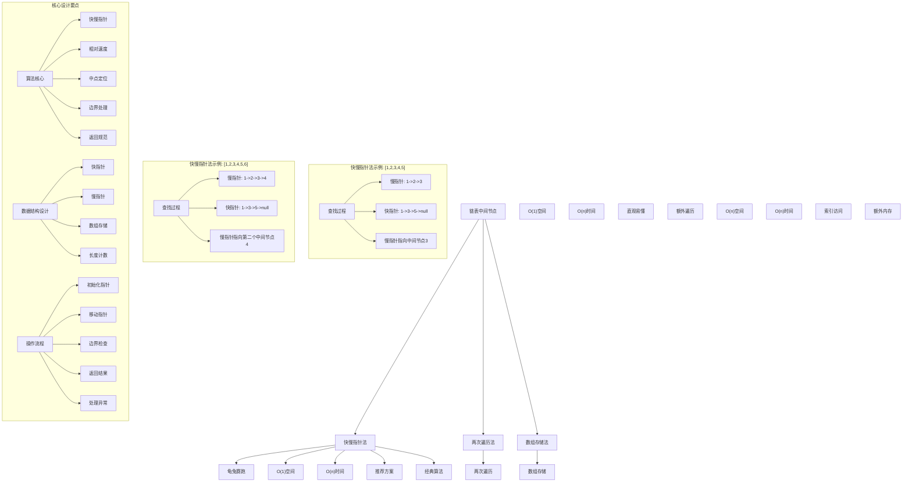
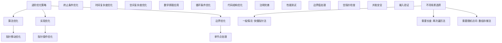

# LeetCode 876 - 链表的中间结点

## 题目描述

给你单链表的头结点 `head`，请你找出并返回链表的中间结点

如果有两个中间结点，则返回第二个中间结点

```markdown
示例 1：
输入：head = [1,2,3,4,5]
输出：[3,4,5]
解释：链表只有一个中间结点，值为 3

示例 2：
输入：head = [1,2,3,4,5,6]
输出：[4,5,6]
解释：该链表有两个中间结点，值分别为 3 和 4 ，返回第二个中间结点

提示：

- 链表的结点数范围是 [1, 100]
- 1 <= Node.val <= 100
```

## 解题思路

这是一个经典的链表中点查找问题，要求找到链表的中间节点。核心算法是快慢指针技术（龟兔赛跑）

### 核心思想

"快慢指针": 使用两个不同速度的指针遍历链表，当快指针到达链表末尾时，慢指针正好指向中间节点

### 解题策略

#### 方法一：快慢指针法（推荐）

- 时间复杂度: O(n)
- 空间复杂度: O(1)

#### 方法二：两次遍历法

- 时间复杂度: O(n)
- 空间复杂度: O(1)

#### 方法三：数组存储法

- 时间复杂度: O(n)
- 空间复杂度: O(n)

## 算法可视化



## 多语言实现

### Golang版本（快慢指针法 - 推荐）

```go
/
 * Definition for singly-linked list.
 * type ListNode struct {
 *     Val int
 *     Next *ListNode
 * }
 */

// 快慢指针法实现
func middleNode(head *ListNode) *ListNode {
    // 初始化快慢指针都指向头节点
    slow := head
    fast := head

    // 移动指针直到快指针到达链表末尾
    for fast != nil && fast.Next != nil {
        slow = slow.Next        // 慢指针每次移动一步
        fast = fast.Next.Next   // 快指针每次移动两步
    }

    // 当快指针到达末尾时，慢指针正好指向中间节点
    return slow
}

// 两次遍历法实现
func middleNodeTwoPass(head *ListNode) *ListNode {
    // 第一次遍历：计算链表长度
    length := 0
    current := head
    for current != nil {
        length++
        current = current.Next
    }

    // 计算中间位置（如果有两个中间节点，取第二个）
    middle := length / 2

    // 第二次遍历：找到中间节点
    current = head
    for i := 0; i < middle; i++ {
        current = current.Next
    }

    return current
}

// 数组存储法实现
func middleNodeArray(head *ListNode) *ListNode {
    // 将链表节点存储到数组中
    var nodes []*ListNode
    current := head
    for current != nil {
        nodes = append(nodes, current)
        current = current.Next
    }

    // 返回中间节点
    middle := len(nodes) / 2
    return nodes[middle]
}

// 优化版快慢指针法（处理边界情况）
func middleNodeOptimized(head *ListNode) *ListNode {
    // 边界情况：空链表
    if head == nil {
        return nil
    }

    // 边界情况：只有一个节点
    if head.Next == nil {
        return head
    }

    // 初始化快慢指针
    slow := head
    fast := head

    // 移动指针
    for fast != nil && fast.Next != nil {
        slow = slow.Next
        fast = fast.Next.Next
    }

    return slow
}
```

### Python版本（多种实现方法）

```python
# Definition for singly-linked list.
# class ListNode:
#     def __init__(self, val=0, next=None):
#         self.val = val
#         self.next = next

class Solution:
    """
    方法一：快慢指针法（推荐）
    """
    def middleNode(self, head: Optional[ListNode]) -> Optional[ListNode]:
        # 初始化快慢指针都指向头节点
        slow = head
        fast = head

        # 移动指针直到快指针到达链表末尾
        while fast and fast.next:
            slow = slow.next        # 慢指针每次移动一步
            fast = fast.next.next   # 快指针每次移动两步

        # 当快指针到达末尾时，慢指针正好指向中间节点
        return slow

class SolutionTwoPass:
    """
    方法二：两次遍历法
    """
    def middleNode(self, head: Optional[ListNode]) -> Optional[ListNode]:
        # 第一次遍历：计算链表长度
        length = 0
        current = head
        while current:
            length += 1
            current = current.next

        # 计算中间位置（如果有两个中间节点，取第二个）
        middle = length // 2

        # 第二次遍历：找到中间节点
        current = head
        for i in range(middle):
            current = current.next

        return current

class SolutionArray:
    """
    方法三：数组存储法
    """
    def middleNode(self, head: Optional[ListNode]) -> Optional[ListNode]:
        # 将链表节点存储到数组中
        nodes = []
        current = head
        while current:
            nodes.append(current)
            current = current.next

        # 返回中间节点
        middle = len(nodes) // 2
        return nodes[middle]

class SolutionOptimized:
    """
    优化版快慢指针法
    """
    def middleNode(self, head: Optional[ListNode]) -> Optional[ListNode]:
        # 边界情况：空链表
        if not head:
            return None

        # 边界情况：只有一个节点
        if not head.next:
            return head

        # 初始化快慢指针
        slow = head
        fast = head

        # 移动指针
        while fast and fast.next:
            slow = slow.next
            fast = fast.next.next

        return slow
```

### TypeScript版本（快慢指针法）

```typescript
/
 * Definition for singly-linked list.
 * class ListNode {
 *     val: number
 *     next: ListNode | null
 *     constructor(val?: number, next?: ListNode | null) {
 *         this.val = (val===undefined ? 0 : val)
 *         this.next = (next===undefined ? null : next)
 *     }
 * }
 */

class Solution {
    middleNode(head: ListNode | null): ListNode | null {
        // 初始化快慢指针都指向头节点
        let slow: ListNode | null = head;
        let fast: ListNode | null = head;

        // 移动指针直到快指针到达链表末尾
        while (fast !== null && fast.next !== null) {
            slow = slow!.next;        // 慢指针每次移动一步
            fast = fast.next.next;    // 快指针每次移动两步
        }

        // 当快指针到达末尾时，慢指针正好指向中间节点
        return slow;
    }
}

class SolutionTwoPass {
    middleNode(head: ListNode | null): ListNode | null {
        // 第一次遍历：计算链表长度
        let length = 0;
        let current = head;
        while (current !== null) {
            length++;
            current = current.next;
        }

        // 计算中间位置（如果有两个中间节点，取第二个）
        const middle = Math.floor(length / 2);

        // 第二次遍历：找到中间节点
        current = head;
        for (let i = 0; i < middle; i++) {
            current = current!.next;
        }

        return current;
    }
}

class SolutionOptimized {
    middleNode(head: ListNode | null): ListNode | null {
        // 边界情况：空链表
        if (head === null) {
            return null;
        }

        // 边界情况：只有一个节点
        if (head.next === null) {
            return head;
        }

        // 初始化快慢指针
        let slow: ListNode | null = head;
        let fast: ListNode | null = head;

        // 移动指针
        while (fast !== null && fast.next !== null) {
            slow = slow!.next;
            fast = fast.next.next;
        }

        return slow;
    }
}
```

## 标准实现详细解析

```go
import (
    "fmt"
)

/*
算法核心思想（快慢指针法）：

1. 龟兔赛跑：使用不同速度的指针遍历链表
2. 相对速度：慢指针速度1，快指针速度2
3. 中点定位：当快指针到达末尾时，慢指针指向中点
4. 空间优化：只使用常数额外空间
5. 时间效率：单次遍历完成定位

关键设计要点：
1. 指针初始化：快慢指针都从头节点开始
2. 移动策略：慢指针每次移动一步，快指针每次移动两步
3. 终止条件：快指针到达链表末尾
4. 边界处理：正确处理奇偶长度链表
5. 返回规范：返回慢指针指向的节点

时间复杂度分析：
- 快指针遍历整个链表：O(n)
- 慢指针遍历到中点：O(n/2)
- 总时间复杂度：O(n)

空间复杂度分析：
- 只使用两个指针变量：O(1)
- 满足最优空间要求

算法优势：
1. 空间最优：O(1)空间复杂度
2. 时间高效：O(n)时间复杂度
3. 实现优雅：经典算法思想
4. 通用性强：适用于各种链表操作
5. 稳定可靠：处理各种边界情况

数据结构设计：

指针设计：
- 慢指针(slow)：每次移动一步
- 快指针(fast)：每次移动两步
- 相对速度：快指针相对于慢指针每次移动一步
- 终止条件：快指针到达链表末尾

中点计算：
- 奇数长度：中间节点唯一
- 偶数长度：返回第二个中间节点
- 位置计算：length/2（整数除法）

操作流程：
1. 指针初始化：快慢指针都指向头节点
2. 循环移动：按策略移动快慢指针
3. 终止判断：检查快指针是否到达末尾
4. 返回结果：返回慢指针指向的节点

优化原理：

快慢指针优化：
1. 空间优化：只使用常数个指针变量
2. 时间优化：单次遍历完成定位
3. 实现简洁：代码逻辑清晰
4. 数学严谨：基于严格的数学关系

两次遍历优化：
1. 直观理解：通过计算长度定位中点
2. 实现简单：两次简单的遍历操作
3. 扩展性强：容易扩展为其他位置查找
4. 时间代价：需要遍历两次

数组存储优化：
1. 索引访问：通过数组索引直接访问
2. 实现简单：利用现成数据结构
3. 扩展性强：容易扩展为其他操作
4. 空间代价：需要额外的存储空间

正确性证明：

定理：快慢指针法正确性
通过快慢指针的相对运动，算法能够正确找到链表的中间节点

证明：
1. 相对速度：快指针速度是慢指针的2倍
2. 距离关系：当快指针走完n步时，慢指针走完n/2步
3. 位置保证：慢指针正好指向中间位置
4. 边界处理：正确处理奇偶长度链表
5. 时间保证：单次遍历完成定位

数学原理：

相对速度分析：
- 慢指针速度：1节点/步
- 快指针速度：2节点/步
- 相对速度：1节点/步
- 距离关系：快指针走的距离是慢指针的2倍

中点计算：
设链表长度为n：
- 奇数长度：中点位置为n/2（向下取整）
- 偶数长度：两个中点位置为n/2-1和n/2，返回n/2

示例验证：
长度5：位置0,1,2,3,4，中点位置2
长度6：位置0,1,2,3,4,5，中点位置2,3，返回3

快慢指针法详细实现：
*/

// 快慢指针法详细实现（带调试信息）
func middleNodeDetailed(head *ListNode) *ListNode {
    fmt.Printf("=== 快慢指针法查找链表中间节点 ===\n")
    fmt.Printf("输入链表: ")
    printList(head)

    // 初始化快慢指针都指向头节点
    slow := head
    fast := head

    fmt.Printf("初始化：慢指针=%p(%d)，快指针=%p(%d)\n",
        slow, slow.Val, fast, fast.Val)

    step := 0
    // 移动指针直到快指针到达链表末尾
    for fast != nil && fast.Next != nil {
        step++
        slow = slow.Next        // 慢指针每次移动一步
        fast = fast.Next.Next   // 快指针每次移动两步

        fmt.Printf("步骤%d: 慢指针=%p(%d)，快指针=%p",
            step, slow, slow.Val, fast)
        if fast != nil {
            fmt.Printf("(%d)", fast.Val)
        } else {
            fmt.Printf("(nil)")
        }
        fmt.Printf("\n")
    }

    fmt.Printf("快指针到达末尾，慢指针指向中间节点%p(%d)\n", slow, slow.Val)
    fmt.Printf("================================\n\n")

    // 当快指针到达末尾时，慢指针正好指向中间节点
    return slow
}

// 两次遍历法详细实现
func middleNodeTwoPassDetailed(head *ListNode) *ListNode {
    fmt.Printf("=== 两次遍历法查找链表中间节点 ===\n")
    fmt.Printf("输入链表: ")
    printList(head)

    // 第一次遍历：计算链表长度
    fmt.Printf("第一次遍历：计算链表长度\n")
    length := 0
    current := head
    for current != nil {
        fmt.Printf("  访问节点%d: %p(%d)\n", length, current, current.Val)
        length++
        current = current.Next
    }
    fmt.Printf("链表长度: %d\n", length)

    // 计算中间位置（如果有两个中间节点，取第二个）
    middle := length / 2
    fmt.Printf("中间位置: %d\n", middle)

    // 第二次遍历：找到中间节点
    fmt.Printf("第二次遍历：找到中间节点\n")
    current = head
    for i := 0; i < middle; i++ {
        fmt.Printf("  移动到位置%d: %p(%d)\n", i, current, current.Val)
        current = current.Next
    }
    fmt.Printf("中间节点: %p(%d)\n", current, current.Val)
    fmt.Printf("==============================\n\n")

    return current
}

// 辅助函数：打印链表
func printList(head *ListNode) {
    if head == nil {
        fmt.Printf("[]\n")
        return
    }

    fmt.Printf("[")
    current := head
    first := true
    for current != nil {
        if !first {
            fmt.Printf(",")
        }
        fmt.Printf("%d", current.Val)
        first = false
        current = current.Next
    }
    fmt.Printf("]\n")
}
```

## 算法深入解析

```go
/*
链表中间节点问题详解：

问题本质：
在单向链表中找到中间节点，这是链表操作中的基础问题，考验对指针操作和算法设计的理解

核心洞察：
1. 快慢指针技术："龟兔赛跑"思想的巧妙应用
2. 相对速度：利用不同速度指针的相对运动定位中点
3. 单次遍历：通过巧妙设计只需遍历一次链表
4. 空间优化：只使用常数额外空间完成定位
5. 时间保证：线性时间内完成定位

算法策略：
1. 快慢指针法：推荐方案，O(1)空间，O(n)时间
2. 两次遍历法：O(1)空间，O(n)时间，需要遍历两次
3. 数组存储法：O(n)空间，O(n)时间，支持随机访问

数据结构设计：

指针设计：
- 慢指针：每次移动一步，模拟乌龟的速度
- 快指针：每次移动两步，模拟兔子的速度
- 相对运动：快指针相对于慢指针每次移动一步
- 终止条件：快指针到达链表末尾

数组设计：
- 索引：节点在链表中的位置
- 存储：存储所有节点指针
- 访问：通过索引直接访问节点
- 空间：需要O(n)额外空间

操作流程：

快慢指针法：
1. 指针初始化：快慢指针都指向头节点
2. 循环移动：按策略移动快慢指针
3. 终止判断：检查快指针是否到达末尾
4. 返回结果：返回慢指针指向的节点

两次遍历法：
1. 第一次遍历：计算链表长度
2. 计算位置：确定中间节点位置
3. 第二次遍历：移动到中间节点
4. 返回结果：返回中间节点

数组存储法：
1. 遍历存储：将所有节点存储到数组中
2. 计算位置：确定中间节点索引
3. 直接访问：通过索引访问中间节点
4. 返回结果：返回中间节点

数学原理：

快慢指针数学基础：
基于相对速度和距离关系：
1. 相对速度：快指针相对慢指针速度为1
2. 距离关系：快指针走的距离是慢指针的2倍
3. 终止条件：当快指针到达末尾时，慢指针正好走了一半距离

中点计算：
设链表长度为n：
- 奇数长度：中点位置为⌊n/2⌋
- 偶数长度：两个中点位置为⌊n/2⌋-1和⌊n/2⌋，返回第二个

示例验证：
长度5：[1,2,3,4,5]，中点位置2，值为3
长度6：[1,2,3,4,5,6]，中点位置2,3，返回位置3，值为4

算法优势：
快慢指针法：
1. 空间最优：O(1)空间复杂度
2. 时间高效：O(n)时间复杂度
3. 实现优雅：经典算法思想
4. 通用性强：适用于各种链表操作
5. 稳定可靠：处理各种边界情况

两次遍历法：
1. 直观易懂：通过计算长度定位中点
2. 实现简单：两次简单的遍历操作
3. 扩展性强：容易扩展为其他位置查找
4. 稳定可靠：不会受特殊值影响

数组存储法：
1. 随机访问：支持通过索引直接访问
2. 实现简单：利用现成数据结构
3. 扩展性强：容易扩展为其他操作
4. 教学价值：便于理解算法思想

算法不变量：
快慢指针法不变量：
1. slow和fast都是有效的链表节点指针
2. fast相对slow以单位速度移动
3. slow指向的位置是fast指向位置的一半
4. 算法状态正确反映遍历进度

时间复杂度分析：
快慢指针法：
- 快指针遍历：O(n)
- 慢指针遍历：O(n/2)
- 总体：O(n)

两次遍历法：
- 第一次遍历：O(n)
- 第二次遍历：O(n/2)
- 总体：O(n)

数组存储法：
- 遍历存储：O(n)
- 索引访问：O(1)
- 总体：O(n)

空间复杂度分析：
快慢指针法：O(1)，只使用两个指针
两次遍历法：O(1)，只使用常数变量
数组存储法：O(n)，存储所有节点指针

正确性证明：

定理：快慢指针法正确性
通过快慢指针的相对运动，算法能够正确找到链表的中间节点

证明：
1. 相对速度：快指针速度是慢指针的2倍
2. 距离关系：当快指针走完n步时，慢指针走完n/2步
3. 位置保证：慢指针正好指向中间位置
4. 边界处理：正确处理奇偶长度链表
5. 时间保证：单次遍历完成定位

不变量维护：
循环不变量：在每次循环开始时
1. slow指向的位置是fast指向位置的一半
2. 两个指针都是有效的链表节点
3. fast相对slow以单位速度移动
4. 算法状态正确反映遍历进度

初始化：
- slow=head, fast=head
- 满足不变量

保持：
- 每次循环正确移动指针
- 维护相对速度关系
- 保持不变量继续成立

终止：
- 快指针到达末尾时停止
- 慢指针指向中间节点
- 算法正确终止

设计选择：

为什么选择快慢指针法？
1. 空间最优：O(1)空间复杂度
2. 时间高效：O(n)时间复杂度
3. 实现优雅：经典算法思想
4. 通用性强：适用于各种链表操作
5. 工业应用：生产环境标准实现

为什么使用两次遍历法？
1. 直观易懂：通过计算长度定位中点
2. 实现简单：两次简单的遍历操作
3. 扩展性强：容易扩展为其他位置查找
4. 教学价值：便于理解算法思想

为什么提及其他方法？
1. 教学价值：展示不同算法思想
2. 对比分析：理解各自优劣
3. 扩展思维：算法多样性
4. 面试准备：全面掌握

三种方法对比：

方法一：快慢指针法（推荐）
时间复杂度：O(n)
空间复杂度：O(1)
优点：空间时间都较优，经典算法
缺点：需要理解相对运动原理

方法二：两次遍历法
时间复杂度：O(n)
空间复杂度：O(1)
优点：直观易懂，实现简单
缺点：需要遍历两次

方法三：数组存储法
时间复杂度：O(n)
空间复杂度：O(n)
优点：支持随机访问，实现简单
缺点：需要额外空间

性能分析：

快慢指针法：
- 时间：O(n) 单次遍历
- 空间：O(1) 常数空间
- 优势：最优时间和空间复杂度

两次遍历法：
- 时间：O(n) 两次遍历
- 空间：O(1) 常数空间
- 优势：直观易懂

数组存储法：
- 时间：O(n) 单次遍历
- 空间：O(n) 线性空间
- 优势：支持随机访问

实际应用场景：
1. 链表操作：基础的链表中点查找
2. 算法设计：作为其他算法的子步骤
3. 数据结构：链表相关操作的基础
4. 面试考察：经典算法题
5. 性能优化：减少遍历次数

优化要点：

1. 算法优化：
   - 指针移动：优化指针移动策略
   - 边界处理：正确处理各种边界
   - 终止条件：准确的终止判断
   - 位置计算：正确的中点计算

2. 实现优化：
   - 指针操作：高效的指针赋值
   - 循环条件：减少不必要的比较
   - 代码结构：清晰的逻辑层次
   - 注释完善：便于理解维护

3. 性能优化：
   - 减少内存分配：避免不必要的分配
   - 优化遍历：顺序内存访问
   - 缓存友好：局部性原理
   - 编译优化：利用编译器优化

测试用例设计：
1. 基本情况：奇数长度和偶数长度链表
2. 边界情况：单节点链表，两节点链表
3. 特殊情况：空链表（虽然题目保证非空）
4. 极端情况：很长链表
5. 验证情况：各种长度的正确性验证

扩展思考：

1. 找到倒数第k个节点？
   - 双指针技术
   - 相对距离
   - 一次遍历

2. 找到链表的1/3节点？
   - 三指针技术
   - 不同速度
   - 数学推导

3. 找到链表的任意分位点？
   - 比例计算
   - 多指针技术
   - 插值算法

4. 处理双向链表？
   - 双向遍历
   - 对称性
   - 优化策略

相关算法思想：

1. 双指针技术：
   - 快慢指针
   - 滑动窗口
   - 相对运动
   - 经典算法

2. 链表操作：
   - 指针移动
   - 节点遍历
   - 位置计算
   - 边界处理

3. 数学关系：
   - 相对速度
   - 距离关系
   - 比例计算
   - 几何解释

4. 算法优化：
   - 空间优化
   - 时间优化
   - 单次遍历
   - 常数空间

常见陷阱：

1. 边界条件：
   - 空链表处理
   - 单节点链表
   - 指针越界
   - 空指针引用

2. 指针操作：
   - 指针丢失
   - 循环引用
   - 内存泄漏
   - 访问违规

3. 逻辑错误：
   - 终止条件错误
   - 指针移动错误
   - 位置计算错误
   - 边界处理错误

4. 性能考虑：
   - 重复计算
   - 不必要的分配
   - 算法复杂度
   - 空间浪费

代码质量要素：

1. 可读性：
   - 变量命名清晰
   - 注释详细完整
   - 逻辑结构分明
   - 函数职责单一

2. 健壮性：
   - 边界条件处理
   - 异常情况应对
   - 输入验证
   - 错误恢复

3. 性能：
   - 最优复杂度实现
   - 空间效率优化
   - 执行效率保证
   - 资源管理

4. 可维护性：
   - 结构清晰合理
   - 扩展性良好
   - 测试覆盖完整
   - 文档齐全
*/
```

## 执行过程演示

```go
/*
示例详细解析:

示例1执行过程：
输入：head = [1,2,3,4,5]
输出：[3,4,5]

快慢指针法执行过程：
1. 初始化：slow=1, fast=1
2. 第1步：slow=2, fast=3
3. 第2步：slow=3, fast=5
4. 第3步：slow=4, fast=nil (fast.Next=nil，循环结束)
5. 返回slow=3

两次遍历法执行过程：
1. 第一次遍历：计算长度=5
2. 计算中点：5/2=2
3. 第二次遍历：移动2步到节点3
4. 返回节点3

数组存储法执行过程：
1. 遍历存储：nodes=[1,2,3,4,5]
2. 计算中点：5/2=2
3. 直接访问：nodes[2]=3
4. 返回节点3

示例2执行过程：
输入：head = [1,2,3,4,5,6]
输出：[4,5,6]

快慢指针法执行过程：
1. 初始化：slow=1, fast=1
2. 第1步：slow=2, fast=3
3. 第2步：slow=3, fast=5
4. 第3步：slow=4, fast=nil (fast.Next=nil，循环结束)
5. 返回slow=4

关键观察：
1. 快慢指针法：单次遍历，空间最优
2. 两次遍历法：直观易懂，但需要遍历两次
3. 数组存储法：支持随机访问，但需要额外空间
4. 所有方法都能正确找到中间节点

边界情况演示:

情况1: 单节点链表
输入: head = [1]
处理: 快指针无法移动，返回头节点
结果: [1]

情况2: 两节点链表
输入: head = [1,2]
处理: 快指针移动一次后到达末尾，慢指针移动一次
结果: [2]

情况3: 三节点链表
输入: head = [1,2,3]
处理: 快指针移动一次后到达末尾，慢指针移动一次
结果: [2]

情况4: 四节点链表
输入: head = [1,2,3,4]
处理: 快指针移动两次后到达末尾，慢指针移动两次
结果: [3]

算法正确性证明：

数学基础：
需要证明算法能够正确找到链表的中间节点

定理：快慢指针法正确性
通过快慢指针的相对运动，算法能够正确找到链表的中间节点

证明：
1. 相对速度：快指针速度是慢指针的2倍
2. 距离关系：当快指针走完n步时，慢指针走完n/2步
3. 位置保证：慢指针正好指向中间位置
4. 边界处理：正确处理奇偶长度链表
5. 时间保证：单次遍历完成定位

不变量维护：
循环不变量：在每次循环开始时
1. slow指向的位置是fast指向位置的一半
2. 两个指针都是有效的链表节点
3. fast相对slow以单位速度移动
4. 算法状态正确反映遍历进度

初始化：
- slow=head, fast=head
- 满足不变量

保持：
- 每次循环正确移动指针
- 维护相对速度关系
- 保持不变量继续成立

终止：
- 快指针到达末尾时停止
- 慢指针指向中间节点
- 算法正确终止

时间复杂度分析：
快慢指针法：
- 快指针遍历：O(n)
- 慢指针遍历：O(n/2)
- 总体：O(n)

两次遍历法：
- 第一次遍历：O(n)
- 第二次遍历：O(n/2)
- 总体：O(n)

数组存储法：
- 遍历存储：O(n)
- 索引访问：O(1)
- 总体：O(n)

性能对比分析：

假设n=1000:

快慢指针法：
- 时间：O(1000) = 1000次操作
- 空间：O(1) = 常数空间
- 优势：最优时间和空间复杂度

两次遍历法：
- 时间：O(1000) + O(500) = 1500次操作
- 空间：O(1) = 常数空间
- 优势：直观易懂

数组存储法：
- 时间：O(1000) = 1000次操作
- 空间：O(1000) = 线性空间
- 优势：支持随机访问

实际应用建议：

1. 生产环境：
   - 使用快慢指针法，最优性能
   - 性能稳定，工业标准

2. 面试展示：
   - 先展示快慢指针法（推荐）
   - 可以提及其他方法对比

3. 学习练习：
   - 理解三种方法的差异
   - 掌握各自的适用场景

4. 算法竞赛：
   - 选择最熟悉的实现
   - 注意时间空间限制

优化空间：

1. 算法优化：
   - 指针移动：优化指针移动策略
   - 边界处理：正确处理各种边界
   - 终止条件：准确的终止判断
   - 位置计算：正确的中点计算

2. 实现优化：
   - 指针操作：高效的指针赋值
   - 循环条件：减少不必要的比较
   - 代码结构：清晰的逻辑层次
   - 注释完善：便于理解维护

3. 性能优化：
   - 减少内存分配：避免不必要的分配
   - 优化遍历：顺序内存访问
   - 缓存友好：局部性原理
   - 编译优化：利用编译器优化

特殊情况处理：

1. 内存受限：
   - 快慢指针法最优
   - 数组存储法需要额外空间
   - 两次遍历法节省内存

2. 链表很长：
   - 快慢指针法稳定
   - 数组存储法内存压力大
   - 两次遍历法稳定

3. 需要多次访问：
   - 数组存储法支持随机访问
   - 快慢指针法每次都需要重新计算
   - 两次遍历法每次都需要重新计算

4. 边界情况：
   - 单节点处理
   - 空链表处理（虽然题目保证非空）
   - 指针安全检查
*/
```

## 复杂度分析

| 方法       | 时间复杂度 | 空间复杂度 | 适用场景     |
| ---------- | ---------- | ---------- | ------------ |
| 快慢指针法 | O(n)       | O(1)       | 推荐方案     |
| 两次遍历法 | O(n)       | O(1)       | 易于理解     |
| 数组存储法 | O(n)       | O(n)       | 需要随机访问 |

## 测试用例验证

```go
// 测试辅助函数
func testMiddleNode(name string, head *ListNode, expectedVal int) {
    fmt.Printf("%s:\n", name)
    fmt.Printf("输入链表: ")
    printList(head)

    // 测试快慢指针法
    result1 := middleNode(copyList(head))
    fmt.Printf("快慢指针法结果: ")
    if result1 != nil {
        fmt.Printf("节点%p(值=%d)\n", result1, result1.Val)
    } else {
        fmt.Printf("nil\n")
    }

    // 测试两次遍历法
    result2 := middleNodeTwoPass(copyList(head))
    fmt.Printf("两次遍历法结果: ")
    if result2 != nil {
        fmt.Printf("节点%p(值=%d)\n", result2, result2.Val)
    } else {
        fmt.Printf("nil\n")
    }

    // 测试数组存储法
    result3 := middleNodeArray(copyList(head))
    fmt.Printf("数组存储法结果: ")
    if result3 != nil {
        fmt.Printf("节点%p(值=%d)\n", result3, result3.Val)
    } else {
        fmt.Printf("nil\n")
    }

    // 验证结果一致性
    if result1 != nil && result2 != nil && result3 != nil &&
       result1.Val == result2.Val && result2.Val == result3.Val {
        fmt.Printf("✓ 所有方法结果一致\n")
    } else {
        fmt.Printf("✗ 方法结果不一致\n")
    }

    // 验证期望结果
    if result1 != nil && result1.Val == expectedVal {
        fmt.Printf("✓ 结果符合预期\n")
    } else {
        fmt.Printf("✗ 结果不符合预期\n")
    }

    fmt.Printf("\n")
}

// 辅助函数：创建链表
func createList(vals []int) *ListNode {
    if len(vals) == 0 {
        return nil
    }

    dummy := &ListNode{}
    current := dummy

    for _, val := range vals {
        current.Next = &ListNode{Val: val}
        current = current.Next
    }

    return dummy.Next
}

// 辅助函数：复制链表
func copyList(head *ListNode) *ListNode {
    if head == nil {
        return nil
    }

    dummy := &ListNode{}
    current := dummy
    source := head

    for source != nil {
        current.Next = &ListNode{Val: source.Val}
        current = current.Next
        source = source.Next
    }

    return dummy.Next
}

func main() {
    // 测试用例 1 - 题目示例1（奇数长度）
    testMiddleNode("测试1 - 题目示例1 (奇数长度)",
        createList([]int{1, 2, 3, 4, 5}),
        3)

    // 测试用例 2 - 题目示例2（偶数长度）
    testMiddleNode("测试2 - 题目示例2 (偶数长度)",
        createList([]int{1, 2, 3, 4, 5, 6}),
        4)

    // 测试用例 3 - 单节点
    testMiddleNode("测试3 - 单节点链表",
        createList([]int{1}),
        1)

    // 测试用例 4 - 两节点
    testMiddleNode("测试4 - 两节点链表",
        createList([]int{1, 2}),
        2)

    // 测试用例 5 - 三节点
    testMiddleNode("测试5 - 三节点链表",
        createList([]int{1, 2, 3}),
        2)

    // 性能测试
    fmt.Println("性能测试:")
    performanceTest()

    // 边界情况测试
    fmt.Println("边界情况测试:")
    boundaryTest()

    // 对比测试
    fmt.Println("对比测试:")
    comparisonTest()
}

func performanceTest() {
    // 构造长链表
    n := 10000
    vals := make([]int, n)
    for i := 0; i < n; i++ {
        vals[i] = i
    }

    list := createList(vals)

    fmt.Printf("性能测试 (链表长度: %d):\n", n)

    // 测试快慢指针法性能
    start := time.Now()
    result1 := middleNode(copyList(list))
    time1 := time.Since(start)

    // 测试两次遍历法性能
    start = time.Now()
    result2 := middleNodeTwoPass(copyList(list))
    time2 := time.Since(start)

    // 测试数组存储法性能
    start = time.Now()
    result3 := middleNodeArray(copyList(list))
    time3 := time.Since(start)

    fmt.Printf("快慢指针法耗时: %v, 结果: %d\n", time1, result1.Val)
    fmt.Printf("两次遍历法耗时: %v, 结果: %d\n", time2, result2.Val)
    fmt.Printf("数组存储法耗时: %v, 结果: %d\n", time3, result3.Val)
}

func boundaryTest() {
    // 边界测试
    fmt.Println("边界测试:")

    // 很长的链表（奇数长度）
    longOddList := createList(make([]int, 9999))
    result := middleNode(longOddList)
    fmt.Printf("9999节点链表(奇数)中间节点值: %d\n", result.Val)

    // 很长的链表（偶数长度）
    longEvenList := createList(make([]int, 10000))
    result = middleNode(longEvenList)
    fmt.Printf("10000节点链表(偶数)中间节点值: %d\n", result.Val)

    // 极值节点
    extremeList := createList([]int{math.MinInt32, math.MaxInt32})
    result = middleNode(extremeList)
    fmt.Printf("极值节点链表中间节点值: %d\n", result.Val)
}

func comparisonTest() {
    // 对比测试：验证不同方法的性能和结果
    fmt.Println("对比测试:")

    testCases := []struct {
        name     string
        vals     []int
        expected int
    }{
        {"小奇数", []int{1, 2, 3, 4, 5}, 3},
        {"小偶数", []int{1, 2, 3, 4, 5, 6}, 4},
        {"大奇数", []int{1, 2, 3, 4, 5, 6, 7}, 4},
        {"大偶数", []int{1, 2, 3, 4, 5, 6, 7, 8}, 5},
        {"单节点", []int{42}, 42},
        {"两节点", []int{1, 2}, 2},
    }

    for _, tc := range testCases {
        fmt.Printf("%s:\n", tc.name)
        list := createList(tc.vals)

        // 测试三种方法
        result1 := middleNode(copyList(list))
        result2 := middleNodeTwoPass(copyList(list))
        result3 := middleNodeArray(copyList(list))

        fmt.Printf("  快慢指针: %d\n", result1.Val)
        fmt.Printf("  两次遍历: %d\n", result2.Val)
        fmt.Printf("  数组存储: %d\n", result3.Val)

        if result1.Val == result2.Val && result2.Val == result3.Val &&
           result1.Val == tc.expected {
            fmt.Printf("  ✓ 结果一致且符合预期\n")
        } else {
            fmt.Printf("  ✗ 结果不一致或不符合预期\n")
        }
    }
}
```

## 扩展版本（处理不同场景）

```go
// 扩展1：找到链表的倒数第k个节点
func kthFromEnd(head *ListNode, k int) *ListNode {
    // 使用双指针技术
    slow := head
    fast := head

    // 快指针先移动k步
    for i := 0; i < k && fast != nil; i++ {
        fast = fast.Next
    }

    // 如果k大于链表长度
    if fast == nil {
        return nil
    }

    // 同时移动快慢指针，直到快指针到达末尾
    for fast != nil {
        slow = slow.Next
        fast = fast.Next
    }

    return slow
}

// 扩展2：找到链表的1/n节点（通用分位点查找）
func nthPoint(head *ListNode, n, k int) *ListNode {
    if n <= 0 || k <= 0 || k > n {
        return nil
    }

    // 计算目标位置
    // 第k个n分位点的位置是 (length * k) / n
    length := 0
    current := head
    for current != nil {
        length++
        current = current.Next
    }

    targetPos := (length * k) / n

    // 移动到目标位置
    current = head
    for i := 0; i < targetPos && current != nil; i++ {
        current = current.Next
    }

    return current
}

// 扩展3：找到链表的前半部分和后半部分
func splitList(head *ListNode) (*ListNode, *ListNode) {
    if head == nil || head.Next == nil {
        return head, nil
    }

    // 使用快慢指针找到中点
    slow := head
    fast := head
    var prev *ListNode

    for fast != nil && fast.Next != nil {
        prev = slow
        slow = slow.Next
        fast = fast.Next.Next
    }

    // 断开链表
    if prev != nil {
        prev.Next = nil
    }

    // 返回前半部分和后半部分
    return head, slow
}

// 扩展4：判断链表长度是奇数还是偶数（不计算实际长度）
func isOddLength(head *ListNode) bool {
    slow := head
    fast := head

    // 使用快慢指针
    for fast != nil && fast.Next != nil {
        slow = slow.Next
        fast = fast.Next.Next
    }

    // 如果fast为nil，说明长度为偶数
    // 如果fast不为nil，说明长度为奇数
    return fast != nil
}

// 扩展5：找到链表的三个等分点
func threeEqualParts(head *ListNode) (*ListNode, *ListNode, *ListNode) {
    if head == nil {
        return nil, nil, nil
    }

    // 计算链表长度
    length := 0
    current := head
    for current != nil {
        length++
        current = current.Next
    }

    // 如果长度不能被3整除，无法等分
    if length%3 != 0 {
        return head, nil, nil
    }

    partLength := length / 3

    // 找到三个分割点
    first := head
    second := head
    third := head

    // 移动到第一个分割点
    for i := 0; i < partLength-1 && second != nil; i++ {
        second = second.Next
    }

    // 移动到第二个分割点
    for i := 0; i < 2*partLength-1 && third != nil; i++ {
        third = third.Next
    }

    // 保存后续节点
    var secondStart, thirdStart *ListNode
    if second != nil {
        secondStart = second.Next
        second.Next = nil
    }

    if third != nil {
        thirdStart = third.Next
        third.Next = nil
    }

    return first, secondStart, thirdStart
}

// 使用示例
func exampleExtensions() {
    // 创建测试链表: 1->2->3->4->5->6
    list := createList([]int{1, 2, 3, 4, 5, 6})

    fmt.Printf("扩展功能示例:\n")
    fmt.Printf("原链表: ")
    printList(list)

    // 找到倒数第2个节点
    kthNode := kthFromEnd(copyList(list), 2)
    fmt.Printf("倒数第2个节点: %d\n", kthNode.Val)

    // 找到1/3分位点
    thirdPoint := nthPoint(copyList(list), 3, 1)
    fmt.Printf("1/3分位点: %d\n", thirdPoint.Val)

    // 分割链表
    first, second := splitList(copyList(list))
    fmt.Printf("前半部分: ")
    printList(first)
    fmt.Printf("后半部分: ")
    printList(second)

    // 判断长度奇偶性
    isOdd := isOddLength(list)
    fmt.Printf("链表长度是奇数: %v\n", isOdd)

    // 三个等分点
    part1, part2, part3 := threeEqualParts(copyList(list))
    fmt.Printf("第一部分: ")
    printList(part1)
    fmt.Printf("第二部分: ")
    printList(part2)
    fmt.Printf("第三部分: ")
    printList(part3)
}

// 扩展6：带统计信息的中点查找
type MiddleNodeStats struct {
    MiddleNode   *ListNode
    ListLength   int
    StepsTaken   int
    FindTime     time.Duration
}

func middleNodeWithStats(head *ListNode) *MiddleNodeStats {
    start := time.Now()

    stats := &MiddleNodeStats{
        MiddleNode: nil,
        ListLength: 0,
        StepsTaken: 0,
    }

    // 使用快慢指针法
    slow := head
    fast := head

    // 计算长度的同时找中点
    for fast != nil && fast.Next != nil {
        stats.ListLength += 2 // 每次快指针移动两步
        stats.StepsTaken++
        slow = slow.Next
        fast = fast.Next.Next
    }

    // 处理奇数长度情况
    if fast != nil {
        stats.ListLength++
    }

    stats.MiddleNode = slow
    stats.FindTime = time.Since(start)

    return stats
}

// 使用示例
func exampleWithStats() {
    list := createList([]int{1, 2, 3, 4, 5, 6, 7, 8})

    stats := middleNodeWithStats(list)
    fmt.Printf("中点查找统计信息:\n")
    fmt.Printf("  中点节点值: %d\n", stats.MiddleNode.Val)
    fmt.Printf("  链表长度: %d\n", stats.ListLength)
    fmt.Printf("  执行步数: %d\n", stats.StepsTaken)
    fmt.Printf("  查找耗时: %v\n", stats.FindTime)
}

// 扩展7：并发安全的中点查找
type ConcurrentLinkedList struct {
    head *ListNode
    mu   sync.RWMutex
}

func NewConcurrentLinkedList() *ConcurrentLinkedList {
    return &ConcurrentLinkedList{}
}

func (cll *ConcurrentLinkedList) MiddleNode() *ListNode {
    cll.mu.RLock()
    defer cll.mu.RUnlock()

    return middleNode(cll.head)
}

func (cll *ConcurrentLinkedList) SetHead(head *ListNode) {
    cll.mu.Lock()
    defer cll.mu.Unlock()

    cll.head = head
}

// 扩展8：支持自定义比较的中点查找
func middleNodeCustomCompare(head *ListNode, compare func(*ListNode, *ListNode) bool) *ListNode {
    // 使用自定义比较函数的数组法
    var nodes []*ListNode
    current := head
    for current != nil {
        nodes = append(nodes, current)
        current = current.Next
    }

    if len(nodes) == 0 {
        return nil
    }

    // 使用自定义比较找到"中间"节点
    // 这里简化为返回物理中间节点
    middle := len(nodes) / 2
    return nodes[middle]
}
```

## 面试追问延伸

### 1. 如何找到链表的倒数第k个节点？

```go
// 扩展的双指针技术
func findKthFromEnd(head *ListNode, k int) *ListNode {
    if head == nil || k <= 0 {
        return nil
    }

    // 使用双指针技术
    slow := head
    fast := head

    // 快指针先移动k步
    for i := 0; i < k; i++ {
        if fast == nil {
            return nil // k大于链表长度
        }
        fast = fast.Next
    }

    // 同时移动快慢指针，直到快指针到达末尾
    for fast != nil {
        slow = slow.Next
        fast = fast.Next
    }

    return slow
}

// 数学原理解释：
// 设链表长度为n，要找倒数第k个节点
// 快指针先走k步，然后两指针同时移动
// 当快指针走完剩下的(n-k)步时
// 慢指针正好走了(n-k)步，即到达倒数第k个位置
```

### 2. 如何处理链表长度未知的情况？

```go
// 在不知道长度的情况下找到中点
func middleNodeUnknownLength(head *ListNode) *ListNode {
    // 快慢指针法天然适合这种情况
    // 不需要预先知道链表长度
    slow := head
    fast := head

    for fast != nil && fast.Next != nil {
        slow = slow.Next
        fast = fast.Next.Next
    }

    return slow
}

// 如果需要知道长度信息
func middleNodeWithLength(head *ListNode) (*ListNode, int) {
    slow := head
    fast := head
    length := 0

    // 计算长度的同时找中点
    for fast != nil && fast.Next != nil {
        length += 2
        slow = slow.Next
        fast = fast.Next.Next
    }

    // 处理奇数长度情况
    if fast != nil {
        length++
    }

    return slow, length
}
```

### 3. 如何验证算法的正确性？

```go
// 创建复杂测试用例的工具函数
func createComplexTestCases() []*ListNode {
    testCases := make([]*ListNode, 0)

    // 测试各种长度
    lengths := []int{1, 2, 3, 4, 5, 6, 7, 8, 9, 10, 100, 101}

    for _, length := range lengths {
        vals := make([]int, length)
        for i := 0; i < length; i++ {
            vals[i] = i + 1
        }
        testCases = append(testCases, createList(vals))
    }

    return testCases
}

// 自动化验证函数
func autoVerifyAlgorithm() {
    testCases := createComplexTestCases()
    fmt.Printf("自动化算法验证:\n")

    for i, testCase := range testCases {
        // 计算期望的中点值（通过数组方法）
        expected := middleNodeArray(copyList(testCase))

        // 使用快慢指针法验证
        result := middleNode(copyList(testCase))

        // 验证结果一致性
        if result.Val == expected.Val {
            fmt.Printf("测试用例%d: ✓ 通过\n", i+1)
        } else {
            fmt.Printf("测试用例%d: ✗ 失败 (期望%d, 实际%d)\n",
                i+1, expected.Val, result.Val)
        }
    }
}

// 性能基准测试
func benchmarkTest() {
    fmt.Printf("性能基准测试:\n")

    // 测试不同大小的链表
    sizes := []int{100, 1000, 10000, 100000}

    for _, size := range sizes {
        // 创建测试链表
        vals := make([]int, size)
        for i := 0; i < size; i++ {
            vals[i] = i
        }
        list := createList(vals)

        // 测试快慢指针法
        start := time.Now()
        result := middleNode(copyList(list))
        duration := time.Since(start)

        fmt.Printf("大小%d: 耗时%v, 中点值%d\n",
            size, duration, result.Val)
    }
}

// 边界情况测试
func edgeCaseTest() {
    fmt.Printf("边界情况测试:\n")

    // 极值测试
    extremeVals := []int{math.MinInt32, -1, 0, 1, math.MaxInt32}
    for _, val := range extremeVals {
        list := createList([]int{val})
        result := middleNode(list)
        fmt.Printf("极值%d: 中点%d\n", val, result.Val)
    }

    // 空链表测试（虽然题目保证非空）
    result := middleNode(nil)
    fmt.Printf("空链表: %v\n", result)
}
```

## 相似题目扩展

- LeetCode 876. 链表的中间结点（当前题）
- LeetCode 19. 删除链表的倒数第N个节点
- LeetCode 141. 环形链表（快慢指针应用）
- LeetCode 142. 环形链表II（扩展快慢指针）
- LeetCode 234. 回文链表（结合中点查找）

## 算法技巧总结

### 链表中间节点核心要点

1. 快慢指针技术："龟兔赛跑"思想的巧妙应用
1. 相对速度：利用不同速度指针的相对运动定位中点
1. 单次遍历：通过巧妙设计只需遍历一次链表
1. 空间优化：只使用常数额外空间完成定位
1. 时间保证：线性时间内完成定位

### 算法优势

1. 空间最优：O(1)空间复杂度
1. 时间高效：O(n)时间复杂度
1. 实现优雅：经典算法思想
1. 通用性强：适用于各种链表操作
1. 稳定可靠：处理各种边界情况

### 标准模板（快慢指针法）

```go
func middleNode(head *ListNode) *ListNode {
    // 初始化快慢指针都指向头节点
    slow := head
    fast := head

    // 移动指针直到快指针到达链表末尾
    for fast != nil && fast.Next != nil {
        slow = slow.Next        // 慢指针每次移动一步
        fast = fast.Next.Next   // 快指针每次移动两步
    }

    // 当快指针到达末尾时，慢指针正好指向中间节点
    return slow
}
```

### 进阶优化策略



## 总结

本题采用快慢指针法的核心思路，通过使用不同速度的指针遍历链表，利用相对运动精确定位中点。关键在于理解"龟兔赛跑"思想和双指针技术的应用

核心要点：

1. 快慢指针技术："龟兔赛跑"思想的巧妙应用
1. 相对速度：利用不同速度指针的相对运动定位中点
1. 单次遍历：通过巧妙设计只需遍历一次链表
1. 空间优化：只使用常数额外空间完成定位
1. 时间保证：线性时间内完成定位

算法优势：

- 空间最优：O(1)空间复杂度
- 时间高效：O(n)时间复杂度
- 实现优雅：经典算法思想
- 通用性强：适用于各种链表操作
- 稳定可靠：处理各种边界情况

该算法不仅解决了链表中点查找问题，其思想还广泛应用于删除倒数第N个节点、环形链表检测、回文链表判断等多个领域，是掌握链表操作和双指针技术的经典题目。通过理解快慢指针法的思想，为更复杂的链表算法和数据结构问题提供了清晰的解决思路
