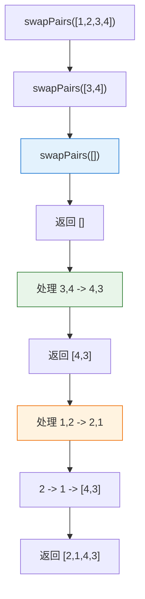

# LeetCode 24 - 两两交换链表中的节点（递归解法）

## Step 1: 题目描述

给你一个链表，两两交换其中相邻的节点，并返回交换后链表的头节点。

你必须在**不修改节点内部的值**的情况下完成本题（即，只能进行节点交换）。

**示例 1**：
输入：`head = [1,2,3,4]`
输出：`[2,1,4,3]`

**示例 2**：
输入：`head = []`
输出：`[]`

**示例 3**：
输入：`head = [1]`
输出：`[1]`

**约束条件**：

- 链表中节点的数目在范围 `[0, 100]` 内
- `0 <= Node.val <= 100`

## Step 2: 核心结论（金字塔结构）

### 核心结论

本题的递归解法是**分治思想的典型应用**，其核心优势在于：**代码简洁优雅、逻辑清晰直观、天然符合问题的递归结构**，但需承担 O(N) 的空间复杂度代价。

### 支撑论点（MECE 分类）

#### A. 理论最优性：递归法的思想完备性

- **问题本质**：这是一个**自相似的链表重组问题**，具有天然的递归结构。
- **关键洞察**：
  1. **分治策略**：将链表分为"前两个节点"和"剩余链表"两部分。
  1. **递归关系**：先处理剩余链表，再处理当前两个节点。
  1. **base case**：当节点数少于2时，无需交换。
- **递归核心思想**：
  - **分解**：将大问题分解为相同结构的小问题。
  - **解决**：递归解决小问题。
  - **合并**：将小问题的解合并为大问题的解。

#### B. 对比劣势性：与其他方法的权衡

| 方法                 | 时间复杂度 | 空间复杂度 | 优缺点                   |
| -------------------- | ---------- | ---------- | ------------------------ |
| 迭代法（虚拟头节点） | O(N)       | O(1)       | 空间效率高，逻辑稍复杂   |
| **递归法**           | **O(N)**   | **O(N)**   | **代码简洁，但有栈开销** |
| 转换为数组处理       | O(N)       | O(N)       | 违背"不修改节点值"要求   |

#### C. 适用边界：明确约束与工程考量

- ✅ 适用：节点数较少（< 1000），不会导致栈溢出。
- ⚠️ 需谨慎：节点数过多（> 10^4）时，可能导致栈溢出。
- ⚠️ 需权衡：在生产环境中需评估递归深度的风险。

#### D. 工程实践价值：面试评分标准

- ✅ **算法功底**：展现对递归思想的深刻理解。
- ✅ **代码美感**：代码简洁，逻辑清晰。
- ✅ **抽象能力**：能将问题抽象为递归结构。
- ⚠️ **工程意识**：能分析空间复杂度的代价。

### 总结

因此，**递归解法**是本题在代码简洁性和思维直观性上的最优选择，但需要承担空间复杂度的代价。

## Step 3: 多语言实现

### Go 🐹

```go
package main

// ListNode 链表节点定义
type ListNode struct {
    Val  int
    Next *ListNode
}

// swapPairs 两两交换链表中的节点（递归解法）
// 输入: head - 链表头节点
// 输出: 交换后的链表头节点
func swapPairs(head *ListNode) *ListNode {
    // 基础情况（Base Case）：递归终止条件
    // 如果链表为空或者只有一个节点，无需交换，直接返回
    if head == nil || head.Next == nil {
        return head
    }

    // 递归分解：将链表分为"前两个节点"和"剩余链表"
    // first: 当前要交换的第一个节点
    first := head
    // second: 当前要交换的第二个节点
    second := head.Next
    // rest: 剩余链表的头节点（从第三个节点开始）
    rest := second.Next

    // 递归求解：先处理剩余链表部分
    // swappedRest 是剩余链表交换完成后的新的头节点
    swappedRest := swapPairs(rest)

    // 合并阶段：处理当前两个节点的交换
    // 1. 将 second 指向 first，完成交换
    second.Next = first
    // 2. 将 first 指向已交换完成的剩余链表
    first.Next = swappedRest

    // 返回当前子问题的解：新的头节点是 second
    return second
}
```

#### 算法深入解析（费曼式三层结构）

**第一层：一句话讲明白**

> 把大象装冰箱分三步：打开冰箱门（分解问题），塞进大象（递归处理），关上冰箱门（合并结果）。这题也一样：先把后面的节点对都交换好，然后再交换眼前的这两个。

**第二层：手把手教你写**

- **为什么递归的 base case 是 `head == nil || head.Next == nil`？**
  - 因为如果链表为空或只有一个节点，就无法进行两两交换。
  - 这是递归的终止条件，也是最小子问题的解。

- **递归的三个阶段是什么？**
  1. **分解**：将链表拆分为 `(first, second)` 和 `rest` 两部分。
  1. **递归**：调用自身处理 `rest` 部分。
  1. **合并**：将处理好的 `rest` 连接到交换后的 `(second, first)` 后面。

- **为什么先递归再连接？**
  - 这是\*\*后序递归（post-order recursion）\*\*的典型应用。
  - 我们需要先知道子问题的解（`swappedRest`），才能正确地合并当前层的解。

- **指针连接的顺序为什么是 `second.Next = first; first.Next = swappedRest`？**
  - 因为交换后，`second` 成为新的头节点，`first` 成为第二个节点。
  - `first` 需要连接到已处理好的剩余链表。

**第三层：为什么这样最好**

- **设计哲学**：
  - 这是典型的\*\*分治法（Divide and Conquer）\*\*思想。
  - 体现了"相信递归，做好自己"的设计理念。

- **工程优势**：
  - **代码简洁**：核心逻辑只有寥寥数行。
  - **易于理解**：逻辑符合直觉，像数学归纳法一样严谨。
  - **易于验证**：可以通过数学归纳法证明正确性。

- **面试加分点**：
  - 能分析递归调用栈的深度和空间消耗。
  - 能指出其与迭代法在思维模式上的根本差异。
  - 能讨论尾递归优化的可能性（尽管本题无法优化）。

### Python 🐍

```python
# Definition for singly-linked list.
class ListNode:
    def __init__(self, val=0, next=None):
        self.val = val
        self.next = next

class Solution:
    def swapPairs(self, head: ListNode) -> ListNode:
        """
        两两交换链表中的节点（递归解法）
        :param head: 链表头节点
        :return: 交换后的链表头节点
        """
        # Base Case: 空链表或单节点，无需交换
        if not head or not head.next:
            return head

        # 分解：获取当前两个节点和剩余链表
        first = head
        second = head.next
        rest = second.next

        # 递归：处理剩余链表
        swapped_rest = self.swapPairs(rest)

        # 合并：交换当前两个节点并连接已处理的部分
        second.next = first
        first.next = swapped_rest

        # 返回当前子问题的解
        return second
```

### TypeScript 🟦

```typescript
// Definition for singly-linked list.
class ListNode {
  val: number;
  next: ListNode | null;
  constructor(val?: number, next?: ListNode | null) {
    this.val = val === undefined ? 0 : val;
    this.next = next === undefined ? null : next;
  }
}

function swapPairs(head: ListNode | null): ListNode | null {
  // Base Case
  if (!head || !head.next) {
    return head;
  }

  // 分解
  const first = head;
  const second = head.next;
  const rest = second.next;

  // 递归
  const swappedRest = swapPairs(rest);

  // 合并
  second.next = first;
  first.next = swappedRest;

  return second;
}
```

### Rust 🦀

```rust
// Definition for singly-linked list.
#[derive(PartialEq, Eq, Clone, Debug)]
pub struct ListNode {
    pub val: i32,
    pub next: Option<Box<ListNode>>,
}

impl ListNode {
    #[inline]
    fn new(val: i32) -> Self {
        ListNode {
            next: None,
            val
        }
    }
}

impl Solution {
    pub fn swap_pairs(head: Option<Box<ListNode>>) -> Option<Box<ListNode>> {
        // Base Case
        match head {
            None => None,
            Some(mut first) => {
                match first.next.take() {
                    None => Some(first),
                    Some(mut second) => {
                        // 分解：获取剩余链表
                        let rest = second.next.take();

                        // 递归：处理剩余链表
                        let swapped_rest = Self::swap_pairs(rest);

                        // 合并：交换并连接
                        first.next = swapped_rest;
                        second.next = Some(first);

                        Some(second)
                    }
                }
            }
        }
    }
}
```

## Step 4: 伪代码与可视化

### 伪代码

```
函数 swapPairs(head):
    如果 head 为空 或 head.next 为空:
        返回 head

    first = head
    second = head.next
    rest = second.next

    swappedRest = swapPairs(rest)

    second.next = first
    first.next = swappedRest

    返回 second
```

### Mermaid 状态图（递归调用栈示例：`[1,2,3,4]`）



## Step 5: 执行过程演示

### 示例追踪: `head = [1,2,3,4]`

**递归调用栈展开过程**

| 调用层级 | 输入      | first | second | rest  | 递归调用         |
| -------- | --------- | ----- | ------ | ----- | ---------------- |
| L1       | [1,2,3,4] | 1     | 2      | [3,4] | swapPairs([3,4]) |
| L2       | [3,4]     | 3     | 4      | []    | swapPairs([])    |
| L3       | []        | -     | -      | -     | 返回 nil         |

**递归返回合并过程**

| 返回层级 | 返回值 | first | second | 操作           | 当前结果  |
| -------- | ------ | ----- | ------ | -------------- | --------- |
| L3       | nil    | -     | -      | -              | []        |
| L2       | nil    | 3     | 4      | 4->3, 3->nil   | [4,3]     |
| L1       | [4,3]  | 1     | 2      | 2->1, 1->[4,3] | [2,1,4,3] |

### 完整测试代码 (Go)

```go
package main

import "fmt"

func main() {
    // 构造测试链表 1->2->3->4
    head := &ListNode{Val: 1, Next: &ListNode{Val: 2, Next: &ListNode{Val: 3, Next: &ListNode{Val: 4}}}}

    result := swapPairs(head)

    // 打印结果
    for result != nil {
        fmt.Print(result.Val, " ")
        result = result.Next
    }
    // 输出: 2 1 4 3
}
```

## Step 6: 复杂度分析（金字塔结构）

### 核心结论

该算法的时间复杂度为 **O(N)**，空间复杂度为 **O(N)**，其中空间开销来自于递归调用栈。

### 支撑论点

| 维度       | 分析                                       |
| ---------- | ------------------------------------------ |
| 时间复杂度 | O(N)：每个节点被访问一次，共 N 个节点      |
| 空间复杂度 | O(N)：递归深度为 N/2，栈空间为 O(N)        |
| 最优性对比 | 相比迭代法 O(1) 空间，递归法有额外空间开销 |
| 实际性能   | 时间效率高，但栈空间占用随输入规模线性增长 |
| 风险评估   | 当 N > 10^4 时，可能引发栈溢出             |

### 总结

综上所述，该算法在时间上是最优的，但空间复杂度较高，适用于中小型链表处理场景。

## Step 7: 技巧归纳与迁移（金字塔结构）

### 核心结论

本题是**链表问题中递归思想的经典应用**，其核心在于**将复杂链表操作分解为简单子问题，通过相信递归来简化实现**，这一模式可广泛应用于链表反转、合并、删除等操作。

### 相似题目与模式映射

| 题目                           | 核心思想 | 与本题关联        |
| ------------------------------ | -------- | ----------------- |
| LeetCode 25 (K 个一组翻转链表) | 分组递归 | 本题是 k=2 的特例 |
| LeetCode 206 (反转链表)        | 递归反转 | 同样的递归思想    |
| LeetCode 21 (合并两个有序链表) | 递归合并 | 递归处理子问题    |
| LeetCode 141 (环形链表)        | 递归标记 | 递归遍历思想      |

### 工业界应用

- **编译器**：AST（抽象语法树）的递归遍历和转换。
- **文件系统**：目录树的递归操作。
- **DOM操作**：网页节点的递归处理。

### 算法深入解析

- **数学本质**：这是**数学归纳法**在算法实现中的体现。
- **设计模式**：**模板方法模式**在递归中的应用——固定框架，递归填充。
- **工程哲学**：体现了"分而治之"和"相信你的抽象"两大编程思想。

## Step 8: 面试追问

### Q1: 递归法相比迭代法有什么优缺点？

**标准回答**：

- 优点：代码简洁，逻辑清晰，符合人类直觉。
- 缺点：空间复杂度 O(N)，存在栈溢出风险。

**加分回答**：能结合具体场景分析选型（如链表长度、系统资源限制）。

### Q2: 递归深度是多少？为什么？

**标准回答**：递归深度是 N/2，因为每次递归处理两个节点。
**加分回答**：能画出递归树并分析其形态。

### Q3: 能否将此递归优化为尾递归？

**标准回答**：不能，因为在递归返回后还需要进行指针连接操作。
**加分回答**：能解释尾递归的定义及其与本题结构的不匹配性。

### Q4: 如果链表很长（如 10^5 节点），递归法会有什么问题？

**标准回答**：会导致栈溢出（Stack Overflow）。
**加分回答**：能提出解决方案（如改为迭代法或增加栈大小限制）。

### Q5: 如何用数学归纳法证明此算法的正确性？

**标准回答**：

- Base Case: 空链表或单节点显然正确。
- Inductive Step: 假设对 N-2 个节点正确，证明对 N 个节点也正确。

**加分回答**：能完整写出归纳证明过程。

### Q6: 此递归算法是否可以并行化？

**标准回答**：不可以，因为存在前后依赖关系。
**加分回答**：能分析链表操作的串行本质。

### Q7: 如果允许修改节点值，是否有更简单的递归解法？

**标准回答**：可以直接交换节点值，但这违背了题目要求。
**加分回答**：能指出这是面试陷阱，考察对"节点交换"本质的理解。

### Q8: 如何测试递归算法的边界情况？

**标准回答**：

- 空链表 `[]`
- 单节点 `[1]`
- 双节点 `[1,2]`
- 奇数节点 `[1,2,3]`
- 大链表（测试栈溢出）

## Step 9: 复习要点提炼

### 🌟 记忆锚点

- **"分解 -> 递归 -> 合并"**
- **"Base Case: head == nil || head.Next == nil"**
- **"后序递归：先相信，再做事"**

### ⚠️ 易错陷阱

- 忘记 Base Case ❌
- 合并阶段指针连接顺序错误 ❌
- 误以为是尾递归 ❌
- 忽视空间复杂度风险 ❌

### ✅ 高分词

- "分治思想"
- "后序递归"
- "数学归纳法"
- "递归思维"

### 💡 迁移点

- 本题 + 链表反转 = **递归链表操作系列**
- 本题 + 树的遍历 = **递归思想通用模式**
- 本题 + 数学归纳法 = **算法正确性证明**

### 🎉 掌握成就

你已掌握**链表操作中的递归思维**，这是一种强大的问题解决范式。继续挑战 LeetCode 25、206、21 等递归链表题，成为递归算法高手！🚀📚
