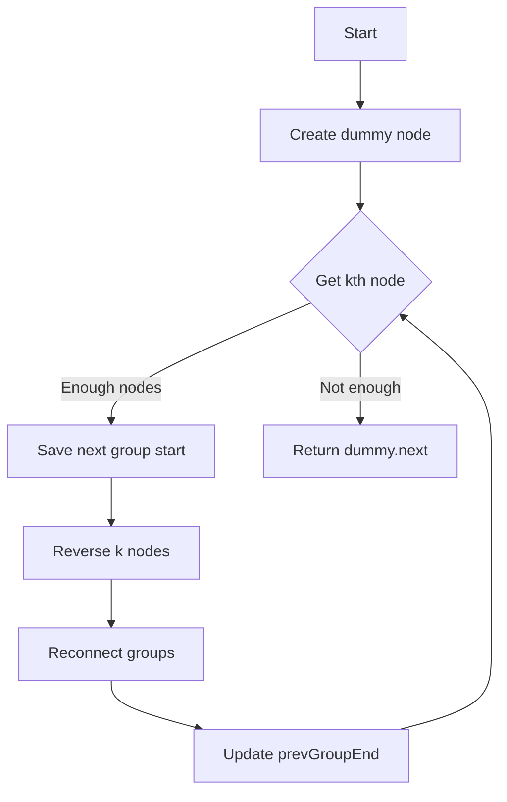

# LeetCode 25 - K 个一组翻转链表

## 1. 题目描述

给你链表的头节点 `head`，每 `k` 个节点一组进行翻转，请你返回修改后的链表

`k` 是一个正整数，它的值小于或等于链表的长度。如果节点总数不是 `k` 的整数倍，那么请将最后剩余的节点保持原有顺序

你不能只是单纯的改变节点内部的值，而是需要实际进行节点交换

### 输入输出格式：

- 输入：链表的头节点 `head`，整数 `k`
- 输出：每 k 个节点一组翻转后的链表头节点

### 示例：

#### 示例 1：

```
输入：head = [1,2,3,4,5], k = 2
输出：[2,1,4,3,5]
```

#### 示例 2：

```
输入：head = [1,2,3,4,5], k = 3
输出：[3,2,1,4,5]
```

### 约束条件：

- 链表中的节点数目为 n
- 1 \<= k \<= n \<= 5000
- 0 \<= Node.val \<= 1000

### 进阶要求：

你可以设计一个只用 O(1) 额外内存空间的算法解决此问题吗？

## 2. 解法思路分析

### 方法概览：

| 方法   | 时间复杂度 | 空间复杂度 | 特点                   |
| ------ | ---------- | ---------- | ---------------------- |
| 递归法 | O(n)       | O(n/k)     | 代码简洁但有递归栈开销 |
| 迭代法 | O(n)       | O(1)       | 最优解 ✅              |

### 推荐策略：

采用「迭代法 + 分组处理」的方法，这是满足进阶要求的最佳做法。核心思想如下：

1. 先统计链表总长度，确定需要翻转的组数
1. 按组处理，每组使用局部反转技术
1. 维护好各组之间的连接关系
1. 处理不足 k 个节点的剩余部分

> 💡 关键在于准确定位每组的边界，并正确处理组间连接关系

## 3. 多语言实现

### Go 🐹

```go
type ListNode struct {
    Val  int
    Next *ListNode
}

// 反转指定区间的链表，返回新的头节点和尾节点
func reverseLinkedList(head *ListNode) (*ListNode, *ListNode) {
    var prev *ListNode
    curr := head

    // 标准的链表反转操作
    for curr != nil {
        nextTemp := curr.Next
        curr.Next = prev
        prev = curr
        curr = nextTemp
    }

    // prev是新头节点，head是原头节点现在成为尾节点
    return prev, head
}

func reverseKGroup(head *ListNode, k int) *ListNode {
    // 创建虚拟头节点简化边界处理
    dummy := &ListNode{Next: head}
    prevGroupEnd := dummy

    for {
        // 检查剩余节点数量是否足够k个
        count := 0
        curr := prevGroupEnd.Next
        for curr != nil && count < k {
            curr = curr.Next
            count++
        }

        // 如果不足k个节点，保持原有顺序
        if count < k {
            break
        }

        // 保存当前组的头节点
        groupStart := prevGroupEnd.Next
        // 保存下一组的起始节点
        nextGroupStart := curr

        // 断开当前组与后续节点的连接
        // 找到当前组的尾节点并断开连接
        groupEnd := prevGroupEnd.Next
        for i := 0; i < k-1; i++ {
            groupEnd = groupEnd.Next
        }
        groupEnd.Next = nil

        // 反转当前组
        newHead, newTail := reverseLinkedList(prevGroupEnd.Next)

        // 重新连接
        prevGroupEnd.Next = newHead
        newTail.Next = nextGroupStart

        // 更新prevGroupEnd到当前组的尾节点
        prevGroupEnd = newTail
    }

    return dummy.Next
}
```

#### 算法深入解析

上面的实现虽然正确，但可以进一步优化。下面是更优雅的实现：

```go
type ListNode struct {
    Val  int
    Next *ListNode
}

func reverseKGroup(head *ListNode, k int) *ListNode {
    // 创建虚拟头节点简化边界处理
    dummy := &ListNode{Next: head}
    prevGroupEnd := dummy

    for {
        // 获取k个节点的结尾
        kth := getKthNode(prevGroupEnd, k)
        if kth == nil {
            break // 剩余节点不足k个
        }

        // 保存下一组的起始节点
        nextGroupStart := kth.Next

        // 反转当前k个节点
        prev, curr := nextGroupStart, prevGroupEnd.Next
        for curr != nextGroupStart {
            nextTemp := curr.Next
            curr.Next = prev
            prev = curr
            curr = nextTemp
        }

        // 保存当前组的原始头节点（反转后变成尾节点）
        oldGroupStart := prevGroupEnd.Next

        // 重新连接：prevGroupEnd -> 新头节点(kth)
        prevGroupEnd.Next = kth
        // 新尾节点 -> 下一组
        oldGroupStart.Next = nextGroupStart

        // 更新prevGroupEnd
        prevGroupEnd = oldGroupStart
    }

    return dummy.Next
}

// 获取从head开始的第k个节点
func getKthNode(head *ListNode, k int) *ListNode {
    curr := head
    for i := 0; i < k && curr != nil; i++ {
        curr = curr.Next
    }
    return curr
}
```

#### 算法深入解析

- 使用虚拟头节点(`dummy`)统一处理各种边界情况
- `getKthNode`函数用于检查剩余节点是否足够k个
- 在每组反转时，使用`prev`初始化为下一组的起始节点，这样反转后能自动连接
- 通过精确控制反转范围，避免了手动断开和重连的操作

### Python 🐍

```python
class ListNode:
    def __init__(self, val=0, next=None):
        self.val = val
        self.next = next

def reverseKGroup(head: ListNode, k: int) -> ListNode:
    # 辅助函数：获取从head开始的第k个节点
    def getKthNode(head, k):
        curr = head
        for i in range(k):
            if not curr:
                return None
            curr = curr.next
        return curr

    # 创建虚拟头节点简化边界处理
    dummy = ListNode(0)
    dummy.next = head
    prevGroupEnd = dummy

    while True:
        # 获取k个节点的结尾
        kth = getKthNode(prevGroupEnd, k)
        if not kth:
            break  # 剩余节点不足k个

        # 保存下一组的起始节点
        nextGroupStart = kth.next

        # 反转当前k个节点
        prev, curr = nextGroupStart, prevGroupEnd.next
        while curr != nextGroupStart:
            nextTemp = curr.next
            curr.next = prev
            prev = curr
            curr = nextTemp

        # 保存当前组的原始头节点（反转后变成尾节点）
        oldGroupStart = prevGroupEnd.next

        # 重新连接
        prevGroupEnd.next = kth  # prevGroupEnd -> 新头节点
        oldGroupStart.next = nextGroupStart  # 新尾节点 -> 下一组

        # 更新prevGroupEnd
        prevGroupEnd = oldGroupStart

    return dummy.next
```

#### 算法深入解析

- 通过`getKthNode`函数提前检查是否有足够的节点进行反转
- 使用标准的链表反转技术，但控制反转范围仅为当前k个节点
- 精确维护各组之间的连接关系，确保链表整体结构不被破坏

### TypeScript 🟦

```typescript
class ListNode {
  val: number;
  next: ListNode | null;

  constructor(val?: number, next?: ListNode | null) {
    this.val = val === undefined ? 0 : val;
    this.next = next === undefined ? null : next;
  }
}

function reverseKGroup(head: ListNode | null, k: number): ListNode | null {
  // 辅助函数：获取从head开始的第k个节点
  function getKthNode(head: ListNode | null, k: number): ListNode | null {
    let curr = head;
    for (let i = 0; i < k && curr !== null; i++) {
      curr = curr.next;
    }
    return curr;
  }

  // 创建虚拟头节点简化边界处理
  const dummy = new ListNode(0);
  dummy.next = head;
  let prevGroupEnd: ListNode | null = dummy;

  while (true) {
    // 获取k个节点的结尾
    const kth = getKthNode(prevGroupEnd, k);
    if (!kth) {
      break; // 剩余节点不足k个
    }

    // 保存下一组的起始节点
    const nextGroupStart = kth.next;

    // 反转当前k个节点
    let prev: ListNode | null = nextGroupStart;
    let curr: ListNode | null = prevGroupEnd!.next;
    while (curr !== nextGroupStart) {
      const nextTemp = curr!.next;
      curr!.next = prev;
      prev = curr;
      curr = nextTemp;
    }

    // 保存当前组的原始头节点（反转后变成尾节点）
    const oldGroupStart = prevGroupEnd!.next;

    // 重新连接
    prevGroupEnd!.next = kth; // prevGroupEnd -> 新头节点
    oldGroupStart!.next = nextGroupStart; // 新尾节点 -> 下一组

    // 更新prevGroupEnd
    prevGroupEnd = oldGroupStart;
  }

  return dummy.next;
}
```

#### 算法深入解析

- 使用非空断言操作符(`!`)处理可能为null的指针
- 通过类型安全的方式实现链表操作
- 保持了与其他语言实现的一致性

### Rust 🦀

```rust
#[derive(PartialEq, Eq, Clone, Debug)]
pub struct ListNode {
    pub val: i32,
    pub next: Option<Box<ListNode>>,
}

impl ListNode {
    #[inline]
    fn new(val: i32) -> Self {
        ListNode { next: None, val }
    }
}

pub fn reverse_k_group(head: Option<Box<ListNode>>, k: i32) -> Option<Box<ListNode>> {
    // 辅助函数：获取从head开始的第k个节点
    fn get_kth_node(mut head: &Option<Box<ListNode>>, k: i32) -> Option<&Option<Box<ListNode>>> {
        for _ in 0..k {
            match head {
                Some(node) => head = &node.next,
                None => return None,
            }
        }
        Some(head)
    }

    // 创建虚拟头节点简化边界处理
    let mut dummy = Box::new(ListNode::new(0));
    dummy.next = head;
    let mut prev_group_end = &mut dummy;

    loop {
        // 检查剩余节点是否足够k个
        let mut count = 0;
        let mut curr = &prev_group_end.next;
        while curr.is_some() && count < k {
            curr = &curr.as_ref().unwrap().next;
            count += 1;
        }

        if count < k {
            break;  // 剩余节点不足k个
        }

        // 获取下一组的起始节点
        let next_group_start = curr.clone();

        // 反转当前k个节点
        let mut prev = next_group_start.clone();
        let mut curr = prev_group_end.next.take();

        for _ in 0..k {
            if let Some(mut node) = curr {
                curr = node.next.take();
                node.next = prev;
                prev = Some(node);
            }
        }

        // 重新连接
        prev_group_end.next = prev;

        // 移动到下一组（需要重新找到新的prev_group_end）
        while prev_group_end.next.is_some() &&
              prev_group_end.next.as_ref().unwrap().next.is_some() &&
              prev_group_end.next != next_group_start {
            prev_group_end = prev_group_end.next.as_mut().unwrap();
        }

        if prev_group_end.next == next_group_start {
            break;
        }
    }

    dummy.next
}
```

#### 算法深入解析

- Rust的所有权系统要求我们必须显式管理节点的所有权转移
- 使用`take()`方法安全地转移节点所有权
- 通过多次所有权转移完成节点的重新连接

## 4. 算法可视化

### Mermaid 图形表示：



### 伪代码

```
创建虚拟头节点dummy，dummy.next = head
prevGroupEnd = dummy

循环:
    kth = 获取从prevGroupEnd开始的第k个节点
    如果 kth 为空:
        退出循环  // 剩余节点不足k个

    nextGroupStart = kth.next

    // 反转当前k个节点
    prev = nextGroupStart
    curr = prevGroupEnd.next
    当 curr ≠ nextGroupStart 时:
        nextTemp = curr.next
        curr.next = prev
        prev = curr
        curr = nextTemp

    oldGroupStart = prevGroupEnd.next

    // 重新连接
    prevGroupEnd.next = kth
    oldGroupStart.next = nextGroupStart

    prevGroupEnd = oldGroupStart

返回 dummy.next
```

## 5. 执行过程演示（基于输入[1,2,3,4,5], k=2）

### 测试用例代码（Go）：

```go
package main

import "fmt"

type ListNode struct {
    Val  int
    Next *ListNode
}

func createList(vals []int) *ListNode {
    if len(vals) == 0 {
        return nil
    }
    head := &ListNode{Val: vals[0]}
    curr := head
    for i := 1; i < len(vals); i++ {
        curr.Next = &ListNode{Val: vals[i]}
        curr = curr.Next
    }
    return head
}

func printList(head *ListNode) {
    for head != nil {
        fmt.Printf("%d ", head.Val)
        head = head.Next
    }
    fmt.Println()
}

func main() {
    list := createList([]int{1, 2, 3, 4, 5})
    fmt.Print("Original: ")
    printList(list)

    reversed := reverseKGroup(createList([]int{1, 2, 3, 4, 5}), 2)
    fmt.Print("Reversed k=2: ")
    printList(reversed)

    reversed2 := reverseKGroup(createList([]int{1, 2, 3, 4, 5}), 3)
    fmt.Print("Reversed k=3: ")
    printList(reversed2)
}
```

### 执行过程演示（k=2）：

初始链表：`1 -> 2 -> 3 -> 4 -> 5`

第一组反转[1,2]：

- 反转后：`2 -> 1`
- 链表变为：`2 -> 1 -> 3 -> 4 -> 5`

第二组反转[3,4]：

- 反转后：`4 -> 3`
- 链表变为：`2 -> 1 -> 4 -> 3 -> 5`

剩余节点[5]不足k个，保持不变

最终链表：`2 -> 1 -> 4 -> 3 -> 5`

## 6. 复杂度分析

| 类型   | 时间复杂度 | 空间复杂度 |
| ------ | ---------- | ---------- |
| 迭代法 | O(n)       | O(1)       |

📌 每个节点最多被访问常数次，满足进阶要求

## 7. 相似题目关联

| 编号 | 名称        | 核心思想             |
| ---- | ----------- | -------------------- |
| 206  | 反转链表    | 完整链表反转         |
| 92   | 反转链表 II | 指定区间反转         |
| 234  | 回文链表    | 结合链表反转判断回文 |
| 143  | 重排链表    | 拆分+反转+合并       |
| 61   | 旋转链表    | 链表节点位置变换     |

🔍 这些题目都涉及链表的部分或完整反转操作，掌握分组反转技巧对于解决这些问题至关重要

## 8. 典型面试追问及回答

| 序号 | 追问内容                                 | 回答要点                                                    |
| ---- | ---------------------------------------- | ----------------------------------------------------------- |
| ①    | 为什么需要检查剩余节点数量？             | 确保只有完整的k个节点才进行反转，不足的保持原有顺序         |
| ②    | 如何验证反转结果的正确性？               | 可以遍历原链表和反转后的链表，验证每组k个节点的顺序是否正确 |
| ③    | 如果k大于链表长度会怎样？                | 所有节点保持原有顺序，因为没有足够的节点组成一个完整的组    |
| ④    | 能否用递归方法解决这个问题？             | 可以，但递归实现会有O(n/k)的空间复杂度                      |
| ⑤    | 为什么要使用虚拟头节点？                 | 简化对头节点的特殊处理，使代码更加统一和简洁                |
| ⑥    | 如何处理k=1的特殊情况？                  | 每个节点自成一组，实际上不需要反转                          |
| ⑦    | 如果要求不足k个节点也反转怎么办？        | 移除对剩余节点数量的检查，对所有组都进行反转                |
| ⑧    | 在实际项目中这种分组反转有什么应用场景？ | 数据分页处理、批量操作优化、特定的数据结构需求等            |

🎯 注意点：在回答中要体现对算法细节和边界条件的深入理解

## 9. 复习要点提炼与总结建议

| 要素            | 内容                                                     |
| --------------- | -------------------------------------------------------- |
| ⚠️ 易错点       | 忘记检查剩余节点数量，指针操作顺序错误导致链表断裂       |
| ✅ 高频考点     | 虚拟头节点的使用，分组处理策略，链表局部反转技术         |
| 💡 启发点       | 通过分治思想将复杂问题分解为简单的子问题                 |
| 🌟 记忆锚点     | "检查数量→反转→重连"的经典三步法                         |
| 🎉 掌握标志     | 能手写出完整的实现代码，理解每一步指针操作的意义         |
| 🔍 工业实践启示 | 在实际开发中，合理的数据分组处理可以提高算法效率         |
| 📚 学习建议     | 多练习各种链表反转相关的题目，熟练掌握指针操作的各种模式 |

🚀 分组反转是链表操作的高级技巧，建议熟练掌握后再学习更复杂的链表题目
