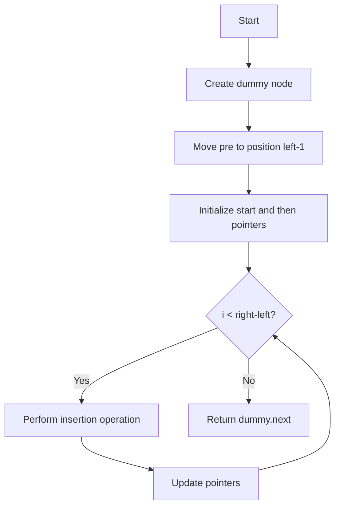

# LeetCode 92 - 反转链表 II

## 1. 题目描述

给你单链表的头指针 `head` 和两个整数 `left` 和 `right`，其中 `left <= right`。请你反转从位置 `left` 到位置 `right` 的链表节点，返回反转后的链表

### 输入输出格式：

- 输入：链表的头节点 `head`，整数 `left` 和 `right`
- 输出：反转指定区间的链表头节点

### 示例：

#### 示例 1：

```
输入：head = [1,2,3,4,5], left = 2, right = 4
输出：[1,4,3,2,5]
```

#### 示例 2：

```
输入：head = [5], left = 1, right = 1
输出：[5]
```

### 约束条件：

- 链表中节点数目为 n
- 1 \<= n \<= 500
- -500 \<= Node.val \<= 500
- 1 \<= left \<= right \<= n

### 进阶要求：

你可以使用一趟扫描完成反转吗？

## 2. 解法思路分析

### 方法概览：

| 方法       | 时间复杂度 | 空间复杂度 | 特点                 |
| ---------- | ---------- | ---------- | -------------------- |
| 两次遍历法 | O(n)       | O(1)       | 逻辑清晰但需多次遍历 |
| 一次遍历法 | O(n)       | O(1)       | 最优解 ✅            |

### 推荐策略：

采用「一次遍历 + 局部反转」的方法，这是满足进阶要求的最佳做法。核心思想如下：

1. 找到反转区间的前一个节点(`pre`)和区间内的第一个节点(`start`)
1. 在一次遍历中完成指定区间的节点反转
1. 重新连接反转后的子链表与原链表的其余部分

> 💡 关键在于准确定位反转区间的边界节点，并正确处理反转后链表的连接关系

## 3. 多语言实现

### Go 🐹

```go
type ListNode struct {
    Val  int
    Next *ListNode
}

func reverseBetween(head *ListNode, left int, right int) *ListNode {
    // 创建虚拟头节点，简化边界处理
    dummy := &ListNode{Next: head}
    pre := dummy

    // 移动到反转区间的前一个节点
    for i := 0; i < left-1; i++ {
        pre = pre.Next
    }

    // start指向反转区间的第一个节点
    start := pre.Next
    // then指向待处理的节点
    then := start.Next

    // 执行反转操作
    // 将then节点逐个插入到pre节点之后
    for i := 0; i < right-left; i++ {
        start.Next = then.Next    // 断开start与then的连接
        then.Next = pre.Next      // then指向pre原来的下一个节点
        pre.Next = then           // pre指向then
        then = start.Next         // 移动then到下一个待处理节点
    }

    return dummy.Next
}
```

#### 算法深入解析

- 使用虚拟头节点(`dummy`)统一处理各种边界情况，避免对头节点的特殊处理
- `pre`指向反转区间的前一个节点，是反转操作的锚点
- `start`始终指向反转区间内原来的第一个节点，在反转过程中位置不变
- `then`指向当前待处理节点，通过头插法将其插入到`pre`之后
- 循环`right-left`次，完成指定区间内所有节点的反转

### Python 🐍

```python
class ListNode:
    def __init__(self, val=0, next=None):
        self.val = val
        self.next = next

def reverseBetween(head: ListNode, left: int, right: int) -> ListNode:
    # 创建虚拟头节点，简化边界处理
    dummy = ListNode(0)
    dummy.next = head
    pre = dummy

    # 移动到反转区间的前一个节点
    for i in range(left - 1):
        pre = pre.next

    # start指向反转区间的第一个节点
    start = pre.next
    # then指向待处理的节点
    then = start.next

    # 执行反转操作
    # 将then节点逐个插入到pre节点之后
    for i in range(right - left):
        start.next = then.next    # 断开start与then的连接
        then.next = pre.next      # then指向pre原来的下一个节点
        pre.next = then           # pre指向then
        then = start.next         # 移动then到下一个待处理节点

    return dummy.next
```

#### 算法深入解析

- 虚拟头节点的引入使得头节点的处理与其他节点一致
- 通过精确控制循环次数(`right-left`)来限定反转范围
- 头插法的核心在于维护三个关键指针的位置关系
- 算法始终保持链表的连通性，避免出现断裂

### TypeScript 🟦

```typescript
class ListNode {
  val: number;
  next: ListNode | null;

  constructor(val?: number, next?: ListNode | null) {
    this.val = val === undefined ? 0 : val;
    this.next = next === undefined ? null : next;
  }
}

function reverseBetween(
  head: ListNode | null,
  left: int,
  right: int,
): ListNode | null {
  // 创建虚拟头节点，简化边界处理
  const dummy = new ListNode(0);
  dummy.next = head;
  let pre: ListNode = dummy;

  // 移动到反转区间的前一个节点
  for (let i = 0; i < left - 1; i++) {
    pre = pre.next!;
  }

  // start指向反转区间的第一个节点
  const start: ListNode = pre.next!;
  // then指向待处理的节点
  let then: ListNode = start.next!;

  // 执行反转操作
  // 将then节点逐个插入到pre节点之后
  for (let i = 0; i < right - left; i++) {
    start.next = then.next; // 断开start与then的连接
    then.next = pre.next; // then指向pre原来的下一个节点
    pre.next = then; // pre指向then
    then = start.next!; // 移动then到下一个待处理节点
  }

  return dummy.next;
}
```

#### 算法深入解析

- 使用非空断言操作符(`!`)处理可能为null的指针，提高代码简洁性
- 精确的循环控制确保只反转指定范围内的节点
- 通过头插法实现局部反转，保持了整体链表结构的完整性

### Rust 🦀

```rust
#[derive(PartialEq, Eq, Clone, Debug)]
pub struct ListNode {
    pub val: i32,
    pub next: Option<Box<ListNode>>,
}

impl ListNode {
    #[inline]
    fn new(val: i32) -> Self {
        ListNode { next: None, val }
    }
}

pub fn reverse_between(head: Option<Box<ListNode>>, left: i32, right: i32) -> Option<Box<ListNode>> {
    // 创建虚拟头节点，简化边界处理
    let mut dummy = Box::new(ListNode { val: 0, next: head });
    let mut pre = &mut dummy;

    // 移动到反转区间的前一个节点
    for _ in 0..left - 1 {
        pre = pre.next.as_mut().unwrap();
    }

    // start指向反转区间的第一个节点
    let mut start = pre.next.take();
    let mut then = start.as_mut().unwrap().next.take();

    // 执行反转操作
    // 将then节点逐个插入到pre节点之后
    for _ in 0..right - left {
        let mut temp = then.as_mut().unwrap().next.take();
        then.as_mut().unwrap().next = start;
        start = then;
        then = temp;
    }

    // 重新连接链表
    pre.next = start;
    let mut current = pre;
    while current.next.is_some() {
        current = current.next.as_mut().unwrap();
    }
    current.next = then;

    dummy.next
}
```

#### 算法深入解析

- Rust的所有权系统要求我们必须显式管理节点的所有权转移
- 使用`take()`方法安全地转移节点所有权，避免借用冲突
- 通过多次所有权转移完成节点的重新连接

## 4. 算法可视化

### Mermaid 图形表示：



### 伪代码

```
创建虚拟头节点dummy，dummy.next = head
pre = dummy
// 定位到反转区间的前一个节点
循环 left-1 次:
    pre = pre.next

start = pre.next  // 反转区间的第一个节点
then = start.next // 待处理节点

// 执行反转操作
循环 right-left 次:
    start.next = then.next    // 断开连接
    then.next = pre.next      // 插入操作
    pre.next = then
    then = start.next

返回 dummy.next
```

## 5. 执行过程演示（基于输入[1,2,3,4,5], left=2, right=4）

### 测试用例代码（Go）：

```go
package main

import "fmt"

type ListNode struct {
    Val  int
    Next *ListNode
}

func createList(vals []int) *ListNode {
    if len(vals) == 0 {
        return nil
    }
    head := &ListNode{Val: vals[0]}
    curr := head
    for i := 1; i < len(vals); i++ {
        curr.Next = &ListNode{Val: vals[i]}
        curr = curr.Next
    }
    return head
}

func printList(head *ListNode) {
    for head != nil {
        fmt.Printf("%d ", head.Val)
        head = head.Next
    }
    fmt.Println()
}

func main() {
    list := createList([]int{1, 2, 3, 4, 5})
    fmt.Print("Original: ")
    printList(list)

    reversed := reverseBetween(createList([]int{1, 2, 3, 4, 5}), 2, 4)
    fmt.Print("Reversed [2,4]: ")
    printList(reversed)
}
```

### 执行过程演示：

初始链表：`1 -> 2 -> 3 -> 4 -> 5`

| 步骤 | pre | start | then | 操作说明     |
| ---- | --- | ----- | ---- | ------------ |
| 1    | 1   | 2     | 3    | 3插入到1后面 |
| 2    | 1   | 2     | 4    | 4插入到1后面 |
| 3    | 1   | 2     | 5    | 结束         |

最终链表：`1 -> 4 -> 3 -> 2 -> 5`

## 6. 复杂度分析

| 类型       | 时间复杂度 | 空间复杂度 |
| ---------- | ---------- | ---------- |
| 一次遍历法 | O(n)       | O(1)       |

📌 只需要一次遍历就能完成指定区间的反转，满足进阶要求

## 7. 相似题目关联

| 编号 | 名称             | 核心思想             |
| ---- | ---------------- | -------------------- |
| 206  | 反转链表         | 完整链表反转         |
| 25   | K 个一组翻转链表 | 分组反转链表         |
| 234  | 回文链表         | 结合链表反转判断回文 |
| 143  | 重排链表         | 拆分+反转+合并       |
| 61   | 旋转链表         | 链表节点位置变换     |

🔍 这些题目都涉及链表的部分或完整反转操作，掌握区间反转技巧对于解决这些问题至关重要

## 8. 典型面试追问及回答

| 序号 | 追问内容                                 | 回答要点                                                                           |
| ---- | ---------------------------------------- | ---------------------------------------------------------------------------------- |
| ①    | 为什么需要使用虚拟头节点？               | 简化对头节点的特殊处理，使代码更加统一和简洁                                       |
| ②    | 如何验证反转结果的正确性？               | 可以遍历原链表和反转后的链表，验证指定区间内的节点顺序是否正确                     |
| ③    | 如果left或right超出链表范围会怎样？      | 题目保证输入合法，但如果在实际应用中需要添加边界检查                               |
| ④    | 能否用递归方法解决这个问题？             | 可以，但递归实现相对复杂，且空间复杂度较高                                         |
| ⑤    | 为什么要循环right-left次？               | 因为要反转right-left+1个节点，但第一个节点位置不变，只需移动后面的right-left个节点 |
| ⑥    | 如果left等于right会发生什么？            | 不需要反转任何节点，直接返回原链表                                                 |
| ⑦    | 如何处理空链表的情况？                   | 虚拟头节点的设计已经处理了这种情况                                                 |
| ⑧    | 在实际项目中这种局部反转有什么应用场景？ | 链表节点的重新排序、数据结构调整等场景                                             |

🎯 注意点：在回答中要体现对算法细节和边界条件的深入理解

## 9. 复习要点提炼与总结建议

| 要素            | 内容                                                       |
| --------------- | ---------------------------------------------------------- |
| ⚠️ 易错点       | 忘记处理边界情况，指针操作顺序错误导致链表断裂             |
| ✅ 高频考点     | 虚拟头节点的使用，头插法实现局部反转                       |
| 💡 启发点       | 通过引入辅助节点简化边界处理，体现了工程实践中常用的技巧   |
| 🌟 记忆锚点     | "虚拟头节点+头插法"的经典组合                              |
| 🎉 掌握标志     | 能手写出完整的实现代码，理解每一步指针操作的意义           |
| 🔍 工业实践启示 | 在实际开发中，合理使用虚拟节点可以大大简化链表操作的复杂度 |
| 📚 学习建议     | 多练习各种链表反转相关的题目，熟练掌握指针操作的各种模式   |

🚀 区间反转是链表操作的重要技巧，建议熟练掌握后再学习更复杂的链表题目
