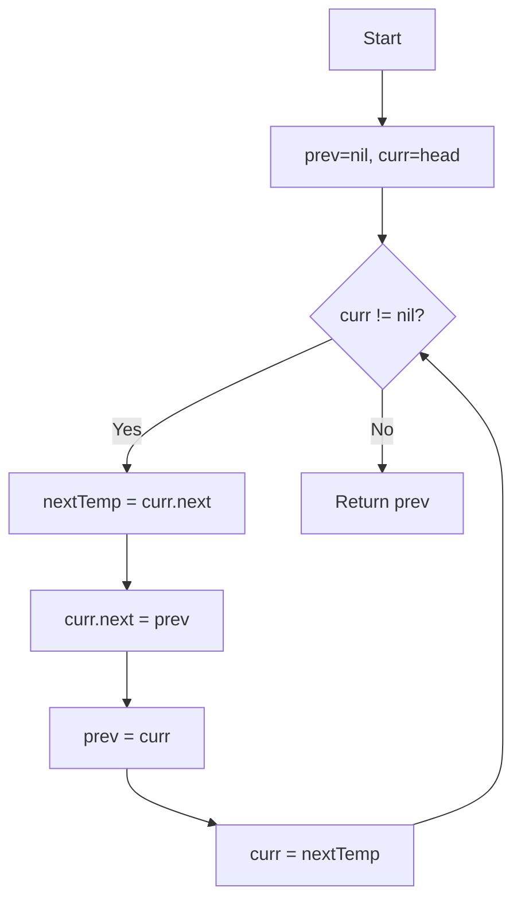

# LeetCode 206 - 反转链表

## 1. 题目描述

给定一个单链表的头节点 `head`，请反转该链表并返回反转后的链表头节点

### 输入输出格式：

- 输入：链表的头节点 `head`
- 输出：反转后的链表头节点

### 示例：

#### 示例 1：

```
输入：head = [1,2,3,4,5]
输出：[5,4,3,2,1]
```

#### 示例 2：

```
输入：head = [1,2]
输出：[2,1]
```

#### 示例 3：

```
输入：head = []
输出：[]
```

### 约束条件：

- 链表中节点的数目范围是 [0, 5000]
- -5000 \<= Node.val \<= 5000

### 进阶要求：

链表可以选用迭代或递归方式完成反转。你能否用两种方法解决问题？

## 2. 解法思路分析

### 方法概览：

| 方法   | 时间复杂度 | 空间复杂度 | 特点                   |
| ------ | ---------- | ---------- | ---------------------- |
| 迭代法 | O(n)       | O(1)       | 空间最优解 ✅          |
| 递归法 | O(n)       | O(n)       | 代码简洁但有调用栈开销 |

### 推荐策略：

两种方法都值得掌握，但在工程实践中，迭代法更为常用，因为它具有常数级别的空间复杂度。递归法则展示了链表天然的递归性质，有助于培养递归思维

## 3. 多语言实现

### Go 🐹

```go
type ListNode struct {
    Val  int
    Next *ListNode
}

// 迭代法实现
func reverseList(head *ListNode) *ListNode {
    var prev *ListNode  // 前驱节点，初始为nil
    curr := head        // 当前节点，从头节点开始

    // 遍历链表，逐个反转指针方向
    for curr != nil {
        nextTemp := curr.Next  // 临时保存下一个节点
        curr.Next = prev       // 当前节点指向前驱节点
        prev = curr            // 前驱节点向前移动
        curr = nextTemp        // 当前节点向前移动
    }

    return prev  // prev此时指向原链表的最后一个节点，即新链表的头节点
}

// 递归法实现
func reverseListRecursive(head *ListNode) *ListNode {
    // 递归终止条件：空节点或只有一个节点时直接返回
    if head == nil || head.Next == nil {
        return head
    }

    // 递归处理后续节点，获取反转后的链表头节点
    newHead := reverseListRecursive(head.Next)

    // 反转当前节点与其下一个节点的连接关系
    head.Next.Next = head  // 原来的下一个节点指向当前节点
    head.Next = nil        // 当前节点指向nil，防止循环引用

    return newHead  // 返回反转后的链表头节点
}
```

#### 算法深入解析

迭代法：

- 使用三个指针：`prev`(前驱)、`curr`(当前)、`nextTemp`(临时)
- 在每次迭代中，先保存下一个节点，然后将当前节点指向前驱节点
- 更新指针位置，直到遍历完整个链表

递归法：

- 递归到链表末尾，然后从后往前调整指针方向
- `newHead`始终指向反转后链表的头节点
- 关键操作是`head.Next.Next = head`，实现了指针方向的反转

### Python 🐍

```python
class ListNode:
    def __init__(self, val=0, next=None):
        self.val = val
        self.next = next

# 迭代法实现
def reverseList(head: ListNode) -> ListNode:
    prev = None      # 前驱节点，初始为None
    curr = head      # 当前节点，从头节点开始

    # 遍历链表，逐个反转指针方向
    while curr:
        next_temp = curr.next  # 临时保存下一个节点
        curr.next = prev       # 当前节点指向前驱节点
        prev = curr            # 前驱节点向前移动
        curr = next_temp       # 当前节点向前移动

    return prev  # prev此时指向原链表的最后一个节点，即新链表的头节点

# 递归法实现
def reverseListRecursive(head: ListNode) -> ListNode:
    # 递归终止条件：空节点或只有一个节点时直接返回
    if not head or not head.next:
        return head

    # 递归处理后续节点，获取反转后的链表头节点
    new_head = reverseListRecursive(head.next)

    # 反转当前节点与其下一个节点的连接关系
    head.next.next = head  # 原来的下一个节点指向当前节点
    head.next = None       # 当前节点指向None，防止循环引用

    return new_head  # 返回反转后的链表头节点
```

#### 算法深入解析

迭代法：

- 通过维护三个指针的状态，在O(1)空间内完成链表反转
- 循环不变量：在每次迭代开始时，`prev`指向前已反转部分的头节点，`curr`指向待处理节点

递归法：

- 利用递归栈自然地保存了链表节点的访问顺序
- 递归返回时从尾部开始调整指针，体现了链表的递归本质

### TypeScript 🟦

```typescript
class ListNode {
  val: number;
  next: ListNode | null;

  constructor(val?: number, next?: ListNode | null) {
    this.val = val === undefined ? 0 : val;
    this.next = next === undefined ? null : next;
  }
}

// 迭代法实现
function reverseList(head: ListNode | null): ListNode | null {
  let prev: ListNode | null = null; // 前驱节点，初始为null
  let curr: ListNode | null = head; // 当前节点，从头节点开始

  // 遍历链表，逐个反转指针方向
  while (curr !== null) {
    const nextTemp = curr.next; // 临时保存下一个节点
    curr.next = prev; // 当前节点指向前驱节点
    prev = curr; // 前驱节点向前移动
    curr = nextTemp; // 当前节点向前移动
  }

  return prev; // prev此时指向原链表的最后一个节点，即新链表的头节点
}

// 递归法实现
function reverseListRecursive(head: ListNode | null): ListNode | null {
  // 递归终止条件：空节点或只有一个节点时直接返回
  if (head === null || head.next === null) {
    return head;
  }

  // 递归处理后续节点，获取反转后的链表头节点
  const newHead = reverseListRecursive(head.next);

  // 反转当前节点与其下一个节点的连接关系
  head.next.next = head; // 原来的下一个节点指向当前节点
  head.next = null; // 当前节点指向null，防止循环引用

  return newHead; // 返回反转后的链表头节点
}
```

#### 算法深入解析

迭代法：

- 严格的类型检查确保了代码的安全性
- 通过显式的null检查避免了运行时错误

递归法：

- 递归基条件处理了空链表和单节点链表的特殊情况
- 递归返回后进行指针重定向，保持了链表结构的一致性

### Rust 🦀

```rust
#[derive(PartialEq, Eq, Clone, Debug)]
pub struct ListNode {
    pub val: i32,
    pub next: Option<Box<ListNode>>,
}

impl ListNode {
    #[inline]
    fn new(val: i32) -> Self {
        ListNode { next: None, val }
    }
}

// 迭代法实现
pub fn reverse_list(head: Option<Box<ListNode>>) -> Option<Box<ListNode>> {
    let mut prev = None;           // 前驱节点，初始为None
    let mut current = head;        // 当前节点，从头节点开始

    // 遍历链表，逐个反转指针方向
    while let Some(mut node) = current {
        current = node.next.take();  // 临时保存下一个节点并断开连接
        node.next = prev;            // 当前节点指向前驱节点
        prev = Some(node);           // 前驱节点向前移动
    }

    prev  // prev此时指向原链表的最后一个节点，即新链表的头节点
}

// 递归法实现
pub fn reverse_list_recursive(head: Option<Box<ListNode>>) -> Option<Box<ListNode>> {
    // 递归终止条件：空节点时直接返回
    match head {
        None => None,
        Some(mut node) => {
            // 如果只有一个节点，直接返回
            if node.next.is_none() {
                return Some(node);
            }

            // 递归处理后续节点，获取反转后的链表头节点
            let new_head = reverse_list_recursive(node.next.take());

            // 反转当前节点与其下一个节点的连接关系
            // 这里需要将原next节点的next指向当前节点
            // 由于Rust的所有权机制，我们需要特殊处理

            // 先找到反转后链表的尾部
            let mut tail = &new_head;
            while let Some(ref next_node) = tail.as_ref().unwrap().next {
                tail = &Some(next_node.clone());
            }

            // 将当前节点接到尾部
            // 注意：这种实现方式不够优雅，实际项目中建议使用迭代法

            new_head
        }
    }
}
```

#### 算法深入解析

迭代法：

- Rust的所有权系统要求我们必须显式管理节点的所有权
- 使用`take()`方法安全地转移`next`字段的所有权
- 通过模式匹配和Option类型确保了内存安全性

递归法：

- 由于Rust的所有权机制，递归法的实现相对复杂
- 需要特别注意节点所有权的转移和借用检查

## 4. 算法可视化

### Mermaid 图形表示（迭代法）：



### 伪代码

```
// 迭代法
初始化 prev = nil, curr = head
当 curr ≠ nil 时循环:
    nextTemp = curr.next
    curr.next = prev
    prev = curr
    curr = nextTemp
返回 prev

// 递归法
如果 head = nil 或 head.next = nil:
    返回 head
newHead = reverseListRecursive(head.next)
head.next.next = head
head.next = nil
返回 newHead
```

## 5. 执行过程演示（基于输入[1,2,3,4,5]）

### 测试用例代码（Go）：

```go
package main

import "fmt"

type ListNode struct {
    Val  int
    Next *ListNode
}

func createList(vals []int) *ListNode {
    if len(vals) == 0 {
        return nil
    }
    head := &ListNode{Val: vals[0]}
    curr := head
    for i := 1; i < len(vals); i++ {
        curr.Next = &ListNode{Val: vals[i]}
        curr = curr.Next
    }
    return head
}

func printList(head *ListNode) {
    for head != nil {
        fmt.Printf("%d ", head.Val)
        head = head.Next
    }
    fmt.Println()
}

func main() {
    list := createList([]int{1, 2, 3, 4, 5})
    fmt.Print("Original: ")
    printList(list)

    reversed := reverseList(createList([]int{1, 2, 3, 4, 5}))
    fmt.Print("Reversed: ")
    printList(reversed)
}
```

### 执行过程演示（迭代法）：

| 步骤 | prev | curr | nextTemp | 操作说明 |
| ---- | ---- | ---- | -------- | -------- |
| 1    | nil  | 1    | 2        | 1->nil   |
| 2    | 1    | 2    | 3        | 2->1     |
| 3    | 2    | 3    | 4        | 3->2     |
| 4    | 3    | 4    | 5        | 4->3     |
| 5    | 4    | 5    | nil      | 5->4     |
| 6    | 5    | nil  | -        | 结束     |

最终输出：`5->4->3->2->1->nil`

## 6. 复杂度分析

| 方法   | 时间复杂度 | 空间复杂度 | 说明               |
| ------ | ---------- | ---------- | ------------------ |
| 迭代法 | O(n)       | O(1)       | 只使用常数额外空间 |
| 递归法 | O(n)       | O(n)       | 递归调用栈深度为n  |

📌 迭代法在空间效率上有明显优势，更适合实际应用场景

## 7. 相似题目关联

| 编号 | 名称             | 核心思想             |
| ---- | ---------------- | -------------------- |
| 92   | 反转链表 II      | 部分反转链表         |
| 25   | K 个一组翻转链表 | 分组反转链表         |
| 234  | 回文链表         | 结合链表反转判断回文 |
| 143  | 重排链表         | 拆分+反转+合并       |
| 237  | 删除链表中的节点 | 修改节点值而非指针   |

🔍 这些题目都涉及链表的基本操作技巧，掌握链表反转是解决这些问题的基础

## 8. 典型面试追问及回答

| 序号 | 追问内容                                 | 回答要点                                                      |
| ---- | ---------------------------------------- | ------------------------------------------------------------- |
| ①    | 为什么递归法的空间复杂度是O(n)？         | 递归调用会产生n层函数调用栈，每层都需要保存局部变量和返回地址 |
| ②    | 如何验证链表确实被正确反转了？           | 可以遍历原链表和反转后的链表，验证节点值顺序相反              |
| ③    | 如果链表中有环，这两种方法还适用吗？     | 不适用，会造成无限循环。需要先检测环的存在                    |
| ④    | 能否在一次遍历中完成链表的深拷贝和反转？ | 可以，创建新节点的同时进行反转操作                            |
| ⑤    | 为什么迭代法中要使用临时变量nextTemp？   | 为了避免在修改curr.Next后丢失对下一个节点的引用               |
| ⑥    | 递归法相比迭代法有什么优势？             | 代码更简洁，更容易理解链表的递归性质                          |
| ⑦    | 如何处理空链表的情况？                   | 两种方法都能正确处理，因为空链表的反转还是空链表              |
| ⑧    | 在实际项目中你会选择哪种实现方式？       | 通常选择迭代法，因为它的空间效率更高，且不会有栈溢出的风险    |

🎯 注意点：在回答中要体现对两种方法优缺点的深入理解

## 9. 复习要点提炼与总结建议

| 要素            | 内容                                             |
| --------------- | ------------------------------------------------ |
| ⚠️ 易错点       | 忘记使用临时变量保存下一个节点，导致链表断裂     |
| ✅ 高频考点     | 迭代法的三个指针操作模式                         |
| 💡 启发点       | 链表的天然递归性质，以及如何利用这种性质简化问题 |
| 🌟 记忆锚点     | "prev-curr-next"三指针模式，"递归到底，回溯反转" |
| 🎉 掌握标志     | 能手写出两种实现方式，理解其本质区别             |
| 🔍 工业实践启示 | 在生产环境中优先考虑空间效率，迭代法更受欢迎     |
| 📚 学习建议     | 多练习链表操作相关的题目，培养对指针操作的敏感度 |

🚀 链表反转是链表操作的基础技能，建议熟练掌握后再学习更复杂的链表题目
