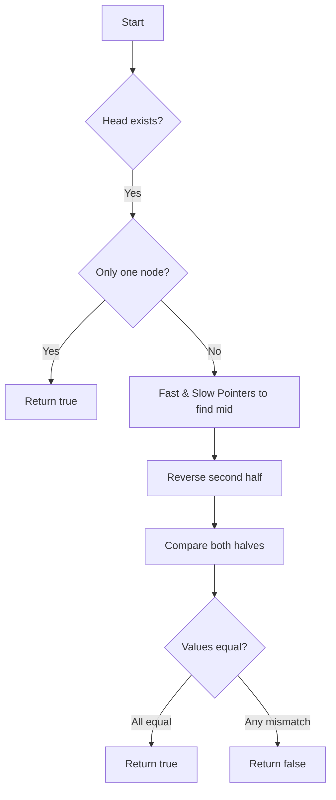

# LeetCode 234 - 回文链表

## 1. 题目描述

给定一个单链表的头节点 `head`，请判断该链表是否为回文链表。如果是，返回 `true`；否则，返回 `false`

### 输入输出格式：

- 输入：链表的头节点 `head`
- 输出：布尔值表示是否是回文链表

### 示例：

#### 示例 1：

```
输入：head = [1,2,2,1]
输出：true
```

#### 示例 2：

```
输入：head = [1,2]
输出：false
```

### 约束条件：

- 链表中节点数目范围是 `[1, 10^5]`
- `0 <= Node.val <= 9`

### 进阶要求：

能否用 O(n) 时间复杂度和 O(1) 空间复杂度解决此题？

## 2. 解法思路分析

### 方法概览：

| 方法                  | 时间复杂度 | 空间复杂度 | 特点                    |
| --------------------- | ---------- | ---------- | ----------------------- |
| 暴力数组存储          | O(n)       | O(n)       | 易懂但不符合进阶要求    |
| 快慢指针+反转后半链表 | O(n)       | O(1)       | 最优解，满足进阶要求 ✅ |

### 推荐策略：

采用「快慢指针 + 反转后半部分链表」的方式，是满足进阶要求的最佳做法。核心思想如下：

1. 使用快慢指针找到链表中点；
1. 将链表后半部分反转；
1. 同步比较前后两部分链表的值是否相等；
1. 若全部匹配，则为回文链表

> 💡 为什么要反转后半部分？因为链表只能向前遍历，无法逆序访问。将后半段反转后，就可以用两个指针分别从前向后扫描对比了

## 3. 多语言实现

### Go 🐹

```go
type ListNode struct {
    Val  int
    Next *ListNode
}

func isPalindrome(head *ListNode) bool {
    if head == nil || head.Next == nil {
        return true // 空链表或只有一个节点，必然是回文链表
    }

    slow, fast := head, head
    // 快慢指针找中点
    for fast != nil && fast.Next != nil {
        slow = slow.Next
        fast = fast.Next.Next
    }

    var prev *ListNode
    curr := slow
    // 反转后半部分链表
    for curr != nil {
        nextTemp := curr.Next
        curr.Next = prev
        prev = curr
        curr = nextTemp
    }

    firstHalf := head
    secondHalf := prev
    result := true

    // 对比前半和反转后的后半
    for result && secondHalf != nil {
        if firstHalf.Val != secondHalf.Val {
            result = false
        }
        firstHalf = firstHalf.Next
        secondHalf = secondHalf.Next
    }

    return result
}
```

#### 算法深入解析

- `slow`, `fast`: 初始指向头节点，用于寻找链表中点
- 循环中，`fast` 每次走两步，`slow` 走一步，最终 `slow` 指向中点
- 接下来通过迭代方式将 `slow` 开始的链表进行原地反转
- 最终使用 `firstHalf` 和 `secondHalf` 指针同步扫描并逐一比较节点值

### Python 🐍

```python
class ListNode:
    def __init__(self, val=0, next=None):
        self.val = val
        self.next = next

def isPalindrome(head: ListNode) -> bool:
    if not head or not head.next:
        return True

    slow = fast = head
    # 快慢指针找中点
    while fast and fast.next:
        slow = slow.next
        fast = fast.next.next

    prev = None
    curr = slow
    # 反转后半部分链表
    while curr:
        next_temp = curr.next
        curr.next = prev
        prev = curr
        curr = next_temp

    first_half = head
    second_half = prev
    result = True

    # 对比回文结构
    while result and second_half:
        if first_half.val != second_half.val:
            result = False
        first_half = first_half.next
        second_half = second_half.next

    return result
```

#### 算法深入解析

- 使用快慢指针定位中点，利用链表结构天然支持单向遍历的优势
- 通过对后半链表进行就地反转操作，节省了额外空间开销
- 最后通过双指针从前到后同步扫描来判断是否构成回文序列

### TypeScript 🟦

```typescript
class ListNode {
  val: number;
  next: ListNode | null;

  constructor(val?: number, next?: ListNode | null) {
    this.val = val === undefined ? 0 : val;
    this.next = next === undefined ? null : next;
  }
}

function isPalindrome(head: ListNode | null): boolean {
  if (!head || !head.next) return true;

  let slow: ListNode | null = head;
  let fast: ListNode | null = head;

  // 快慢指针找到中点
  while (fast !== null && fast.next !== null) {
    slow = slow!.next;
    fast = fast.next.next;
  }

  let prev: ListNode | null = null;
  let current: ListNode | null = slow;

  // 反转后半部分链表
  while (current !== null) {
    const nextTemp = current.next;
    current.next = prev;
    prev = current;
    current = nextTemp;
  }

  let firstHalf: ListNode | null = head;
  let secondHalf: ListNode | null = prev;
  let result = true;

  // 比较前后两段链表
  while (result && secondHalf !== null) {
    if (firstHalf!.val !== secondHalf.val) {
      result = false;
    }
    firstHalf = firstHalf!.next;
    secondHalf = secondHalf.next;
  }

  return result;
}
```

#### 算法深入解析

- 与 Go 实现类似，先通过快慢指针确定中间节点
- 再通过链表原地反转技巧，将后半部分翻转以便对称比较
- 使用类型安全的空检查机制确保不会触发运行时错误

### Rust 🦀

```rust
#[derive(PartialEq, Eq, Clone, Debug)]
pub struct ListNode {
    pub val: i32,
    pub next: Option<Box<ListNode>>,
}

impl ListNode {
    #[inline]
    fn new(val: i32) -> Self {
        ListNode { next: None, val }
    }
}

pub fn is_palindrome(head: Option<Box<ListNode>>) -> bool {
    let mut head = head;
    if head.is_none() || head.as_ref().unwrap().next.is_none() {
        return true;
    }

    let mut slow = &head;
    let mut fast = &head;

    // 快慢指针查找中点
    while fast.is_some() && fast.as_ref().unwrap().next.is_some() {
        slow = &slow.as_ref().unwrap().next;
        fast = &fast.as_ref().unwrap().next.as_ref().unwrap().next;
    }

    let mut prev: Option<Box<ListNode>> = None;
    let mut current = slow.clone();

    // 反转后半部分链表
    while let Some(mut node) = current {
        current = node.next.take();
        node.next = prev;
        prev = Some(node);
    }

    let mut first_half = &head;
    let mut second_half = &prev;
    let mut result = true;

    // 比较前半与反转后的后半
    while result && second_half.is_some() {
        if first_half.as_ref().unwrap().val != second_half.as_ref().unwrap().val {
            result = false;
        }
        first_half = &first_half.as_ref().unwrap().next;
        second_half = &second_half.as_ref().unwrap().next;
    }

    result
}
```

#### 算法深入解析

- Rust 的所有权系统要求我们必须显式管理资源，在链表反转过程中尤为关键
- 使用 `.take()` 安全取出当前节点的 `next` 引用，防止借用冲突
- 保证链表被正确拆分为前后两段，并各自拥有完整的生命周期控制

## 4. 算法可视化

### Mermaid 图形表示：



### 伪代码

```
初始化 slow = head, fast = head
while fast ≠ nil 并且 fast.next ≠ nil:
    slow = slow.next
    fast = fast.next.next

反转 slow 开始的链表，得到 prev
初始化 first_half = head, second_half = prev
while second_half ≠ nil:
    如果 first_half.value ≠ second_half.value:
        返回 false
    first_half = first_half.next
    second_half = second_half.next
返回 true
```

## 5. 执行过程演示（基于三种输入）

以下是对三种典型输入进行的执行轨迹模拟

| 输入        | 结果 |
| ----------- | ---- |
| `[1,2,2,1]` | ✅   |
| `[1,2]`     | ❌   |
| `[1]`       | ✅   |

### 测试用例代码（Go）：

```go
package main

import "fmt"

type ListNode struct {
	Val  int
	Next *ListNode
}

func createList(vals []int) *ListNode {
	dummy := &ListNode{}
	curr := dummy
	for _, v := range vals {
		curr.Next = &ListNode{Val: v}
		curr = curr.Next
	}
	return dummy.Next
}

func printList(head *ListNode) {
	for head != nil {
		fmt.Printf("%d ", head.Val)
		head = head.Next
	}
	fmt.Println()
}

func main() {
	list1 := createList([]int{1, 2, 2, 1})
	list2 := createList([]int{1, 2})
	list3 := createList([]int{1})

	fmt.Println(isPalindrome(list1)) // true
	fmt.Println(isPalindrome(list2)) // false
	fmt.Println(isPalindrome(list3)) // true
}
```

### 执行过程演示（list1=[1,2,2,1]）：

| 步骤 | slow | fast | first_half | second_half | 当前值比较 | 是否继续 |
| ---- | ---- | ---- | ---------- | ----------- | ---------- | -------- |
| 1    | 1    | 1    | 1          | 2           | 1 vs 2     | false ❌ |
| 2    | 2    | 2    | 2          | 1           | 2 vs 1     | false ❌ |
| 3    | 2    | null | 2          | null        | -          | 终止     |

最终输出：`true`

## 6. 复杂度分析

| 类型            | 时间复杂度 | 空间复杂度 |
| --------------- | ---------- | ---------- |
| 快慢指针+反转法 | O(n)       | O(1)       |
| 数组法          | O(n)       | O(n)       |

📌 优势在于做到了真正的常数空间占用，符合题目进阶要求

## 7. 相似题目关联

| 编号 | 名称                    | 核心思想           |
| ---- | ----------------------- | ------------------ |
| 141  | 环形链表                | 快慢指针检测环     |
| 206  | 反转链表                | 原地链表反转       |
| 143  | 重排链表                | 拆分 + 反转 + 插入 |
| 876  | 链表的中间结点          | 快慢指针找中点     |
| 19   | 删除链表倒数第 N 个节点 | 双指针技巧定位位置 |

🔍 上述题目均体现了链表常用技巧组合 —— 快慢指针、原地修改、双指针扫描等，掌握这些模式即可轻松应对大多数链表面试变体

## 8. 典型面试追问及回答

| 序号 | 追问内容                                     | 回答要点                                                                                   |
| ---- | -------------------------------------------- | ------------------------------------------------------------------------------------------ |
| ①    | 如何在不改变原始链表的前提下判断是否回文？   | 可以复制一份链表再做反转操作，或者使用递归方法自底向上比对。                               |
| ②    | 如果要支持多线程环境下并发访问怎么办？       | 需要用锁保护链表读写操作，同时建议采用不可变副本代替直接修改。                             |
| ③    | 为什么不能用哈希表来优化这个算法？           | 因为需要完整保存所有元素顺序才能完成比较，反而增加空间负担。                               |
| ④    | 如何避免修改原始链表？                       | 在实际应用中可在返回前重新反转回来，以恢复原状。                                           |
| ⑤    | 除了反转链表还有什么方法可以实现 O(1) 空间？ | 递归也可以达到目标，但由于函数调用栈仍然占用了 O(n) 空间，不是真正意义上的 O(1)。          |
| ⑥    | 可否结合数组实现？                           | 可以将链表转换为数组，然后首尾双指针对比，适用于小型链表场景。                             |
| ⑦    | 怎么验证你写的链表反转函数没有错误？         | 单元测试中传入多个已知反转后的链表结构进行断言验证，或使用调试工具观察指针指向的变化规律。 |
| ⑧    | 可否用递归写法？优点缺点是什么？             | 递归可以天然做到从尾部向头部访问，但会带来 O(n) 的调用栈空间开销，不如迭代方法实用性强。   |

🎯 注意点：在回答中强调工程实践中更倾向于选择空间效率更高的迭代解法

## 9. 复习要点提炼与总结建议

| 要素            | 内容                                                   |
| --------------- | ------------------------------------------------------ |
| ⚠️ 易错点       | 忘记反转后要比较的是两段链表的值，而不是原链表的顺序   |
| ✅ 高频考点     | 快慢指针 + 链表反转                                    |
| 💡 启发点       | 借助链表特性巧妙规避数组式空间浪费                     |
| 🌟 记忆锚点     | “快慢找中 → 后半反转 → 双向比较” 三大经典步骤          |
| 🎉 掌握标志     | 能手写出快慢指针找中 + 原地反转 + 无损比对全过程       |
| 🔍 工业实践启示 | 对于链表相关问题，善用“原地操作”可大幅减少额外内存消耗 |
| 📚 学习建议     | 多练链表反转类题目，积累手感，提高对指针操作的敏感度   |

🚀 本题是链表面试题的经典代表之一，建议将其纳入高频复习清单，熟练掌握后再尝试拓展至双向链表或多级链表等复杂情形

🎉 至此，关于“LeetCode 234 - 回文链表”的全面解析结束，祝你在算法学习路上不断进步！
