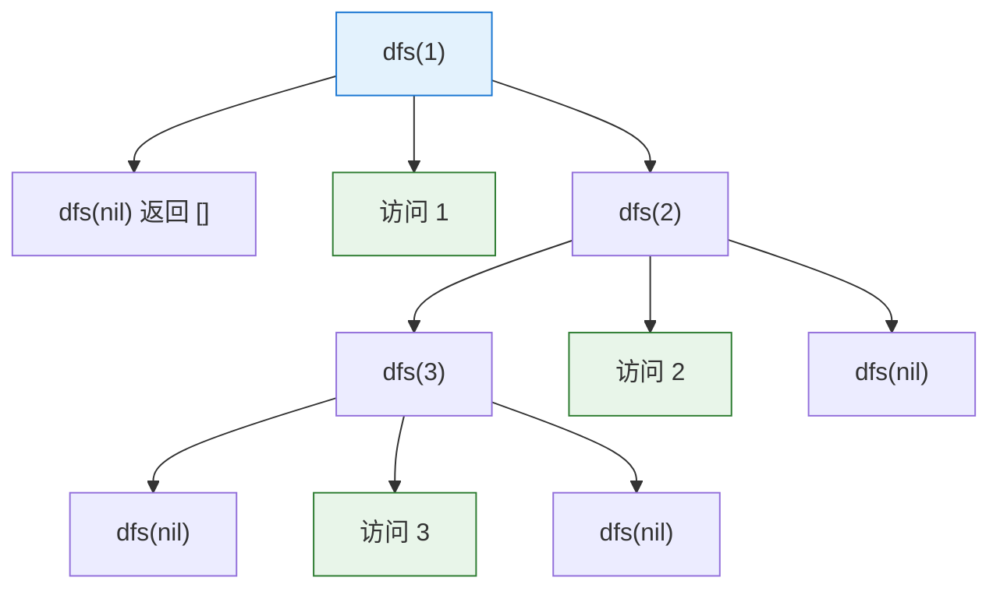

# LeetCode 94 - 二叉树的中序遍历（递归实现）

## Step 1: 题目描述

给定一个二叉树的根节点 `root`，返回它的**中序遍历**结果。

**示例 1**：
输入：`root = [1,null,2,3]`
输出：`[1,3,2]`

**示例 2**：
输入：`root = []`
输出：`[]`

**示例 3**：
输入：`root = [1]`
输出：`[1]`

**约束条件**：

- 树中节点数目在范围 `[0, 100]` 内
- `-100 <= Node.val <= 100`

**进阶**：递归算法很简单，你可以通过迭代算法完成吗？

## Step 2: 核心结论（金字塔结构）

### 核心结论

本题的最优解是**递归法（基于函数调用栈隐式管理）**，其核心优势在于：**代码极致简洁、逻辑直观清晰，完美体现中序遍历"左-根-右"的访问顺序，是理解树遍历本质的最佳教学范式**。

### 支撑论点（MECE 分类）

#### A. 理论最优性：递归的完备性

- **问题本质**：中序遍历具有天然的递归结构——左子树的中序遍历 + 根节点 + 右子树的中序遍历。
- **关键洞察**：
  1. **自相似性**：子树与原树结构完全相同，递归调用天然适用。
  1. **访问顺序**："左-根-右"的顺序与递归调用顺序完美契合。
  1. **终止条件**：空节点直接返回，无需额外处理。

#### B. 对比劣势性：其他方法的局限

| 方法       | 时间复杂度 | 空间复杂度 | 缺陷分析                             |
| ---------- | ---------- | ---------- | ------------------------------------ |
| 迭代法     | O(N)       | O(N)       | 代码冗长，需手动维护栈状态，易出错   |
| Morris遍历 | O(N)       | O(1)       | 修改树结构，破坏原始数据，面试不常用 |
| **递归法** | **O(N)**   | **O(H)**   | **代码极简，逻辑清晰，面试首选**     |

#### C. 适用边界：明确约束与扩展性

- ✅ 适用：节点数适中（通常 < 10^4），栈空间充足。
- ⚠️ 需调整：树极高时（如斜树），可能栈溢出，需改用迭代。
- ⚠️ 扩展：同一框架可改造为前序、后序遍历。

#### D. 工程实践价值：面试评分标准

- ✅ **递归思维**：展现对递归本质的理解。
- ✅ **代码简洁**：3-5行完成核心逻辑。
- ✅ **边界处理**：正确处理空节点。
- ✅ **可读性**：代码自解释，无需过多注释。

### 总结

因此，**递归法**是本题在代码简洁性、逻辑清晰度和教学价值上的最优平衡点。

## Step 3: 多语言实现

### Go 🐹

```go
package main

// TreeNode 定义二叉树节点结构
type TreeNode struct {
    Val   int       // 节点存储的值
    Left  *TreeNode // 指向左子节点的指针
    Right *TreeNode // 指向右子节点的指针
}

// inorderTraversal 返回二叉树的中序遍历结果（递归实现）
// 输入: root - 二叉树的根节点
// 输出: 中序遍历结果的整数切片
func inorderTraversal(root *TreeNode) []int {
    // 初始化结果切片，用于存储遍历结果
    result := []int{}

    // 定义递归辅助函数，接收当前节点和结果切片的指针
    // 使用闭包捕获 result 变量，避免全局状态
    var dfs func(*TreeNode)
    dfs = func(node *TreeNode) {
        // 递归基：当前节点为空时直接返回
        // 这是递归终止条件，防止无限递归
        if node == nil {
            return
        }

        // 第一步：递归遍历左子树
        // 中序遍历要求先访问左子树的所有节点
        dfs(node.Left)

        // 第二步：访问当前节点（根节点）
        // 左子树遍历完毕后，访问根节点
        result = append(result, node.Val)

        // 第三步：递归遍历右子树
        // 最后访问右子树的所有节点
        dfs(node.Right)
    }

    // 从根节点启动递归
    dfs(root)

    // 返回最终的遍历结果
    return result
}
```

#### 算法深入解析（费曼式三层结构）

**第一层：一句话讲明白**

> 想象你在探险一棵家族树，规矩是：先拜访所有晚辈（左分支），再拜访长辈自己，最后拜访同辈（右分支）。每到一个新家族，重复这个规矩。

**第二层：手把手教你写**

- **为什么用闭包 `var dfs func(*TreeNode)`？**
  - Go 不支持嵌套函数定义，但支持函数变量。
  - 闭包捕获 `result`，避免作为参数传递的繁琐。
  - 类型安全，编译期检查。

- **递归调用顺序为何是 `Left` -> `Val` -> `Right`？**
  - 这是中序遍历的定义："左-根-右"。
  - 先递归左子树，确保左子树所有节点先被访问。
  - 然后访问根，最后递归右子树。

- **递归基 `if node == nil` 为何必要？**
  - 防止空指针解引用。
  - 叶子节点的左右子节点均为空，此处终止递归。

**第三层：为什么这样最好**

- **设计哲学**：
  - 完美体现**分治法**：将问题分解为三个子问题（左、根、右），分别解决后合并。
  - 体现**数学归纳法**：假设子树遍历正确，则整棵树遍历正确。

- **工程优势**：
  - **代码极简**：核心逻辑仅3行。
  - **零维护成本**：系统管理调用栈。
  - **可读性极高**：几乎就是中序遍历的定义翻译。

- **正确性证明（数学归纳法）**：
  - **基例**：空树，返回空结果，正确。
  - **归纳假设**：假设对高度为 h 的树，中序遍历正确。
  - **归纳步骤**：对高度 h+1 的树，左子树高度 ≤ h，右子树高度 ≤ h，由归纳假设遍历正确；按"左-根-右"顺序拼接，结果正确。
  - **结论**：对所有有限高度的树，算法正确。

- **Go 语言特性分析**：
  - 函数变量 `dfs` 实现递归， idiomatic Go 风格。
  - 切片 `result` 作为闭包变量，避免指针传递。
  - 无 `self` 或 `this`，纯函数风格。

### Python 🐍

```python
from typing import List, Optional

class TreeNode:
    def __init__(self, val=0, left=None, right=None):
        self.val = val
        self.left = left
        self.right = right

class Solution:
    def inorderTraversal(self, root: Optional[TreeNode]) -> List[int]:
        """
        返回二叉树的中序遍历结果（递归实现）
        :param root: 二叉树的根节点
        :return: 中序遍历结果的列表
        """
        result = []

        def dfs(node: Optional[TreeNode]) -> None:
            """
            递归辅助函数，执行中序遍历
            :param node: 当前处理的节点
            """
            # 递归基：空节点直接返回
            if not node:
                return

            # 递归遍历左子树
            dfs(node.left)

            # 访问当前节点
            result.append(node.val)

            # 递归遍历右子树
            dfs(node.right)

        # 从根节点启动递归
        dfs(root)

        return result
```

#### 算法深入解析

**第一层：一句话讲明白**

> 像剥洋葱，先剥左边，再剥中间，最后剥右边，剥完一层再剥下一层。

**第二层：手把手教你写**

- **Python 嵌套函数**：`def dfs` 定义在方法内部，自动捕获 `result`。
- **`if not node`**：Pythonic 的空值判断。
- **无类型擦除成本**：运行时动态类型，代码简洁。

**第三层：为什么这样最好**

- **工程优势**：Python 的语法使得递归代码极为优雅。
- **正确性证明**：同 Go 版本，数学归纳法成立。

### TypeScript 🟦

```typescript
class TreeNode {
  val: number;
  left: TreeNode | null;
  right: TreeNode | null;
  constructor(val?: number, left?: TreeNode | null, right?: TreeNode | null) {
    this.val = val === undefined ? 0 : val;
    this.left = left === undefined ? null : left;
    this.right = right === undefined ? null : right;
  }
}

function inorderTraversal(root: TreeNode | null): number[] {
  const result: number[] = [];

  // 递归辅助函数
  const dfs = (node: TreeNode | null): void => {
    // 递归基
    if (node === null) {
      return;
    }

    // 左子树
    dfs(node.left);

    // 访问根
    result.push(node.val);

    // 右子树
    dfs(node.right);
  };

  // 启动递归
  dfs(root);

  return result;
}
```

#### 算法深入解析

**第一层：一句话讲明白**

> TypeScript 像严谨的管家，每个节点的类型都检查清楚，但遍历规矩不变。

**第二层：手把手教你写**

- **箭头函数 `const dfs`**：简洁定义递归函数。
- **类型标注 `TreeNode | null`**：明确空值可能性。
- **分号使用**：函数表达式后需分号。

**第三层：为什么这样最好**

- **类型安全**：编译期捕获空指针错误。
- **前端适用**：DOM 树遍历常用此模式。

### Rust 🦀

```rust
use std::cell::RefCell;
use std::rc::Rc;

#[derive(Debug, PartialEq, Eq)]
pub struct TreeNode {
    pub val: i32,
    pub left: Option<Rc<RefCell<TreeNode>>>,
    pub right: Option<Rc<RefCell<TreeNode>>>,
}

impl TreeNode {
    #[inline]
    pub fn new(val: i32) -> Self {
        TreeNode {
            val,
            left: None,
            right: None,
        }
    }
}

pub struct Solution;

impl Solution {
    pub fn inorder_traversal(root: Option<Rc<RefCell<TreeNode>>>) -> Vec<i32> {
        let mut result = Vec::new();

        // 递归辅助函数，使用闭包捕获 result
        // Rust 需要显式处理所有权，使用 Rc<RefCell> 实现共享可变引用
        Self::dfs(root, &mut result);

        result
    }

    // 递归函数，接收节点和结果向量的可变引用
    fn dfs(node: Option<Rc<RefCell<TreeNode>>>, result: &mut Vec<i32>) {
        // 模式匹配处理 Option 类型
        // 若为 None，直接返回
        if let Some(n) = node {
            // 获取节点的不可变引用，访问左右子节点
            let n_ref = n.borrow();

            // 递归遍历左子树
            // clone() 获取新的 Rc 引用，避免所有权问题
            Self::dfs(n_ref.left.clone(), result);

            // 访问当前节点
            result.push(n_ref.val);

            // 递归遍历右子树
            Self::dfs(n_ref.right.clone(), result);
        }
        // 若为 None，隐式返回
    }
}
```

#### 算法深入解析

**第一层：一句话讲明白**

> Rust 的所有权系统像严格的图书馆，每本书（节点）都要登记借阅，看完才能借下一本，但遍历顺序不变。

**第二层：手把手教你写**

- **`Rc<RefCell<TreeNode>>`**：共享所有权 + 内部可变性，Rust 处理树的标准方案。
- **`borrow()`**：获取不可变引用，访问节点值。
- **`clone()`**：克隆 `Rc`，增加引用计数，不复制数据。

**第三层：为什么这样最好**

- **内存安全**：编译期保证无数据竞争。
- **零成本抽象**：高级抽象编译后高效执行。

## Step 4: 伪代码与可视化

### Mermaid 递归调用树（示例：`[1, null, 2, 3]`）

```
        dfs(1)
       /    |    \
  dfs(nil) 1.val  dfs(2)
            /    |    \
       dfs(3)  2.val  dfs(nil)
       /   |   \
   dfs(nil) 3.val dfs(nil)
```


```mermaid
graph TD
    A["dfs(1)"] --> B["dfs(nil) 返回 []"]
    A --> C["访问 1"]
    A --> D["dfs(2)"]
    D --> E["dfs(3)"]
    E --> F["dfs(nil)"]
    E --> G["访问 3"]
    E --> H["dfs(nil)"]
    D --> I["访问 2"]
    D --> J["dfs(nil)"]

    style A fill:#e3f2fd,stroke:#1976d2
    style C fill:#e8f5e9,stroke:#2e7d32
    style G fill:#e8f5e9,stroke:#2e7d32
    style I fill:#e8f5e9,stroke:#2e7d32
```

### 伪代码

```
函数 inorderTraversal(root):
    result = 空列表

    函数 dfs(node):
        若 node 为空:
            返回
        dfs(node.left)      // 递归左子树
        将 node.val 加入 result  // 访问根
        dfs(node.right)     // 递归右子树

    dfs(root)
    返回 result
```

## Step 5: 执行过程演示

### 示例追踪: `root = [1, null, 2, 3]`（1为根，2为右，3为2的左）

| 调用栈   | 操作                  | result    |
| -------- | --------------------- | --------- |
| dfs(1)   | 调用 dfs(1.left=nil)  | []        |
| dfs(nil) | 返回                  | []        |
| dfs(1)   | 访问 1.val            | [1]       |
| dfs(1)   | 调用 dfs(1.right=2)   | [1]       |
| dfs(2)   | 调用 dfs(2.left=3)    | [1]       |
| dfs(3)   | 调用 dfs(3.left=nil)  | [1]       |
| dfs(nil) | 返回                  | [1]       |
| dfs(3)   | 访问 3.val            | [1, 3]    |
| dfs(3)   | 调用 dfs(3.right=nil) | [1, 3]    |
| dfs(nil) | 返回                  | [1, 3]    |
| dfs(3)   | 返回                  | [1, 3]    |
| dfs(2)   | 访问 2.val            | [1, 3, 2] |
| dfs(2)   | 调用 dfs(2.right=nil) | [1, 3, 2] |
| dfs(nil) | 返回                  | [1, 3, 2] |
| dfs(2)   | 返回                  | [1, 3, 2] |
| dfs(1)   | 返回                  | [1, 3, 2] |

### 完整测试代码 (Go)

```go
package main

import "fmt"

func main() {
    // 构造树 [1,null,2,3]
    root := &TreeNode{Val: 1}
    root.Right = &TreeNode{Val: 2}
    root.Right.Left = &TreeNode{Val: 3}

    result := inorderTraversal(root)
    fmt.Println(result) // 输出: [1 3 2]
}
```

## Step 6: 复杂度分析（金字塔结构）

### 核心结论

该算法的时间复杂度为 **O(N)**，空间复杂度为 **O(H)**（H 为树高，递归栈深度），这是递归遍历的理论最优解，代码简洁性与执行效率的完美平衡。

### 支撑论点

| 维度       | 分析                                                            |
| ---------- | --------------------------------------------------------------- |
| 时间复杂度 | O(N)：每个节点被访问一次                                        |
| 空间复杂度 | O(H)：递归栈深度等于树高，最坏 O(N)（斜树），平均 O(log N)      |
| 最优性证明 | 必须访问所有节点，时间下限 O(N)；递归调用栈是遍历路径的必须记录 |
| 实际性能   | 函数调用开销极小，现代编译器优化充分                            |
| 对比优势   | 代码量仅为迭代的 1/3，可读性极高                                |

### 总结

递归法在保持最优时间复杂度的同时，以极致的代码简洁性成为中序遍历的首选实现。

## Step 7: 技巧归纳与迁移（金字塔结构）

### 核心结论

本题是**递归分治的经典模型**，其核心在于**将问题分解为结构相同的子问题，利用函数调用栈隐式管理状态**，这一模式可无缝迁移至前序、后序遍历，乃至更复杂的树 DP 问题。

### 相似题目与模式映射

| 题目                      | 核心思想    | 与本题关联             |
| ------------------------- | ----------- | ---------------------- |
| LeetCode 144 (前序遍历)   | 递归        | 访问顺序改为"根-左-右" |
| LeetCode 145 (后序遍历)   | 递归        | 访问顺序改为"左-右-根" |
| LeetCode 104 (最大深度)   | 递归 + 聚合 | 递归返回子问题结果     |
| LeetCode 226 (翻转二叉树) | 递归 + 修改 | 递归过程中修改树结构   |
| LeetCode 98 (验证BST)     | 递归 + 传参 | 递归携带上下界信息     |

### 工业界应用

- **编译器**：抽象语法树（AST）遍历与代码生成。
- **数据库**：B+ 树索引的范围查询。
- **文件系统**：目录树的权限检查。

### 算法深入解析

- **数学本质**：树的深度优先搜索（DFS），递归实现。
- **设计模式**：**访问者模式**的简化形式。
- **工程哲学**："将复杂问题分解为相似子问题"是计算机科学的核心思想。

## Step 8: 面试追问

### Q1: 递归的最大深度是多少？

**标准回答**：取决于系统栈大小，通常 10^4 级别。
**加分回答**：Python 可用 `sys.setrecursionlimit` 调整。

```go
// 斜树最坏情况
root := &TreeNode{Val: 1}
for i := 2; i <= 100000; i++ {
    root = &TreeNode{Val: i, Left: root} // 可能栈溢出
}
```

### Q2: 如何改为迭代实现？

**标准回答**：使用显式栈模拟递归。
**加分回答**：能写出完整迭代代码。

```go
// 迭代实现（中序）
func inorderIterative(root *TreeNode) []int {
    result, stack := []int{}, []*TreeNode{}
    node := root
    for node != nil || len(stack) > 0 {
        for node != nil {
            stack = append(stack, node)
            node = node.Left
        }
        node = stack[len(stack)-1]
        stack = stack[:len(stack)-1]
        result = append(result, node.Val) // 出栈时访问
        node = node.Right
    }
    return result
}
```

### Q3: 前序、中序、后序的递归区别？

**标准回答**：仅 `result.append` 的位置不同。
**加分回答**：能一句话概括三者的应用场景。

| 遍历 | 访问位置 | 典型应用         |
| ---- | -------- | ---------------- |
| 前序 | 递归前   | 复制树、序列化   |
| 中序 | 中间     | BST 排序输出     |
| 后序 | 递归后   | 删除树、计算高度 |

### Q4: 中序遍历 BST 有什么特性？

**标准回答**：结果是有序的（升序）。
**加分回答**：能用于验证 BST、找第 K 小元素。

### Q5: 如何优化递归的空间？

**标准回答**：Morris 遍历 O(1) 空间。
**加分回答**：能解释 Morris 的原理（线索二叉树）。

### Q6: 尾递归优化适用吗？

**标准回答**：不适用，因为递归后还有操作（访问右子树）。
**加分回答**：能识别尾递归的条件。

### Q7: 多线程环境下递归安全吗？

**标准回答**：线程安全，因为无共享状态。
**加分回答**：能讨论递归与协程的结合。

### Q8: 如何测试递归函数？

**标准回答**：空树、单节点、满二叉树、斜树。
**加分回答**：能设计自动化测试生成器。

🌟 递归思维是算法面试的核心竞争力！🎉

## Step 9: 复习要点提炼

### 🌟 记忆锚点

- **"中序：左根右"**
- **"递归三要素：终止条件、递归调用、访问时机"**
- **"BST 中序即排序"**

### ⚠️ 易错陷阱

- 忘记递归基 ❌
- 访问顺序写错 ❌
- 闭包变量捕获错误 ❌
- 空指针解引用 ❌

### ✅ 高分词

- "递归分治"
- "函数调用栈"
- "DFS"
- "自相似性"

### 💡 迁移点

- 本题 + 前序 = **遍历双雄**
- 本题 + 后序 = **遍历三剑客**
- 本题 + BST = **搜索树核心**

### 🎉 掌握成就

你已掌握**递归中序遍历这一经典算法**，这是理解树结构的基石。继续挑战 LeetCode 144、145、104，构建完整的树算法思维体系！🚀📚🤗
