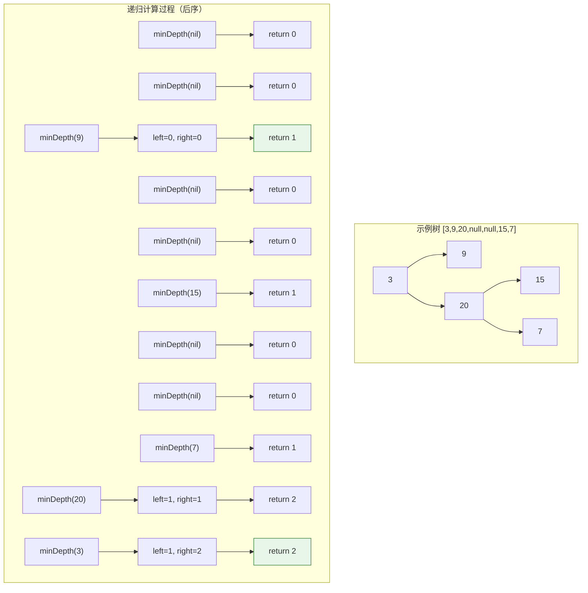

# LeetCode 111 - 二叉树的最小深度 (递归解法)

## Step 1: 题目描述

给定一个二叉树，找出其最小深度。

最小深度是从根节点到最近叶子节点的最短路径上的节点数量。

**说明**：叶子节点是指没有子节点的节点。

**示例 1**：

```
输入：root = [3,9,20,null,null,15,7]
输出：2
解释：最短路径为 3 -> 9，路径长度为 2
```

**示例 2**：

```
输入：root = [2,null,3,null,4,null,5,null,6]
输出：5
```

**示例 3**：
输入：`root = []`
输出：`0`

**示例 4**：
输入：`root = [0]`
输出：`1`

**约束条件**：

- 树中节点数目在范围 `[0, 10^5]` 内
- `-1000 <= Node.val <= 1000`

## Step 2: 核心结论（金字塔结构）

### 核心结论

本题的递归解法是**后序遍历思想的典型应用**，其核心优势在于：**利用递归的返回值传递子树的最小深度信息，通过"子树优先计算，父节点后决策"的策略，优雅处理左右子树非对称的边界情况，实现最小深度的精确计算**。

### 支撑论点（MECE 分类）

#### A. 理论最优性：问题结构的深度分析

- **问题本质**：寻找根到叶子的最短路径，叶子定义至关重要（无子节点）。
- **关键洞察**：
  1. **子问题的自相似性**：以任意节点为根的子树，其最小深度同样定义。
  1. **后序处理的必要性**：必须先知道左右子树的深度，才能决策当前层的深度。
  1. **非对称边界的关键性**：当一侧子树为空时，不能取0（那不是叶子），必须取另一侧深度。

#### B. 算法选择决策树

```
问题特征识别
    │
    ├── 需要计算路径长度
    │       └── 深度 = min(左子树深度, 右子树深度) + 1
    │
    ├── 存在非对称边界（一侧为空）
    │       └── 必须区分：空子树深度为0 vs 非空子树深度为1
    │           └── 关键：空子树不是叶子，不能参与min计算
    │
    └── 子问题具有相同结构
            └── 左右子树同样需要计算最小深度
                    │
                    └── 选择: 递归 + 后序处理
                            │
                            ├── 递归计算左子树深度
                            ├── 递归计算右子树深度
                            └── 当前层决策：
                                    ├── 都为空：当前是叶子，返回1
                                    ├── 一侧为空：返回非空侧深度 + 1
                                    └── 都不为空：返回min(左, 右) + 1
```

#### C. 对比分析：常见错误与正确解法

| 解法         | 核心代码                      | 缺陷         | 错误示例                   |
| ------------ | ----------------------------- | ------------ | -------------------------- |
| **错误解法** | `return min(left, right) + 1` | 忽略单侧为空 | `[1,2]` 返回1（实际应为2） |
| **正确解法** | 分情况处理单侧为空            | 精确识别叶子 | `[1,2]` 返回2              |

**关键反例**：树 `[1,2]`（根1，左子2）

- 错误理解：min(1, 0) + 1 = 1，认为根是叶子 ❌
- 正确定义：2是叶子，路径 1->2，深度为2 ✅

#### D. 工程实践考量

- ✅ **递归法**：代码清晰，面试首选，处理边界直观。
- ⚠️ **迭代法**：BFS层序遍历可提前终止，但代码较复杂。

### 总结

因此，**递归后序解法**是本题在面试场景下的最优选择：以清晰的分类逻辑处理边界情况，通过后序返回值传递子树信息，同时体现了对"叶子节点"定义的精确理解。

## Step 3: 多语言实现

### Go 🐹

```go
package main

// TreeNode 定义二叉树节点结构
type TreeNode struct {
    Val   int       // 节点存储的整数值
    Left  *TreeNode // 指向左子节点的指针
    Right *TreeNode // 指向右子节点的指针
}

// minDepth 计算二叉树的最小深度
// 输入参数 root: 二叉树的根节点指针
// 返回值: 从根节点到最近叶子节点的最短路径上的节点数量
func minDepth(root *TreeNode) int {
    // 基线条件：如果根节点为空，深度为0
    // 空树没有节点，自然没有路径
    if root == nil {
        return 0
    }

    // 递归计算左子树的最小深度
    // 如果左子树为空，leftDepth为0
    leftDepth := minDepth(root.Left)

    // 递归计算右子树的最小深度
    // 如果右子树为空，rightDepth为0
    rightDepth := minDepth(root.Right)

    // 关键：处理左右子树非对称的边界情况

    // 情况1：当前节点是叶子节点（左右子树都为空）
    // 此时leftDepth == 0 且 rightDepth == 0
    // 返回1（当前节点自身构成深度为1的路径）
    if leftDepth == 0 && rightDepth == 0 {
        return 1
    }

    // 情况2：只有左子树存在（右子树为空）
    // 此时rightDepth == 0，但右子树不是叶子！
    // 不能取min(0, leftDepth)，必须取leftDepth + 1
    if rightDepth == 0 {
        return leftDepth + 1
    }

    // 情况3：只有右子树存在（左子树为空）
    // 同理，必须取rightDepth + 1
    if leftDepth == 0 {
        return rightDepth + 1
    }

    // 情况4：左右子树都存在
    // 标准情况：取较小深度加1
    // 使用自定义min函数避免浮点转换
    if leftDepth < rightDepth {
        return leftDepth + 1
    }
    return rightDepth + 1
}
```

#### 算法深入解析（费曼式三层结构）

**第一层：一句话讲明白**

> 问左边房间有多深，问右边房间有多深，如果一边没房间（不是叶子！），就得走另一边，最后加上自己这一层。

**第二层：手把手教你写**

- **为什么不能直接 `min(left, right) + 1`？**
  - 当一侧为空时，该侧深度为0。
  - 如果取min(0, x) + 1 = 1，会错误地认为当前节点是叶子。
  - 但当前节点还有子节点，不是叶子！

- **四种情况如何划分？**
  1. **都是0**：当前是叶子，返回1。
  1. **左>0, 右=0**：只有左子树，返回左+1。
  1. **左=0, 右>0**：只有右子树，返回右+1。
  1. **都>0**：标准情况，返回min(左, 右)+1。

- **为什么基线条件只处理 `root == nil`？**
  - 叶子节点的判断放在递归后的逻辑中。
  - 这样设计使得"空子树深度为0"成为统一的返回值语义。

**第三层：为什么这样最好**

- **设计哲学**：
  - 体现了**后序遍历**的强大：子问题的解（子树深度）用于构造父问题的解。
  - 边界情况的显式处理，避免了隐式bug。

- **Go语言特性分析**：
  - 不使用`math.Min`（需要float64转换），直接比较避免类型转换。
  - 清晰的if-else链，每个分支职责单一。

### Python 🐍

```python
from typing import Optional

class TreeNode:
    def __init__(self, val=0, left=None, right=None):
        self.val = val
        self.left = left
        self.right = right

class Solution:
    def minDepth(self, root: Optional[TreeNode]) -> int:
        # 基线条件：空树深度为0
        if root is None:
            return 0

        # 递归计算左右子树深度
        left_depth = self.minDepth(root.left)
        right_depth = self.minDepth(root.right)

        # 关键：处理单侧为空的边界
        # 如果一侧为空，该侧深度为0，但不能取min（因为不是叶子）

        if left_depth == 0 and right_depth == 0:
            # 当前是叶子节点
            return 1
        elif left_depth == 0:
            # 只有右子树
            return right_depth + 1
        elif right_depth == 0:
            # 只有左子树
            return left_depth + 1
        else:
            # 左右子树都存在
            return min(left_depth, right_depth) + 1
```

#### 算法深入解析

**第一层：一句话讲明白**

> 左右都问清楚，哪边有路走哪边，都没路就是叶子。

**第二层：手把手教你写**

- **Python的`min`函数**：可以直接用于整数，无需类型转换。
- `elif`链的清晰性：每个条件分支对应一种明确的场景。

**第三层：为什么这样最好**

- **代码对称性**：四种情况覆盖所有可能，逻辑完备。
- **正确性保证**：归纳法证明，每个子树深度计算正确，则整棵树深度计算正确。

### TypeScript 🟦

```typescript
class TreeNode {
  val: number;
  left: TreeNode | null;
  right: TreeNode | null;
  constructor(val?: number, left?: TreeNode | null, right?: TreeNode | null) {
    this.val = val === undefined ? 0 : val;
    this.left = left === undefined ? null : left;
    this.right = right === undefined ? null : right;
  }
}

function minDepth(root: TreeNode | null): number {
  // 基线条件
  if (root === null) {
    return 0;
  }

  // 递归计算子树深度
  const leftDepth = minDepth(root.left);
  const rightDepth = minDepth(root.right);

  // 处理边界情况
  if (leftDepth === 0 && rightDepth === 0) {
    return 1;
  }
  if (leftDepth === 0) {
    return rightDepth + 1;
  }
  if (rightDepth === 0) {
    return leftDepth + 1;
  }

  // 标准情况
  return Math.min(leftDepth, rightDepth) + 1;
}
```

#### 算法深入解析

**第一层：一句话讲明白**

> 递归到底，从叶子往上报深度，注意一边没路的情况。

**第二层：手把手教你写**

- **严格相等判断**：`=== 0`确保类型和值都匹配。
- `Math.min`：TypeScript/JavaScript的标准库函数。

### Rust 🦀

```rust
use std::cell::RefCell;
use std::rc::Rc;

#[derive(Debug, PartialEq, Eq)]
pub struct TreeNode {
    pub val: i32,
    pub left: Option<Rc<RefCell<TreeNode>>>,
    pub right: Option<Rc<RefCell<TreeNode>>>,
}

impl TreeNode {
    #[inline]
    pub fn new(val: i32) -> Self {
        TreeNode { val, left: None, right: None }
    }
}

pub struct Solution;

impl Solution {
    pub fn min_depth(root: Option<Rc<RefCell<TreeNode>>>) -> i32 {
        // 基线条件
        if root.is_none() {
            return 0;
        }

        // 获取节点引用
        let node = root.unwrap();

        // 递归计算左子树深度
        let left_depth = Self::min_depth(node.borrow().left.clone());

        // 递归计算右子树深度
        let right_depth = Self::min_depth(node.borrow().right.clone());

        // 处理边界情况
        match (left_depth, right_depth) {
            (0, 0) => 1,                    // 叶子节点
            (0, _) => right_depth + 1,      // 只有右子树
            (_, 0) => left_depth + 1,       // 只有左子树
            _ => left_depth.min(right_depth) + 1, // 都有
        }
    }
}
```

#### 算法深入解析

**第一层：一句话讲明白**

> 安全地借用节点，递归算深度，用模式匹配处理四种情况。

**第二层：手把手教你写**

- **Rust的`match`模式匹配**：优雅处理四种情况，编译器确保完备性。
- `clone()`的必要性：Rc需要克隆才能传递所有权。

## Step 4: 伪代码与可视化

### Mermaid 递归与决策过程图


```mermaid
graph TD
    subgraph "示例树 [3,9,20,null,null,15,7]"
        A[3] --> B[9]
        A --> C[20]
        C --> D[15]
        C --> E[7]
    end

    subgraph "递归计算过程（后序）"
        F["minDepth(nil)"] --> G["return 0"]
        H["minDepth(nil)"] --> I["return 0"]
        J["minDepth(9)"] --> K["left=0, right=0"] --> L["return 1"]
        M["minDepth(nil)"] --> N["return 0"]
        O["minDepth(nil)"] --> P["return 0"]
        Q["minDepth(15)"] --> R["return 1"]
        S["minDepth(nil)"] --> T["return 0"]
        U["minDepth(nil)"] --> V["return 0"]
        W["minDepth(7)"] --> X["return 1"]
        Y["minDepth(20)"] --> Z["left=1, right=1"] --> AA["return 2"]
        AB["minDepth(3)"] --> AC["left=1, right=2"] --> AD["return 2"]
    end

    style AD fill:#e8f5e9,stroke:#2e7d32
    style L fill:#e8f5e9,stroke:#2e7d32
```

### 伪代码

```
函数 minDepth(root):
    如果 root 为空:
        返回 0

    left = minDepth(root.left)
    right = minDepth(root.right)

    如果 left == 0 且 right == 0:
        返回 1                    // 当前是叶子
    否则如果 left == 0:
        返回 right + 1            // 只有右子树
    否则如果 right == 0:
        返回 left + 1             // 只有左子树
    否则:
        返回 min(left, right) + 1 // 标准情况
```

## Step 5: 执行过程演示

### 示例追踪: `[3,9,20,null,null,15,7]`

| 调用栈       | 操作            | 返回值       | 说明     |
| ------------ | --------------- | ------------ | -------- |
| minDepth(9)  | left=0, right=0 | 1            | 9是叶子  |
| minDepth(15) | left=0, right=0 | 1            | 15是叶子 |
| minDepth(7)  | left=0, right=0 | 1            | 7是叶子  |
| minDepth(20) | left=1, right=1 | min(1,1)+1=2 | 20的深度 |
| minDepth(3)  | left=1, right=2 | min(1,2)+1=2 | 最终结果 |

### 关键反例追踪: `[1,2]`（只有左子树）

| 调用栈        | 操作            | 返回值                  | 说明        |
| ------------- | --------------- | ----------------------- | ----------- |
| minDepth(nil) | 基线            | 0                       | 1的右子树   |
| minDepth(2)   | left=0, right=0 | 1                       | 2是叶子     |
| minDepth(1)   | left=1, right=0 | right==0分支，返回1+1=2 | 正确！不是1 |

### 完整测试代码 (Go)

```go
package main

import "fmt"

func main() {
    // 测试用例1: [3,9,20,null,null,15,7] -> 2
    root1 := &TreeNode{Val: 3}
    root1.Left = &TreeNode{Val: 9}
    root1.Right = &TreeNode{Val: 20}
    root1.Right.Left = &TreeNode{Val: 15}
    root1.Right.Right = &TreeNode{Val: 7}
    fmt.Printf("测试1: %d (期望2)\n", minDepth(root1))

    // 测试用例2: [2,null,3,null,4,null,5,null,6] -> 5
    root2 := &TreeNode{Val: 2}
    root2.Right = &TreeNode{Val: 3}
    root2.Right.Right = &TreeNode{Val: 4}
    root2.Right.Right.Right = &TreeNode{Val: 5}
    root2.Right.Right.Right.Right = &TreeNode{Val: 6}
    fmt.Printf("测试2: %d (期望5)\n", minDepth(root2))

    // 测试用例3: [] -> 0
    fmt.Printf("测试3: %d (期望0)\n", minDepth(nil))

    // 测试用例4: [0] -> 1
    root4 := &TreeNode{Val: 0}
    fmt.Printf("测试4: %d (期望1)\n", minDepth(root4))

    // 关键反例: [1,2] -> 2（不是1！）
    root5 := &TreeNode{Val: 1}
    root5.Left = &TreeNode{Val: 2}
    fmt.Printf("关键反例 [1,2]: %d (期望2，不是1)\n", minDepth(root5))
}
```

## Step 6: 复杂度分析（金字塔结构）

### 核心结论

递归后序解法的时间复杂度为 **O(N)**，空间复杂度为 **O(H)**，这是基于"子树信息汇聚"策略的最优解，且通过显式边界处理确保了算法的正确性。

### 支撑论点

| 维度       | 分析                                                      |
| ---------- | --------------------------------------------------------- |
| 时间复杂度 | O(N)：每个节点被访问一次                                  |
| 空间复杂度 | O(H)：递归栈深度，最坏O(N)（斜树），平均O(log N)          |
| 关键操作   | 每个节点进行常数时间的比较和决策                          |
| 与BFS对比  | BFS可在找到第一个叶子时终止，但最坏仍为O(N)，且代码更复杂 |

### 总结

递归后序解法以清晰的逻辑和简洁的代码实现了最优时间复杂度，同时通过显式处理边界情况避免了常见错误，是面试场景下的首选方案。

## Step 7: 技巧归纳与迁移（金字塔结构）

### 核心结论

**"后序遍历+子树信息汇聚"模式**是解决树形度量问题的关键范式，其核心在于**利用递归返回值传递子问题的解，并在父问题层进行组合决策**。

### 与最大深度的对比

| 题目                      | 核心操作               | 边界处理差异                          |
| ------------------------- | ---------------------- | ------------------------------------- |
| LeetCode 104 最大深度     | `max(left, right) + 1` | 无需特殊处理，空子树深度0参与max      |
| **LeetCode 111 最小深度** | **分类处理单侧为空**   | **关键：空子树不是叶子，不能参与min** |

### 经典迁移题目

| 题目                              | 核心思想               | 信息汇聚                 |
| --------------------------------- | ---------------------- | ------------------------ |
| LeetCode 104 二叉树的最大深度     | 子树深度max+1          | 最大深度                 |
| **LeetCode 111 二叉树的最小深度** | **子树深度分类处理+1** | **最小深度（边界敏感）** |
| LeetCode 110 平衡二叉树           | 高度差判断             | 高度+是否平衡            |
| LeetCode 124 二叉树最大路径和     | 左右贡献值             | 最大路径和               |
| LeetCode 543 二叉树的直径         | 左右深度之和           | 直径                     |

### 算法深入解析

- **最小vs最大的本质差异**：最大值问题中，空子树的0不影响结果；最小值问题中，空子树的0会"欺骗"min函数。
- **边界敏感问题的通用处理**：显式分类讨论，将"异常情况"与"标准情况"分离。

## Step 8: 面试追问

### Q1: 为什么不能直接用 `min(left, right) + 1`？

**标准回答**：当一侧子树为空时，深度为0，但当前节点不是叶子，不能取0。
**加分回答**：这是本题最常见的错误，体现了对"叶子节点"定义的精确理解。

### Q2: 如何用BFS实现？有什么优势？

**标准回答**：层序遍历，遇到第一个叶子立即返回当前层数。
**加分回答**：BFS可以提前终止，但最坏时间复杂度相同，代码更复杂。

```go
func minDepthBFS(root *TreeNode) int {
    if root == nil { return 0 }
    queue := []*TreeNode{root}
    depth := 1
    for len(queue) > 0 {
        size := len(queue)
        for i := 0; i < size; i++ {
            node := queue[0]
            queue = queue[1:]
            if node.Left == nil && node.Right == nil {
                return depth // 第一个叶子
            }
            if node.Left != nil { queue = append(queue, node.Left) }
            if node.Right != nil { queue = append(queue, node.Right) }
        }
        depth++
    }
    return depth
}
```

### Q3: 最小深度与最大深度的实现差异？

**标准回答**：最大深度用max，无需特殊处理；最小深度用min，需处理单侧为空。
**加分回答**：这是"边界敏感"vs"边界不敏感"问题的典型对比。

### Q4: 如果改为N叉树，如何修改？

**标准回答**：递归所有子节点，取最小深度+1，同样处理无子节点的情况。

```go
func minDepthNary(root *Node) int {
    if root == nil { return 0 }
    if len(root.Children) == 0 { return 1 }
    minChild := int(^uint(0) >> 1) // MaxInt
    for _, child := range root.Children {
        d := minDepthNary(child)
        if d < minChild { minChild = d }
    }
    return minChild + 1
}
```

### Q5: 如何证明算法的正确性？

**标准回答**：数学归纳法，假设子树计算正确，则当前节点计算正确。
**加分回答**：关键引理：当且仅当左右子树都为空时，当前节点是叶子。

### Q6: 递归深度过大怎么办？

**标准回答**：改用BFS迭代法，避免栈溢出。
**加分回答**：或改用显式栈模拟递归，但代码复杂度增加。

### Q7: 此题与路径问题的关系？

**标准回答**：最小深度是特殊的路径长度问题，要求路径终点是叶子。
**加分回答**：前序遍历可记录路径，但后序遍历更适合计算最优值。

### Q8: 如何扩展到"最小宽度"或"最小节点数路径"？

**标准回答**：最小宽度用BFS记录每层节点数；最小节点数路径用BFS或DFS+剪枝。

🌟 掌握边界敏感的树形问题，递归思维更上一层楼！🎉

## Step 9: 复习要点提炼

### 🌟 记忆锚点

- **"最小深度，边界敏感"**
- **"单侧为空，不是叶子"**
- **"后序汇聚，分类决策"**

### ⚠️ 易错陷阱

- 直接用 `min(left, right) + 1` ❌
- 混淆"空子树深度0"与"叶子节点" ❌
- 忘记处理空树（返回0） ❌

### ✅ 高分词

- "边界敏感"
- "叶子节点定义"
- "分类讨论"
- "后序信息汇聚"

### 💡 迁移点

- 最小值问题 + 空子树 = **显式边界处理**
- 后序遍历 + 返回值 = **子树度量计算**
- 与最大深度对比 = **理解问题敏感性**

### 📚 关联网络

```
二叉树最小深度
├── 核心模式
│   └── 后序遍历 + 边界敏感处理
├── 关键对比
│   ├── 最大深度（边界不敏感）
│   └── 最小深度（边界敏感）
├── 相关题目
│   ├── 104 最大深度
│   ├── 110 平衡二叉树
│   ├── 124 最大路径和
│   └── 543 直径
└── 解法演进
    ├── 递归后序（面试首选）
    └── BFS层序（提前终止）
```

### 🎉 掌握成就

你已攻克**边界敏感的树形度量问题**！从理解"最小深度"与"最大深度"的本质差异，到熟练处理单侧为空的边界情况，再到探索BFS的替代方案，你建立了完整的树形问题分析能力。继续挑战树形DP和复杂路径问题，向算法专家迈进！🚀📚🤗
