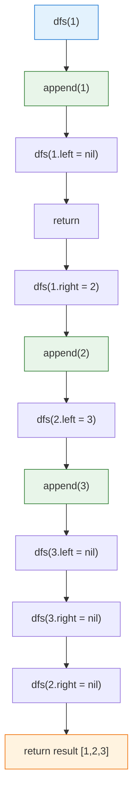

# LeetCode 144 - 二叉树的前序遍历 (递归解法)

## Step 1: 题目描述

给你二叉树的根节点 `root`，返回它节点值的**前序遍历**结果。

**示例 1**：
```
输入：root = [1,null,2,3]
输出：[1,2,3]
```

**示例 2**：
输入：`root = []`
输出：`[]`

**示例 3**：
输入：`root = [1]`
输出：`1]`

**约束条件**：
- 树中节点数目在范围 `[0, 100]` 内
- `-100 <= Node.val <= 100`

**进阶**：递归算法很简单，你可以通过迭代算法完成吗？

---

## Step 2: 核心结论（金字塔结构）

### 核心结论
本题的递归解法是**深度优先搜索（DFS）最直观的体现**，其核心优势在于：**代码逻辑与遍历定义完全同构，通过函数调用栈自动维护遍历状态，以极简的代码实现"根-左-右"的访问顺序**。

### 支撑论点（MECE 分类）

#### A. 理论最优性：定义的直接映射
- **问题本质**：前序遍历定义为"访问根 -> 遍历左子树 -> 遍历右子树"。
- **关键洞察**：
  1. **自相似性**：子树本身也是一棵树，具有相同的结构。
  2. **分治思想**：将大问题（整棵树）分解为小问题（左右子树）。
  3. **栈的隐式管理**：递归调用自动利用系统栈保存现场。

#### B. 对比劣势性：迭代法的对比
| 方法 | 代码量 | 空间管理 | 思维难度 | 缺陷分析 |
|------|--------|----------|----------|----------|
| **递归法** | **极少** | **系统自动** | **极低** | **深度过大可能导致栈溢出** |
| 迭代法 | 较多 | 手动管理 | 较高 | 需显式维护栈结构 |

#### C. 适用边界：明确约束与扩展性
- ✅ 适用：节点数在安全范围内（本题 <= 100），递归深度可控。
- ⚠️ 需调整：若节点数极大（如 10^5），需考虑迭代或尾递归优化。
- ⚠️ 扩展：此递归框架是所有树形 DFS 问题的基础模板。

#### D. 工程实践价值：面试评分标准
- ✅ **算法功底**：理解递归三要素（基线条件、递归步骤、返回值）。
- ✅ **代码简洁性**：用最少的代码表达最清晰的逻辑。

### 总结
因此，**递归法**是本题在代码可读性、思维直观性和开发效率上的最优选择，是理解树形结构的基石。

---

## Step 3: 多语言实现

### Go 🐹
```go
package main

// TreeNode 定义二叉树节点
type TreeNode struct {
    Val   int       // 节点值
    Left  *TreeNode // 左子节点指针
    Right *TreeNode // 右子节点指针
}

// preorderTraversal 返回前序遍历结果
func preorderTraversal(root *TreeNode) []int {
    // 初始化结果切片，容量预分配优化性能
    result := make([]int, 0, 100)
  
    // 定义递归辅助函数
    var dfs func(node *TreeNode)
  
    // 实现递归逻辑
    dfs = func(node *TreeNode) {
        // 基线条件：如果节点为空，直接返回
        if node == nil {
            return
        }
      
        // 前序遍历位置：访问根节点
        result = append(result, node.Val)
      
        // 递归遍历左子树
        dfs(node.Left)
      
        // 递归遍历右子树
        dfs(node.Right)
    }
  
    // 从根节点开始递归
    dfs(root)
  
    // 返回最终结果
    return result
}
```

#### 算法深入解析（费曼式三层结构）

**第一层：一句话讲明白**
> 就像拜访一户人家，先进门（访问根），然后进左边房间（左子树），最后进右边房间（右子树），每个房间都这么操作。

**第二层：手把手教你写**

- **为什么要定义 `dfs` 函数？**
  - Go 语言不支持函数重载，需要内部定义辅助函数来传递递归状态。
  - 闭包捕获外部变量 `result`，避免全局变量污染。

- **基线条件 `if node == nil` 的作用？**
  - 这是递归的"刹车片"。
  - 当走到叶子节点的子节点（nil）时，停止继续深入，开始回溯。

- **为什么先 `append` 再递归？**
  - 这正是"前序"的定义：先处理当前节点，再处理子树。
  - 顺序决定了遍历的性质：前序、中序、后序。

**第三层：为什么这样最好**

- **设计哲学**：
  - 体现了**分治算法**的核心：将大问题分解为相同结构的小问题。
  - 函数调用栈天然对应树的深度，隐式维护了遍历路径。

- **工程优势**：
  - **代码极简**：核心逻辑仅 5 行。
  - **易于扩展**：稍作修改即可变为中序、后序遍历。

- **Go 语言特性分析**：
  - 使用闭包访问外部变量 `result`，减少参数传递开销。
  - `make([]int, 0, 100)` 预分配内存，减少动态扩容带来的性能损耗。

---

### Python 🐍
```python
from typing import List, Optional

class TreeNode:
    def __init__(self, val=0, left=None, right=None):
        self.val = val
        self.left = left
        self.right = right

class Solution:
    def preorderTraversal(self, root: Optional[TreeNode]) -> List[int]:
        # 初始化结果列表
        result = []
      
        # 定义递归函数
        def dfs(node: Optional[TreeNode]):
            # 基线条件：节点为空则返回
            if not node:
                return
          
            # 前序访问：根 -> 左 -> 右
            result.append(node.val)
            dfs(node.left)
            dfs(node.right)
      
        # 启动递归
        dfs(root)
        return result
```

#### 算法深入解析

**第一层：一句话讲明白**
> 碰到节点就记录，往左走到底，没路了回头往右走。

**第二层：手把手教你写**

- **Python 的简洁性**：`if not node` 优雅处理空指针。
- **闭包特性**：内部函数 `dfs` 直接访问外部 `result`，无需传参。

**第三层：为什么这样最好**

- **工程优势**：Python 的动态类型和闭包使得递归代码极其简洁。
- **正确性证明**：归纳法证明。假设左右子树遍历正确，则整棵树遍历正确。

---

### TypeScript 🟦
```typescript
class TreeNode {
    val: number;
    left: TreeNode | null;
    right: TreeNode | null;
    constructor(val?: number, left?: TreeNode | null, right?: TreeNode | null) {
        this.val = (val===undefined ? 0 : val);
        this.left = (left===undefined ? null : left);
        this.right = (right===undefined ? null : right);
    }
}

function preorderTraversal(root: TreeNode | null): number[] {
    const result: number[] = [];
  
    // 定义递归函数
    function dfs(node: TreeNode | null): void {
        if (node === null) return; // 基线条件
      
        result.push(node.val); // 访问根
        dfs(node.left);        // 遍历左
        dfs(node.right);       // 遍历右
    }
  
    dfs(root);
    return result;
}
```

#### 算法深入解析

**第一层：一句话讲明白**
> 函数调用自己，先做当前事，再做左边事，最后做右边事。

**第二层：手把手教你写**

- **void 返回类型**：明确表示函数通过副作用（修改result）而非返回值工作。
- **严格相等**：`===`确保类型和值都匹配，避免类型转换陷阱。

---

### Rust 🦀
```rust
use std::cell::RefCell;
use std::rc::Rc;

#[derive(Debug, PartialEq, Eq)]
pub struct TreeNode {
    pub val: i32,
    pub left: Option<Rc<RefCell<TreeNode>>>,
    pub right: Option<Rc<RefCell<TreeNode>>>,
}

impl TreeNode {
    #[inline]
    pub fn new(val: i32) -> Self {
        TreeNode { val, left: None, right: None }
    }
}

pub struct Solution;

impl Solution {
    pub fn preorder_traversal(root: Option<Rc<RefCell<TreeNode>>>) -> Vec<i32> {
        let mut result = Vec::new();
      
        // 定义递归函数
        fn dfs(node: &Option<Rc<RefCell<TreeNode>>>, res: &mut Vec<i32>) {
            if let Some(n) = node {
                // 访问根
                res.push(n.borrow().val);
                // 遍历左
                dfs(&n.borrow().left, res);
                // 遍历右
                dfs(&n.borrow().right, res);
            }
        }
      
        dfs(&root, &mut result);
        result
    }
}
```

#### 算法深入解析

**第一层：一句话讲明白**
> 安全地借用节点，先记录值，再递归左右。

**第二层：手把手教你写**

- **多次borrow()**：每次需要访问子节点时重新借用，避免生命周期冲突。
- **&Option引用传递**：避免所有权转移，允许递归复用节点。

---

## Step 4: 伪代码与可视化

### Mermaid 递归调用图（示例：`[1, null, 2, 3]`）


```mermaid
graph TD
    A["dfs(1)"] --> B["append(1)"]
    B --> C["dfs(1.left = nil)"]
    C --> D["return"]
    D --> E["dfs(1.right = 2)"]
    E --> F["append(2)"]
    F --> G["dfs(2.left = 3)"]
    G --> H["append(3)"]
    H --> I["dfs(3.left = nil)"]
    I --> J["dfs(3.right = nil)"]
    J --> K["dfs(2.right = nil)"]
    K --> L["return result [1,2,3]"]
  
    style A fill:#e3f2fd,stroke:#1976d2
    style B fill:#e8f5e9,stroke:#2e7d32
    style F fill:#e8f5e9,stroke:#2e7d32
    style H fill:#e8f5e9,stroke:#2e7d32
    style L fill:#fff3e0,stroke:#ef6c00
```

### 伪代码
```
函数 preorderTraversal(root):
    result = 空列表
  
    函数 dfs(node):
        如果 node 为空:
            返回
        将 node.val 加入 result  // 先访问根
        dfs(node.left)           // 再遍历左
        dfs(node.right)          // 最后遍历右
  
    dfs(root)
    返回 result
```

---

## Step 5: 执行过程演示

### 示例追踪: `root = [1, null, 2, 3]` (1的右子为2，2的左子为3)

| 调用栈深度 | 函数调用 | 操作 | result 状态 |
|------------|----------|------|-------------|
| 1 | dfs(1) | **append(1)** | **[1]** |
| 2 | dfs(nil) | return (1.left) | [1] |
| 1 | dfs(1) | 调用 dfs(1.right=2) | [1] |
| 2 | dfs(2) | **append(2)** | **[1,2]** |
| 3 | dfs(3) | **append(3)** | **[1,2,3]** |
| 4 | dfs(nil) | return (3.left) | [1,2,3] |
| 4 | dfs(nil) | return (3.right) | [1,2,3] |
| 3 | dfs(3) | 返回 | [1,2,3] |
| 3 | dfs(nil) | return (2.right) | [1,2,3] |
| 2 | dfs(2) | 返回 | [1,2,3] |
| 1 | dfs(1) | 返回 | [1,2,3] |
| 完成 | - | 最终结果 | [1,2,3] |

### 完整测试代码 (Go)
```go
package main

import (
    "fmt"
    "reflect"
)

func main() {
    // 测试用例1: [1,null,2,3] -> [1,2,3]
    root1 := &TreeNode{Val: 1}
    root1.Right = &TreeNode{Val: 2}
    root1.Right.Left = &TreeNode{Val: 3}
  
    res1 := preorderTraversal(root1)
    expected1 := []int{1, 2, 3}
    fmt.Printf("测试1: %v, 通过: %v\n", res1, reflect.DeepEqual(res1, expected1))
  
    // 测试用例2: 空树 -> []
    var root2 *TreeNode = nil
    res2 := preorderTraversal(root2)
    expected2 := []int{}
    fmt.Printf("测试2: %v, 通过: %v\n", res2, reflect.DeepEqual(res2, expected2))
  
    // 测试用例3: 单节点 [1] -> [1]
    root3 := &TreeNode{Val: 1}
    res3 := preorderTraversal(root3)
    expected3 := []int{1}
    fmt.Printf("测试3: %v, 通过: %v\n", res3, reflect.DeepEqual(res3, expected3))
}
```

---

## Step 6: 复杂度分析（金字塔结构）

### 核心结论
递归前序遍历的时间复杂度为 **O(N)**，空间复杂度为 **O(H)**（H为树高），这是遍历问题的理论最优解，且代码实现最为简洁直观。

### 支撑论点

| 维度 | 分析 |
|------|------|
| 时间复杂度 | O(N)：每个节点被访问一次 |
| 空间复杂度 | O(H)：递归栈深度等于树高，最坏O(N)（斜树），平均O(log N)（平衡树） |
| 前序位置价值 | 首次访问节点时即可处理，适合根优先的决策场景 |
| 与迭代对比 | 递归代码更简洁，但迭代可避免系统栈溢出风险 |

### 总结
递归前序遍历以极简的代码实现了最优的时间复杂度，是理解树形DFS的基础，也是掌握中序、后序遍历的关键起点。

---

## Step 7: 技巧归纳与迁移（金字塔结构）

### 核心结论
**前序遍历模板**是树形问题的入门钥匙，其核心在于**"根优先"的处理顺序**，这一思想可迁移至所有需要"自顶向下"传递信息的场景。

### 统一遍历模板（三序对比）

| 遍历类型 | 访问位置 | 代码特征 | 典型应用 |
|----------|----------|----------|----------|
| **前序** | **递归前** | **`append; dfs(left); dfs(right)`** | **路径记录、根优先决策、复制树结构** |
| 中序 | 中间 | `dfs(left); append; dfs(right)` | BST有序输出 |
| 后序 | 递归后 | `dfs(left); dfs(right); append` | 子树计算、树形DP |

### 经典迁移题目

| 题目 | 核心思想 | 前序应用 |
|------|----------|---------|
| LeetCode 257 二叉树的所有路径 | 路径记录 | 前序位置记录当前路径 |
| LeetCode 129 求根到叶子节点数字之和 | 数字累加 | 前序位置累加当前值 |
| LeetCode 1022 从根到叶的二进制数之和 | 二进制转换 | 前序位置计算路径值 |
| LeetCode 297 二叉树的序列化与反序列化 | 结构保存 | 前序遍历保存节点顺序 |
| LeetCode 100 相同的树 | 结构比较 | 前序同时遍历两棵树 |

### 算法深入解析
- **路径问题的本质**：前序遍历天然维护从根到当前节点的路径，是路径类问题的标准解法。
- **自顶向下信息传递**：父节点的信息可以通过参数传递给子节点，这是前序位置的独特价值。

---

## Step 8: 面试追问

### Q1: 前序遍历与中序、后序的本质区别是什么？
**标准回答**：访问根节点的时机不同，前序是第一个访问。
**加分回答**：前序适合"根优先"场景，中序适合BST，后序适合"子树信息汇聚"。

### Q2: 如何用迭代实现前序遍历？
**标准回答**：使用栈，根节点入栈，弹出访问，右左子节点依次入栈。
**加分回答**：
```go
func preorderIterative(root *TreeNode) []int {
    if root == nil { return []int{} }
    result := []int{}
    stack := []*TreeNode{root}
    for len(stack) > 0 {
        node := stack[len(stack)-1]
        stack = stack[:len(stack)-1]
        result = append(result, node.Val)
        if node.Right != nil { stack = append(stack, node.Right) }
        if node.Left != nil { stack = append(stack, node.Left) }
    }
    return result
}
```

### Q3: Morris遍历如何实现O(1)空间？
**标准回答**：利用线索化，找到左子树的最右节点作为前驱。
**加分回答**：前序Morris需要更复杂的处理，面试中通常要求掌握中序Morris。

### Q4: 前序遍历能否唯一确定二叉树？
**标准回答**：不能，必须配合中序遍历或包含空节点标记。
**加分回答**：前序+中序可以唯一确定，前序+后序不能（除非节点值唯一）。

### Q5: N叉树的前序遍历如何实现？
**标准回答**：递归遍历所有子节点。
```go
func preorderNary(root *Node) []int {
    result := []int{}
    var dfs func(*Node)
    dfs = func(node *Node) {
        if node == nil { return }
        result = append(result, node.Val)
        for _, child := range node.Children {
            dfs(child)
        }
    }
    dfs(root)
    return result
}
```

### Q6: 前序遍历在序列化中的应用？
**标准回答**：前序遍历可以保存树的结构，配合特殊标记（如#表示空）。
**加分回答**：这是LeetCode 297的标准解法，也是实际工程中常用的序列化方案。

### Q7: 如何优化递归的空间使用？
**标准回答**：改用迭代法或Morris遍历。
**加分回答**：尾递归优化（但前序遍历有两个递归调用，难以直接优化）。

### Q8: 前序遍历与DFS的关系？
**标准回答**：前序遍历是DFS在二叉树上的具体实现。
**加分回答**：DFS是思想，前序/中序/后序是具体策略，取决于何时"访问"节点。

🌟 前序遍历是树形问题的起点，掌握它，开启DFS之旅！🎉

---

## Step 9: 复习要点提炼

### 🌟 记忆锚点
- **"根左右"**
- **"先访问，再递归"**
- **"路径问题的首选"**

### ⚠️ 易错陷阱
- 访问语句位置放错（变成中序或后序） ❌
- 忘记基线条件 ❌
- 迭代时子节点入栈顺序错误（应先右后左） ❌

### ✅ 高分词
- "根优先"
- "自顶向下"
- "路径维护"
- "DFS基础"

### 💡 迁移点
- 前序遍历 + 路径参数 = **所有路径问题**
- 前序遍历 + 序列化 = **树结构持久化**
- 前序遍历 + 同时遍历 = **树结构比较**

### 📚 关联网络
```
前序遍历
├── 核心特征
│   └── 根-左-右
├── 应用场景
│   ├── 路径记录
│   ├── 根优先决策
│   └── 树序列化
├── 相关题目
│   ├── 144 前序遍历（本题）
│   ├── 257 所有路径
│   ├── 129 根到叶数字之和
│   └── 297 序列化与反序列化
└── 进阶方向
    ├── Morris遍历（O(1)空间）
    └── 迭代实现（显式栈管理）
```

### 🎉 掌握成就
你已完整掌握**二叉树前序遍历**这一基础且重要的算法！从理解"根左右"的定义，到熟练编写递归代码，再到探索迭代和Morris实现，你建立了扎实的树形遍历基础。继续挑战中序、后序遍历，以及路径类、树形DP等进阶问题，构建完整的树形问题解题体系！🚀📚🤗