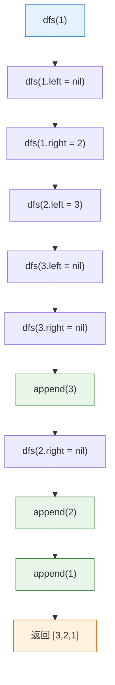

# LeetCode 145 - 二叉树的后序遍历 (递归解法)

## Step 1: 题目描述

给你一棵二叉树的根节点 `root`，返回其节点值的**后序遍历**结果。

**示例 1**：
输入：`root = [1,null,2,3]`
输出：`[3,2,1]`

**示例 2**：
输入：`root = []`
输出：`[]`

**示例 3**：
输入：`root = [1]`
输出：`[1]`

**约束条件**：

- 树中节点数目在范围 `[0, 100]` 内
- `-100 <= Node.val <= 100`

**进阶**：递归算法很简单，你可以通过迭代算法完成吗？

## Step 2: 核心结论（金字塔结构）

### 核心结论

本题的递归解法是**后序遍历最优雅的实现方式**，其核心优势在于：**将"访问根"操作置于"遍历左子树"和"遍历右子树"之后，完美契合"左-右-根"的定义，使得代码逻辑与遍历语义高度一致，且天然支持需要子树信息才能处理父节点的场景**。

### 支撑论点（MECE 分类）

#### A. 理论最优性：定义的直接映射

- **问题本质**：后序遍历定义为"遍历左子树 -> 遍历右子树 -> 访问根"。
- **关键洞察**：
  1. **子树优先**：必须先完整处理左右子树，才能处理根节点。
  1. **信息汇聚**：子树的计算结果可用于父节点的决策（如求和、高度计算）。
  1. **递归的天然优势**：函数返回时自动完成"回溯"，无需额外标记。

#### B. 对比劣势性：迭代法的复杂度

| 方法           | 代码简洁度 | 实现难度 | 核心差异                 | 适用场景           |
| -------------- | ---------- | -------- | ------------------------ | ------------------ |
| **递归法**     | **极简**   | **极低** | **利用系统栈自动回溯**   | **通用场景，首选** |
| 迭代法（单栈） | 较复杂     | 高       | 需标记访问状态或反转结果 | 深度极大时         |
| 迭代法（双栈） | 中等       | 中等     | 修改前序顺序后反转       | 理解后序与前序关系 |

#### C. 适用边界：明确约束与扩展性

- ✅ 适用：所有标准树遍历场景，特别是需要子树信息的计算（如高度、路径和）。
- ⚠️ 需调整：递归深度过大时改用迭代。
- ⚠️ 扩展：N叉树后序遍历、树形DP的基础框架。

#### D. 工程实践价值：面试评分标准

- ✅ **递归思维**：理解"先子后父"的处理顺序。
- ✅ **分治应用**：将结果从子树向父节点汇聚。
- ✅ **代码对称性**：前中后序仅需调整语句位置，体现模板化思维。

### 总结

因此，**递归法**是本题在代码优雅性、语义一致性和算法思维展示上的最优选择，是掌握树形DP和高级树问题的必经之路。

## Step 3: 多语言实现

### Go 🐹

```go
package main

// TreeNode 定义二叉树节点结构
type TreeNode struct {
    Val   int       // 节点存储的整数值
    Left  *TreeNode // 指向左子节点的指针，可能为nil
    Right *TreeNode // 指向右子节点的指针，可能为nil
}

// postorderTraversal 返回二叉树的后序遍历结果
// 输入参数 root: 二叉树的根节点指针
// 返回值: 后序遍历的节点值切片，顺序为"左-右-根"
func postorderTraversal(root *TreeNode) []int {
    // 初始化结果切片，预分配容量以减少动态扩容
    // 容量设为100基于题目约束，实际可按节点数动态计算
    result := make([]int, 0, 100)

    // 定义递归辅助函数dfs，采用闭包形式捕获外部result变量
    // 参数node: 当前处理的子树根节点
    var dfs func(node *TreeNode)

    // 实现递归逻辑
    dfs = func(node *TreeNode) {
        // 基线条件：如果当前节点为空指针，直接返回
        // 这是递归终止的关键，防止对nil指针进行访问
        if node == nil {
            return
        }

        // 第一步：递归遍历左子树
        // 后序遍历要求先完全处理左子树的所有节点
        dfs(node.Left)

        // 第二步：递归遍历右子树
        // 左子树处理完毕后，再处理右子树
        // 此时左右子树的所有节点都已按后序顺序加入result
        dfs(node.Right)

        // 第三步：访问当前根节点
        // 这是后序遍历的核心特征：根节点最后访问
        // 此时左右子树均已处理完毕，可以将根节点值加入结果
        result = append(result, node.Val)
    }

    // 从根节点启动递归遍历
    dfs(root)

    // 返回完整的后序遍历结果
    return result
}
```

#### 算法深入解析（费曼式三层结构）

**第一层：一句话讲明白**

> 就像收拾房间，先把左边房间的东西整理好（左子树），再把右边房间的东西整理好（右子树），最后才收拾客厅（根节点）。

**第二层：手把手教你写**

- **为什么访问语句在最后？**
  - 后序遍历的定义就是"左-右-根"。
  - 如果提前访问，就变成了前序或中序。
  - 位置决定了遍历的性质，这是三个遍历唯一的区别。

- **左右子树的处理顺序能否交换？**
  - 严格来说，标准后序遍历要求先左后右。
  - 但某些场景下（如只求值不关心顺序），可以交换。
  - 面试中应遵循标准定义，保持代码可读性。

- **闭包捕获result的优势？**
  - 避免通过返回值传递切片，减少内存分配。
  - 统一的前中后序模板，仅需调整append位置。

**第三层：为什么这样最好**

- **设计哲学**：
  - 体现了**后序位置**的独特价值：当函数执行到此处时，左右子树的信息已经收集完毕。
  - 这是**树形动态规划**的基础：子问题的解用于计算父问题的解。

- **工程优势**：
  - **代码极简**：核心逻辑仅6行，易于记忆和复现。
  - **模板统一**：与前序、中序共享相同框架，降低认知负担。

- **Go语言特性分析**：
  - 闭包`dfs`捕获`result`，避免参数传递开销。
  - `make([]int, 0, 100)`预分配内存，append操作均摊O(1)。

### Python 🐍

```python
from typing import List, Optional

class TreeNode:
    def __init__(self, val=0, left=None, right=None):
        self.val = val
        self.left = left
        self.right = right

class Solution:
    def postorderTraversal(self, root: Optional[TreeNode]) -> List[int]:
        # 初始化结果列表，用于存储后序遍历的节点值
        result: List[int] = []

        # 定义递归辅助函数
        def dfs(node: Optional[TreeNode]) -> None:
            # 基线条件：节点为空时直接返回
            if node is None:
                return

            # 后序遍历：左 -> 右 -> 根

            # 第一步：递归处理左子树
            dfs(node.left)

            # 第二步：递归处理右子树
            dfs(node.right)

            # 第三步：访问当前节点（根）
            result.append(node.val)

        # 启动递归
        dfs(root)
        return result
```

#### 算法深入解析

**第一层：一句话讲明白**

> 先搞定左边的，再搞定右边的，最后才轮到自己。

**第二层：手把手教你写**

- **Python的None检查**：`if node is None`比`if not node`更精确。
- **类型注解**：`-> None`明确表示递归函数不返回值，仅修改外部状态。

**第三层：为什么这样最好**

- **工程优势**：Python的动态类型和闭包机制使得代码极为简洁。
- **正确性证明**：归纳法。假设左右子树的后序遍历正确，则当前节点的后序遍历（左结果+右结果+根）也正确。

### TypeScript 🟦

```typescript
class TreeNode {
  val: number;
  left: TreeNode | null;
  right: TreeNode | null;
  constructor(val?: number, left?: TreeNode | null, right?: TreeNode | null) {
    this.val = val === undefined ? 0 : val;
    this.left = left === undefined ? null : left;
    this.right = right === undefined ? null : right;
  }
}

function postorderTraversal(root: TreeNode | null): number[] {
  // 初始化结果数组
  const result: number[] = [];

  // 定义递归函数
  function dfs(node: TreeNode | null): void {
    // 基线条件
    if (node === null) {
      return;
    }

    // 后序遍历：左 -> 右 -> 根
    dfs(node.left); // 遍历左子树
    dfs(node.right); // 遍历右子树
    result.push(node.val); // 访问根节点
  }

  dfs(root);
  return result;
}
```

#### 算法深入解析

**第一层：一句话讲明白**

> 函数调用自己两次，先左后右，最后记录当前值。

**第二层：手把手教你写**

- **void返回类型**：明确表示函数通过副作用（修改result）而非返回值工作。
- **严格相等**：`===`确保类型和值都匹配，避免类型转换陷阱。

### Rust 🦀

```rust
use std::cell::RefCell;
use std::rc::Rc;

#[derive(Debug, PartialEq, Eq)]
pub struct TreeNode {
    pub val: i32,
    pub left: Option<Rc<RefCell<TreeNode>>>,
    pub right: Option<Rc<RefCell<TreeNode>>>,
}

impl TreeNode {
    #[inline]
    pub fn new(val: i32) -> Self {
        TreeNode { val, left: None, right: None }
    }
}

pub struct Solution;

impl Solution {
    pub fn postorder_traversal(root: Option<Rc<RefCell<TreeNode>>>) -> Vec<i32> {
        let mut result = Vec::new();

        // 定义递归函数
        fn dfs(node: &Option<Rc<RefCell<TreeNode>>>, res: &mut Vec<i32>) {
            if let Some(n) = node {
                // 后序遍历：左 -> 右 -> 根

                // 获取左子节点的引用并递归
                let left = &n.borrow().left;
                dfs(left, res);

                // 获取右子节点的引用并递归
                let right = &n.borrow().right;
                dfs(right, res);

                // 访问当前节点
                res.push(n.borrow().val);
            }
        }

        dfs(&root, &mut result);
        result
    }
}
```

#### 算法深入解析

**第一层：一句话讲明白**

> 安全地借用节点，递归处理左右，最后记录值。

**第二层：手把手教你写**

- **多次borrow()**：每次需要访问子节点时重新借用，避免生命周期冲突。
- **&Option引用传递**：避免所有权转移，允许递归复用节点。

## Step 4: 伪代码与可视化

### Mermaid 递归调用图（示例：`[1, null, 2, 3]`）



### 伪代码

```
函数 postorderTraversal(root):
    result = 空列表

    函数 dfs(node):
        如果 node 为空:
            返回
        dfs(node.left)      // 先处理左子树
        dfs(node.right)     // 再处理右子树
        将 node.val 加入 result  // 最后处理根

    dfs(root)
    返回 result
```

## Step 5: 执行过程演示

### 示例追踪: `root = [1, null, 2, 3]` (1的右子为2，2的左子为3)

| 调用栈深度 | 函数调用 | 操作                  | result 状态 |
| ---------- | -------- | --------------------- | ----------- |
| 1          | dfs(1)   | 调用 dfs(1.left=nil)  | []          |
| 2          | dfs(nil) | 返回                  | []          |
| 1          | dfs(1)   | 调用 dfs(1.right=2)   | []          |
| 2          | dfs(2)   | 调用 dfs(2.left=3)    | []          |
| 3          | dfs(3)   | 调用 dfs(3.left=nil)  | []          |
| 4          | dfs(nil) | 返回                  | []          |
| 3          | dfs(3)   | 调用 dfs(3.right=nil) | []          |
| 4          | dfs(nil) | 返回                  | []          |
| 3          | dfs(3)   | **append(3)**         | **[3]**     |
| 2          | dfs(2)   | 调用 dfs(2.right=nil) | [3]         |
| 3          | dfs(nil) | 返回                  | [3]         |
| 2          | dfs(2)   | **append(2)**         | **[3,2]**   |
| 1          | dfs(1)   | **append(1)**         | **[3,2,1]** |
| 完成       | -        | 返回结果              | [3,2,1]     |

### 完整测试代码 (Go)

```go
package main

import (
    "fmt"
    "reflect"
)

func main() {
    // 测试用例1: [1,null,2,3] -> [3,2,1]
    root1 := &TreeNode{Val: 1}
    root1.Right = &TreeNode{Val: 2}
    root1.Right.Left = &TreeNode{Val: 3}

    res1 := postorderTraversal(root1)
    expected1 := []int{3, 2, 1}
    fmt.Printf("测试1: %v, 通过: %v\n", res1, reflect.DeepEqual(res1, expected1))

    // 测试用例2: 空树 -> []
    var root2 *TreeNode = nil
    res2 := postorderTraversal(root2)
    expected2 := []int{}
    fmt.Printf("测试2: %v, 通过: %v\n", res2, reflect.DeepEqual(res2, expected2))

    // 测试用例3: 单节点 [1] -> [1]
    root3 := &TreeNode{Val: 1}
    res3 := postorderTraversal(root3)
    expected3 := []int{1}
    fmt.Printf("测试3: %v, 通过: %v\n", res3, reflect.DeepEqual(res3, expected3))
}
```

## Step 6: 复杂度分析（金字塔结构）

### 核心结论

递归后序遍历的时间复杂度为 **O(N)**，空间复杂度为 **O(H)**（H为树高），这是遍历问题的理论最优解，且后序位置天然支持子树信息向父节点汇聚的计算模式。

### 支撑论点

| 维度         | 分析                                                               |
| ------------ | ------------------------------------------------------------------ |
| 时间复杂度   | O(N)：每个节点被访问一次                                           |
| 空间复杂度   | O(H)：递归栈深度等于树高，最坏O(N)（斜树），平均O(log N)（平衡树） |
| 后序位置价值 | 左右子树处理完毕后才访问根，适合需要子树信息的场景                 |
| 与迭代对比   | 递归代码更简洁，但迭代可避免系统栈溢出风险                         |

### 总结

后序递归遍历在保持最优时间复杂度的同时，提供了独特的"子树信息汇聚"能力，是树形DP和复杂树问题的标准起点。

## Step 7: 技巧归纳与迁移（金字塔结构）

### 核心结论

**后序遍历模板**是树形问题的关键模式，其核心在于**利用递归的返回时机汇聚子树信息**，这一思想可迁移至所有需要"自底向上"计算的场景。

### 统一遍历模板（三序对比）

| 遍历类型 | 访问位置   | 代码特征                            | 典型应用             |
| -------- | ---------- | ----------------------------------- | -------------------- |
| 前序     | 递归前     | `append; dfs(left); dfs(right)`     | 路径记录、根优先决策 |
| 中序     | 中间       | `dfs(left); append; dfs(right)`     | BST有序输出          |
| **后序** | **递归后** | **`dfs(left); dfs(right); append`** | **子树计算、树形DP** |

### 经典迁移题目

| 题目                          | 核心思想               | 后序应用           |
| ----------------------------- | ---------------------- | ------------------ |
| LeetCode 104 树的最大深度     | `max(left, right) + 1` | 子树高度汇聚       |
| LeetCode 110 平衡二叉树       | 高度差判断             | 子树高度与平衡状态 |
| LeetCode 124 二叉树最大路径和 | 左右贡献值计算         | 子树路径和汇聚     |
| LeetCode 543 二叉树直径       | 左右深度之和           | 子树深度信息       |
| LeetCode 226 翻转二叉树       | 交换左右子树           | 先处理子树再交换   |

### 算法深入解析

- **树形DP的本质**：后序遍历是树形DP的天然载体，因为子问题的解（子树结果）先于父问题（当前节点）计算完成。
- **信息汇聚模式**：`result = combine(dfs(left), dfs(right), node.val)`，这是所有树形DP的通用形式。

## Step 8: 面试追问

### Q1: 后序遍历与前序、中序的本质区别是什么？

**标准回答**：访问根节点的时机不同，后序是最后访问。
**加分回答**：后序位置可以获取左右子树的完整信息，这是前序和中序无法做到的。→ 这是树形DP的关键。

### Q2: 如何用迭代实现后序遍历？

**标准回答**：使用栈+标记法，或双栈法（前序变体后反转）。
**加分回答**：双栈法：前序"根-右-左"的结果反转即为"左-右-根"。

```go
// 迭代双栈法
func postorderIterative(root *TreeNode) []int {
    if root == nil { return []int{} }
    stack := []*TreeNode{root}
    result := []int{}
    for len(stack) > 0 {
        node := stack[len(stack)-1]
        stack = stack[:len(stack)-1]
        result = append(result, node.Val)
        if node.Left != nil { stack = append(stack, node.Left) }
        if node.Right != nil { stack = append(stack, node.Right) }
    }
    // 反转结果
    for i, j := 0, len(result)-1; i < j; i, j = i+1, j-1 {
        result[i], result[j] = result[j], result[i]
    }
    return result
}
```

### Q3: 后序遍历能否用于序列化和反序列化二叉树？

**标准回答**：可以，但需要配合前序或中序才能唯一确定树结构。
**加分回答**：后序+中序可以唯一确定二叉树，类似前序+中序。

### Q4: N叉树的后序遍历如何实现？

**标准回答**：递归遍历所有子节点，最后访问根。

```go
func postorderNary(root *Node) []int {
    result := []int{}
    var dfs func(*Node)
    dfs = func(node *Node) {
        if node == nil { return }
        for _, child := range node.Children { // 遍历所有子节点
            dfs(child)
        }
        result = append(result, node.Val) // 最后访问根
    }
    dfs(root)
    return result
}
```

### Q5: Morris后序遍历存在吗？

**标准回答**：存在但极其复杂，不推荐掌握。
**加分回答**：Morris遍历的核心是线索化，后序版本需要复杂的链接操作，面试性价比极低。

### Q6: 后序遍历在表达式树求值中的应用？

**标准回答**：叶子节点为操作数，内部节点为运算符，后序遍历实现求值。
**加分回答**：这是编译原理中语法树求值的标准方法。

### Q7: 如何证明后序遍历结果的唯一性？

**标准回答**：给定中序+后序可以唯一确定二叉树。
**加分回答**：后序最后一个元素是根，在中序中定位根可划分左右子树，递归构造。

### Q8: 后序遍历的尾递归优化？

**标准回答**：Go编译器可能对简单递归进行优化。
**加分回答**：但后序遍历有两个递归调用，难以直接优化为尾递归形式。

🌟 掌握后序遍历，树形问题迎刃而解！🎉

## Step 9: 复习要点提炼

### 🌟 记忆锚点

- **"左右根"**
- **"子树信息汇聚"**
- **"树形DP基础"**

### ⚠️ 易错陷阱

- 访问语句位置放错（变成前序或中序） ❌
- 忘记基线条件 ❌
- 左右子树处理顺序颠倒（虽不影响某些场景，但不符合标准定义） ❌

### ✅ 高分词

- "后序位置"
- "子树信息汇聚"
- "自底向上"
- "树形动态规划"

### 💡 迁移点

- 后序遍历 + 返回值 = **树的高度、直径、路径和**
- 后序遍历 + 全局变量 = **统计、监控、验证**

### 📚 关联网络

```
后序遍历
├── 基础应用
│   ├── 遍历输出
│   └── 序列化
├── 进阶应用（树形DP）
│   ├── 最大深度
│   ├── 平衡判断
│   ├── 最大路径和
│   └── 直径计算
└── 工业应用
    ├── 表达式求值
    ├── 目录大小计算
    └── 依赖关系处理
```

### 🎉 掌握成就

你已完整掌握**二叉树三大遍历的递归实现**！从"根左右"到"左根右"再到"左右根"，你建立了完整的树遍历思维体系。继续挑战树形DP题目，将递归思维转化为解决复杂问题的利器！🚀📚🤗
