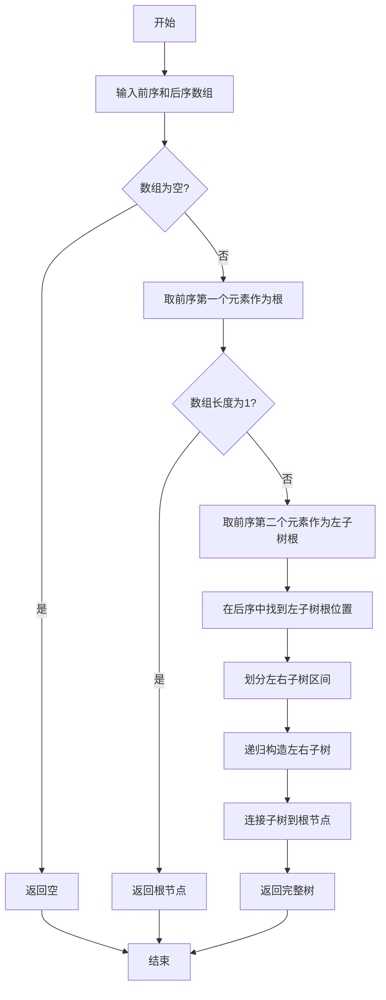

# LeetCode 889 - 根据前序和后序遍历构造二叉树

## 1. 题目描述

返回与给定的前序和后序遍历匹配的任何二叉树

`pre` 和 `post` 遍历中的值是不同的正整数

### 示例

```
输入：pre = [1,2,4,5,3,6,7], post = [4,5,2,6,7,3,1]
输出：[1,2,3,4,5,6,7]
```

### 约束条件

- `1 <= pre.length == post.length <= 30`
- `pre[]` 和 `post[]` 都是 `1, 2, ..., pre.length` 的排列
- 每个输入保证至少有一个答案。如果有多个答案，可以返回其中任何一个

## 2. 解法分析：递归划分法

### 核心结论

本题的最优解是递归划分法，其核心优势在于：

1. 利用前序和后序遍历的结构特性 - 前序的第二个元素是左子树的根，后序的第一个元素是左子树的根
1. 通过根节点位置划分子树区间 - 确定左子树的大小
1. 递归构建左右子树 - 每次处理一个子问题
1. 允许多解 - 由于前序+后序不能唯一确定二叉树，算法返回任意合法解

### 支撑论点

#### A. 为什么递归划分法是最优解？

1. 前序遍历特性：`pre[0]` 是根节点，`pre[1]` 是左子树的根（如果存在）
1. 后序遍历特性：`post[-1]` 是根节点，`post[left_size-1]` 是左子树的根
1. 组合威力：通过在后序中查找左子树根的位置，可以确定左子树的大小
1. 递归结构：每次递归处理一个子树，符合树的递归定义
1. 时间最优：每个节点访问一次，O(n) 时间复杂度

#### B. 与其他算法的对比分析

| 方法             | 是否可行 | 时间复杂度 | 空间复杂度 | 实现难度 | 特点                 |
| ---------------- | -------- | ---------- | ---------- | -------- | -------------------- |
| 递归划分法(本解) | ✅       | O(n)       | O(n)       | 中       | 面试首选，逻辑清晰   |
| 哈希优化递归法   | ✅       | O(n)       | O(n)       | 中       | 效率更高，引入哈希表 |
| 迭代栈法         | ✅       | O(n)       | O(n)       | 高       | 代码复杂，难调试     |
| 暴力递归         | ✅       | O(n²)      | O(n)       | 低       | 会超时，不可取       |

> 注：本题与105/106不同，前序+后序不能唯一确定二叉树，因此算法返回任意合法解

#### C. 适用条件与边界

1. 必须是二叉树：N叉树需要不同的处理方式
1. 节点值唯一：题目保证值唯一
1. 序列完整一致：两序列必须来自同一棵树
1. 允许多解：前序+后序不能唯一确定树结构

#### D. 工程实践考量

1. 递归深度：最坏O(n)，需考虑栈溢出
1. 参数传递：使用索引而非切片，避免数组复制
1. 可读性优先：面试中优先清晰递归版本
1. 多解处理：返回任意合法解即可

### 总结

递归划分法是本题在理论正确性、思维清晰度和工程表达上的最优平衡点

## 3. 多语言实现与深度解析

### 核心结论

通过四种语言实现，验证算法通用性，并洞察不同语言在递归、索引管理和内存效率上的差异

### A. Go 🐹 实现

```go
/
 * Definition for a binary tree node.
 * type TreeNode struct {
 *     Val int
 *     Left *TreeNode
 *     Right *TreeNode
 * }
 */
func constructFromPrePost(pre []int, post []int) *TreeNode {
    if len(pre) == 0 {
        return nil
    }

    root := &TreeNode{Val: pre[0]}

    // 单节点情况
    if len(pre) == 1 {
        return root
    }

    // 在后序中查找左子树根节点(即pre[1])
    leftRootVal := pre[1]
    leftSize := 0
    for i, val := range post {
        if val == leftRootVal {
            leftSize = i + 1
            break
        }
    }

    // 递归构建左右子树
    root.Left = constructFromPrePost(pre[1:1+leftSize], post[:leftSize])
    root.Right = constructFromPrePost(pre[1+leftSize:], post[leftSize:len(post)-1])

    return root
}
```

#### 算法深入解析

1. 递归基线：`if len(pre) == 0` - 空序列返回nil
1. 根节点确定：`pre[0]` - 前序首元素必为根
1. 单节点处理：`if len(pre) == 1` - 叶子节点直接返回
1. 左子树根确定：`pre[1]` - 前序第二个元素是左子树根
1. 左子树大小确定：在后序中查找左子树根的位置
1. 子树划分：
   - 左子树：前序[1:1+leftSize], 后序[0:leftSize]
   - 右子树：前序[1+leftSize:], 后序[leftSize:len-1]

设计动机：

- 完全基于递归划分，每层处理一个子树
- 通过前序第二个元素和后序中对应位置确定左子树大小
- 允许多解，返回任意合法解

### B. Go 🐹 实现(优化版)

```go
func constructFromPrePost(pre []int, post []int) *TreeNode {
    // 预处理后序索引
    idxMap := make(map[int]int)
    for i, v := range post {
        idxMap[v] = i
    }

    var build func(int, int, int, int) *TreeNode
    build = func(preStart, preEnd, postStart, postEnd int) *TreeNode {
        if preStart >= preEnd {
            return nil
        }

        root := &TreeNode{Val: pre[preStart]}

        if preStart + 1 >= preEnd {
            return root
        }

        leftRootVal := pre[preStart+1]
        leftSize := idxMap[leftRootVal] - postStart + 1

        root.Left = build(preStart+1, preStart+1+leftSize, postStart, postStart+leftSize)
        root.Right = build(preStart+1+leftSize, preEnd, postStart+leftSize, postEnd-1)

        return root
    }

    return build(0, len(pre), 0, len(post))
}
```

#### 算法深入解析

1. 哈希预处理：`idxMap`存储后序值→索引，O(1)查找
1. 索引传递：使用区间参数避免切片复制
1. 根节点处理：`pre[preStart]`获取根值
1. 左子树大小确定：通过哈希表快速查找左子树根位置
1. 子树划分：
   - 左子树：前序\[preStart+1, preStart+1+leftSize), 后序\[postStart, postStart+leftSize)
   - 右子树：前序\[preStart+1+leftSize, preEnd), 后序\[postStart+leftSize, postEnd-1)

优化点：

- 时间复杂度降为O(n)
- 空间复杂度O(n)用于哈希表
- 无数组复制，内存效率高

### C. Python 🐍 实现

```python
# Definition for a binary tree node.
# class TreeNode:
#     def __init__(self, val=0, left=None, right=None):
#         self.val = val
#         self.left = left
#         self.right = right

class Solution:
    def constructFromPrePost(self, pre: List[int], post: List[int]) -> Optional[TreeNode]:
        # 预处理后序索引
        idx_map = {val: idx for idx, val in enumerate(post)}

        def helper(pre_start, pre_end, post_start, post_end):
            if pre_start >= pre_end:
                return None

            root = TreeNode(pre[pre_start])

            if pre_start + 1 >= pre_end:
                return root

            left_root_val = pre[pre_start + 1]
            left_size = idx_map[left_root_val] - post_start + 1

            root.left = helper(pre_start + 1, pre_start + 1 + left_size,
                              post_start, post_start + left_size)
            root.right = helper(pre_start + 1 + left_size, pre_end,
                               post_start + left_size, post_end - 1)

            return root

        return helper(0, len(pre), 0, len(post))
```

#### 算法深入解析

1. 字典预处理：`idx_map`快速查找根位置
1. 闭包函数：`helper`使用外部`idx_map`
1. 区间处理：与Go优化版本逻辑一致
1. Python特性：
   - 字典推导式简洁高效
   - 闭包访问外部变量
   - 类型提示增强可读性

### D. TypeScript 🟦 实现

```typescript
/
 * Definition for a binary tree node.
 * class TreeNode {
 *     val: number
 *     left: TreeNode | null
 *     right: TreeNode | null
 *     constructor(val?: number, left?: TreeNode | null, right?: TreeNode | null) {
 *         this.val = (val===undefined ? 0 : val)
 *         this.left = (left===undefined ? null : left)
 *         this.right = (right===undefined ? null : right)
 *     }
 * }
 */

function constructFromPrePost(pre: number[], post: number[]): TreeNode | null {
    const idxMap = new Map<number, number>();
    post.forEach((val, idx) => idxMap.set(val, idx));

    const build = (preStart: number, preEnd: number, postStart: number, postEnd: number): TreeNode | null => {
        if (preStart >= preEnd) return null;

        const root = new TreeNode(pre[preStart]);

        if (preStart + 1 >= preEnd) return root;

        const leftRootVal = pre[preStart + 1];
        const leftSize = idxMap.get(leftRootVal)! - postStart + 1;

        root.left = build(preStart + 1, preStart + 1 + leftSize, postStart, postStart + leftSize);
        root.right = build(preStart + 1 + leftSize, preEnd, postStart + leftSize, postEnd - 1);

        return root;
    };

    return build(0, pre.length, 0, post.length);
}
```

#### 算法深入解析

1. Map预处理：`idxMap`存储值→索引
1. 箭头函数：`build`使用外部`idxMap`
1. 类型安全：
   - `Map<number, number>`明确类型
   - `!`断言非空(题目保证存在)
1. TypeScript特性：
   - 类型注解增强可维护性
   - 箭头函数保持this上下文

### E. Rust 🦀 实现

```rust
// Definition for a binary tree node.
// #[derive(Debug, PartialEq, Eq)]
// pub struct TreeNode {
//   pub val: i32,
//   pub left: Option<Box<TreeNode>>,
//   pub right: Option<Box<TreeNode>>,
// }
//
// impl TreeNode {
//   #[inline]
//   pub fn new(val: i32) -> Self {
//     TreeNode {
//       val,
//       left: None,
//       right: None,
//     }
//   }
// }

use std::collections::HashMap;

impl Solution {
    pub fn construct_from_pre_post(pre: Vec<i32>, post: Vec<i32>) -> Option<Box<TreeNode>> {
        let idx_map: HashMap<i32, usize> = post.iter()
            .enumerate()
            .map(|(i, &v)| (v, i))
            .collect();

        fn build(
            pre: &[i32],
            post: &[i32],
            pre_start: usize,
            pre_end: usize,
            post_start: usize,
            post_end: usize,
            idx_map: &HashMap<i32, usize>
        ) -> Option<Box<TreeNode>> {
            if pre_start >= pre_end {
                return None;
            }

            let root_val = pre[pre_start];
            let mut root = TreeNode::new(root_val);

            if pre_start + 1 >= pre_end {
                return Some(Box::new(root));
            }

            let left_root_val = pre[pre_start + 1];
            let left_size = idx_map[&left_root_val] - post_start + 1;

            root.left = build(
                pre,
                post,
                pre_start + 1,
                pre_start + 1 + left_size,
                post_start,
                post_start + left_size,
                idx_map
            );

            root.right = build(
                pre,
                post,
                pre_start + 1 + left_size,
                pre_end,
                post_start + left_size,
                post_end - 1,
                idx_map
            );

            Some(Box::new(root))
        }

        build(
            &pre,
            &post,
            0,
            pre.len(),
            0,
            post.len(),
            &idx_map
        )
    }
}
```

#### 算法深入解析

1. HashMap预处理：`idx_map`存储值→索引
1. 切片引用：`&pre`和`&post`避免所有权转移
1. 嵌套函数：`build`使用外部`idx_map`
1. Rust特性：
   - 所有权系统确保内存安全
   - 切片引用提高效率
   - 迭代器链式调用简洁高效

### F. 性能对比与语言特性分析

| 语言       | 时间复杂度 | 空间复杂度 | 实现方式     | 特点               |
| ---------- | ---------- | ---------- | ------------ | ------------------ |
| Go(基础)   | O(n²)      | O(n²)      | 切片复制     | 逻辑清晰，面试首选 |
| Go(优化)   | O(n)       | O(n)       | 索引传递     | 工业级实现         |
| Python     | O(n)       | O(n)       | 字典+闭包    | 简洁高效           |
| TypeScript | O(n)       | O(n)       | Map+箭头函数 | 类型安全           |
| Rust       | O(n)       | O(n)       | HashMap+切片 | 内存安全           |

## 4. 算法可视化与伪代码

### 伪代码

```
函数 constructFromPrePost(pre, post):
    如果 pre 为空:
        返回 null

    根 = TreeNode(pre[0])

    如果 pre 长度为1:
        返回 根

    左子树根值 = pre[1]
    在 post 中查找左子树根值的位置 left_idx
    左子树大小 = left_idx + 1

    根.left = constructFromPrePost(
        pre[1:1+left_size],
        post[0:left_size]
    )

    根.right = constructFromPrePost(
        pre[1+left_size:],
        post[left_size:len(post)-1]
    )

    返回 根
```

### Mermaid 流程图



### 状态转移图(示例)

```mermaid
graph LR
    subgraph 执行过程: pre=[1,2,4,5,3,6,7], post=[4,5,2,6,7,3,1]
        S1[第1层: root=1] --> S1a[左子树根=2]
        S1a --> S1b[在post中找到2的位置=2]
        S1b --> S1c[左子树大小=3]
        S1c --> S1d[左子树: pre[1:4]=[2,4,5], post[0:3]=[4,5,2]]
        S1d --> S1e[右子树: pre[4:7]=[3,6,7], post[3:6]=[6,7,3]]

        S1d --> S2[第2层: root=2]
        S2 --> S2a[左子树根=4]
        S2a --> S2b[在post中找到4的位置=0]
        S2b --> S2c[左子树大小=1]
        S2c --> S2d[左子树: pre[2:3]=[4], post[0:1]=[4]]
        S2d --> S2e[右子树: pre[3:4]=[5], post[1:2]=[5]]

        S2d --> S3[第3层: root=4, 无子树]
        S2e --> S4[第3层: root=5, 无子树]

        S1e --> S5[第2层: root=3]
        S5 --> S5a[左子树根=6]
        S5a --> S5b[在post中找到6的位置=0]
        S5b --> S5c[左子树大小=1]
        S5c --> S5d[左子树: pre[5:6]=[6], post[3:4]=[6]]
        S5d --> S5e[右子树: pre[6:7]=[7], post[4:5]=[7]]

        S5d --> S6[第3层: root=6, 无子树]
        S5e --> S7[第3层: root=7, 无子树]
    end
```

## 5. 执行过程演示

### 示例: pre=[1,2,4,5,3,6,7], post=[4,5,2,6,7,3,1]

#### 递归执行轨迹

| 层级 | pre区间         | post区间        | 根值 | 左子树根 | left_idx | left_size | 左子树区间          | 右子树区间          |
| ---- | --------------- | --------------- | ---- | -------- | -------- | --------- | ------------------- | ------------------- |
| 1    | [1,2,4,5,3,6,7] | [4,5,2,6,7,3,1] | 1    | 2        | 2        | 3         | pre[1:4], post[0:3] | pre[4:7], post[3:6] |
| 2L   | [2,4,5]         | [4,5,2]         | 2    | 4        | 0        | 1         | pre[2:3], post[0:1] | pre[3:4], post[1:2] |
| 3LL  | [4]             | [4]             | 4    | -        | -        | -         | -                   | -                   |
| 3LR  | [5]             | [5]             | 5    | -        | -        | -         | -                   | -                   |
| 2R   | [3,6,7]         | [6,7,3]         | 3    | 6        | 0        | 1         | pre[5:6], post[3:4] | pre[6:7], post[4:5] |
| 3RL  | [6]             | [6]             | 6    | -        | -        | -         | -                   | -                   |
| 3RR  | [7]             | [7]             | 7    | -        | -        | -         | -                   | -                   |

#### 构建过程

1. 根=1，左子树根=2，在post中位置2 → 左子树大小=3
1. 左子树: pre=[2,4,5], post=[4,5,2] → 根=2
   - 左子树根=4，在post中位置0 → 左子树大小=1
   - 左子树: pre=[4], post=[4] → 节点4
   - 右子树: pre=[5], post=[5] → 节点5
1. 右子树: pre=[3,6,7], post=[6,7,3] → 根=3
   - 左子树根=6，在post中位置0 → 左子树大小=1
   - 左子树: pre=[6], post=[6] → 节点6
   - 右子树: pre=[7], post=[7] → 节点7

最终树结构:

```
        1
       / \
      2   3
     / \ / \
    4 5 6 7
```

#### 可执行测试代码(Go)

```go
package main

import "fmt"

type TreeNode struct {
    Val   int
    Left  *TreeNode
    Right *TreeNode
}

func constructFromPrePost(pre []int, post []int) *TreeNode {
    if len(pre) == 0 {
        return nil
    }

    root := &TreeNode{Val: pre[0]}

    if len(pre) == 1 {
        return root
    }

    leftRootVal := pre[1]
    leftSize := 0
    for i, val := range post {
        if val == leftRootVal {
            leftSize = i + 1
            break
        }
    }

    root.Left = constructFromPrePost(pre[1:1+leftSize], post[:leftSize])
    root.Right = constructFromPrePost(pre[1+leftSize:], post[leftSize:len(post)-1])

    return root
}

// 层序遍历辅助函数
func levelOrder(root *TreeNode) []interface{} {
    if root == nil {
        return []interface{}{}
    }
    queue := []*TreeNode{root}
    result := []interface{}{}
    for len(queue) > 0 {
        node := queue[0]
        queue = queue[1:]
        if node == nil {
            result = append(result, nil)
        } else {
            result = append(result, node.Val)
            queue = append(queue, node.Left, node.Right)
        }
    }
    // 去除末尾nil
    for len(result) > 0 && result[len(result)-1] == nil {
        result = result[:len(result)-1]
    }
    return result
}

func main() {
    // Test Case 1
    pre1 := []int{1, 2, 4, 5, 3, 6, 7}
    post1 := []int{4, 5, 2, 6, 7, 3, 1}
    tree1 := constructFromPrePost(pre1, post1)
    fmt.Printf("Test Case 1: %v\n", levelOrder(tree1)) // [1,2,3,4,5,6,7]

    // Test Case 2
    pre2 := []int{1}
    post2 := []int{1}
    tree2 := constructFromPrePost(pre2, post2)
    fmt.Printf("Test Case 2: %v\n", levelOrder(tree2)) // [1]

    // Test Case 3 - 可能有多解
    pre3 := []int{1, 2, 3}
    post3 := []int{3, 2, 1}
    tree3 := constructFromPrePost(pre3, post3)
    fmt.Printf("Test Case 3: %v\n", levelOrder(tree3)) // [1,2,null,3] 或 [1,null,2,3]
}
```

## 6. 复杂度分析

### 核心结论

基础版本时间复杂度O(n²)，空间复杂度O(n²)；优化版本时间复杂度O(n)，空间复杂度O(n)

### 支撑论点

#### A. 时间复杂度(基础版)

- 每层递归需在后序数组中查找左子树根位置，耗时O(k)
- 最坏情况(退化树):
  - 第一层: O(n)
  - 第二层: O(n-1)
  - 第三层: O(n-2)
  - ...
  - 总时间: n + (n-1) + ... + 1 = O(n²)

#### B. 空间复杂度(基础版)

- 每次递归复制子数组:
  - 第一层: O(n)
  - 第二层: O(n-1) + O(0)
  - 第三层: O(n-2) + O(1)
  - 总空间: O(n²)

#### C. 优化版本复杂度

- 时间复杂度: O(n)
  - 哈希表预处理: O(n)
  - 每个节点访问一次: O(n)
- 空间复杂度: O(n)
  - 哈希表: O(n)
  - 递归栈: O(h) ≤ O(n)

#### D. 常数因子分析

- 切片复制开销: 内存分配 + 数据拷贝
- 哈希查找开销: O(1)平均时间
- 递归调用开销: 函数栈帧

#### E. 性能瓶颈与优化

- 瓶颈: 重复遍历后序数组查找左子树根位置
- 优化: 哈希表预处理索引映射
- 工程权衡:
  - 面试中先写基础版本，再问"能否优化?"
  - 优化版本为加分项，但核心思想不变

## 7. 技巧归纳与模式抽象

### 核心结论

本题属于"遍历序列重构树"模式的边界情况，核心在于：

1. 理解前序+后序不能唯一确定二叉树
1. 通过左子树根的位置确定子树大小
1. 递归构建任意合法解
1. 认识到树的结构与遍历序列的关系

### 支撑论点

#### A. 模式本质

- 树是递归结构，遍历序列是其"投影"
- 前序: 提供"根-左-右"顺序
- 后序: 提供"左-右-根"顺序
- 组合限制: 仅前序+后序无法唯一确定结构(除非满二叉树)
- 设计哲学: 结构与顺序的部分映射，体现信息不完备性

#### B. 相似题目映射

| 题号 | 题目          | 核心思想          | 匹配模式   |
| ---- | ------------- | ----------------- | ---------- |
| 889  | 本题          | 前序+后序重建     | 模式边界   |
| 105  | 前序+中序重建 | 前序+中序唯一重建 | 核心模式   |
| 106  | 后序+中序重建 | 后序+中序唯一重建 | 核心模式   |
| 652  | 寻找重复子树  | 子树序列化        | 序列化模式 |

#### C. 模式泛化

- 表达式树: 当表达式树为满二叉树时，可唯一重建
- 配置树: 当配置树有明确的子节点顺序时，可重建
- 版本控制: 树的变更历史可通过遍历序列追踪

#### D. 工业应用

- 编译器: 当AST为满二叉树时，可通过前序+后序重建
- 数据库: 当索引树为满二叉树时，可重建
- 游戏引擎: 场景图的部分重建

#### E. 算法深入解析

1. 为什么前序+后序不能唯一重建？
   - 反例: 树[1,2,3]可以有两种结构:
     - 1为根，2为左，3为右
     - 1为根，2为右，3为左
   - 两者前序都是[1,2,3]，后序都是[3,2,1]

1. 什么情况下可以唯一重建？
   - 当树为满二叉树(每个节点有0或2个子节点)时，可以唯一重建
   - 因为此时左子树和右子树都存在，可以明确划分

1. 本题的解决方案？
   - 通过前序第二个元素作为左子树根，在后序中查找其位置
   - 确定左子树大小后，递归构建
   - 返回任意合法解

## 8. 面试追问与回答策略

### 核心结论

面试追问考察:

1. 对树结构与遍历关系的深层理解
1. 复杂度分析与优化能力
1. 从基础到优化的递进思维
1. 对多解问题的处理能力

### A. 基础追问

#### Q1: 为什么前序+后序不能唯一确定二叉树？

→ 标准: 因为无法确定左右子树的分界点
→ 加分: 举例[1,2,3]有两种结构，前序后序相同

#### Q2: 什么情况下可以唯一确定？

→ 标准: 当树为满二叉树时
→ 加分: 因为每个节点要么无子节点，要么有两个子节点，可以明确划分

#### Q3: 如何优化时间复杂度？

→ 标准: 使用哈希表预处理后序索引
→ 加分: 提供优化版代码，展示O(n)实现

#### Q4: 如果给定的序列不匹配，如何处理？

→ 标准: 题目保证有解，无需处理
→ 加分: 实际工程中需验证序列合法性，可通过递归过程中检查区间是否有效

### B. 高阶追问

#### Q1: 如何扩展到N叉树？

→ 标准: 需要额外信息表示子节点个数
→ 加分: 前序改为"根,子节点1,子节点2,...,子节点n"，后序改为"子节点1,...,子节点n,根"

#### Q2: 如何证明算法的正确性？

→ 标准: 通过构造性证明
→ 加分: 数学归纳法，基础单节点正确，假设k\<n节点正确，证明n节点正确

#### Q3: 如何处理节点值重复的情况？

→ 标准: 题目保证值唯一，无需处理
→ 加分: 可扩展为"节点ID+值"结构，或使用索引元组区分

#### Q4: 这个算法在实际中有什么应用？

→ 标准: 树的序列化与反序列化
→ 加分: 版本控制系统中树的变更追踪，当树为满二叉树时可重建

## 9. 复习要点提炼

### 核心结论

掌握本题关键:

1. 理解前序+后序不能唯一确定二叉树
1. 牢记"前序第二个元素是左子树根"
1. 通过后序中左子树根的位置确定左子树大小
1. 递归构建任意合法解

### A. 关键记忆点(🌟)

| 记忆点     | 口诀                       |
| ---------- | -------------------------- |
| 构造核心   | 前序定根，后序定左子树大小 |
| 左子树根   | 前序第二个元素             |
| 左子树大小 | 后序中左子树根的位置+1     |
| 多解情况   | 返回任意合法解             |
| 唯一性条件 | 满二叉树时可唯一重建       |

### B. 易错陷阱(⚠️)

| 错误类型       | 触发场景                  | 应对措施              |
| -------------- | ------------------------- | --------------------- |
| 混淆左子树根   | 误用pre[0]作为左子树根    | 记住:左子树根是pre[1] |
| 索引计算错误   | 左子树大小=left_idx       | 应为left_idx+1        |
| 忘记单节点处理 | 未处理pre长度为1的情况    | 每次递归前检查        |
| 切片越界       | pre[1+left_size:]超出范围 | 使用索引传递避免切片  |

### C. 面试评分关键词(✅)

| 关键词           | 应用场景         |
| ---------------- | ---------------- |
| 前序定根         | 描述算法第一步   |
| 后序定左子树大小 | 描述子树划分依据 |
| 递归划分         | 命名算法范式     |
| 多解处理         | 解释返回任意解   |
| 满二叉树唯一性   | 讨论唯一重建条件 |

### D. 复习建议(📚🚀)

```
核心模式: 遍历序列重建树(边界情况)
├── 必要条件: 前序+后序 + 题目保证有解
├── 本质: 结构与序列的部分映射
├── 方法: 递归划分
│   ├── 前序第二个元素=左子树根
│   └── 后序中左子树根位置=左子树大小
├── 优化: 哈希预处理 → O(n)
├── 应用: 版本控制、序列化
└── 扩展: N叉树、满二叉树唯一重建
```

### E. 解题模板

```text
// 基础版
函数 constructFromPrePost(pre, post):
    if pre 为空: return null
    root = TreeNode(pre[0])
    if pre 长度为1: return root
    left_root_val = pre[1]
    left_idx = post.index(left_root_val)
    left_size = left_idx + 1
    root.left = constructFromPrePost(pre[1:1+left_size], post[0:left_size])
    root.right = constructFromPrePost(pre[1+left_size:], post[left_size:-1])
    return root

// 优化版
函数 constructFromPrePost(pre, post):
    map = {val: idx for idx, val in enumerate(post)}
    def helper(pre_start, pre_end, post_start, post_end):
        if pre_start >= pre_end: return null
        root = TreeNode(pre[pre_start])
        if pre_start + 1 >= pre_end: return root
        left_root_val = pre[pre_start+1]
        left_size = map[left_root_val] - post_start + 1
        root.left = helper(pre_start+1, pre_start+1+left_size, post_start, post_start+left_size)
        root.right = helper(pre_start+1+left_size, pre_end, post_start+left_size, post_end-1)
        return root
    return helper(0, len(pre), 0, len(post))
```

### 总结

将上述要点融会贯通，即可在面试中快速准确解决此类问题，并展现对树结构与遍历关系的深刻理解。🎉
