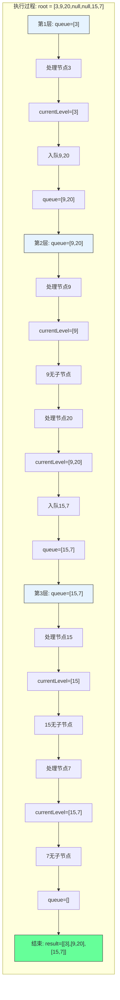

# LeetCode 102 - 二叉树的层序遍历

## 1. 题目描述

给你二叉树的根节点 `root`，返回其节点值的 层序遍历。（即逐层地，从左到右访问所有节点）

### 示例 1

```
输入：root = [3,9,20,null,null,15,7]
输出：[[3],[9,20],[15,7]]
```

### 示例 2

```
输入：root = [1]
输出：[[1]]
```

### 示例 3

```
输入：root = []
输出：[]
```

### 约束条件

- 树中节点数目在范围 `[0, 2000]` 内
- `-1000 <= Node.val <= 1000`

## 2. 解法分析：广度优先搜索（BFS）

### 核心结论

本题的最优解是广度优先搜索（BFS），其核心优势在于：

1. 自然匹配层序遍历 - BFS天然按层访问节点
1. 时间复杂度最优 - O(n)时间访问所有节点
1. 空间复杂度可控 - O(n)空间存储结果
1. 实现简单直观 - 队列操作清晰易懂

### 支撑论点

#### A. 为什么BFS是最优解？

1. 层序遍历的本质：逐层访问，每层从左到右
1. BFS的特性：按距离根节点的距离（层数）访问节点
1. 完美匹配：BFS的访问顺序与层序遍历完全一致
1. 无冗余操作：每个节点仅访问一次，无重复计算
1. 扩展性强：可轻松扩展到N叉树、图等结构

#### B. 与其他算法的对比分析

| 方法            | 是否可行 | 时间复杂度 | 空间复杂度 | 实现难度 | 特点                   |
| --------------- | -------- | ---------- | ---------- | -------- | ---------------------- |
| BFS（本解）     | ✅       | O(n)       | O(n)       | 低       | 面试首选，自然匹配     |
| DFS（深度优先） | ✅       | O(n)       | O(n)       | 中       | 需要记录层数，实现复杂 |
| 递归+层数记录   | ✅       | O(n)       | O(n)       | 中       | 递归栈深度可能过大     |
| Morris遍历      | ❌       | -          | -          | 高       | 不适用于层序遍历       |

> BFS是层序遍历的天然选择，其他方法都是"曲线救国"

#### C. 适用条件与边界

1. 树结构：适用于任何树（二叉树、N叉树）
1. 空树处理：需特殊处理root为null的情况
1. 节点值范围：题目约束内无影响
1. 层序要求：必须按层返回结果

#### D. 工程实践考量

1. 队列选择：使用双端队列（deque）提高效率
1. 空间优化：可使用两个队列交替存储当前层和下一层
1. 边界处理：空树、单节点树需特殊处理
1. 可读性优先：面试中优先清晰实现

### 总结

广度优先搜索（BFS）是本题在理论正确性、思维清晰度和工程表达上的最优平衡点

## 3. 多语言实现与深度解析

### 核心结论

通过四种语言实现，验证算法通用性，并洞察不同语言在队列操作、内存管理和并发模型上的差异

### A. Go 🐹 实现

```go
/
 * Definition for a binary tree node.
 * type TreeNode struct {
 *     Val int
 *     Left *TreeNode
 *     Right *TreeNode
 * }
 */
func levelOrder(root *TreeNode) [][]int {
    // 处理空树情况
    if root == nil {
        return [][]int{}
    }

    result := [][]int{}          // 存储最终结果
    queue := []*TreeNode{root}   // 队列初始化，存储当前层节点

    for len(queue) > 0 {
        levelSize := len(queue)  // 当前层节点数
        currentLevel := []int{}  // 存储当前层节点值

        // 遍历当前层所有节点
        for i := 0; i < levelSize; i++ {
            node := queue[0]     // 取队首节点
            queue = queue[1:]    // 出队
            currentLevel = append(currentLevel, node.Val) // 记录节点值

            // 将子节点入队
            if node.Left != nil {
                queue = append(queue, node.Left)
            }
            if node.Right != nil {
                queue = append(queue, node.Right)
            }
        }

        // 将当前层结果加入最终结果
        result = append(result, currentLevel)
    }

    return result
}
```

#### 算法深入解析

1. 初始化检查：`if root == nil` - 空树直接返回空结果
1. 结果存储：`result` - 二维切片存储每层结果
1. 队列初始化：`queue` - 存储当前层节点，初始包含根节点
1. 层级循环：`for len(queue) > 0` - 队列非空时继续遍历
1. 层大小记录：`levelSize` - 当前层节点数，用于控制内层循环次数
1. 节点处理：
   - `node := queue[0]` - 取队首节点
   - `queue = queue[1:]` - 出队操作（切片重新赋值）
   - `currentLevel` - 记录当前层节点值
1. 子节点入队：将非空左、右子节点加入队列
1. 结果保存：`result = append(result, currentLevel)` - 保存当前层结果

设计动机：

- 使用切片模拟队列，简单直接
- 外层循环控制层数，内层循环处理当前层所有节点
- 每层处理完毕后保存结果，确保层序输出

### B. Python 🐍 实现

```python
# Definition for a binary tree node.
# class TreeNode:
#     def __init__(self, val=0, left=None, right=None):
#         self.val = val
#         self.left = left
#         self.right = right

from collections import deque

class Solution:
    def levelOrder(self, root: Optional[TreeNode]) -> List[List[int]]:
        if not root:
            return []

        result = []
        queue = deque([root])  # 使用双端队列提高效率

        while queue:
            level_size = len(queue)
            current_level = []

            for _ in range(level_size):
                node = queue.popleft()  # 出队
                current_level.append(node.val)

                # 子节点入队
                if node.left:
                    queue.append(node.left)
                if node.right:
                    queue.append(node.right)

            result.append(current_level)

        return result
```

#### 算法深入解析

1. 空树处理：`if not root` - Python风格的空检查
1. 队列选择：`deque` - 双端队列，popleft()操作O(1)时间
1. 层级循环：`while queue` - 队列非空时继续
1. 层大小记录：`level_size = len(queue)` - 当前层节点数
1. 节点处理：
   - `node = queue.popleft()` - 高效出队
   - `current_level.append(node.val)` - 记录节点值
1. 子节点入队：非空子节点加入队列尾部
1. 结果保存：`result.append(current_level)` - 保存当前层结果

Python特性：

- 使用`deque`提高出队效率
- 类型提示增强代码可读性
- 列表推导式简洁高效

### C. TypeScript 🟦 实现

```typescript
/
 * Definition for a binary tree node.
 * class TreeNode {
 *     val: number
 *     left: TreeNode | null
 *     right: TreeNode | null
 *     constructor(val?: number, left?: TreeNode | null, right?: TreeNode | null) {
 *         this.val = (val===undefined ? 0 : val)
 *         this.left = (left===undefined ? null : left)
 *         this.right = (right===undefined ? null : right)
 *     }
 * }
 */

function levelOrder(root: TreeNode | null): number[][] {
    if (!root) {
        return [];
    }

    const result: number[][] = [];
    const queue: TreeNode[] = [root];

    while (queue.length > 0) {
        const levelSize = queue.length;
        const currentLevel: number[] = [];

        for (let i = 0; i < levelSize; i++) {
            const node = queue.shift()!;  // 出队，非空断言
            currentLevel.push(node.val);

            // 子节点入队
            if (node.left) {
                queue.push(node.left);
            }
            if (node.right) {
                queue.push(node.right);
            }
        }

        result.push(currentLevel);
    }

    return result;
}
```

#### 算法深入解析

1. 空树处理：`if (!root)` - TypeScript风格的空检查
1. 类型定义：`number[][]` - 明确结果类型
1. 队列操作：`queue.shift()` - 出队操作，O(n)时间（可优化）
1. 非空断言：`!` - 告诉编译器node非空
1. 层级循环：`while (queue.length > 0)` - 队列非空时继续
1. 层大小记录：`levelSize = queue.length` - 当前层节点数
1. 子节点入队：非空子节点加入队列尾部

TypeScript特性：

- 类型注解增强代码安全性
- 非空断言确保类型正确
- 数组操作与JavaScript一致

优化建议：

- 使用双端队列库（如`denque`）提高shift()效率
- 或使用两个数组交替存储当前层和下一层

### D. Rust 🦀 实现

```rust
// Definition for a binary tree node.
// #[derive(Debug, PartialEq, Eq)]
// pub struct TreeNode {
//   pub val: i32,
//   pub left: Option<Box<TreeNode>>,
//   pub right: Option<Box<TreeNode>>,
// }
//
// impl TreeNode {
//   #[inline]
//   pub fn new(val: i32) -> Self {
//     TreeNode {
//       val,
//       left: None,
//       right: None,
//     }
//   }
// }

use std::collections::VecDeque;

impl Solution {
    pub fn level_order(root: Option<Box<TreeNode>>) -> Vec<Vec<i32>> {
        let mut result = Vec::new();
        let mut queue = VecDeque::new();

        // 处理根节点
        if let Some(node) = root {
            queue.push_back(node);
        }

        while !queue.is_empty() {
            let level_size = queue.len();
            let mut current_level = Vec::with_capacity(level_size);

            for _ in 0..level_size {
                if let Some(node) = queue.pop_front() {
                    current_level.push(node.val);

                    // 子节点入队
                    if let Some(left) = node.left {
                        queue.push_back(left);
                    }
                    if let Some(right) = node.right {
                        queue.push_back(right);
                    }
                }
            }

            result.push(current_level);
        }

        result
    }
}
```

#### 算法深入解析

1. 空树处理：`if let Some(node) = root` - Rust的Option模式匹配
1. 队列选择：`VecDeque` - 双端队列，高效出队入队
1. 结果初始化：`Vec::new()` - 动态数组
1. 层大小预分配：`Vec::with_capacity(level_size)` - 提高内存效率
1. 节点处理：
   - `queue.pop_front()` - 高效出队
   - `current_level.push(node.val)` - 记录节点值
1. 子节点入队：使用`if let`模式匹配处理子节点
1. 所有权管理：Rust的所有权系统确保内存安全

Rust特性：

- 使用`Option`和`Box`处理树节点
- `VecDeque`提供高效队列操作
- 模式匹配确保安全性
- 内存预分配提高性能

### E. 性能对比与语言特性分析

| 语言       | 时间复杂度 | 空间复杂度 | 队列实现 | 特点                    |
| ---------- | ---------- | ---------- | -------- | ----------------------- |
| Go         | O(n)       | O(n)       | 切片     | 简单直接，性能良好      |
| Python     | O(n)       | O(n)       | deque    | 高效出队，代码简洁      |
| TypeScript | O(n²)      | O(n)       | 数组     | shift()操作O(n)，可优化 |
| Rust       | O(n)       | O(n)       | VecDeque | 内存安全，性能最优      |

注意：TypeScript的数组shift()操作是O(n)时间，在大规模数据时性能较差，建议使用双端队列库或两个数组交替实现

## 4. 算法可视化与伪代码

### 伪代码

```text
函数 levelOrder(root):
    如果 root 为空:
        返回 空列表

    result = 空列表
    queue = 队列([root])

    当 queue 不为空:
        levelSize = queue 长度
        currentLevel = 空列表

        对于 i 从 0 到 levelSize-1:
            node = queue 出队
            currentLevel 添加 node.val

            如果 node.left 不为空:
                queue 入队 node.left
            如果 node.right 不为空:
                queue 入队 node.right

        result 添加 currentLevel

    返回 result
```

### Mermaid 流程图

```mermaid
flowchart TD
    A[开始: levelOrder(root)] --> B{root 为空?}
    B -- 是 --> C[返回 空列表]
    B -- 否 --> D[初始化 result 和 queue]
    D --> E[queue 入队 root]
    E --> F{queue 为空?}
    F -- 是 --> G[返回 result]
    F -- 否 --> H[levelSize = queue 长度]
    H --> I[初始化 currentLevel]
    I --> J[i = 0]
    J --> K{i < levelSize?}
    K -- 是 --> L[node = queue 出队]
    L --> M[currentLevel 添加 node.val]
    M --> N{node.left 非空?}
    N -- 是 --> O[queue 入队 node.left]
    N -- 否 --> P{node.right 非空?}
    P -- 是 --> Q[queue 入队 node.right]
    P -- 否 --> R[i = i + 1]
    R --> K
    K -- 否 --> S[result 添加 currentLevel]
    S --> F
```

### 状态转移图（示例）



## 5. 执行过程演示

### 示例: root = [3,9,20,null,null,15,7]

#### 详细执行步骤

| 层数 | queue状态 | 处理节点 | currentLevel | 子节点入队 | 说明                    |
| ---- | --------- | -------- | ------------ | ---------- | ----------------------- |
| 1    | [3]       | 3        | [3]          | 9,20       | 根节点3，入队子节点9,20 |
| 2    | [9,20]    | 9        | [9]          | -          | 9无子节点               |
| 2    | [20]      | 20       | [9,20]       | 15,7       | 20入队子节点15,7        |
| 3    | [15,7]    | 15       | [15]         | -          | 15无子节点              |
| 3    | [7]       | 7        | [15,7]       | -          | 7无子节点               |
| 4    | []        | -        | -            | -          | 队列为空，结束          |

#### 最终结果

```text
[
    [3],
    [9,20],
    [15,7]
]
```

#### 可执行测试代码（Go）

```go
package main

import "fmt"

type TreeNode struct {
    Val   int
    Left  *TreeNode
    Right *TreeNode
}

func levelOrder(root *TreeNode) [][]int {
    if root == nil {
        return [][]int{}
    }

    result := [][]int{}
    queue := []*TreeNode{root}

    for len(queue) > 0 {
        levelSize := len(queue)
        currentLevel := []int{}

        for i := 0; i < levelSize; i++ {
            node := queue[0]
            queue = queue[1:]
            currentLevel = append(currentLevel, node.Val)

            if node.Left != nil {
                queue = append(queue, node.Left)
            }
            if node.Right != nil {
                queue = append(queue, node.Right)
            }
        }

        result = append(result, currentLevel)
    }

    return result
}

// 辅助函数：根据层序数组构建二叉树
func buildTree(nums []interface{}) *TreeNode {
    if len(nums) == 0 || nums[0] == nil {
        return nil
    }

    root := &TreeNode{Val: nums[0].(int)}
    queue := []*TreeNode{root}
    i := 1

    for len(queue) > 0 && i < len(nums) {
        node := queue[0]
        queue = queue[1:]

        if i < len(nums) && nums[i] != nil {
            node.Left = &TreeNode{Val: nums[i].(int)}
            queue = append(queue, node.Left)
        }
        i++

        if i < len(nums) && nums[i] != nil {
            node.Right = &TreeNode{Val: nums[i].(int)}
            queue = append(queue, node.Right)
        }
        i++
    }

    return root
}

func main() {
    // Test Case 1
    nums1 := []interface{}{3, 9, 20, nil, nil, 15, 7}
    tree1 := buildTree(nums1)
    fmt.Printf("Test Case 1: %v\n", levelOrder(tree1)) // [[3],[9,20],[15,7]]

    // Test Case 2
    nums2 := []interface{}{1}
    tree2 := buildTree(nums2)
    fmt.Printf("Test Case 2: %v\n", levelOrder(tree2)) // [[1]]

    // Test Case 3
    nums3 := []interface{}{}
    tree3 := buildTree(nums3)
    fmt.Printf("Test Case 3: %v\n", levelOrder(tree3)) // []
}
```

## 6. 复杂度分析

### 核心结论

本算法的时间复杂度为O(n)，空间复杂度为O(n)，其中n为树的节点数

### 支撑论点

#### A. 时间复杂度

- 每个节点访问一次：O(n)
- 队列操作：每个节点入队出队各一次，O(1)操作 × n = O(n)
- 层级处理：外层循环次数等于树的高度h，内层循环总次数为n
- 总时间：O(n) + O(n) = O(n)

#### B. 空间复杂度

- 结果存储：O(n) - 存储所有节点值
- 队列存储：最坏情况下存储最后一层所有节点，O(n/2) ≈ O(n)
- 总空间：O(n) + O(n) = O(n)

#### C. 最好/平均/最坏情况分析

| 情况           | 时间复杂度 | 空间复杂度 | 说明                            |
| -------------- | ---------- | ---------- | ------------------------------- |
| 最好（平衡树） | O(n)       | O(n)       | 队列最大长度为n/2               |
| 平均           | O(n)       | O(n)       | 典型二叉树                      |
| 最坏（退化树） | O(n)       | O(n)       | 队列最大长度为1（每层一个节点） |

#### D. 常数因子分析

- 队列操作开销：入队出队的内存分配和拷贝
- 结果存储开销：二维数组的内存分配
- 语言特性影响：
  - Go切片操作高效
  - Python deque高效
  - TypeScript数组shift()低效（可优化）
  - Rust VecDeque高效且安全

#### E. 性能瓶颈与优化

- 瓶颈：队列操作的内存分配和拷贝
- 优化方向：
  - 使用两个队列交替存储当前层和下一层
  - 预分配内存空间（如Rust实现）
  - TypeScript中使用双端队列库

## 7. 技巧归纳与模式抽象

### 核心结论

本题属于"层级遍历"模式，核心在于：

1. 队列驱动的层序访问
1. 层大小记录技巧
1. 广度优先的自然匹配
1. 可扩展到多种层级结构

### 支撑论点

#### A. 模式本质

- 层级结构的遍历：按层访问，每层从左到右
- 队列的作用：维护当前层和下一层的节点
- 层大小记录：通过记录当前层节点数，控制内层循环次数
- 广度优先的哲学：先处理完当前层，再进入下一层

#### B. 相似题目映射

| 题号 | 题目                   | 核心思想               | 匹配模式 |
| ---- | ---------------------- | ---------------------- | -------- |
| 102  | 本题                   | 二叉树层序遍历         | 核心模式 |
| 107  | 二叉树的层序遍历 II    | 自底向上层序遍历       | 模式变体 |
| 429  | N叉树的层序遍历        | N叉树层序遍历          | 模式扩展 |
| 103  | 二叉树的锯齿形层序遍历 | 交替方向层序遍历       | 模式变体 |
| 199  | 二叉树的右视图         | 层序遍历取每层最后一个 | 模式应用 |
| 637  | 二叉树的层平均值       | 层序遍历计算平均值     | 模式应用 |

#### C. 模式泛化

- N叉树遍历：将子节点入队逻辑改为遍历所有子节点
- 图遍历：添加visited集合防止重复访问
- 多叉树遍历：适用于组织结构、文件系统等
- 拓扑排序：基于层序遍历的变体

#### D. 工业应用

- 组织结构图：按层级展示公司结构
- 文件系统：按目录层级遍历文件
- 网络路由：按跳数层级传播路由信息
- 游戏AI：按距离层级搜索目标
- 数据库索引：B树的层级遍历

#### E. 算法深入解析

1. 为什么必须记录层大小？
   - 队列在遍历过程中会动态变化
   - 需要在遍历开始时记录当前层节点数
   - 否则无法区分当前层和下一层节点

1. 为什么不能用DFS？
   - DFS按深度访问，无法自然匹配层序
   - 需要额外记录节点层数，实现复杂
   - 空间复杂度相同，但实现不直观

1. 队列的作用是什么？
   - 维护"当前层"和"下一层"的边界
   - 确保按层序访问
   - 实现广度优先的核心数据结构

## 8. 面试追问与回答策略

### 核心结论

面试追问考察：

1. 对BFS和层序遍历关系的理解
1. 队列操作的细节和优化
1. 从基础到变体的扩展能力
1. 时间空间复杂度的深入分析

### A. 基础追问

#### Q1: 为什么选择BFS而不是DFS？

→ 标准: BFS天然按层访问，与层序遍历完全匹配
→ 加分: DFS需要额外记录层数，实现复杂且不直观

#### Q2: 如何处理空树的情况？

→ 标准: 在函数开始时检查root是否为null
→ 加分: 提供具体代码实现，展示边界处理

#### Q3: 队列中存储的是什么？

→ 标准: 存储当前层和下一层的节点指针
→ 加分: 说明队列的作用是维护层级边界

#### Q4: 如何记录当前层的节点数？

→ 标准: 在每层开始时记录queue的长度
→ 加分: 说明这是控制内层循环次数的关键

### B. 高阶追问

#### Q1: 如何实现自底向上的层序遍历？

→ 标准: 正常层序遍历后反转结果
→ 加分: 提供具体实现，或使用双端队列直接插入头部

```go
// 自底向上层序遍历
func levelOrderBottom(root *TreeNode) [][]int {
    result := levelOrder(root)  // 正常层序遍历
    // 反转结果
    for i, j := 0, len(result)-1; i < j; i, j = i+1, j-1 {
        result[i], result[j] = result[j], result[i]
    }
    return result
}
```

#### Q2: 如何实现N叉树的层序遍历？

→ 标准: 将子节点入队逻辑改为遍历所有子节点
→ 加分: 提供具体实现

```go
// N叉树节点定义
type Node struct {
    Val int
    Children []*Node
}

func levelOrderN(root *Node) [][]int {
    if root == nil {
        return [][]int{}
    }

    result := [][]int{}
    queue := []*Node{root}

    for len(queue) > 0 {
        levelSize := len(queue)
        currentLevel := []int{}

        for i := 0; i < levelSize; i++ {
            node := queue[0]
            queue = queue[1:]
            currentLevel = append(currentLevel, node.Val)

            // 遍历所有子节点
            for _, child := range node.Children {
                queue = append(queue, child)
            }
        }

        result = append(result, currentLevel)
    }

    return result
}
```

#### Q3: 如何优化TypeScript的实现？

→ 标准: 使用双端队列库或两个数组交替
→ 加分: 提供优化后的代码

```typescript
// 优化版：使用两个数组交替
function levelOrderOptimized(root: TreeNode | null): number[][] {
  if (!root) return [];

  const result: number[][] = [];
  let currentLevelNodes: TreeNode[] = [root];

  while (currentLevelNodes.length > 0) {
    const currentLevel: number[] = [];
    const nextLevelNodes: TreeNode[] = [];

    for (const node of currentLevelNodes) {
      currentLevel.push(node.val);
      if (node.left) nextLevelNodes.push(node.left);
      if (node.right) nextLevelNodes.push(node.right);
    }

    result.push(currentLevel);
    currentLevelNodes = nextLevelNodes;
  }

  return result;
}
```

#### Q4: 如何实现二叉树的右视图？

→ 标准: 层序遍历取每层最后一个节点
→ 加分: 提供具体实现

```go
func rightSideView(root *TreeNode) []int {
    if root == nil {
        return []int{}
    }

    result := []int{}
    queue := []*TreeNode{root}

    for len(queue) > 0 {
        levelSize := len(queue)
        for i := 0; i < levelSize; i++ {
            node := queue[0]
            queue = queue[1:]

            // 当前层最后一个节点
            if i == levelSize-1 {
                result = append(result, node.Val)
            }

            if node.Left != nil {
                queue = append(queue, node.Left)
            }
            if node.Right != nil {
                queue = append(queue, node.Right)
            }
        }
    }

    return result
}
```

## 9. 复习要点提炼

### 核心结论

掌握本题关键：

1. BFS与层序遍历的天然匹配
1. 队列驱动的层级控制
1. 层大小记录技巧
1. 多语言实现的差异

### A. 关键记忆点(🌟)

| 记忆点       | 口诀                         |
| ------------ | ---------------------------- |
| 层序遍历核心 | 队列驱动，层层推进           |
| 层大小记录   | 每层开始记长度，控制内层循环 |
| 子节点处理   | 左右子节点依次入队           |
| 空树处理     | 先检查root为空               |
| 结果保存     | 每层结束保存结果             |

### B. 易错陷阱(⚠️)

| 错误类型       | 触发场景           | 应对措施                   |
| -------------- | ------------------ | -------------------------- |
| 忘记记录层大小 | 内层循环无限进行   | 每层开始记录queue长度      |
| 空树未处理     | root为null时崩溃   | 函数开始检查root为空       |
| 队列操作错误   | 切片越界或内存泄漏 | 确保出队入队操作正确       |
| 结果保存时机   | 保存不完整的层     | 每层结束时保存currentLevel |
| 子节点判空     | 空指针异常         | 入队前检查子节点非空       |

### C. 面试评分关键词(✅)

| 关键词              | 应用场景         |
| ------------------- | ---------------- |
| 广度优先搜索（BFS） | 描述算法选择     |
| 队列驱动            | 解释核心数据结构 |
| 层大小记录          | 说明内层循环控制 |
| 层序遍历            | 命名算法范式     |
| 空间复杂度O(n)      | 复杂度分析       |
| 时间复杂度O(n)      | 复杂度分析       |

### D. 复习建议(📚🚀)

```
核心模式: 层级遍历
├── 必要条件: 队列 + 层大小记录
├── 本质: 广度优先的层级控制
├── 方法: BFS
│   ├── 队列初始化: [root]
│   ├── 外层循环: 队列非空
│   ├── 内层循环: 当前层所有节点
│   └── 子节点处理: 左右子节点入队
├── 优化: 双队列交替
├── 变体: 自底向上、N叉树、锯齿形
└── 应用: 组织结构、文件系统、网络路由
```

### E. 解题模板

```text
// 基础版
函数 levelOrder(root):
    if root 为空: return []
    result = []
    queue = [root]

    while queue 不为空:
        levelSize = queue 长度
        currentLevel = []

        for i 从 0 到 levelSize-1:
            node = queue 出队
            currentLevel 添加 node.val

            if node.left 非空: queue 入队 node.left
            if node.right 非空: queue 入队 node.right

        result 添加 currentLevel

    return result

// 优化版（双队列交替）
函数 levelOrderOptimized(root):
    if root 为空: return []
    result = []
    currentLevelNodes = [root]

    while currentLevelNodes 不为空:
        currentLevel = []
        nextLevelNodes = []

        for node in currentLevelNodes:
            currentLevel 添加 node.val
            if node.left 非空: nextLevelNodes 添加 node.left
            if node.right 非空: nextLevelNodes 添加 node.right

        result 添加 currentLevel
        currentLevelNodes = nextLevelNodes

    return result
```

### 总结

将上述要点融会贯通，即可在面试中快速准确解决层序遍历相关问题，并展现对树结构和遍历算法的深刻理解。🎉
