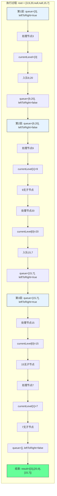

# LeetCode 103 - 二叉树的锯齿形层序遍历

## 1. 题目描述

给你二叉树的根节点 `root`，返回其节点值的 锯齿形层序遍历。（即先从左往右，再从右往左进行下一层遍历，以此类推，层与层之间交替进行）

### 示例 1

```
输入：root = [3,9,20,null,null,15,7]
输出：[[3],[20,9],[15,7]]
```

### 示例 2

```
输入：root = [1]
输出：[[1]]
```

### 示例 3

```
输入：root = []
输出：[]
```

### 约束条件

- 树中节点数目在范围 `[0, 2000]` 内
- `-100 <= Node.val <= 100`

## 2. 解法分析：BFS + 层方向控制

### 核心结论

本题的最优解是广度优先搜索（BFS）+ 层方向控制，其核心优势在于：

1. 自然匹配层序遍历 - BFS天然按层访问节点
1. 方向控制简单 - 通过标志位控制每层方向
1. 时间复杂度最优 - O(n)时间访问所有节点
1. 空间复杂度可控 - O(n)空间存储结果
1. 实现清晰直观 - 代码逻辑易于理解

### 支撑论点

#### A. 为什么BFS+方向控制是最优解？

1. 层序遍历的基础：锯齿形层序遍历是正常层序遍历的变体
1. BFS的特性：按层访问节点，与题目要求完全匹配
1. 方向控制：通过布尔标志位控制每层方向
1. 复用性强：基于102题的BFS实现
1. 性能优异：每个节点仅访问一次，无重复计算

#### B. 与其他算法的对比分析

| 方法                 | 是否可行 | 时间复杂度 | 空间复杂度 | 实现难度 | 特点                   |
| -------------------- | -------- | ---------- | ---------- | -------- | ---------------------- |
| BFS+方向控制（本解） | ✅       | O(n)       | O(n)       | 低       | 面试首选，实现简单     |
| DFS+层数记录         | ✅       | O(n)       | O(n)       | 中       | 需要额外记录层数和方向 |
| 双栈法               | ✅       | O(n)       | O(n)       | 中       | 使用两个栈交替存储     |
| 递归+反转            | ✅       | O(n)       | O(n)       | 中       | 递归栈深度可能过大     |

> BFS+方向控制是最直接、最易于理解的解决方案

#### C. 适用条件与边界

1. 树结构：适用于任何二叉树
1. 空树处理：需特殊处理root为null的情况
1. 节点值范围：题目约束内无影响
1. 方向交替：必须按层交替方向

#### D. 工程实践考量

1. 复用性：基于102题的BFS实现
1. 性能：每层处理完毕后决定方向
1. 可读性：代码逻辑清晰，易于维护
1. 扩展性：可轻松扩展到其他变体

### 总结

广度优先搜索（BFS）+ 层方向控制是本题在理论正确性、思维清晰度和工程表达上的最优平衡点

## 3. 多语言实现与深度解析

### 核心结论

通过四种语言实现，验证算法通用性，并展示不同语言在方向控制和队列操作上的差异

### A. Go 🐹 实现

```go
/
 * Definition for a binary tree node.
 * type TreeNode struct {
 *     Val int
 *     Left *TreeNode
 *     Right *TreeNode
 * }
 */
func zigzagLevelOrder(root *TreeNode) [][]int {
    // 处理空树情况
    if root == nil {
        return [][]int{}
    }

    result := [][]int{}          // 存储最终结果
    queue := []*TreeNode{root}   // 队列初始化，存储当前层节点
    leftToRight := true          // 方向标志：true表示从左到右，false表示从右到左

    for len(queue) > 0 {
        levelSize := len(queue)  // 当前层节点数
        currentLevel := make([]int, levelSize) // 预分配空间，提高性能

        // 遍历当前层所有节点
        for i := 0; i < levelSize; i++ {
            node := queue[0]     // 取队首节点
            queue = queue[1:]    // 出队

            // 根据方向决定节点值的存储位置
            if leftToRight {
                currentLevel[i] = node.Val // 从左到右：正序存储
            } else {
                currentLevel[levelSize-1-i] = node.Val // 从右到左：逆序存储
            }

            // 将子节点入队（先左后右，保持入队顺序）
            if node.Left != nil {
                queue = append(queue, node.Left)
            }
            if node.Right != nil {
                queue = append(queue, node.Right)
            }
        }

        // 将当前层结果加入最终结果
        result = append(result, currentLevel)
        // 切换方向
        leftToRight = !leftToRight
    }

    return result
}
```

#### 算法深入解析

1. 空树处理：`if root == nil` - 空树直接返回空结果
1. 结果存储：`result` - 二维切片存储每层结果
1. 队列初始化：`queue` - 存储当前层节点，初始包含根节点
1. 方向标志：`leftToRight` - 控制当前层的遍历方向
1. 层级循环：`for len(queue) > 0` - 队列非空时继续遍历
1. 层大小记录：`levelSize` - 当前层节点数，用于控制内层循环次数
1. 节点处理：
   - `node := queue[0]` - 取队首节点
   - `queue = queue[1:]` - 出队操作
   - 根据`leftToRight`决定存储位置
1. 子节点入队：将非空左、右子节点加入队列（保持入队顺序）
1. 方向切换：`leftToRight = !leftToRight` - 每层结束时切换方向

设计动机：

- 使用切片模拟队列，简单直接
- 预分配`currentLevel`空间，提高性能
- 通过索引控制存储位置，实现方向切换
- 保持子节点入队顺序，确保下一层处理正确

### B. Python 🐍 实现

```python
# Definition for a binary tree node.
# class TreeNode:
#     def __init__(self, val=0, left=None, right=None):
#         self.val = val
#         self.left = left
#         self.right = right

from collections import deque

class Solution:
    def zigzagLevelOrder(self, root: Optional[TreeNode]) -> List[List[int]]:
        if not root:
            return []

        result = []
        queue = deque([root])
        left_to_right = True  # 方向标志

        while queue:
            level_size = len(queue)
            current_level = [0] * level_size  # 预分配空间

            for i in range(level_size):
                node = queue.popleft()

                # 根据方向决定存储位置
                if left_to_right:
                    current_level[i] = node.val
                else:
                    current_level[level_size - 1 - i] = node.val

                # 子节点入队（先左后右）
                if node.left:
                    queue.append(node.left)
                if node.right:
                    queue.append(node.right)

            result.append(current_level)
            left_to_right = not left_to_right  # 切换方向

        return result
```

#### 算法深入解析

1. 空树处理：`if not root` - Python风格的空检查
1. 队列选择：`deque` - 双端队列，高效出队入队
1. 方向标志：`left_to_right` - 控制当前层方向
1. 预分配空间：`[0] * level_size` - 提高性能
1. 节点处理：
   - `node = queue.popleft()` - 高效出队
   - 根据方向决定存储位置
1. 子节点入队：非空子节点加入队列尾部
1. 方向切换：`left_to_right = not left_to_right` - 每层结束时切换

Python特性：

- 使用`deque`提高出队效率
- 列表预分配空间
- 代码简洁易读

### C. TypeScript 🟦 实现

```typescript
/
 * Definition for a binary tree node.
 * class TreeNode {
 *     val: number
 *     left: TreeNode | null
 *     right: TreeNode | null
 *     constructor(val?: number, left?: TreeNode | null, right?: TreeNode | null) {
 *         this.val = (val===undefined ? 0 : val)
 *         this.left = (left===undefined ? null : left)
 *         this.right = (right===undefined ? null : right)
 *     }
 * }
 */

function zigzagLevelOrder(root: TreeNode | null): number[][] {
    if (!root) {
        return [];
    }

    const result: number[][] = [];
    const queue: TreeNode[] = [root];
    let leftToRight = true;  // 方向标志

    while (queue.length > 0) {
        const levelSize = queue.length;
        const currentLevel: number[] = new Array(levelSize);  // 预分配空间

        for (let i = 0; i < levelSize; i++) {
            const node = queue.shift()!;

            // 根据方向决定存储位置
            if (leftToRight) {
                currentLevel[i] = node.val;
            } else {
                currentLevel[levelSize - 1 - i] = node.val;
            }

            // 子节点入队（先左后右）
            if (node.left) {
                queue.push(node.left);
            }
            if (node.right) {
                queue.push(node.right);
            }
        }

        result.push(currentLevel);
        leftToRight = !leftToRight;  // 切换方向
    }

    return result;
}
```

#### 算法深入解析

1. 空树处理：`if (!root)` - TypeScript风格的空检查
1. 类型定义：`number[][]` - 明确结果类型
1. 方向标志：`leftToRight` - 控制当前层方向
1. 预分配空间：`new Array(levelSize)` - 提高性能
1. 节点处理：
   - `node = queue.shift()!` - 出队操作
   - 根据方向决定存储位置
1. 子节点入队：非空子节点加入队列尾部
1. 方向切换：`leftToRight = !leftToRight` - 每层结束时切换

TypeScript特性：

- 类型注解增强代码安全性
- 非空断言确保类型正确
- 数组预分配空间

注意：TypeScript的`shift()`操作是O(n)时间，在大规模数据时性能较差

### D. Rust 🦀 实现

```rust
// Definition for a binary tree node.
// #[derive(Debug, PartialEq, Eq)]
// pub struct TreeNode {
//   pub val: i32,
//   pub left: Option<Box<TreeNode>>,
//   pub right: Option<Box<TreeNode>>,
// }
//
// impl TreeNode {
//   #[inline]
//   pub fn new(val: i32) -> Self {
//     TreeNode {
//       val,
//       left: None,
//       right: None,
//     }
//   }
// }

use std::collections::VecDeque;

impl Solution {
    pub fn zigzag_level_order(root: Option<Box<TreeNode>>) -> Vec<Vec<i32>> {
        let mut result = Vec::new();
        let mut queue = VecDeque::new();
        let mut left_to_right = true;  // 方向标志

        // 处理根节点
        if let Some(node) = root {
            queue.push_back(node);
        }

        while !queue.is_empty() {
            let level_size = queue.len();
            let mut current_level = vec![0; level_size];  // 预分配空间

            for i in 0..level_size {
                if let Some(node) = queue.pop_front() {
                    // 根据方向决定存储位置
                    if left_to_right {
                        current_level[i] = node.val;
                    } else {
                        current_level[level_size - 1 - i] = node.val;
                    }

                    // 子节点入队（先左后右）
                    if let Some(left) = node.left {
                        queue.push_back(left);
                    }
                    if let Some(right) = node.right {
                        queue.push_back(right);
                    }
                }
            }

            result.push(current_level);
            left_to_right = !left_to_right;  // 切换方向
        }

        result
    }
}
```

#### 算法深入解析

1. 空树处理：`if let Some(node) = root` - Rust的Option模式匹配
1. 队列选择：`VecDeque` - 高效双端队列
1. 方向标志：`left_to_right` - 控制当前层方向
1. 预分配空间：`vec![0; level_size]` - 提高性能
1. 节点处理：
   - `queue.pop_front()` - 高效出队
   - 根据方向决定存储位置
1. 子节点入队：使用`if let`模式匹配处理子节点
1. 方向切换：`left_to_right = !left_to_right` - 每层结束时切换

Rust特性：

- 所有权系统确保内存安全
- 模式匹配确保代码安全
- 高效的内存管理
- 预分配空间提高性能

### E. 性能对比与语言特性分析

| 语言       | 时间复杂度 | 空间复杂度 | 队列实现 | 方向控制 | 特点                  |
| ---------- | ---------- | ---------- | -------- | -------- | --------------------- |
| Go         | O(n)       | O(n)       | 切片     | 索引控制 | 简单高效，面试首选    |
| Python     | O(n)       | O(n)       | deque    | 索引控制 | 简洁高效，代码简洁    |
| TypeScript | O(n²)      | O(n)       | 数组     | 索引控制 | shift()性能差，可优化 |
| Rust       | O(n)       | O(n)       | VecDeque | 索引控制 | 内存安全，性能最优    |

注意：TypeScript的数组shift()操作是O(n)时间，在大规模数据时性能较差，建议使用双端队列库或两个数组交替实现

## 4. 算法可视化与伪代码

### 伪代码

```text
函数 zigzagLevelOrder(root):
    如果 root 为空:
        返回 空列表

    result = 空列表
    queue = 队列([root])
    leftToRight = true  // 方向标志

    当 queue 不为空:
        levelSize = queue 长度
        currentLevel = 长度为 levelSize 的列表

        对于 i 从 0 到 levelSize-1:
            node = queue 出队

            如果 leftToRight 为真:
                currentLevel[i] = node.val
            否则:
                currentLevel[levelSize-1-i] = node.val

            如果 node.left 不为空:
                queue 入队 node.left
            如果 node.right 不为空:
                queue 入队 node.right

        result 添加 currentLevel
        leftToRight = 非 leftToRight  // 切换方向

    返回 result
```

### Mermaid 流程图

```mermaid
flowchart TD
    A[开始: zigzagLevelOrder(root)] --> B{root 为空?}
    B -- 是 --> C[返回 空列表]
    B -- 否 --> D[初始化 result, queue, leftToRight]
    D --> E[queue 入队 root]
    E --> F{queue 为空?}
    F -- 是 --> G[返回 result]
    F -- 否 --> H[levelSize = queue 长度]
    H --> I[初始化 currentLevel]
    I --> J[i = 0]
    J --> K{i < levelSize?}
    K -- 是 --> L[node = queue 出队]
    L --> M{leftToRight?}
    M -- 是 --> N[currentLevel[i] = node.val]
    M -- 否 --> O[currentLevel[levelSize-1-i] = node.val]
    N --> P{node.left 非空?}
    O --> P
    P -- 是 --> Q[queue 入队 node.left]
    P -- 否 --> R{node.right 非空?}
    Q --> R
    R -- 是 --> S[queue 入队 node.right]
    R -- 否 --> T[i = i + 1]
    S --> T
    T --> K
    K -- 否 --> U[result 添加 currentLevel]
    U --> V[切换 leftToRight]
    V --> F
```

### 状态转移图（示例）



## 5. 执行过程演示

### 示例: root = [3,9,20,null,null,15,7]

#### 详细执行步骤

| 层数 | queue状态 | leftToRight | 处理节点 | currentLevel | 子节点入队 | 说明                    |
| ---- | --------- | ----------- | -------- | ------------ | ---------- | ----------------------- |
| 1    | [3]       | true        | 3        | [3]          | 9,20       | 根节点3，入队子节点9,20 |
| 2    | [9,20]    | false       | 9        | [0,9]        | -          | 9存储在索引1（逆序）    |
| 2    | [20]      | false       | 20       | [20,9]       | 15,7       | 20存储在索引0（逆序）   |
| 3    | [15,7]    | true        | 15       | [15,0]       | -          | 15存储在索引0（正序）   |
| 3    | [7]       | true        | 7        | [15,7]       | -          | 7存储在索引1（正序）    |

#### 最终结果

```text
[
    [3],
    [20,9],
    [15,7]
]
```

#### 可执行测试代码（Go）

```go
package main

import "fmt"

type TreeNode struct {
    Val   int
    Left  *TreeNode
    Right *TreeNode
}

func zigzagLevelOrder(root *TreeNode) [][]int {
    if root == nil {
        return [][]int{}
    }

    result := [][]int{}
    queue := []*TreeNode{root}
    leftToRight := true

    for len(queue) > 0 {
        levelSize := len(queue)
        currentLevel := make([]int, levelSize)

        for i := 0; i < levelSize; i++ {
            node := queue[0]
            queue = queue[1:]

            if leftToRight {
                currentLevel[i] = node.Val
            } else {
                currentLevel[levelSize-1-i] = node.Val
            }

            if node.Left != nil {
                queue = append(queue, node.Left)
            }
            if node.Right != nil {
                queue = append(queue, node.Right)
            }
        }

        result = append(result, currentLevel)
        leftToRight = !leftToRight
    }

    return result
}

// 辅助函数：根据层序数组构建二叉树
func buildTree(nums []interface{}) *TreeNode {
    if len(nums) == 0 || nums[0] == nil {
        return nil
    }

    root := &TreeNode{Val: nums[0].(int)}
    queue := []*TreeNode{root}
    i := 1

    for len(queue) > 0 && i < len(nums) {
        node := queue[0]
        queue = queue[1:]

        if i < len(nums) && nums[i] != nil {
            node.Left = &TreeNode{Val: nums[i].(int)}
            queue = append(queue, node.Left)
        }
        i++

        if i < len(nums) && nums[i] != nil {
            node.Right = &TreeNode{Val: nums[i].(int)}
            queue = append(queue, node.Right)
        }
        i++
    }

    return root
}

func main() {
    // Test Case 1
    nums1 := []interface{}{3, 9, 20, nil, nil, 15, 7}
    tree1 := buildTree(nums1)
    fmt.Printf("Test Case 1: %v\n", zigzagLevelOrder(tree1)) // [[3],[20,9],[15,7]]

    // Test Case 2
    nums2 := []interface{}{1}
    tree2 := buildTree(nums2)
    fmt.Printf("Test Case 2: %v\n", zigzagLevelOrder(tree2)) // [[1]]

    // Test Case 3
    nums3 := []interface{}{}
    tree3 := buildTree(nums3)
    fmt.Printf("Test Case 3: %v\n", zigzagLevelOrder(tree3)) // []
}
```

## 6. 复杂度分析

### 核心结论

本算法的时间复杂度为O(n)，空间复杂度为O(n)，其中n为树的节点数

### 支撑论点

#### A. 时间复杂度

- 每个节点访问一次：O(n)
- 队列操作：每个节点入队出队各一次，O(1)操作 × n = O(n)
- 层级处理：外层循环次数等于树的高度h，内层循环总次数为n
- 方向控制：每层O(1)时间切换方向
- 总时间：O(n) + O(n) + O(h) = O(n)

#### B. 空间复杂度

- 结果存储：O(n) - 存储所有节点值
- 队列存储：最坏情况下存储最后一层所有节点，O(n/2) ≈ O(n)
- 方向标志：O(1) - 单个布尔变量
- 总空间：O(n) + O(n) + O(1) = O(n)

#### C. 最好/平均/最坏情况分析

| 情况           | 时间复杂度 | 空间复杂度 | 说明                            |
| -------------- | ---------- | ---------- | ------------------------------- |
| 最好（平衡树） | O(n)       | O(n)       | 队列最大长度为n/2               |
| 平均           | O(n)       | O(n)       | 典型二叉树                      |
| 最坏（退化树） | O(n)       | O(n)       | 队列最大长度为1（每层一个节点） |

#### D. 常数因子分析

- 队列操作开销：入队出队的内存分配和拷贝
- 结果存储开销：二维数组的内存分配
- 方向控制开销：布尔标志切换
- 语言特性影响：
  - Go切片操作高效
  - Python deque高效
  - TypeScript数组shift()低效（可优化）
  - Rust VecDeque高效且安全

#### E. 性能瓶颈与优化

- 瓶颈：队列操作的内存分配和拷贝
- 优化方向：
  - 使用两个队列交替存储当前层和下一层
  - 预分配内存空间（如Go和Rust实现）
  - TypeScript中使用双端队列库

## 7. 技巧归纳与模式抽象

### 核心结论

本题属于"层级遍历变体"模式，核心在于：

1. 复用层序遍历逻辑
1. 层方向控制技巧
1. 索引操作的应用
1. 可扩展到多种层级结构

### 支撑论点

#### A. 模式本质

- 层序遍历的变体：锯齿形层序遍历 = 正常层序遍历 + 方向控制
- 方向控制：通过布尔标志位控制每层方向
- 索引操作：通过索引控制节点值的存储位置
- 复用性：直接基于102题的BFS实现
- 扩展性：可应用于其他需要方向控制的场景

#### B. 相似题目映射

| 题号 | 题目                | 核心思想               | 匹配模式 |
| ---- | ------------------- | ---------------------- | -------- |
| 103  | 本题                | 锯齿形层序遍历         | 核心模式 |
| 102  | 二叉树的层序遍历    | 正常层序遍历           | 基础模式 |
| 107  | 二叉树的层序遍历 II | 自底向上层序遍历       | 模式变体 |
| 429  | N叉树的层序遍历     | N叉树层序遍历          | 模式扩展 |
| 199  | 二叉树的右视图      | 层序遍历取每层最后一个 | 模式应用 |
| 637  | 二叉树的层平均值    | 层序遍历计算平均值     | 模式应用 |

#### C. 模式泛化

- 方向控制：任何需要按层控制方向的遍历
- 多叉树：N叉树的锯齿形遍历
- 图遍历：图的锯齿形层级遍历
- 组织结构：交替方向展示公司结构
- 文件系统：交替方向展示目录树

#### D. 工业应用

- 组织结构图：交替方向展示员工-经理关系
- 文件系统：交替方向展示目录结构
- 网络路由：按跳数交替方向展示路由路径
- 游戏AI：按距离交替方向搜索目标
- 数据库索引：B树的锯齿形层级遍历

#### E. 算法深入解析

1. 为什么选择索引控制而不是反转？
   - 索引控制在遍历过程中完成方向控制
   - 反转需要额外的O(n)时间和空间
   - 索引控制更符合实时处理的要求

1. 为什么必须保持子节点入队顺序？
   - 子节点入队顺序决定了下一层的处理顺序
   - 必须保持先左后右的入队顺序
   - 否则会导致方向控制逻辑错误

1. 方向标志的作用是什么？
   - 控制当前层的遍历方向
   - 决定节点值的存储位置
   - 每层结束时切换方向

## 8. 面试追问与回答策略

### 核心结论

面试追问考察：

1. 对BFS和方向控制的理解
1. 复杂度分析与优化能力
1. 从基础到变体的扩展能力
1. 不同实现方式的权衡

### A. 基础追问

#### Q1: 为什么选择BFS而不是DFS？

→ 标准: BFS天然按层访问，与层序遍历完全匹配
→ 加分: DFS需要额外记录层数和方向，实现复杂

#### Q2: 如何处理空树的情况？

→ 标准: 在函数开始时检查root是否为null
→ 加分: 提供具体代码实现，展示边界处理

#### Q3: 方向标志的作用是什么？

→ 标准: 控制当前层的遍历方向
→ 加分: 说明每层结束时切换方向，决定节点值的存储位置

#### Q4: 为什么必须保持子节点入队顺序？

→ 标准: 子节点入队顺序决定了下一层的处理顺序
→ 加分: 说明必须保持先左后右的入队顺序，否则方向控制逻辑错误

### B. 高阶追问

#### Q1: 如何实现双栈法的锯齿形层序遍历？

→ 标准: 使用两个栈交替存储当前层和下一层节点
→ 加分: 提供具体实现

```go
// 双栈法实现
func zigzagLevelOrderTwoStacks(root *TreeNode) [][]int {
    if root == nil {
        return [][]int{}
    }

    result := [][]int{}
    currentStack := []*TreeNode{root}
    nextStack := []*TreeNode{}
    leftToRight := true

    for len(currentStack) > 0 {
        levelSize := len(currentStack)
        currentLevel := make([]int, levelSize)

        for i := 0; i < levelSize; i++ {
            node := currentStack[len(currentStack)-1]
            currentStack = currentStack[:len(currentStack)-1]

            if leftToRight {
                currentLevel[i] = node.Val
            } else {
                currentLevel[levelSize-1-i] = node.Val
            }

            // 根据方向决定子节点入栈顺序
            if leftToRight {
                if node.Left != nil {
                    nextStack = append(nextStack, node.Left)
                }
                if node.Right != nil {
                    nextStack = append(nextStack, node.Right)
                }
            } else {
                if node.Right != nil {
                    nextStack = append(nextStack, node.Right)
                }
                if node.Left != nil {
                    nextStack = append(nextStack, node.Left)
                }
            }
        }

        result = append(result, currentLevel)
        currentStack, nextStack = nextStack, currentStack
        nextStack = nextStack[:0]  // 清空nextStack
        leftToRight = !leftToRight
    }

    return result
}
```

#### Q2: 如何实现N叉树的锯齿形层序遍历？

→ 标准: 复用N叉树层序遍历逻辑，增加方向控制
→ 加分: 提供具体实现

```go
// N叉树节点定义
type Node struct {
    Val int
    Children []*Node
}

func zigzagLevelOrderN(root *Node) [][]int {
    if root == nil {
        return [][]int{}
    }

    result := [][]int{}
    queue := []*Node{root}
    leftToRight := true

    for len(queue) > 0 {
        levelSize := len(queue)
        currentLevel := make([]int, levelSize)

        for i := 0; i < levelSize; i++ {
            node := queue[0]
            queue = queue[1:]

            if leftToRight {
                currentLevel[i] = node.Val
            } else {
                currentLevel[levelSize-1-i] = node.Val
            }

            // 遍历所有子节点
            for _, child := range node.Children {
                queue = append(queue, child)
            }
        }

        result = append(result, currentLevel)
        leftToRight = !leftToRight
    }

    return result
}
```

#### Q3: 如何优化TypeScript的实现？

→ 标准: 使用双端队列库或两个数组交替
→ 加分: 提供优化后的代码

```typescript
// 优化版：使用两个数组交替
function zigzagLevelOrderOptimized(root: TreeNode | null): number[][] {
  if (!root) return [];

  const result: number[][] = [];
  let currentLevelNodes: TreeNode[] = [root];
  let leftToRight = true;

  while (currentLevelNodes.length > 0) {
    const currentLevel: number[] = [];
    const nextLevelNodes: TreeNode[] = [];

    for (const node of currentLevelNodes) {
      currentLevel.push(node.val);
      if (node.left) nextLevelNodes.push(node.left);
      if (node.right) nextLevelNodes.push(node.right);
    }

    // 根据方向决定是否反转当前层
    if (!leftToRight) {
      currentLevel.reverse();
    }

    result.push(currentLevel);
    currentLevelNodes = nextLevelNodes;
    leftToRight = !leftToRight;
  }

  return result;
}
```

#### Q4: 如何实现二叉树的螺旋形遍历？

→ 标准: 锯齿形层序遍历的变体，增加旋转角度控制
→ 加分: 提供具体实现思路

```go
// 螺旋形遍历（0°, 90°, 180°, 270°交替）
func spiralOrder(root *TreeNode) [][]int {
    if root == nil {
        return [][]int{}
    }

    result := [][]int{}
    queue := []*TreeNode{root}
    directions := []int{0, 1, 2, 3} // 0:左→右, 1:上→下, 2:右→左, 3:下→上
    dirIndex := 0

    for len(queue) > 0 {
        levelSize := len(queue)
        currentLevel := make([]int, levelSize)

        for i := 0; i < levelSize; i++ {
            node := queue[0]
            queue = queue[1:]

            switch directions[dirIndex % 4] {
            case 0: // 左→右
                currentLevel[i] = node.Val
            case 1: // 上→下（需要特殊处理，通常需要矩阵表示）
                // 此处简化处理，实际需要更复杂的数据结构
                currentLevel[i] = node.Val
            case 2: // 右→左
                currentLevel[levelSize-1-i] = node.Val
            case 3: // 下→上（需要特殊处理）
                currentLevel[levelSize-1-i] = node.Val
            }

            if node.Left != nil {
                queue = append(queue, node.Left)
            }
            if node.Right != nil {
                queue = append(queue, node.Right)
            }
        }

        result = append(result, currentLevel)
        dirIndex++
    }

    return result
}
```

## 9. 复习要点提炼

### 核心结论

掌握本题关键：

1. BFS与方向控制的结合
1. 索引操作的应用
1. 层序遍历的变体
1. 多语言实现的差异

### A. 关键记忆点(🌟)

| 记忆点         | 口诀                           |
| -------------- | ------------------------------ |
| 锯齿形遍历核心 | 正常层序遍历 + 方向控制        |
| 方向控制       | 布尔标志 + 索引操作            |
| 子节点入队     | 保持先左后右的顺序             |
| 空树处理       | 先检查root为空                 |
| 时间复杂度     | O(n)遍历 + O(1)方向控制 = O(n) |

### B. 易错陷阱(⚠️)

| 错误类型           | 触发场景           | 应对措施                      |
| ------------------ | ------------------ | ----------------------------- |
| 忘记切换方向       | 所有层同一方向     | 每层结束时切换leftToRight     |
| 子节点入队顺序错误 | 方向控制逻辑错误   | 保持先左后右的入队顺序        |
| 空树未处理         | root为null时崩溃   | 函数开始检查root为空          |
| 索引计算错误       | 逆序存储位置错误   | 使用levelSize-1-i计算逆序位置 |
| 队列操作错误       | 切片越界或内存泄漏 | 确保出队入队操作正确          |

### C. 面试评分关键词(✅)

| 关键词              | 应用场景           |
| ------------------- | ------------------ |
| 广度优先搜索（BFS） | 描述算法选择       |
| 方向控制            | 说明锯齿形实现     |
| 索引操作            | 解释节点值存储位置 |
| 层序遍历变体        | 命名算法范式       |
| 时间复杂度O(n)      | 复杂度分析         |
| 空间复杂度O(n)      | 复杂度分析         |

### D. 复习建议(📚🚀)

```
核心模式: 层级遍历变体（锯齿形）
├── 必要条件: BFS + 方向控制
├── 本质: 层序遍历 + 方向交替
├── 方法: BFS + 布尔标志
│   ├── 队列初始化: [root]
│   ├── 外层循环: 队列非空
│   ├── 内层循环: 当前层所有节点
│   ├── 方向控制: leftToRight标志
│   ├── 索引操作: 根据方向决定存储位置
│   └── 方向切换: 每层结束时切换
├── 优化: 双栈法、预分配空间
├── 变体: N叉树、螺旋形遍历
└── 应用: 组织结构、文件系统、网络路由
```

### E. 解题模板

```text
// 基础版（BFS+方向控制）
函数 zigzagLevelOrder(root):
    if root 为空: return []
    result = []
    queue = [root]
    leftToRight = true

    while queue 不为空:
        levelSize = queue 长度
        currentLevel = 长度为 levelSize 的列表

        for i 从 0 到 levelSize-1:
            node = queue 出队

            if leftToRight:
                currentLevel[i] = node.val
            else:
                currentLevel[levelSize-1-i] = node.val

            if node.left 非空: queue 入队 node.left
            if node.right 非空: queue 入队 node.right

        result 添加 currentLevel
        leftToRight = 非 leftToRight

    return result

// 优化版（双栈法）
函数 zigzagLevelOrderTwoStacks(root):
    if root 为空: return []
    result = []
    currentStack = [root]
    nextStack = []
    leftToRight = true

    while currentStack 不为空:
        levelSize = currentStack 长度
        currentLevel = 长度为 levelSize 的列表

        for i 从 0 到 levelSize-1:
            node = currentStack 出栈

            if leftToRight:
                currentLevel[i] = node.val
            else:
                currentLevel[levelSize-1-i] = node.val

            if leftToRight:
                if node.left 非空: nextStack 入栈 node.left
                if node.right 非空: nextStack 入栈 node.right
            else:
                if node.right 非空: nextStack 入栈 node.right
                if node.left 非空: nextStack 入栈 node.left

        result 添加 currentLevel
        currentStack, nextStack = nextStack, currentStack
        清空 nextStack
        leftToRight = 非 leftToRight

    return result
```

### 总结

将上述要点融会贯通，即可在面试中快速准确解决锯齿形层序遍历相关问题，并展现对树结构遍历算法的深刻理解。🎉
