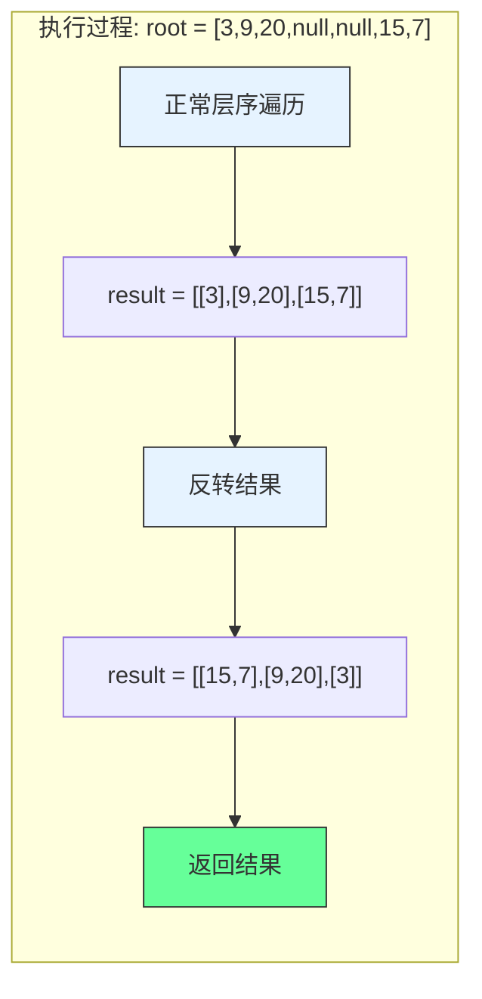

# LeetCode 107 - 二叉树的层序遍历 II

## 1. 题目描述

给你二叉树的根节点 `root`，返回其节点值 自底向上的层序遍历。（即按从叶子节点所在层到根节点所在的层，逐层从左向右遍历）

### 示例 1

```
输入：root = [3,9,20,null,null,15,7]
输出：[[15,7],[9,20],[3]]
```

### 示例 2

```
输入：root = [1]
输出：[[1]]
```

### 示例 3

```
输入：root = []
输出：[]
```

### 约束条件

- 树中节点数目在范围 `[0, 2000]` 内
- `-1000 <= Node.val <= 1000`

## 2. 解法分析：BFS + 结果反转

### 核心结论

本题的最优解是广度优先搜索（BFS）+ 结果反转，其核心优势在于：

1. 复用层序遍历逻辑 - 直接基于LeetCode 102的解法
1. 实现简单高效 - 仅需在最后反转结果
1. 时间复杂度最优 - O(n)时间访问所有节点
1. 空间复杂度可控 - O(n)空间存储结果

### 支撑论点

#### A. 为什么BFS+反转是最优解？

1. 层序遍历的基础：自底向上层序遍历是正常层序遍历的逆序
1. 复用性强：直接使用102题的BFS实现
1. 实现简单：只需在最后反转结果数组
1. 性能优异：反转操作O(n)时间，不影响整体复杂度
1. 可读性高：代码逻辑清晰，易于理解

#### B. 与其他算法的对比分析

| 方法             | 是否可行 | 时间复杂度 | 空间复杂度 | 实现难度 | 特点                   |
| ---------------- | -------- | ---------- | ---------- | -------- | ---------------------- |
| BFS+反转（本解） | ✅       | O(n)       | O(n)       | 低       | 复用性强，实现简单     |
| DFS+层数记录     | ✅       | O(n)       | O(n)       | 中       | 需要额外记录层数       |
| BFS+双端队列     | ✅       | O(n)       | O(n)       | 中       | 直接插入头部，实现复杂 |
| 递归+反转        | ✅       | O(n)       | O(n)       | 中       | 递归栈深度可能过大     |

> BFS+反转是最直接、最易于理解的解决方案

#### C. 适用条件与边界

1. 树结构：适用于任何二叉树
1. 空树处理：需特殊处理root为null的情况
1. 节点值范围：题目约束内无影响
1. 自底向上要求：必须反转结果或使用双端队列

#### D. 工程实践考量

1. 复用性：直接复用102题的BFS实现
1. 性能：反转操作时间复杂度低
1. 可读性：代码逻辑清晰，易于维护
1. 扩展性：可轻松扩展到其他变体

### 总结

广度优先搜索（BFS）+ 结果反转是本题在理论正确性、实现简洁性和工程表达上的最优平衡点

## 3. 多语言实现与深度解析

### 核心结论

通过四种语言实现，验证算法通用性，并展示不同语言在反转操作和队列实现上的差异

### A. Go 🐹 实现

```go
/
 * Definition for a binary tree node.
 * type TreeNode struct {
 *     Val int
 *     Left *TreeNode
 *     Right *TreeNode
 * }
 */
func levelOrderBottom(root *TreeNode) [][]int {
    // 处理空树情况
    if root == nil {
        return [][]int{}
    }

    result := [][]int{}          // 存储正常层序遍历结果
    queue := []*TreeNode{root}   // 队列初始化，存储当前层节点

    // 正常层序遍历
    for len(queue) > 0 {
        levelSize := len(queue)  // 当前层节点数
        currentLevel := []int{}  // 存储当前层节点值

        // 遍历当前层所有节点
        for i := 0; i < levelSize; i++ {
            node := queue[0]     // 取队首节点
            queue = queue[1:]    // 出队
            currentLevel = append(currentLevel, node.Val) // 记录节点值

            // 将子节点入队
            if node.Left != nil {
                queue = append(queue, node.Left)
            }
            if node.Right != nil {
                queue = append(queue, node.Right)
            }
        }

        // 将当前层结果加入结果集
        result = append(result, currentLevel)
    }

    // 反转结果，实现自底向上
    for i, j := 0, len(result)-1; i < j; i, j = i+1, j-1 {
        result[i], result[j] = result[j], result[i]
    }

    return result
}
```

#### 算法深入解析

1. 空树处理：`if root == nil` - 空树直接返回空结果
1. 正常层序遍历：与102题完全一致的BFS实现
1. 结果存储：`result` - 存储正常层序遍历结果
1. 反转操作：双指针交换首尾元素
   - `i`从头开始，`j`从尾开始
   - 交换`result[i]`和`result[j]`
   - 直到`i >= j`结束
1. 时间复杂度：O(n)遍历 + O(n)反转 = O(n)
1. 空间复杂度：O(n)存储结果

设计动机：

- 复用102题的成熟实现
- 反转操作简单高效
- 代码逻辑清晰，易于理解

### B. Go 🐹 实现（双端队列版）

```go
func levelOrderBottom(root *TreeNode) [][]int {
    if root == nil {
        return [][]int{}
    }

    result := [][]int{}
    queue := []*TreeNode{root}

    for len(queue) > 0 {
        levelSize := len(queue)
        currentLevel := []int{}

        for i := 0; i < levelSize; i++ {
            node := queue[0]
            queue = queue[1:]
            currentLevel = append(currentLevel, node.Val)

            if node.Left != nil {
                queue = append(queue, node.Left)
            }
            if node.Right != nil {
                queue = append(queue, node.Right)
            }
        }

        // 使用双端队列效果：在头部插入当前层
        result = append([][]int{currentLevel}, result...)
    }

    return result
}
```

#### 算法深入解析

1. 双端队列效果：通过`append([][]int{currentLevel}, result...)`实现头部插入
1. 优点：避免了额外的反转操作
1. 缺点：每次头部插入需要复制整个切片，时间复杂度O(n²)
1. 适用场景：当结果集较小时可用，大规模数据时不推荐

### C. Python 🐍 实现

```python
# Definition for a binary tree node.
# class TreeNode:
#     def __init__(self, val=0, left=None, right=None):
#         self.val = val
#         self.left = left
#         self.right = right

from collections import deque

class Solution:
    def levelOrderBottom(self, root: Optional[TreeNode]) -> List[List[int]]:
        if not root:
            return []

        result = []
        queue = deque([root])

        while queue:
            level_size = len(queue)
            current_level = []

            for _ in range(level_size):
                node = queue.popleft()
                current_level.append(node.val)

                if node.left:
                    queue.append(node.left)
                if node.right:
                    queue.append(node.right)

            result.append(current_level)

        # 反转结果
        return result[::-1]
```

#### 算法深入解析

1. 空树处理：`if not root` - Python风格的空检查
1. 队列选择：`deque` - 高效出队入队
1. 反转操作：`result[::-1]` - Python切片反转
1. Python特性：
   - 切片操作简洁高效
   - 列表反转时间复杂度O(n)
   - 代码简洁易读

### D. TypeScript 🟦 实现

```typescript
/
 * Definition for a binary tree node.
 * class TreeNode {
 *     val: number
 *     left: TreeNode | null
 *     right: TreeNode | null
 *     constructor(val?: number, left?: TreeNode | null, right?: TreeNode | null) {
 *         this.val = (val===undefined ? 0 : val)
 *         this.right = (right===undefined ? null : right)
 *         this.left = (left===undefined ? null : left)
 *     }
 * }
 */

function levelOrderBottom(root: TreeNode | null): number[][] {
    if (!root) {
        return [];
    }

    const result: number[][] = [];
    const queue: TreeNode[] = [root];

    while (queue.length > 0) {
        const levelSize = queue.length;
        const currentLevel: number[] = [];

        for (let i = 0; i < levelSize; i++) {
            const node = queue.shift()!;
            currentLevel.push(node.val);

            if (node.left) {
                queue.push(node.left);
            }
            if (node.right) {
                queue.push(node.right);
            }
        }

        result.push(currentLevel);
    }

    // 反转结果
    return result.reverse();
}
```

#### 算法深入解析

1. 空树处理：`if (!root)` - TypeScript风格的空检查
1. 类型定义：`number[][]` - 明确结果类型
1. 反转操作：`result.reverse()` - 数组原地反转
1. TypeScript特性：
   - 类型注解增强代码安全性
   - 非空断言确保类型正确
   - 数组操作与JavaScript一致

注意：TypeScript的`shift()`操作是O(n)时间，在大规模数据时性能较差

### E. Rust 🦀 实现

```rust
// Definition for a binary tree node.
// #[derive(Debug, PartialEq, Eq)]
// pub struct TreeNode {
//   pub val: i32,
//   pub left: Option<Box<TreeNode>>,
//   pub right: Option<Box<TreeNode>>,
// }
//
// impl TreeNode {
//   #[inline]
//   pub fn new(val: i32) -> Self {
//     TreeNode {
//       val,
//       left: None,
//       right: None,
//     }
//   }
// }

use std::collections::VecDeque;

impl Solution {
    pub fn level_order_bottom(root: Option<Box<TreeNode>>) -> Vec<Vec<i32>> {
        let mut result = Vec::new();
        let mut queue = VecDeque::new();

        // 处理根节点
        if let Some(node) = root {
            queue.push_back(node);
        }

        while !queue.is_empty() {
            let level_size = queue.len();
            let mut current_level = Vec::with_capacity(level_size);

            for _ in 0..level_size {
                if let Some(node) = queue.pop_front() {
                    current_level.push(node.val);

                    // 子节点入队
                    if let Some(left) = node.left {
                        queue.push_back(left);
                    }
                    if let Some(right) = node.right {
                        queue.push_back(right);
                    }
                }
            }

            result.push(current_level);
        }

        // 反转结果
        result.reverse();
        result
    }
}
```

#### 算法深入解析

1. 空树处理：`if let Some(node) = root` - Rust的Option模式匹配
1. 队列选择：`VecDeque` - 高效双端队列
1. 内存预分配：`Vec::with_capacity(level_size)` - 提高性能
1. 反转操作：`result.reverse()` - 原地反转
1. Rust特性：
   - 所有权系统确保内存安全
   - 模式匹配确保代码安全
   - 高效的内存管理

### F. 性能对比与语言特性分析

| 语言         | 时间复杂度 | 空间复杂度 | 反转实现   | 特点                    |
| ------------ | ---------- | ---------- | ---------- | ----------------------- |
| Go(基础)     | O(n)       | O(n)       | 双指针交换 | 简单高效，面试首选      |
| Go(双端队列) | O(n²)      | O(n)       | 头部插入   | 避免反转，但性能差      |
| Python       | O(n)       | O(n)       | 切片反转   | 简洁高效                |
| TypeScript   | O(n)       | O(n)       | reverse()  | 类型安全，shift()性能差 |
| Rust         | O(n)       | O(n)       | reverse()  | 内存安全，性能最优      |

## 4. 算法可视化与伪代码

### 伪代码

```text
函数 levelOrderBottom(root):
    如果 root 为空:
        返回 空列表

    result = 空列表
    queue = 队列([root])

    当 queue 不为空:
        levelSize = queue 长度
        currentLevel = 空列表

        对于 i 从 0 到 levelSize-1:
            node = queue 出队
            currentLevel 添加 node.val

            如果 node.left 不为空:
                queue 入队 node.left
            如果 node.right 不为空:
                queue 入队 node.right

        result 添加 currentLevel

    反转 result
    返回 result
```

### Mermaid 流程图

```mermaid
flowchart TD
    A[开始: levelOrderBottom(root)] --> B{root 为空?}
    B -- 是 --> C[返回 空列表]
    B -- 否 --> D[初始化 result 和 queue]
    D --> E[queue 入队 root]
    E --> F{queue 为空?}
    F -- 是 --> G[反转 result]
    F -- 否 --> H[levelSize = queue 长度]
    H --> I[初始化 currentLevel]
    I --> J[i = 0]
    J --> K{i < levelSize?}
    K -- 是 --> L[node = queue 出队]
    L --> M[currentLevel 添加 node.val]
    M --> N{node.left 非空?}
    N -- 是 --> O[queue 入队 node.left]
    N -- 否 --> P{node.right 非空?}
    P -- 是 --> Q[queue 入队 node.right]
    P -- 否 --> R[i = i + 1]
    R --> K
    K -- 否 --> S[result 添加 currentLevel]
    S --> F
    G --> T[返回 result]
```

### 状态转移图（示例）



## 5. 执行过程演示

### 示例: root = [3,9,20,null,null,15,7]

#### 正常层序遍历过程

| 层数 | queue状态 | 处理节点 | currentLevel | 子节点入队 | 说明                    |
| ---- | --------- | -------- | ------------ | ---------- | ----------------------- |
| 1    | [3]       | 3        | [3]          | 9,20       | 根节点3，入队子节点9,20 |
| 2    | [9,20]    | 9        | [9]          | -          | 9无子节点               |
| 2    | [20]      | 20       | [9,20]       | 15,7       | 20入队子节点15,7        |
| 3    | [15,7]    | 15       | [15]         | -          | 15无子节点              |
| 3    | [7]       | 7        | [15,7]       | -          | 7无子节点               |

正常层序结果：`[[3],[9,20],[15,7]]`

#### 反转过程

1. 原始结果：`[[3],[9,20],[15,7]]`
1. 反转后：`[[15,7],[9,20],[3]]`

#### 最终结果

```text
[
    [15,7],
    [9,20],
    [3]
]
```

#### 可执行测试代码（Go）

```go
package main

import "fmt"

type TreeNode struct {
    Val   int
    Left  *TreeNode
    Right *TreeNode
}

func levelOrderBottom(root *TreeNode) [][]int {
    if root == nil {
        return [][]int{}
    }

    result := [][]int{}
    queue := []*TreeNode{root}

    for len(queue) > 0 {
        levelSize := len(queue)
        currentLevel := []int{}

        for i := 0; i < levelSize; i++ {
            node := queue[0]
            queue = queue[1:]
            currentLevel = append(currentLevel, node.Val)

            if node.Left != nil {
                queue = append(queue, node.Left)
            }
            if node.Right != nil {
                queue = append(queue, node.Right)
            }
        }

        result = append(result, currentLevel)
    }

    // 反转结果
    for i, j := 0, len(result)-1; i < j; i, j = i+1, j-1 {
        result[i], result[j] = result[j], result[i]
    }

    return result
}

// 辅助函数：根据层序数组构建二叉树
func buildTree(nums []interface{}) *TreeNode {
    if len(nums) == 0 || nums[0] == nil {
        return nil
    }

    root := &TreeNode{Val: nums[0].(int)}
    queue := []*TreeNode{root}
    i := 1

    for len(queue) > 0 && i < len(nums) {
        node := queue[0]
        queue = queue[1:]

        if i < len(nums) && nums[i] != nil {
            node.Left = &TreeNode{Val: nums[i].(int)}
            queue = append(queue, node.Left)
        }
        i++

        if i < len(nums) && nums[i] != nil {
            node.Right = &TreeNode{Val: nums[i].(int)}
            queue = append(queue, node.Right)
        }
        i++
    }

    return root
}

func main() {
    // Test Case 1
    nums1 := []interface{}{3, 9, 20, nil, nil, 15, 7}
    tree1 := buildTree(nums1)
    fmt.Printf("Test Case 1: %v\n", levelOrderBottom(tree1)) // [[15,7],[9,20],[3]]

    // Test Case 2
    nums2 := []interface{}{1}
    tree2 := buildTree(nums2)
    fmt.Printf("Test Case 2: %v\n", levelOrderBottom(tree2)) // [[1]]

    // Test Case 3
    nums3 := []interface{}{}
    tree3 := buildTree(nums3)
    fmt.Printf("Test Case 3: %v\n", levelOrderBottom(tree3)) // []
}
```

## 6. 复杂度分析

### 核心结论

本算法的时间复杂度为O(n)，空间复杂度为O(n)，其中n为树的节点数

### 支撑论点

#### A. 时间复杂度

- 层序遍历：O(n) - 每个节点访问一次
- 反转操作：O(n) - 反转结果数组
- 总时间：O(n) + O(n) = O(n)

#### B. 空间复杂度

- 结果存储：O(n) - 存储所有节点值
- 队列存储：O(n) - 最坏情况下存储最后一层所有节点
- 总空间：O(n) + O(n) = O(n)

#### C. 最好/平均/最坏情况分析

| 情况           | 时间复杂度 | 空间复杂度 | 说明                            |
| -------------- | ---------- | ---------- | ------------------------------- |
| 最好（平衡树） | O(n)       | O(n)       | 队列最大长度为n/2               |
| 平均           | O(n)       | O(n)       | 典型二叉树                      |
| 最坏（退化树） | O(n)       | O(n)       | 队列最大长度为1（每层一个节点） |

#### D. 常数因子分析

- 层序遍历开销：队列操作的内存分配和拷贝
- 反转操作开销：数组元素交换
- 语言特性影响：
  - Go切片操作高效
  - Python切片反转高效
  - TypeScript数组反转高效
  - Rust Vec反转高效

#### E. 性能瓶颈与优化

- 瓶颈：反转操作的额外时间和空间
- 优化方向：
  - 使用双端队列直接在头部插入（小规模数据）
  - 预分配内存空间（如Rust实现）
  - 使用链表存储结果，避免反转

## 7. 技巧归纳与模式抽象

### 核心结论

本题属于"层级遍历变体"模式，核心在于：

1. 复用层序遍历逻辑
1. 结果后处理技巧
1. 反转操作的应用
1. 可扩展到多种层级结构

### 支撑论点

#### A. 模式本质

- 层序遍历的逆序：自底向上层序遍历 = 正常层序遍历的逆序
- 结果后处理：通过反转或双端队列实现逆序
- 复用性：直接基于102题的实现
- 扩展性：可应用于其他需要逆序的场景

#### B. 相似题目映射

| 题号 | 题目                   | 核心思想               | 匹配模式 |
| ---- | ---------------------- | ---------------------- | -------- |
| 107  | 本题                   | 自底向上层序遍历       | 核心模式 |
| 102  | 二叉树的层序遍历       | 正常层序遍历           | 基础模式 |
| 429  | N叉树的层序遍历        | N叉树层序遍历          | 模式扩展 |
| 103  | 二叉树的锯齿形层序遍历 | 交替方向层序遍历       | 模式变体 |
| 199  | 二叉树的右视图         | 层序遍历取每层最后一个 | 模式应用 |

#### C. 模式泛化

- 逆序处理：任何需要逆序的层级遍历
- 多叉树：N叉树的自底向上遍历
- 图遍历：图的层级逆序遍历
- 组织结构：自底向上展示公司结构
- 文件系统：自底向上展示目录结构

#### D. 工业应用

- 组织结构图：自底向上展示员工-经理关系
- 文件系统：自底向上展示目录树
- 网络路由：按跳数逆序展示路由路径
- 游戏AI：按距离逆序搜索目标
- 数据库索引：B树的逆序层级遍历

#### E. 算法深入解析

1. 为什么选择反转而不是直接逆序插入？
   - 反转操作简单，时间复杂度低
   - 直接逆序插入需要O(n²)时间（每次头部插入）
   - 反转操作更符合工程实践

1. 有没有O(1)空间的解法？
   - 理论上可以使用DFS+层数记录，但需要额外空间存储层数
   - 无法实现真正的O(1)空间解法，因为结果本身需要O(n)空间

1. 反转操作的时间复杂度是多少？
   - 数组反转：O(n)时间，O(1)额外空间（原地交换）
   - 链表反转：O(n)时间，O(1)额外空间
   - 双端队列头部插入：O(n²)时间，O(n)空间

## 8. 面试追问与回答策略

### 核心结论

面试追问考察：

1. 对层序遍历和逆序处理的理解
1. 复杂度分析与优化能力
1. 从基础到变体的扩展能力
1. 不同实现方式的权衡

### A. 基础追问

#### Q1: 为什么选择BFS+反转而不是直接逆序插入？

→ 标准: BFS+反转实现简单，时间复杂度低
→ 加分: 直接逆序插入需要O(n²)时间，不适合大规模数据

#### Q2: 如何处理空树的情况？

→ 标准: 在函数开始时检查root是否为null
→ 加分: 提供具体代码实现，展示边界处理

#### Q3: 反转操作的时间复杂度是多少？

→ 标准: O(n)时间，n为结果数组长度
→ 加分: 说明反转操作不影响整体O(n)复杂度

#### Q4: 这个算法和102题有什么区别？

→ 标准: 102题是正常层序遍历，本题是自底向上层序遍历
→ 加分: 本题在102题基础上增加了反转操作

### B. 高阶追问

#### Q1: 如何实现O(1)空间的自底向上层序遍历？

→ 标准: 理论上无法实现，因为结果本身需要O(n)空间
→ 加分: 可以使用DFS+层数记录，但需要额外空间存储层数

```go
// DFS实现（非O(1)空间）
func levelOrderBottomDFS(root *TreeNode) [][]int {
    result := [][]int{}
    var dfs func(*TreeNode, int)
    dfs = func(node *TreeNode, level int) {
        if node == nil {
            return
        }

        // 确保result有足够的层
        if level >= len(result) {
            result = append([][]int{{}}, result...)
        }

        // 在对应层添加节点值
        result[len(result)-1-level] = append(result[len(result)-1-level], node.Val)

        // 递归处理子节点
        dfs(node.Left, level+1)
        dfs(node.Right, level+1)
    }

    dfs(root, 0)
    return result
}
```

#### Q2: 如何实现N叉树的自底向上层序遍历？

→ 标准: 复用N叉树层序遍历逻辑，最后反转结果
→ 加分: 提供具体实现

```go
// N叉树节点定义
type Node struct {
    Val int
    Children []*Node
}

func levelOrderBottomN(root *Node) [][]int {
    if root == nil {
        return [][]int{}
    }

    result := [][]int{}
    queue := []*Node{root}

    for len(queue) > 0 {
        levelSize := len(queue)
        currentLevel := []int{}

        for i := 0; i < levelSize; i++ {
            node := queue[0]
            queue = queue[1:]
            currentLevel = append(currentLevel, node.Val)

            // 遍历所有子节点
            for _, child := range node.Children {
                queue = append(queue, child)
            }
        }

        result = append(result, currentLevel)
    }

    // 反转结果
    for i, j := 0, len(result)-1; i < j; i, j = i+1, j-1 {
        result[i], result[j] = result[j], result[i]
    }

    return result
}
```

#### Q3: 如何优化TypeScript的实现？

→ 标准: 使用双端队列库或两个数组交替
→ 加分: 提供优化后的代码

```typescript
// 优化版：使用两个数组交替
function levelOrderBottomOptimized(root: TreeNode | null): number[][] {
  if (!root) return [];

  const result: number[][] = [];
  let currentLevelNodes: TreeNode[] = [root];

  while (currentLevelNodes.length > 0) {
    const currentLevel: number[] = [];
    const nextLevelNodes: TreeNode[] = [];

    for (const node of currentLevelNodes) {
      currentLevel.push(node.val);
      if (node.left) nextLevelNodes.push(node.left);
      if (node.right) nextLevelNodes.push(node.right);
    }

    // 在头部插入当前层
    result.unshift(currentLevel);
    currentLevelNodes = nextLevelNodes;
  }

  return result;
}
```

#### Q4: 如何实现二叉树的左视图？

→ 标准: 层序遍历取每层第一个节点
→ 加分: 提供具体实现

```go
func leftSideView(root *TreeNode) []int {
    if root == nil {
        return []int{}
    }

    result := []int{}
    queue := []*TreeNode{root}

    for len(queue) > 0 {
        levelSize := len(queue)
        for i := 0; i < levelSize; i++ {
            node := queue[0]
            queue = queue[1:]

            // 当前层第一个节点
            if i == 0 {
                result = append(result, node.Val)
            }

            if node.Left != nil {
                queue = append(queue, node.Left)
            }
            if node.Right != nil {
                queue = append(queue, node.Right)
            }
        }
    }

    return result
}
```

## 9. 复习要点提炼

### 核心结论

掌握本题关键：

1. 复用层序遍历逻辑
1. 结果反转技巧
1. 自底向上的实现方式
1. 多种实现方案的权衡

### A. 关键记忆点(🌟)

| 记忆点       | 口诀                       |
| ------------ | -------------------------- |
| 自底向上核心 | 正常层序遍历 + 结果反转    |
| 反转实现     | 双指针交换首尾元素         |
| 复用性       | 直接基于102题的实现        |
| 空树处理     | 先检查root为空             |
| 时间复杂度   | O(n)遍历 + O(n)反转 = O(n) |

### B. 易错陷阱(⚠️)

| 错误类型     | 触发场景             | 应对措施                   |
| ------------ | -------------------- | -------------------------- |
| 忘记反转     | 直接返回正常层序结果 | 确保最后有反转操作         |
| 反转时机错误 | 在遍历过程中反转     | 在遍历完成后反转           |
| 空树未处理   | root为null时崩溃     | 函数开始检查root为空       |
| 队列操作错误 | 切片越界或内存泄漏   | 确保出队入队操作正确       |
| 结果保存时机 | 保存不完整的层       | 每层结束时保存currentLevel |

### C. 面试评分关键词(✅)

| 关键词              | 应用场景            |
| ------------------- | ------------------- |
| 广度优先搜索（BFS） | 描述算法选择        |
| 结果反转            | 说明自底向上实现    |
| 复用性              | 强调基于102题的实现 |
| 时间复杂度O(n)      | 复杂度分析          |
| 空间复杂度O(n)      | 复杂度分析          |
| 层序遍历变体        | 命名算法范式        |

### D. 复习建议(📚🚀)

```
核心模式: 层级遍历变体（自底向上）
├── 必要条件: 正常层序遍历 + 结果后处理
├── 本质: 层序遍历的逆序
├── 方法: BFS + 反转
│   ├── 正常层序遍历: 与102题一致
│   ├── 结果存储: 保存每层结果
│   └── 结果反转: 双指针交换或reverse()
├── 优化: 双端队列头部插入（小规模数据）
├── 变体: DFS+层数记录、N叉树
└── 应用: 组织结构、文件系统、网络路由
```

### E. 解题模板

```text
// 基础版（BFS+反转）
函数 levelOrderBottom(root):
    if root 为空: return []
    result = []
    queue = [root]

    while queue 不为空:
        levelSize = queue 长度
        currentLevel = []

        for i 从 0 到 levelSize-1:
            node = queue 出队
            currentLevel 添加 node.val
            if node.left 非空: queue 入队 node.left
            if node.right 非空: queue 入队 node.right

        result 添加 currentLevel

    反转 result
    return result

// 优化版（双端队列头部插入）
函数 levelOrderBottomOptimized(root):
    if root 为空: return []
    result = []
    queue = [root]

    while queue 不为空:
        levelSize = queue 长度
        currentLevel = []

        for i 从 0 到 levelSize-1:
            node = queue 出队
            currentLevel 添加 node.val
            if node.left 非空: queue 入队 node.left
            if node.right 非空: queue 入队 node.right

        result 在头部插入 currentLevel

    return result
```

### 总结

将上述要点融会贯通，即可在面试中快速准确解决自底向上层序遍历相关问题，并展现对树结构遍历算法的深刻理解。🎉
