# LeetCode 117 - 填充每个节点的下一个右侧节点指针 II

## 1. 题目描述

给定一个二叉树：

```c
struct Node {
  int val;
  Node *left;
  Node *right;
  Node *next;
}
```

填充它的每个 next 指针，让这个指针指向其下一个右侧节点。如果找不到下一个右侧节点，则将 next 指针设置为 `NULL`

初始状态下，所有 next 指针都被设置为 `NULL`

### 进阶

- 你只能使用常量额外空间
- 使用递归解题也符合要求，本题中递归程序占用的栈空间不算做额外的空间复杂度

### 示例


```
输入：root = [1,2,3,4,5,null,7]
输出：[1,#,2,3,#,4,5,7,#]
解释：给定二叉树如图 A 所示，你的函数应该填充它的每个 next 指针，以指向其下一个右侧节点，如图 B 所示。序列化输出按层序遍历顺序（由 next 指针连接），'#' 表示每层的末尾
```

### 约束条件

- 树中的节点数小于 `6000`
- `-100 <= node.val <= 100`

## 2. 解法分析：层序遍历 + 链表构建

### 核心结论

本题的最优解是层序遍历 + 链表构建，其核心优势在于：

1. 自然匹配层序结构 - BFS天然按层访问节点
1. 常量空间实现 - 通过next指针构建链表，无需额外队列
1. 时间复杂度最优 - O(n)时间访问所有节点
1. 空间复杂度可控 - O(1)额外空间（不计递归栈）
1. 实现清晰直观 - 代码逻辑易于理解

### 支撑论点

#### A. 为什么层序遍历+链表构建是最优解？

1. 层序结构的基础：next指针需要连接同一层的相邻节点
1. BFS的特性：按层访问节点，与题目要求完全匹配
1. 常量空间：利用next指针构建链表，无需额外队列
1. 复用性强：基于116题的解法，适用于普通二叉树
1. 性能优异：每个节点仅访问一次，无重复计算

#### B. 与其他算法的对比分析

| 方法                      | 是否可行 | 时间复杂度 | 空间复杂度 | 实现难度 | 特点                           |
| ------------------------- | -------- | ---------- | ---------- | -------- | ------------------------------ |
| 层序遍历+链表构建（本解） | ✅       | O(n)       | O(1)       | 中       | 面试首选，常量空间             |
| BFS+队列                  | ✅       | O(n)       | O(n)       | 低       | 简单直观，但空间复杂度高       |
| DFS+层数记录              | ✅       | O(n)       | O(h)       | 中       | 递归实现，空间复杂度取决于树高 |
| 递归+next指针             | ✅       | O(n)       | O(h)       | 高       | 递归实现，代码简洁但理解难度大 |

> 层序遍历+链表构建是最符合进阶要求（常量空间）的解决方案

#### C. 适用条件与边界

1. 树结构：适用于任何二叉树（普通二叉树，非完美二叉树）
1. 空树处理：需特殊处理root为null的情况
1. 节点值范围：题目约束内无影响
1. next指针初始化：题目保证初始为NULL

#### D. 工程实践考量

1. 复用性：基于116题的解法，适用于普通二叉树
1. 性能：每层处理完毕后构建链表
1. 可读性：代码逻辑清晰，易于维护
1. 扩展性：可轻松扩展到其他链表构建场景

### 总结

层序遍历 + 链表构建是本题在理论正确性、空间效率和工程表达上的最优平衡点

## 3. 多语言实现与深度解析

### 核心结论

通过四种语言实现，验证算法通用性，并展示不同语言在指针操作和链表构建上的差异

### A. Go 🐹 实现

```go
/
 * Definition for a Node.
 * type Node struct {
 *     Val int
 *     Left *Node
 *     Right *Node
 *     Next *Node
 * }
 */

func connect(root *Node) *Node {
    if root == nil {
        return nil
    }

    // 当前层的起始节点
    currentLevelStart := root

    // 遍历每一层
    for currentLevelStart != nil {
        // 当前层的遍历指针
        current := currentLevelStart
        // 下一层的虚拟头节点
        dummy := &Node{}
        // 下一层的尾指针
        tail := dummy

        // 遍历当前层的所有节点
        for current != nil {
            // 处理左子节点
            if current.Left != nil {
                tail.Next = current.Left
                tail = tail.Next
            }
            // 处理右子节点
            if current.Right != nil {
                tail.Next = current.Right
                tail = tail.Next
            }
            // 移动到当前层的下一个节点
            current = current.Next
        }

        // 移动到下一层的起始节点
        currentLevelStart = dummy.Next
    }

    return root
}
```

#### 算法深入解析

1. 空树处理：`if root == nil` - 空树直接返回
1. 层级遍历：`for currentLevelStart != nil` - 遍历每一层
1. 当前层指针：`current` - 遍历当前层节点
1. 下一层链表构建：
   - `dummy` - 虚拟头节点，简化链表构建
   - `tail` - 尾指针，追加下一层节点
1. 子节点处理：
   - 先处理左子节点：`tail.Next = current.Left`
   - 再处理右子节点：`tail.Next = current.Right`
1. 层级切换：`currentLevelStart = dummy.Next` - 移动到下一层起始节点

设计动机：

- 使用虚拟头节点简化链表构建逻辑
- 通过next指针遍历当前层，无需额外队列
- 尾指针追加节点，高效构建下一层链表
- 常量空间实现，符合进阶要求

### B. Python 🐍 实现

```python
"""
# Definition for a Node.
class Node:
    def __init__(self, val: int = 0, left: 'Node' = None, right: 'Node' = None, next: 'Node' = None):
        self.val = val
        self.left = left
        self.right = right
        self.next = next
"""

class Solution:
    def connect(self, root: 'Node') -> 'Node':
        if not root:
            return None

        current_level_start = root

        while current_level_start:
            current = current_level_start
            dummy = Node()  # 虚拟头节点
            tail = dummy

            while current:
                if current.left:
                    tail.next = current.left
                    tail = tail.next
                if current.right:
                    tail.next = current.right
                    tail = tail.next
                current = current.next

            current_level_start = dummy.next

        return root
```

#### 算法深入解析

1. 空树处理：`if not root` - Python风格的空检查
1. 层级遍历：`while current_level_start` - 遍历每一层
1. 当前层指针：`current` - 遍历当前层节点
1. 下一层链表构建：
   - `dummy` - 虚拟头节点
   - `tail` - 尾指针
1. 子节点处理：
   - 先处理左子节点
   - 再处理右子节点
1. 层级切换：`current_level_start = dummy.next`

Python特性：

- 动态类型简化代码
- 虚拟头节点简化链表构建
- 代码简洁易读

### C. TypeScript 🟦 实现

```typescript
/
 * Definition for Node.
 * class Node {
 *     val: number
 *     left: Node | null
 *     right: Node | null
 *     next: Node | null
 *     constructor(val?: number, left?: Node, right?: Node, next?: Node) {
 *         this.val = (val===undefined ? 0 : val)
 *         this.left = (left===undefined ? null : left)
 *         this.right = (right===undefined ? null : right)
 *         this.next = (next===undefined ? null : next)
 *     }
 * }
 */

function connect(root: Node | null): Node | null {
    if (!root) {
        return null;
    }

    let currentLevelStart: Node | null = root;

    while (currentLevelStart) {
        let current: Node | null = currentLevelStart;
        const dummy = new Node(); // 虚拟头节点
        let tail: Node = dummy;

        while (current) {
            if (current.left) {
                tail.next = current.left;
                tail = tail.next;
            }
            if (current.right) {
                tail.next = current.right;
                tail = tail.next;
            }
            current = current.next;
        }

        currentLevelStart = dummy.next;
    }

    return root;
}
```

#### 算法深入解析

1. 空树处理：`if (!root)` - TypeScript风格的空检查
1. 类型定义：`Node | null` - 明确可空类型
1. 层级遍历：`while (currentLevelStart)` - 遍历每一层
1. 下一层链表构建：
   - `dummy` - 虚拟头节点
   - `tail` - 尾指针
1. 子节点处理：
   - 先处理左子节点
   - 再处理右子节点
1. 层级切换：`currentLevelStart = dummy.next`

TypeScript特性：

- 类型注解增强代码安全性
- 可空类型处理明确
- 类构造函数简化节点创建

### D. Rust 🦀 实现

```rust
// Definition for a Node.
// #[derive(Debug, PartialEq, Eq)]
// pub struct Node {
//   pub val: i32,
//   pub left: Option<Box<Node>>,
//   pub right: Option<Box<Node>>,
//   pub next: Option<Box<Node>>,
// }
//
// impl Node {
//   #[inline]
//   pub fn new(val: i32) -> Self {
//     Node {
//       val,
//       left: None,
//       right: None,
//       next: None
//     }
//   }
// }

use std::mem;

impl Solution {
    pub fn connect(root: Option<Box<Node>>) -> Option<Box<Node>> {
        let mut root = root;
        let mut current_level_start = root.as_ref();

        while let Some(start) = current_level_start {
            let mut current = start;
            let mut dummy = Box::new(Node::new(0));
            let mut tail = &mut dummy;

            // 遍历当前层
            while let Some(node) = current {
                // 处理左子节点
                if let Some(left) = &node.left {
                    tail.next = Some(Box::new(Node {
                        val: left.val,
                        left: left.left.clone(),
                        right: left.right.clone(),
                        next: None,
                    }));
                    tail = tail.next.as_mut().unwrap();
                }

                // 处理右子节点
                if let Some(right) = &node.right {
                    tail.next = Some(Box::new(Node {
                        val: right.val,
                        left: right.left.clone(),
                        right: right.right.clone(),
                        next: None,
                    }));
                    tail = tail.next.as_mut().unwrap();
                }

                current = node.next.as_ref();
            }

            // 移动到下一层
            current_level_start = dummy.next.as_ref();
        }

        root
    }
}
```

#### 算法深入解析

1. 所有权处理：`let mut root = root` - 获取所有权
1. 层级遍历：`while let Some(start) = current_level_start` - 模式匹配
1. 下一层链表构建：
   - `dummy` - 虚拟头节点
   - `tail` - 尾指针
1. 子节点处理：
   - 使用`if let`处理Option类型
   - 克隆子节点值和子树
1. 层级切换：`current_level_start = dummy.next.as_ref()`

Rust特性：

- 所有权系统确保内存安全
- 模式匹配处理Option类型
- 克隆节点值和子树
- 类型安全保证

注意：Rust实现较为复杂，需要克隆节点值和子树，实际应用中可能需要优化

### E. 性能对比与语言特性分析

| 语言       | 时间复杂度 | 空间复杂度 | 指针操作   | 链表构建 | 特点                 |
| ---------- | ---------- | ---------- | ---------- | -------- | -------------------- |
| Go         | O(n)       | O(1)       | 简单直接   | 高效     | 面试首选，实现简单   |
| Python     | O(n)       | O(1)       | 动态类型   | 简洁     | 代码简洁，易于理解   |
| TypeScript | O(n)       | O(1)       | 类型安全   | 明确     | 类型安全，可读性高   |
| Rust       | O(n)       | O(1)       | 所有权复杂 | 安全     | 内存安全，但实现复杂 |

## 4. 算法可视化与伪代码

### 伪代码

```text
函数 connect(root):
    如果 root 为空:
        返回 null

    currentLevelStart = root

    当 currentLevelStart 不为空:
        current = currentLevelStart
        dummy = 新节点(0)  // 虚拟头节点
        tail = dummy

        当 current 不为空:
            如果 current.left 不为空:
                tail.next = current.left
                tail = tail.next
            如果 current.right 不为空:
                tail.next = current.right
                tail = tail.next
            current = current.next

        currentLevelStart = dummy.next

    返回 root
```

### Mermaid 流程图

```mermaid
flowchart TD
    A[开始: connect(root)] --> B{root 为空?}
    B -- 是 --> C[返回 null]
    B -- 否 --> D[初始化 currentLevelStart = root]
    D --> E{currentLevelStart 为空?}
    E -- 是 --> F[返回 root]
    E -- 否 --> G[初始化 current = currentLevelStart]
    G --> H[创建 dummy 节点]
    H --> I[初始化 tail = dummy]
    I --> J{current 为空?}
    J -- 是 --> K[currentLevelStart = dummy.next]
    J -- 否 --> L{current.left 非空?}
    L -- 是 --> M[tail.next = current.left]
    M --> N[tail = tail.next]
    L -- 否 --> O{current.right 非空?}
    N --> O
    O -- 是 --> P[tail.next = current.right]
    P --> Q[tail = tail.next]
    O -- 否 --> R[current = current.next]
    Q --> R
    R --> J
    K --> E
```

### 状态转移图（示例）

```mermaid
graph LR
    subgraph "执行过程: root = [1,2,3,4,5,null,7]"
        direction TB
        S1["第0层: currentLevelStart=1"] --> S1a["current=1, dummy=0, tail=0"]
        S1a --> S1b["处理节点1: 左子2, 右子3"]
        S1b --> S1c["tail.next=2, tail=2; tail.next=3, tail=3"]
        S1c --> S1d["current=1.next=null"]
        S1d --> S1e["currentLevelStart=dummy.next=2"]

        S1e --> S2["第1层: currentLevelStart=2"]
        S2 --> S2a["current=2, dummy=0, tail=0"]
        S2a --> S2b["处理节点2: 左子4, 右子5"]
        S2b --> S2c["tail.next=4, tail=4; tail.next=5, tail=5"]
        S2c --> S2d["current=2.next=3"]
        S2d --> S2e["处理节点3: 右子7"]
        S2e --> S2f["tail.next=7, tail=7"]
        S2f --> S2g["current=3.next=null"]
        S2g --> S2h["currentLevelStart=dummy.next=4"]

        S2h --> S3["第2层: currentLevelStart=4"]
        S3 --> S3a["current=4, dummy=0, tail=0"]
        S3a --> S3b["处理节点4: 无子节点"]
        S3b --> S3c["current=4.next=5"]
        S3c --> S3d["处理节点5: 无子节点"]
        S3d --> S3e["current=5.next=7"]
        S3e --> S3f["处理节点7: 无子节点"]
        S3f --> S3g["current=7.next=null"]
        S3g --> S3h["currentLevelStart=dummy.next=null"]

        S3h --> S4["结束: 返回 root"]
    end

    %% 样式设置
    style S1 fill:#e6f3ff,stroke:#333
    style S2 fill:#e6f3ff,stroke:#333
    style S3 fill:#e6f3ff,stroke:#333
    style S4 fill:#6f9,stroke:#333
```



## 5. 执行过程演示

### 示例: root = [1,2,3,4,5,null,7]

#### 详细执行步骤

初始状态：

```
        1
       / \
      2   3
     / \   \
    4   5   7
```

第0层（根层）：

- currentLevelStart = 1
- current = 1
- dummy = Node(0), tail = dummy
- 处理节点1：
  - 左子2：tail.next = 2, tail = 2
  - 右子3：tail.next = 3, tail = 3
- current = 1.next = null
- currentLevelStart = dummy.next = 2

第1层：

- currentLevelStart = 2
- current = 2
- dummy = Node(0), tail = dummy
- 处理节点2：
  - 左子4：tail.next = 4, tail = 4
  - 右子5：tail.next = 5, tail = 5
- current = 2.next = 3
- 处理节点3：
  - 右子7：tail.next = 7, tail = 7
- current = 3.next = null
- currentLevelStart = dummy.next = 4

第2层：

- currentLevelStart = 4
- current = 4
- dummy = Node(0), tail = dummy
- 处理节点4：无子节点
- current = 4.next = 5
- 处理节点5：无子节点
- current = 5.next = 7
- 处理节点7：无子节点
- current = 7.next = null
- currentLevelStart = dummy.next = null

最终结果：

```
        1 → null
       / \
      2 → 3 → null
     / \   \
    4→5→7 → null
```

#### 可执行测试代码（Go）

```go
package main

import "fmt"

type Node struct {
    Val   int
    Left  *Node
    Right *Node
    Next  *Node
}

func connect(root *Node) *Node {
    if root == nil {
        return nil
    }

    currentLevelStart := root

    for currentLevelStart != nil {
        current := currentLevelStart
        dummy := &Node{}
        tail := dummy

        for current != nil {
            if current.Left != nil {
                tail.Next = current.Left
                tail = tail.Next
            }
            if current.Right != nil {
                tail.Next = current.Right
                tail = tail.Next
            }
            current = current.Next
        }

        currentLevelStart = dummy.Next
    }

    return root
}

// 辅助函数：根据层序数组构建二叉树
func buildTree(nums []interface{}) *Node {
    if len(nums) == 0 || nums[0] == nil {
        return nil
    }

    root := &Node{Val: nums[0].(int)}
    queue := []*Node{root}
    i := 1

    for len(queue) > 0 && i < len(nums) {
        node := queue[0]
        queue = queue[1:]

        if i < len(nums) && nums[i] != nil {
            node.Left = &Node{Val: nums[i].(int)}
            queue = append(queue, node.Left)
        }
        i++

        if i < len(nums) && nums[i] != nil {
            node.Right = &Node{Val: nums[i].(int)}
            queue = append(queue, node.Right)
        }
        i++
    }

    return root
}

// 辅助函数：层序遍历并打印next指针
func printLevelOrder(root *Node) {
    if root == nil {
        fmt.Println("[]")
        return
    }

    result := []string{}
    currentLevelStart := root

    for currentLevelStart != nil {
        current := currentLevelStart
        for current != nil {
            result = append(result, fmt.Sprintf("%d", current.Val))
            current = current.Next
        }
        result = append(result, "#")
        currentLevelStart = currentLevelStart.Left
    }

    fmt.Printf("[%s]\n", joinStrings(result, ","))
}

func joinStrings(strs []string, sep string) string {
    result := ""
    for i, s := range strs {
        if i > 0 {
            result += sep
        }
        result += s
    }
    return result
}

func main() {
    // Test Case 1
    nums1 := []interface{}{1, 2, 3, 4, 5, nil, 7}
    tree1 := buildTree(nums1)
    connected1 := connect(tree1)
    fmt.Print("Test Case 1: ")
    printLevelOrder(connected1) // [1,#,2,3,#,4,5,7,#]

    // Test Case 2
    nums2 := []interface{}{}
    tree2 := buildTree(nums2)
    connected2 := connect(tree2)
    fmt.Print("Test Case 2: ")
    printLevelOrder(connected2) // []

    // Test Case 3
    nums3 := []interface{}{1}
    tree3 := buildTree(nums3)
    connected3 := connect(tree3)
    fmt.Print("Test Case 3: ")
    printLevelOrder(connected3) // [1,#]
}
```

## 6. 复杂度分析

### 核心结论

本算法的时间复杂度为O(n)，空间复杂度为O(1)，其中n为树的节点数

### 支撑论点

#### A. 时间复杂度

- 每个节点访问一次：O(n) - 每个节点在其所在层被访问一次
- 链表构建：每个节点的子节点被处理一次，O(n)
- 层级遍历：外层循环次数等于树的高度h，内层循环总次数为n
- 总时间：O(n) + O(n) = O(n)

#### B. 空间复杂度

- 额外空间：O(1) - 仅使用了几个指针变量（currentLevelStart, current, dummy, tail）
- 递归栈：题目说明不计递归栈空间
- 总空间：O(1)

#### C. 最好/平均/最坏情况分析

| 情况           | 时间复杂度 | 空间复杂度 | 说明                             |
| -------------- | ---------- | ---------- | -------------------------------- |
| 最好（平衡树） | O(n)       | O(1)       | 每层节点数均匀分布               |
| 平均           | O(n)       | O(1)       | 典型二叉树                       |
| 最坏（退化树） | O(n)       | O(1)       | 每层只有一个节点，但仍然O(n)时间 |

#### D. 常数因子分析

- 指针操作开销：指针赋值和移动
- 链表构建开销：虚拟头节点创建和尾指针移动
- 语言特性影响：
  - Go指针操作高效
  - Python动态类型简化操作
  - TypeScript类型检查增加安全性
  - Rust所有权系统增加复杂性

#### E. 性能瓶颈与优化

- 瓶颈：指针操作的频繁赋值
- 优化方向：
  - 减少不必要的指针赋值
  - 使用更高效的链表构建方法
  - 在编译器优化下，指针操作通常已经足够高效

## 7. 技巧归纳与模式抽象

### 核心结论

本题属于"层级链表构建"模式，核心在于：

1. BFS与链表构建的结合
1. 虚拟头节点技巧
1. 常量空间实现
1. 可扩展到多种层级结构

### 支撑论点

#### A. 模式本质

- 层序遍历的变体：层级链表构建 = 层序遍历 + 链表连接
- 虚拟头节点：简化链表构建逻辑
- 常量空间：利用next指针构建链表，无需额外队列
- 复用性：直接基于116题的解法，适用于普通二叉树
- 扩展性：可应用于其他层级链表构建场景

#### B. 相似题目映射

| 题号 | 题目                             | 核心思想                   | 匹配模式 |
| ---- | -------------------------------- | -------------------------- | -------- |
| 117  | 本题                             | 填充next指针 II            | 核心模式 |
| 116  | 填充每个节点的下一个右侧节点指针 | 填充next指针（完美二叉树） | 基础模式 |
| 102  | 二叉树的层序遍历                 | 正常层序遍历               | 相关模式 |
| 103  | 二叉树的锯齿形层序遍历           | 层序遍历变体               | 相关模式 |
| 429  | N叉树的层序遍历                  | N叉树层序遍历              | 模式扩展 |

#### C. 模式泛化

- N叉树next指针：N叉树的层级链表构建
- 图的层级链表：图的层级链表构建
- 组织结构：公司组织结构的层级链表
- 文件系统：目录树的层级链表
- 网络拓扑：网络节点的层级链表

#### D. 工业应用

- 组织结构图：构建公司层级链表
- 文件系统：构建目录层级链表
- 网络路由：构建路由层级链表
- 游戏场景：构建场景层级链表
- 数据库索引：构建B树层级链表

#### E. 算法深入解析

1. 为什么选择虚拟头节点？
   - 简化链表构建逻辑，避免空指针判断
   - 统一处理头节点和非头节点
   - 代码更简洁，可读性更高

1. 为什么必须保持子节点处理顺序？
   - 子节点处理顺序决定了链表的构建顺序
   - 必须保持先左后右的顺序
   - 否则会导致链表顺序错误

1. 常量空间如何实现？
   - 利用next指针构建下一层链表
   - 通过current指针遍历当前层
   - 无需额外队列存储节点

## 8. 面试追问与回答策略

### 核心结论

面试追问考察：

1. 对BFS和链表构建的理解
1. 常量空间实现的能力
1. 从基础到变体的扩展能力
1. 不同实现方式的权衡

### A. 基础追问

#### Q1: 为什么选择BFS而不是DFS？

→ 标准: BFS天然按层访问，与next指针连接完全匹配
→ 加分: DFS需要额外记录层数和前驱节点，实现复杂

#### Q2: 虚拟头节点的作用是什么？

→ 标准: 简化链表构建逻辑，避免空指针判断
→ 加分: 说明虚拟头节点统一处理头节点和非头节点，代码更简洁

#### Q3: 如何处理空树的情况？

→ 标准: 在函数开始时检查root是否为null
→ 加分: 提供具体代码实现，展示边界处理

#### Q4: 这个算法和116题有什么区别？

→ 标准: 116题适用于完美二叉树，本题适用于普通二叉树
→ 加分: 本题解法可以直接用于116题，但116题的解法不能用于本题

### B. 高阶追问

#### Q1: 如何实现递归版本的next指针填充？

→ 标准: 使用递归遍历，连接跨子树的节点
→ 加分: 提供具体实现

```go
// 递归实现
func connect(root *Node) *Node {
    if root == nil {
        return nil
    }

    // 连接左子树的最右节点和右子树的最左节点
    if root.Left != nil && root.Right != nil {
        root.Left.Next = root.Right
    }

    // 连接跨子树的节点
    if root.Left != nil && root.Right == nil {
        root.Left.Next = findNext(root.Next)
    }

    if root.Right != nil {
        root.Right.Next = findNext(root.Next)
    }

    // 注意：必须先处理右子树，再处理左子树
    // 因为右子树可能依赖左子树的next指针
    connect(root.Right)
    connect(root.Left)

    return root
}

// 辅助函数：查找下一个有子节点的节点
func findNext(node *Node) *Node {
    for node != nil {
        if node.Left != nil {
            return node.Left
        }
        if node.Right != nil {
            return node.Right
        }
        node = node.Next
    }
    return nil
}
```

#### Q2: 如何实现N叉树的next指针填充？

→ 标准: 复用N叉树层序遍历逻辑，构建层级链表
→ 加分: 提供具体实现

```go
// N叉树节点定义
type Node struct {
    Val      int
    Children []*Node
    Next     *Node
}

func connect(root *Node) *Node {
    if root == nil {
        return nil
    }

    currentLevelStart := root

    for currentLevelStart != nil {
        current := currentLevelStart
        dummy := &Node{}
        tail := dummy

        for current != nil {
            // 遍历所有子节点
            for _, child := range current.Children {
                if child != nil {
                    tail.Next = child
                    tail = tail.Next
                }
            }
            current = current.Next
        }

        currentLevelStart = dummy.Next
    }

    return root
}
```

#### Q3: 如何优化Rust的实现？

→ 标准: 减少不必要的克隆，使用引用
→ 加分: 提供优化后的代码

```rust
// 优化版：使用引用避免克隆
impl Solution {
    pub fn connect(root: Option<Box<Node>>) -> Option<Box<Node>> {
        let mut root = root;
        let mut current_level_start = root.as_ref();

        while let Some(start) = current_level_start {
            let mut current = start;
            let mut dummy = Box::new(Node::new(0));
            let mut tail = &mut dummy;

            while let Some(node) = current {
                // 处理左子节点
                if let Some(left) = &node.left {
                    tail.next = Some(Box::new(Node {
                        val: left.val,
                        left: None,  // 这里简化处理，实际应保留子树结构
                        right: None,
                        next: None,
                    }));
                    tail = tail.next.as_mut().unwrap();
                }

                // 处理右子节点
                if let Some(right) = &node.right {
                    tail.next = Some(Box::new(Node {
                        val: right.val,
                        left: None,
                        right: None,
                        next: None,
                    }));
                    tail = tail.next.as_mut().unwrap();
                }

                current = node.next.as_ref();
            }

            current_level_start = dummy.next.as_ref();
        }

        root
    }
}
```

注意：Rust实现较为复杂，实际应用中可能需要更深入的优化

#### Q4: 如何实现二叉树的反向next指针？

→ 标准: 修改链表构建方向，从右到左连接
→ 加分: 提供具体实现

```go
// 反向next指针：从右到左连接
func connectReverse(root *Node) *Node {
    if root == nil {
        return nil
    }

    currentLevelStart := root

    for currentLevelStart != nil {
        current := currentLevelStart
        dummy := &Node{}
        tail := dummy

        for current != nil {
            // 先处理右子节点，再处理左子节点
            if current.Right != nil {
                tail.Next = current.Right
                tail = tail.Next
            }
            if current.Left != nil {
                tail.Next = current.Left
                tail = tail.Next
            }
            current = current.Next
        }

        currentLevelStart = dummy.Next
    }

    return root
}
```

## 9. 复习要点提炼

### 核心结论

掌握本题关键：

1. BFS与链表构建的结合
1. 虚拟头节点技巧
1. 常量空间实现
1. 层级遍历的变体

### A. 关键记忆点(🌟)

| 记忆点           | 口诀                       |
| ---------------- | -------------------------- |
| next指针填充核心 | 层序遍历 + 链表构建        |
| 虚拟头节点       | 简化链表构建，避免空指针   |
| 常量空间         | 利用next指针，无需额外队列 |
| 子节点处理顺序   | 先左后右，保持链表顺序     |
| 空树处理         | 先检查root为空             |

### B. 易错陷阱(⚠️)

| 错误类型           | 触发场景             | 应对措施                        |
| ------------------ | -------------------- | ------------------------------- |
| 忘记切换层级       | 所有节点连接到同一层 | 每层结束时切换currentLevelStart |
| 子节点处理顺序错误 | 链表顺序错误         | 保持先左后右的处理顺序          |
| 空树未处理         | root为null时崩溃     | 函数开始检查root为空            |
| 指针操作错误       | 链表断裂或循环       | 确保指针赋值正确，避免循环引用  |
| 遗漏节点           | 某些节点未连接       | 确保遍历所有节点和子节点        |

### C. 面试评分关键词(✅)

| 关键词              | 应用场景           |
| ------------------- | ------------------ |
| 广度优先搜索（BFS） | 描述算法选择       |
| 虚拟头节点          | 说明链表构建技巧   |
| 常量空间            | 强调空间复杂度优势 |
| 层序遍历变体        | 命名算法范式       |
| 时间复杂度O(n)      | 复杂度分析         |
| 空间复杂度O(1)      | 复杂度分析         |

### D. 复习建议(📚🚀)

```
核心模式: 层级链表构建
├── 必要条件: BFS + 虚拟头节点
├── 本质: 层序遍历 + 链表连接
├── 方法: 层序遍历 + 链表构建
│   ├── 初始化: currentLevelStart = root
│   ├── 外层循环: 当前层非空
│   ├── 内层循环: 遍历当前层节点
│   ├── 链表构建: 虚拟头节点 + 尾指针
│   ├── 子节点处理: 先左后右
│   └── 层级切换: currentLevelStart = dummy.next
├── 优化: 递归实现、N叉树扩展
├── 变体: 反向next指针、跨子树连接
└── 应用: 组织结构、文件系统、网络拓扑
```

### E. 解题模板

```text
// 基础版（BFS+虚拟头节点）
函数 connect(root):
    if root 为空: return null
    currentLevelStart = root

    while currentLevelStart 不为空:
        current = currentLevelStart
        dummy = 新节点(0)
        tail = dummy

        while current 不为空:
            if current.left 非空:
                tail.next = current.left
                tail = tail.next
            if current.right 非空:
                tail.next = current.right
                tail = tail.next
            current = current.next

        currentLevelStart = dummy.next

    return root

// 递归版（跨子树连接）
函数 connectRecursive(root):
    if root 为空: return null

    if root.left 非空且 root.right 非空:
        root.left.next = root.right

    if root.left 非空且 root.right 为空:
        root.left.next = findNext(root.next)

    if root.right 非空:
        root.right.next = findNext(root.next)

    connectRecursive(root.right)  // 注意：先右后左
    connectRecursive(root.left)

    return root

函数 findNext(node):
    while node 不为空:
        if node.left 非空: return node.left
        if node.right 非空: return node.right
        node = node.next
    return null
```

### 总结

将上述要点融会贯通，即可在面试中快速准确解决next指针填充相关问题，并展现对树结构遍历算法和链表构建技巧的深刻理解。🎉
