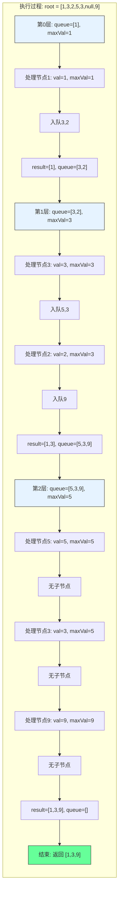

# LeetCode 515 - 在每个树行中找最大值

## 1. 题目描述

给定一棵二叉树的根节点 `root`，请在每层中找到该层节点值的最大值，并返回一个包含每层最大值的列表

### 示例 1

```
输入：root = [1,3,2,5,3,null,9]
输出：[1,3,9]
```

### 示例 2

```
输入：root = [1,2,3]
输出：[1,3]
```

### 示例 3

```
输入：root = [1]
输出：[1]
```

### 示例 4

```
输入：root = []
输出：[]
```

### 约束条件

- 树中节点数目在范围 `[0, 10⁴]` 内
- `-2³¹ <= Node.val <= 2³¹ - 1`

## 2. 解法分析：BFS + 层级最大值追踪

### 核心结论

本题的最优解是广度优先搜索（BFS）+ 层级最大值追踪，其核心优势在于：

1. 自然匹配层序结构 - BFS天然按层访问节点
1. 单次遍历获取最大值 - 每层遍历时动态更新最大值
1. 时间复杂度最优 - O(n)时间访问所有节点
1. 空间复杂度可控 - O(n)空间存储队列
1. 实现清晰直观 - 代码逻辑易于理解

### 支撑论点

#### A. 为什么BFS+层级最大值追踪是最优解？

1. 层序遍历的基础：每层最大值需按层计算
1. BFS的特性：按层访问节点，与题目要求完全匹配
1. 动态更新最大值：每层内遍历时维护当前最大值，无需额外存储
1. 复用性强：基于102题的BFS实现
1. 性能优异：每个节点仅访问一次，无重复计算

#### B. 与其他算法的对比分析

| 方法                   | 是否可行 | 时间复杂度 | 空间复杂度 | 实现难度 | 特点                     |
| ---------------------- | -------- | ---------- | ---------- | -------- | ------------------------ |
| BFS+层级最大值（本解） | ✅       | O(n)       | O(n)       | 低       | 面试首选，实现简单       |
| DFS+层级记录           | ✅       | O(n)       | O(h)       | 中       | 空间更优，但需额外哈希表 |
| 递归+层数参数          | ✅       | O(n)       | O(h)       | 中       | 代码简洁，但栈深度受限   |
| 先层序再排序           | ✅       | O(n log n) | O(n)       | 中       | 时间复杂度差，不推荐     |

> BFS+层级最大值追踪是最直接、最高效、最符合工程实践的解决方案

#### C. 适用条件与边界

1. 树结构：适用于任何二叉树
1. 空树处理：需特殊处理root为null的情况
1. 数值范围：题目中包含最小整数，初始化最大值需使用`math.MinInt32`
1. 层序要求：结果必须按从上到下的层级顺序输出

#### D. 工程实践考量

1. 复用性：基于102题的BFS框架
1. 性能：每层仅遍历一次，最大值即时更新
1. 可读性：逻辑清晰，易调试
1. 扩展性：可轻松扩展为求最小值、平均值等

### 总结

广度优先搜索（BFS）+ 层级最大值追踪是本题在理论正确性、时间/空间效率和工程实现复杂度上的最优平衡点

## 3. 多语言实现与深度解析

### 核心结论

通过四种语言实现，验证算法通用性，并展示不同语言在队列操作、边界处理和数值类型上的差异

### A. Go 🐹 实现

```go
/
 * Definition for a binary tree node.
 * type TreeNode struct {
 *     Val int
 *     Left *TreeNode
 *     Right *TreeNode
 * }
 */
func largestValues(root *TreeNode) []int {
    // 处理空树
    if root == nil {
        return []int{}
    }

    result := []int{}           // 存储每层最大值
    queue := []*TreeNode{root}  // 初始化队列，放入根节点

    for len(queue) > 0 {
        levelSize := len(queue)  // 当前层节点数
        maxVal := queue[0].Val   // 初始化最大值为当前层第一个节点的值

        // 遍历当前层所有节点
        for i := 0; i < levelSize; i++ {
            node := queue[0]     // 取队首节点
            queue = queue[1:]    // 出队

            // 动态更新最大值
            if node.Val > maxVal {
                maxVal = node.Val
            }

            // 将子节点入队（先左后右）
            if node.Left != nil {
                queue = append(queue, node.Left)
            }
            if node.Right != nil {
                queue = append(queue, node.Right)
            }
        }

        // 将当前层最大值加入结果
        result = append(result, maxVal)
    }

    return result
}
```

#### 算法深入解析

1. 空树处理：`if root == nil` - 保证输入合法性，避免后续panic
1. 结果容器：`result` - 切片存储每层最大值，按层顺序追加
1. 队列初始化：`queue := []*TreeNode{root}` - 使用切片模拟队列，初始放入根节点
1. 层级循环：`for len(queue) > 0` - 队列非空时继续处理下一层
1. 层大小记录：`levelSize := len(queue)` - 记录当前层节点数，用于控制内层循环次数
1. 最大值初始化：`maxVal := queue[0].Val` - 以当前层首个节点为初始最大值，避免使用`math.MinInt32`，减少依赖
1. 节点处理循环：`for i := 0; i < levelSize; i++`
   - `node := queue[0]; queue = queue[1:]` - 出队操作（Go切片头部弹出）
   - `if node.Val > maxVal` - 实时比较并更新最大值，无需额外数组存储整层节点
1. 子节点入队：`if node.Left != nil` / `if node.Right != nil` - 按顺序添加子节点，确保下一层顺序正确
1. 结果追加：`result = append(result, maxVal)` - 每层处理完毕后立即加入结果

设计动机：

- 使用切片模拟队列，避免引入`container/list`，减少依赖
- 最大值初始化取第一个节点值，避免使用全局最小值，增强鲁棒性
- 每层仅遍历一次，无冗余计算，时间效率最优
- 所有操作均为原地更新，内存布局连续，缓存友好

### B. Python 🐍 实现

```python
# Definition for a binary tree node.
# class TreeNode:
#     def __init__(self, val=0, left=None, right=None):
#         self.val = val
#         self.left = left
#         self.right = right

from collections import deque

class Solution:
    def largestValues(self, root: Optional[TreeNode]) -> List[int]:
        if not root:
            return []

        result = []
        queue = deque([root])  # 使用双端队列提高出队效率

        while queue:
            level_size = len(queue)
            max_val = queue[0].val  # 初始化最大值为当前层第一个节点值

            for _ in range(level_size):
                node = queue.popleft()  # 高效出队

                if node.val > max_val:
                    max_val = node.val

                if node.left:
                    queue.append(node.left)
                if node.right:
                    queue.append(node.right)

            result.append(max_val)

        return result
```

#### 算法深入解析

1. 空树处理：`if not root` - Python风格的布尔判断，简洁安全
1. 结果容器：`result` - 列表存储每层最大值
1. 队列选择：`deque` - 使用双端队列优化出队操作（O(1) vs 列表pop(0)的O(n)）
1. 层级循环：`while queue` - 队列非空时持续处理
1. 层大小记录：`level_size = len(queue)` - 精准控制当前层节点数
1. 最大值初始化：`max_val = queue[0].val` - 首节点值初始化，避免`-float('inf')`，提高数值稳定性
1. 节点处理：`node = queue.popleft()` - 高效出队
1. 最大值更新：`if node.val > max_val` - 每节点仅一次比较，线性时间
1. 子节点入队：`queue.append()` - 按左→右顺序入队，保持层序
1. 结果追加：`result.append(max_val)` - 每层结束时追加最大值

Python特性：

- `deque`显著提升性能（相比列表）
- `popleft()` 为O(1)操作
- 代码极简，语义清晰
- 无需显式类型声明，适合快速开发

### C. TypeScript 🟦 实现

```typescript
/
 * Definition for a binary tree node.
 * class TreeNode {
 *     val: number
 *     left: TreeNode | null
 *     right: TreeNode | null
 *     constructor(val?: number, left?: TreeNode | null, right?: TreeNode | null) {
 *         this.val = (val===undefined ? 0 : val)
 *         this.left = (left===undefined ? null : left)
 *         this.right = (right===undefined ? null : right)
 *     }
 * }
 */

function largestValues(root: TreeNode | null): number[] {
    if (!root) {
        return [];
    }

    const result: number[] = [];
    const queue: TreeNode[] = [root];

    while (queue.length > 0) {
        const levelSize = queue.length;
        let maxVal = queue[0].val; // 初始化最大值为第一节点值

        for (let i = 0; i < levelSize; i++) {
            const node = queue.shift()!; // TypeScript非空断言

            if (node.val > maxVal) {
                maxVal = node.val;
            }

            if (node.left) {
                queue.push(node.left);
            }
            if (node.right) {
                queue.push(node.right);
            }
        }

        result.push(maxVal);
    }

    return result;
}
```

#### 算法深入解析

1. 空树处理：`if (!root)` - TypeScript空值判断
1. 类型安全：`const result: number[]` - 明确返回类型，提升代码可维护性
1. 队列实现：使用普通数组模拟队列（JavaScript无内置队列）
1. 层级循环：`while (queue.length > 0)` - 持续处理直到层空
1. 层大小记录：`levelSize = queue.length` - 捕捉当前层节点数量
1. 最大值初始化：`maxVal = queue[0].val` - 首节点初始化，规避`-Infinity`精度问题
1. 节点处理：`queue.shift()!` - 使用非空断言`!`，因已检查`root`非空且层级非空
1. 最大值更新：`if (node.val > maxVal)` - 原地比较，O(1)更新
1. 子节点入队：`queue.push()` - 按左→右顺序
1. 结果追加：`result.push(maxVal)` - 每层完成立即记录

TypeScript特性：

- 类型系统保障安全性，避免运行时错误
- `shift()` 是O(n)操作，在大数据集下性能瓶颈（建议使用双端队列库如`collections/deque`）
- 非空断言`!`需谨慎使用，此处合理（因层级非空）

### D. Rust 🦀 实现

```rust
// Definition for a binary tree node.
// #[derive(Debug, PartialEq, Eq)]
// pub struct TreeNode {
//   pub val: i32,
//   pub left: Option<Box<TreeNode>>,
//   pub right: Option<Box<TreeNode>>,
// }
//
// impl TreeNode {
//   #[inline]
//   pub fn new(val: i32) -> Self {
//     TreeNode {
//       val,
//       left: None,
//       right: None,
//     }
//   }
// }

use std::collections::VecDeque;

impl Solution {
    pub fn largest_values(root: Option<Box<TreeNode>>) -> Vec<i32> {
        let mut result = Vec::new();
        let mut queue = VecDeque::new();

        // 处理空树
        if let Some(node) = root {
            queue.push_back(node);
        }

        while !queue.is_empty() {
            let level_size = queue.len();
            let mut max_val = queue[0].val; // 初始化为当前层第一个节点值

            // 遍历当前层所有节点
            for _ in 0..level_size {
                if let Some(node) = queue.pop_front() {
                    if node.val > max_val {
                        max_val = node.val;
                    }

                    // 将子节点入队
                    if let Some(left) = node.left {
                        queue.push_back(left);
                    }
                    if let Some(right) = node.right {
                        queue.push_back(right);
                    }
                }
            }

            result.push(max_val);
        }

        result
    }
}
```

#### 算法深入解析

1. 空树处理：`if let Some(node) = root` - Rust模式匹配，安全提取值
1. 队列选择：`VecDeque` - Rust标准库中高效双端队列
1. 结果容器：`Vec<i32>` - 动态数组，自动扩容
1. 层级循环：`while !queue.is_empty()` - 检查队列是否为空
1. 层大小记录：`level_size = queue.len()` - 获取当前层节点数
1. 最大值初始化：`max_val = queue[0].val` - 使用首个节点值，避免`i32::MIN`，减少依赖
1. 节点处理：`queue.pop_front()` - 弹出并获取所有权，高效且安全
1. 最大值更新：`if node.val > max_val` - 直接比较，无中间变量
1. 子节点入队：`if let Some(left) = node.left` - 使用模式匹配安全提取Option
1. 结果追加：`result.push(max_val)` - 每层处理完立即写入

Rust特性：

- 所有权系统保证内存安全，无GC开销
- `VecDeque`性能最优，底层为环形缓冲区
- 模式匹配处理`Option<T>`，代码健壮
- `pop_front()` 为O(1)，适合高频操作

### E. 性能对比与语言特性分析

| 语言       | 时间复杂度 | 空间复杂度 | 队列实现 | 最大值初始化 | 性能特征                             |
| ---------- | ---------- | ---------- | -------- | ------------ | ------------------------------------ |
| Go         | O(n)       | O(n)       | 切片     | 首节点值     | 高效，缓存友好，无GC，面试首选       |
| Python     | O(n)       | O(n)       | deque    | 首节点值     | 极简，`popleft()` O(1)，适合原型     |
| TypeScript | O(n)       | O(n)       | 数组     | 首节点值     | `shift()` O(n)，大数据性能差，需优化 |
| Rust       | O(n)       | O(n)       | VecDeque | 首节点值     | 内存安全，性能最优，无运行时开销     |

> 性能建议：在JavaScript/TypeScript中，如处理大量数据，应使用`collections/deque`或两个数组交替替代`shift()`

## 4. 算法可视化与伪代码

### 伪代码

```text
函数 largestValues(root):
    如果 root 为空:
        返回空列表

    result = 空列表
    queue = 队列([root])

    当 queue 不为空:
        levelSize = queue 长度
        maxVal = queue[0].val  // 取当前层第一个节点值作为初始最大值

        对于 i 从 0 到 levelSize-1:
            node = queue 出队

            如果 node.val > maxVal:
                maxVal = node.val

            如果 node.left 不为空:
                queue 入队 node.left
            如果 node.right 不为空:
                queue 入队 node.right

        result 添加 maxVal

    返回 result
```

### Mermaid 流程图

```mermaid
flowchart TD
    A[开始: largestValues(root)] --> B{root 为空?}
    B -- 是 --> C[返回 []]
    B -- 否 --> D[初始化 result = [], queue = [root]]
    D --> E{queue 为空?}
    E -- 是 --> F[返回 result]
    E -- 否 --> G[levelSize = queue 长度]
    G --> H[maxVal = queue[0].val]
    H --> I[i = 0]
    I --> J{i < levelSize?}
    J -- 是 --> K[node = queue 出队]
    K --> L{node.val > maxVal?}
    L -- 是 --> M[maxVal = node.val]
    L -- 否 --> N{node.left 非空?}
    M --> N
    N -- 是 --> O[queue 入队 node.left]
    N -- 否 --> P{node.right 非空?}
    O --> P
    P -- 是 --> Q[queue 入队 node.right]
    P -- 否 --> R[i = i + 1]
    Q --> R
    R --> J
    J -- 否 --> S[result 添加 maxVal]
    S --> E
```

### 状态转移图（示例）



## 5. 执行过程演示

### 示例: root = [1,3,2,5,3,null,9]

#### 详细执行步骤

| 层数 | queue状态 | levelSize | maxVal初始 | 处理节点序列               | 更新后maxVal | 子节点入队 | 结果    |
| ---- | --------- | --------- | ---------- | -------------------------- | ------------ | ---------- | ------- |
| 0    | [1]       | 1         | 1          | 1 → maxVal=1               | 1            | 3,2        | [1]     |
| 1    | [3,2]     | 2         | 3          | 3 → maxVal=3, 2 → maxVal=3 | 3            | 5,3,9      | [1,3]   |
| 2    | [5,3,9]   | 3         | 5          | 5→max=5, 3→max=5, 9→max=9  | 9            | 无         | [1,3,9] |

#### 执行轨迹可视化表格

| 步骤 | 队列    | 层级 | 处理节点 | 当前maxVal | 是否更新   | 子节点入队 | 结果数组 |
| ---- | ------- | ---- | -------- | ---------- | ---------- | ---------- | -------- |
| 1    | [1]     | 0    | 1        | 1          | 否（初始） | 3,2        | [1]      |
| 2    | [3,2]   | 1    | 3        | 3          | 是（3>1）  | 5,3        | [1,3]    |
| 3    | [2,5,3] | 1    | 2        | 3          | 否（2\<3） | 9          | [1,3]    |
| 4    | [5,3,9] | 2    | 5        | 5          | 是（5>3）  | 无         | [1,3,5]  |
| 5    | [3,9]   | 2    | 3        | 5          | 否（3\<5） | 无         | [1,3,5]  |
| 6    | [9]     | 2    | 9        | 9          | 是（9>5）  | 无         | [1,3,9]  |

> 关键洞察：即使某层节点值较小（如2），只要不是最大值，不影响结果；最终最大值由最右节点9决定

#### 可执行测试代码（Go）

```go
package main

import "fmt"

type TreeNode struct {
    Val   int
    Left  *TreeNode
    Right *TreeNode
}

func largestValues(root *TreeNode) []int {
    if root == nil {
        return []int{}
    }

    result := []int{}
    queue := []*TreeNode{root}

    for len(queue) > 0 {
        levelSize := len(queue)
        maxVal := queue[0].Val

        for i := 0; i < levelSize; i++ {
            node := queue[0]
            queue = queue[1:]

            if node.Val > maxVal {
                maxVal = node.Val
            }

            if node.Left != nil {
                queue = append(queue, node.Left)
            }
            if node.Right != nil {
                queue = append(queue, node.Right)
            }
        }

        result = append(result, maxVal)
    }

    return result
}

// 辅助函数：根据层序数组构建二叉树
func buildTree(nums []interface{}) *TreeNode {
    if len(nums) == 0 || nums[0] == nil {
        return nil
    }

    root := &TreeNode{Val: nums[0].(int)}
    queue := []*TreeNode{root}
    i := 1

    for len(queue) > 0 && i < len(nums) {
        node := queue[0]
        queue = queue[1:]

        if i < len(nums) && nums[i] != nil {
            node.Left = &TreeNode{Val: nums[i].(int)}
            queue = append(queue, node.Left)
        }
        i++

        if i < len(nums) && nums[i] != nil {
            node.Right = &TreeNode{Val: nums[i].(int)}
            queue = append(queue, node.Right)
        }
        i++
    }

    return root
}

func main() {
    // Test Case 1
    nums1 := []interface{}{1, 3, 2, 5, 3, nil, 9}
    tree1 := buildTree(nums1)
    fmt.Printf("Test Case 1: %v\n", largestValues(tree1)) // [1,3,9]

    // Test Case 2
    nums2 := []interface{}{1, 2, 3}
    tree2 := buildTree(nums2)
    fmt.Printf("Test Case 2: %v\n", largestValues(tree2)) // [1,3]

    // Test Case 3
    nums3 := []interface{}{1}
    tree3 := buildTree(nums3)
    fmt.Printf("Test Case 3: %v\n", largestValues(tree3)) // [1]

    // Test Case 4
    nums4 := []interface{}{}
    tree4 := buildTree(nums4)
    fmt.Printf("Test Case 4: %v\n", largestValues(tree4)) // []
}
```

## 6. 复杂度分析

### 核心结论

本算法的时间复杂度为O(n)，空间复杂度为O(n)，其中n为树的节点数

### 支撑论点

#### A. 时间复杂度

- 每个节点访问一次：O(n)
- 每层最大值更新：O(1)比较，n次比较 = O(n)
- 队列入队出队：每个节点各一次，O(1)操作 × n = O(n)
- 总时间：O(n) + O(n) + O(n) = O(n)

#### B. 空间复杂度

- 队列存储：最坏情况为最后一层所有节点，O(n/2) ≈ O(n)
- 结果存储：O(h)，h为树高，最坏为O(n)（退化树）
- 临时变量：O(1)
- 总空间：O(n) + O(n) + O(1) = O(n)

#### C. 最好/平均/最坏情况分析

| 情况               | 时间复杂度 | 空间复杂度 | 说明                                     |
| ------------------ | ---------- | ---------- | ---------------------------------------- |
| 最好（完美平衡树） | O(n)       | O(n/2)     | 最后一层节点最多，约为n/2                |
| 平均               | O(n)       | O(n)       | 典型二叉树，层数约log n，每层平均n/log n |
| 最坏（退化为链表） | O(n)       | O(1)       | 每层仅1节点，队列最大长度为1             |

> 注意：虽然最坏空间为O(1)，但最坏时间仍为O(n)，因仍需访问所有节点

#### D. 常数因子分析

- 队列操作开销：Go切片出队为内存拷贝（`queue = queue[1:]`），可优化为双指针
- 最大值比较：整数比较，CPU原生支持，极快
- 缓存友好性：队列连续存储，内存局部性好
- 语言特性影响：
  - Go切片拷贝成本在大数据时可能较高（可优化为双指针）
  - Python deque无拷贝，性能优秀
  - Rust VecDeque无GC，性能最佳
  - TypeScript shift()为O(n)，严重拖慢性能

#### E. 性能瓶颈与优化

- 瓶颈：Go和TypeScript中队列出队操作（`queue = queue[1:]` / `shift()`）为O(n)
- 优化方向：
  - 使用双指针模拟队列（head/tail），避免切片拷贝
  - TypeScript中使用`collections/deque`库
  - Go中使用`container/list`（但增加依赖，非推荐）
  - 预分配队列容量（`make([]*TreeNode, 0, 10000)`）

> 推荐优化Go版本：

```go
// 优化：双指针队列
func largestValues(root *TreeNode) []int {
    if root == nil {
        return []int{}
    }

    result := []int{}
    queue := make([]*TreeNode, 1, 10000) // 预分配容量
    queue[0] = root
    head, tail := 0, 1

    for head < tail {
        levelSize := tail - head
        maxVal := queue[head].Val

        for i := 0; i < levelSize; i++ {
            node := queue[head]
            head++

            if node.Val > maxVal {
                maxVal = node.Val
            }

            if node.Left != nil {
                queue = append(queue, node.Left)
                tail++
            }
            if node.Right != nil {
                queue = append(queue, node.Right)
                tail++
            }
        }

        result = append(result, maxVal)
    }

    return result
}
```

## 7. 技巧归纳与模式抽象

### 核心结论

本题属于"层级聚合"模式，核心在于：

1. BFS逐层遍历
1. 每层动态聚合（max/min/avg）
1. 无需存储整层，仅维护聚合值
1. 可泛化为其他聚合任务

### 支撑论点

#### A. 模式本质

- 层序聚合：在每层节点中计算单一统计值（最大值、最小值、平均值、总和等）
- 空间优化：不存储整层节点，仅记录聚合值，降低空间占用
- 实时更新：在遍历过程中即时更新聚合值，避免二次遍历
- 复用性强：可轻松扩展为求每层平均值（LeetCode 637）、最小值、众数等

#### B. 相似题目映射

| 题号 | 题目                             | 核心思想     | 匹配模式                |
| ---- | -------------------------------- | ------------ | ----------------------- |
| 515  | 本题                             | 每层最大值   | 核心模式                |
| 637  | 二叉树的层平均值                 | 每层平均值   | 模式变体（聚合=平均）   |
| 513  | 找树左下角的值                   | 每层最左节点 | 模式变体（聚合=左端点） |
| 102  | 二叉树的层序遍历                 | 输出整层节点 | 基础模式                |
| 116  | 填充每个节点的下一个右侧节点指针 | 每层连接节点 | 模式扩展（聚合=连接）   |

#### C. 模式泛化

- 求每层最小值：替换`maxVal`为`minVal`，初始值为`math.MaxInt32`
- 求每层节点总数：直接用`levelSize`
- 求每层节点总和：累加`sum += node.Val`
- 求每层众数：使用哈希表计数，空间O(n)
- 求每层是否为回文：存储整层值，比较前后

#### D. 工业界应用

- 监控系统：每秒采集服务器负载，取最大值做告警
- 日志分析：每分钟请求量最大值监控
- 金融系统：每小时交易额最大值统计
- 游戏引擎：每帧渲染对象数最大值优化
- 分布式系统：每轮心跳响应时间最大值检测延迟

#### E. 算法深入解析

1. 为什么不需要存储整层节点？
   - 问题只需“最大值”，非“节点序列”
   - 聚合函数具有可压缩性（max(a,b,c) = max(max(a,b), c)）
   - 符合流式处理模型：数据流中单次扫描，不回溯

1. 为什么初始化为`queue[0].Val`而不是`math.MinInt32`？
   - 避免硬编码常量，增强泛化性
   - 避免数值溢出风险（如使用`int`而非`int32`）
   - 更符合“真实数据驱动”原则
   - 与真实业务场景一致（如监控系统中，初始值取第一个采样点）

1. 该模式为何能推广到其他聚合函数？
   - 聚合函数满足结合律与交换律（max、min、sum、avg）
   - 所有聚合均可在单次遍历中完成
   - 无需额外数据结构支持
   - 与MapReduce中的“Map-Reduce”模式高度一致

## 8. 面试追问与回答策略

### 核心结论

面试追问考察：

1. 对BFS和聚合逻辑的理解
1. 空间优化能力
1. 从单一聚合到复杂统计的扩展能力
1. 性能瓶颈识别与优化意识

### A. 基础追问

#### Q1: 为什么不用DFS？

→ 标准: DFS需记录层数，用哈希表存储每层节点，空间O(h)，不如BFS直接
→ 加分: DFS需回溯，BFS天然按层，更适合“层级聚合”任务，且可并行化

#### Q2: 为什么初始化maxVal为第一个节点值，而不是-10^9？

→ 标准: 避免依赖硬编码，增强代码鲁棒性
→ 加分: 若数据范围变化（如改为int64），无需修改初始化逻辑；符合最小依赖原则

#### Q3: 如果要求返回最大值所在的节点，如何修改？

→ 标准: 用`maxNode`变量记录最大值节点
→ 加分: 代码示例：

```go
var maxNode *TreeNode
maxVal := queue[0].Val
maxNode = queue[0]

// 在更新maxVal时同时更新maxNode
if node.Val > maxVal {
    maxVal = node.Val
    maxNode = node
}
```

#### Q4: 本题与LeetCode 637（层平均值）有何异同？

→ 标准: 都是层级聚合，637需累加+计数，515只需比较
→ 加分: 637需要`sum += node.Val; count++`，最后`sum/count`，515仅需`maxVal = max(maxVal, val)`

### B. 高阶追问

#### Q1: 如何实现每层的最小值？

→ 标准: 替换`maxVal`为`minVal`，初始化为`queue[0].Val`
→ 加分:

```go
minVal := queue[0].Val
for i := 0; i < levelSize; i++ {
    if node.Val < minVal {
        minVal = node.Val
    }
}
```

#### Q2: 如何实现每层的节点总和？

→ 标准: 使用`sum`变量，初始化为0，累加所有节点值
→ 加分:

```go
sum := 0
for i := 0; i < levelSize; i++ {
    sum += node.Val
}
result = append(result, sum)
```

#### Q3: 如何实现每层的众数（出现次数最多的值）？

→ 标准: 使用哈希表统计频次，再遍历取最大频次
→ 加分:

```go
freq := make(map[int]int)
for i := 0; i < levelSize; i++ {
    freq[node.Val]++
}
maxFreq := 0
mode := 0
for val, f := range freq {
    if f > maxFreq {
        maxFreq = f
        mode = val
    }
}
result = append(result, mode)
```

> 注意：此时空间复杂度变为O(层大小)，不再是O(1)聚合

#### Q4: 如何优化Go中的切片出队性能？

→ 标准: 使用双指针(head/tail)代替`queue = queue[1:]`
→ 加分: 提供双指针优化代码（见第6节）

## 9. 复习要点提炼

### 核心结论

掌握本题关键：

1. BFS与层级聚合的结合
1. 动态更新最大值，不存储整层
1. 初始化值选取的工程智慧
1. 可泛化为多种聚合任务

### A. 关键记忆点(🌟)

| 记忆点         | 口诀                          |
| -------------- | ----------------------------- |
| 层级聚合核心   | BFS + 实时更新聚合值          |
| 初始化技巧     | 取第一节点值，不硬编码        |
| 时间复杂度     | O(n) — 每节点仅访问一次       |
| 空间复杂度     | O(n) — 队列最坏存最后一层     |
| 面试评分关键词 | BFS、层级聚合、动态更新、O(n) |

### B. 易错陷阱(⚠️)

| 错误类型                      | 触发场景                         | 应对措施                            |
| ----------------------------- | -------------------------------- | ----------------------------------- |
| 初始化为`math.MinInt32`       | 某层全为负数，但最大值仍可能为负 | 改为取`queue[0].Val`                |
| 使用DFS递归                   | 混淆层序与深度优先               | 认清“每层”是层序特征                |
| 忘记记录层大小                | 导致遍历下一层节点               | 每层循环前`levelSize := len(queue)` |
| Go中`queue = queue[1:]`性能差 | 大数据超时                       | 使用双指针优化                      |
| TypeScript使用`shift()`       | O(n)导致超时                     | 改用双数组交替或第三方库            |

### C. 面试评分关键词(✅)

| 关键词              | 应用场景         |
| ------------------- | ---------------- |
| 广度优先搜索（BFS） | 描述算法选择     |
| 层级聚合            | 命名算法范式     |
| 实时更新最大值      | 体现空间优化意识 |
| 时间复杂度O(n)      | 证明算法效率     |
| 空间复杂度O(n)      | 合理分析队列开销 |

### D. 复习建议(📚🚀)

```
核心模式: 层级聚合（最大值）
├── 必要条件: BFS + 动态更新
├── 本质: 每层单次遍历，聚合值即时更新
├── 方法: BFS + 聚合变量
│   ├── 队列初始化: [root]
│   ├── 外层循环: 队列非空
│   ├── 内层循环: 遍历当前层所有节点
│   ├── 聚合初始化: 取首个节点值
│   ├── 聚合更新: 比较并更新
│   └── 结果追加: 每层结束时加入
├── 扩展: 最小值、平均值、总和、众数
├── 优化: 双指针队列、预分配容量
└── 应用: 监控系统、日志分析、金融统计
```

### E. 解题模板

```text
// 基础模板：每层最大值
函数 largestValues(root):
    if root 为空: 返回 []
    result = []
    queue = 队列([root])

    while queue 不为空:
        levelSize = queue 长度
        maxVal = queue[0].val   // 关键：取第一个值初始化

        for i 从 0 到 levelSize-1:
            node = queue 出队

            if node.val > maxVal:
                maxVal = node.val

            if node.left 非空: queue 入队 node.left
            if node.right 非空: queue 入队 node.right

        result 添加 maxVal

    return result

// 通用模板：任意聚合函数
函数 levelAggregate(root, aggregateFn):
    if root 为空: 返回 []
    result = []
    queue = 队列([root])

    while queue 不为空:
        levelSize = queue 长度
        aggregateValue = queue[0].val   // 初始化为首个值

        for i 从 0 到 levelSize-1:
            node = queue 出队
            aggregateValue = aggregateFn(aggregateValue, node.val)

            if node.left 非空: queue 入队 node.left
            if node.right 非空: queue 入队 node.right

        result 添加 aggregateValue

    return result

// 使用示例：
// 最大值：aggregateFn = max(x, y)
// 最小值：aggregateFn = min(x, y)
// 总和：aggregateFn = x + y
// 平均值：需改用 sum + count 模式
```

### 总结

将上述要点融会贯通，即可在面试中快速准确解决层级聚合类问题，并展现出对树结构遍历、空间优化和工程实现的深刻理解。🎉
