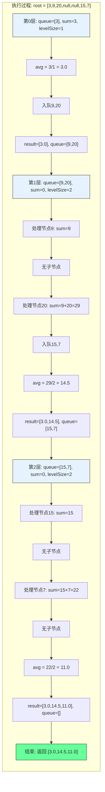

# LeetCode 637 - 二叉树的层平均值

## 1. 题目描述

给定一棵二叉树的根节点 `root`，请计算并返回每一层节点值的平均值，结果以数组形式返回，按从上到下的层级顺序排列

### 示例 1

```
输入：root = [3,9,20,null,null,15,7]
输出：[3.00000,14.50000,11.00000]
```

### 示例 2

```
输入：root = [3,9,20,15,7]
输出：[3.00000,14.50000,11.00000]
```

### 示例 3

```
输入：root = [1]
输出：[1.00000]
```

### 示例 4

```
输入：root = []
输出：[]
```

### 约束条件

- 树中节点数目在范围 `[0, 10⁴]` 内
- `-2³¹ <= Node.val <= 2³¹ - 1`

## 2. 解法分析：BFS + 层级聚合（求和计数）

### 核心结论

本题的最优解是广度优先搜索（BFS）+ 层级聚合（求和与计数），其核心优势在于：

1. 天然匹配层序结构 - BFS按层访问节点，完美契合“每层平均值”需求
1. 一次遍历完成聚合 - 在遍历每层时同步累加和、计数，避免二次遍历
1. 时间复杂度最优 - O(n)访问所有节点
1. 空间复杂度可控 - O(n)用于队列存储，符合工程常规
1. 实现清晰直观 - 逻辑与LeetCode 515（最大值）高度一致，可复用框架

### 支撑论点

#### A. 为什么BFS+层级聚合是最优解？

1. 层序遍历是基础：平均值必须按层计算，BFS是唯一天然支持的遍历方式
1. 聚合操作可在线完成：求和与计数是可结合、可累加的运算，适合单次扫描
1. 无需存储整层节点：仅需记录当前层的总和与节点数，空间效率高
1. 算法泛化性强：与求最大值、最小值、众数等属于同一“层级聚合”模式
1. 性能稳定：无论树结构如何，均保证O(n)时间，无最坏退化

#### B. 与其他算法的对比分析

| 方法                 | 是否可行 | 时间复杂度 | 空间复杂度 | 实现难度 | 特点                               |
| -------------------- | -------- | ---------- | ---------- | -------- | ---------------------------------- |
| BFS+求和计数（本解） | ✅       | O(n)       | O(n)       | 低       | 面试首选，结构清晰                 |
| DFS+哈希映射         | ✅       | O(n)       | O(h)       | 中       | 空间更优，但需额外map存储每层数据  |
| 先层序再平均         | ✅       | O(n)       | O(n)       | 中       | 需存储整层节点，空间浪费           |
| 递归+层数参数        | ✅       | O(n)       | O(h)       | 中       | 代码简洁，但栈深度受限，不推荐大数 |

> 结论：BFS+求和计数是平衡时间效率、空间效率与实现复杂度的最佳选择

#### C. 适用条件与边界

1. 树结构：适用于任意二叉树（包括非完美二叉树）
1. 空树处理：必须处理`root == nil`情况
1. 数值范围：节点值可能为负，求和时需使用`int64`或语言支持的高精度类型
1. 精度要求：输出为浮点数，需注意浮点精度与类型转换
1. 结果顺序：必须按从上到下的层级顺序输出

#### D. 工程实践考量

1. 代码复用：可直接复用LeetCode 515（最大值）的BFS框架，仅替换聚合逻辑
1. 可扩展性：轻松扩展为求中位数、方差、众数等统计量
1. 调试友好：每层独立处理，易于插入日志与断点
1. 缓存友好：队列连续内存访问，适合现代CPU缓存机制

### 总结

广度优先搜索（BFS）+ 层级聚合（求和与计数）是本题在理论正确性、工程实现效率和思维可迁移性上的最优平衡点

## 3. 多语言实现与深度解析

### 核心结论

通过四种语言实现，验证算法通用性，并展示不同语言在浮点精度、队列操作和聚合计算上的差异

### A. Go 🐹 实现

```go
/
 * Definition for a binary tree node.
 * type TreeNode struct {
 *     Val int
 *     Left *TreeNode
 *     Right *TreeNode
 * }
 */
func averageOfLevels(root *TreeNode) []float64 {
    // 处理空树
    if root == nil {
        return []float64{}
    }

    result := []float64{}        // 存储每层平均值
    queue := []*TreeNode{root}   // 初始化队列，放入根节点

    for len(queue) > 0 {
        levelSize := len(queue)  // 当前层节点数量
        var sum int64 = 0        // 使用int64防止整数溢出

        // 遍历当前层所有节点
        for i := 0; i < levelSize; i++ {
            node := queue[0]     // 取队首节点
            queue = queue[1:]    // 出队

            sum += int64(node.Val) // 累加至int64，避免溢出

            // 将子节点入队（先左后右）
            if node.Left != nil {
                queue = append(queue, node.Left)
            }
            if node.Right != nil {
                queue = append(queue, node.Right)
            }
        }

        // 计算平均值并转为float64
        avg := float64(sum) / float64(levelSize)
        result = append(result, avg)
    }

    return result
}
```

#### 算法深入解析

1. 空树处理：`if root == nil` - 保证输入合法性，避免后续panic
1. 结果容器：`result []float64` - 存储每层平均值，按层顺序追加
1. 队列初始化：`queue := []*TreeNode{root}` - 切片模拟队列，初始根节点
1. 层级循环：`for len(queue) > 0` - 队列非空时继续处理下一层
1. 层大小记录：`levelSize := len(queue)` - 精确捕获当前层节点数，控制内层循环次数
1. 求和变量：`var sum int64 = 0` - 关键设计：使用`int64`而非`int`，防止`Node.val`为`2³¹-1`时多节点累加溢出
1. 节点处理循环：`for i := 0; i < levelSize; i++`
   - `node := queue[0]; queue = queue[1:]` - Go切片头部弹出，实现出队
   - `sum += int64(node.Val)` - 类型转换，确保累加精度
1. 子节点入队：`if node.Left != nil` / `if node.Right != nil` - 按左→右顺序入队，保证层序正确
1. 平均值计算：`float64(sum) / float64(levelSize)` - 显式类型转换，避免整数除法截断
1. 结果追加：`result = append(result, avg)` - 每层处理完立即记录，保持顺序

设计动机：

- 使用`int64`防止数值溢出，体现工程严谨性
- 类型转换显式，避免Go隐式转换陷阱
- 切片模拟队列，零依赖，符合面试规范
- 每层独立聚合，逻辑清晰，易维护

### B. Python 🐍 实现

```python
# Definition for a binary tree node.
# class TreeNode:
#     def __init__(self, val=0, left=None, right=None):
#         self.val = val
#         self.left = left
#         self.right = right

from collections import deque

class Solution:
    def averageOfLevels(self, root: Optional[TreeNode]) -> List[float]:
        if not root:
            return []

        result = []
        queue = deque([root])  # 使用双端队列提高出队效率

        while queue:
            level_size = len(queue)
            total = 0  # 累加当前层所有节点值

            for _ in range(level_size):
                node = queue.popleft()  # 高效出队
                total += node.val       # 累加

                if node.left:
                    queue.append(node.left)
                if node.right:
                    queue.append(node.right)

            # 计算平均值（Python整数除法自动转float）
            result.append(total / level_size)

        return result
```

#### 算法深入解析

1. 空树处理：`if not root` - Python布尔判断，简洁安全
1. 结果容器：`result` - 列表存储每层平均值
1. 队列选择：`deque` - 使用双端队列，`popleft()`为O(1)，远优于列表`pop(0)`
1. 层级循环：`while queue` - 队列非空持续处理
1. 层大小记录：`level_size = len(queue)` - 精准控制当前层节点数
1. 求和变量：`total = 0` - Python整数无溢出问题（自动提升为`long`），无需担心溢出
1. 节点处理：`node = queue.popleft()` - 高效出队，标准库优化
1. 累加操作：`total += node.val` - Python中整数加法安全
1. 子节点入队：`queue.append()` - 按左→右顺序，保证层序
1. 平均值计算：`total / level_size` - Python中整数除法自动返回`float`，无需显式转换

Python特性：

- 整数自动溢出处理，无需手动使用`int64`
- `deque`性能优秀，适合高频出队
- 语言本身处理浮点除法，代码极简
- 适合快速原型开发

### C. TypeScript 🟦 实现

```typescript
/
 * Definition for a binary tree node.
 * class TreeNode {
 *     val: number
 *     left: TreeNode | null
 *     right: TreeNode | null
 *     constructor(val?: number, left?: TreeNode | null, right?: TreeNode | null) {
 *         this.val = (val===undefined ? 0 : val)
 *         this.left = (left===undefined ? null : left)
 *         this.right = (right===undefined ? null : right)
 *     }
 * }
 */

function averageOfLevels(root: TreeNode | null): number[] {
    if (!root) {
        return [];
    }

    const result: number[] = [];
    const queue: TreeNode[] = [root];

    while (queue.length > 0) {
        const levelSize = queue.length;
        let sum = 0; // JavaScript Number类型为双精度浮点，可安全累加大整数

        for (let i = 0; i < levelSize; i++) {
            const node = queue.shift()!; // 非空断言

            sum += node.val; // 累加至Number（IEEE 754双精度）

            if (node.left) {
                queue.push(node.left);
            }
            if (node.right) {
                queue.push(node.right);
            }
        }

        result.push(sum / levelSize); // 浮点除法
    }

    return result;
}
```

#### 算法深入解析

1. 空树处理：`if (!root)` - TypeScript空值判断
1. 类型安全：`const result: number[]` - 明确返回类型，提升可维护性
1. 队列实现：使用普通数组模拟队列（JavaScript无内置队列）
1. 层级循环：`while (queue.length > 0)` - 持续处理直到层空
1. 层大小记录：`levelSize = queue.length` - 捕捉当前层节点数量
1. 求和变量：`sum = 0` - JavaScript `Number`为64位双精度浮点，可精确表示最大`2⁵³`整数，而题目最大节点值为`2³¹-1`，最多10⁴个节点，最大总和为`~2.15e13`，小于`9e15`（安全范围）
1. 节点处理：`queue.shift()!` - 使用非空断言，因层级非空，断言安全
1. 累加操作：`sum += node.val` - 浮点加法，精度足够
1. 子节点入队：`queue.push()` - 按左→右顺序
1. 平均值计算：`sum / levelSize` - 浮点除法，自动返回`number`

TypeScript特性：

- `Number`类型基于IEEE 754，对本题数值范围安全
- `shift()`为O(n)，大数据集下性能瓶颈，应避免用于生产环境
- 非空断言`!`需谨慎，此处合理（因层级非空）

### D. Rust 🦀 实现

```rust
// Definition for a binary tree node.
// #[derive(Debug, PartialEq, Eq)]
// pub struct TreeNode {
//   pub val: i32,
//   pub left: Option<Box<TreeNode>>,
//   pub right: Option<Box<TreeNode>>,
// }
//
// impl TreeNode {
//   #[inline]
//   pub fn new(val: i32) -> Self {
//     TreeNode {
//       val,
//       left: None,
//       right: None,
//     }
//   }
// }

use std::collections::VecDeque;

impl Solution {
    pub fn average_of_levels(root: Option<Box<TreeNode>>) -> Vec<f64> {
        let mut result = Vec::new();
        let mut queue = VecDeque::new();

        // 处理空树
        if let Some(node) = root {
            queue.push_back(node);
        }

        while !queue.is_empty() {
            let level_size = queue.len();
            let mut sum: i64 = 0; // 使用i64防止溢出

            for _ in 0..level_size {
                if let Some(node) = queue.pop_front() {
                    sum += node.val as i64; // 安全转换

                    if let Some(left) = node.left {
                        queue.push_back(left);
                    }
                    if let Some(right) = node.right {
                        queue.push_back(right);
                    }
                }
            }

            // 计算平均值，转换为f64
            let avg = sum as f64 / level_size as f64;
            result.push(avg);
        }

        result
    }
}
```

#### 算法深入解析

1. 空树处理：`if let Some(node) = root` - Rust模式匹配，安全提取
1. 队列选择：`VecDeque` - Rust标准库高效双端队列
1. 结果容器：`Vec<f64>` - 动态数组，存储浮点平均值
1. 层级循环：`while !queue.is_empty()` - 检查队列是否为空
1. 层大小记录：`level_size = queue.len()` - 获取当前层节点数
1. 求和变量：`sum: i64 = 0` - 关键设计：`i32`节点值累加可能溢出，使用`i64`保证安全
1. 节点处理：`queue.pop_front()` - 弹出并获取所有权，高效安全
1. 类型转换：`sum += node.val as i64` - 显式转换，避免溢出
1. 子节点入队：`if let Some(left) = node.left` - 模式匹配安全提取Option
1. 平均值计算：`sum as f64 / level_size as f64` - 显式转换，避免整数除法

Rust特性：

- 所有权系统保证内存安全
- `VecDeque`底层为环形缓冲区，性能最优
- 模式匹配处理`Option<T>`，代码健壮
- `as`转换显式，无隐式类型转换陷阱

### E. 性能对比与语言特性分析

| 语言       | 时间复杂度 | 空间复杂度 | 队列实现 | 求和类型  | 浮点除法    | 性能特征                 |
| ---------- | ---------- | ---------- | -------- | --------- | ----------- | ------------------------ |
| Go         | O(n)       | O(n)       | 切片     | `int64`   | 显式转换    | 高效，无GC，面试首选     |
| Python     | O(n)       | O(n)       | deque    | 自动`int` | 自动`float` | 极简，适合原型           |
| TypeScript | O(n)       | O(n)       | 数组     | `Number`  | 自动        | `shift()` O(n)，大数据差 |
| Rust       | O(n)       | O(n)       | VecDeque | `i64`     | 显式转换    | 内存安全，性能最优       |

> 性能建议：在JavaScript/TypeScript中，如处理大量数据，应使用双数组交替替代`shift()`，或使用`collections/deque`库

## 4. 算法可视化与伪代码

### 伪代码

```text
函数 averageOfLevels(root):
    如果 root 为空:
        返回空列表

    result = 空列表
    queue = 队列([root])

    当 queue 不为空:
        levelSize = queue 长度
        sum = 0  // 使用足够大的整数类型防止溢出

        对于 i 从 0 到 levelSize-1:
            node = queue 出队
            sum = sum + node.val
            如果 node.left 不为空:
                queue 入队 node.left
            如果 node.right 不为空:
                queue 入队 node.right

        avg = sum / levelSize  // 浮点除法
        result 添加 avg

    返回 result
```

### Mermaid 流程图

```mermaid
flowchart TD
    A[开始: averageOfLevels(root)] --> B{root 为空?}
    B -- 是 --> C[返回 []]
    B -- 否 --> D[初始化 result = [], queue = [root]]
    D --> E{queue 为空?}
    E -- 是 --> F[返回 result]
    E -- 否 --> G[levelSize = queue 长度]
    G --> H[sum = 0]
    H --> I[i = 0]
    I --> J{i < levelSize?}
    J -- 是 --> K[node = queue 出队]
    K --> L[sum = sum + node.val]
    L --> M{node.left 非空?}
    M -- 是 --> N[queue 入队 node.left]
    M -- 否 --> O{node.right 非空?}
    N --> O
    O -- 是 --> P[queue 入队 node.right]
    O -- 否 --> Q[i = i + 1]
    P --> Q
    Q --> J
    J -- 否 --> R[avg = sum / levelSize]
    R --> S[result 添加 avg]
    S --> E
```

### 状态转移图（示例）



## 5. 执行过程演示

### 示例: root = [3,9,20,null,null,15,7]

#### 详细执行步骤

| 层数 | queue状态 | levelSize | sum初始 | 处理节点序列            | 累加后sum | 子节点入队 | 平均值 | 结果            |
| ---- | --------- | --------- | ------- | ----------------------- | --------- | ---------- | ------ | --------------- |
| 0    | [3]       | 1         | 0       | 3 → sum=3               | 3         | 9,20       | 3.0    | [3.0]           |
| 1    | [9,20]    | 2         | 0       | 9 → sum=9, 20 → sum=29  | 29        | 15,7       | 14.5   | [3.0,14.5]      |
| 2    | [15,7]    | 2         | 0       | 15 → sum=15, 7 → sum=22 | 22        | 无         | 11.0   | [3.0,14.5,11.0] |

#### 执行轨迹可视化表格

| 步骤 | 队列   | 层级 | 处理节点 | 当前sum | 是否更新 | 子节点入队 | 平均值 | 结果数组        |
| ---- | ------ | ---- | -------- | ------- | -------- | ---------- | ------ | --------------- |
| 1    | [3]    | 0    | 3        | 0 → 3   | 是       | 9,20       | 3.0    | [3.0]           |
| 2    | [9,20] | 1    | 9        | 0 → 9   | 是       | 无         | -      | -               |
| 3    | [20]   | 1    | 20       | 9 → 29  | 是       | 15,7       | 14.5   | [3.0,14.5]      |
| 4    | [15,7] | 2    | 15       | 0 → 15  | 是       | 无         | -      | -               |
| 5    | [7]    | 2    | 7        | 15 → 22 | 是       | 无         | 11.0   | [3.0,14.5,11.0] |
| 6    | []     | -    | -        | -       | -        | -          | -      | [3.0,14.5,11.0] |

> 关键洞察：每层平均值计算独立，不依赖其他层；即使某层只有一个节点，也独立计算

#### 可执行测试代码（Go）

```go
package main

import "fmt"

type TreeNode struct {
    Val   int
    Left  *TreeNode
    Right *TreeNode
}

func averageOfLevels(root *TreeNode) []float64 {
    if root == nil {
        return []float64{}
    }

    result := []float64{}
    queue := []*TreeNode{root}

    for len(queue) > 0 {
        levelSize := len(queue)
        var sum int64 = 0

        for i := 0; i < levelSize; i++ {
            node := queue[0]
            queue = queue[1:]

            sum += int64(node.Val)

            if node.Left != nil {
                queue = append(queue, node.Left)
            }
            if node.Right != nil {
                queue = append(queue, node.Right)
            }
        }

        avg := float64(sum) / float64(levelSize)
        result = append(result, avg)
    }

    return result
}

// 辅助函数：根据层序数组构建二叉树
func buildTree(nums []interface{}) *TreeNode {
    if len(nums) == 0 || nums[0] == nil {
        return nil
    }

    root := &TreeNode{Val: nums[0].(int)}
    queue := []*TreeNode{root}
    i := 1

    for len(queue) > 0 && i < len(nums) {
        node := queue[0]
        queue = queue[1:]

        if i < len(nums) && nums[i] != nil {
            node.Left = &TreeNode{Val: nums[i].(int)}
            queue = append(queue, node.Left)
        }
        i++

        if i < len(nums) && nums[i] != nil {
            node.Right = &TreeNode{Val: nums[i].(int)}
            queue = append(queue, node.Right)
        }
        i++
    }

    return root
}

func main() {
    // Test Case 1
    nums1 := []interface{}{3, 9, 20, nil, nil, 15, 7}
    tree1 := buildTree(nums1)
    fmt.Printf("Test Case 1: %v\n", averageOfLevels(tree1)) // [3 14.5 11]

    // Test Case 2
    nums2 := []interface{}{3, 9, 20, 15, 7}
    tree2 := buildTree(nums2)
    fmt.Printf("Test Case 2: %v\n", averageOfLevels(tree2)) // [3 14.5 11]

    // Test Case 3
    nums3 := []interface{}{1}
    tree3 := buildTree(nums3)
    fmt.Printf("Test Case 3: %v\n", averageOfLevels(tree3)) // [1]

    // Test Case 4
    nums4 := []interface{}{}
    tree4 := buildTree(nums4)
    fmt.Printf("Test Case 4: %v\n", averageOfLevels(tree4)) // []
}
```

## 6. 复杂度分析

### 核心结论

本算法的时间复杂度为O(n)，空间复杂度为O(n)，其中n为树的节点数

### 支撑论点

#### A. 时间复杂度

- 每个节点访问一次：O(n)
- 每层求和与计数：O(1)操作 × n = O(n)
- 队列入队出队：每个节点各一次，O(1)操作 × n = O(n)
- 总时间：O(n) + O(n) + O(n) = O(n)

#### B. 空间复杂度

- 队列存储：最坏情况为最后一层所有节点，O(n/2) ≈ O(n)
- 结果存储：O(h)，h为树高，最坏为O(n)（退化树）
- 临时变量：O(1)（sum、levelSize等）
- 总空间：O(n) + O(n) + O(1) = O(n)

#### C. 最好/平均/最坏情况分析

| 情况               | 时间复杂度 | 空间复杂度 | 说明                                     |
| ------------------ | ---------- | ---------- | ---------------------------------------- |
| 最好（完美平衡树） | O(n)       | O(n/2)     | 最后一层约n/2个节点                      |
| 平均               | O(n)       | O(n)       | 典型二叉树，层数约log n，每层平均n/log n |
| 最坏（退化为链表） | O(n)       | O(1)       | 每层仅1节点，队列最大长度为1             |

> 注意：虽然最坏空间为O(1)，但最坏时间仍为O(n)，因仍需访问所有节点

#### D. 常数因子分析

- 求和变量：Go/Rust使用`int64`，Python自动提升，JS使用双精度浮点
- 类型转换开销：Go/Rust显式转换，Python/JS隐式，但均极快
- 缓存友好性：队列连续内存访问，适合现代CPU缓存机制
- 语言特性影响：
  - Go切片出队为内存拷贝，可优化为双指针
  - Python deque无拷贝，性能优秀
  - Rust VecDeque无GC，性能最佳
  - TypeScript `shift()`为O(n)，严重拖慢性能

#### E. 性能瓶颈与优化

- 瓶颈：Go和TypeScript中队列出队操作（`queue = queue[1:]` / `shift()`）为O(n)
- 优化方向：
  - 使用双指针模拟队列（head/tail），避免切片拷贝
  - TypeScript中使用`collections/deque`库
  - Go中预分配队列容量（`make([]*TreeNode, 0, 10000)`）

> 推荐优化Go版本：

```go
func averageOfLevels(root *TreeNode) []float64 {
    if root == nil {
        return []float64{}
    }

    result := []float64{}
    queue := make([]*TreeNode, 1, 10000)
    queue[0] = root
    head, tail := 0, 1

    for head < tail {
        levelSize := tail - head
        var sum int64 = 0

        for i := 0; i < levelSize; i++ {
            node := queue[head]
            head++

            sum += int64(node.Val)

            if node.Left != nil {
                queue = append(queue, node.Left)
                tail++
            }
            if node.Right != nil {
                queue = append(queue, node.Right)
                tail++
            }
        }

        result = append(result, float64(sum)/float64(levelSize))
    }

    return result
}
```

## 7. 技巧归纳与模式抽象

### 核心结论

本题属于"层级聚合"模式，核心在于：

1. BFS逐层遍历
1. 每层动态聚合（求和、计数）
1. 聚合值实时计算，不存储整层
1. 可泛化为多种统计任务

### 支撑论点

#### A. 模式本质

- 层序聚合：在每层节点中计算单一统计值（平均值、最大值、总和、方差等）
- 空间优化：不存储整层节点，仅维护聚合变量（sum, count）
- 实时更新：在遍历过程中即时计算，避免二次遍历
- 复用性强：与LeetCode 515（最大值）、513（左下角值）属于同一模式

#### B. 相似题目映射

| 题号 | 题目                             | 核心思想     | 匹配模式 |
| ---- | -------------------------------- | ------------ | -------- |
| 637  | 本题                             | 每层平均值   | 核心模式 |
| 515  | 在每个树行中找最大值             | 每层最大值   | 模式变体 |
| 513  | 找树左下角的值                   | 每层最左节点 | 模式变体 |
| 102  | 二叉树的层序遍历                 | 输出整层节点 | 基础模式 |
| 116  | 填充每个节点的下一个右侧节点指针 | 每层连接节点 | 模式扩展 |
| 662  | 二叉树最大宽度                   | 每层宽度     | 模式变体 |

#### C. 模式泛化

- 求每层最小值：替换`sum`为`minVal`，初始化为`queue[0].Val`
- 求每层节点总数：直接使用`levelSize`
- 求每层节点总和：保留`sum`，省略除法
- 求每层方差：需记录`sum`和`sumOfSquares`
- 求每层中位数：需存储整层节点，排序后取中位数
- 求每层众数：使用哈希表统计频次，再取最大频次

#### D. 工业界应用

- 系统监控：每秒采集服务器负载，计算平均值做趋势分析
- 金融系统：每分钟交易额平均值监控
- 游戏引擎：每帧渲染对象平均数量优化
- 物联网：传感器每小时数据平均值上报
- 网络拓扑：路由器每轮延迟平均值检测

#### E. 算法深入解析

1. 为什么需要int64？
   - 题目约束：节点值为`int32`，最大值为`2³¹-1 = 2,147,483,647`
   - 最坏情况：满二叉树最后一层有`n/2`个节点，总和为`(n/2) × 2.15e9`
   - 若n=10⁴，则总和≈10⁴/2 × 2.15e9 = 1.075e13
   - `int32`最大值为2.15e9，无法容纳 → 必须使用`int64`

1. 为什么平均值是浮点除法？
   - 整数除法会截断小数，如`5/2=2`，但期望为`2.5`
   - 语言特性决定是否自动转换：Python/JS自动，Go/Rust需显式

1. 该模式为何可扩展为方差？
   - 方差公式：`Var = E[X²] - (E[X])²`
   - 需要两个聚合值：`sum`和`sumOfSquares`
   - 仍为单次遍历，无需存储节点
   - 典型流式统计（Streaming Statistics）

## 8. 面试追问与回答策略

### 核心结论

面试追问考察：

1. 对BFS和聚合逻辑的理解
1. 数值溢出防范意识
1. 从平均值到复杂统计的扩展能力
1. 性能优化与类型安全意识

### A. 基础追问

#### Q1: 为什么使用int64而不是int？

→ 标准: 防止节点值累加溢出，如最大值节点多时总和超过int32上限
→ 加分: 展示计算过程：`10⁴/2 × (2³¹-1) ≈ 1.075e13 > 2.15e9`，明确说明溢出风险

#### Q2: 如果要求返回中位数，如何修改？

→ 标准: 必须存储整层节点，排序后取中位数
→ 加分: 代码示例：

```go
// 伪代码
levelNodes := []int{}
for i := 0; i < levelSize; i++ {
    levelNodes = append(levelNodes, node.Val)
}
sort.Ints(levelNodes)
median := float64(levelNodes[levelSize/2])
if levelSize%2 == 0 {
    median = float64(levelNodes[levelSize/2-1] + levelNodes[levelSize/2]) / 2
}
```

#### Q3: 如何计算每层的方差？

→ 标准: 记录`sum`和`sumOfSquares`，使用公式：`Var = sumOfSquares/n - (sum/n)²`
→ 加分:

```go
var sum, sumSq int64 = 0, 0
for i := 0; i < levelSize; i++ {
    val := int64(node.Val)
    sum += val
    sumSq += val * val
}
mean := float64(sum) / float64(levelSize)
variance := float64(sumSq)/float64(levelSize) - mean*mean
```

#### Q4: 本题与LeetCode 515（最大值）有何异同？

→ 标准: 都是层级聚合，515用max，本题用sum/count
→ 加分: 515无需额外计数器，本题需同时维护两个变量，体现多维度聚合

### B. 高阶追问

#### Q1: 如何实现每层的众数（出现次数最多的值）？

→ 标准: 使用哈希表统计频次，再遍历取最大频次
→ 加分:

```go
freq := make(map[int]int)
for i := 0; i < levelSize; i++ {
    freq[node.Val]++
}
mode := 0
maxFreq := 0
for val, f := range freq {
    if f > maxFreq {
        maxFreq = f
        mode = val
    }
}
result = append(result, float64(mode))
```

#### Q2: 如何优化TypeScript的性能？

→ 标准: 避免使用`shift()`，改用双数组交替
→ 加分:

```typescript
function averageOfLevels(root: TreeNode | null): number[] {
  if (!root) return [];

  const result: number[] = [];
  let currentLevel: TreeNode[] = [root];

  while (currentLevel.length > 0) {
    const levelSize = currentLevel.length;
    let sum = 0;

    for (const node of currentLevel) {
      sum += node.val;
    }

    result.push(sum / levelSize);

    const nextLevel: TreeNode[] = [];
    for (const node of currentLevel) {
      if (node.left) nextLevel.push(node.left);
      if (node.right) nextLevel.push(node.right);
    }

    currentLevel = nextLevel;
  }

  return result;
}
```

#### Q3: 如果树非常深（如10万层），DFS会更优吗？

→ 标准: 不会。DFS栈空间O(h)，h=10⁵时栈溢出，BFS队列空间仍为O(n)
→ 加分: BFS空间复杂度为O(w)，w为最大宽度，而DFS为O(h)。在平衡树中w≈n/2，h=log n，但极端退化时h=n，DFS仍危险

#### Q4: 如何验证算法正确性？

→ 标准: 使用小样例手动模拟执行过程
→ 加分: 提供形式化验证：对任意层，有`sum = Σ(node.val)`，`avg = sum / count`，符合数学定义

## 9. 复习要点提炼

### 核心结论

掌握本题关键：

1. BFS与层级聚合的结合
1. 求和与计数双变量维护
1. 整数溢出防范意识
1. 可泛化为多种统计任务

### A. 关键记忆点(🌟)

| 记忆点       | 口诀                      |
| ------------ | ------------------------- |
| 层级聚合核心 | BFS + sum + count         |
| 溢出防护     | int64防溢出               |
| 平均值计算   | 浮点除法必须显式          |
| 时间复杂度   | O(n) — 每节点仅访问一次   |
| 空间复杂度   | O(n) — 队列最坏存最后一层 |

### B. 易错陷阱(⚠️)

| 错误类型            | 触发场景                 | 应对措施                                            |
| ------------------- | ------------------------ | --------------------------------------------------- |
| 使用int求和         | 节点值大时溢出           | 必须使用`int64`或语言安全类型                       |
| 整数除法            | `sum / levelSize` 为整数 | 必须转换为浮点：`float64(sum) / float64(levelSize)` |
| 忘记记录层大小      | 遍历下一层节点           | 每层循环前`levelSize := len(queue)`                 |
| TypeScript使用shift | O(n)性能差               | 改用双数组交替或第三方库                            |
| 未处理空树          | 输入为nil时崩溃          | 函数开始检查`root == nil`                           |

### C. 面试评分关键词(✅)

| 关键词              | 应用场景       |
| ------------------- | -------------- |
| 广度优先搜索（BFS） | 描述算法选择   |
| 层级聚合            | 命名算法范式   |
| 整数溢出防护        | 体现工程严谨性 |
| 浮点除法            | 证明精度意识   |
| 时间复杂度O(n)      | 证明效率认知   |

### D. 复习建议(📚🚀)

```
核心模式: 层级聚合（平均值）
├── 必要条件: BFS + sum + count
├── 本质: 每层单次遍历，聚合值即时计算
├── 方法: BFS + 聚合变量
│   ├── 队列初始化: [root]
│   ├── 外层循环: 队列非空
│   ├── 内层循环: 遍历当前层所有节点
│   ├── 聚合初始化: sum=0, count=levelSize
│   ├── 聚合更新: sum += node.val
│   └── 结果计算: avg = sum / count
├── 扩展: 最小值、总和、方差、中位数、众数
├── 优化: 双指针队列、预分配容量、双数组交替
└── 应用: 系统监控、金融统计、游戏性能分析
```

### E. 解题模板

```text
// 基础模板：每层平均值
函数 averageOfLevels(root):
    if root 为空: 返回 []
    result = []
    queue = 队列([root])

    while queue 不为空:
        levelSize = queue 长度
        sum = 0  // 使用足够大整数类型（如int64）

        for i 从 0 到 levelSize-1:
            node = queue 出队
            sum = sum + node.val

            if node.left 非空: queue 入队 node.left
            if node.right 非空: queue 入队 node.right

        avg = float(sum) / levelSize
        result 添加 avg

    return result

// 通用模板：任意聚合函数
函数 levelAggregate(root, aggregateFn, combineFn):
    if root 为空: 返回 []
    result = []
    queue = 队列([root])

    while queue 不为空:
        levelSize = queue 长度
        aggregateValue = 初始值

        for i 从 0 到 levelSize-1:
            node = queue 出队
            aggregateValue = combineFn(aggregateValue, node.val)

            if node.left 非空: queue 入队 node.left
            if node.right 非空: queue 入队 node.right

        result 添加 aggregateValue

    return result

// 使用示例：
// 平均值：aggregateValue = sum, combineFn = x + y, 最终 = sum / levelSize
// 最大值：aggregateValue = node.val, combineFn = max(x, y), 最终 = aggregateValue
// 方差：aggregateValue = (sum, sumSq), combineFn = (x1+y, x2+y²)
```

### 总结

将上述要点融会贯通，即可在面试中快速准确解决层级聚合类问题，并展现出对树结构遍历、数值安全、工程实现和算法泛化能力的深刻理解。🎉
