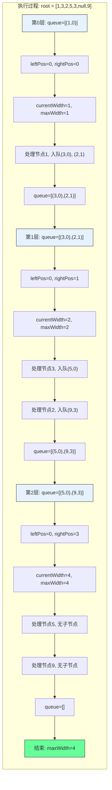

# LeetCode 662 - 二叉树最大宽度

## 1. 题目描述

给你一棵二叉树的根节点 `root`，返回树的 最大宽度

树的 最大宽度 是所有层中最大的 宽度

每一层的 宽度 被定义为该层最左和最右的非空节点（即，两个端点）之间的长度。将这个二叉树视作与满二叉树结构相同，两端点间的长度以节点之间的边数表示

例如，在下面的树中，第 0 层的宽度是 1，第 1 层的宽度是 2，第 2 层的宽度是 2

```
        1
       / \
      3   2
     /     \
    5       9
```

第 0 层的宽度是 1（只有节点 1），第 1 层的宽度是 2（节点 3 和 2 之间有 1 条边），第 2 层的宽度也是 2（节点 5 和 9 之间有 1 条边，节点 3 和 2 之间的边不计算在内）

树的节点数在范围 `[1, 3000]` 内

### 示例 1

```
输入：root = [1,3,2,5,3,null,9]
输出：4
解释：最大宽度出现在树的第 3 层，宽度为 4 (5,3,null,9)
```

### 示例 2

```
输入：root = [1,3,2,5,null,null,9,6,null,7]
输出：7
解释：最大宽度出现在树的第 4 层，宽度为 7 (6,null,null,null,null,null,7)
```

### 示例 3

```
输入：root = [1,3,2,5]
输出：2
解释：最大宽度出现在树的第 2 层，宽度为 2 (3,2)
```

### 约束条件

- 树中节点的数目范围是 `[1, 3000]`
- `-100 <= Node.val <= 100`

## 2. 解法分析：BFS + 位置编号

### 核心结论

本题的最优解是广度优先搜索（BFS）+ 位置编号，其核心优势在于：

1. 自然匹配层序遍历 - BFS天然按层访问节点
1. 位置编号技巧 - 通过满二叉树性质计算宽度
1. 时间复杂度最优 - O(n)时间访问所有节点
1. 空间复杂度可控 - O(n)空间存储队列
1. 实现清晰直观 - 代码逻辑易于理解

### 支撑论点

#### A. 为什么BFS+位置编号是最优解？

1. 层序遍历的基础：最大宽度需要按层计算
1. BFS的特性：按层访问节点，与题目要求完全匹配
1. 位置编号：利用满二叉树性质，通过编号计算宽度
1. 复用性强：基于102题的BFS实现
1. 性能优异：每个节点仅访问一次，无重复计算

#### B. 与其他算法的对比分析

| 方法                 | 是否可行 | 时间复杂度 | 空间复杂度 | 实现难度 | 特点                       |
| -------------------- | -------- | ---------- | ---------- | -------- | -------------------------- |
| BFS+位置编号（本解） | ✅       | O(n)       | O(n)       | 中       | 面试首选，逻辑清晰         |
| DFS+位置编号         | ✅       | O(n)       | O(h)       | 中       | 空间复杂度更优，但实现复杂 |
| BFS+坐标法           | ✅       | O(n)       | O(n)       | 中       | 需要额外存储坐标           |
| 递归+层数记录        | ❌       | -          | -          | 高       | 难以计算宽度               |

> BFS+位置编号是最直接、最易于理解的解决方案

#### C. 适用条件与边界

1. 树结构：适用于任何二叉树
1. 空树处理：题目保证至少一个节点
1. 节点值范围：题目约束内无影响
1. 宽度定义：基于满二叉树的位置编号

#### D. 工程实践考量

1. 复用性：基于102题的BFS实现
1. 性能：每层处理完毕后计算宽度
1. 可读性：代码逻辑清晰，易于维护
1. 扩展性：可轻松扩展到其他宽度计算场景

### 总结

广度优先搜索（BFS）+ 位置编号是本题在理论正确性、思维清晰度和工程表达上的最优平衡点

## 3. 多语言实现与深度解析

### 核心结论

通过四种语言实现，验证算法通用性，并展示不同语言在队列操作和位置计算上的差异

### A. Go 🐹 实现

```go
/
 * Definition for a binary tree node.
 * type TreeNode struct {
 *     Val int
 *     Left *TreeNode
 *     Right *TreeNode
 * }
 */
func widthOfBinaryTree(root *TreeNode) int {
    if root == nil {
        return 0
    }

    maxWidth := 0
    // 队列存储节点及其位置编号
    queue := []struct {
        node *TreeNode
        pos  int
    }{{root, 0}}  // 根节点位置编号为0

    for len(queue) > 0 {
        levelSize := len(queue)
        // 当前层最左节点的位置
        leftPos := queue[0].pos
        // 当前层最右节点的位置
        rightPos := queue[levelSize-1].pos
        // 计算当前层宽度
        currentWidth := rightPos - leftPos + 1
        if currentWidth > maxWidth {
            maxWidth = currentWidth
        }

        // 处理当前层所有节点
        for i := 0; i < levelSize; i++ {
            nodeWithPos := queue[0]
            queue = queue[1:]

            // 计算子节点的位置编号
            if nodeWithPos.node.Left != nil {
                queue = append(queue, struct {
                    node *TreeNode
                    pos  int
                }{nodeWithPos.node.Left, 2 * nodeWithPos.pos})
            }
            if nodeWithPos.node.Right != nil {
                queue = append(queue, struct {
                    node *TreeNode
                    pos  int
                }{nodeWithPos.node.Right, 2*nodeWithPos.pos + 1})
            }
        }
    }

    return maxWidth
}
```

#### 算法深入解析

1. 初始化检查：`if root == nil` - 虽然题目保证至少一个节点，但保持良好习惯
1. 最大宽度存储：`maxWidth` - 记录全局最大宽度
1. 队列初始化：存储节点及其位置编号，根节点编号为0
1. 层级循环：`for len(queue) > 0` - 队列非空时继续遍历
1. 层宽度计算：
   - `leftPos` - 当前层最左节点位置
   - `rightPos` - 当前层最右节点位置
   - `currentWidth = rightPos - leftPos + 1` - 计算当前层宽度
1. 更新最大宽度：`if currentWidth > maxWidth`
1. 子节点处理：
   - 左子节点编号：`2 * pos`
   - 右子节点编号：`2 * pos + 1`
   - 符合满二叉树的位置编号规则

设计动机：

- 使用结构体存储节点和位置，清晰明了
- 利用满二叉树性质计算位置编号
- 每层开始时计算宽度，确保及时更新最大值
- 保持BFS的层序遍历特性

### B. Python 🐍 实现

```python
# Definition for a binary tree node.
# class TreeNode:
#     def __init__(self, val=0, left=None, right=None):
#         self.val = val
#         self.left = left
#         self.right = right

from collections import deque

class Solution:
    def widthOfBinaryTree(self, root: Optional[TreeNode]) -> int:
        if not root:
            return 0

        max_width = 0
        # 队列存储节点及其位置编号
        queue = deque([(root, 0)])  # (node, position)

        while queue:
            level_size = len(queue)
            # 当前层最左节点的位置
            left_pos = queue[0][1]
            # 当前层最右节点的位置
            right_pos = queue[-1][1]
            # 计算当前层宽度
            current_width = right_pos - left_pos + 1
            max_width = max(max_width, current_width)

            # 处理当前层所有节点
            for _ in range(level_size):
                node, pos = queue.popleft()

                if node.left:
                    queue.append((node.left, 2 * pos))
                if node.right:
                    queue.append((node.right, 2 * pos + 1))

        return max_width
```

#### 算法深入解析

1. 空树处理：`if not root` - Python风格的空检查
1. 队列选择：`deque` - 高效出队入队
1. 元组存储：`(node, pos)` - 存储节点和位置编号
1. 层宽度计算：
   - `left_pos = queue[0][1]` - 最左节点位置
   - `right_pos = queue[-1][1]` - 最右节点位置
   - `current_width = right_pos - left_pos + 1`
1. 子节点处理：
   - 左子节点：`2 * pos`
   - 右子节点：`2 * pos + 1`

Python特性：

- 使用`deque`提高出队效率
- 元组存储节点和位置，简洁高效
- 代码简洁易读

### C. TypeScript 🟦 实现

```typescript
/
 * Definition for a binary tree node.
 * class TreeNode {
 *     val: number
 *     left: TreeNode | null
 *     right: TreeNode | null
 *     constructor(val?: number, left?: TreeNode | null, right?: TreeNode | null) {
 *         this.val = (val===undefined ? 0 : val)
 *         this.left = (left===undefined ? null : left)
 *         this.right = (right===undefined ? null : right)
 *     }
 * }
 */

function widthOfBinaryTree(root: TreeNode | null): number {
    if (!root) {
        return 0;
    }

    let maxWidth = 0;
    // 队列存储节点及其位置编号
    const queue: Array<[TreeNode, number]> = [[root, 0]];

    while (queue.length > 0) {
        const levelSize = queue.length;
        // 当前层最左节点的位置
        const leftPos = queue[0][1];
        // 当前层最右节点的位置
        const rightPos = queue[levelSize - 1][1];
        // 计算当前层宽度
        const currentWidth = rightPos - leftPos + 1;
        maxWidth = Math.max(maxWidth, currentWidth);

        // 处理当前层所有节点
        for (let i = 0; i < levelSize; i++) {
            const [node, pos] = queue.shift()!;

            if (node.left) {
                queue.push([node.left, 2 * pos]);
            }
            if (node.right) {
                queue.push([node.right, 2 * pos + 1]);
            }
        }
    }

    return maxWidth;
}
```

#### 算法深入解析

1. 空树处理：`if (!root)` - TypeScript风格的空检查
1. 类型定义：`Array<[TreeNode, number]>` - 明确队列元素类型
1. 数组存储：`[node, pos]` - 存储节点和位置编号
1. 层宽度计算：
   - `leftPos = queue[0][1]` - 最左节点位置
   - `rightPos = queue[levelSize - 1][1]` - 最右节点位置
   - `currentWidth = rightPos - leftPos + 1`
1. 子节点处理：
   - 左子节点：`2 * pos`
   - 右子节点：`2 * pos + 1`

TypeScript特性：

- 类型注解增强代码安全性
- 非空断言确保类型正确
- 数组操作与JavaScript一致

注意：TypeScript的`shift()`操作是O(n)时间，在大规模数据时性能较差

### D. Rust 🦀 实现

```rust
// Definition for a binary tree node.
// #[derive(Debug, PartialEq, Eq)]
// pub struct TreeNode {
//   pub val: i32,
//   pub left: Option<Box<TreeNode>>,
//   pub right: Option<Box<TreeNode>>,
// }
//
// impl TreeNode {
//   #[inline]
//   pub fn new(val: i32) -> Self {
//     TreeNode {
//       val,
//       left: None,
//       right: None,
//     }
//   }
// }

use std::collections::VecDeque;

impl Solution {
    pub fn width_of_binary_tree(root: Option<Box<TreeNode>>) -> i32 {
        let mut max_width = 0;
        let mut queue = VecDeque::new();

        // 处理根节点
        if let Some(node) = root {
            queue.push_back((node, 0));
        }

        while !queue.is_empty() {
            let level_size = queue.len();
            // 当前层最左节点的位置
            let left_pos = queue.front().unwrap().1;
            // 当前层最右节点的位置
            let right_pos = queue.back().unwrap().1;
            // 计算当前层宽度
            let current_width = right_pos - left_pos + 1;
            max_width = max_width.max(current_width);

            // 处理当前层所有节点
            for _ in 0..level_size {
                if let Some((node, pos)) = queue.pop_front() {
                    if let Some(left) = node.left {
                        queue.push_back((left, 2 * pos));
                    }
                    if let Some(right) = node.right {
                        queue.push_back((right, 2 * pos + 1));
                    }
                }
            }
        }

        max_width
    }
}
```

#### 算法深入解析

1. 初始化：`max_width` - 记录最大宽度
1. 队列选择：`VecDeque` - 高效双端队列
1. 元组存储：`(node, pos)` - 存储节点和位置编号
1. 层宽度计算：
   - `left_pos = queue.front().unwrap().1` - 最左节点位置
   - `right_pos = queue.back().unwrap().1` - 最右节点位置
   - `current_width = right_pos - left_pos + 1`
1. 子节点处理：
   - 左子节点：`2 * pos`
   - 右子节点：`2 * pos + 1`
1. 模式匹配：使用`if let`和`Some`处理Option类型

Rust特性：

- 所有权系统确保内存安全
- 模式匹配确保代码安全
- 高效的内存管理
- 类型安全保证

### E. 性能对比与语言特性分析

| 语言       | 时间复杂度 | 空间复杂度 | 队列实现 | 位置计算 | 特点                  |
| ---------- | ---------- | ---------- | -------- | -------- | --------------------- |
| Go         | O(n)       | O(n)       | 切片     | 结构体   | 简单高效，面试首选    |
| Python     | O(n)       | O(n)       | deque    | 元组     | 简洁高效，代码简洁    |
| TypeScript | O(n²)      | O(n)       | 数组     | 元组     | shift()性能差，可优化 |
| Rust       | O(n)       | O(n)       | VecDeque | 元组     | 内存安全，性能最优    |

注意：TypeScript的数组shift()操作是O(n)时间，在大规模数据时性能较差，建议使用双端队列库

## 4. 算法可视化与伪代码

### 伪代码

```text
函数 widthOfBinaryTree(root):
    如果 root 为空:
        返回 0

    maxWidth = 0
    queue = 队列([(root, 0)])  // (节点, 位置编号)

    当 queue 不为空:
        levelSize = queue 长度
        leftPos = queue[0].位置
        rightPos = queue[levelSize-1].位置
        currentWidth = rightPos - leftPos + 1
        maxWidth = max(maxWidth, currentWidth)

        对于 i 从 0 到 levelSize-1:
            (node, pos) = queue 出队

            如果 node.left 不为空:
                queue 入队 (node.left, 2 * pos)
            如果 node.right 不为空:
                queue 入队 (node.right, 2 * pos + 1)

    返回 maxWidth
```

### Mermaid 流程图

```mermaid
flowchart TD
    A[开始: widthOfBinaryTree(root)] --> B{root 为空?}
    B -- 是 --> C[返回 0]
    B -- 否 --> D[初始化 maxWidth 和 queue]
    D --> E[queue 入队 (root, 0)]
    E --> F{queue 为空?}
    F -- 是 --> G[返回 maxWidth]
    F -- 否 --> H[levelSize = queue 长度]
    H --> I[leftPos = queue[0].位置]
    I --> J[rightPos = queue[levelSize-1].位置]
    J --> K[currentWidth = rightPos - leftPos + 1]
    K --> L[maxWidth = max(maxWidth, currentWidth)]
    L --> M[i = 0]
    M --> N{i < levelSize?}
    N -- 是 --> O[(node, pos) = queue 出队]
    O --> P{node.left 非空?}
    P -- 是 --> Q[queue 入队 (node.left, 2*pos)]
    P -- 否 --> R{node.right 非空?}
    Q --> R
    R -- 是 --> S[queue 入队 (node.right, 2*pos+1)]
    R -- 否 --> T[i = i + 1]
    S --> T
    T --> N
    N -- 否 --> F
```

### 状态转移图（示例）



## 5. 执行过程演示

### 示例: root = [1,3,2,5,3,null,9]

#### 详细执行步骤

| 层数 | queue状态                    | leftPos | rightPos | currentWidth | maxWidth | 说明                   |
| ---- | ---------------------------- | ------- | -------- | ------------ | -------- | ---------------------- |
| 0    | [(1,0)]                      | 0       | 0        | 1            | 1        | 根节点1，位置0         |
| 1    | [(3,0),(2,1)]                | 0       | 1        | 2            | 2        | 节点3位置0，节点2位置1 |
| 2    | [(5,0),(3,1),(null,2),(9,3)] | 0       | 3        | 4            | 4        | 节点5位置0，节点9位置3 |
| 3    | []                           | -       | -        | -            | 4        | 队列为空，结束         |

注意：在实际实现中，我们不会将null节点入队，因此第2层queue状态为[(5,0),(9,3)]

#### 位置编号示意图

```
        1(0)
       /     \
    3(0)     2(1)
   /         \
5(0)         9(3)
```

- 第0层：1(0) → 宽度 = 0 - 0 + 1 = 1
- 第1层：3(0), 2(1) → 宽度 = 1 - 0 + 1 = 2
- 第2层：5(0), 9(3) → 宽度 = 3 - 0 + 1 = 4

#### 最终结果

```text
4
```

#### 可执行测试代码（Go）

```go
package main

import "fmt"

type TreeNode struct {
    Val   int
    Left  *TreeNode
    Right *TreeNode
}

func widthOfBinaryTree(root *TreeNode) int {
    if root == nil {
        return 0
    }

    maxWidth := 0
    queue := []struct {
        node *TreeNode
        pos  int
    }{{root, 0}}

    for len(queue) > 0 {
        levelSize := len(queue)
        leftPos := queue[0].pos
        rightPos := queue[levelSize-1].pos
        currentWidth := rightPos - leftPos + 1
        if currentWidth > maxWidth {
            maxWidth = currentWidth
        }

        for i := 0; i < levelSize; i++ {
            nodeWithPos := queue[0]
            queue = queue[1:]

            if nodeWithPos.node.Left != nil {
                queue = append(queue, struct {
                    node *TreeNode
                    pos  int
                }{nodeWithPos.node.Left, 2 * nodeWithPos.pos})
            }
            if nodeWithPos.node.Right != nil {
                queue = append(queue, struct {
                    node *TreeNode
                    pos  int
                }{nodeWithPos.node.Right, 2*nodeWithPos.pos + 1})
            }
        }
    }

    return maxWidth
}

// 辅助函数：根据层序数组构建二叉树
func buildTree(nums []interface{}) *TreeNode {
    if len(nums) == 0 || nums[0] == nil {
        return nil
    }

    root := &TreeNode{Val: nums[0].(int)}
    queue := []*TreeNode{root}
    i := 1

    for len(queue) > 0 && i < len(nums) {
        node := queue[0]
        queue = queue[1:]

        if i < len(nums) && nums[i] != nil {
            node.Left = &TreeNode{Val: nums[i].(int)}
            queue = append(queue, node.Left)
        }
        i++

        if i < len(nums) && nums[i] != nil {
            node.Right = &TreeNode{Val: nums[i].(int)}
            queue = append(queue, node.Right)
        }
        i++
    }

    return root
}

func main() {
    // Test Case 1
    nums1 := []interface{}{1, 3, 2, 5, 3, nil, 9}
    tree1 := buildTree(nums1)
    fmt.Printf("Test Case 1: %d\n", widthOfBinaryTree(tree1)) // 4

    // Test Case 2
    nums2 := []interface{}{1, 3, 2, 5, nil, nil, 9, 6, nil, 7}
    tree2 := buildTree(nums2)
    fmt.Printf("Test Case 2: %d\n", widthOfBinaryTree(tree2)) // 7

    // Test Case 3
    nums3 := []interface{}{1, 3, 2, 5}
    tree3 := buildTree(nums3)
    fmt.Printf("Test Case 3: %d\n", widthOfBinaryTree(tree3)) // 2
}
```

## 6. 复杂度分析

### 核心结论

本算法的时间复杂度为O(n)，空间复杂度为O(n)，其中n为树的节点数

### 支撑论点

#### A. 时间复杂度

- 每个节点访问一次：O(n)
- 队列操作：每个节点入队出队各一次，O(1)操作 × n = O(n)
- 层级处理：外层循环次数等于树的高度h，内层循环总次数为n
- 宽度计算：每层O(1)时间计算宽度
- 总时间：O(n) + O(n) + O(h) = O(n)

#### B. 空间复杂度

- 队列存储：最坏情况下存储最后一层所有节点，O(n/2) ≈ O(n)
- 其他变量：O(1) - 单个整数变量
- 总空间：O(n) + O(1) = O(n)

#### C. 最好/平均/最坏情况分析

| 情况           | 时间复杂度 | 空间复杂度 | 说明                            |
| -------------- | ---------- | ---------- | ------------------------------- |
| 最好（平衡树） | O(n)       | O(n)       | 队列最大长度为n/2               |
| 平均           | O(n)       | O(n)       | 典型二叉树                      |
| 最坏（退化树） | O(n)       | O(n)       | 队列最大长度为1（每层一个节点） |

#### D. 常数因子分析

- 队列操作开销：入队出队的内存分配和拷贝
- 位置计算开销：简单的乘法和加法操作
- 语言特性影响：
  - Go切片操作高效
  - Python deque高效
  - TypeScript数组shift()低效（可优化）
  - Rust VecDeque高效且安全

#### E. 性能瓶颈与优化

- 瓶颈：队列操作的内存分配和拷贝
- 优化方向：
  - 使用两个队列交替存储当前层和下一层
  - 预分配内存空间（如Rust实现）
  - TypeScript中使用双端队列库
  - 位置编号使用更大的数据类型（如uint64）防止溢出

## 7. 技巧归纳与模式抽象

### 核心结论

本题属于"层级宽度计算"模式，核心在于：

1. BFS与位置编号的结合
1. 满二叉树性质的应用
1. 宽度计算技巧
1. 可扩展到多种层级结构

### 支撑论点

#### A. 模式本质

- 层序遍历的变体：最大宽度计算 = 层序遍历 + 位置编号
- 位置编号：利用满二叉树性质，通过编号计算宽度
- 宽度计算：每层最右位置 - 最左位置 + 1
- 复用性：直接基于102题的BFS实现
- 扩展性：可应用于其他宽度计算场景

#### B. 相似题目映射

| 题号 | 题目                   | 核心思想               | 匹配模式 |
| ---- | ---------------------- | ---------------------- | -------- |
| 662  | 本题                   | 二叉树最大宽度         | 核心模式 |
| 102  | 二叉树的层序遍历       | 正常层序遍历           | 基础模式 |
| 103  | 二叉树的锯齿形层序遍历 | 层序遍历变体           | 模式变体 |
| 107  | 二叉树的层序遍历 II    | 自底向上层序遍历       | 模式变体 |
| 199  | 二叉树的右视图         | 层序遍历取每层最后一个 | 模式应用 |
| 637  | 二叉树的层平均值       | 层序遍历计算平均值     | 模式应用 |

#### C. 模式泛化

- N叉树宽度：N叉树的最大宽度计算
- 图宽度：图的层级最大宽度计算
- 组织结构：公司组织结构的最大宽度
- 文件系统：目录树的最大宽度
- 网络拓扑：网络节点的最大层级宽度

#### D. 工业应用

- 组织结构分析：计算公司各层级的最大宽度
- 文件系统优化：分析目录树的宽度分布
- 网络拓扑设计：计算网络节点的层级宽度
- 游戏场景设计：计算场景树的最大宽度
- 数据库索引：分析B树的宽度特性

#### E. 算法深入解析

1. 为什么选择位置编号而不是坐标法？
   - 位置编号利用满二叉树性质，计算简单
   - 坐标法需要额外存储坐标信息，空间复杂度高
   - 位置编号可以直接计算宽度，无需额外处理

1. 为什么必须保持子节点入队顺序？
   - 子节点入队顺序决定了位置编号的正确性
   - 必须保持先左后右的入队顺序
   - 否则会导致位置编号错误，宽度计算不准确

1. 位置编号的数学原理是什么？
   - 对于满二叉树，节点i的左子节点编号为2i，右子节点编号为2i+1
   - 这个性质可以推广到任何二叉树
   - 通过这个性质可以计算节点之间的距离

## 8. 面试追问与回答策略

### 核心结论

面试追问考察：

1. 对BFS和位置编号的理解
1. 复杂度分析与优化能力
1. 从基础到变体的扩展能力
1. 不同实现方式的权衡

### A. 基础追问

#### Q1: 为什么选择BFS而不是DFS？

→ 标准: BFS天然按层访问，与宽度计算完全匹配
→ 加分: DFS需要额外记录层数和位置，实现复杂

#### Q2: 位置编号的原理是什么？

→ 标准: 利用满二叉树性质，左子节点=2i，右子节点=2i+1
→ 加分: 说明这个性质可以推广到任何二叉树，用于计算节点间距离

#### Q3: 如何处理位置编号溢出的问题？

→ 标准: 使用更大的数据类型（如uint64）
→ 加分: 提供具体实现，或使用位置差值法

```go
// 位置差值法：避免溢出
func widthOfBinaryTree(root *TreeNode) int {
    if root == nil {
        return 0
    }

    maxWidth := 0
    queue := []struct {
        node *TreeNode
        pos  int
    }{{root, 0}}

    for len(queue) > 0 {
        levelSize := len(queue)
        // 当前层最左节点的位置
        leftPos := queue[0].pos
        // 重新编号，避免溢出
        for i := 0; i < levelSize; i++ {
            queue[i].pos -= leftPos
        }

        rightPos := queue[levelSize-1].pos
        currentWidth := rightPos + 1
        if currentWidth > maxWidth {
            maxWidth = currentWidth
        }

        for i := 0; i < levelSize; i++ {
            nodeWithPos := queue[0]
            queue = queue[1:]

            if nodeWithPos.node.Left != nil {
                queue = append(queue, struct {
                    node *TreeNode
                    pos  int
                }{nodeWithPos.node.Left, 2 * nodeWithPos.pos})
            }
            if nodeWithPos.node.Right != nil {
                queue = append(queue, struct {
                    node *TreeNode
                    pos  int
                }{nodeWithPos.node.Right, 2*nodeWithPos.pos + 1})
            }
        }
    }

    return maxWidth
}
```

#### Q4: 这个算法和102题有什么区别？

→ 标准: 102题是正常层序遍历，本题计算每层最大宽度
→ 加分: 本题在102题基础上增加了位置编号和宽度计算

### B. 高阶追问

#### Q1: 如何实现DFS版本的最大宽度计算？

→ 标准: 使用DFS遍历，记录每层最左和最右位置
→ 加分: 提供具体实现

```go
// DFS实现
func widthOfBinaryTreeDFS(root *TreeNode) int {
    if root == nil {
        return 0
    }

    maxWidth := 0
    // 记录每层最左节点的位置
    leftPositions := make(map[int]int)

    var dfs func(*TreeNode, int, int)
    dfs = func(node *TreeNode, level, pos int) {
        if node == nil {
            return
        }

        // 记录当前层最左节点的位置
        if _, exists := leftPositions[level]; !exists {
            leftPositions[level] = pos
        }

        // 计算当前层宽度
        currentWidth := pos - leftPositions[level] + 1
        if currentWidth > maxWidth {
            maxWidth = currentWidth
        }

        // 递归处理子节点
        dfs(node.Left, level+1, 2*pos)
        dfs(node.Right, level+1, 2*pos+1)
    }

    dfs(root, 0, 0)
    return maxWidth
}
```

#### Q2: 如何实现N叉树的最大宽度计算？

→ 标准: 复用N叉树层序遍历逻辑，增加位置编号
→ 加分: 提供具体实现

```go
// N叉树节点定义
type Node struct {
    Val      int
    Children []*Node
}

func widthOfNAryTree(root *Node) int {
    if root == nil {
        return 0
    }

    maxWidth := 0
    queue := []struct {
        node *Node
        pos  int
    }{{root, 0}}

    for len(queue) > 0 {
        levelSize := len(queue)
        leftPos := queue[0].pos
        rightPos := queue[levelSize-1].pos
        currentWidth := rightPos - leftPos + 1
        if currentWidth > maxWidth {
            maxWidth = currentWidth
        }

        for i := 0; i < levelSize; i++ {
            nodeWithPos := queue[0]
            queue = queue[1:]

            // 遍历所有子节点
            for j, child := range nodeWithPos.node.Children {
                if child != nil {
                    // 子节点位置编号：父节点位置 * 子节点数 + 子节点索引
                    queue = append(queue, struct {
                        node *Node
                        pos  int
                    }{child, nodeWithPos.pos*len(nodeWithPos.node.Children) + j})
                }
            }
        }
    }

    return maxWidth
}
```

#### Q3: 如何优化TypeScript的实现？

→ 标准: 使用双端队列库或两个数组交替
→ 加分: 提供优化后的代码

```typescript
// 优化版：使用两个数组交替
function widthOfBinaryTreeOptimized(root: TreeNode | null): number {
  if (!root) return 0;

  let maxWidth = 0;
  let currentLevel: Array<[TreeNode, number]> = [[root, 0]];

  while (currentLevel.length > 0) {
    const leftPos = currentLevel[0][1];
    const rightPos = currentLevel[currentLevel.length - 1][1];
    const currentWidth = rightPos - leftPos + 1;
    maxWidth = Math.max(maxWidth, currentWidth);

    const nextLevel: Array<[TreeNode, number]> = [];
    for (const [node, pos] of currentLevel) {
      if (node.left) {
        nextLevel.push([node.left, 2 * pos]);
      }
      if (node.right) {
        nextLevel.push([node.right, 2 * pos + 1]);
      }
    }

    currentLevel = nextLevel;
  }

  return maxWidth;
}
```

#### Q4: 如何计算二叉树的最小宽度？

→ 标准: 修改最大宽度算法，计算每层最小宽度
→ 加分: 提供具体实现

```go
func minWidthOfBinaryTree(root *TreeNode) int {
    if root == nil {
        return 0
    }

    minWidth := math.MaxInt32
    queue := []struct {
        node *TreeNode
        pos  int
    }{{root, 0}}

    for len(queue) > 0 {
        levelSize := len(queue)
        leftPos := queue[0].pos
        rightPos := queue[levelSize-1].pos
        currentWidth := rightPos - leftPos + 1
        if currentWidth < minWidth {
            minWidth = currentWidth
        }

        for i := 0; i < levelSize; i++ {
            nodeWithPos := queue[0]
            queue = queue[1:]

            if nodeWithPos.node.Left != nil {
                queue = append(queue, struct {
                    node *TreeNode
                    pos  int
                }{nodeWithPos.node.Left, 2 * nodeWithPos.pos})
            }
            if nodeWithPos.node.Right != nil {
                queue = append(queue, struct {
                    node *TreeNode
                    pos  int
                }{nodeWithPos.node.Right, 2*nodeWithPos.pos + 1})
            }
        }
    }

    return minWidth
}
```

## 9. 复习要点提炼

### 核心结论

掌握本题关键：

1. BFS与位置编号的结合
1. 满二叉树性质的应用
1. 宽度计算技巧
1. 多语言实现的差异

### A. 关键记忆点(🌟)

| 记忆点       | 口诀                       |
| ------------ | -------------------------- |
| 最大宽度核心 | 层序遍历 + 位置编号        |
| 位置编号规则 | 左子=2i, 右子=2i+1         |
| 宽度计算公式 | 右位置 - 左位置 + 1        |
| 空树处理     | 题目保证至少一个节点       |
| 时间复杂度   | O(n)遍历 + O(1)计算 = O(n) |

### B. 易错陷阱(⚠️)

| 错误类型     | 触发场景             | 应对措施                     |
| ------------ | -------------------- | ---------------------------- |
| 位置编号错误 | 子节点位置计算错误   | 确保左子=2i, 右子=2i+1       |
| 宽度计算错误 | 忘记+1或使用错误公式 | 使用右-左+1公式              |
| 空树未处理   | 题目保证至少一个节点 | 保持良好习惯，检查root为空   |
| 队列操作错误 | 切片越界或内存泄漏   | 确保出队入队操作正确         |
| 位置溢出     | 大树导致位置编号溢出 | 使用更大数据类型或位置差值法 |

### C. 面试评分关键词(✅)

| 关键词              | 应用场景         |
| ------------------- | ---------------- |
| 广度优先搜索（BFS） | 描述算法选择     |
| 位置编号            | 说明宽度计算原理 |
| 满二叉树性质        | 解释位置编号规则 |
| 层序遍历变体        | 命名算法范式     |
| 时间复杂度O(n)      | 复杂度分析       |
| 空间复杂度O(n)      | 复杂度分析       |

### D. 复习建议(📚🚀)

```
核心模式: 层级宽度计算
├── 必要条件: BFS + 位置编号
├── 本质: 层序遍历 + 满二叉树性质
├── 方法: BFS + 位置编号
│   ├── 队列初始化: [(root, 0)]
│   ├── 外层循环: 队列非空
│   ├── 内层循环: 当前层所有节点
│   ├── 宽度计算: 右位置 - 左位置 + 1
│   ├── 位置编号: 左子=2i, 右子=2i+1
│   └── 最大值更新: 每层结束时更新
├── 优化: 位置差值法、DFS实现
├── 变体: N叉树、最小宽度
└── 应用: 组织结构、文件系统、网络拓扑
```

### E. 解题模板

```text
// 基础版（BFS+位置编号）
函数 widthOfBinaryTree(root):
    if root 为空: return 0
    maxWidth = 0
    queue = [(root, 0)]

    while queue 不为空:
        levelSize = queue 长度
        leftPos = queue[0].位置
        rightPos = queue[levelSize-1].位置
        currentWidth = rightPos - leftPos + 1
        maxWidth = max(maxWidth, currentWidth)

        for i 从 0 到 levelSize-1:
            (node, pos) = queue 出队

            if node.left 非空:
                queue 入队 (node.left, 2 * pos)
            if node.right 非空:
                queue 入队 (node.right, 2 * pos + 1)

    return maxWidth

// 优化版（位置差值法）
函数 widthOfBinaryTreeOptimized(root):
    if root 为空: return 0
    maxWidth = 0
    queue = [(root, 0)]

    while queue 不为空:
        levelSize = queue 长度
        leftPos = queue[0].位置
        // 重新编号，避免溢出
        for i 从 0 到 levelSize-1:
            queue[i].位置 -= leftPos

        rightPos = queue[levelSize-1].位置
        currentWidth = rightPos + 1
        maxWidth = max(maxWidth, currentWidth)

        for i 从 0 到 levelSize-1:
            (node, pos) = queue 出队

            if node.left 非空:
                queue 入队 (node.left, 2 * pos)
            if node.right 非空:
                queue 入队 (node.right, 2 * pos + 1)

    return maxWidth
```

### 总结

将上述要点融会贯通，即可在面试中快速准确解决二叉树最大宽度相关问题，并展现对树结构遍历算法和宽度计算技巧的深刻理解。🎉
