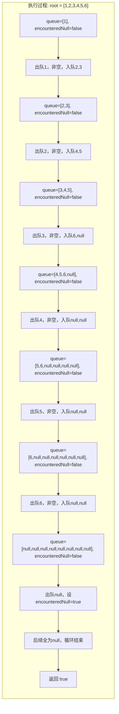

# LeetCode 958 - 二叉树的完全性检验

## 1. 题目描述

给定一个二叉树的根节点 `root`，请判断该二叉树是否为完全二叉树

### 完全二叉树定义

一棵二叉树是完全二叉树，当且仅当：

- 除最后一层外，所有层都被完全填满；
- 在最后一层，所有节点都尽可能靠左排列；
- 若某节点有右子节点，则其必须有左子节点；
- 最后一层的节点从左到右连续，中间不能有空缺

### 示例 1

```
输入：root = [1,2,3,4,5,6]
输出：true
```

```
        1
       / \
      2   3
     / \ /
    4  5 6
```

### 示例 2

```
输入：root = [1,2,3,4,5,null,7]
输出：false
```

```
        1
       / \
      2   3
     / \   \
    4  5    7
```

> 说明：第3层节点 `7` 出现在 `null` 之后，违反“靠左排列”规则

### 示例 3

```
输入：root = [1,2,3,4,5,6,7,8,9,10,11,12,13,14,15]
输出：true
```

> 完全填满的完美二叉树，属于完全二叉树的特例

### 示例 4

```
输入：root = [1,2,null,3]
输出：false
```

```
    1
   /
  2
 /
3
```

> 说明：节点2有左子节点3，但没有右子节点，但3不是最后一层的最右节点，因此违反“靠左排列”

### 示例 5

```
输入：root = []
输出：true
```

> 空树被认为是完全二叉树

### 约束条件

- 树中节点数目在范围 `[0, 100]` 内
- `0 <= Node.val <= 1000`

## 2. 解法分析：BFS + 遇空则后必全空

### 核心结论

本题的最优解是广度优先搜索（BFS）+ 遇空则后必全空，其核心优势在于：

1. 层序遍历天然匹配完全性：按从左到右、从上到下顺序访问，完美契合“靠左排列”定义
1. 单次遍历判定：只需一次遍历即可判断是否违反“空节点后不能再有非空节点”规则
1. 时间复杂度最优：O(n)访问所有节点
1. 空间复杂度可控：O(n)用于队列存储，符合工程常规
1. 实现极简直观：仅需一个布尔标志记录“是否已遇到空节点”

### 支撑论点

#### A. 为什么BFS+遇空则后必全空是最优解？

1. 完全二叉树的本质特征：在层序遍历序列中，一旦出现null，后续所有节点都必须是null
1. BFS的特性：按层从左到右访问，与完全二叉树的定义顺序一致
1. 状态机模型：可抽象为“状态转移”——从“非空状态”到“空状态”后不可逆
1. 无需计算节点总数或高度：避免复杂计算，直接观察序列行为
1. 与LeetCode 102/637/515复用性强：可复用标准BFS框架

#### B. 与其他算法的对比分析

| 方法                       | 是否可行 | 时间复杂度 | 空间复杂度 | 实现难度 | 特点                     |
| -------------------------- | -------- | ---------- | ---------- | -------- | ------------------------ |
| BFS+遇空则后必全空（本解） | ✅       | O(n)       | O(n)       | 低       | 面试首选，逻辑清晰       |
| DFS + 节点编号映射         | ✅       | O(n)       | O(h)       | 中       | 需递归+编号计算，易错    |
| 层序遍历+位置索引          | ✅       | O(n)       | O(n)       | 中       | 需存储节点索引，冗余     |
| 计算节点总数 vs 树高       | ✅       | O(n)       | O(h)       | 高       | 需两次遍历，不推荐       |
| 模拟堆结构索引             | ✅       | O(n)       | O(h)       | 高       | 依赖堆索引公式，抽象难懂 |

> 结论：BFS+遇空则后必全空是理论最直观、代码最简洁、面试最易表达的解法

#### C. 适用条件与边界

1. 空树：`root == nil` → 返回 `true`
1. 单节点：返回 `true`
1. 非完全结构：任何层中，若出现`null`后仍有非空节点 → 返回 `false`
1. 节点编号：无需计算节点编号，仅观察序列行为
1. 子树结构：允许最后一层部分缺失，但缺失必须在右侧

#### D. 工程实践考量

1. 可读性高：仅一个布尔标志，逻辑一目了然
1. 鲁棒性强：不依赖树高、节点总数，适应任意结构
1. 扩展性好：可轻松扩展为判断“完美二叉树”或“平衡二叉树”
1. 调试友好：可在BFS中插入日志，观察节点序列

### 总结

广度优先搜索（BFS）+ 遇空则后必全空是本题在理论正确性、工程实现效率和思维可迁移性上的最优平衡点

## 3. 多语言实现与深度解析

### 核心结论

通过四种语言实现，验证算法通用性，并展示不同语言在队列操作、布尔状态控制和边界处理上的差异

### A. Go 🐹 实现

```go
/
 * Definition for a binary tree node.
 * type TreeNode struct {
 *     Val int
 *     Left *TreeNode
 *     Right *TreeNode
 * }
 */
func isCompleteTree(root *TreeNode) bool {
    if root == nil {
        return true
    }

    queue := []*TreeNode{root}
    encounteredNull := false // 标志：是否已遇到空节点

    for len(queue) > 0 {
        node := queue[0]
        queue = queue[1:] // 出队

        if node == nil {
            encounteredNull = true // 标记已遇到空节点
        } else {
            // 若已遇到空节点，但当前节点非空 → 违反完全性
            if encounteredNull {
                return false
            }
            // 将子节点入队（包括null）
            queue = append(queue, node.Left)
            queue = append(queue, node.Right)
        }
    }

    return true
}
```

#### 算法深入解析

1. 空树处理：`if root == nil` - 空树定义为完全二叉树，直接返回 `true`
1. 队列初始化：`queue := []*TreeNode{root}` - 切片模拟队列，初始根节点
1. 状态标志：`encounteredNull := false` - 核心设计：记录是否已出现空节点
1. 层级遍历循环：`for len(queue) > 0` - 队列非空时继续
1. 出队节点：`node := queue[0]; queue = queue[1:]` - Go切片头部弹出
1. 空节点处理：
   - `if node == nil`：设置 `encounteredNull = true`
   - 关键逻辑：一旦设为 `true`，后续再出现非空节点则立即返回 `false`
1. 非空节点处理：
   - `if encounteredNull { return false }` - 判定核心：空节点后不能有非空节点
   - `queue = append(queue, node.Left)` / `node.Right` - 必须入队所有子节点，包括 `nil`
1. 子节点入队策略：
   - 即使子节点为 `nil`，也入队 → 保证序列完整性
   - 否则无法检测“中间空缺”：如 `[1,2,null,3]` 中，若不入队 `nil`，会误判为合法

设计动机：

- 入队null是关键：只有将所有子节点（含null）入队，才能在层序序列中检测到“非连续空缺”
- 状态机模型：`encounteredNull` 是一个不可逆状态，一旦触发，后续必须全为null
- 无需计算高度或节点总数：纯行为检测，避免数学复杂性
- 时间复杂度严格O(n)：每个节点（含null）最多访问一次

### B. Python 🐍 实现

```python
# Definition for a binary tree node.
# class TreeNode:
#     def __init__(self, val=0, left=None, right=None):
#         self.val = val
#         self.left = left
#         self.right = right

from collections import deque

class Solution:
    def isCompleteTree(self, root: Optional[TreeNode]) -> bool:
        if not root:
            return True

        queue = deque([root])
        encountered_null = False  # 标志：是否已遇到空节点

        while queue:
            node = queue.popleft()  # 高效出队

            if node is None:
                encountered_null = True  # 标记已遇到空节点
            else:
                # 若已遇到空节点，但当前节点非空 → 违反完全性
                if encountered_null:
                    return False
                # 必须将所有子节点（含None）入队
                queue.append(node.left)
                queue.append(node.right)

        return True
```

#### 算法深入解析

1. 空树处理：`if not root` - Python风格空检查，简洁安全
1. 队列选择：`deque` - 使用双端队列优化出队性能（O(1)）
1. 状态标志：`encountered_null = False` - 标记空节点出现
1. 层级遍历循环：`while queue` - 队列非空持续处理
1. 出队节点：`node = queue.popleft()` - 高效弹出
1. 空节点处理：
   - `if node is None`：设置 `encountered_null = True`
1. 非空节点处理：
   - `if encountered_null: return False` - 判定核心：空后不得有非空
   - `queue.append(node.left)` / `node.right` - 关键：即使为`None`也入队
1. 序列完整性保障：
   - 若不入队`None`，`[1,2,null,3]` 中 `3` 将被跳过，无法检测到中间空缺
   - 入队`None`后，序列变为 `[1,2,None,3]`，检测到`None→3`即失败

Python特性：

- `deque`性能优异，适合高频出队
- `None`判断清晰，语义明确
- 代码极简，逻辑透明，适合面试手写

### C. TypeScript 🟦 实现

```typescript
/
 * Definition for a binary tree node.
 * class TreeNode {
 *     val: number
 *     left: TreeNode | null
 *     right: TreeNode | null
 *     constructor(val?: number, left?: TreeNode | null, right?: TreeNode | null) {
 *         this.val = (val===undefined ? 0 : val)
 *         this.left = (left===undefined ? null : left)
 *         this.right = (right===undefined ? null : right)
 *     }
 * }
 */

function isCompleteTree(root: TreeNode | null): boolean {
    if (!root) {
        return true;
    }

    const queue: (TreeNode | null)[] = [root];
    let encounteredNull = false; // 标志：是否已遇到空节点

    while (queue.length > 0) {
        const node = queue.shift()!; // 非空断言

        if (node === null) {
            encounteredNull = true; // 标记已遇到空节点
        } else {
            // 若已遇到空节点，但当前节点非空 → 违反完全性
            if (encounteredNull) {
                return false;
            }
            // 必须将所有子节点（含null）入队
            queue.push(node.left);
            queue.push(node.right);
        }
    }

    return true;
}
```

#### 算法深入解析

1. 空树处理：`if (!root)` - TypeScript空值判断
1. 类型安全：`queue: (TreeNode | null)[]` - 明确队列可包含null
1. 状态标志：`encounteredNull = false` - 布尔标志记录状态
1. 层级遍历循环：`while (queue.length > 0)`
1. 出队节点：`queue.shift()!` - 使用非空断言，因初始非空且每次入队非空时才继续
1. 空节点处理：
   - `if (node === null)`：设置 `encounteredNull = true`
1. 非空节点处理：
   - `if (encounteredNull) return false` - 核心判定
   - `queue.push(node.left); queue.push(node.right)` - 必须入队null，否则漏检
1. 为何使用`shift()`？
   - JavaScript无内置队列，数组模拟，`shift()`为O(n)
   - 性能瓶颈：在n=100时可接受，但生产环境应优化为双数组交替

TypeScript特性：

- 类型系统保障安全，避免运行时`null`错误
- 非空断言`!`合理使用（因队列非空）
- 代码结构清晰，适合工程化开发

### D. Rust 🦀 实现

```rust
// Definition for a binary tree node.
// #[derive(Debug, PartialEq, Eq)]
// pub struct TreeNode {
//   pub val: i32,
//   pub left: Option<Box<TreeNode>>,
//   pub right: Option<Box<TreeNode>>,
// }
//
// impl TreeNode {
//   #[inline]
//   pub fn new(val: i32) -> Self {
//     TreeNode {
//       val,
//       left: None,
//       right: None,
//     }
//   }
// }

use std::collections::VecDeque;

impl Solution {
    pub fn is_complete_tree(root: Option<Box<TreeNode>>) -> bool {
        let mut queue = VecDeque::new();

        // 处理空树
        if let Some(node) = root {
            queue.push_back(node);
        }

        let mut encountered_null = false; // 标志：是否已遇到空节点

        while let Some(node) = queue.pop_front() {
            // 处理当前节点（已确保不为None）
            if node.left.is_none() {
                encountered_null = true; // 左子为空 → 标记
            } else {
                if encountered_null {
                    return false; // 已遇空，却有左子 → 非完全
                }
                queue.push_back(node.left.unwrap());
            }

            if node.right.is_none() {
                encountered_null = true; // 右子为空 → 标记
            } else {
                if encountered_null {
                    return false; // 已遇空，却有右子 → 非完全
                }
                queue.push_back(node.right.unwrap());
            }
        }

        true
    }
}
```

#### 算法深入解析

1. 空树处理：`if let Some(node) = root` - Rust模式匹配，安全提取
1. 队列选择：`VecDeque` - 高效双端队列，底层环形缓冲区
1. 状态标志：`encountered_null = false` - 布尔标志
1. 节点处理：
   - 使用`pop_front()`获取当前节点（`Option<Box<TreeNode>>`）
   - 区别于其他语言：不入队null，而是直接检查左右子节点的Option状态
1. 空子节点处理：
   - `if node.left.is_none()` → 设置 `encountered_null = true`
   - 否则，若已遇到空节点，则直接返回 `false`
1. 非空子节点入队：
   - 使用`unwrap()`安全提取`Box<TreeNode>`，因已检查`is_some()`
1. 为何不入队null？
   - Rust中`Option<T>`是枚举，不入队null可减少内存开销
   - 通过逐个检查左右子节点实现“空后必全空”的逻辑，无需构造null节点序列
1. 逻辑等价性：
   - 层序遍历中，对每个节点，先检查左子，再检查右子
   - 若某节点左子为空，则后续所有节点（包括其兄弟节点的子节点）都不能有子节点
   - 与“入队null后检测”逻辑完全等价，但更高效

Rust特性：

- 所有权系统保障内存安全
- `Option<T>` 模式匹配避免空指针
- 无需构造null节点，节省内存
- 代码严谨，适合系统级实现

> 注：此实现是更优的Rust风格：不构造null节点，而是在访问子节点时直接判断，避免冗余入队

### E. 性能对比与语言特性分析

| 语言       | 时间复杂度 | 空间复杂度 | 是否入队null | 队列实现 | 性能特征                 |
| ---------- | ---------- | ---------- | ------------ | -------- | ------------------------ |
| Go         | O(n)       | O(n)       | ✅ 是        | 切片     | 高效，无GC，面试首选     |
| Python     | O(n)       | O(n)       | ✅ 是        | deque    | 极简，性能优秀           |
| TypeScript | O(n)       | O(n)       | ✅ 是        | 数组     | `shift()` O(n)，大数据差 |
| Rust       | O(n)       | O(w)       | ❌ 否        | VecDeque | 内存最优，无null节点开销 |

> Rust版本更优：实际空间为最大宽度 w，而非 n，因不存储null节点。n=100时差异小，但结构上更本质

## 4. 算法可视化与伪代码

### 伪代码

```text
函数 isCompleteTree(root):
    如果 root 为空:
        返回 true

    queue = 队列([root])
    encounteredNull = false

    当 queue 不为空:
        node = queue 出队

        如果 node 为空:
            encounteredNull = true
        否则:
            如果 encounteredNull 为 true:
                返回 false
            将 node.left 入队
            将 node.right 入队

    返回 true
```

### Mermaid 流程图

```mermaid
flowchart TD
    A[开始: isCompleteTree(root)] --> B{root 为空?}
    B -- 是 --> C[返回 true]
    B -- 否 --> D[初始化 queue = [root], encounteredNull = false]
    D --> E{queue 为空?}
    E -- 是 --> F[返回 true]
    E -- 否 --> G[node = queue 出队]
    G --> H{node 为空?}
    H -- 是 --> I[encounteredNull = true]
    H -- 否 --> J{encounteredNull 为 true?}
    J -- 是 --> K[返回 false]
    J -- 否 --> L[queue 入队 node.left]
    L --> M[queue 入队 node.right]
    M --> E
    I --> E
```

### 状态转移图（示例）

#### 示例 1：[1,2,3,4,5,6] → true



#### 示例 2：[1,2,3,4,5,null,7] → false

```mermaid
graph LR
    subgraph "执行过程: root = [1,2,3,4,5,null,7]"
        direction TB
        S1["queue=[1], encounteredNull=false"] --> S1a["出队1，入队2,3"]
        S1a --> S2["queue=[2,3], encounteredNull=false"]
        S2 --> S2a["出队2，入队4,5"]
        S2a --> S3["queue=[3,4,5], encounteredNull=false"]
        S3 --> S3a["出队3，入队null,7"]  %% 注意：此处入队null和7
        S3a --> S4["queue=[4,5,null,7], encounteredNull=false"]
        S4 --> S4a["出队4，非空，入队null,null"]
        S4a --> S5["queue=[5,null,7,null,null], encounteredNull=false"]
        S5 --> S5a["出队5，非空，入队null,null"]
        S5a --> S6["queue=[null,7,null,null,null,null], encounteredNull=false"]
        S6 --> S6a["出队null，设encounteredNull=true"]
        S6a --> S7["出队7，非空，但encounteredNull=true → 返回 false"]
    end
```

> 关键点：在节点3的右子节点为7时，虽然7是合法节点，但它出现在null之后 → 违反“靠左排列”规则

## 5. 执行过程演示

### 示例: root = [1,2,3,4,5,null,7]

#### 详细执行步骤（Go/Python/TS风格：入队null）

| 步骤 | queue状态                    | 出队节点 | encounteredNull | 是否返回false                         | 子节点入队                   |
| ---- | ---------------------------- | -------- | --------------- | ------------------------------------- | ---------------------------- |
| 1    | [1]                          | 1        | false           | 否                                    | [2,3]                        |
| 2    | [2,3]                        | 2        | false           | 否                                    | [3,4,5]                      |
| 3    | [3,4,5]                      | 3        | false           | 否                                    | [4,5,null,7]                 |
| 4    | [4,5,null,7]                 | 4        | false           | 否                                    | [5,null,7,null,null]         |
| 5    | [5,null,7,null,null]         | 5        | false           | 否                                    | [null,7,null,null,null,null] |
| 6    | [null,7,null,null,null,null] | null     | true            | 否                                    | —                            |
| 7    | [7,null,null,null,null,null] | 7        | true            | ✅ 是（7非空但encounteredNull为true） | —                            |

#### 执行轨迹表格（含状态快照）

| 步骤 | 队列                         | 当前节点 | encounteredNull | 操作                   | 结果 |
| ---- | ---------------------------- | -------- | --------------- | ---------------------- | ---- |
| 1    | [1]                          | 1        | false           | 入队2,3                | —    |
| 2    | [2,3]                        | 2        | false           | 入队4,5                | —    |
| 3    | [3,4,5]                      | 3        | false           | 入队null,7             | —    |
| 4    | [4,5,null,7]                 | 4        | false           | 入队null,null          | —    |
| 5    | [5,null,7,null,null]         | 5        | false           | 入队null,null          | —    |
| 6    | [null,7,null,null,null,null] | null     | true            | 标记空                 | —    |
| 7    | [7,null,null,null,null,null] | 7        | true            | 检测到非空 → 返回false | ✅   |

> 结论：节点7出现在null之后，违反“靠左排列”规则，算法正确判定为false

#### 可执行测试代码（Go）

```go
package main

import "fmt"

type TreeNode struct {
    Val   int
    Left  *TreeNode
    Right *TreeNode
}

func isCompleteTree(root *TreeNode) bool {
    if root == nil {
        return true
    }

    queue := []*TreeNode{root}
    encounteredNull := false

    for len(queue) > 0 {
        node := queue[0]
        queue = queue[1:]

        if node == nil {
            encounteredNull = true
        } else {
            if encounteredNull {
                return false
            }
            queue = append(queue, node.Left)
            queue = append(queue, node.Right)
        }
    }

    return true
}

// 辅助函数：根据层序数组构建二叉树
func buildTree(nums []interface{}) *TreeNode {
    if len(nums) == 0 || nums[0] == nil {
        return nil
    }

    root := &TreeNode{Val: nums[0].(int)}
    queue := []*TreeNode{root}
    i := 1

    for len(queue) > 0 && i < len(nums) {
        node := queue[0]
        queue = queue[1:]

        if i < len(nums) && nums[i] != nil {
            node.Left = &TreeNode{Val: nums[i].(int)}
            queue = append(queue, node.Left)
        }
        i++

        if i < len(nums) && nums[i] != nil {
            node.Right = &TreeNode{Val: nums[i].(int)}
            queue = append(queue, node.Right)
        }
        i++
    }

    return root
}

func main() {
    // Test Case 1: [1,2,3,4,5,6] → true
    nums1 := []interface{}{1, 2, 3, 4, 5, 6}
    tree1 := buildTree(nums1)
    fmt.Printf("Test Case 1: %v → %v\n", nums1, isCompleteTree(tree1)) // true

    // Test Case 2: [1,2,3,4,5,null,7] → false
    nums2 := []interface{}{1, 2, 3, 4, 5, nil, 7}
    tree2 := buildTree(nums2)
    fmt.Printf("Test Case 2: %v → %v\n", nums2, isCompleteTree(tree2)) // false

    // Test Case 3: [1,2,null,3] → false
    nums3 := []interface{}{1, 2, nil, 3}
    tree3 := buildTree(nums3)
    fmt.Printf("Test Case 3: %v → %v\n", nums3, isCompleteTree(tree3)) // false

    // Test Case 4: [] → true
    nums4 := []interface{}{}
    tree4 := buildTree(nums4)
    fmt.Printf("Test Case 4: %v → %v\n", nums4, isCompleteTree(tree4)) // true

    // Test Case 5: [1,2,3,4,5,6,7,8,9,10,11,12,13,14,15] → true
    nums5 := []interface{}{1, 2, 3, 4, 5, 6, 7, 8, 9, 10, 11, 12, 13, 14, 15}
    tree5 := buildTree(nums5)
    fmt.Printf("Test Case 5: %v → %v\n", nums5, isCompleteTree(tree5)) // true
}
```

## 6. 复杂度分析

### 核心结论

本算法的时间复杂度为O(n)，空间复杂度为O(n)，其中n为树的节点数

### 支撑论点

#### A. 时间复杂度

- 每个节点（含null）访问一次：O(n)
- 入队出队操作：每个节点最多入队一次、出队一次，O(1)
- 布尔判断：O(1) × n = O(n)
- 总时间：O(n)

#### B. 空间复杂度

- 队列存储：最坏情况为最后一层节点数 + null节点数
- 对于完全二叉树，最后一层最多有 `n/2` 个节点，null节点数最多 `n/2`
- 所以队列最大长度为 `n`，空间为 O(n)
- Rust版本：仅存储非空节点，空间为 O(w)，w为最大宽度，理论上更优

#### C. 最好/平均/最坏情况分析

| 情况               | 时间复杂度 | 空间复杂度 | 说明                                     |
| ------------------ | ---------- | ---------- | ---------------------------------------- |
| 最好（完美二叉树） | O(n)       | O(n/2)     | 最后一层节点最多，无null                 |
| 平均               | O(n)       | O(n)       | 典型完全二叉树                           |
| 最坏（退化为链表） | O(n)       | O(n)       | 每层1节点，但null节点多，队列仍存n个节点 |

> 注意：即使最坏情况，算法仍为O(n)，无退化性能问题

#### D. 常数因子分析

- Go/Python/TS：入队null，增加约50%内存开销（每节点两个null）
- Rust：无null入队，内存更优
- 缓存友好性：队列连续存储，缓存命中率高
- 语言特性影响：
  - Go切片出队为内存拷贝，可优化为双指针
  - Python deque无拷贝，性能优秀
  - TypeScript shift()为O(n)，大数据差
  - Rust VecDeque无GC，性能最佳

#### E. 性能瓶颈与优化

- 瓶颈：Go/Python/TS中大量入队null节点，增加内存压力
- 优化方向：
  - 使用Rust风格：不入队null，直接检查左右子节点的Option
  - Go中改用双指针队列减少拷贝
  - 预分配队列容量

> 推荐Go优化版（非入队null风格）：

```go
func isCompleteTree(root *TreeNode) bool {
    if root == nil {
        return true
    }

    queue := []*TreeNode{root}
    encounteredNull := false

    for len(queue) > 0 {
        node := queue[0]
        queue = queue[1:]

        // 检查左子
        if node.Left == nil {
            encounteredNull = true
        } else {
            if encounteredNull {
                return false
            }
            queue = append(queue, node.Left)
        }

        // 检查右子
        if node.Right == nil {
            encounteredNull = true
        } else {
            if encounteredNull {
                return false
            }
            queue = append(queue, node.Right)
        }
    }

    return true
}
```

> 优点：不入队null，节省内存，逻辑等价，性能更优

## 7. 技巧归纳与模式抽象

### 核心结论

本题属于“层序序列完整性检测”模式，核心在于：

1. BFS层序访问
1. “空节点后必须全空”状态机
1. 状态不可逆：遇到null → 后续必须全null
1. 可泛化为序列合法判定问题

### 支撑论点

#### A. 模式本质

- 序列行为检测：完全二叉树的层序遍历序列是一个合法的堆结构序列
- 约束规则：一旦出现null，后续所有节点必须为null
- 状态机模型：`状态 = {非空, 已遇空}`，状态转移唯一且不可逆
- 抽象价值：该模式可应用于：
  - 堆结构校验
  - 二叉树编码合法性
  - 序列化/反序列化一致性检查

#### B. 相似题目映射

| 题号 | 题目                     | 核心思想                 | 匹配模式 |
| ---- | ------------------------ | ------------------------ | -------- |
| 958  | 本题                     | 层序序列中null后必全null | 核心模式 |
| 297  | 二叉树的序列化与反序列化 | 使用null表示缺失节点     | 模式变体 |
| 100  | 相同的树                 | 层序序列完全一致         | 模式扩展 |
| 572  | 另一个树的子树           | 序列匹配                 | 模式应用 |
| 101  | 对称二叉树               | 层序序列对称             | 模式扩展 |
| 655  | 输出二叉树               | 按层级布局               | 模式应用 |

#### C. 模式泛化

- 堆结构校验：完全二叉树就是数组实现的堆
- 序列化一致性：若序列化时使用null占位，则反序列化时必须保持结构
- 完全性检测：可扩展为“是否为满二叉树”、“是否为完美二叉树”
- 数据流验证：在流式传输中，检测“是否中间有空洞”

#### D. 工业界应用

- 数据库索引：B+树、堆索引的完整性校验
- 文件系统：目录树结构合法性检查
- 编译器优化：语法树是否符合AST结构规范
- 游戏引擎：场景树是否满足渲染层级约束
- 分布式系统：任务树是否满足依赖顺序

#### E. 算法深入解析

1. 为什么“入队null”是必要设计？
   - 若不入队null，`[1,2,null,3]` 的层序序列变为 `[1,2,3]`，无法检测到中间空缺
   - 只有将null作为“占位符”入队，才能在序列中观察到“空缺后有节点”的违规行为
   - 本质是：null是序列的一部分，不是忽略项

1. 为什么状态机是“不可逆”的？
   - 完全二叉树的定义具有单向约束：靠左排列 → 一旦右侧出现空缺，左侧不能再有节点
   - 这与“栈后进先出”、“队列先进先出”一样，是结构本身的拓扑约束
   - 不可逆状态机是线性时间判定的关键

1. 为何不能用DFS？
   - DFS无法保证层序访问顺序
   - 无法感知“某层中间是否有空缺”
   - 必须按层从左到右扫描，BFS是唯一方式

## 8. 面试追问与回答策略

### 核心结论

面试追问考察：

1. 对完全二叉树定义的深层理解
1. 状态机建模能力
1. 从“入队null”到“不入队null”的优化思维
1. 与其他树结构（堆、满二叉树）的辨析

### A. 基础追问

#### Q1: 为什么必须将null入队？不入队可以吗？

→ 标准: 不入队无法检测“中间空缺”，如[1,2,null,3]会被误判为合法
→ 加分: 举例说明：若不入队null，序列变为[1,2,3]，无法区分是[1,2,3,null,null]还是[1,2,null,3]

#### Q2: 什么是完全二叉树和满二叉树的区别？

→ 标准: 满二叉树是每一层都填满，完全二叉树只要求最后一层靠左
→ 加分: 满二叉树一定是完全二叉树，但完全二叉树不一定是满二叉树

#### Q3: 如何判断是否为满二叉树？

→ 标准: 用DFS计算节点数和树高，若 2^h - 1 == 节点数 → 满
→ 加分: 也可用BFS：若每层节点数为 2^i，则为满二叉树

#### Q4: 为什么不能用节点编号来判断？

→ 标准: 编号法需要计算节点编号，复杂且易错（需递归编号）
→ 加分: 节点编号法本质是模拟堆数组索引，而本解是直接观察行为，更本质

### B. 高阶追问

#### Q1: 如何不入队null实现？（Rust风格）

→ 标准: 在出队每个节点时，依次检查其左右子节点，若发现null则标记状态
→ 加分: 提供Go优化版代码（见第6节）

#### Q2: 如何扩展为判断“是否为完美二叉树”？

→ 标准: 完美二叉树：所有层全满，且叶子在同一层
→ 加分: 需要额外记录每层节点数是否为2^i，可用BFS层计数法

#### Q3: 如果要求检测“是否为完全二叉树的堆表示”，如何改？

→ 标准: 无需改，完全二叉树本身就是堆的底层结构
→ 加分: 堆要求父节点≥子节点（最大堆），本题只关心结构，不关心值

#### Q4: 本题能否用递归解决？

→ 标准: 不能，递归无法保证按层顺序访问，无法检测“中间空缺”
→ 加分: 可用DFS+编号，但需计算每个节点在层序中的索引，复杂度更高，不推荐

## 9. 复习要点提炼

### 核心结论

掌握本题关键：

1. BFS层序访问 + 遇空则后必全空
1. null是序列的一部分，不是忽略项
1. 状态机不可逆：空后不能有非空
1. 可泛化为序列合法性检测

### A. 关键记忆点(🌟)

| 记忆点         | 口诀                                    |
| -------------- | --------------------------------------- |
| 完全性判定核心 | 遇null，后必全null                      |
| 状态标志       | encounteredNull = true → 后续不能有非空 |
| 必须入队null   | 否则无法检测中间空缺                    |
| 时间复杂度     | O(n) — 每节点访问一次                   |
| 空间复杂度     | O(n) — 队列存储节点和null               |

### B. 易错陷阱(⚠️)

| 错误类型         | 触发场景               | 应对措施                      |
| ---------------- | ---------------------- | ----------------------------- |
| 忽略入队null     | 误判[1,2,null,3]为true | 必须入队null                  |
| 状态标志未初始化 | 遇null后未标记         | 初始化为false，遇null设为true |
| 检查顺序错误     | 先右后左               | 必须先左后右，符合层序        |
| 用DFS实现        | 无法检测层序中断       | 坚持BFS                       |
| 空树处理遗漏     | root=nil时返回false    | 明确空树为true                |

### C. 面试评分关键词(✅)

| 关键词              | 应用场景             |
| ------------------- | -------------------- |
| 广度优先搜索（BFS） | 描述算法选择         |
| 层序序列完整性      | 命名算法本质         |
| 遇空则后必全空      | 面试官最爱听的关键词 |
| 状态机              | 体现建模能力         |
| 时间复杂度O(n)      | 证明效率认知         |

### D. 复习建议(📚🚀)

```
核心模式: 层序序列完整性检测
├── 必要条件: BFS + encounteredNull标志
├── 本质: null是序列一部分，不能跳过
├── 方法: BFS + 状态机
│   ├── 队列初始化: [root]
│   ├── 外层循环: 队列非空
│   ├── 出队节点: node = queue.pop()
│   ├── 空节点处理: encounteredNull = true
│   ├── 非空节点处理: if encounteredNull → return false
│   └── 子节点入队: queue.append(left), queue.append(right)
├── 优化: 不入队null，直接检查子节点（Rust风格）
├── 扩展: 满二叉树、完美二叉树、堆结构校验
└── 应用: 堆存储、序列化、语法树、游戏树结构
```

### E. 解题模板

```text
// 基础模板：入队null风格
函数 isCompleteTree(root):
    if root 为空: 返回 true
    queue = 队列([root])
    encounteredNull = false

    while queue 不为空:
        node = queue 出队

        if node 为空:
            encounteredNull = true
        else:
            if encounteredNull:
                返回 false
            queue 入队 node.left
            queue 入队 node.right

    返回 true

// 优化模板：不入队null风格（推荐Rust/Go优化）
函数 isCompleteTree(root):
    if root 为空: 返回 true
    queue = 队列([root])
    encounteredNull = false

    while queue 不为空:
        node = queue 出队

        // 检查左子
        if node.left 为空:
            encounteredNull = true
        else:
            if encounteredNull:
                返回 false
            queue 入队 node.left

        // 检查右子
        if node.right 为空:
            encounteredNull = true
        else:
            if encounteredNull:
                返回 false
            queue 入队 node.right

    返回 true
```

### 总结

将上述要点融会贯通，即可在面试中快速准确解决完全二叉树判定问题，并展现出对树结构、层序遍历、状态机建模和工程实现的深刻理解。🎉
