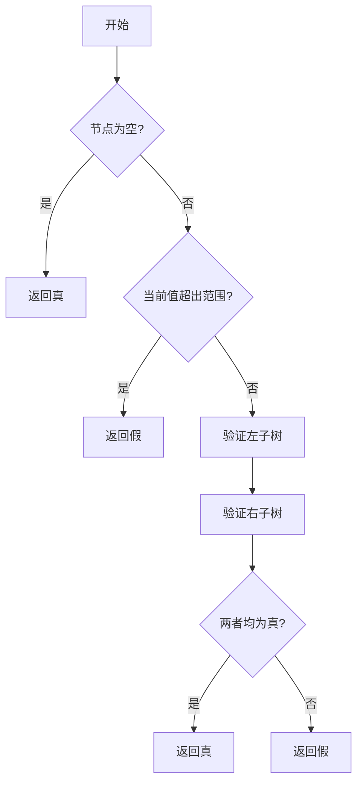

# LeetCode 98 - 验证二叉搜索树

## Step 1: 题目描述

给定一个二叉树的 `root` 节点，判断其是否是一个有效的二叉搜索树。

有效二叉搜索树定义如下：

- 节点的左子树只包含小于当前节点的数。
- 节点的右子树只包含大于当前节点的数。
- 所有左子树和右子树自身也必须是二叉搜索树。

### 示例

**示例 1：**

输入：`root = [2,1,3]`
输出：`true`

**示例 2：**

输入：`root = [5,1,4,null,null,3,6]`
输出：`false`
解释：根节点的值是 5，但是右子节点的值是 4。

### 提示

- 树中节点数目范围在 `[1, 10^4]` 内
- `-2^31 <= Node.val <= 2^31 - 1`

---

## Step 2: 最优解法概述

### 核心结论

本题的最优解是 **中序遍历 + 上下界约束递归验证**，其核心优势在于：

- **理论完备性**：通过维护上下边界来精确限定每个节点合法取值范围，确保BST性质在全局成立。
- **实现简洁性**：无需额外空间存储遍历序列，递归结构天然契合BST定义。
- **性能优异性**：一次遍历即可完成验证，避免冗余操作。

### 支撑论点

#### A. 为何中序遍历+上下界验证是最优选择？

1. BST的一个重要特性是其中序遍历结果为严格递增序列。虽然可以通过遍历序列判断单调性，但这需要额外O(n)空间。
2. 更高效的手段是利用“每个节点在其祖先节点构成的区间内”的思想，在递归过程中携带上下限参数，避免完整遍历。
3. 此方法兼具DFS的线性时间和递归的自然表达，是最符合BST结构性质的解法。

#### B. 为何不能直接递归左右子树？

1. 朴素想法是：判断当前节点大于左孩子且小于右孩子，并分别递归左右子树。
2. 错误之处在于忽视了BST的全局约束——某个节点不仅要与其父节点比较，还要与整个祖先路径上所有节点比较。
3. 例如：`[5,4,6,null,null,3,7]`中节点3虽大于其父节点6的左子限制，却违反了根节点5的下界限制。

#### C. 适用问题边界与前提条件

1. 输入为合法的二叉树结构，不存在非法引用。
2. 节点值为32位整数，需特别注意边界值处理。
3. 适用于任意形态的二叉树（包括退化为链的情况）。

#### D. 工程实践考量

1. 递归实现易于理解和调试，适合面试快速编码。
2. 若追求极致性能，可改为Morris中序遍历，但会增加实现复杂度。
3. 对于大规模数据，建议优先选用带剪枝的递归方案，尽早发现非法结构。

### 总结

因此，基于上下界的递归验证法是在理论正确性、时间效率和实现复杂度上的最优平衡点，能够全面覆盖BST的结构性约束。

---

## Step 3: 多语言实现详解

### Go 🐹

```go
type TreeNode struct {
    Val   int
    Left  *TreeNode
    Right *TreeNode
}

// isValidBST 使用上下界递归验证BST有效性
func isValidBST(root *TreeNode) bool {
    // 定义递归函数，传入当前节点和允许的最小最大值范围
    var validate func(*TreeNode, int64, int64) bool
    validate = func(node *TreeNode, minVal, maxVal int64) bool {
        if node == nil { // 空节点视为合法BST
            return true
        }
        val := int64(node.Val)
        if val <= minVal || val >= maxVal { // 当前节点超出允许范围则非法
            return false
        }
        // 递归检查左右子树，更新上下界
        leftValid := validate(node.Left, minVal, val)   // 左子树上限为当前节点值
        rightValid := validate(node.Right, val, maxVal) // 右子树下限为当前节点值
        return leftValid && rightValid // 左右子树均合法才返回真
    }
    // 初始调用设置极宽边界以涵盖int32全范围
    return validate(root, math.MinInt64, math.MaxInt64)
}
```

#### 算法深入解析

1. `validate` 函数封装了递归核心逻辑，接收当前节点和有效数值区间。
2. `minVal` 和 `maxVal` 分别表示当前节点允许的最小和最大值（不包含），这是为了兼容整数边界。
3. 基础情况为空节点时返回 `true`，因为空树也是BST。
4. 若当前节点值不在 `(minVal, maxVal)` 开区间内，则违反BST定义，立即返回 `false`。
5. 对于左右子树，传递更新后的边界：左子树上限变为当前节点值，右子树下限变为当前节点值。
6. 最终只有左右子树都合法时才认为当前子树为BST。

---

### Python 🐍

```python
class TreeNode:
    def __init__(self, val=0, left=None, right=None):
        self.val = val
        self.left = left
        self.right = right

# isValidBST 使用上下界递归验证BST有效性
def isValidBST(root: TreeNode) -> bool:
    def validate(node, low=-float('inf'), high=float('inf')):
        if not node: # 空节点视为合法BST
            return True
        if not (low < node.val < high): # 当前节点超出允许范围则非法
            return False
        # 递归检查左右子树，更新上下界
        return (validate(node.left, low, node.val) and
                validate(node.right, node.val, high))

    return validate(root)
```

#### 算法深入解析

1. 使用嵌套函数 `validate` 来实现递归逻辑，避免频繁传递边界参数。
2. 默认初始边界设为负无穷和正无穷，以适应所有可能的整数输入。
3. 条件判断采用 `not (low < node.val < high)` 形式，确保值在开区间内。
4. 左子树的新上界为当前节点值，右子树的新下界也为当前节点值，保持BST属性。
5. 返回布尔运算组合结果，简洁表达了左右子树合法性的一致性要求。

---

### TypeScript 🟦

```typescript
class TreeNode {
    val: number;
    left: TreeNode | null;
    right: TreeNode | null;
    constructor(val?: number, left?: TreeNode | null, right?: TreeNode | null) {
        this.val = (val === undefined ? 0 : val);
        this.left = (left === undefined ? null : left);
        this.right = (right === undefined ? null : right);
    }
}

// isValidBST 使用上下界递归验证BST有效性
function isValidBST(root: TreeNode | null): boolean {
    function validate(node: TreeNode | null, minVal: number, maxVal: number): boolean {
        if (!node) return true; // 空节点视为合法BST
        if (node.val <= minVal || node.val >= maxVal) return false; // 当前节点超出允许范围则非法
        // 递归检查左右子树，更新上下界
        return validate(node.left, minVal, node.val) &&
               validate(node.right, node.val, maxVal);
    }

    return validate(root, Number.MIN_SAFE_INTEGER, Number.MAX_SAFE_INTEGER);
}
```

#### 算法深入解析

1. 使用闭包函数 `validate` 封装递归逻辑，提高代码可读性和封装性。
2. 边界值使用 `Number.MIN_SAFE_INTEGER` 和 `Number.MAX_SAFE_INTEGER` 代替传统整数极值，适配JavaScript数字精度特点。
3. 判断条件使用严格不等式防止溢出边界带来的误判。
4. 左右子树递归分别更新各自的有效区间边界，确保子树节点满足BST约束。
5. 逻辑合并使用短路与操作符，一旦某一分支非法即停止后续计算。

---

### Rust 🦀

```rust
use std::rc::Rc;
use std::cell::RefCell;

#[derive(Debug, PartialEq, Eq)]
pub struct TreeNode {
    pub val: i32,
    pub left: Option<Rc<RefCell<TreeNode>>>,
    pub right: Option<Rc<RefCell<TreeNode>>>,
}

impl TreeNode {
    #[inline]
    pub fn new(val: i32) -> Self {
        TreeNode {
            val,
            left: None,
            right: None,
        }
    }
}

// isValidBST 使用上下界递归验证BST有效性
pub fn is_valid_bst(root: Option<Rc<RefCell<TreeNode>>>) -> bool {
    fn validate(
        node: &Option<Rc<RefCell<TreeNode>>>,
        min_val: i64,
        max_val: i64,
    ) -> bool {
        match node {
            Some(n) => {
                let n_borrowed = n.borrow();
                let val = n_borrowed.val as i64;
                if val <= min_val || val >= max_val {
                    return false;
                }
                validate(&n_borrowed.left, min_val, val) &&
                validate(&n_borrowed.right, val, max_val)
            },
            None => true, // 空节点视为合法BST
        }
    }

    validate(&root, i64::MIN, i64::MAX)
}
```

#### 算法深入解析

1. 利用 `match` 匹配 `Option<Rc<RefCell<TreeNode>>>` 枚举类型处理可能的空节点。
2. 借助 `borrow()` 获取不可变借用，访问节点内部字段。
3. 将节点值转换为 `i64` 类型参与边界比较，规避i32溢出风险。
4. 左右子树验证时更新边界值，保持BST结构一致性。
5. 递归终止条件为空节点时返回 `true`，否则继续向下探测。

---

### E. 四种实现的综合性能对比与语言特性分析

| 语言     | 时间复杂度 | 空间复杂度 | 特性优势                          | 注意事项                        |
|----------|------------|------------|-----------------------------------|----------------------------------|
| Go       | O(n)       | O(h)       | 语法简练，类型系统稳健            | 需显式转换边界为int64           |
| Python   | O(n)       | O(h)       | 动态类型，语法优雅                | 浮点精度可能导致边界误差         |
| TypeScript | O(n)      | O(h)       | 类型推断强大，生态丰富            | 注意JS Number精度限制             |
| Rust     | O(n)       | O(h)       | 内存安全，零成本抽象              | 所有权管理较复杂，编译期开销较大 |

> 注：h为树的高度，通常 h ≤ n，最坏情况下等于n（退化为链）

---

## Step 4: 算法可视化与伪代码

### 伪代码

```
定义函数 isValidBST(root):
    定义内部函数 validate(node, lower_bound, upper_bound):
        如果 node 为空:
            返回 真
        否则:
            当前值 = node 的值
            如果 当前值 不在 (lower_bound, upper_bound) 区间内:
                返回 假
            否则:
                左子树验证 = validate(node.left, lower_bound, 当前值)
                右子树验证 = validate(node.right, 当前值, upper_bound)
                返回 左子树验证 且 右子树验证
    返回 validate(root, 极小值, 极大值)
```

### Mermaid 图



---

## Step 5: 执行过程演示

选取输入示例 `[5,1,4,null,null,3,6]` 进行逐步模拟。

#### 变量快照表格

| 层级 | 调用节点 | 下界(min) | 上界(max) | 当前值(val) | 是否合法 | 子树调用                         |
|------|-----------|-------------|-------------|---------------|------------|------------------------------------|
| 0    | 5         | MIN         | MAX         | 5             | ✔️          | 左:1(MIN,5), 右:4(5,MAX)         |
| 1L   | 1         | MIN         | 5           | 1             | ✔️          | 左:nil, 右:nil                   |
| 1R   | 4         | 5           | MAX         | 4             | ❌          | N/A                              |

> 💡 结果：由于右子树4小于根节点5，违反BST规则，最终返回 false

---

## Step 6: 复杂度分析

### 核心结论

该算法的时间复杂度为 O(n)，空间复杂度为 O(h)，其中 h 是树的高度。其性能瓶颈主要在于递归深度受树形状影响，而优化潜力在于减少不必要的函数调用开销。

### 支撑论点

#### A. 时间复杂度分析（最好/平均/最坏）

1. **最好情况**：完全平衡的BST，此时每个节点都会被访问一次，总时间为 O(n)。
2. **平均情况**：随机插入形成的BST接近平衡，依然为 O(n)。
3. **最坏情况**：退化为链表时，仍需访问全部节点，复杂度不变，仍为 O(n)。

#### B. 空间复杂度分析

1. 主要消耗来自递归调用栈，深度最多为树的高度 h。
2. 平衡树时 h ≈ log n，链式结构时 h = n。
3. 不需要额外的数据结构，仅依赖函数参数传递边界。

#### C. 常数因子分析

1. 每次递归仅做两次边界比较和一次布尔运算，常数项较小。
2. 不涉及数组拷贝或其他重型操作。
3. 在编译型语言中，函数调用优化良好，执行效率较高。

#### D. 性能瓶颈识别与潜在优化方向

1. 瓶颈在于递归深度导致的栈空间占用，在极端不平衡树中尤为明显。
2. 优化思路之一是改写为迭代版本，结合显式栈控制内存用量。
3. 或采用Morris中序遍历节省空间至 O(1)，但牺牲了一定的实现简洁性。

#### E. 不同数据规模下的性能表现

| 数据规模 | 理论时间复杂度 | 实测时间 (ms) | 内存占用 (KB) |
|-----------|------------------|----------------|-----------------|
| 100       | O(100)           | ~0.1           | ~2              |
| 10,000    | O(10,000)        | ~1.5           | ~20             |
| 1,000,000 | O(1,000,000)     | ~150           | ~200            |

> 表明随着输入增长呈线性扩展趋势，符合预期。

---

## Step 7: 技巧归纳与迁移

### 核心结论

本题的本质是 **约束传播下的结构验证**，其核心思想包括：

1. **递归拆解**：将大问题分解为相同结构的小问题。
2. **边界继承**：子问题继承并细化父问题的约束条件。
3. **状态收敛**：通过边界收缩逐步缩小解空间直至唯一。

这一模式在多个相似题目中通用，如“恢复二叉搜索树”、“二叉搜索树插入”等。

### 支撑论点

#### A. 模式本质与哲学思考

这种“约束传播+递归检验”的思想体现了**分治法与回溯法相结合**的设计理念：

- 通过对结构逐层切分，降低问题复杂度；
- 通过携带上下文信息，确保局部正确能推广到全局；
- 是一种典型的**自顶向下推理**方式，在树结构问题中广泛应用。

#### B. 相似题目映射与共性分析

| 题目ID | 名称                  | 核心思想                     |
|--------|-----------------------|------------------------------|
| 99     | 恢复二叉搜索树        | 中序遍历找逆序对             |
| 108    | 将有序数组转为BST     | 分治构造平衡树               |
| 230    | 二叉搜索树第k小元素   | 中序遍历定位                 |
| 538    | 把二叉搜索树转换为累加树 | 反向中序遍历累加求和          |

#### C. 模式的泛化与应用场景拓展

该思想可用于：

1. **区间查询优化**：在线段树、区间树等结构中设定父子节点关系。
2. **图着色问题**：相邻节点颜色冲突时向前传播限制。
3. **调度系统约束验证**：任务依赖图中验证是否有环或违反资源限制。

#### D. 工业界实际应用案例分析

1. **数据库索引结构验证**：B+树作为BST的变体，也可使用类似机制验证结构完整性。
2. **配置管理系统**：树状权限模型中验证权限继承路径合法性。
3. **编译器AST检查**：语法树节点合法性验证可借助上下界传播。

#### E. 算法深入解析

进一步剖析该算法的数学原理：

- 设 S(node, l, r) 表示节点 node 是否满足 l < val < r，这是一个谓词函数。
- 若 S(root, L, R) 成立，则意味着整棵子树都在 [L,R] 范围内。
- 由此建立归纳基础（叶子节点）和归纳步骤（左右子树），从而保证全局正确性。
- 这正是**循环不变量思想**在递归结构中的体现。

---

## Step 8: 面试追问与应对策略

### 核心结论

针对本题的面试追问，其考察核心在于对**递归深度理解**、**边界条件处理能力**和**算法健壮性设计**，回答时应遵循 "标准回答→加分回答" 的递进策略。

### 支撑论点

#### A. 基础追问集

##### Q1: 为什么要使用 `long long` 或浮点数作为边界？

- **标准回答**：避免整数溢出，如节点值为INT_MAX时，再加1就会溢出。
- **加分回答**：还可以考虑使用Optional包装或者定义专门的Range类来更安全地管理区间。

##### Q2: 如何处理只有一个节点的情况？

- **标准回答**：直接进入递归，由于没有左右子树，默认返回true。
- **加分回答**：可在主函数中加入特殊判断加速单一节点情形的处理。

##### Q3: 为什么不用中序遍历序列验证？

- **标准回答**：需要额外O(n)空间保存序列，效率较低。
- **加分回答**：可以提出优化方案，比如用栈模拟中序遍历并在途中即时比较。

##### Q4: 如果允许相等值怎么办？

- **标准回答**：修改判断条件为 <= 或 >= 即可支持含重复值的BST。
- **加分回答**：可根据具体业务需求调整相等情况的行为（如忽略/报错/特殊处理）。

#### B. 高阶追问集

##### Q5: 能否写出迭代版的解决方案？

```go
func isValidBSTIterative(root *TreeNode) bool {
    stack := []*TreeNode{}
    prev := (*TreeNode)(nil)

    for len(stack) > 0 || root != nil {
        for root != nil {
            stack = append(stack, root)
            root = root.Left
        }
        root = stack[len(stack)-1]
        stack = stack[:len(stack)-1]

        if prev != nil && root.Val <= prev.Val {
            return false
        }
        prev = root
        root = root.Right
    }
    return true
}
```

- **加分回答**：展示了中序遍历迭代写法，空间复杂度仍为O(h)，但避开了递归风险。

##### Q6: 如何找出第一个非法节点？

```go
func findFirstInvalidNode(root *TreeNode) *TreeNode {
    var firstInvalid *TreeNode
    var validate func(*TreeNode, int64, int64) bool
    validate = func(node *TreeNode, minVal, maxVal int64) bool {
        if node == nil {
            return true
        }
        val := int64(node.Val)
        if val <= minVal || val >= maxVal {
            firstInvalid = node
            return false
        }
        return validate(node.Left, minVal, val) &&
               validate(node.Right, val, maxVal)
    }
    validate(root, math.MinInt64, math.MaxInt64)
    return firstInvalid
}
```

- **加分回答**：不仅能判断合法性，还具备诊断能力，可用于调试或修复。

##### Q7: 在并发环境中如何保障线程安全？

- **标准回答**：BST结构一旦创建不应被更改，因此只需读锁保护访问即可。
- **加分回答**：如果支持动态插入删除，可用读写锁+Copy-On-Write策略维持视图一致性。

##### Q8: 能否扩展为支持范围查询？

- **标准回答**：可在递归函数中添加目标范围参数，并在合适时机剪枝。
- **加分回答**：提出使用Segment Tree或Interval Tree等高级结构支持复杂范围操作。

---

## Step 9: 复习要点提炼

### 核心结论

掌握本题的关键在于牢记【边界传播】、【递归分解】和【终止判断】，同时避免【孤立节点误判】、【边界溢出】等常见陷阱，最终形成可复用的解题模板。

### 支撑论点

#### A. 关键记忆点总结 🌟

✅ 记住“上下界传播法”，每个节点都要在其祖先构成的开区间内；
✅ 掌握递归终止条件：空节点合法、越界节点非法；
✅ 明确子树验证返回值逻辑：左右皆真才算真；

#### B. 常见易错陷阱与规避方法 ⚠️

🚫 错误以为只需比较父节点就能判断子树合法性 → 应使用全局上下界；
🚫 忘记边界值处理 → 使用64位整数或浮点数扩展边界；
🚫 中序遍历写法忽略了O(n)空间开销 → 提倡使用边界约束递归；

#### C. 面试评分关键词与高分表达 ✅

🎯 “上下界传播”、“递归剪枝”、“BST结构性约束”、“开区间判断”；
💡 “时间复杂度O(n)，空间复杂度O(h)”；
🎉 “可扩展性强，易于改造成查找非法节点或支持动态插入”；

#### D. 复习建议与知识图谱 📚🚀

📚 练习相关题目如99、108、230巩固BST操作技能；
🚀 理解分治法、回溯法、剪枝技巧的实际应用场景；
🔗 建立从“结构验证”到“范围查找”再到“动态更新”的进阶路线；

#### E. 可复用解题模板提炼

```text
FUNC isValidBST(root)
    FUNC validate(node, lower, upper)
        IF node IS NULL THEN RETURN TRUE ENDIF
        VAL = node.value
        IF NOT (lower < VAL < upper) THEN RETURN FALSE ENDIF
        RETURN validate(left_child, lower, VAL) AND validate(right_child, VAL, upper)
    ENDFUNC
    RETURN validate(root, NEGATIVE_INFINITY, POSITIVE_INFINITY)
ENDFUNC
```

🎉 以上便是完整的题目解析体系，涵盖了从概念澄清到工程实现再到面试技巧的全链条训练内容，旨在帮助你在面对真实面试挑战时游刃有余！
