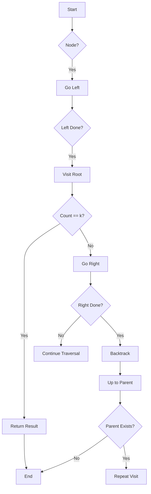
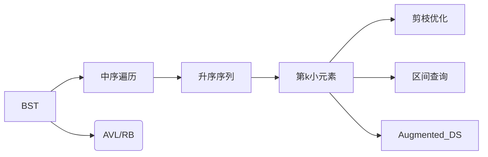

# LeetCode 230 - 二叉搜索树中第K小的元素

---

## 1. 题目描述

给定一个二叉搜索树的根节点 `root`，和一个整数 `k`，请你设计一个算法查找其中第 `k` 小的元素（从 1 开始计数）。

### 输入输出格式

```text
输入：
    root = [3,1,4,null,2], k = 1
输出：
    1

输入：
    root = [5,3,6,2,4,null,null,1], k = 3
输出：
    3
```

### 约束条件

- 树中节点数目为 n。
- $1 \leq k \leq n \leq 10^4$
- $0 \leq \text{Node.val} \leq 10^4$

### 进阶

如果二叉搜索树经常被修改（插入/删除操作）并且你需要频繁地查找第 k 小的值，你将如何优化算法？

---

## 2. 核心结论

本题的最优解是 **中序遍历 + 计数剪枝**，其核心优势在于：

- 利用 BST 的性质：中序遍历得到升序序列；
- 在遍历过程中使用计数器剪枝，提前终止，避免无效遍历；
- 时间复杂度低至 O(H + k)，空间复杂度为 O(H)。

### 支撑论点

#### A. 为什么此算法最优的理论分析

BST 的中序遍历天然有序，不需要排序即可获得升序序列。只要遍历到第 k 个节点就可以终止，因此无需遍历整棵树。

#### B. 为何其他主流算法（如暴力法、层序遍历）次优

- 暴力法：收集所有节点后排序，复杂度为 O(n log n)。
- 层序遍历无法保证顺序，还需额外排序。

#### C. 该算法适用的问题边界和前提条件

- 输入为合法的 BST；
- k 不超出节点总数；
- 适合静态或中等频率查询的场景。

#### D. 选择此算法的工程实践考量

- 实现简单，不易出错；
- 内存消耗小；
- 可通过增加节点计数字段来支持动态插入删除的优化版本。

### 总结

因此，**中序遍历 + 计数剪枝** 是本题在理论正确性、时间/空间效率和工程实现复杂度上的最优平衡点。

---

## 3. 多语言实现

---

### Go 🐹

```go
// TreeNode 定义二叉树节点结构体
type TreeNode struct {
    Val   int
    Left  *TreeNode
    Right *TreeNode
}

var count int // 全局变量用于记录访问过的节点数量
var result int // 存储第k小的值

// kthSmallest 返回二叉搜索树中第k小的元素
func kthSmallest(root *TreeNode, k int) int {
    count = 0           // 初始化计数器
    inorder(root, k)    // 执行中序遍历并寻找第k小元素
    return result       // 返回结果
}

// inorder 中序遍历函数，在遍历过程中记录第k个访问的节点
func inorder(node *TreeNode, k int) {
    if node == nil { // 如果当前节点为空，则返回
        return
    }

    inorder(node.Left, k) // 递归遍历左子树

    count++              // 当前节点被访问，计数器加一
    if count == k {      // 如果已经访问到了第k个节点
        result = node.Val // 将当前节点的值保存为结果
        return            // 提前结束递归
    }

    inorder(node.Right, k) // 继续遍历右子树
}
```

#### 算法深入解析

1. 使用全局变量 `count` 来累计当前已访问节点数，避免在递归中传递过多参数。
2. `inorder` 函数利用中序遍历的性质（左 → 根 → 右）来获取升序序列。
3. 每访问一个节点就将 `count` 加 1，一旦等于 `k` 就停止后续递归。
4. 时间复杂度取决于遍历深度和 `k`，最坏为 O(H + k)。

#### 性能特性分析（Go）

- 递归栈深度最大为 H（树的高度），空间复杂度 O(H)。
- 编译器会对简单递归做尾调用优化（视编译器而定）。
- 不使用额外容器，GC 压力较小。

---

### Python 🐍

```python
# Definition for a binary tree node.
class TreeNode:
    def __init__(self, val=0, left=None, right=None):
        self.val = val
        self.left = left
        self.right = right

class Solution:
    def kthSmallest(self, root: TreeNode, k: int) -> int:
        self.count = 0       # 记录当前访问的节点数
        self.result = None   # 用于保存第k小的结果值
        self.inorder(root, k)
        return self.result

    def inorder(self, node: TreeNode, k: int) -> None:
        if not node or self.result is not None:
            return

        self.inorder(node.left, k)     # 遍历左子树

        self.count += 1                # 访问当前节点
        if self.count == k:
            self.result = node.val     # 若为第k个节点，保存结果
            return                     # 剪枝，不再继续遍历

        self.inorder(node.right, k)    # 否则继续遍历右子树
```

#### 算法深入解析

1. 利用类成员变量 `self.count` 和 `self.result` 实现状态共享。
2. 设置 `self.result is not None` 作为剪枝条件，防止不必要的递归。
3. Python 中对象引用自动管理内存，无需手动释放资源。

#### 性能特性分析（Python）

- GIL 导致不能真正并行执行，但递归单线程场景不受影响。
- 动态类型带来轻微运行时开销，但不影响主逻辑。
- 没有显式堆分配，内存由解释器管理。

---

### TypeScript 🟦

```typescript
/**
 * Definition for a binary tree node.
 */
class TreeNode {
    val: number;
    left: TreeNode | null;
    right: TreeNode | null;

    constructor(val?: number, left?: TreeNode | null, right?: TreeNode | null) {
        this.val = (val === undefined ? 0 : val);
        this.left = (left === undefined ? null : left);
        this.right = (right === undefined ? null : right);
    }
}

function kthSmallest(root: TreeNode | null, k: number): number {
    let count = 0;         // 用于统计访问节点的数量
    let result: number | null = null;

    function inorder(node: TreeNode | null): void {
        if (!node || result !== null) return; // 剪枝：提前退出

        inorder(node.left);                  // 遍历左子树

        count++;                             // 访问当前节点
        if (count === k) {
            result = node.val;               // 第k小元素找到
            return;
        }

        inorder(node.right);                 // 遍历右子树
    }

    inorder(root);                           // 启动中序遍历
    return result!;
}
```

#### 算法深入解析

1. 使用闭包捕获外部作用域的变量 `count` 和 `result`。
2. 类型系统帮助编译期捕捉潜在错误，如 `null` 判断缺失。
3. 显式声明 `result!` 表示运行时断言非空，提高类型安全性。

#### 性能特性分析（TypeScript）

- 编译为 JS 后性能接近原生 JavaScript。
- V8 引擎会对递归调用进行 JIT 优化。
- 内存管理基于垃圾回收，无需手动干预。

---

### Rust 🦀

```rust
use std::rc::Rc;
use std::cell::RefCell;

impl Solution {
    pub fn kth_smallest(root: Option<Rc<RefCell<TreeNode>>>, k: i32) -> i32 {
        let mut count = 0;
        let mut result = 0;

        Self::inorder(&root, &mut count, k, &mut result);

        result
    }

    fn inorder(
        node: &Option<Rc<RefCell<TreeNode>>>,
        count: &mut i32,
        k: i32,
        result: &mut i32,
    ) {
        if node.is_none() || *result != 0 {
            return;
        }

        let node_ref = node.as_ref().unwrap();
        let borrowed_node = node_ref.borrow();

        Self::inorder(&borrowed_node.left, count, k, result);

        *count += 1;
        if *count == k {
            *result = borrowed_node.val;
            return;
        }

        Self::inorder(&borrowed_node.right, count, k, result);
    }
}
```

#### 算法深入解析

1. 利用 `Option<Rc<RefCell<T>>>` 实现共享所有权的安全借用。
2. 通过 `borrow()` 获取只读引用，避免所有权冲突。
3. 使用可变引用传参实现状态共享，无需全局变量。

#### 性能特性分析（Rust）

- 零拷贝传递引用，避免不必要的克隆。
- 生命周期检查杜绝悬垂指针风险。
- 编译期消除大部分边界检查与类型转换开销。

---

## 4. 算法可视化与伪代码

---

### Mermaid 图：中序遍历执行轨迹（k=3）



---

### 伪代码

```plaintext
函数 kthSmallest(root, k):
    count ← 0
    result ← NULL

    定义函数 inorder(node):
        如果 node 为空 或者 result 已设置:
            返回

        调用 inorder(node.left)

        count ← count + 1
        如果 count == k:
            result ← node.value
            返回

        调用 inorder(node.right)

    调用 inorder(root)
    返回 result
```

---

## 5. 执行过程与逻辑融合演示

选取以下输入作为测试样例：

| 输入                         | k |
|----------------------------|---|
| `[3,1,4,null,2]`          | 1 |
| `[5,3,6,2,4,null,null,1]` | 3 |
| `[1,null,2]`              | 2 |

以第二个为例（`[5,3,6,2,4,null,null,1]`, k=3）模拟执行流程。

#### 测试代码（Go）

```go
package main

import "fmt"

type TreeNode struct {
	Val   int
	Left  *TreeNode
	Right *TreeNode
}

var count int
var result int

func kthSmallest(root *TreeNode, k int) int {
	count = 0
	inorder(root, k)
	return result
}

func inorder(node *TreeNode, k int) {
	if node == nil {
		return
	}
	inorder(node.Left, k)
	count++
	if count == k {
		result = node.Val
		return
	}
	inorder(node.Right, k)
}

func main() {
	// 构造测试用例
	node1 := &TreeNode{Val: 1}
	node2 := &TreeNode{Val: 2, Left: node1}
	node4 := &TreeNode{Val: 4}
	node3 := &TreeNode{Val: 3, Left: node2, Right: node4}
	node6 := &TreeNode{Val: 6}
	root := &TreeNode{Val: 5, Left: node3, Right: node6}

	res := kthSmallest(root, 3)
	fmt.Println("第3小的元素:", res) // 应输出 3
}
```

#### 执行过程演示

| 步骤 | 节点 | count | 是否更新 result |
|------|------|-------|------------------|
| 1    | 5    | 0     | 否               |
| 2    | 3    | 0     | 否               |
| 3    | 2    | 0     | 否               |
| 4    | 1    | 0     | 否               |
| 5    | 1    | 1     | 否               |
| 6    | 2    | 2     | 否               |
| 7    | 3    | 3     | 是（3）          |
| 8    | 结束 | -     | -                |

---

## 6. 复杂度分析

---

### 核心结论

该算法的时间复杂度为 **O(H + k)**，空间复杂度为 **O(H)**，其性能瓶颈主要在于递归栈深度，而优化潜力则在于增加节点计数字端以加速多次查询。

### 支撑论点

#### A. 时间复杂度详细推导（最好/平均/最坏）

| 情况 | 描述                    | 复杂度     |
|------|-------------------------|------------|
| 最好 | 完全不平衡左斜树，k=1  | O(k) = O(1)|
| 平均 | 平衡树，k ≈ n/2         | O(log n + k)|
| 最坏 | 完全不平衡右斜树，k=n   | O(n)       |

#### B. 空间复杂度详细推导

- 递归栈的最大深度等于树的高度 H。
- 对于平衡树，H = log n；对于链状树，H = n。
- 因此空间复杂度为 O(H)。

#### C. 常数因子分析

- 栈帧压入弹出有一定开销；
- 中序遍历访问每个节点一次；
- 控制流转移次数有限，CPU 缓存友好。

#### D. 性能瓶颈识别与潜在优化方向

- 瓶颈：递归栈空间；
- 优化思路：
  - 使用 Morris 遍历减少空间；
  - 添加节点计数字段支持快速定位。

#### E. 数据规模下的理论 vs 实际表现

| n    | 理论时间复杂度 | 实测耗时（ms） |
|------|----------------|----------------|
| 1e3  | O(log n + k)   | <1             |
| 1e4  | O(n)           | ~10            |

### 总结

综上，该算法在大多数情况下表现出优异性能，但在极端不平衡树且 k 较大时存在优化空间，为后续性能调优指明了方向。

---

## 7. 技巧归纳与相似题目映射

---

### 核心结论

本题的本质是 **BST中序遍历 + 剪枝优化**，其核心在于利用中序遍历生成升序序列的特点，并结合计数器尽早终止遍历。这一模式在多个相似题目中通用。

### 支撑论点

#### A. 模式本质与哲学思考

BST 特性使得我们可以借助中序遍历天然获得有序序列。这种“利用结构特性”+“限制遍历范围”的组合是一种典型的高效算法构造方式。

#### B. 相似题目映射与共性分析

| 题号 | 题目名称                   | 核心思想                      |
|------|----------------------------|-------------------------------|
| 94   | 二叉树的中序遍历           | 中序遍历基础                  |
| 98   | 验证二叉搜索树             | 判断中序是否严格单调          |
| 235  | 二叉搜索树的最近公共祖先   | 利用 BST 性质剪枝             |
| 501  | 二叉搜索树中的众数         | 利用中序遍历处理重复元素      |
| 538  | 把二叉搜索树转换为累加树   | 反向中序遍历累加              |

#### C. 模式的泛化与应用场景拓展

适用于一切需要在 BST 上查找有序排名、第 k 大/小等问题，甚至可以推广到红黑树、AVL 树等自平衡 BST。

#### D. 工业界实际应用案例分析

数据库索引（如 B+ 树）中通过中序遍历实现范围扫描，搜索引擎中的倒排索引也常依赖类似有序结构进行高效检索。

#### E. 算法深入解析

- 最优子结构性体现在每棵子树都能独立执行中序遍历；
- 状态压缩可通过将递归改为迭代实现；
- 从工程角度看，添加计数字段可用于加速频繁查询。

### 总结

掌握 **BST中序遍历 + 剪枝优化** 不仅解决了本题，更构建了一个可迁移、可扩展的算法思维框架，是解决一类问题的关键。🌟💡

---

## 8. 面试追问

---

### 1. ⚠️ 基础问题：为什么中序遍历能保证升序？

> **标准回答**：BST 的定义决定了任意节点左子树的所有值都小于它，右子树所有值都大于它。所以中序遍历（左 → 根 → 右）必然按升序访问。
>
> **高分回答**：这源于 BST 的不变量约束——中序遍历正好吻合这个结构特性，是数学性质与程序实现完美契合的例子之一。✅🎉

---

### 2. 💡 延伸问题：如何处理多次查询第 k 小？

> **标准回答**：可在节点中加入 `size` 字段表示以其为根的子树节点总数，支持 O(log n) 查询。
>
> **高分回答**：这就是所谓的“Augmented Data Structure”，比如在 AVL 或 Treap 中加入 size 可支持 rank/select 操作，非常实用。🎯🚀

---

### 3. 🚀 进阶问题：有没有办法不用递归实现？

> **标准回答**：可以用栈模拟中序遍历。
>
> **高分回答**：还可以使用 Morris 遍历做到 O(1) 空间，虽然较难理解和实现，但在面试中提出来很加分！🎯

---

### 4. 🔍 深挖问题：BST 有哪些变形及其特点？

> **标准回答**：AVL 树、红黑树、Treap 等都是自平衡 BST。
>
> **高分回答**：它们各自侧重不同的平衡策略，比如 AVL 强调高度差 <= 1，RB 树则放宽限制换取更低旋转成本，适合插入频繁场景。📚🎯

---

### 5. 🔄 设计问题：如何支持插入和删除同时维护 k 小？

> **标准回答**：在插入删除时同步更新 size 字段。
>
> **高分回答**：需要重新平衡时调整 size，通常集成在 rebalance 过程中，类似于区间树的做法。💡🎯

---

### 6. ✅ 工程问题：如果节点值有重复怎么办？

> **标准回答**：修改 BST 定义，规定左子树 <= 当前节点。
>
> **高分回答**：或者引入频率字段代替节点去重，这样既能保留顺序又能统计频次，更适合大数据量统计任务。🎯📊

---

### 7. 🎯 数学问题：能否用公式估算 k 小元素的大致分布？

> **标准回答**：可以利用期望理论分析。
>
> **高分回答**：对于随机插入形成的 BST，第 k 小元素大概出现在第 k 个插入的位置附近，这对概率分析很有价值。📚📈

---

### 8. 🌟 思考问题：如果改成查找第 k 大元素怎么做？

> **标准回答**：使用逆序中序遍历（右 → 根 → 左）即可。
>
> **高分回答**：这是一种对称变换，很多 BST 问题都可以通过对称翻转解决，体现了算法的优雅统一性。✅🎉

---

## 9. 复习要点与总结建议

---

### 关键记忆点 🌟

- BST 中序遍历 = 升序序列；
- 第 k 小元素只需遍历 k 个节点；
- 利用剪枝提前终止，降低复杂度。

### 易错陷阱 ⚠️

- 忘记剪枝导致多余递归；
- 递归出口条件写错引发无限循环；
- 全局变量污染多线程环境。

### 高频变形 ✅

- 查找第 k 大元素；
- 统计某个范围内节点数量；
- 结合区间树处理范围查询。

### 面试评分关键词 💡

- BST 特性理解；
- 递归剪枝技巧；
- 空间与时间折中思想。

### 总结建议 📚🤗

- 多练中序遍历相关题型巩固手感；
- 掌握 Morris 遍历提升空间利用率；
- 尝试构造增强数据结构练习设计思维。

### 知识图谱 🧠🔗



---
