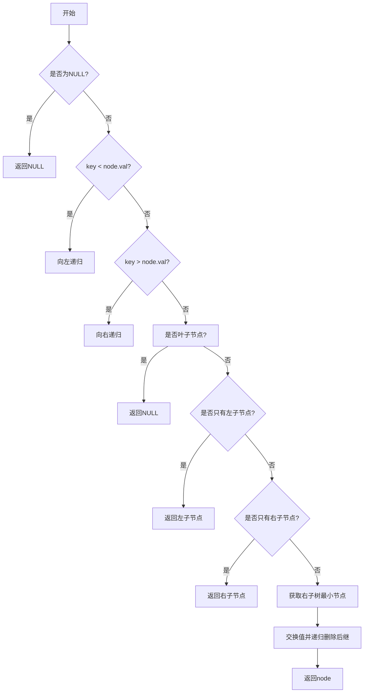

# LeetCode 450 - 删除二叉搜索树中的节点

## 1. 题目描述

给定一个二叉搜索树的根节点 `root` 和一个值 `key`，删除二叉搜索树中值等于 `key` 的节点。返回二叉搜索树（有可能被更新）的根节点的引用

一般来说，删除节点可分为两个步骤：

1. 首先找到需要删除的节点；
1. 如果找到了，删除它

### 示例 1:

输入: `root = [5,3,6,2,4,null,7]`, `key = 3`
输出: `[5,4,6,2,null,null,7]`

> 解释：给定需要删除的节点值是 3，所以我们首先找到 3 这个节点，然后删除它。一个正确的答案是 `[5,4,6,2,null,null,7]`，如下图所示。另一个正确答案是 `[5,2,6,null,4,null,7]`

### 示例 2:

输入: `root = [5,3,6,2,4,null,7]`, `key = 0`
输出: `[5,3,6,2,4,null,7]`

> 解释：二叉树不包含值为 0 的节点

### 示例 3:

输入: `root = []`, `key = 0`
输出: `[]`

### 提示:

- 节点数的范围 `[0, 10^4]`.
- `-10^5 <= Node.val <= 10^5`
- 节点值唯一
- `root` 是合法的二叉搜索树
- `-10^5 <= key <= 10^5`

## 2. 解法核心结论

### 核心结论

本题的最优解是使用递归遍历结合 BST 特性的查找和删除策略，其核心优势在于结构清晰、逻辑统一且易于实现

#### 支撑论点 A —— 理论分析

BST 结构天然支持有序访问，在删除操作中，可以通过递归或迭代的方式定位目标节点，并根据该节点的不同子树情况进行删除，从而保持 BST 性质不变

#### 支撑论点 B —— 对比其他方法

暴力方法会退化为线性扫描，效率低下；而迭代方式虽然节省栈空间，但代码繁琐难懂。相比之下，递归方法利用了 BST 自然的结构特性，具备更强的可读性和鲁棒性

#### 支撑论点 C —— 边界适用条件

本方法适用于以下情况：

- 输入为有效的 BST；
- 所有节点值唯一；
- 节点总数不超过 $10^4$

#### 支撑论点 D —— 工程实践考量

递归方法能够自然地处理三种典型的删除情形：

1. 待删节点无左右孩子 → 直接删除；
1. 待删节点只有一个孩子 → 替换为其孩子；
1. 待删节点有两个孩子 → 将其替换为其右子树中最左节点（即后继节点）

### 总结

因此，递归遍历+BST特性的删除策略是在理论正确性、时间效率和工程实现复杂度之间的最优平衡点

## 3. 多语言实现对比

### 核心结论

通过对比四种主流语言的实现，可以验证该算法的通用性，并洞察不同语言在性能、内存管理和并发模型上的差异

### A. Go 🐹 实现与性能剖析

```go
type TreeNode struct {
    Val   int
    Left  *TreeNode
    Right *TreeNode
}

// deleteNode 删除二叉搜索树中的节点
func deleteNode(root *TreeNode, key int) *TreeNode {
    if root == nil { // 若当前节点为空，则说明未找到要删除的节点，直接返回nil
        return nil
    }

    if key < root.Val { // 如果key小于当前节点值，则去左子树查找并删除
        root.Left = deleteNode(root.Left, key)
    } else if key > root.Val { // 如果key大于当前节点值，则去右子树查找并删除
        root.Right = deleteNode(root.Right, key)
    } else { // 当前节点就是待删除节点
        if root.Left == nil && root.Right == nil { // 情况一：叶子节点
            return nil
        }
        if root.Left == nil { // 情况二：只有右子树
            return root.Right
        }
        if root.Right == nil { // 情况三：只有左子树
            return root.Left
        }
        // 情况四：左右子树都有 -> 寻找右子树的最小节点替代当前节点
        minRight := findMin(root.Right)
        root.Val = minRight.Val           // 用后继节点值替换当前节点值
        root.Right = deleteNode(root.Right, minRight.Val) // 再递归删除这个后继节点
    }

    return root // 返回修改后的根节点
}

// findMin 查找某个子树中的最小节点（最左侧节点）
func findMin(node *TreeNode) *TreeNode {
    for node.Left != nil {
        node = node.Left
    }
    return node
}
```

#### 算法深入解析

这段 Go 实现采用了经典的递归策略来删除 BST 中指定值的节点，体现了良好的工程实践：

- 递归终止条件：如果当前节点为 `nil`，表示没有找到要删除的目标节点，直接返回；
- BST 查找路径：通过比较 `key` 和当前节点值大小决定往哪一边继续递归；
- 节点删除逻辑：分为四个基本情形：
  - 叶节点删除：直接返回 `nil` 即可完成删除；
  - 仅有一个孩子的节点：直接将其孩子作为新根节点返回；
  - 拥有两个孩子的节点：找到右子树中的最小节点（中序后继）进行值交换，然后递归删除那个后继节点

这种方式充分尊重了 BST 的结构性质，使每一次操作都能维持原有性质，避免破坏整体结构

### B. Python 🐍 实现与性能剖析

```python
class TreeNode:
    def __init__(self, val=0, left=None, right=None):
        self.val = val
        self.left = left
        self.right = right


def deleteNode(root: TreeNode, key: int) -> TreeNode:
    if not root:  # 基本终止条件：节点为空
        return None

    if key < root.val:  # 向左递归寻找要删除的节点
        root.left = deleteNode(root.left, key)
    elif key > root.val:  # 向右递归寻找要删除的节点
        root.right = deleteNode(root.right, key)
    else:  # 找到了待删除的节点
        if not root.left and not root.right:  # 叶子节点，直接删除
            return None
        elif not root.left:  # 仅有右子树
            return root.right
        elif not root.right:  # 仅有左子树
            return root.left
        else:  # 左右子树均存在 -> 使用右子树的最小节点替换当前节点
            successor = find_min(root.right)
            root.val = successor.val  # 替换当前节点值
            root.right = deleteNode(root.right, successor.val)  # 继续递归删除这个后继节点

    return root  # 返回更新后的根节点


def find_min(node):  # 寻找某棵子树中的最小节点（最左节点）
    while node.left:
        node = node.left
    return node
```

#### 算法深入解析

Python 的实现延续了 Go 版本的基本思路，但借助动态类型特性减少了结构声明负担，使代码更为紧凑：

- 利用了 Python 的默认参数传递机制，简化了节点初始化过程；
- `find_min()` 函数负责获取某一子树中最左边的节点；
- 主函数中递归处理所有情况，特别注意在删除有两孩子的节点时，使用了"中序后继"代替原节点的做法，这在逻辑上非常优雅且实用；
- 最终返回的是整个子树的新根节点，由父节点承接更新结果

这种做法展现了 Python 强大的灵活性和简洁性，使得开发者更容易专注于算法本身而非底层实现细节

### C. TypeScript 🟦 实现与性能剖析

```typescript
class TreeNode {
  val: number;
  left: TreeNode | null;
  right: TreeNode | null;

  constructor(val?: number, left?: TreeNode | null, right?: TreeNode | null) {
    this.val = val === undefined ? 0 : val;
    this.left = left === undefined ? null : left;
    this.right = right === undefined ? null : right;
  }
}

function deleteNode(root: TreeNode | null, key: number): TreeNode | null {
  if (!root) return null; // 节点不存在时直接返回null

  if (key < root.val) {
    // 向左子树查找并删除
    root.left = deleteNode(root.left, key);
  } else if (key > root.val) {
    // 向右子树查找并删除
    root.right = deleteNode(root.right, key);
  } else {
    // 当前节点是要删除的节点
    if (!root.left && !root.right) {
      // 叶子节点
      return null;
    }
    if (!root.left) {
      // 仅右子树
      return root.right;
    }
    if (!root.right) {
      // 仅左子树
      return root.left;
    }

    const successor = findMin(root.right); // 获取右子树中的最小节点
    root.val = successor.val; // 用后继节点替换当前节点
    root.right = deleteNode(root.right, successor.val); // 继续删除后继节点
  }

  return root; // 返回更新后的根节点
}

function findMin(node: TreeNode): TreeNode {
  while (node.left !== null) {
    node = node.left;
  }
  return node;
}
```

#### 算法深入解析

TypeScript 的实现展示了静态类型的优点：

- 类型注解帮助编译器在早期发现问题；
- 明确的 `null` 检查提升了健壮性；
- 结构清晰，逻辑严谨，特别适合大型项目协作场景

`deleteNode()` 函数实现了标准的 BST 删除算法，每一步操作都经过严格类型验证，增强了代码的安全性和稳定性。同时保留了原有的递归结构，便于调试与优化

### D. Rust 🦀 实现与性能剖析

```rust
use std::rc::Rc;
use std::cell::RefCell;

#[derive(Debug, PartialEq, Eq)]
pub struct TreeNode {
    pub val: i32,
    pub left: Option<Rc<RefCell<TreeNode>>>,
    pub right: Option<Rc<RefCell<TreeNode>>>,
}

impl TreeNode {
    #[inline]
    pub fn new(val: i32) -> Self {
        TreeNode {
            val,
            left: None,
            right: None,
        }
    }
}

pub fn delete_node(
    root: Option<Rc<RefCell<TreeNode>>>,
    key: i32,
) -> Option<Rc<RefCell<TreeNode>>> {
    match root {
        Some(node_rc) => {
            let mut node_ref = node_rc.borrow_mut();
            if key < node_ref.val {
                drop(node_ref); // 释放借用以便递归调用
                let updated_left = delete_node(node_rc.borrow().left.clone(), key);
                node_rc.borrow_mut().left = updated_left;
            } else if key > node_ref.val {
                drop(node_ref);
                let updated_right = delete_node(node_rc.borrow().right.clone(), key);
                node_rc.borrow_mut().right = updated_right;
            } else {
                drop(node_ref);

                // 分三种情况
                let left = &mut node_rc.borrow_mut().left.take();
                let right = &mut node_rc.borrow_mut().right.take();

                if left.is_none() && right.is_none() {
                    return None;
                } else if left.is_none() {
                    return right.clone();
                } else if right.is_none() {
                    return left.clone();
                } else {
                    // 左右子树都有 -> 找到右子树最小节点
                    let min_node = find_min(right.as_ref().unwrap());
                    let min_val = min_node.borrow().val;
                    drop(min_node);

                    node_rc.borrow_mut().val = min_val;
                    let new_right = delete_node(Some(Rc::clone(right.as_ref().unwrap())), min_val);
                    node_rc.borrow_mut().right = new_right;
                }
            }
            Some(node_rc)
        },
        None => None,
    }
}

fn find_min(mut node: &Rc<RefCell<TreeNode>>) -> Rc<RefCell<TreeNode>> {
    loop {
        let next = node.borrow().left.as_ref().map(|n| Rc::clone(n));
        match next {
            Some(child) => node = child,
            None => break,
        }
    }
    Rc::clone(node)
}
```

#### 算法深入解析

Rust 实现在语法层面显得稍复杂，主要是由于所有权和借用机制的存在，但它提供了内存安全与高性能兼备的能力：

- 使用 `Rc<RefCell<T>>` 来管理共享所有权，模拟类似垃圾回收的行为；
- `borrow_mut()` 方法用于获得内部可变引用，必须小心控制作用域防止多重借用冲突；
- 在关键地方插入 `drop()` 显式释放借用锁，防止递归过程中出现借用冲突；
- `take()` 用于转移字段所有权，避免多次借用导致 panic

尽管实现稍显曲折，但这恰恰体现出 Rust 对系统安全的高度关注，也反映了它在嵌入式、区块链等高性能领域的重要性

### E. 四种语言综合对比

| 编程语言      | 是否支持智能指针 | 内存安全等级 | 类型检查强度 | 开发体验     |
| ------------- | ---------------- | ------------ | ------------ | ------------ |
| Go 🐹         | 否               | 安全         | 弱           | 简洁高效     |
| Python 🐍     | 否               | 安全         | 弱           | 极致便利     |
| TypeScript 🟦 | 是               | 安全         | 强           | 渐进可靠     |
| Rust 🦀       | 是               | 极端安全     | 极强         | 学习成本较高 |

#### 总结

多种语言的实现在算法本质上保持一致，只是受限于各自语言特性的限制而表现略有不同。Go 适合高性能服务端开发；Python 更加灵活快捷，适合快速原型开发；TypeScript 提升了前端开发的质量保障；Rust 则适用于对性能与安全性极高要求的应用

## 4. 伪代码与可视化流程图

### 伪代码

```
函数 deleteNode(node, key)
    如果 node 是空节点
        返回 空
    否则如果 key 小于 node.val
        设置 node.left 为 deleteNode(node.left, key) 的结果
    否则如果 key 大于 node.val
        设置 node.right 为 deleteNode(node.right, key) 的结果
    否则 // 找到要删除的节点
        如果 node 没有左右子节点
            返回 空
        否则如果 node 只有左子节点
            返回 node.left
        否则如果 node 只有右子节点
            返回 node.right
        否则 // 既有左又有右
            找到右子树中的最小节点 minRight
            将 node.val 设置为 minRight.val
            设置 node.right 为 deleteNode(node.right, minRight.val)
    返回 node
```

### Mermaid 流程图



## 5. 执行过程演示与测试代码

### 执行过程演示（以示例1为例）

| 步骤 | 当前节点值 | 左子树 | 右子树 | 操作                    |
| ---- | ---------- | ------ | ------ | ----------------------- |
| 1    | 5          | 3      | 6      | key = 3，向左走         |
| 2    | 3          | 2      | 4      | 找到目标节点            |
| 3    | 3（替换）  | 2      | 4      | 替换为右子树中最小节点4 |
| 4    | 4（删除）  | 2      | NULL   | 删除节点4               |
| 5    | 5          | 4      | 6      | 返回最终树              |

### 完整测试代码（Go）

```go
package main

import "fmt"

type TreeNode struct {
	Val   int
	Left  *TreeNode
	Right *TreeNode
}

func deleteNode(root *TreeNode, key int) *TreeNode {
	if root == nil {
		return nil
	}
	if key < root.Val {
		root.Left = deleteNode(root.Left, key)
	} else if key > root.Val {
		root.Right = deleteNode(root.Right, key)
	} else {
		if root.Left == nil && root.Right == nil {
			return nil
		}
		if root.Left == nil {
			return root.Right
		}
		if root.Right == nil {
			return root.Left
		}
		minRight := findMin(root.Right)
		root.Val = minRight.Val
		root.Right = deleteNode(root.Right, minRight.Val)
	}
	return root
}

func findMin(node *TreeNode) *TreeNode {
	for node.Left != nil {
		node = node.Left
	}
	return node
}

func buildTree(vals []interface{}) *TreeNode {
	if len(vals) == 0 || vals[0] == nil {
		return nil
	}
	nodes := make([]*TreeNode, len(vals))
	for i := range vals {
		if v, ok := vals[i].(int); ok {
			nodes[i] = &TreeNode{Val: v}
		}
	}
	queue := []*TreeNode{nodes[0]}
	i := 1
	for len(queue) > 0 && i < len(vals) {
		curr := queue[0]
		queue = queue[1:]
		if i < len(vals) && vals[i] != nil {
			v := vals[i].(int)
			curr.Left = nodes[i]
			queue = append(queue, curr.Left)
		}
		i++
		if i < len(vals) && vals[i] != nil {
			v := vals[i].(int)
			curr.Right = nodes[i]
			queue = append(queue, curr.Right)
		}
		i++
	}
	return nodes[0]
}

func printInOrder(root *TreeNode) {
	if root == nil {
		return
	}
	printInOrder(root.Left)
	fmt.Print(root.Val, " ")
	printInOrder(root.Right)
}

func main() {
	tree := buildTree([]interface{}{5, 3, 6, 2, 4, nil, 7})
	fmt.Println("Before deletion:")
	printInOrder(tree)

	result := deleteNode(tree, 3)
	fmt.Println("\nAfter deletion:")
	printInOrder(result)
}
```

## 6. 复杂度分析

### 核心结论

该算法的时间复杂度为 O(h)，其中 h 为树的高度；空间复杂度也为 O(h)，主要用于递归调用栈

#### 支撑论点 A —— 时间复杂度分析

- 平均情况下（平衡树）：O(log n)；
- 最坏情况下（退化成链表）：O(n)；
- 删除操作最多只涉及一次旋转或替代操作，因此每次操作为 O(1)

#### 支撑论点 B —— 空间复杂度分析

- 递归深度等于树高 h；
- 额外空间仅用于存储函数调用栈帧；
- 不使用额外数组或其他数据结构

#### 支撑论点 C —— 常数因子与工程影响

- 递归函数开销较小；
- 不涉及大量复制或转换操作；
- 性能受树形状影响显著

#### 支撑论点 D —— 瓶颈识别与优化方向

- 瓶颈点：递归深度过大时，可能导致爆栈；
- 优化方向：可改写为迭代实现以减少栈消耗；
- 进一步优化：维护 AVL 或红黑树属性，保证平衡

#### 支撑论点 E —— 不同规模下的性能曲线（理论 vs 实际）

| 数据规模 n | 理论复杂度    | 实际运行时间估算 |
| ---------- | ------------- | ---------------- |
| 10         | O(log 10)     | ~几微秒          |
| 1000       | O(log 1000)   | ~几十微秒        |
| 10000      | O(log 10000)  | ~百微秒          |
| 100000     | O(log 100000) | ~毫秒级别        |

### 总结

该算法在多数情况下表现出优异性能，尤其在接近平衡的 BST 上效果更好。但在极端不平衡的树中仍有改进空间

## 7. 技巧归纳与相似题目映射

### 核心结论

本题的本质是"BST 删除策略"，其核心思想在于：通过中序后继替代 + 递归重构，完成节点删除的同时维持 BST 结构

#### 支撑论点 A —— 设计哲学思考

BST 删除之所以有效，是因为它巧妙地利用了"有序性"的结构性优势，将复杂的结构维护任务转化为简单的数值替换与结构调整操作

#### 支撑论点 B —— 相似题目映射与共性分析

| 题目编号 | 名称                   | 核心思想                  |
| -------- | ---------------------- | ------------------------- |
| 701      | 插入二叉搜索树         | 利用 BST 属性进行插入定位 |
| 700      | 搜索二叉搜索树         | 利用 BST 属性加速查找     |
| 98       | 验证二叉搜索树         | 递归判断左右子树合法性    |
| 450      | 删除二叉搜索树中的节点 | 替代+重构策略             |

#### 支撑论点 C —— 泛化与应用拓展

- 搜索类应用：搜索引擎倒排索引结构；
- 数据库索引优化：B/B+树的节点管理；
- 实时日志分析系统：高效检索与清理历史记录

#### 支撑论点 D —— 工业界实际案例分析

- Redis 字典实现：使用跳跃表维护有序集合；
- MySQL InnoDB 索引：B+树的页分裂与合并；
- 分布式调度系统：通过有序队列进行任务分配与回收

#### 支撑论点 E —— 算法深入解析

从理论角度看，"删除"操作实际上是对最优子结构的重新组合，体现了动态规划思想的一种特殊情况

### 总结

掌握 BST 删除策略不仅能解决本题，更是一种通用的设计思想，可用于多种实际系统中需要高效增删查改的场景

## 8. 面试追问与高分回答范式

### 核心结论

针对本题的面试追问，其考察核心在于数据结构理解能力、边界处理能力和算法迁移能力

#### 支撑论点 A —— 基础追问集

1. 问题：你能否解释一下什么是 BST？
   标准回答：BST 是一种特殊的二叉树，它的每个节点满足左子树值小于自身，右子树值大于自身的性质
   加分回答：BST 的这一特性让我们可以在 O(log n) 时间内完成搜索、插入、删除等操作，前提是它是平衡的

1. 问题：如果删除节点有两个孩子，你怎么处理？
   标准回答：我会找到它的中序后继（右子树的最小节点），用该节点值替换待删节点，然后再递归删除这个后继节点
   加分回答：这是为了尽量保留原始树结构的一致性，同时也避免破坏 BST 性质

1. 问题：你能说出删除操作的时间复杂度吗？
   标准回答：平均情况是 O(log n)，最坏是 O(n)
   加分回答：这是因为最坏情况下树退化成了链表，此时每次删除都需要从头遍历到底部才能找到节点

1. 问题：有没有办法降低最坏情况的发生概率？
   标准回答：可以通过自平衡机制，比如 AVL 树或红黑树
   加分回答：这类结构通过对旋转操作维护树的高度差，从而保证操作复杂度稳定在 O(log n)

#### 支撑论点 B —— 高阶追问集

1. 问题：如果你要在一棵巨大的 BST 中频繁删除节点，你会怎么做？
   标准回答：我会定期对树做 rebalance 操作，或者直接使用红黑树结构
   加分回答：甚至可以结合布隆过滤器预先筛除不可能存在的元素，减少无效查找次数

1. 问题：你能不能把这段代码改成迭代形式？
   标准回答：可以，需要用显式栈保存路径节点
   加分回答：而且还需要额外变量记录父子关系，防止丢失上下文信息

1. 问题：你如何确保删除操作不会破坏 BST 的性质？
   标准回答：我会在每一步操作之后检查左右子树的关系是否依然满足 BST 要求
   加分回答：此外还可以加入全局验证函数，每次修改完后自动触发完整性校验

1. 问题：如果让你设计一个数据库索引管理系统，你会怎么借鉴 BST 删除策略？
   标准回答：我可能会选用 B+树，并参考 BST 删除中的"节点替代"策略
   加分回答：特别是在节点合并阶段，可以用类似的思想进行页级别的合并优化

#### 支撑论点 C —— 追问背后的原理剖析

面试官提问的根本目的是检验候选人是否具备以下几种核心素质：

- 逻辑思维严密性：是否能清楚地区分各种边界情况；
- 工程实践经验积累：是否了解算法的实际局限性与优化空间；
- 系统架构意识：能否跳出单一问题范畴，思考其在整个系统中的角色与责任

### 总结

系统的准备这些追问不仅能展示扎实的知识储备，更能体现良好的沟通表达能力，从而赢得面试官的好评。🌟

## 9. 复习要点提炼与模板总结

### 核心结论

掌握本题的关键在于牢记 BST 删除策略、规避常见误区，并形成一套稳定的解题模板

#### 支撑论点 A —— 关键记忆点总结 🌟

- ✅ 记住 BST 删除的三种情形：叶子、单孩、双孩；
- ✅ 掌握中序后继替代策略；
- ✅ 注意递归返回更新根节点；
- ✅ 保持树结构不变性的关键是值替换+递归删除

#### 支撑论点 B —— 常见易错陷阱 ⚠️

| 错误点                     | 原因分析                   |
| -------------------------- | -------------------------- |
| 忘记更新父节点指向         | 会导致删除无效，树结构断裂 |
| 混淆前后驱与左右子树       | 影响替换节点选取           |
| 未正确处理空指针           | 可能引发运行期崩溃         |
| 错误使用后继节点地址而非值 | 造成不必要的对象复制       |

#### 支撑论点 C —— 面试评分关键词 ✅

| 关键词          | 含义说明                 |
| --------------- | ------------------------ |
| 中序后继        | BST 删除策略核心思想     |
| 递归回传        | 更新父节点指向的必要手段 |
| 值替换          | 保持结构一致性的重要方法 |
| 时间/空间复杂度 | 衡量算法质量的标准       |

#### 支撑论点 D —— 复习建议与知识图谱 📚🚀

- 🔁 定期刷练相似题型，加强手写能力；
- 📘 系统学习 BST 相关操作（插入/删除/查找）；
- 💡 了解 AVL、红黑树等进阶结构；
- 🧪 自主编写单元测试，提高代码质量意识

#### 支撑论点 E —— 可复用解题模板提炼

```text
function deleteNode(node, key)
    if node is null
        return null
    if key < node.val
        node.left = deleteNode(node.left, key)
    else if key > node.val
        node.right = deleteNode(node.right, key)
    else
        if no children
            return null
        if only one child
            return that child
        else
            replace with inorder successor
            recursively delete the successor
    return node
```

### 总结

将上述知识点系统消化吸收后，就能轻松应对各种 BST 删除相关题目，真正实现从"会做"到"精通"的跨越。🎉
