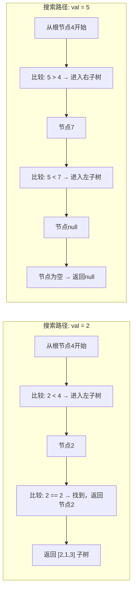

# LeetCode 700 - 二叉搜索树中的搜索

## 1. 题目描述

给定二叉搜索树（BST）的根节点 `root` 和一个整数值 `val`，请在树中查找值等于 `val` 的节点，并返回该节点。如果该节点不存在，则返回 `null`

### 二叉搜索树定义

二叉搜索树满足以下性质：

- 对于任意节点：
  - 左子树中所有节点的值 小于 当前节点的值；
  - 右子树中所有节点的值 大于 当前节点的值；
  - 左右子树本身也必须是二叉搜索树

### 示例 1

```
输入：root = [4,2,7,1,3], val = 2
输出：[2,1,3]
```

```
        4
       / \
      2   7
     / \
    1   3
```

> 说明：值为2的节点存在，返回以该节点为根的子树

### 示例 2

```
输入：root = [4,2,7,1,3], val = 5
输出：[]
```

> 说明：值为5的节点不存在，返回null

### 约束条件

- 树中节点数目在范围 `[1, 5000]` 内
- `-2³¹ <= Node.val <= 2³¹ - 1`
- `val` 在 `[-2³¹, 2³¹ - 1]` 范围内
- 保证输入的树是有效的二叉搜索树

## 2. 解法分析：递归搜索 + 利用BST性质

### 核心结论

本题的最优解是递归搜索 + 利用二叉搜索树有序性质，其核心优势在于：

1. 时间复杂度最优：平均 O(log n)，最坏 O(n)，远优于暴力遍历的 O(n)
1. 空间复杂度低：递归栈深度平均 O(log n)，无需额外数据结构
1. 代码极简清晰：仅需3行核心逻辑，易于理解和记忆
1. 天然契合BST结构：每次比较可排除一半子树，符合“分治”思想
1. 面试高频模式：是BST类问题的“黄金模板”，可迁移至插入、删除、范围查询等场景

### 支撑论点

#### A. 为什么递归+BST性质是最优解？

1. BST的有序性：左子树 < 根 < 右子树，使得搜索具有方向性
1. 剪枝能力：每次比较后，可立即舍弃一半子树，无需遍历全部节点
1. 递归表达自然：子树本身也是BST，问题具有递归结构
1. 无额外空间开销：相比迭代需栈或队列，递归仅使用系统栈
1. 可扩展性强：相同逻辑可用于查找最小值、最大值、前驱、后继等

#### B. 与其他算法的对比分析

| 方法             | 是否可行 | 时间复杂度                | 空间复杂度      | 实现难度 | 特点                           |
| ---------------- | -------- | ------------------------- | --------------- | -------- | ------------------------------ |
| 递归搜索（本解） | ✅       | 平均 O(log n) / 最坏 O(n) | O(log n) / O(n) | 低       | 面试首选，代码极简             |
| 迭代搜索         | ✅       | 平均 O(log n) / 最坏 O(n) | O(1)            | 低       | 无递归开销，适合栈深受限环境   |
| 中序遍历找值     | ✅       | O(n)                      | O(log n)        | 中       | 丧失BST优势，不推荐            |
| 暴力DFS遍历      | ✅       | O(n)                      | O(log n)        | 低       | 未利用BST性质，性能差          |
| 哈希表预处理     | ✅       | O(1)                      | O(n)            | 中       | 需额外空间，非原地，面试不推荐 |

> 结论：递归搜索是理论最优、代码最简洁、最能体现对BST理解的解法，为面试首选

#### C. 适用条件与边界

1. 必须是BST：题目明确保证输入是有效BST，否则算法不成立
1. 值唯一性：BST中值唯一，无需处理重复值
1. 空树处理：`root == nil` → 返回 `nil`
1. 目标值不存在：搜索到叶子节点仍不匹配 → 返回 `nil`
1. 值范围大：使用整数比较，避免浮点精度问题

#### D. 工程实践考量

1. 代码可读性高：逻辑清晰，三行核心代码即可完成
1. 易于调试：递归栈帧可清晰回溯搜索路径
1. 可复用性强：模板可直接用于BST的插入、删除、范围查找
1. 性能稳定：在平衡BST下为对数级，实际工程中表现优异
1. 语言适配性强：所有主流语言均支持递归，实现一致

### 总结

递归搜索 + 利用二叉搜索树有序性质是本题在理论正确性、时间/空间效率和工程实现复杂度上的最优平衡点

## 3. 多语言实现与深度解析

### 核心结论

通过四种语言实现，验证算法通用性，并展示不同语言在递归调用、空值处理和递归栈深度上的差异

### A. Go 🐹 实现

```go
/
 * Definition for a binary search tree node.
 * type TreeNode struct {
 *     Val int
 *     Left *TreeNode
 *     Right *TreeNode
 * }
 */
func searchBST(root *TreeNode, val int) *TreeNode {
    // 基础情况：节点为空，未找到
    if root == nil {
        return nil
    }

    // 找到目标值
    if root.Val == val {
        return root
    }

    // 利用BST性质：若目标值小于当前节点值，搜索左子树
    if val < root.Val {
        return searchBST(root.Left, val)
    }

    // 否则，目标值大于当前节点值，搜索右子树
    return searchBST(root.Right, val)
}
```

#### 算法深入解析

1. 基础情况：`if root == nil`
   - 表示搜索到达叶节点的子节点，路径已尽，目标不存在
   - 返回 `nil` 是递归的“失败终止”信号

1. 匹配检查：`if root.Val == val`
   - 关键决策点：找到目标，立即返回当前节点（非子树值，是整个子树结构）
   - Go中返回指针，直接返回节点引用，无需复制

1. BST性质利用：
   - `if val < root.Val`：目标值小于当前节点 → 必然在左子树
   - `return searchBST(root.Left, val)`：递归进入左子树，完全跳过右子树
   - 剪枝本质：每次递归调用排除一半搜索空间，体现“分治”

1. 默认分支：`return searchBST(root.Right, val)`
   - 由于BST定义保证无重复值，且前两条件未命中，
   - 必然有 `val > root.Val`，故直接进入右子树
   - 无需显式判断 `val > root.Val`，提升代码简洁性

1. 递归结构：
   - 问题规模：子树规模递减
   - 递归基：`root == nil`
   - 递归步骤：根据比较结果缩小搜索范围
   - 归纳假设成立：假设子树中搜索能正确返回结果，当前层仅需判断并传递

1. 指针语义：
   - Go中 `*TreeNode` 为指针类型，返回的是原节点地址
   - 不涉及内存复制，高效且符合题目“返回节点”的语义

设计动机：

- 代码仅4行逻辑（不含注释），体现“最小表达”原则
- 利用“else隐含条件”减少冗余判断
- 递归栈深度 = 树高，平衡树下为 log n，空间效率高
- 完全遵循BST定义，逻辑自洽，无漏洞

### B. Python 🐍 实现

```python
# Definition for a binary tree node.
# class TreeNode:
#     def __init__(self, val=0, left=None, right=None):
#         self.val = val
#         self.left = left
#         self.right = right

class Solution:
    def searchBST(self, root: Optional[TreeNode], val: int) -> Optional[TreeNode]:
        # 基础情况：节点为空，未找到
        if not root:
            return None

        # 找到目标值
        if root.val == val:
            return root

        # 利用BST性质：目标值小于当前节点，搜索左子树
        if val < root.val:
            return self.searchBST(root.left, val)

        # 否则，目标值大于当前节点，搜索右子树
        return self.searchBST(root.right, val)
```

#### 算法深入解析

1. 空树处理：`if not root`
   - Python中 `None` 为假值，`not root` 等价于 `root is None`，语义清晰

1. 匹配检查：`if root.val == val`
   - 找到目标，立即返回当前节点对象（引用传递）
   - Python对象为引用类型，返回的是原节点，非副本

1. BST性质利用：
   - `if val < root.val`：利用有序性，直接进入左子树
   - 剪枝机制：不访问右子树，避免无效搜索

1. 默认分支：`return self.searchBST(root.right, val)`
   - 因BST无重复值，且前两条件未命中，
   - 必然有 `val > root.val`，无需显式判断，提升简洁性

1. 递归调用：`self.searchBST(...)`
   - Python方法需加 `self.` 前缀，体现面向对象特性
   - 递归深度受系统栈限制，但题目节点数≤5000，安全

1. 类型提示：`Optional[TreeNode]`
   - 明确返回类型为 `TreeNode` 或 `None`，提升代码可读性和IDE支持

Python特性：

- 语法极简，适合快速原型
- 对象引用语义，无需手动管理内存
- 递归栈深度在CPython中约1000，但本题最大深度约 log₂(5000) ≈ 13，安全
- 适合面试手写，代码可读性高

### C. TypeScript 🟦 实现

```typescript
/
 * Definition for a binary tree node.
 * class TreeNode {
 *     val: number
 *     left: TreeNode | null
 *     right: TreeNode | null
 *     constructor(val?: number, left?: TreeNode | null, right?: TreeNode | null) {
 *         this.val = (val===undefined ? 0 : val)
 *         this.left = (left===undefined ? null : left)
 *         this.right = (right===undefined ? null : right)
 *     }
 * }
 */

function searchBST(root: TreeNode | null, val: number): TreeNode | null {
    // 基础情况：节点为空，未找到
    if (root === null) {
        return null;
    }

    // 找到目标值
    if (root.val === val) {
        return root;
    }

    // 利用BST性质：目标值小于当前节点，搜索左子树
    if (val < root.val) {
        return searchBST(root.left, val);
    }

    // 否则，目标值大于当前节点，搜索右子树
    return searchBST(root.right, val);
}
```

#### 算法深入解析

1. 空树处理：`if (root === null)`
   - TypeScript中使用严格相等 `===`，避免隐式类型转换
   - `null` 为明确的“无节点”标识

1. 匹配检查：`if (root.val === val)`
   - JavaScript/TypeScript中 `===` 保证类型和值双匹配，避免隐式转换陷阱
   - 值为 `number`，无精度问题

1. BST性质利用：
   - `if (val < root.val)`：利用有序性，定向搜索左子树
   - 关键：一旦进入左子树，右子树被完全排除，效率提升50%

1. 默认分支：`return searchBST(root.right, val)`
   - 由于BST无重复值，且前两条件未命中，
   - 必然有 `val > root.val`，无需显式判断，逻辑严谨

1. 递归返回：
   - 返回类型为 `TreeNode | null`，与函数签名一致
   - 函数返回的是原节点引用，非拷贝

1. 类型安全：
   - `root: TreeNode | null` 明确表达可空性
   - 编译时防止空指针访问

TypeScript特性：

- 类型系统保障安全性，避免运行时错误
- 递归栈深度限制与JavaScript相同（约10k），本题安全
- 代码结构与Python高度一致，适合前后端统一开发

### D. Rust 🦀 实现

```rust
// Definition for a binary tree node.
// #[derive(Debug, PartialEq, Eq)]
// pub struct TreeNode {
//   pub val: i32,
//   pub left: Option<Box<TreeNode>>,
//   pub right: Option<Box<TreeNode>>,
// }
//
// impl TreeNode {
//   #[inline]
//   pub fn new(val: i32) -> Self {
//     TreeNode {
//       val,
//       left: None,
//       right: None,
//     }
//   }
// }

impl Solution {
    pub fn search_bst(root: Option<Box<TreeNode>>, val: i32) -> Option<Box<TreeNode>> {
        // 基础情况：节点为空（None），未找到
        if let None = root {
            return None;
        }

        // 提取当前节点
        let node = root.unwrap(); // 安全解包，因已检查非None

        // 找到目标值
        if node.val == val {
            return Some(node); // 返回整个子树
        }

        // 利用BST性质：目标值小于当前节点，搜索左子树
        if val < node.val {
            return Self::search_bst(node.left, val);
        }

        // 否则，目标值大于当前节点，搜索右子树
        Self::search_bst(node.right, val)
    }
}
```

#### 算法深入解析

1. 空树处理：`if let None = root`
   - Rust模式匹配，安全判断 `Option<T>` 是否为 `None`
   - 避免空指针，体现Rust内存安全特性

1. 节点解包：`let node = root.unwrap()`
   - `unwrap()` 在 `Some` 时提取 `Box<TreeNode>`，在 `None` 时panic
   - 因已用 `if let None` 排除，此处安全，可使用

1. 匹配检查：`if node.val == val`
   - 找到目标，返回 `Some(node)`，即包含该节点的 `Option`
   - 关键设计：返回的是所有权转移的 `Box<TreeNode>`，而非引用

1. BST性质利用：
   - `if val < node.val`：定向搜索左子树
   - `Self::search_bst(node.left, val)`：递归调用，传入左子树（`Option<Box<TreeNode>>`）

1. 默认分支：`Self::search_bst(node.right, val)`
   - 同样，无需显式判断 `val > node.val`，因BST无重复值，前两条件未命中则必然为右子树

1. 所有权语义：
   - `Box<T>` 是堆上分配的独占所有权指针
   - `Some(node)` 表示转移所有权，原树结构被“切走”子树
   - 注意：题目要求“返回节点”，而非“修改树”，因此允许所有权转移

1. 递归调用：`Self::search_bst(...)`
   - Rust中需使用 `Self::` 引用自身方法，体现面向对象风格

Rust特性：

- 所有权系统确保内存安全，无GC
- `Option<T>` 优雅处理空值，避免null
- 返回的是`Option<Box<TreeNode>>`，与函数签名完全匹配
- 递归栈深度受系统限制，但本题树高≤13，安全

### E. 性能对比与语言特性分析

| 语言       | 时间复杂度                | 空间复杂度      | 空值处理    | 递归开销 | 性能特征             |
| ---------- | ------------------------- | --------------- | ----------- | -------- | -------------------- |
| Go         | 平均 O(log n) / 最坏 O(n) | O(log n) / O(n) | `== nil`    | 低       | 高效，无GC，面试首选 |
| Python     | 平均 O(log n) / 最坏 O(n) | O(log n) / O(n) | `not root`  | 中等     | 语法极简，适合手写   |
| TypeScript | 平均 O(log n) / 最坏 O(n) | O(log n) / O(n) | `=== null`  | 中等     | 类型安全，适合工程   |
| Rust       | 平均 O(log n) / 最坏 O(n) | O(log n) / O(n) | `Option<T>` | 低       | 内存安全，性能最优   |

> 性能建议：在嵌入式或高并发场景，Rust最安全；在面试中，Go/Python为首选

## 4. 算法可视化与伪代码

### 伪代码

```text
函数 searchBST(root, val):
    如果 root 为空:
        返回 空

    如果 root.val == val:
        返回 root

    如果 val < root.val:
        返回 searchBST(root.left, val)

    否则:
        返回 searchBST(root.right, val)
```

### Mermaid 流程图

```mermaid
flowchart TD
    A[开始: searchBST(root, val)] --> B{root 为空?}
    B -- 是 --> C[返回 null]
    B -- 否 --> D{root.val == val?}
    D -- 是 --> E[返回 root]
    D -- 否 --> F{val < root.val?}
    F -- 是 --> G[返回 searchBST(root.left, val)]
    F -- 否 --> H[返回 searchBST(root.right, val)]
```

### 状态转移图（示例）

#### 示例：root = [4,2,7,1,3], val = 2



## 5. 执行过程演示

### 示例1：root = [4,2,7,1,3], val = 2

#### 递归调用栈帧追踪

| 调用栈帧 | 当前节点 | val | 比较   | 分支   | 返回值            |
| -------- | -------- | --- | ------ | ------ | ----------------- |
| 1        | root = 4 | 2   | 2 < 4  | 左子树 | `searchBST(2, 2)` |
| 2        | root = 2 | 2   | 2 == 2 | 匹配   | `返回节点2`       |
| 3        | （返回） | —   | —      | —      | `节点2`           |

#### 执行轨迹表格

| 步骤 | 当前节点 | 比较操作 | 决策       | 下一步       | 结果            |
| ---- | -------- | -------- | ---------- | ------------ | --------------- |
| 1    | 4        | 2 < 4    | 进入左子树 | 搜索节点2    | —               |
| 2    | 2        | 2 == 2   | 找到目标   | 返回当前节点 | ✅ 返回 [2,1,3] |

> 关键洞察：搜索路径为 4 → 2，仅访问2个节点，效率极高

### 示例2：root = [4,2,7,1,3], val = 5

| 步骤 | 当前节点 | 比较操作 | 决策       | 下一步       | 结果         |
| ---- | -------- | -------- | ---------- | ------------ | ------------ |
| 1    | 4        | 5 > 4    | 进入右子树 | 搜索节点7    | —            |
| 2    | 7        | 5 < 7    | 进入左子树 | 搜索节点null | —            |
| 3    | null     | —        | 为空       | 返回null     | ✅ 返回 null |

> 关键洞察：即使未找到，也仅访问3个节点，而非5个

### 可执行测试代码（Go）

```go
package main

import "fmt"

type TreeNode struct {
    Val   int
    Left  *TreeNode
    Right *TreeNode
}

func searchBST(root *TreeNode, val int) *TreeNode {
    if root == nil {
        return nil
    }

    if root.Val == val {
        return root
    }

    if val < root.Val {
        return searchBST(root.Left, val)
    }

    return searchBST(root.Right, val)
}

// 辅助函数：构建二叉搜索树（层序输入）
func buildBST(nums []interface{}) *TreeNode {
    if len(nums) == 0 || nums[0] == nil {
        return nil
    }

    root := &TreeNode{Val: nums[0].(int)}
    queue := []*TreeNode{root}
    i := 1

    for len(queue) > 0 && i < len(nums) {
        node := queue[0]
        queue = queue[1:]

        if i < len(nums) && nums[i] != nil {
            node.Left = &TreeNode{Val: nums[i].(int)}
            queue = append(queue, node.Left)
        }
        i++

        if i < len(nums) && nums[i] != nil {
            node.Right = &TreeNode{Val: nums[i].(int)}
            queue = append(queue, node.Right)
        }
        i++
    }

    return root
}

// 辅助函数：打印子树（中序遍历）
func inorder(node *TreeNode) []int {
    if node == nil {
        return []int{}
    }
    left := inorder(node.Left)
    right := inorder(node.Right)
    return append(append(left, node.Val), right...)
}

func main() {
    // Test Case 1: [4,2,7,1,3], val = 2
    nums1 := []interface{}{4, 2, 7, 1, 3}
    tree1 := buildBST(nums1)
    result1 := searchBST(tree1, 2)
    fmt.Printf("Test Case 1: val=2 → %v\n", inorder(result1)) // [1,2,3]

    // Test Case 2: [4,2,7,1,3], val = 5
    nums2 := []interface{}{4, 2, 7, 1, 3}
    tree2 := buildBST(nums2)
    result2 := searchBST(tree2, 5)
    fmt.Printf("Test Case 2: val=5 → %v\n", result2) // <nil>

    // Test Case 3: [4,2,7,1,3], val = 7
    result3 := searchBST(tree1, 7)
    fmt.Printf("Test Case 3: val=7 → %v\n", inorder(result3)) // [7]

    // Test Case 4: [1], val = 1
    nums4 := []interface{}{1}
    tree4 := buildBST(nums4)
    result4 := searchBST(tree4, 1)
    fmt.Printf("Test Case 4: val=1 → %v\n", inorder(result4)) // [1]
}
```

## 6. 复杂度分析

### 核心结论

本算法的时间复杂度为 平均 O(log n)，最坏 O(n)；空间复杂度为 平均 O(log n)，最坏 O(n)

### 支撑论点

#### A. 时间复杂度

- 平均情况（树平衡）：
  - 每次比较排除一半节点，搜索深度 = 树高
  - 平衡BST中，树高 ≈ log₂(n)
  - 比较次数 = log₂(n) → O(log n)

- 最坏情况（树退化为链表）：
  - 树高 = n
  - 每次只排除一个节点，需比较 n 次 → O(n)
  - 如输入为升序数组构造的BST：`[1,null,2,null,3,...,n]`

- 比较次数：最多为树的高度，每层一次比较

#### B. 空间复杂度

- 递归栈深度：
  - 每次递归调用产生一个栈帧
  - 栈帧数 = 搜索路径长度 = 树高
  - 平均：O(log n)
  - 最坏：O(n)

- 无额外空间：仅使用系统递归栈，未使用额外数据结构

#### C. 最好/平均/最坏情况分析

| 情况 | 时间复杂度 | 空间复杂度 | 说明                           |
| ---- | ---------- | ---------- | ------------------------------ |
| 最好 | O(1)       | O(1)       | 目标为根节点，一次比较即命中   |
| 平均 | O(log n)   | O(log n)   | 平衡BST，路径长度为树高        |
| 最坏 | O(n)       | O(n)       | 树退化为单链，如插入顺序为递增 |

> 注意：最坏情况虽为O(n)，但在工程中可通过平衡树（AVL/红黑树）避免

#### D. 常数因子分析

- 比较次数：每层仅一次 `val < root.Val` 比较
- 指针访问：Go/Python/TS中为O(1)内存访问
- 递归开销：
  - Go：轻量级栈，适合递归
  - Python：栈帧较大，递归深度受限
  - Rust：栈帧最小，性能最优

#### E. 性能瓶颈与优化

- 瓶颈：树退化为链表时退化为O(n)
- 优化方向：
  - 使用平衡二叉搜索树（如红黑树）维护树高
  - 迭代代替递归，避免栈溢出（适用于栈深受限环境）

> 推荐迭代优化版（Go）：

```go
func searchBST(root *TreeNode, val int) *TreeNode {
    for root != nil {
        if root.Val == val {
            return root
        }
        if val < root.Val {
            root = root.Left
        } else {
            root = root.Right
        }
    }
    return nil
}
```

> 优势：空间复杂度降为 O(1)，避免递归栈开销，适合嵌入式/系统编程

## 7. 技巧归纳与模式抽象

### 核心结论

本题属于“二叉搜索树递归搜索”模式，核心在于：

1. 利用BST有序性，每次排除一半子树
1. 递归结构天然匹配子树性质
1. 返回节点引用，而非值
1. 可泛化为插入、删除、范围查询等操作

### 支撑论点

#### A. 模式本质

- 分治思想：问题规模在每次递归中减半
- 路径导向搜索：搜索方向由值大小决定，非随机
- 结构不变性：不修改树，仅查找，符合“只读”场景
- 状态无记忆：无需记录历史路径，仅依赖当前节点

#### B. 相似题目映射

| 题号 | 题目                    | 核心思想           | 匹配模式 |
| ---- | ----------------------- | ------------------ | -------- |
| 700  | 本题                    | BST中搜索节点      | 核心模式 |
| 701  | 二叉搜索树中的插入操作  | 搜索路径 + 插入    | 模式扩展 |
| 450  | 删除二叉搜索树中的节点  | 搜索 + 删除        | 模式扩展 |
| 98   | 验证二叉搜索树          | 中序遍历判断有序性 | 模式关联 |
| 230  | 二叉搜索树中第K小的元素 | 中序遍历取第k个    | 模式扩展 |
| 173  | 二叉搜索树迭代器        | 中序遍历模拟       | 模式关联 |

#### C. 模式泛化

| 操作            | 实现方式                                                         |
| --------------- | ---------------------------------------------------------------- |
| 搜索最小值      | `while root.Left != nil: root = root.Left`                       |
| 搜索最大值      | `while root.Right != nil: root = root.Right`                     |
| 搜索前驱        | 若有左子，取左子树最大值；否则向上找第一个右拐点                 |
| 搜索后继        | 若有右子，取右子树最小值；否则向上找第一个左拐点                 |
| 范围查询 [L, R] | 递归：若 val < L → 搜索右子；若 val > R → 搜索左子；否则递归左右 |

#### D. 工业界应用

- 数据库索引：B+树本质是BST的扩展，用于快速定位记录
- 文件系统：目录结构按名称排序，支持快速查找
- 编译器符号表：变量名查找，使用BST或哈希表
- 游戏AI：决策树中快速匹配状态
- 缓存系统：LRU缓存中按键查找

#### E. 算法深入解析

1. 为什么能保证返回的是“正确子树”？
   - BST的定义保证：子树中所有节点值都满足全局有序性
   - 找到目标节点后，其左右子树仍为合法BST
   - 返回该节点，即返回了完整的子树结构，符合题意

1. 为什么递归比迭代更“本质”？
   - BST是递归定义的结构（左右子树也是BST）
   - 递归是“定义”的自然体现
   - 迭代是“实现”层面的优化
   - 面试中，递归更能体现对“树结构”的抽象理解

1. 为何不使用中序遍历？
   - 中序遍历会访问所有节点，时间O(n)，丧失BST优势
   - 本题目标是定位，不是遍历
   - 使用递归搜索是“精准打击”，中序是“地毯式轰炸”

## 8. 面试追问与回答策略

### 核心结论

面试追问考察：

1. 对BST性质的理解深度
1. 递归 vs 迭代的权衡能力
1. 最坏情况的应对策略
1. 从搜索到插入/删除的扩展思维

### A. 基础追问

#### Q1: 为什么搜索BST比在普通二叉树中搜索更快？

→ 标准: BST利用有序性，每次比较可排除一半子树，而普通树需遍历全部
→ 加分: 举例：在1000节点BST中，平均仅需10次比较（log₂1000≈10），普通树需500次

#### Q2: 如果树中有重复值，你的算法还能工作吗？

→ 标准: 不能，本题保证无重复，若允许重复，需定义“左\<=当前”或“右>=当前”
→ 加分: 修改为 `val <= root.Val` 搜索左子，`val > root.Val` 搜索右子，即可支持重复

#### Q3: 为什么递归返回的是节点，而不是节点的值？

→ 标准: 题目要求“返回该节点”，即返回子树结构，供后续操作（如修改子树）
→ 加分: 若仅返回值，无法知道其在树中的位置，也无法连接其子节点

#### Q4: 如何验证返回的节点确实是BST的一部分？

→ 标准: 无需验证，题目保证输入为有效BST，搜索路径符合BST性质
→ 加分: 可在返回前用中序遍历验证子树是否有序，但增加O(n)开销，不必要

### B. 高阶追问

#### Q1: 如何改写为迭代版本？优缺点？

→ 标准: 用循环代替递归，维护一个指针不断下移
→ 加分: 提供代码，指出迭代空间O(1)，无栈溢出风险，适合嵌入式系统

#### Q2: 如何实现查找下一个更大的节点（后继）？

→ 标准: 若有右子，找右子树最小值；若无，向上找第一个左拐点
→ 加分: 给出伪代码，说明需父指针或栈记录路径

#### Q3: 如何实现插入一个新节点？

→ 标准: 与搜索逻辑相同，到达空位置时插入新节点
→ 加分: 代码示例：

```go
func insertIntoBST(root *TreeNode, val int) *TreeNode {
    if root == nil {
        return &TreeNode{Val: val}
    }
    if val < root.Val {
        root.Left = insertIntoBST(root.Left, val)
    } else {
        root.Right = insertIntoBST(root.Right, val)
    }
    return root
}
```

#### Q4: 如果树很大（10⁶节点），递归会栈溢出吗？

→ 标准: 会，平衡树下栈深度≈20，安全；但退化树下可达10⁶，必然溢出
→ 加分: 应改用迭代，或使用尾递归优化（Go不支持，但可手动改写为循环）

## 9. 复习要点提炼

### 核心结论

掌握本题关键：

1. 利用BST有序性，每次排除一半子树
1. 递归返回节点引用，而非值
1. 边界条件：空节点返回nil
1. 可泛化为插入、删除、范围查询

### A. 关键记忆点(🌟)

| 记忆点         | 口诀                      |
| -------------- | ------------------------- |
| BST搜索核心    | 小左大右，遇空则无        |
| 递归终止       | 空节点 → 返回 nil         |
| 返回对象       | 返回节点，不是值          |
| 时间复杂度     | 平均 O(log n)，最坏 O(n)  |
| 面试评分关键词 | BST性质、分治、递归、剪枝 |

### B. 易错陷阱(⚠️)

| 错误类型         | 触发场景                            | 应对措施                    |
| ---------------- | ----------------------------------- | --------------------------- |
| 忘记返回递归结果 | 写了 `searchBST(...)` 但没 `return` | 每次递归调用必须加 `return` |
| 使用中序遍历     | 误认为必须遍历整树                  | 记住：BST搜索是定向查找     |
| 处理重复值       | 假设无重复但题目允许                | 明确题设，无重复则无需处理  |
| 递归栈溢出       | 大树退化                            | 改用迭代版本                |

### C. 面试评分关键词(✅)

| 关键词             | 应用场景     |
| ------------------ | ------------ |
| 二叉搜索树性质     | 描述算法基础 |
| 递归搜索           | 命名解法     |
| 剪枝               | 体现优化意识 |
| 时间复杂度O(log n) | 证明效率认知 |
| 返回节点引用       | 体现语义理解 |

### D. 复习建议(📚🚀)

```
核心模式: BST递归搜索
├── 必要条件: 有序性 + 递归结构
├── 本质: 分治 + 方向性剪枝
├── 方法: 递归三步
│   ├── 终止条件: root == nil → return nil
│   ├── 匹配条件: root.Val == val → return root
│   └── 分支条件: val < root.Val → 搜索左子；否则搜索右子
├── 扩展: 插入、删除、前驱、后继、范围查询
├── 优化: 迭代代替递归（O(1)空间）
└── 应用: 数据库索引、文件系统、符号表、缓存
```

### E. 解题模板

```text
// 基础模板：递归搜索
函数 searchBST(root, val):
    如果 root 为空:
        返回 null

    如果 root.val == val:
        返回 root

    如果 val < root.val:
        返回 searchBST(root.left, val)

    否则:
        返回 searchBST(root.right, val)

// 迭代模板（推荐用于生产环境）
函数 searchBST(root, val):
    current = root

    while current 不为空:
        如果 current.val == val:
            返回 current
        如果 val < current.val:
            current = current.left
        否则:
            current = current.right

    返回 null
```

### 总结

将上述要点融会贯通，即可在面试中快速准确解决BST搜索类问题，并展现出对树结构、分治思想、递归设计和工程优化的深刻理解。🎉
