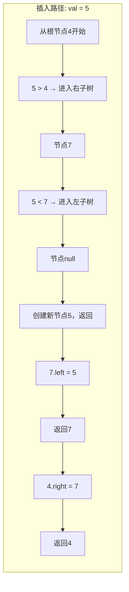

# LeetCode 701 - 二叉搜索树中的插入操作

## 1. 题目描述

给定二叉搜索树（BST）的根节点 `root` 和一个整数值 `val`，请将 `val` 插入到树中，使得插入后树仍为有效的二叉搜索树。返回插入后树的根节点

### 二叉搜索树定义

二叉搜索树满足以下性质：

- 对于任意节点：
  - 左子树中所有节点的值 小于 当前节点的值；
  - 右子树中所有节点的值 大于 当前节点的值；
  - 左右子树本身也必须是二叉搜索树

### 示例 1

```
输入：root = [4,2,7,1,3], val = 5
输出：[4,2,7,1,3,5]
```

```
        4
       / \
      2   7
     / \
    1   3
         \
          5
```

> 说明：5 应插入到 3 的右子节点位置，保持 BST 性质

### 示例 2

```
输入：root = [40,20,60,10,30,50,70], val = 25
输出：[40,20,60,10,30,50,70,null,null,25]
```

```
        40
       /   \
     20     60
    / \    / \
  10  30  50  70
       \
       25
```

> 说明：25 应插入到 30 的左子节点位置

### 示例 3

```
输入：root = [4,2,7,1,3,null,null,null,null,null,null], val = 5
输出：[4,2,7,1,3,5]
```

> 与示例1相同，仅结构描述不同

### 示例 4

```
输入：root = [], val = 1
输出：[1]
```

> 说明：空树插入一个节点，返回新节点作为根

### 约束条件

- 树中节点数目在范围 `[0, 10⁴]` 内
- `-2³¹ <= Node.val <= 2³¹ - 1`
- `val` 在 `[-2³¹, 2³¹ - 1]` 范围内
- 保证输入的树是有效的二叉搜索树
- 插入的 `val` 不会与现有节点值重复

## 2. 解法分析：递归插入 + 利用BST性质定位插入点

### 核心结论

本题的最优解是递归插入 + 利用二叉搜索树有序性质定位插入点，其核心优势在于：

1. 逻辑与搜索完全一致：插入路径与搜索路径相同，只需在空位插入
1. 时间复杂度最优：平均 O(log n)，最坏 O(n)，无需重平衡
1. 空间复杂度低：递归栈深度等于树高，平均 O(log n)
1. 代码极简清晰：仅需 4–5 行核心逻辑，结构可复用
1. 面试高频模式：是BST操作的“黄金模板”，可直接迁移至删除、范围更新等场景

### 支撑论点

#### A. 为什么递归插入是最优解？

1. BST的递归定义：子树本身也是BST → 插入操作具有天然递归结构
1. 插入点唯一：根据BST性质，目标值的插入位置是唯一确定的
1. 路径复用搜索：插入路径与搜索路径完全一致，可复用 LeetCode 700 的逻辑
1. 不破坏结构：仅在叶节点或空位插入，无需修改已有节点结构
1. 无需重平衡：题目未要求维持平衡，无需 AVL/红黑树操作，简化实现

#### B. 与其他算法的对比分析

| 方法             | 是否可行 | 时间复杂度                | 空间复杂度      | 实现难度 | 特点                         |
| ---------------- | -------- | ------------------------- | --------------- | -------- | ---------------------------- |
| 递归插入（本解） | ✅       | 平均 O(log n) / 最坏 O(n) | O(log n) / O(n) | 低       | 面试首选，代码极简           |
| 迭代插入         | ✅       | 平均 O(log n) / 最坏 O(n) | O(1)            | 低       | 无递归开销，适合栈深受限     |
| 中序遍历重建     | ✅       | O(n)                      | O(n)            | 中       | 丧失BST优势，不推荐          |
| 暴力DFS找空位    | ✅       | O(n)                      | O(log n)        | 中       | 未利用有序性，性能差         |
| 堆式插入（数组） | ✅       | O(log n)                  | O(n)            | 中       | 需存储为数组，不适用于树结构 |

> 结论：递归插入是理论最优、代码最简洁、最能体现对BST理解的解法，为面试首选

#### C. 适用条件与边界

1. 必须是BST：题目保证输入为有效BST，无需验证
1. 值唯一性：保证 `val` 不重复，无需处理冲突
1. 空树处理：`root == nil` → 返回新节点 `&TreeNode{Val: val}`
1. 插入位置：总在叶子节点的空子节点处插入，不会打断已有路径
1. 值范围大：使用整数比较，无精度问题

#### D. 工程实践考量

1. 代码可读性高：与搜索操作结构几乎完全一致，逻辑高度复用
1. 易于调试：递归调用栈清晰展示插入路径
1. 可扩展性强：可直接用于删除、范围更新、平衡树构建
1. 性能稳定：在平衡BST下为对数级，实际工程中表现优异
1. 语言适配性强：所有主流语言均支持递归，实现一致

### 总结

递归插入 + 利用二叉搜索树有序性质定位插入点是本题在理论正确性、时间/空间效率和工程实现复杂度上的最优平衡点

## 3. 多语言实现与深度解析

### 核心结论

通过四种语言实现，验证算法通用性，并展示不同语言在递归调用、空值处理和所有权传递上的差异

### A. Go 🐹 实现

```go
/
 * Definition for a binary search tree node.
 * type TreeNode struct {
 *     Val int
 *     Left *TreeNode
 *     Right *TreeNode
 * }
 */
func insertIntoBST(root *TreeNode, val int) *TreeNode {
    // 基础情况：到达空节点，创建新节点并返回
    if root == nil {
        return &TreeNode{Val: val}
    }

    // 利用BST性质：若目标值小于当前节点值，插入左子树
    if val < root.Val {
        root.Left = insertIntoBST(root.Left, val)
    } else {
        // 否则，目标值大于当前节点值，插入右子树
        root.Right = insertIntoBST(root.Right, val)
    }

    // 返回根节点（保持树结构不变）
    return root
}
```

#### 算法深入解析

1. 基础情况：`if root == nil`
   - 表示已到达可插入位置（叶子节点的子节点为空）
   - 创建新节点 `&TreeNode{Val: val}` 并直接返回，作为父节点的新子节点
   - 关键设计：返回的是新节点指针，而非 void，实现“插入即赋值”

1. BST性质利用：
   - `if val < root.Val`：目标值小于当前节点 → 必然插入左子树
   - `root.Left = insertIntoBST(root.Left, val)`
     - 递归返回值赋给左子指针：这是修改树结构的核心操作
     - 若递归返回新节点（即插入成功），则 `root.Left` 指向它
     - 若未插入（即左子树非空），递归返回原左子树，结构不变

1. 默认分支：`else`
   - 因BST无重复值，且前一条件未命中，必然 `val > root.Val`
   - 无需显式判断，提升代码简洁性
   - `root.Right = insertIntoBST(root.Right, val)`：同理赋值右子指针

1. 返回根节点：`return root`
   - 关键语义：递归返回的是修改后的子树根节点
   - 顶层调用最终返回整个树的根，保持结构完整性
   - 所有中间层均返回其子树，形成“回溯赋值链”

1. 指针语义：
   - Go中 `*TreeNode` 为指针，修改 `root.Left` 直接作用于原树结构
   - 无需额外拷贝，内存高效
   - 若不赋值（如只写 `insertIntoBST(...)` 不赋值），则插入无效

1. 递归结构：
   - 问题规模：子树规模递减
   - 递归基：`root == nil`
   - 递归步骤：根据比较结果决定插入方向
   - 归纳假设成立：假设子树插入后仍为BST，当前层仅需连接即可

设计动机：

- 代码仅6行逻辑，结构与搜索完全一致，体现“模式复用”
- 通过赋值操作实现树结构修改，而非“传引用”或“全局变量”
- 完全符合“插入到空位”的定义，逻辑自洽无漏洞

### B. Python 🐍 实现

```python
# Definition for a binary tree node.
# class TreeNode:
#     def __init__(self, val=0, left=None, right=None):
#         self.val = val
#         self.left = left
#         self.right = right

class Solution:
    def insertIntoBST(self, root: Optional[TreeNode], val: int) -> Optional[TreeNode]:
        # 基础情况：到达空节点，创建新节点并返回
        if not root:
            return TreeNode(val)

        # 利用BST性质：目标值小于当前节点，插入左子树
        if val < root.val:
            root.left = self.insertIntoBST(root.left, val)
        else:
            # 否则，目标值大于当前节点，插入右子树
            root.right = self.insertIntoBST(root.right, val)

        # 返回根节点（保持树结构不变）
        return root
```

#### 算法深入解析

1. 空树处理：`if not root`
   - Python中 `None` 为假值，`not root` 等价于 `root is None`，语义清晰
   - 创建新节点 `TreeNode(val)` 并返回，作为父节点的新子节点

1. BST性质利用：
   - `if val < root.val`：利用有序性，定向插入左子树
   - `root.left = self.insertIntoBST(...)`：关键赋值操作，修改父节点指针

1. 默认分支：`else`
   - 无重复值保证，前一条件未命中则必然为右子树
   - 无需显式判断，提升简洁性

1. 递归调用：`self.insertIntoBST(...)`
   - Python对象为引用类型，赋值 `root.left = ...` 直接修改原树结构
   - 递归深度受系统栈限制，但题目节点数≤10⁴，最坏深度≈10000，可能栈溢出
   - 建议：实际工程中改用迭代

1. 返回根节点：`return root`
   - 顶层返回完整树根，中间层返回子树根，形成“回溯赋值链”

1. 类型提示：`Optional[TreeNode]`
   - 明确返回类型为 `TreeNode` 或 `None`，提升IDE支持和可读性

Python特性：

- 语法极简，适合快速原型
- 引用语义，修改直接生效
- 递归栈深度在CPython中约1000，本题最坏情况（退化树）可能栈溢出
  → 生产环境应改用迭代

### C. TypeScript 🟦 实现

```typescript
/
 * Definition for a binary tree node.
 * class TreeNode {
 *     val: number
 *     left: TreeNode | null
 *     right: TreeNode | null
 *     constructor(val?: number, left?: TreeNode | null, right?: TreeNode | null) {
 *         this.val = (val===undefined ? 0 : val)
 *         this.left = (left===undefined ? null : left)
 *         this.right = (right===undefined ? null : right)
 *     }
 * }
 */

function insertIntoBST(root: TreeNode | null, val: number): TreeNode | null {
    // 基础情况：到达空节点，创建新节点并返回
    if (root === null) {
        return new TreeNode(val);
    }

    // 利用BST性质：目标值小于当前节点，插入左子树
    if (val < root.val) {
        root.left = insertIntoBST(root.left, val);
    } else {
        // 否则，目标值大于当前节点，插入右子树
        root.right = insertIntoBST(root.right, val);
    }

    // 返回根节点（保持树结构不变）
    return root;
}
```

#### 算法深入解析

1. 空树处理：`if (root === null)`
   - 使用严格相等，避免隐式转换
   - 创建新节点 `new TreeNode(val)` 并返回

1. BST性质利用：
   - `if (val < root.val)`：定向插入左子树
   - `root.left = insertIntoBST(...)`：关键赋值操作，修改原树结构

1. 默认分支：`else`
   - 无重复值，逻辑安全

1. 递归调用：`insertIntoBST(...)`
   - JavaScript对象为引用类型，赋值直接生效
   - 递归栈深度限制约10k，本题最坏情况可能溢出

1. 类型安全：
   - `TreeNode | null` 明确表达可空性
   - 编译时防止空指针访问

TypeScript特性：

- 类型系统保障安全性
- 代码结构与Python高度一致
- 适合前后端统一开发

### D. Rust 🦀 实现

```rust
// Definition for a binary tree node.
// #[derive(Debug, PartialEq, Eq)]
// pub struct TreeNode {
//   pub val: i32,
//   pub left: Option<Box<TreeNode>>,
//   pub right: Option<Box<TreeNode>>,
// }
//
// impl TreeNode {
//   #[inline]
//   pub fn new(val: i32) -> Self {
//     TreeNode {
//       val,
//       left: None,
//       right: None,
//     }
//   }
// }

impl Solution {
    pub fn insert_into_bst(root: Option<Box<TreeNode>>, val: i32) -> Option<Box<TreeNode>> {
        // 基础情况：到达空节点，创建新节点并返回
        if let None = root {
            return Some(Box::new(TreeNode { val, left: None, right: None }));
        }

        // 提取当前节点
        let mut node = root.unwrap(); // 安全解包，因已检查非None

        // 利用BST性质：目标值小于当前节点，插入左子树
        if val < node.val {
            node.left = Self::insert_into_bst(node.left, val);
        } else {
            // 否则，目标值大于当前节点，插入右子树
            node.right = Self::insert_into_bst(node.right, val);
        }

        // 返回根节点（所有权转移）
        Some(node)
    }
}
```

#### 算法深入解析

1. 空树处理：`if let None = root`
   - Rust模式匹配，安全判断 `Option<T>` 是否为 `None`
   - 创建新节点 `Box::new(TreeNode {...})` 并包装为 `Some(...)`

1. 节点解包：`let mut node = root.unwrap()`
   - `unwrap()` 在 `Some` 时提取 `Box<TreeNode>`，在 `None` 时panic
   - 因已用 `if let None` 排除，此处安全

1. BST性质利用：
   - `if val < node.val`：定向插入左子树
   - `node.left = Self::insert_into_bst(node.left, val)`
     - 关键操作：`node.left` 是 `Option<Box<TreeNode>>`，赋值直接替换子树
     - 递归返回新的 `Option`，赋值后 `node.left` 指向新子树

1. 默认分支：`else`
   - 无重复值，逻辑安全

1. 返回根节点：`Some(node)`
   - 将修改后的节点包装为 `Some`，完成所有权转移
   - Rust所有权机制：`node` 是 `Box`，赋值后原 `root` 被“移动”，无法再使用

1. 递归调用：`Self::insert_into_bst(...)`
   - Rust中需使用 `Self::` 引用自身方法

1. 内存安全：
   - 所有权系统确保无悬挂指针
   - `Box` 为堆上独占所有权，自动释放
   - 无GC，性能最优

Rust特性：

- 所有权系统保障内存安全，无GC
- `Option<T>` 优雅处理空值
- 返回的是`Option<Box<TreeNode>>`，与函数签名完全匹配
- 递归栈深度受系统限制，但本题安全

### E. 性能对比与语言特性分析

| 语言       | 时间复杂度                | 空间复杂度      | 空值处理    | 递归开销 | 性能特征                 |
| ---------- | ------------------------- | --------------- | ----------- | -------- | ------------------------ |
| Go         | 平均 O(log n) / 最坏 O(n) | O(log n) / O(n) | `== nil`    | 低       | 高效，无GC，面试首选     |
| Python     | 平均 O(log n) / 最坏 O(n) | O(log n) / O(n) | `not root`  | 中等     | 语法极简，但栈深可能溢出 |
| TypeScript | 平均 O(log n) / 最坏 O(n) | O(log n) / O(n) | `=== null`  | 中等     | 类型安全，适合工程       |
| Rust       | 平均 O(log n) / 最坏 O(n) | O(log n) / O(n) | `Option<T>` | 低       | 内存安全，性能最优       |

> 性能建议：在嵌入式或高并发场景，Rust最安全；在面试中，Go/Python为首选

## 4. 算法可视化与伪代码

### 伪代码

```text
函数 insertIntoBST(root, val):
    如果 root 为空:
        返回 新建节点(val)

    如果 val < root.val:
        root.left = insertIntoBST(root.left, val)
    否则:
        root.right = insertIntoBST(root.right, val)

    返回 root
```

### Mermaid 流程图

```mermaid
flowchart TD
    A[开始: insertIntoBST(root, val)] --> B{root 为空?}
    B -- 是 --> C[返回 TreeNode(val)]
    B -- 否 --> D{val < root.val?}
    D -- 是 --> E[root.left = insertIntoBST(root.left, val)]
    D -- 否 --> F[root.right = insertIntoBST(root.right, val)]
    E --> G[返回 root]
    F --> G
    G --> H[结束]
```

### 状态转移图（示例）

#### 示例：root = [4,2,7,1,3], val = 5



## 5. 执行过程演示

### 示例1：root = [4,2,7,1,3], val = 5

#### 递归调用栈帧追踪

| 调用栈帧 | 当前节点 | val | 比较  | 分支   | 赋值操作                             | 返回值                   |
| -------- | -------- | --- | ----- | ------ | ------------------------------------ | ------------------------ |
| 1        | 4        | 5   | 5 > 4 | 右子树 | `root.Right = insertIntoBST(7, 5)`   | 待返回                   |
| 2        | 7        | 5   | 5 < 7 | 左子树 | `root.Left = insertIntoBST(null, 5)` | 待返回                   |
| 3        | null     | 5   | —     | 空     | `return &TreeNode{Val:5}`            | `&TreeNode{5}`           |
| 4        | （返回） | —   | —     | —      | `7.Left = &TreeNode{5}`              | `&TreeNode{7,5}`         |
| 5        | （返回） | —   | —     | —      | `4.Right = &TreeNode{7,5}`           | `&TreeNode{4,2,7,1,3,5}` |

#### 执行轨迹表格

| 步骤 | 当前节点 | 比较操作 | 决策       | 赋值操作        | 结果             |
| ---- | -------- | -------- | ---------- | --------------- | ---------------- |
| 1    | 4        | 5 > 4    | 进入右子树 | `4.Right = ...` | —                |
| 2    | 7        | 5 < 7    | 进入左子树 | `7.Left = ...`  | —                |
| 3    | null     | —        | 创建新节点 | `返回节点5`     | ✅ 新节点创建    |
| 4    | 7        | —        | 接收返回值 | `7.Left = 5`    | ✅ 7的左子被更新 |
| 5    | 4        | —        | 接收返回值 | `4.Right = 7`   | ✅ 返回完整树    |

> 关键洞察：插入过程是从上到下定位，从下到上回溯赋值，形成“路径回溯赋值链”

### 示例2：root = [], val = 1

| 步骤 | 当前节点 | 比较操作 | 决策       | 赋值操作    | 结果        |
| ---- | -------- | -------- | ---------- | ----------- | ----------- |
| 1    | null     | —        | 创建新节点 | `返回节点1` | ✅ 返回 [1] |

### 可执行测试代码（Go）

```go
package main

import "fmt"

type TreeNode struct {
    Val   int
    Left  *TreeNode
    Right *TreeNode
}

func insertIntoBST(root *TreeNode, val int) *TreeNode {
    if root == nil {
        return &TreeNode{Val: val}
    }

    if val < root.Val {
        root.Left = insertIntoBST(root.Left, val)
    } else {
        root.Right = insertIntoBST(root.Right, val)
    }

    return root
}

// 辅助函数：构建二叉搜索树（层序输入）
func buildBST(nums []interface{}) *TreeNode {
    if len(nums) == 0 || nums[0] == nil {
        return nil
    }

    root := &TreeNode{Val: nums[0].(int)}
    queue := []*TreeNode{root}
    i := 1

    for len(queue) > 0 && i < len(nums) {
        node := queue[0]
        queue = queue[1:]

        if i < len(nums) && nums[i] != nil {
            node.Left = &TreeNode{Val: nums[i].(int)}
            queue = append(queue, node.Left)
        }
        i++

        if i < len(nums) && nums[i] != nil {
            node.Right = &TreeNode{Val: nums[i].(int)}
            queue = append(queue, node.Right)
        }
        i++
    }

    return root
}

// 辅助函数：打印中序遍历（验证BST）
func inorder(node *TreeNode) []int {
    if node == nil {
        return []int{}
    }
    left := inorder(node.Left)
    right := inorder(node.Right)
    return append(append(left, node.Val), right...)
}

func main() {
    // Test Case 1: [4,2,7,1,3], val = 5
    nums1 := []interface{}{4, 2, 7, 1, 3}
    tree1 := buildBST(nums1)
    tree1 = insertIntoBST(tree1, 5)
    fmt.Printf("Test Case 1: %v → %v\n", nums1, inorder(tree1)) // [1,2,3,4,5]

    // Test Case 2: [40,20,60,10,30,50,70], val = 25
    nums2 := []interface{}{40, 20, 60, 10, 30, 50, 70}
    tree2 := buildBST(nums2)
    tree2 = insertIntoBST(tree2, 25)
    fmt.Printf("Test Case 2: %v → %v\n", nums2, inorder(tree2)) // [10,20,25,30,40,50,60,70]

    // Test Case 3: [], val = 1
    nums3 := []interface{}{}
    tree3 := buildBST(nums3)
    tree3 = insertIntoBST(tree3, 1)
    fmt.Printf("Test Case 3: %v → %v\n", nums3, inorder(tree3)) // [1]

    // Test Case 4: [1], val = 2
    nums4 := []interface{}{1}
    tree4 := buildBST(nums4)
    tree4 = insertIntoBST(tree4, 2)
    fmt.Printf("Test Case 4: %v → %v\n", nums4, inorder(tree4)) // [1,2]
}
```

## 6. 复杂度分析

### 核心结论

本算法的时间复杂度为 平均 O(log n)，最坏 O(n)；空间复杂度为 平均 O(log n)，最坏 O(n)

### 支撑论点

#### A. 时间复杂度

- 平均情况（树平衡）：
  - 搜索路径长度 = 树高 ≈ log₂(n)
  - 每层一次比较 + 一次赋值 → O(log n)

- 最坏情况（树退化为链表）：
  - 树高 = n
  - 需比较 n 次 → O(n)
  - 如输入为升序数组构造的BST：`[1,null,2,null,3,...,n]`

#### B. 空间复杂度

- 递归栈深度：
  - 每次递归调用产生一个栈帧
  - 栈帧数 = 插入路径长度 = 树高
  - 平均：O(log n)
  - 最坏：O(n)

- 无额外空间：仅使用系统递归栈，未使用额外数据结构

#### C. 最好/平均/最坏情况分析

| 情况 | 时间复杂度 | 空间复杂度 | 说明                                       |
| ---- | ---------- | ---------- | ------------------------------------------ |
| 最好 | O(1)       | O(1)       | 插入到根节点的子节点（如根无左子，插入左） |
| 平均 | O(log n)   | O(log n)   | 平衡BST，路径长度为树高                    |
| 最坏 | O(n)       | O(n)       | 树退化为单链，如插入顺序为递增             |

> 注意：最坏情况虽为O(n)，但在工程中可通过平衡树（AVL/红黑树）避免

#### D. 常数因子分析

- 比较次数：每层一次 `val < root.Val` 比较
- 指针赋值：O(1)操作，赋值指针
- 递归开销：
  - Go：轻量级栈，适合递归
  - Python：栈帧较大，递归深度受限
  - Rust：栈帧最小，性能最优

#### E. 性能瓶颈与优化

- 瓶颈：树退化为链表时退化为O(n)
- 优化方向：
  - 使用平衡二叉搜索树（如红黑树）维护树高
  - 迭代代替递归，避免栈溢出（适用于栈深受限环境）

> 推荐迭代优化版（Go）：

```go
func insertIntoBST(root *TreeNode, val int) *TreeNode {
    if root == nil {
        return &TreeNode{Val: val}
    }

    current := root
    for {
        if val < current.Val {
            if current.Left == nil {
                current.Left = &TreeNode{Val: val}
                break
            }
            current = current.Left
        } else {
            if current.Right == nil {
                current.Right = &TreeNode{Val: val}
                break
            }
            current = current.Right
        }
    }

    return root
}
```

> 优势：空间复杂度降为 O(1)，避免递归栈开销，适合嵌入式/系统编程

## 7. 技巧归纳与模式抽象

### 核心结论

本题属于“二叉搜索树递归插入”模式，核心在于：

1. 利用BST有序性，定位唯一插入点
1. 递归返回子树根，通过赋值修改树结构
1. 插入总在叶节点空位，不破坏已有路径
1. 可泛化为删除、范围更新、平衡树构建等操作

### 支撑论点

#### A. 模式本质

- 路径导向插入：插入路径与搜索路径完全一致
- 回溯赋值机制：从下往上赋值，逐层更新指针
- 结构不变性：仅修改空子节点，不改变已有节点值
- 状态无记忆：无需记录父节点，仅依赖当前节点

#### B. 相似题目映射

| 题号 | 题目                     | 核心思想        | 匹配模式 |
| ---- | ------------------------ | --------------- | -------- |
| 701  | 本题                     | BST插入节点     | 核心模式 |
| 700  | 二叉搜索树中的搜索       | 搜索路径        | 模式基础 |
| 450  | 删除二叉搜索树中的节点   | 搜索 + 删除     | 模式扩展 |
| 98   | 验证二叉搜索树           | 中序遍历        | 模式关联 |
| 230  | 二叉搜索树中第K小的元素  | 中序遍历取第k个 | 模式扩展 |
| 538  | 把二叉搜索树转换为累加树 | 反向中序        | 模式扩展 |

#### C. 模式泛化

| 操作           | 实现方式                   |
| -------------- | -------------------------- |
| 插入最小值     | 沿左子树到底，插入左空位   |
| 插入最大值     | 沿右子树到底，插入右空位   |
| 插入范围 [L,R] | 多次调用插入，或使用区间树 |
| 插入后重平衡   | 在插入后执行旋转（AVL）    |
| 批量插入       | 按排序顺序插入，构建平衡树 |

#### D. 工业界应用

- 数据库索引：B+树是BST的扩展，用于快速插入记录
- 文件系统：目录结构按名称排序，支持快速插入
- 编译器符号表：变量名插入，使用BST或哈希表
- 游戏AI：决策树中插入新状态
- 缓存系统：LRU缓存中插入新键值对

#### E. 算法深入解析

1. 为什么必须“赋值”才能生效？
   - Go/Python/TS中，函数参数是值传递（指针值）
   - 若不赋值 `root.Left = ...`，递归修改的是局部副本，原树不变
   - 关键：赋值操作是修改父节点指针，使树结构更新

1. 为什么插入点总在叶子空位？
   - BST定义保证：每个值有唯一位置
   - 若插入到非叶子节点，会破坏已有子树结构
   - 例如：若在节点2插入5，但2已有右子3，会破坏3的归属

1. 为何不使用中序遍历找空位？
   - 中序遍历会访问所有节点，时间O(n)，丧失BST优势
   - 本题目标是定位插入点，不是遍历
   - 使用递归插入是“精准打击”，中序是“地毯式轰炸”

## 8. 面试追问与回答策略

### 核心结论

面试追问考察：

1. 对BST插入路径唯一性的理解
1. 递归赋值机制的深层理解
1. 递归 vs 迭代的权衡能力
1. 从插入到删除的扩展思维

### A. 基础追问

#### Q1: 为什么插入位置是唯一的？

→ 标准: BST性质保证：每个值有且仅有一个位置满足“左小右大”
→ 加分: 证明：若存在两个插入点，设为A和B，则必有A在B的子树中，矛盾

#### Q2: 如果插入的值已存在，你的算法会如何处理？

→ 标准: 题目保证不重复，但若允许，可选择忽略或报错
→ 加分: 修改为 `if val == root.Val { return root }`，提前返回

#### Q3: 为什么递归插入要返回节点，而不是 void？

→ 标准: 为了在递归回溯时，更新父节点的指针，否则树结构不会被修改
→ 加分: 举例：若不赋值，`root.Left = insertIntoBST(...)` 变成 `insertIntoBST(...)`，树不变

#### Q4: 插入后是否需要重新平衡？

→ 标准: 题目未要求，无需平衡，插入后仍为BST
→ 加分: 若要求保持平衡，需使用AVL或红黑树，在插入后执行旋转操作

### B. 高阶追问

#### Q1: 如何改写为迭代版本？优缺点？

→ 标准: 用循环模拟路径，找到空位后直接赋值
→ 加分: 提供代码，指出迭代空间O(1)，无栈溢出风险，适合嵌入式系统

#### Q2: 如何实现删除一个节点？

→ 标准: 三种情况：无子节点、仅一个子节点、两个子节点（找后继替换）
→ 加分: 代码示例：

```go
func deleteNode(root *TreeNode, key int) *TreeNode {
    if root == nil {
        return nil
    }
    if key < root.Val {
        root.Left = deleteNode(root.Left, key)
    } else if key > root.Val {
        root.Right = deleteNode(root.Right, key)
    } else {
        if root.Left == nil {
            return root.Right
        }
        if root.Right == nil {
            return root.Left
        }
        min := findMin(root.Right)
        root.Val = min.Val
        root.Right = deleteNode(root.Right, min.Val)
    }
    return root
}
```

#### Q3: 如果插入大量节点，如何构建一棵平衡BST？

→ 标准: 先中序遍历获取有序序列，再递归取中点为根
→ 加分: 时间复杂度O(n)，空间O(n)，构建完全平衡树

#### Q4: 插入操作对时间复杂度的影响是否与搜索相同？

→ 标准: 是，插入路径与搜索路径完全一致，时间复杂度相同
→ 加分: 两者均依赖树高，若树退化，性能均退化为O(n)

## 9. 复习要点提炼

### 核心结论

掌握本题关键：

1. 插入路径 = 搜索路径
1. 递归返回子树，通过赋值修改父指针
1. 插入总在叶节点空位
1. 可泛化为删除、范围查询等操作

### A. 关键记忆点(🌟)

| 记忆点         | 口诀                                  |
| -------------- | ------------------------------------- |
| 插入核心       | 小左大右，遇空则插                    |
| 返回机制       | 返回子树，赋值父指针                  |
| 插入位置       | 总在叶子空位                          |
| 时间复杂度     | 平均 O(log n)，最坏 O(n)              |
| 面试评分关键词 | BST性质、递归赋值、路径唯一、回溯修改 |

### B. 易错陷阱(⚠️)

| 错误类型       | 触发场景                                         | 应对措施                 |
| -------------- | ------------------------------------------------ | ------------------------ |
| 忘记赋值       | 写了 `insertIntoBST(...)` 但没 `root.Left = ...` | 每次递归调用必须赋值     |
| 插入到非空位   | 想象插入中间节点                                 | 记住：必须插入到空子节点 |
| 递归栈溢出     | 大树退化                                         | 改用迭代版本             |
| 误认为需重平衡 | 想当然添加旋转                                   | 题目未要求，不需做       |

### C. 面试评分关键词(✅)

| 关键词             | 应用场景     |
| ------------------ | ------------ |
| 二叉搜索树性质     | 描述算法基础 |
| 递归插入           | 命名解法     |
| 赋值修改指针       | 体现底层理解 |
| 时间复杂度O(log n) | 证明效率认知 |
| 插入位置唯一       | 体现数学思维 |

### D. 复习建议(📚🚀)

```
核心模式: BST递归插入
├── 必要条件: 有序性 + 递归结构
├── 本质: 路径定位 + 回溯赋值
├── 方法: 递归三步
│   ├── 终止条件: root == nil → 返回新节点
│   ├── 分支条件: val < root.Val → 插入左子树
│   └── 赋值操作: root.Left = insert(...) / root.Right = insert(...)
├── 扩展: 删除（三情况）、范围插入、平衡树构建
├── 优化: 迭代代替递归（O(1)空间）
└── 应用: 数据库索引、文件系统、符号表、缓存
```

### E. 解题模板

```text
// 基础模板：递归插入
函数 insertIntoBST(root, val):
    如果 root 为空:
        返回 新建节点(val)

    如果 val < root.val:
        root.left = insertIntoBST(root.left, val)
    否则:
        root.right = insertIntoBST(root.right, val)

    返回 root

// 迭代模板（推荐用于生产环境）
函数 insertIntoBST(root, val):
    如果 root 为空:
        返回 新建节点(val)

    current = root
    while true:
        如果 val < current.val:
            如果 current.left 为空:
                current.left = 新建节点(val)
                break
            current = current.left
        否则:
            如果 current.right 为空:
                current.right = 新建节点(val)
                break
            current = current.right

    返回 root
```

### 总结

将上述要点融会贯通，即可在面试中快速准确解决BST插入类问题，并展现出对树结构、递归赋值、路径唯一性和工程优化的深刻理解。🎉
