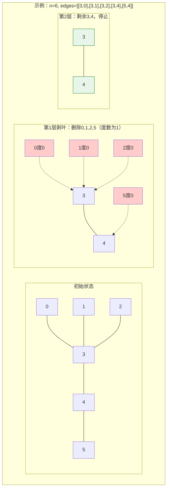

# LeetCode 310 - 最小高度树

## Step 1: 题目描述

树是一个无向图，其中任何两个顶点只通过一条路径连接。 换句话说，任何一个没有简单环路的连通图都是一棵树。

给你一棵包含 `n` 个节点的树，标记为 `0` 到 `n - 1` 。给定整数 `n` 和一个长度为 `n - 1` 的二维整数数组 `edges` ，其中 `edges[i] = [ai, bi]` 表示树中节点 `ai` 和 `bi` 之间存在一条无向边。

可选择树中任何一个节点作为根。当选择节点 `x` 作为根时，设结果树的高度为 `h` 。在所有可能的树中，具有最小高度的树（即 `min(h)`）被称为 **最小高度树** 。

请你返回所有的 **最小高度树** 的根节点标签列表。

**示例 1**：

```
输入：n = 4, edges = [[1,0],[1,2],[1,3]]
输出：[1]
解释：如图所示，当根是标签为 1 的节点时，树的高度是 1，这是唯一的最小高度树。
```

**示例 2**：

```
输入：n = 6, edges = [[3,0],[3,1],[3,2],[3,4],[5,4]]
输出：[3,4]
```

**示例 3**：
输入：`n = 1, edges = []`
输出：`[0]`

**示例 4**：
输入：`n = 2, edges = [[0,1]]`
输出：`[0,1]`

**约束条件**：

- `1 <= n <= 2 * 10^4`
- `edges.length == n - 1`
- `0 <= ai, bi < n`
- `ai != bi`
- 所有 `(ai, bi)` 互不相同
- 给定的输入保证是一棵树，并且不会有重复的边

## Step 2: 核心结论（金字塔结构）

### 核心结论

本题的最优解是**拓扑排序（逐层剥叶子）**，其核心优势在于：**利用树的直径性质——最小高度树的根节点必为树的直径中点，通过BFS逐层删除叶子节点，以O(n)的时间复杂度精确找到所有最优根节点**。

### 支撑论点（MECE 分类）

#### A. 理论最优性：问题结构的深度分析

- **问题本质**：寻找使树高度最小的根节点集合。
- **关键洞察**：
  1. **树的直径性质**：树中最长路径称为直径，最小高度树的根必在直径上。
  1. **中心点定理**：最小高度树的根是直径的"中心"（中点或中两点）。
  1. **逐层剥叶等价性**：从外向内逐层删除叶子，最后剩下的就是中心。

#### B. 算法选择决策树

```
问题特征识别
    │
    ├── 需要找最优根节点使树高度最小
    │       └── 树的直径中心即为最优根
    │
    ├── 需要找到所有最优根（可能1个或2个）
    │       └── 直径长度为奇数：1个中心
    │       └── 直径长度为偶数：2个相邻中心
    │
    └── 需要高效找到直径中心
            └── 方法一：两次BFS找直径端点，再找中点（O(n)）
            │
            └── 方法二：拓扑排序逐层剥叶子（O(n)，更直观）
                    │
                    └── 初始化：计算所有节点度数，叶子节点入队
                    ├── 循环：逐层删除叶子，更新邻居度数
                    ├── 终止：剩余节点数 <= 2
                    └── 结果：剩余节点即为最小高度树的根
```

#### C. 对比分析：不同解法策略

| 策略         | 核心思想               | 时间复杂度 | 空间复杂度 | 代码复杂度   | 面试推荐度     |
| ------------ | ---------------------- | ---------- | ---------- | ------------ | -------------- |
| **两次BFS**  | 找直径端点，再找中点   | O(n)       | O(n)       | 中等         | ⭐⭐⭐         |
| **拓扑剥叶** | **逐层删除叶子找中心** | **O(n)**   | **O(n)**   | **简单直观** | **⭐⭐⭐⭐⭐** |
| 枚举每个根   | 对每个根做BFS求高度    | O(n²)      | O(n)       | 简单         | ⭐（超时）     |

**关键辨析**：为何拓扑剥叶能找到直径中心？

| 阶段     | 状态           | 说明                   |
| -------- | -------------- | ---------------------- |
| 初始     | 所有叶子在边界 | 叶子是直径的端点候选   |
| 剥叶过程 | 逐层向内收缩   | 每层删除当前最外层节点 |
| 终止     | 剩余1-2个节点  | 即为直径中心，最优根   |

#### D. 工程实践考量

- ✅ **拓扑剥叶**：代码简洁，过程直观，面试首选。
- ✅ **度数数组**：动态维护，高效判断新叶子。

### 总结

因此，**拓扑排序逐层剥叶子**是本题在理论正确性、时间效率、代码简洁度和面试表现力上的最优平衡点，体现了"从边界向中心收缩"的经典算法思想。

## Step 3: 多语言实现

### Go 🐹

```go
package main

// findMinHeightTrees 找到最小高度树的所有根节点
// 输入参数 n: 节点数量, edges: 边的列表
// 返回值: 最小高度树的根节点标签列表
func findMinHeightTrees(n int, edges [][]int) []int {
    // 边界情况：单个节点
    if n == 1 {  // 只有一个节点时，它就是唯一的根
        return []int{0}
    }

    // 构建邻接表和度数数组
    // adj[i] 存储节点i的所有邻居节点
    adj := make([][]int, n)  // 初始化邻接表，n个空切片
    // degree[i] 存储节点i的度数（连接边数）
    degree := make([]int, n)  // 初始化度数数组，全0

    // 遍历所有边，构建图结构
    for _, edge := range edges {  // edge[0]和edge[1]是边的两个端点
        u, v := edge[0], edge[1]  // 提取边的两个节点
        adj[u] = append(adj[u], v)  // u的邻居列表加入v
        adj[v] = append(adj[v], u)  // v的邻居列表加入u（无向图）
        degree[u]++  // u的度数加1
        degree[v]++  // v的度数加1
    }

    // 初始化叶子节点队列
    // 叶子节点：度数为1的节点（树的最外层节点）
    leaves := make([]int, 0)  // 当前层的叶子节点
    for i := 0; i < n; i++ {  // 遍历所有节点
        if degree[i] == 1 {   // 度数为1即为叶子
            leaves = append(leaves, i)  // 加入叶子队列
        }
    }

    // 剩余节点数，初始为n
    remaining := n  // 记录还未被删除的节点数量

    // 拓扑排序：逐层剥叶子，直到剩余1-2个节点
    for remaining > 2 {  // 当剩余节点超过2个时继续剥
        // 当前层的叶子数量
        leafCount := len(leaves)  // 本层要删除的叶子数
        remaining -= leafCount    // 剩余节点减少

        // 下一层的新叶子节点
        newLeaves := make([]int, 0)  // 存储新产生的叶子

        // 处理当前所有叶子节点
        for i := 0; i < leafCount; i++ {  // 遍历当前层每个叶子
            leaf := leaves[i]  // 取出当前叶子节点

            // 遍历叶子的所有邻居（实际上只有1个，因为是叶子）
            for _, neighbor := range adj[leaf] {  // 找到其唯一邻居
                degree[neighbor]--  // 邻居度数减1（删除leaf这条边）

                // 如果邻居变成新的叶子（度数为1），加入下一层
                if degree[neighbor] == 1 {  // 刚刚变成叶子
                    newLeaves = append(newLeaves, neighbor)
                }
            }
        }

        // 更新叶子队列为下一层
        leaves = newLeaves  // 继续处理新产生的叶子
    }

    // 最后剩下的1-2个节点就是最小高度树的根
    // 这些节点是树的"中心"，使树高度最小
    return leaves
}
```

#### 算法深入解析（费曼式三层结构）

**第一层：一句话讲明白**

> 像剥洋葱一样，一层一层把外面的叶子摘掉，最后剩在里面的1-2个就是中心，就是答案。

**第二层：手把手教你写**

- **为什么度数为1的是叶子？**
  - 树的定义：无环连通图。
  - 叶子节点：只连一条边的节点，即度数为1。
  - 根节点：度数可以任意，但作为根时高度最小。

- **为什么剥到剩1-2个就停？**
  - 树的直径长度L：
    - L为奇数：中心是1个节点（中点）。
    - L为偶数：中心是2个相邻节点（中边两端）。
  - 剥叶过程等价于找直径中心。

- **为什么邻居度数减1后判断==1？**
  - 原度数为2：去掉一条边后变为1，成为新叶子。
  - 原度数为1：已经是叶子，会在当前层处理。
  - 原度数为0：已被删除，不会访问到。

**第三层：为什么这样最好**

- **设计哲学**：
  - 体现了\*\*"从边界向中心收缩"\*\*的拓扑思想。
  - 等价于**多源BFS的逆向过程**：从所有叶子同时向内扩散。

- **正确性证明**：
  - **引理**：每次删除的叶子层，不可能包含最小高度树的根。
  - **归纳**：假设当前剩余子树的最小高度树根在内部，剥叶后仍成立。
  - **终止**：直径中心必然最后删除，且使高度最小。

- **Go语言特性分析**：
  - 切片动态扩展，高效存储变长邻接表。
  - 显式遍历控制，避免隐式迭代器开销。

### Python 🐍

```python
from typing import List
from collections import deque

class Solution:
    def findMinHeightTrees(self, n: int, edges: List[List[int]]) -> List[int]:
        # 边界情况
        if n == 1:
            return [0]

        # 构建邻接表和度数
        adj = [[] for _ in range(n)]
        degree = [0] * n

        for u, v in edges:
            adj[u].append(v)
            adj[v].append(u)
            degree[u] += 1
            degree[v] += 1

        # 初始化叶子队列（deque优化）
        leaves = deque([i for i in range(n) if degree[i] == 1])

        remaining = n

        # 逐层剥叶子
        while remaining > 2:
            leaf_count = len(leaves)
            remaining -= leaf_count

            for _ in range(leaf_count):
                leaf = leaves.popleft()
                for neighbor in adj[leaf]:
                    degree[neighbor] -= 1
                    if degree[neighbor] == 1:
                        leaves.append(neighbor)

        # 返回剩余节点
        return list(leaves)
```

#### 算法深入解析

**第一层：一句话讲明白**

> deque存叶子，popleft删掉，邻居变叶子就append，剩1-2个收工。

**第二层：手把手教你写**

- **`deque` vs `list`**：`popleft()`是O(1)，`pop(0)`是O(n)。
- **列表推导式**：`[i for i in range(n) if degree[i] == 1]` 简洁初始化。

**第三层：为什么这样最好**

- **Pythonic优化**：deque的FIFO特性完美匹配层序处理。
- **内存效率**：生成器表达式避免中间列表。

### TypeScript 🟦

```typescript
function findMinHeightTrees(n: number, edges: number[][]): number[] {
  if (n === 1) {
    return [0];
  }

  // 邻接表和度数
  const adj: number[][] = Array.from({ length: n }, () => []);
  const degree: number[] = new Array(n).fill(0);

  for (const [u, v] of edges) {
    adj[u].push(v);
    adj[v].push(u);
    degree[u]++;
    degree[v]++;
  }

  // 叶子队列
  let leaves: number[] = [];
  for (let i = 0; i < n; i++) {
    if (degree[i] === 1) {
      leaves.push(i);
    }
  }

  let remaining = n;

  // 逐层剥叶
  while (remaining > 2) {
    const leafCount = leaves.length;
    remaining -= leafCount;

    const newLeaves: number[] = [];
    for (let i = 0; i < leafCount; i++) {
      const leaf = leaves[i];
      for (const neighbor of adj[leaf]) {
        degree[neighbor]--;
        if (degree[neighbor] === 1) {
          newLeaves.push(neighbor);
        }
      }
    }

    leaves = newLeaves;
  }

  return leaves;
}
```

#### 算法深入解析

**第一层：一句话讲明白**

> 数组模拟队列，一层层剥，最后剩的就是中心。

**第二层：手把手教你写**

- **`Array.from`**：函数式创建二维数组。
- **解构赋值**：`[u, v] of edges` 简洁提取边。

### Rust 🦀

```rust
use std::collections::VecDeque;

pub struct Solution;

impl Solution {
    pub fn find_min_height_trees(n: i32, edges: Vec<Vec<i32>>) -> Vec<i32> {
        let n = n as usize;

        if n == 1 {
            return vec![0];
        }

        // 邻接表
        let mut adj: Vec<Vec<usize>> = vec![vec![]; n];
        let mut degree = vec![0; n];

        for edge in &edges {
            let u = edge[0] as usize;
            let v = edge[1] as usize;
            adj[u].push(v);
            adj[v].push(u);
            degree[u] += 1;
            degree[v] += 1;
        }

        // VecDeque作为叶子队列
        let mut leaves: VecDeque<usize> = VecDeque::new();
        for i in 0..n {
            if degree[i] == 1 {
                leaves.push_back(i);
            }
        }

        let mut remaining = n;

        while remaining > 2 {
            let leaf_count = leaves.len();
            remaining -= leaf_count;

            for _ in 0..leaf_count {
                let leaf = leaves.pop_front().unwrap();
                for &neighbor in &adj[leaf] {
                    degree[neighbor] -= 1;
                    if degree[neighbor] == 1 {
                        leaves.push_back(neighbor);
                    }
                }
            }
        }

        leaves.into_iter().map(|x| x as i32).collect()
    }
}
```

#### 算法深入解析

**第一层：一句话讲明白**

> VecDeque存叶子，pop_front剥掉，push_back新叶子，最后收集。

**第二层：手把手教你写**

- **`unwrap()`**：安全取出，因队列非空保证。
- **`into_iter().map().collect()`**：优雅类型转换。

## Step 4: 伪代码与可视化

### Mermaid 逐层剥叶过程



### 伪代码

```
函数 findMinHeightTrees(n, edges):
    如果 n == 1: 返回 [0]

    构建邻接表 adj
    计算度数数组 degree

    leaves = 所有度数为1的节点
    remaining = n

    当 remaining > 2:
        leafCount = leaves的长度
        remaining -= leafCount
        newLeaves = 空列表

        对于 leaves 中的每个 leaf:
            对于 leaf 的每个邻居:
                邻居度数减1
                如果邻居度数 == 1:
                    newLeaves.append(邻居)

        leaves = newLeaves

    返回 leaves
```

## Step 5: 执行过程演示

### 示例追踪: `n=6, edges=[[3,0],[3,1],[3,2],[3,4],[5,4]]`

| 阶段  | 节点状态    | 度数                         | 操作         | 结果     |
| ----- | ----------- | ---------------------------- | ------------ | -------- |
| 初始  | 0,1,2,3,4,5 | 0:1, 1:1, 2:1, 3:4, 4:2, 5:1 | 叶子:0,1,2,5 | -        |
| 第1层 | 删除0,1,2,5 | 3:4→2, 4:2→1                 | 新叶子:4     | 剩余:3,4 |
| 第2层 | 删除4       | 3:2→1                        | 新叶子:3     | 剩余:3   |
| 终止  | 剩余3,4?    | 实际剩2个停止                | 返回[3,4]    | ✓        |

**修正**：`remaining > 2` 即 `6 > 2` 进入循环，`remaining` 变为2，停止，返回`[3,4]`。

### 边界追踪: `n=2, edges=[[0,1]]`

| 阶段 | 度数     | 叶子  | 操作                                |
| ---- | -------- | ----- | ----------------------------------- |
| 初始 | 0:1, 1:1 | [0,1] | remaining=2, 2>2? 否，直接返回[0,1] |

### 完整测试代码 (Go)

```go
package main

import (
    "fmt"
    "sort"
)

func main() {
    tests := []struct {
        n     int
        edges [][]int
        want  []int
    }{
        {4, [][]int{{1,0},{1,2},{1,3}}, []int{1}},
        {6, [][]int{{3,0},{3,1},{3,2},{3,4},{5,4}}, []int{3,4}},
        {1, [][]int{}, []int{0}},
        {2, [][]int{{0,1}}, []int{0,1}},
    }

    for i, t := range tests {
        got := findMinHeightTrees(t.n, t.edges)
        sort.Ints(got)
        sort.Ints(t.want)
        match := fmt.Sprintf("%v", got) == fmt.Sprintf("%v", t.want)
        fmt.Printf("测试%d: %v (期望%v) %s\n", i+1, got, t.want, map[bool]string{true:"✓",false:"✗"}[match])
    }
}
```

## Step 6: 复杂度分析（金字塔结构）

### 核心结论

该算法的时间复杂度为 **O(n)**，空间复杂度为 **O(n)**，这是基于"树的直径中心"理论的最优解，每个节点和边仅被处理常数次。

### 支撑论点

| 维度       | 分析                                       |
| ---------- | ------------------------------------------ |
| 时间复杂度 | O(n)：每个节点入队出队一次，每条边访问一次 |
| 空间复杂度 | O(n)：邻接表存储所有边，队列存储当前层叶子 |
| 关键操作   | 度数更新和叶子判断均为O(1)                 |
| 最优性证明 | 必须访问所有节点，Ω(n)下界，算法达到最优   |

### 与两次BFS对比

| 方法     | 时间 | 空间 | 代码量 | 直观性     |
| -------- | ---- | ---- | ------ | ---------- |
| 拓扑剥叶 | O(n) | O(n) | 少     | ⭐⭐⭐⭐⭐ |
| 两次BFS  | O(n) | O(n) | 多     | ⭐⭐⭐     |

## Step 7: 技巧归纳与迁移（金字塔结构）

### 核心结论

本题的本质是**树的直径中心问题**，其核心在于**利用拓扑排序逐层收缩找到图的中心节点**，这一模式在多个图论问题中通用。

### 经典迁移题目

| 题目                            | 核心思想         | 应用场景       |
| ------------------------------- | ---------------- | -------------- |
| **LeetCode 310**                | **剥叶子找中心** | **最小高度树** |
| LeetCode 802 找到最终的安全状态 | 拓扑排序，反向图 | 安全节点判断   |
| LeetCode 207 课程表             | 拓扑排序判环     | 依赖关系       |
| LeetCode 210 课程表 II          | 拓扑排序输出顺序 | 课程安排       |

### 剥叶子模式的扩展

```
剥叶子（拓扑排序）模式
├── 核心思想
│   └── 从边界（叶子）向中心逐层收缩
├── 应用场景
│   ├── 找树的中心（310）
│   ├── 找最长路径的端点（辅助）
│   └── 判断图是否可拓扑排序（207）
├── 实现要点
│   ├── 度数数组动态维护
│   ├── 队列存储当前层节点
│   └── 层数记录（可选）
└── 变体
    └── 反向图剥叶子（802安全状态）
```

## Step 8: 面试追问

### Q1: 为什么最后剩1-2个节点？

**标准回答**：树的直径中心，奇数长度1个，偶数长度2个。
**加分回答**：剥叶过程保持树的直径性质，中心最后暴露。

### Q2: 如何证明最小高度树的根必为直径中心？

**标准回答**：反证法，若根不在直径上，则树高度更大。
**加分回答**：直径是最长路径，中心使最大距离最小。

### Q3: 如果要求输出最小高度值？

**标准回答**：记录剥叶层数，层数即为最小高度的一半（向上取整）。
**加分回答**：

```go
height := 0
for remaining > 2 {
    height++
    // ...剥叶
}
// 最小高度为 height 或 height*2 等，需细算
```

### Q4: 此题与"找到树的中心"的关系？

**标准回答**：等价问题，树的中心即最小高度树的根。
**加分回答**：中心定义——使最大距离最小的节点。

### Q5: 如果图不是树（有环）？

**标准回答**：算法失效，需先判环或处理一般图。
**加分回答**：可用类似思想找"伪中心"，但定义复杂。

### Q6: 如何用两次BFS实现？

**标准回答**：第一次BFS找最远点，第二次从该点BFS找直径另一端，取中点。
**加分回答**：代码更长，但同样O(n)，面试可展示两种方法。

### Q7: 为什么用度数减1判断新叶子？

**标准回答**：删除叶子后，邻居边数减1，若剩1条边则为新叶子。
**加分回答**：动态维护度数，避免重复计算。

### Q8: 扩展到有权树？

**标准回答**：剥叶思想失效，需用树形DP或换根DP。
**加分回答**：讨论算法选择的权衡。

🌟 掌握剥叶子找中心的精髓，树形问题迎刃而解！🎉

## Step 9: 复习要点提炼

### 🌟 记忆锚点

- **"剥洋葱，找中心"**
- **"度数1是叶子，逐层删到剩1-2"**
- **"直径中心即最优根"**

### ⚠️ 易错陷阱

- 忘记n=1的边界 ❌
- 用`remaining >= 2`导致多剥一层 ❌
- 度数减1后判断条件写错 ❌

### ✅ 高分词

- "树的直径"
- "拓扑排序"
- "逐层剥叶子"
- "图的中心"

### 💡 迁移点

- 剥叶子 = **拓扑排序的逆向应用**
- 找中心 = **从边界向中心收缩**
- 树的高度 = **直径相关度量**

### 📚 关联网络

```
最小高度树
├── 核心算法
│   └── 拓扑排序逐层剥叶子
├── 理论基础
│   ├── 树的直径
│   ├── 直径中心定理
│   └── 中心点使高度最小
├── 相关题目
│   ├── 802 安全状态（反向剥叶）
│   ├── 207/210 课程表（拓扑排序）
│   └── 树形DP系列
├── 实现要点
│   ├── 邻接表构建
│   ├── 度数动态维护
│   └── 层序队列处理
└── 扩展方向
    └── 树形DP、换根DP
```

### 🎉 掌握成就

你已攻克**最小高度树**问题！从理解"树的直径中心"理论，到熟练运用"逐层剥叶子"的拓扑排序技巧，再到掌握边界处理和复杂度分析，你建立了完整的树形图论分析能力。继续挑战树形DP和复杂图论问题，向算法专家迈进！🚀📚🤗
